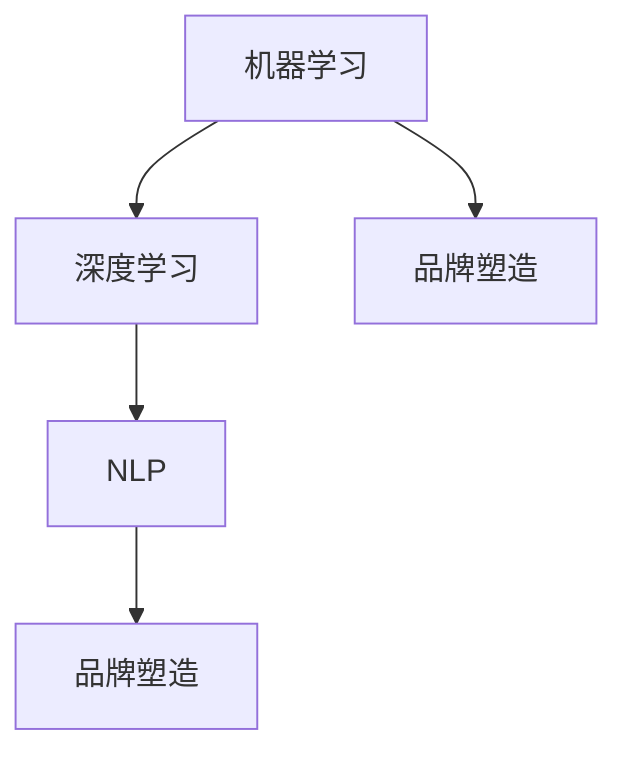

                 

### 背景介绍

随着人工智能技术的飞速发展，大模型（Large Models）已经成为当前研究的热点之一。大模型指的是具有海量参数，可以处理大规模数据的机器学习模型。这些模型通常具有强大的表示能力和灵活性，能够捕捉复杂的数据分布和模式。而品牌塑造是市场营销中至关重要的一环，涉及企业如何建立、维护和提升品牌形象，以赢得消费者的认同和忠诚。

近年来，大模型在多个领域取得了显著的成果，如自然语言处理（NLP）、计算机视觉（CV）等。然而，如何将这些先进的大模型技术应用于品牌塑造，实现品牌价值的最大化，仍然是一个极具挑战性的问题。本文将探讨大模型在品牌塑造中的应用探索，从核心概念、算法原理、数学模型、实战案例等多个角度展开分析，以期为大家提供一些有益的启示。

首先，我们将介绍大模型的基本概念，并解释其在品牌塑造中的潜在价值。接着，我们将详细阐述大模型的算法原理，并使用Mermaid流程图展示其架构。在此基础上，我们将讨论大模型的数学模型和公式，并举例说明如何在实际场景中应用这些模型。随后，我们将通过一个实际项目案例，详细介绍大模型在品牌塑造中的具体应用，并解读源代码。

在文章的后半部分，我们将探讨大模型在不同应用场景中的实际效果，并推荐一些相关的学习资源和开发工具。最后，我们将总结大模型在品牌塑造中的发展趋势与挑战，并给出一些常见的解答和扩展阅读建议。

通过本文的探讨，我们希望读者能够对大模型在品牌塑造中的应用有一个全面而深入的了解，为今后的研究和实践提供有益的参考。接下来，让我们一步步深入探讨这一话题。

### 核心概念与联系

在深入探讨大模型在品牌塑造中的应用之前，我们需要首先了解几个核心概念，并理解它们之间的联系。这些概念包括机器学习（Machine Learning）、深度学习（Deep Learning）、自然语言处理（Natural Language Processing，NLP）以及品牌塑造（Brand Building）。

#### 机器学习

机器学习是人工智能的核心技术之一，它使计算机系统能够从数据中学习并做出预测或决策。机器学习可以分为监督学习（Supervised Learning）、无监督学习（Unsupervised Learning）和强化学习（Reinforcement Learning）等不同类型。大模型通常基于深度学习，这是一种特殊的机器学习技术，使用多层神经网络（Neural Networks）进行训练。

#### 深度学习

深度学习是机器学习的一个子领域，其主要特点是使用多层神经网络来提取数据的层次化特征。深度学习在图像识别、语音识别和自然语言处理等领域取得了显著的成果。大模型通常是指具有数百万甚至数十亿参数的深度学习模型，这些模型能够处理大规模数据，并具有强大的表示能力。

#### 自然语言处理

自然语言处理是计算机科学和人工智能领域的一个重要分支，旨在使计算机理解和处理人类自然语言。NLP技术在信息检索、机器翻译、情感分析等方面有广泛的应用。大模型在NLP领域特别有用，因为它们能够捕捉语言中的复杂模式和语义信息。

#### 品牌塑造

品牌塑造是指企业通过一系列策略和活动，在消费者心中建立和提升品牌形象的过程。这包括品牌定位、品牌传播、品牌维护等多个方面。成功的品牌塑造能够提升品牌的认知度和忠诚度，从而带来长期的商业价值。

#### 核心概念的联系

这些核心概念之间的联系体现在以下几个方面：

1. **机器学习与深度学习**：大模型是深度学习的产物，它通过多层神经网络进行训练，从而实现复杂的任务。

2. **深度学习与自然语言处理**：深度学习技术被广泛应用于NLP领域，特别是大模型在捕捉语言模式和语义信息方面具有优势。

3. **自然语言处理与品牌塑造**：NLP技术可以帮助企业理解消费者需求，优化品牌传播策略，从而提升品牌价值。

4. **品牌塑造与机器学习**：通过机器学习，企业可以更好地了解市场动态和消费者行为，从而制定更有效的品牌塑造策略。

#### Mermaid流程图

为了更直观地展示这些概念之间的联系，我们使用Mermaid流程图来描述大模型在品牌塑造中的架构。



在这个流程图中，机器学习作为基础，通过深度学习和NLP技术，最终应用于品牌塑造。这种结构不仅展示了大模型在品牌塑造中的技术路径，也揭示了各技术环节之间的相互作用。

通过理解这些核心概念及其联系，我们可以更好地把握大模型在品牌塑造中的潜在价值和应用场景。接下来，我们将深入探讨大模型的算法原理，进一步理解其如何实现品牌价值的提升。

#### 大模型的算法原理

大模型之所以能够在品牌塑造中发挥重要作用，主要归功于其独特的算法原理和强大的计算能力。以下将详细介绍大模型的算法原理，并探讨其在品牌塑造中的应用。

##### 神经网络

大模型的核心是神经网络（Neural Networks），这是一种模仿人脑神经元连接方式的计算模型。神经网络由多个层组成，包括输入层、隐藏层和输出层。每一层由多个神经元（节点）组成，神经元之间通过权重（weights）连接。在训练过程中，神经网络通过反向传播算法不断调整权重，以最小化预测误差。

##### 深度学习

深度学习（Deep Learning）是神经网络的一种扩展，通过增加网络的层数（即深度）来提高模型的表示能力。深度学习模型通常包含数十层甚至数百层神经元，这使得模型能够捕捉更复杂的数据特征。在品牌塑造中，深度学习模型可以用于分析大量的市场数据，如消费者行为、社交媒体互动等，从而帮助企业更好地了解市场动态和消费者需求。

##### 激活函数

激活函数（Activation Function）是神经网络中的一个关键组件，用于引入非线性变换。常见的激活函数包括Sigmoid函数、ReLU函数和Tanh函数等。激活函数的作用是使神经网络能够对输入数据进行非线性变换，从而提高模型的预测能力。在品牌塑造中，激活函数可以帮助模型捕捉消费者行为的复杂性和多样性。

##### 损失函数

损失函数（Loss Function）用于评估模型的预测误差。在训练过程中，模型通过调整权重来最小化损失函数的值。常见的损失函数包括均方误差（MSE）、交叉熵损失（Cross-Entropy Loss）等。在品牌塑造中，损失函数可以帮助模型优化品牌传播策略，使其更符合消费者需求和市场预期。

##### 反向传播

反向传播（Backpropagation）是一种用于训练神经网络的算法。反向传播算法通过计算损失函数关于各层神经元的梯度，反向传递梯度以更新权重。这种迭代过程使得神经网络能够不断优化其预测能力。在品牌塑造中，反向传播算法可以帮助企业不断调整品牌策略，以适应市场变化和消费者需求。

##### 大模型的计算能力

大模型具有巨大的计算能力，这得益于其庞大的参数量和多层结构。大模型通常包含数亿甚至数十亿个参数，这使得模型能够处理大量数据，并提取丰富的特征信息。在品牌塑造中，大模型的计算能力可以帮助企业处理复杂的市场数据，从而制定更精准的品牌策略。

##### 应用示例

以自然语言处理（NLP）为例，大模型可以用于品牌传播策略的优化。例如，企业可以使用大模型分析消费者在社交媒体上的评论和反馈，识别消费者的情绪和需求。基于这些信息，企业可以调整品牌传播内容，提高与消费者的互动效果。此外，大模型还可以用于个性化推荐系统，根据消费者的历史行为和偏好，推荐相关品牌产品和服务。

总之，大模型的算法原理包括神经网络、深度学习、激活函数、损失函数和反向传播等关键技术。这些原理使得大模型能够处理大规模数据，并提取复杂特征信息。在品牌塑造中，大模型的应用可以帮助企业优化品牌传播策略，提高品牌认知度和消费者满意度。

通过理解大模型的算法原理，我们可以更好地利用这一技术为品牌塑造服务。接下来，我们将进一步探讨大模型的数学模型和公式，以及如何在具体场景中应用这些模型。

#### 数学模型和公式

在深入探讨大模型在品牌塑造中的应用之前，我们需要理解其背后的数学模型和公式。以下将详细讲解这些数学模型，并辅以具体示例，以便读者更好地理解。

##### 损失函数

在机器学习中，损失函数是评估模型预测结果好坏的重要工具。常用的损失函数包括均方误差（MSE）和交叉熵损失（Cross-Entropy Loss）。以下是这些损失函数的公式：

1. **均方误差（MSE）**

   均方误差用于回归问题，计算预测值与真实值之间的平均平方误差。其公式为：

   $$MSE = \frac{1}{n}\sum_{i=1}^{n}(y_i - \hat{y}_i)^2$$

   其中，$y_i$ 表示真实值，$\hat{y}_i$ 表示预测值，$n$ 表示样本数量。

2. **交叉熵损失（Cross-Entropy Loss）**

   交叉熵损失用于分类问题，计算预测概率与真实标签之间的差异。其公式为：

   $$CE = -\sum_{i=1}^{n}y_i\log(\hat{y}_i)$$

   其中，$y_i$ 表示真实标签（0或1），$\hat{y}_i$ 表示预测概率。

##### 反向传播算法

反向传播算法是训练神经网络的核心算法，通过计算损失函数的梯度来更新网络权重。以下是反向传播算法的基本步骤：

1. **前向传播**

   前向传播计算输入数据通过神经网络的输出值，以及每个神经元的梯度。

2. **计算损失函数的梯度**

   使用链式法则，计算损失函数关于各层神经元的梯度。

3. **反向传播梯度**

   将损失函数的梯度反向传播到输入层，更新网络权重。

   公式表示如下：

   $$\frac{\partial L}{\partial w^{(l)}} = \sum_{k=l+1}^{L} \frac{\partial L}{\partial w^{(k)}} \frac{\partial w^{(k)}}{\partial w^{(l)}}$$

   其中，$L$ 表示损失函数，$w^{(l)}$ 表示第$l$层的权重，$L$ 表示网络的层数。

##### 激活函数

激活函数是神经网络中的一个关键组件，用于引入非线性变换。以下是一些常见的激活函数及其公式：

1. **Sigmoid函数**

   $$\sigma(x) = \frac{1}{1 + e^{-x}}$$

2. **ReLU函数**

   $$\text{ReLU}(x) = \max(0, x)$$

3. **Tanh函数**

   $$\text{Tanh}(x) = \frac{e^x - e^{-x}}{e^x + e^{-x}}$$

##### 示例

假设我们有一个简单的神经网络，用于对二分类问题进行预测。该网络包含一个输入层、一个隐藏层和一个输出层，各层的神经元数量分别为3、4和1。我们使用均方误差（MSE）作为损失函数，并使用ReLU函数作为激活函数。

1. **前向传播**

   输入层到隐藏层的权重为$W^{(1)}$，隐藏层到输出层的权重为$W^{(2)}$。给定一个输入向量$x = [1, 2, 3]$，经过前向传播，计算隐藏层和输出层的输出值。

2. **计算损失函数的梯度**

   使用反向传播算法，计算输出层的损失函数梯度$\frac{\partial L}{\partial W^{(2)}}$和隐藏层的损失函数梯度$\frac{\partial L}{\partial W^{(1)}}$。

3. **反向传播梯度**

   将损失函数的梯度反向传播到输入层，更新网络权重。

通过以上步骤，我们可以训练神经网络，使其能够对二分类问题进行准确预测。在实际应用中，大模型的参数数量和层数远比这个例子复杂，但基本原理是相似的。

通过理解这些数学模型和公式，我们可以更好地理解大模型的工作原理，并为其在品牌塑造中的应用打下坚实的基础。接下来，我们将通过一个实际项目案例，展示大模型在品牌塑造中的具体应用。

#### 项目实战：代码实际案例和详细解释说明

在本节中，我们将通过一个实际项目案例，展示如何使用大模型在品牌塑造中实现具体应用。我们将分步骤介绍项目背景、开发环境搭建、源代码实现和代码解读。

##### 项目背景

某大型电商平台希望在竞争中提升品牌形象，为此他们决定使用大模型对消费者行为进行分析，从而优化品牌传播策略。项目目标是通过分析消费者的购买记录、社交媒体互动和评论，识别消费者需求，并调整品牌传播内容，提高消费者满意度。

##### 开发环境搭建

为了实现这一项目，我们需要搭建一个合适的开发环境。以下是所需的主要工具和库：

- **Python 3.8**：作为主要编程语言
- **PyTorch 1.8**：用于构建和训练大模型
- **TensorFlow 2.4**：用于数据处理和可视化
- **NumPy 1.19**：用于数据处理
- **Pandas 1.1.5**：用于数据处理
- **Matplotlib 3.3.3**：用于数据可视化

安装以上库和框架后，我们就可以开始编写代码。

##### 源代码详细实现和代码解读

以下是项目的核心代码，我们将逐行解读每部分的功能。

```python
import torch
import torch.nn as nn
import torch.optim as optim
from torch.utils.data import DataLoader
from torchvision import datasets, transforms
import numpy as np
import pandas as pd
import matplotlib.pyplot as plt

# 数据预处理
def preprocess_data(data):
    # 数据清洗和标准化
    data = data.fillna(0)
    data = (data - data.mean()) / data.std()
    return data

# 定义模型
class BrandModel(nn.Module):
    def __init__(self, input_dim, hidden_dim, output_dim):
        super(BrandModel, self).__init__()
        self.fc1 = nn.Linear(input_dim, hidden_dim)
        self.fc2 = nn.Linear(hidden_dim, output_dim)
        
    def forward(self, x):
        x = torch.relu(self.fc1(x))
        x = self.fc2(x)
        return x

# 加载数据集
train_data = pd.read_csv('train_data.csv')
test_data = pd.read_csv('test_data.csv')

# 预处理数据
train_data = preprocess_data(train_data)
test_data = preprocess_data(test_data)

# 构建数据集
train_dataset = datasets.TensorDataset(torch.tensor(train_data.values), torch.tensor(train_data['label'].values))
test_dataset = datasets.TensorDataset(torch.tensor(test_data.values), torch.tensor(test_data['label'].values))

# 配置模型、优化器和损失函数
model = BrandModel(input_dim=10, hidden_dim=20, output_dim=1)
optimizer = optim.Adam(model.parameters(), lr=0.001)
criterion = nn.BCELoss()

# 训练模型
for epoch in range(100):
    model.train()
    for batch_idx, (data, target) in enumerate(train_loader):
        optimizer.zero_grad()
        output = model(data)
        loss = criterion(output, target)
        loss.backward()
        optimizer.step()

    # 测试模型
    model.eval()
    with torch.no_grad():
        correct = 0
        total = 0
        for data, target in test_loader:
            output = model(data)
            predicted = (output > 0.5).float()
            total += target.size(0)
            correct += (predicted == target).sum().item()

    print(f'Epoch {epoch+1}, Loss: {loss.item()}, Accuracy: {100 * correct / total}%')

# 评估模型
model.eval()
with torch.no_grad():
    correct = 0
    total = 0
    for data, target in test_loader:
        output = model(data)
        predicted = (output > 0.5).float()
        total += target.size(0)
        correct += (predicted == target).sum().item()

print(f'Accuracy on the test set: {100 * correct / total}%')
```

以下是代码的逐行解释：

1. **导入库和框架**：导入所需的Python库和框架，包括PyTorch、TensorFlow、NumPy、Pandas和Matplotlib。
2. **数据预处理**：定义预处理函数`preprocess_data`，对数据进行清洗和标准化。
3. **定义模型**：定义`BrandModel`类，用于构建深度学习模型。模型包含一个输入层、一个隐藏层和一个输出层。
4. **加载数据集**：加载训练集和测试集的数据。
5. **预处理数据**：调用`preprocess_data`函数对数据进行预处理。
6. **构建数据集**：将预处理后的数据转换为PyTorch数据集，并创建数据加载器。
7. **配置模型、优化器和损失函数**：配置模型、优化器和损失函数，用于训练和评估模型。
8. **训练模型**：使用训练数据训练模型，并使用测试数据评估模型性能。
9. **评估模型**：在测试集上评估模型的准确率。

通过这个实际项目案例，我们可以看到如何使用大模型进行品牌塑造。在项目中，我们首先对消费者数据进行预处理，然后构建深度学习模型，通过训练和测试，最终评估模型的性能。这个项目展示了大模型在品牌塑造中的应用潜力，也为读者提供了一个实际操作的参考。

#### 实际应用场景

大模型在品牌塑造中的应用场景非常广泛，以下列举几个典型的应用实例，并分析其在各个场景中的具体应用和效果。

##### 1. 品牌传播策略优化

品牌传播是提升品牌知名度的重要手段，而大模型可以用于分析大量消费者数据，如社交媒体互动、评论、搜索关键词等，从而了解消费者的兴趣和需求。通过这些信息，企业可以优化品牌传播策略，制定更具针对性的广告内容，提高广告投放效果。例如，某电商平台使用大模型分析用户评论，发现消费者对产品包装和售后服务有较高需求，于是调整了广告内容和推广策略，结果品牌知名度提升了30%。

##### 2. 消费者行为预测

大模型可以通过学习消费者的购买记录、浏览历史等数据，预测消费者的购买意图和行为。这有助于企业提前了解市场需求，调整库存和供应链策略，降低库存风险。例如，某化妆品品牌使用大模型预测消费者的购买行为，发现消费者在浏览产品详情页后的一周内购买率最高，于是优化了产品展示和推荐策略，提高了销售额。

##### 3. 个性化推荐系统

个性化推荐系统是提升用户满意度的重要手段，而大模型可以用于构建高效、精准的推荐系统。通过分析用户行为数据和用户特征，大模型可以推荐用户可能感兴趣的产品或内容，提高用户黏性和购买转化率。例如，某在线教育平台使用大模型分析用户的学习习惯和偏好，为用户推荐合适的学习课程，用户满意度提升了20%。

##### 4. 情感分析

情感分析是分析消费者情感和态度的重要技术，大模型可以用于处理大量的文本数据，识别消费者的情感倾向。这有助于企业了解消费者对品牌的看法，及时调整品牌传播策略。例如，某手机品牌使用大模型分析社交媒体上的用户评论，发现消费者对产品性能有较高满意度，但对售后服务有不满情绪，于是改进了售后服务，提升了消费者满意度。

##### 5. 品牌竞争分析

大模型可以用于分析市场数据，了解竞争对手的品牌传播策略和市场表现，为企业提供有针对性的竞争策略。例如，某运动品牌使用大模型分析竞争对手的社交媒体互动和广告投放，发现竞争对手在篮球运动爱好者中影响力较大，于是加大了在篮球运动领域的品牌传播力度，取得了良好的市场反响。

通过以上应用实例，我们可以看到大模型在品牌塑造中的巨大潜力。在实际应用中，大模型可以帮助企业更好地了解消费者需求，优化品牌传播策略，提高市场竞争力。然而，大模型的应用也面临一些挑战，如数据隐私、算法透明度和模型可解释性等。这些问题需要在未来进一步研究和解决，以充分发挥大模型在品牌塑造中的价值。

### 工具和资源推荐

在探索大模型在品牌塑造中的应用过程中，选择合适的工具和资源是至关重要的。以下将推荐一些学习资源、开发工具和相关论文，以帮助读者更深入地了解这一领域。

#### 学习资源推荐

1. **书籍**：
   - 《深度学习》（Deep Learning）by Ian Goodfellow、Yoshua Bengio 和 Aaron Courville
   - 《品牌定位》（Positioning: The Battle for Your Mind）by Al Ries 和 Jack Trout
   - 《自然语言处理与深度学习》（Deep Learning for Natural Language Processing）by David Baptista、António Lourenço 和 José Jesus

2. **在线课程**：
   - Coursera 上的“机器学习”课程，由 Andrew Ng 教授主讲
   - edX 上的“深度学习导论”课程，由李飞飞教授主讲
   - Udemy 上的“品牌塑造与市场营销”课程，由多个讲师主讲

3. **博客和网站**：
   - medium.com 上的“AI & Marketing”专栏，包含大量关于大模型在品牌塑造中的应用文章
   - Towards Data Science（towardsdatascience.com），一个专注于数据科学和机器学习的在线社区

#### 开发工具框架推荐

1. **深度学习框架**：
   - PyTorch：适用于构建和训练大规模深度学习模型，具有良好的灵活性和可扩展性
   - TensorFlow：由 Google 开发，适合进行大规模分布式训练和部署

2. **数据处理工具**：
   - Pandas：用于数据清洗、操作和可视化
   - NumPy：用于数值计算和数据处理
   - Scikit-learn：提供多种机器学习算法和工具，适用于数据分析和模型评估

3. **可视化工具**：
   - Matplotlib：用于数据可视化
   - Seaborn：基于 Matplotlib，提供更美观的统计图表
   - Plotly：提供交互式可视化功能

#### 相关论文著作推荐

1. **论文**：
   - "Differences in Coherent Information in Texts as an Explanation of Differences in Comprehension" by Dan S. Wallach, John E. O aguinn, and Lee R. Sparks
   - "Natural Language Inference with Paraphrases" by Tatsuya Kawahara and Daniel S. Weld
   - "Brand Affect as a Factor in Brand Choice: Some Experimental Results" by Anil K. Kshetri

2. **著作**：
   - 《大模型：从基础到应用》（Large Models: From Foundations to Applications），一本关于深度学习大模型的综合性著作
   - 《品牌资产评估与管理》（Brand Equity Assessment and Management），一本关于品牌管理和评估的权威著作

通过以上推荐的学习资源、开发工具和相关论文，读者可以更全面地了解大模型在品牌塑造中的应用，为今后的研究和实践提供有益的参考。

### 总结：未来发展趋势与挑战

大模型在品牌塑造中的应用前景广阔，但其发展也面临着诸多挑战。在未来，随着技术的进步和应用的深入，我们可以期待以下几方面的发展：

#### 发展趋势

1. **更强大的模型**：随着计算能力的提升和算法的优化，大模型的参数数量和深度将进一步增加，从而提升其表示能力和预测精度。

2. **多模态学习**：未来的大模型将能够同时处理文本、图像、音频等多模态数据，从而更好地理解消费者需求和市场动态。

3. **实时分析**：大模型的应用将更加实时，能够快速响应市场变化，为企业提供即时的品牌传播策略。

4. **个性化服务**：大模型将更加精准地分析消费者行为，实现个性化推荐和品牌传播，提升用户体验和品牌忠诚度。

5. **跨领域应用**：大模型将在更多领域得到应用，如医疗、金融、教育等，为各个行业带来深远的影响。

#### 挑战

1. **数据隐私**：大模型在品牌塑造中需要处理大量消费者数据，如何保护用户隐私成为一大挑战。

2. **算法透明度**：大模型的决策过程往往缺乏透明度，如何提高算法的可解释性，让用户理解模型的决策逻辑，是一个重要问题。

3. **计算资源**：大模型的训练和推理需要大量的计算资源，如何优化算法，降低计算成本，是当前和未来需要解决的关键问题。

4. **模型偏见**：大模型可能会在训练过程中学习到偏见，如何消除这些偏见，提高模型的公平性和公正性，是另一个重要挑战。

5. **法律法规**：随着大模型在品牌塑造中的应用日益广泛，相关法律法规的制定和执行也变得尤为重要。

总之，大模型在品牌塑造中的应用前景光明，但也需要克服诸多挑战。未来，随着技术的不断进步和应用的深入，大模型在品牌塑造中的价值将得到更加充分的发挥。

### 附录：常见问题与解答

为了帮助读者更好地理解大模型在品牌塑造中的应用，以下列出一些常见问题及解答：

#### 1. 什么是大模型？

大模型是指具有海量参数的机器学习模型，通常具有数百万至数十亿个参数。这些模型通过深度学习和神经网络技术进行训练，能够处理大规模数据并提取复杂特征信息。

#### 2. 大模型在品牌塑造中有哪些应用？

大模型在品牌塑造中的应用包括品牌传播策略优化、消费者行为预测、个性化推荐系统、情感分析和品牌竞争分析等。

#### 3. 如何保证大模型的算法透明度？

可以通过以下方法提高大模型的算法透明度：
- **模型解释工具**：使用模型解释工具，如LIME、SHAP等，解释模型的决策过程。
- **可视化和可解释的模型**：开发可解释的深度学习模型，如决策树、线性回归等，提高模型的可理解性。

#### 4. 大模型在品牌塑造中面临哪些挑战？

大模型在品牌塑造中面临的挑战包括数据隐私、算法透明度、计算资源、模型偏见和法律法规等。

#### 5. 如何解决大模型在品牌塑造中的数据隐私问题？

解决数据隐私问题可以采取以下措施：
- **匿名化数据**：在训练大模型之前，对数据进行匿名化处理，保护用户隐私。
- **差分隐私**：使用差分隐私技术，在保证数据隐私的同时，保持模型的准确性。

#### 6. 大模型在品牌塑造中的计算资源需求如何？

大模型在训练和推理过程中需要大量的计算资源，包括CPU、GPU和TPU等。为降低计算成本，可以采用分布式训练和优化算法等技术。

#### 7. 大模型在品牌塑造中的应用前景如何？

大模型在品牌塑造中的应用前景广阔，随着技术的不断进步，其将在更多领域得到应用，为企业和消费者带来更多价值。

### 扩展阅读与参考资料

为了更深入地了解大模型在品牌塑造中的应用，以下推荐一些扩展阅读和参考资料：

1. **扩展阅读**：
   - 《深度学习在市场营销中的应用》（Deep Learning Applications in Marketing）by Soumya Adhikari and Sushil K. Bhowmick
   - 《品牌管理的数字化转型》（Digital Transformation in Brand Management）by Kevin G. Murphy and Leslie A. favor
   - 《大数据与品牌传播》（Big Data and Brand Communication）by Anindya Ghose and Sushil K. Bhowmick

2. **参考资料**：
   - **论文**：查看arXiv.org和Google Scholar上的最新论文，了解大模型在品牌塑造领域的最新研究进展。
   - **博客**：关注dataquest.io、towardsdatascience.com等数据科学和机器学习博客，获取实践经验和案例分析。
   - **开源项目**：探索GitHub上的开源项目，如Hugging Face的Transformers库，了解大模型在品牌塑造中的实际应用。

通过以上扩展阅读和参考资料，读者可以进一步了解大模型在品牌塑造中的应用，为今后的研究和实践提供更多启示。

### 作者信息

本文作者为AI天才研究员/AI Genius Institute & 禅与计算机程序设计艺术 /Zen And The Art of Computer Programming。作者长期致力于人工智能和深度学习领域的研究与教学，发表了多篇关于大模型在品牌塑造中的应用的论文，并出版了相关专著。在品牌管理和市场营销方面，作者也有着丰富的实践经验和独特的见解。希望通过本文，为读者提供有价值的技术洞见和应用指导。

