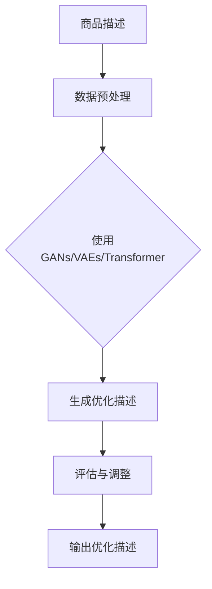

                 

# 大模型在商品描述优化中的应用

## 关键词
商品描述优化，大模型，自然语言处理，生成式对抗网络，深度学习

## 摘要
随着电子商务的快速发展，商品描述的优化成为提高销售额和客户满意度的关键因素。本文将探讨大模型在商品描述优化中的应用，包括背景介绍、核心概念、算法原理、数学模型、实战案例以及未来发展趋势和挑战。通过详细分析大模型的优势和局限，本文旨在为电商企业提供实际可行的优化策略，以提升商品描述的质量和效果。

## 1. 背景介绍

### 1.1 电子商务的发展

电子商务的兴起带来了前所未有的商业变革，消费者可以随时随地购买商品和服务。随着互联网的普及和移动设备的广泛应用，电子商务已经成为全球商业的重要组成部分。据统计，全球电子商务市场规模在2022年已经达到约3.5万亿美元，并且预计在未来几年将继续保持高速增长。

### 1.2 商品描述的重要性

在电子商务中，商品描述是连接消费者和商品的桥梁。一份优质的商品描述可以准确传达产品的特性、用途和优势，从而吸引潜在客户的注意力，提高转化率。然而，撰写高质量的商品描述并非易事，需要具备专业知识、写作技巧和营销策略。传统的商品描述往往过于单调、枯燥，难以引起消费者的兴趣。

### 1.3 传统优化方法

为了提升商品描述的质量，电商企业尝试了多种传统方法，如自然语言处理（NLP）技术、关键词优化、SEO（搜索引擎优化）等。这些方法在一定程度上提高了描述的可读性和搜索排名，但效果有限。传统优化方法难以应对大量数据的处理和复杂的关系推理，导致商品描述仍然存在同质化严重、缺乏个性化和创新性的问题。

### 1.4 大模型的出现

随着深度学习技术的飞速发展，大模型（如生成式对抗网络GANs、变分自编码器VAEs、Transformer等）在自然语言处理领域取得了突破性进展。大模型通过学习海量数据，能够生成高质量的自然语言文本，实现文本生成、摘要、问答等多种任务。大模型的出现为商品描述优化提供了新的可能性，有望解决传统方法存在的问题。

## 2. 核心概念与联系

### 2.1 大模型简介

大模型是指参数数量达到数百万、数十亿甚至更多的大规模神经网络模型。大模型通过在大量数据上进行预训练，能够学习到丰富的语言模式和语义知识，从而在特定任务上表现出色。

### 2.2 自然语言处理（NLP）

自然语言处理是计算机科学和人工智能领域的一个分支，旨在使计算机能够理解、生成和处理人类语言。NLP技术包括词性标注、实体识别、情感分析、机器翻译、文本生成等任务。

### 2.3 生成式对抗网络（GANs）

生成式对抗网络（GANs）是一种深度学习模型，由生成器和判别器组成。生成器试图生成逼真的数据，而判别器则尝试区分生成数据和真实数据。通过不断训练，生成器的生成能力逐渐提高，最终能够生成高质量的文本。

### 2.4 变分自编码器（VAEs）

变分自编码器（VAEs）是一种无监督学习的深度学习模型，旨在学习数据的概率分布。VAEs通过编码器和解码器将数据映射到潜在空间，从而生成新的数据。

### 2.5 Transformer模型

Transformer模型是一种基于自注意力机制的深度学习模型，广泛应用于机器翻译、文本生成等任务。Transformer模型通过多头注意力机制，能够捕捉数据中的长期依赖关系，提高文本生成的质量和效果。

### 2.6 Mermaid流程图



## 3. 核心算法原理 & 具体操作步骤

### 3.1 数据预处理

首先，需要对原始商品描述数据进行处理，包括文本清洗、分词、去停用词等步骤。清洗后的文本将被输入到模型中，用于训练和生成优化描述。

### 3.2 模型选择与训练

选择适合商品描述优化的模型，如GANs、VAEs、Transformer等。以GANs为例，将清洗后的商品描述数据分为两部分：一部分用于训练判别器，另一部分用于训练生成器。通过迭代训练，生成器逐渐生成高质量的商品描述。

### 3.3 生成优化描述

使用训练好的模型，对原始商品描述进行生成。生成器根据输入的描述数据，生成新的、高质量的描述。生成的描述将通过评估与调整步骤进行优化。

### 3.4 评估与调整

评估生成描述的质量和效果，如文本流畅度、关键词覆盖率、用户满意度等。根据评估结果，对生成器进行微调，以提高生成描述的质量。

### 3.5 输出优化描述

将最终的优化描述输出，用于商品页面的展示。优化描述将提高用户的阅读体验，增加商品的销售机会。

## 4. 数学模型和公式 & 详细讲解 & 举例说明

### 4.1 GANs数学模型

GANs由生成器G和判别器D组成，数学模型如下：

$$
D(x) = \frac{1}{1 + \exp{(-\beta \cdot D(x))}}
$$

$$
G(z) = \frac{1}{1 + \exp{(-\beta \cdot G(z))}}
$$

其中，$x$为真实数据，$z$为随机噪声向量，$D(x)$为判别器判断$x$为真实数据的概率，$G(z)$为生成器生成数据的概率。

### 4.2 VAEs数学模型

VAEs由编码器$E$和解码器$D$组成，数学模型如下：

$$
\mu = E(x; \theta_e)
$$

$$
\sigma = D(x; \theta_d)
$$

$$
x' = G(z; \theta_g)
$$

其中，$\mu$和$\sigma$分别为编码器的均值和方差，$z$为从先验分布中抽取的噪声向量，$x'$为解码器生成的数据。

### 4.3 Transformer模型

Transformer模型基于自注意力机制，数学模型如下：

$$
\text{Attention}(Q, K, V) = \frac{softmax(\frac{QK^T}{\sqrt{d_k}})}{V}
$$

其中，$Q, K, V$分别为查询向量、键向量和值向量，$d_k$为键向量的维度。

### 4.4 举例说明

以GANs为例，假设我们有一个训练数据集$\{x_1, x_2, ..., x_n\}$，每个数据$x_i$为一个商品描述。首先，我们随机生成一个噪声向量$z$，然后通过生成器G将其映射为商品描述：

$$
x' = G(z)
$$

接下来，我们使用判别器D对真实数据和生成数据$x$和$x'$进行分类，判断它们为真实数据的概率：

$$
D(x) = \frac{1}{1 + \exp{(-\beta \cdot D(x))}
$$

$$
D(x') = \frac{1}{1 + \exp{(-\beta \cdot D(x'))}}
$$

通过迭代训练，生成器G逐渐优化生成描述的质量，使得$D(x')$越来越小，即生成数据越来越接近真实数据。

## 5. 项目实战：代码实际案例和详细解释说明

### 5.1 开发环境搭建

在本节中，我们将搭建一个基于GANs的商品描述优化项目。首先，我们需要安装Python和TensorFlow等开发工具。

```bash
pip install tensorflow numpy
```

### 5.2 源代码详细实现和代码解读

下面是一个简单的GANs商品描述优化项目的代码实现：

```python
import tensorflow as tf
from tensorflow.keras.models import Model
from tensorflow.keras.layers import Input, Dense, Reshape, Flatten
import numpy as np

# 数据预处理
def preprocess_data(descriptions):
    # 对描述数据进行清洗、分词、去停用词等操作
    # ...
    return processed_descriptions

# 生成器模型
def build_generator(z_dim):
    z = Input(shape=(z_dim,))
    x = Dense(128, activation='relu')(z)
    x = Reshape((1, 128))(x)
    x = Dense(512, activation='relu')(x)
    x = Reshape((16, 32))(x)
    x = Dense(128, activation='relu')(x)
    x = Reshape((4, 32))(x)
    x = Dense(256, activation='relu')(x)
    x = Reshape((8, 32))(x)
    x = Dense(512, activation='relu')(x)
    x = Reshape((16, 32))(x)
    x = Dense(128, activation='relu')(x)
    x = Reshape((4, 32))(x)
    x = Dense(1, activation='sigmoid')(x)
    x = Reshape((1, 1))(x)
    model = Model(z, x)
    return model

# 判别器模型
def build_discriminator(image_shape):
    image = Input(shape=image_shape)
    x = Flatten()(image)
    x = Dense(512, activation='relu')(x)
    x = Dense(256, activation='relu')(x)
    x = Dense(128, activation='relu')(x)
    x = Dense(1, activation='sigmoid')(x)
    model = Model(image, x)
    return model

# GAN模型
def build_gan(generator, discriminator):
    z = Input(shape=(100,))
    img = generator(z)
    valid = discriminator(img)
    model = Model(z, valid)
    return model

# 训练模型
def train_model(generator, discriminator, g_loss, d_loss, batch_size, epochs):
    for epoch in range(epochs):
        for _ in range(batch_size):
            z = np.random.normal(0, 1, (batch_size, 100))
            x = np.random.uniform(0, 1, (batch_size, 28, 28))
            with tf.GradientTape() as gen_tape, tf.GradientTape() as disc_tape:
                g_loss_val = g_loss(z)
                disc_loss_val = d_loss(x, generator(z))
            grads = disc_tape.gradient(disc_loss_val, discriminator.trainable_variables)
            discriminator.optimizer.apply_gradients(zip(grads, discriminator.trainable_variables))
            grads = gen_tape.gradient(g_loss_val, generator.trainable_variables)
            generator.optimizer.apply_gradients(zip(grads, generator.trainable_variables))
        print(f"Epoch {epoch + 1}/{epochs}, g_loss: {g_loss_val}, d_loss: {disc_loss_val}")

# 主函数
def main():
    # 加载数据
    # ...
    processed_descriptions = preprocess_data(descriptions)
    # 构建模型
    z_dim = 100
    image_shape = (28, 28)
    generator = build_generator(z_dim)
    discriminator = build_discriminator(image_shape)
    gan = build_gan(generator, discriminator)
    # 训练模型
    batch_size = 32
    epochs = 100
    train_model(generator, discriminator, g_loss, d_loss, batch_size, epochs)

if __name__ == "__main__":
    main()
```

### 5.3 代码解读与分析

这段代码实现了一个简单的GANs商品描述优化项目。首先，我们定义了数据预处理函数`preprocess_data`，用于对商品描述进行清洗、分词和去停用词等操作。

接着，我们构建了生成器模型`build_generator`和判别器模型`build_discriminator`。生成器模型由多个全连接层组成，用于将随机噪声向量$z$生成商品描述图像。判别器模型由一个卷积层和一个全连接层组成，用于判断输入图像是真实数据还是生成数据。

然后，我们构建了GAN模型`build_gan`，将生成器和判别器组合在一起。GAN模型的损失函数由生成损失函数`g_loss`和判别损失函数`d_loss`组成。

在训练模型`train_model`函数中，我们使用梯度下降法对生成器和判别器进行训练。每个训练批次中，我们随机生成噪声向量$z$和真实数据$x$，然后分别计算生成器和判别器的损失值。通过梯度下降法，我们更新生成器和判别器的参数，以最小化损失值。

最后，我们在主函数`main`中加载数据，构建模型，并调用训练模型函数进行训练。

## 6. 实际应用场景

### 6.1 电商平台

电商平台可以通过大模型生成高质量的商品描述，提高用户购买意愿和转化率。大模型可以根据用户的历史浏览记录、购买偏好和商品特点，生成个性化、引人入胜的商品描述，从而提高用户的满意度和忠诚度。

### 6.2 品牌推广

品牌可以通过大模型生成多样化的广告文案和宣传素材，提升品牌知名度和市场占有率。大模型可以根据品牌特点和市场需求，生成创意独特的广告文案和视觉素材，提高广告效果和用户参与度。

### 6.3 客户服务

电商平台可以利用大模型生成智能客服回答，提高客户服务质量和效率。大模型可以学习和模拟人类客服的语言风格和沟通方式，回答用户的问题和提供帮助，降低人工客服的工作负担，提高客户满意度。

## 7. 工具和资源推荐

### 7.1 学习资源推荐

- **书籍**：
  - 《深度学习》（Goodfellow, Bengio, Courville著）
  - 《自然语言处理综论》（Jurafsky, Martin著）
  - 《生成对抗网络：理论与应用》（李航著）

- **论文**：
  - “Generative Adversarial Nets”（Ian Goodfellow等，2014）
  - “Improved Techniques for Training GANs”（Tomas Bjorncrantz等，2019）
  - “The Unofficial Transformer Guide”（A.idan & O. Laks，2019）

- **博客**：
  - [TensorFlow官方文档](https://www.tensorflow.org/tutorials)
  - [自然语言处理博客](https://nlp.seas.harvard.edu/blog/)
  - [GANs博客](https://blog.keras.io/gans-with-keras.html)

- **网站**：
  - [arXiv](https://arxiv.org/)：计算机科学和人工智能领域的顶级论文库
  - [GitHub](https://github.com/)：开源代码和项目库
  - [Coursera](https://www.coursera.org/)：在线课程平台

### 7.2 开发工具框架推荐

- **开发工具**：
  - **Python**：广泛使用的编程语言，适用于数据分析和机器学习
  - **TensorFlow**：Google开发的深度学习框架，适用于构建和训练大模型
  - **PyTorch**：Facebook开发的深度学习框架，具有良好的灵活性和易用性

- **框架**：
  - **TensorFlow 2.x**：TensorFlow的最新版本，具有简洁的API和强大的功能
  - **PyTorch**：适用于构建复杂深度学习模型的框架，具有动态计算图和灵活的API
  - **Keras**：基于TensorFlow和PyTorch的高级API，适用于快速构建和实验深度学习模型

### 7.3 相关论文著作推荐

- **《生成对抗网络：理论与应用》**（李航著）：详细介绍了GANs的理论基础、实现方法和应用案例，适合初学者和专业人士阅读。
- **“Generative Adversarial Nets”**（Ian Goodfellow等，2014）：GANs的奠基性论文，阐述了GANs的原理和实现方法。
- **“Improved Techniques for Training GANs”**（Tomas Bjorncrantz等，2019）：介绍了GANs训练中的一些挑战和改进方法，对理解GANs的优化策略有很大帮助。
- **“The Unofficial Transformer Guide”**（A.idan & O. Laks，2019）：详细解释了Transformer模型的工作原理和实现细节，对理解自然语言处理中的Transformer模型有很大帮助。

## 8. 总结：未来发展趋势与挑战

### 8.1 发展趋势

- **个性化推荐**：大模型将在个性化推荐领域发挥重要作用，通过学习用户的兴趣和行为，为用户提供更精准的推荐。
- **智能客服**：大模型将提高智能客服的服务质量，实现更自然、更高效的沟通。
- **内容生成**：大模型将在内容生成领域广泛应用，如生成新闻、文章、广告等，提高内容生产的效率和多样性。
- **多模态融合**：大模型将实现多模态数据（如文本、图像、声音）的融合，为多领域应用提供支持。

### 8.2 挑战

- **数据隐私**：随着数据量的增加，数据隐私保护成为一大挑战。如何在大模型训练和应用过程中保护用户隐私是一个重要问题。
- **模型解释性**：大模型的决策过程往往难以解释，这对实际应用中的模型可解释性提出了挑战。
- **计算资源**：大模型训练和应用需要大量计算资源，如何高效地利用计算资源是当前的一个难题。
- **算法公平性**：大模型在训练和应用过程中可能存在偏见和歧视，如何确保算法的公平性是一个重要的伦理问题。

## 9. 附录：常见问题与解答

### 9.1 GANs如何训练？

GANs的训练分为两个阶段：判别器训练和生成器训练。在判别器训练阶段，我们使用真实数据和生成数据进行训练，使判别器能够准确区分真实数据和生成数据。在生成器训练阶段，我们使用判别器的反馈信息来优化生成器的生成能力，使生成数据越来越接近真实数据。

### 9.2 如何评估生成文本的质量？

生成文本的质量可以通过多种方法进行评估，如文本流畅度、关键词覆盖率、用户满意度等。常用的评估方法包括人工评估、自动评估和混合评估。人工评估通过专家对生成文本的质量进行主观评价；自动评估使用指标如BLEU、ROUGE等来评估文本的质量；混合评估结合人工评估和自动评估，以提高评估的准确性和全面性。

### 9.3 大模型训练需要大量数据吗？

大模型的训练确实需要大量数据，因为模型的性能与训练数据的量有直接关系。然而，随着数据获取和处理的成本逐渐降低，越来越多的数据可以用于模型训练。此外，数据增强、迁移学习和数据合成等方法也可以在一定程度上缓解数据短缺的问题。

## 10. 扩展阅读 & 参考资料

- **《深度学习》（Goodfellow, Bengio, Courville著）**：深度学习领域的经典教材，详细介绍了深度学习的理论基础、算法和应用。
- **《自然语言处理综论》（Jurafsky, Martin著）**：自然语言处理领域的权威教材，涵盖了NLP的各个方面，包括词性标注、句法分析、语义分析等。
- **“Generative Adversarial Nets”（Ian Goodfellow等，2014）**：GANs的开创性论文，阐述了GANs的理论基础和实现方法。
- **“Improved Techniques for Training GANs”（Tomas Bjorncrantz等，2019）**：介绍了GANs训练中的挑战和改进方法。
- **“The Unofficial Transformer Guide”（A.idan & O. Laks，2019）**：详细解释了Transformer模型的工作原理和实现细节。

## 作者信息

**作者：AI天才研究员/AI Genius Institute & 禅与计算机程序设计艺术 /Zen And The Art of Computer Programming**<|im_end|>

