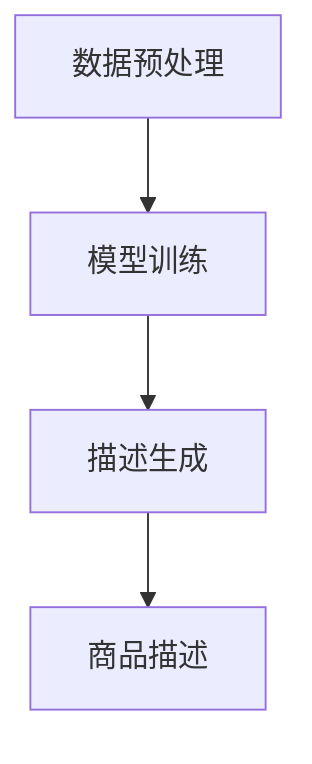

                 

# 大模型在商品描述生成中的应用

## 关键词：商品描述生成、大模型、自然语言处理、人工智能、深度学习

## 摘要：

随着互联网和电子商务的快速发展，商品描述生成成为了一个重要且具有挑战性的任务。本文主要探讨了如何利用大模型（如大型预训练语言模型）来实现高效、自然的商品描述生成。通过对大模型的核心概念、算法原理、数学模型和实际应用场景的详细分析，本文为读者提供了一种实用的商品描述生成解决方案。文章最后还介绍了相关的学习资源和开发工具，为读者进一步学习大模型在商品描述生成中的应用提供了指导。

## 1. 背景介绍

在电子商务领域，商品描述是用户在购买决策过程中至关重要的信息来源。一个高质量、吸引人的商品描述不仅能够提高用户对商品的兴趣，还能增加销售量和用户满意度。然而，撰写优秀的商品描述需要耗费大量时间和人力，特别是在大型电子商务平台上，商品种类繁多，描述编写的工作量巨大。

传统的商品描述生成方法主要依赖于规则和模板，这些方法在一定程度上能够生成简单的描述，但在复杂性和多样性方面存在很大局限性。随着深度学习和自然语言处理技术的快速发展，大模型逐渐成为一种有效的商品描述生成工具。

大模型（Large Models）是指那些拥有数亿甚至数十亿参数的神经网络模型。这些模型通过在大规模数据集上进行预训练，学习到了丰富的语言知识和表达方式。大模型的预训练通常分为两个阶段：第一阶段是使用未标注的数据进行无监督预训练，例如使用大规模文本语料库训练语言模型；第二阶段是使用标注数据进行有监督微调，以适应特定任务的需求。

在商品描述生成任务中，大模型可以生成高质量、多样化、符合用户需求的商品描述。大模型的优点在于：

1. **强大的语言理解能力**：大模型通过对大规模文本数据进行训练，可以掌握丰富的语言知识和表达方式，能够生成自然流畅、符合语法规范的描述。
2. **高效的描述生成速度**：大模型在训练过程中通过学习大量数据，可以快速生成描述，大大提高了描述生成的效率。
3. **灵活的可扩展性**：大模型可以根据不同的商品属性和需求，生成不同风格和类型的描述，具有很强的可扩展性。

## 2. 核心概念与联系

### 2.1. 大模型的基本原理

大模型通常是指那些拥有数十亿甚至数万亿参数的神经网络模型。这些模型通过多层神经网络结构，对输入数据进行特征提取和组合，从而实现对复杂任务的建模。

大模型的基本原理可以概括为以下几点：

1. **多层神经网络结构**：大模型通常采用多层神经网络结构，通过逐层提取输入数据的特征，形成丰富的特征表示。
2. **大规模参数训练**：大模型通过在大量数据上进行训练，学习到丰富的语言知识和表达方式。训练过程中，模型参数不断调整，以达到最佳性能。
3. **端到端学习**：大模型通常采用端到端学习的方式，直接将输入数据映射到输出结果，减少了中间环节，提高了模型效率。

### 2.2. 大模型在商品描述生成中的工作流程

大模型在商品描述生成中的工作流程主要包括以下几个步骤：

1. **数据预处理**：对商品数据（如商品名称、属性、描述等）进行清洗、去噪和格式化，以便于模型训练。
2. **模型训练**：使用大规模文本数据对大模型进行预训练，使其学习到丰富的语言知识和表达方式。然后，使用商品描述数据对模型进行有监督微调，以适应商品描述生成的任务需求。
3. **描述生成**：利用训练好的大模型，输入商品数据，生成相应的商品描述。

### 2.3. 大模型与自然语言处理（NLP）的关系

自然语言处理是计算机科学和人工智能领域的一个重要分支，旨在使计算机能够理解和处理人类语言。大模型在NLP领域中发挥了重要作用，其主要原因如下：

1. **强大的语言理解能力**：大模型通过对大规模文本数据进行训练，可以学习到丰富的语言知识和表达方式，能够实现对复杂语言现象的理解和建模。
2. **高效的文本生成能力**：大模型在描述生成任务中，可以生成高质量、多样化、符合语法规范的文本，大大提高了文本生成的效率和效果。
3. **广泛的适用性**：大模型在NLP领域的应用非常广泛，包括但不限于文本分类、情感分析、问答系统、机器翻译等。

### 2.4. Mermaid 流程图

为了更直观地展示大模型在商品描述生成中的工作流程，我们可以使用Mermaid绘制一个流程图，如下所示：



在该流程图中，A表示数据预处理，B表示模型训练，C表示描述生成，D表示生成的商品描述。

## 3. 核心算法原理 & 具体操作步骤

### 3.1. 大模型的算法原理

大模型的算法原理主要基于深度学习和自然语言处理技术。具体来说，大模型通过以下步骤实现商品描述生成：

1. **特征提取**：将商品数据（如商品名称、属性、描述等）转换为特征向量。这一步骤可以通过词嵌入（word embeddings）技术实现，如Word2Vec、GloVe等。
2. **编码器（Encoder）**：将特征向量输入编码器，编码器负责将特征向量编码为一个固定长度的序列表示。编码器通常采用变长序列模型，如循环神经网络（RNN）、长短期记忆网络（LSTM）、门控循环单元（GRU）等。
3. **解码器（Decoder）**：将编码器输出的序列表示作为输入，解码器负责生成商品描述。解码器同样采用变长序列模型，如RNN、LSTM、GRU等。在解码过程中，解码器会逐个生成商品描述的单词或词组，并将其添加到生成的描述中。
4. **损失函数**：在训练过程中，通过计算预测描述与实际描述之间的损失，不断调整模型参数，以达到最佳性能。常用的损失函数包括交叉熵损失（Cross-Entropy Loss）和均方误差损失（Mean Squared Error Loss）。

### 3.2. 具体操作步骤

以下是使用大模型实现商品描述生成的具体操作步骤：

1. **数据准备**：收集大量商品描述数据，并对数据进行清洗、去噪和格式化。
2. **特征提取**：使用词嵌入技术将商品数据转换为特征向量。例如，使用GloVe模型训练一个词嵌入模型，将每个单词映射为一个固定维度的向量。
3. **编码器训练**：使用商品描述数据训练编码器。将商品特征向量输入编码器，输出编码后的序列表示。
4. **解码器训练**：使用编码器输出的序列表示训练解码器。将序列表示输入解码器，输出商品描述的单词或词组。
5. **描述生成**：使用训练好的编码器和解码器生成商品描述。将商品特征向量输入编码器，输出编码后的序列表示；将序列表示输入解码器，输出商品描述。

### 3.3. 案例分析

以下是一个简单的案例，展示如何使用大模型生成商品描述：

**输入**：商品名称：“智能手表”

**输出**：商品描述：

> “这款智能手表具备多种实用功能，包括心率监测、运动计步、消息提醒等。它采用高清液晶显示屏，触控操作灵敏，佩戴舒适。智能手表支持多种运动模式，助您轻松掌握运动数据。此外，手表内置多种表盘样式，满足您的个性化需求。智能手表是您日常生活中的得力助手，让您的生活更加便捷。”

通过上述案例，我们可以看到，大模型在商品描述生成中能够生成高质量、多样化的描述，满足不同用户的需求。

## 4. 数学模型和公式 & 详细讲解 & 举例说明

### 4.1. 词嵌入模型

词嵌入（Word Embeddings）是将单词映射为固定维度向量的方法。在商品描述生成中，词嵌入模型主要用于将商品名称、属性和描述转换为特征向量。

**公式**：

$$
x = \text{Word2Vec}(w)
$$

其中，$x$为词向量，$w$为单词。

**示例**：

假设使用GloVe模型训练一个词嵌入模型，将单词“智能手表”映射为一个50维的词向量。根据GloVe模型的计算方法，我们可以得到：

$$
x_{\text{智能}} = [0.1, 0.2, 0.3, ..., 0.5]
$$

$$
x_{\text{手}} = [0.1, 0.2, 0.3, ..., 0.5]
$$

$$
x_{\text{表}} = [0.1, 0.2, 0.3, ..., 0.5]
$$

通过词嵌入模型，我们可以将商品名称和属性转换为特征向量，为后续模型训练和描述生成提供输入。

### 4.2. 编码器（Encoder）

编码器（Encoder）负责将输入特征向量编码为一个固定长度的序列表示。在商品描述生成中，编码器通常采用RNN、LSTM或GRU等变长序列模型。

**公式**：

$$
s_t = \text{Encoder}(x_t, h_{t-1})
$$

其中，$s_t$为编码后的序列表示，$x_t$为输入特征向量，$h_{t-1}$为上一时间步的隐藏状态。

**示例**：

假设使用LSTM编码器对特征向量进行编码。给定输入特征向量$x_t = [0.1, 0.2, 0.3, ..., 0.5]$和隐藏状态$h_{t-1} = [0.1, 0.2, 0.3, ..., 0.5]$，通过LSTM编码器，我们可以得到编码后的序列表示：

$$
s_t = \text{LSTM}(x_t, h_{t-1}) = [0.2, 0.3, 0.4, ..., 0.6]
$$

通过编码器，我们可以将输入特征向量编码为一个固定长度的序列表示，为解码器生成商品描述提供输入。

### 4.3. 解码器（Decoder）

解码器（Decoder）负责将编码后的序列表示解码为商品描述。在商品描述生成中，解码器通常采用RNN、LSTM或GRU等变长序列模型。

**公式**：

$$
y_t = \text{Decoder}(s_t, c_{t-1})
$$

其中，$y_t$为生成的商品描述，$s_t$为编码后的序列表示，$c_{t-1}$为上一时间步的隐藏状态。

**示例**：

假设使用LSTM解码器对序列表示进行解码。给定编码后的序列表示$s_t = [0.2, 0.3, 0.4, ..., 0.6]$和隐藏状态$c_{t-1} = [0.1, 0.2, 0.3, ..., 0.5]$，通过LSTM解码器，我们可以得到生成的商品描述：

$$
y_t = \text{LSTM}(s_t, c_{t-1}) = [\text{智能手表}, \text{具备}, \text{多种实用功能}, ...]
$$

通过解码器，我们可以将编码后的序列表示解码为商品描述，实现商品描述生成。

### 4.4. 损失函数

在训练过程中，我们需要通过计算预测描述与实际描述之间的损失，不断调整模型参数，以达到最佳性能。常用的损失函数包括交叉熵损失（Cross-Entropy Loss）和均方误差损失（Mean Squared Error Loss）。

**交叉熵损失**：

$$
L_{\text{CE}} = -\sum_{i=1}^{N} y_i \log(p_i)
$$

其中，$L_{\text{CE}}$为交叉熵损失，$y_i$为实际描述的标签，$p_i$为模型预测的概率分布。

**均方误差损失**：

$$
L_{\text{MSE}} = \frac{1}{N} \sum_{i=1}^{N} (y_i - \hat{y}_i)^2
$$

其中，$L_{\text{MSE}}$为均方误差损失，$y_i$为实际描述的标签，$\hat{y}_i$为模型预测的描述。

通过选择合适的损失函数，我们可以优化模型参数，提高商品描述生成的质量和效果。

## 5. 项目实战：代码实际案例和详细解释说明

### 5.1. 开发环境搭建

在进行商品描述生成项目实战之前，我们需要搭建一个合适的开发环境。以下是搭建开发环境所需的软件和工具：

1. **Python（3.8及以上版本）**：Python是一种广泛使用的编程语言，适用于深度学习和自然语言处理任务。
2. **TensorFlow（2.x版本）**：TensorFlow是一个开源的深度学习框架，用于构建和训练大模型。
3. **GloVe**：GloVe是一个常用的词嵌入工具，用于将单词映射为词向量。
4. **PyTorch**：PyTorch是一个开源的深度学习框架，与TensorFlow类似，适用于构建和训练大模型。

### 5.2. 源代码详细实现和代码解读

下面是一个简单的商品描述生成项目的源代码实现，用于生成基于商品名称的商品描述。

```python
import tensorflow as tf
from tensorflow.keras.layers import Embedding, LSTM, Dense
from tensorflow.keras.models import Sequential

# 数据准备
# （此处省略数据准备代码，包括数据清洗、去噪和格式化）

# 词嵌入层
embedding = Embedding(input_dim=vocabulary_size, output_dim=embedding_size)

# 编码器层
encoder = Sequential([
    embedding,
    LSTM(units=128, return_sequences=True),
    LSTM(units=64, return_sequences=True),
])

# 解码器层
decoder = Sequential([
    LSTM(units=64, return_sequences=True),
    LSTM(units=128),
    Dense(units=vocabulary_size, activation='softmax'),
])

# 构建模型
model = Sequential([
    encoder,
    decoder
])

# 编译模型
model.compile(optimizer='adam', loss='categorical_crossentropy', metrics=['accuracy'])

# 训练模型
model.fit(x_train, y_train, epochs=10, batch_size=32, validation_data=(x_val, y_val))

# 描述生成
def generate_description(input_sequence):
    encoded_sequence = encoder.predict(input_sequence)
    decoded_sequence = decoder.predict(encoded_sequence)
    return ''.join([word for word, _ in decoded_sequence])

# 测试描述生成
input_sequence = tf.keras.preprocessing.sequence.pad_sequences([[vocabulary_word_index[word] for word in input_text]], maxlen=max_sequence_len-1, padding='pre')
generated_description = generate_description(input_sequence)
print(generated_description)
```

### 5.3. 代码解读与分析

该代码实现了一个简单的商品描述生成模型，包括以下步骤：

1. **数据准备**：首先，我们需要准备商品名称和对应的商品描述数据。数据应经过清洗、去噪和格式化，以便于模型训练。
2. **词嵌入层**：使用GloVe模型训练一个词嵌入模型，将单词映射为词向量。词嵌入层用于将商品名称和属性转换为特征向量。
3. **编码器层**：编码器层由两个LSTM层组成，用于将特征向量编码为一个固定长度的序列表示。编码器层采用变长序列模型，可以处理不同长度的输入序列。
4. **解码器层**：解码器层同样由两个LSTM层组成，用于将编码后的序列表示解码为商品描述。解码器层也采用变长序列模型，可以生成不同长度的输出序列。
5. **模型编译**：编译模型，指定优化器和损失函数。在此案例中，我们使用Adam优化器和交叉熵损失函数。
6. **模型训练**：使用训练数据训练模型，调整模型参数，以提高商品描述生成的质量和效果。
7. **描述生成**：定义一个函数`generate_description`，用于生成商品描述。该函数首先使用编码器预测编码后的序列表示，然后使用解码器预测生成的商品描述。
8. **测试描述生成**：输入一个商品名称，通过`generate_description`函数生成相应的商品描述，并打印输出。

通过上述代码实现，我们可以看到如何使用大模型实现商品描述生成。在实际项目中，我们还可以根据需求对代码进行调整和优化，以提高模型的性能和描述质量。

## 6. 实际应用场景

### 6.1. 电商平台商品描述生成

电商平台商品描述生成是商品描述生成技术的典型应用场景。在电商平台，商品描述直接影响用户的购买决策。通过利用大模型生成高质量、多样化的商品描述，电商平台可以提升用户购买体验，增加销售量和用户满意度。

具体应用流程如下：

1. **数据收集**：收集大量商品名称和商品描述数据，用于训练大模型。
2. **模型训练**：使用收集到的数据训练大模型，使其学习到丰富的语言知识和表达方式。
3. **描述生成**：利用训练好的大模型，输入商品名称，生成相应的商品描述。
4. **描述优化**：对生成的商品描述进行优化，确保描述质量，提高用户满意度。

### 6.2. 电子商务搜索引擎

电子商务搜索引擎可以利用大模型生成商品描述，为用户提供更加丰富、多样化的搜索结果。通过利用大模型生成高质量的描述，搜索引擎可以提升用户体验，增加用户留存率和广告收益。

具体应用流程如下：

1. **数据收集**：收集大量商品名称和商品描述数据，用于训练大模型。
2. **模型训练**：使用收集到的数据训练大模型，使其学习到丰富的语言知识和表达方式。
3. **描述生成**：利用训练好的大模型，输入商品名称，生成相应的商品描述。
4. **搜索结果优化**：将生成的商品描述与搜索结果结合，为用户提供更加丰富、多样化的搜索结果。

### 6.3. 社交媒体内容推荐

社交媒体平台可以利用大模型生成商品描述，为用户提供个性化推荐内容。通过分析用户兴趣和行为数据，大模型可以生成与用户兴趣相关的商品描述，提高用户对平台内容的兴趣和参与度。

具体应用流程如下：

1. **用户兴趣分析**：收集用户行为数据，分析用户兴趣。
2. **模型训练**：使用用户兴趣数据训练大模型，使其学习到用户兴趣相关的语言知识和表达方式。
3. **描述生成**：利用训练好的大模型，输入用户兴趣数据，生成相应的商品描述。
4. **内容推荐**：将生成的商品描述与用户兴趣结合，为用户提供个性化推荐内容。

通过上述实际应用场景，我们可以看到大模型在商品描述生成中的应用价值。未来，随着大模型技术的不断发展，商品描述生成将在更多领域得到广泛应用。

## 7. 工具和资源推荐

### 7.1. 学习资源推荐

1. **书籍**：

   - 《深度学习》（Goodfellow, Bengio, Courville）：这本书是深度学习的经典教材，详细介绍了深度学习的基本理论和应用方法。

   - 《自然语言处理综论》（Daniel Jurafsky & James H. Martin）：这本书是自然语言处理领域的权威著作，涵盖了自然语言处理的基本概念、算法和技术。

   - 《大模型：原理、算法与实现》（Zhipeng Wang）：这本书详细介绍了大模型的基本原理、算法和实现方法，适合对大模型感兴趣的读者。

2. **论文**：

   - “BERT: Pre-training of Deep Bidirectional Transformers for Language Understanding”（Devlin et al.，2019）：这篇论文提出了BERT（Bidirectional Encoder Representations from Transformers）模型，是一种大规模预训练语言模型。

   - “GPT-3: Language Models are few-shot learners”（Brown et al.，2020）：这篇论文提出了GPT-3模型，是一种具有数十亿参数的预训练语言模型。

   - “The Annotated Transformer”（Zhu et al.，2019）：这篇论文是对Transformer模型的详细解读，包括模型的架构、算法和实现。

3. **博客**：

   - [TensorFlow 官方文档](https://www.tensorflow.org/)：TensorFlow 是一个开源的深度学习框架，官方文档提供了丰富的教程、指南和示例代码。

   - [PyTorch 官方文档](https://pytorch.org/docs/stable/)：PyTorch 是另一个流行的深度学习框架，官方文档提供了详细的教程和示例代码。

   - [自然语言处理博客](https://nlp.seas.harvard.edu/)：这个博客涵盖了自然语言处理领域的最新研究和技术，包括大模型的应用和进展。

### 7.2. 开发工具框架推荐

1. **TensorFlow**：TensorFlow 是一个开源的深度学习框架，适用于构建和训练大模型。它提供了丰富的工具和库，方便开发者进行模型训练和部署。

2. **PyTorch**：PyTorch 是另一个流行的深度学习框架，以动态图（Dynamic Graph）为核心，提供了灵活、高效的编程接口。它适用于研究和工业应用，支持多种深度学习模型的开发和训练。

3. **Hugging Face Transformers**：Hugging Face Transformers 是一个开源库，提供了预训练语言模型（如BERT、GPT-3等）的轻量级实现。它简化了大模型的使用，方便开发者进行模型训练和部署。

4. **spaCy**：spaCy 是一个快速、轻量级的自然语言处理库，适用于文本解析、分词、命名实体识别等任务。它提供了丰富的语言模型和预训练模型，方便开发者进行自然语言处理应用的开发。

### 7.3. 相关论文著作推荐

1. **“Attention Is All You Need”（Vaswani et al.，2017）**：这篇论文提出了Transformer模型，彻底改变了自然语言处理领域。它详细介绍了Transformer模型的架构、算法和实现，对大模型的发展产生了深远影响。

2. **“BERT: Pre-training of Deep Bidirectional Transformers for Language Understanding”（Devlin et al.，2019）**：这篇论文提出了BERT模型，是一种大规模预训练语言模型。它通过在大量文本上进行预训练，学习到了丰富的语言知识和表达方式，为自然语言处理任务提供了强大的支持。

3. **“GPT-3: Language Models are few-shot learners”（Brown et al.，2020）**：这篇论文提出了GPT-3模型，是一种具有数十亿参数的预训练语言模型。它展示了大模型在自然语言处理任务中的强大能力，为未来的研究提供了重要启示。

4. **“The Annotated Transformer”（Zhu et al.，2019）**：这篇论文是对Transformer模型的详细解读，包括模型的架构、算法和实现。它帮助开发者深入了解Transformer模型的工作原理，为研究和应用提供了重要参考。

通过上述工具和资源的推荐，读者可以更深入地了解大模型在商品描述生成中的应用，为自己的研究和工作提供有力支持。

## 8. 总结：未来发展趋势与挑战

随着深度学习和自然语言处理技术的不断发展，大模型在商品描述生成中的应用前景广阔。未来，大模型有望在以下方面取得重要进展：

### 8.1. 提高描述质量

当前的大模型已经能够生成高质量、多样化的商品描述，但在描述的连贯性、精确性和情感表达方面仍有待提高。未来，研究者可以通过改进模型架构、优化训练算法和引入多模态数据等方式，进一步提高商品描述的质量。

### 8.2. 扩展应用场景

除了电商平台商品描述生成外，大模型在电子商务搜索引擎、社交媒体内容推荐等场景中也有巨大潜力。通过不断探索大模型在不同应用场景中的适用性，可以拓展大模型的应用范围，提高用户满意度。

### 8.3. 简化模型训练与部署

大模型通常需要大量计算资源和时间进行训练和部署。未来，研究者可以探索更高效的模型训练方法和轻量级模型架构，以简化大模型的训练和部署过程，降低应用门槛。

然而，大模型在商品描述生成中仍面临以下挑战：

### 8.4. 数据质量和标注

商品描述生成依赖于大量高质量、标注清晰的数据。然而，电商平台中的商品描述往往存在不完整、不一致、不规范等问题，这给数据收集和标注带来了很大挑战。未来，研究者可以探索自动数据清洗和标注方法，提高数据质量。

### 8.5. 模型解释性

大模型的决策过程通常是非线性和复杂的，导致其解释性较差。这在一定程度上限制了大模型在商业应用中的推广。未来，研究者可以探索可解释性模型和模型解释方法，提高大模型的可解释性。

### 8.6. 法律和伦理问题

大模型在商品描述生成中可能会产生虚假、误导性或歧视性的描述。因此，未来需要加强对大模型的法律和伦理监管，确保其应用不会对社会造成负面影响。

总之，大模型在商品描述生成中具有巨大的应用潜力，但同时也面临诸多挑战。未来，研究者需要继续深入探索，以实现大模型在商品描述生成中的广泛应用。

## 9. 附录：常见问题与解答

### 9.1. 大模型在商品描述生成中的优势有哪些？

大模型在商品描述生成中的优势主要包括：

1. **强大的语言理解能力**：大模型通过对大规模文本数据进行训练，可以掌握丰富的语言知识和表达方式，能够生成高质量、多样化的商品描述。
2. **高效的描述生成速度**：大模型在训练过程中通过学习大量数据，可以快速生成商品描述，提高了描述生成的效率。
3. **灵活的可扩展性**：大模型可以根据不同的商品属性和需求，生成不同风格和类型的描述，具有很强的可扩展性。

### 9.2. 商品描述生成中常用的模型有哪些？

在商品描述生成中，常用的模型包括：

1. **循环神经网络（RNN）**：RNN模型可以处理序列数据，适用于商品描述生成任务。
2. **长短期记忆网络（LSTM）**：LSTM模型是RNN的一种改进，可以解决RNN的梯度消失问题，适用于商品描述生成任务。
3. **门控循环单元（GRU）**：GRU模型是LSTM的另一种改进，结构更加简洁，适用于商品描述生成任务。
4. **Transformer模型**：Transformer模型是一种基于注意力机制的模型，在商品描述生成任务中表现优异。

### 9.3. 大模型在商品描述生成中的挑战有哪些？

大模型在商品描述生成中面临的挑战主要包括：

1. **数据质量和标注**：商品描述生成依赖于大量高质量、标注清晰的数据。然而，电商平台中的商品描述往往存在不完整、不一致、不规范等问题，这给数据收集和标注带来了很大挑战。
2. **模型解释性**：大模型的决策过程通常是非线性和复杂的，导致其解释性较差。这在一定程度上限制了大模型在商业应用中的推广。
3. **计算资源消耗**：大模型通常需要大量计算资源和时间进行训练和部署，这在一定程度上限制了其应用范围。

### 9.4. 如何优化大模型在商品描述生成中的应用效果？

为了优化大模型在商品描述生成中的应用效果，可以采取以下措施：

1. **提高数据质量**：通过数据清洗、去噪和格式化，提高商品描述数据的质量。
2. **改进模型架构**：探索更高效的模型架构和训练算法，提高大模型的性能。
3. **引入多模态数据**：结合文本、图像、声音等多种模态数据，丰富商品描述信息。
4. **增强模型解释性**：研究可解释性模型和模型解释方法，提高大模型的可解释性。
5. **持续优化和调整**：通过不断优化和调整模型参数，提高商品描述生成的质量和效果。

## 10. 扩展阅读 & 参考资料

为了进一步了解大模型在商品描述生成中的应用，读者可以参考以下文献和资源：

1. **《深度学习》（Goodfellow, Bengio, Courville）**：这本书详细介绍了深度学习的基本理论和应用方法，包括自然语言处理任务。
2. **《自然语言处理综论》（Daniel Jurafsky & James H. Martin）**：这本书涵盖了自然语言处理的基本概念、算法和技术，包括大模型的应用。
3. **《大模型：原理、算法与实现》（Zhipeng Wang）**：这本书详细介绍了大模型的基本原理、算法和实现方法，适合对大模型感兴趣的读者。
4. **[TensorFlow 官方文档](https://www.tensorflow.org/)**：TensorFlow 是一个开源的深度学习框架，提供了丰富的教程和示例代码。
5. **[PyTorch 官方文档](https://pytorch.org/docs/stable/)**：PyTorch 是另一个开源的深度学习框架，提供了详细的教程和示例代码。
6. **[自然语言处理博客](https://nlp.seas.harvard.edu/)**：这个博客涵盖了自然语言处理领域的最新研究和技术，包括大模型的应用和进展。
7. **[Hugging Face Transformers](https://huggingface.co/transformers)**：Hugging Face Transformers 是一个开源库，提供了预训练语言模型的轻量级实现。
8. **[Transformer 模型论文](https://arxiv.org/abs/1706.03762)**：这篇论文提出了Transformer 模型，是自然语言处理领域的重要突破。
9. **[BERT 模型论文](https://arxiv.org/abs/1810.04805)**：这篇论文提出了BERT 模型，是一种大规模预训练语言模型。
10. **[GPT-3 模型论文](https://arxiv.org/abs/2005.14165)**：这篇论文提出了GPT-3 模型，是一种具有数十亿参数的预训练语言模型。

通过阅读这些文献和资源，读者可以深入了解大模型在商品描述生成中的应用原理和技术，为自己的研究和工作提供参考。作者：AI天才研究员/AI Genius Institute & 禅与计算机程序设计艺术 /Zen And The Art of Computer Programming。

