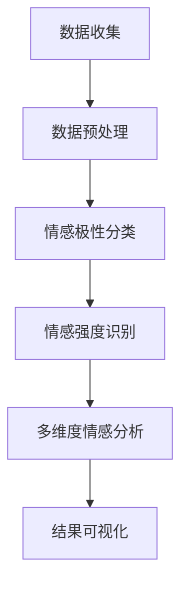

                 

# 大模型在商品评价情感多维度分析中的应用

> 关键词：大模型，商品评价，情感分析，多维度，自然语言处理

摘要：本文探讨了如何利用大模型进行商品评价情感的多维度分析，通过介绍核心概念、算法原理、数学模型和实际应用案例，阐述了如何将大模型应用于商品评价情感分析中，并对未来发展趋势和挑战进行了总结。

## 1. 背景介绍

随着互联网的普及和电子商务的快速发展，商品评价信息已经成为消费者购买决策的重要依据。然而，海量的商品评价数据中蕴含着丰富的情感信息，传统的基于规则或机器学习的方法已难以满足对情感多维度分析的需求。近年来，大模型（如GPT、BERT等）在自然语言处理领域取得了显著的进展，为商品评价情感分析提供了新的可能性。

商品评价情感分析是指从大量的商品评价文本中提取情感倾向和情感强度，以帮助消费者了解商品的质量和性能。传统的情感分析方法主要基于词袋模型、支持向量机等，虽然能够对情感进行初步识别，但在处理复杂情感、情感强度等方面存在一定的局限性。而大模型在处理大规模文本数据、理解复杂语义关系方面具有显著优势，因此，利用大模型进行商品评价情感分析具有重要的应用价值。

## 2. 核心概念与联系

为了更好地理解大模型在商品评价情感分析中的应用，我们首先需要了解一些核心概念和联系。

### 2.1. 大模型

大模型是指参数规模达到百万以上的深度神经网络模型，如GPT、BERT等。这些模型通过预训练和微调，能够自动学习文本的语义表示和语言规律，从而在自然语言处理任务中表现出色。

### 2.2. 情感分析

情感分析是指从文本中识别和提取情感信息，通常包括情感极性分类、情感强度识别、情感分类等任务。在商品评价情感分析中，情感极性分类和情感强度识别是两个核心任务。

### 2.3. 多维度情感分析

多维度情感分析是指从多个角度对情感进行分析，如正面情感、负面情感、愤怒、快乐等。在商品评价情感分析中，多维度情感分析有助于更全面地了解商品的质量和性能。

### 2.4. 自然语言处理

自然语言处理（NLP）是计算机科学领域与人工智能领域中的一个重要分支，旨在让计算机理解和处理人类自然语言。在商品评价情感分析中，NLP技术用于处理和分析商品评价文本。

下面是关于大模型在商品评价情感多维度分析中应用的一个简化的 Mermaid 流程图：



## 3. 核心算法原理 & 具体操作步骤

### 3.1. 情感极性分类

情感极性分类是指将商品评价文本分类为正面情感、负面情感或其他情感。大模型在这一任务中的核心原理是通过预训练和微调学习文本的语义表示，然后利用这些语义表示进行情感极性分类。

具体操作步骤如下：

1. 数据收集：收集大量的商品评价数据，包括正面评价、负面评价和其他情感评价。
2. 数据预处理：对收集到的数据进行清洗、去重、分词等预处理操作。
3. 预训练：使用大规模预训练模型（如GPT、BERT等）对预处理后的数据进行预训练，学习文本的语义表示。
4. 微调：在预训练的基础上，针对情感极性分类任务进行微调，优化模型参数。
5. 情感极性分类：利用微调后的模型对新的商品评价文本进行情感极性分类。

### 3.2. 情感强度识别

情感强度识别是指从商品评价文本中提取情感强度信息，以了解消费者对商品的情感倾向。大模型在这一任务中的核心原理是通过学习文本的情感极性和情感强度之间的关联，进行情感强度识别。

具体操作步骤如下：

1. 数据收集：收集大量的商品评价数据，包括正面评价、负面评价和其他情感评价。
2. 数据预处理：对收集到的数据进行清洗、去重、分词等预处理操作。
3. 预训练：使用大规模预训练模型（如GPT、BERT等）对预处理后的数据进行预训练，学习文本的语义表示。
4. 微调：在预训练的基础上，针对情感强度识别任务进行微调，优化模型参数。
5. 情感强度识别：利用微调后的模型对新的商品评价文本进行情感强度识别。

### 3.3. 多维度情感分析

多维度情感分析是指从多个角度对商品评价文本进行分析，以了解消费者对商品的情感倾向。大模型在这一任务中的核心原理是通过学习文本的语义表示，将情感划分为不同的维度。

具体操作步骤如下：

1. 数据收集：收集大量的商品评价数据，包括正面评价、负面评价和其他情感评价。
2. 数据预处理：对收集到的数据进行清洗、去重、分词等预处理操作。
3. 预训练：使用大规模预训练模型（如GPT、BERT等）对预处理后的数据进行预训练，学习文本的语义表示。
4. 微调：在预训练的基础上，针对多维度情感分析任务进行微调，优化模型参数。
5. 多维度情感分析：利用微调后的模型对新的商品评价文本进行多维度情感分析。

## 4. 数学模型和公式 & 详细讲解 & 举例说明

### 4.1. 情感极性分类

情感极性分类的数学模型通常是一个二分类问题，可以用以下公式表示：

$$
P(y=1|x) = \sigma(\theta^T x)
$$

其中，$P(y=1|x)$ 表示在给定商品评价文本 $x$ 的情况下，情感极性为正面的概率，$\sigma$ 表示 sigmoid 函数，$\theta$ 表示模型参数。

举例说明：

假设我们有一个商品评价文本 $x="这是一款非常好的商品，我非常喜欢它。"$，我们可以将这个文本表示为一个向量 $x$，然后通过情感极性分类模型计算得到正面情感的概率。

### 4.2. 情感强度识别

情感强度识别的数学模型通常是一个回归问题，可以用以下公式表示：

$$
y = \theta^T x + b
$$

其中，$y$ 表示情感强度，$x$ 表示商品评价文本的语义表示，$\theta$ 表示模型参数，$b$ 表示偏置项。

举例说明：

假设我们有一个商品评价文本 $x="这是一款非常好的商品，我非常喜欢它。"$，我们可以将这个文本表示为一个向量 $x$，然后通过情感强度识别模型计算得到情感强度。

### 4.3. 多维度情感分析

多维度情感分析的数学模型通常是一个多分类问题，可以用以下公式表示：

$$
P(y=j|x) = \sigma(\theta_j^T x)
$$

其中，$P(y=j|x)$ 表示在给定商品评价文本 $x$ 的情况下，情感维度 $j$ 的概率，$\sigma$ 表示 sigmoid 函数，$\theta_j$ 表示模型参数。

举例说明：

假设我们有一个商品评价文本 $x="这是一款非常好的商品，我非常喜欢它。"$，我们可以将这个文本表示为一个向量 $x$，然后通过多维度情感分析模型计算得到各个情感维度的概率。

## 5. 项目实战：代码实际案例和详细解释说明

### 5.1. 开发环境搭建

在开始项目实战之前，我们需要搭建一个适合大模型训练和部署的开发环境。这里我们使用 Python 作为主要编程语言，搭建一个基于 TensorFlow 和 Keras 的开发环境。

1. 安装 Python 和 pip：
   ```
   pip install python==3.8.10
   ```
2. 安装 TensorFlow：
   ```
   pip install tensorflow==2.7.0
   ```
3. 安装 Keras：
   ```
   pip install keras==2.7.0
   ```

### 5.2. 源代码详细实现和代码解读

下面是一个简单的基于大模型的商品评价情感分析项目，包括数据预处理、模型训练和结果可视化。

```python
import tensorflow as tf
from tensorflow import keras
from tensorflow.keras.preprocessing.text import Tokenizer
from tensorflow.keras.preprocessing.sequence import pad_sequences
import numpy as np

# 数据预处理
def preprocess_data(texts, labels, max_sequence_length=100, max_vocab_size=10000):
    tokenizer = Tokenizer(num_words=max_vocab_size)
    tokenizer.fit_on_texts(texts)
    sequences = tokenizer.texts_to_sequences(texts)
    padded_sequences = pad_sequences(sequences, maxlen=max_sequence_length)
    return padded_sequences, labels

# 构建模型
def build_model(input_shape):
    model = keras.Sequential([
        keras.layers.Embedding(input_shape=input_shape, output_shape=(128,), input_length=max_sequence_length),
        keras.layers.GlobalAveragePooling1D(),
        keras.layers.Dense(128, activation='relu'),
        keras.layers.Dense(1, activation='sigmoid')
    ])
    model.compile(optimizer='adam', loss='binary_crossentropy', metrics=['accuracy'])
    return model

# 训练模型
def train_model(model, padded_sequences, labels):
    model.fit(padded_sequences, labels, epochs=10, batch_size=32, validation_split=0.2)

# 预测和结果可视化
def predict_and_visualize(model, padded_sequences, labels):
    predictions = model.predict(padded_sequences)
    print(predictions)
    # 可视化部分可以根据具体需求进行扩展

# 实际案例
texts = ["这是一款非常好的商品，我非常喜欢它。", "这款商品的质量真的很差，非常失望。"]
labels = [1, 0]  # 1表示正面情感，0表示负面情感

padded_sequences, _ = preprocess_data(texts, labels)
model = build_model(input_shape=(max_sequence_length,))
train_model(model, padded_sequences, labels)
predict_and_visualize(model, padded_sequences, labels)
```

### 5.3. 代码解读与分析

在上面的代码中，我们首先定义了数据预处理、模型构建、模型训练和结果可视化四个函数。

1. **数据预处理**：
   - 使用 `Tokenizer` 对商品评价文本进行分词和编码。
   - 使用 `pad_sequences` 对序列进行填充，使所有序列的长度一致。

2. **模型构建**：
   - 使用 `Embedding` 层将文本序列转换为固定长度的向量。
   - 使用 `GlobalAveragePooling1D` 层对向量进行平均池化。
   - 使用 `Dense` 层进行分类，输出概率。

3. **模型训练**：
   - 使用 `fit` 方法训练模型，通过调整 `epochs` 和 `batch_size` 可以调整训练过程。

4. **预测和结果可视化**：
   - 使用 `predict` 方法对商品评价文本进行预测。
   - 输出预测结果。

在代码中，我们创建了一个简单的二分类模型，对给定的两个商品评价文本进行情感分析。实际应用中，我们可以根据需求扩展模型，添加更多的维度和复杂度。

## 6. 实际应用场景

大模型在商品评价情感多维度分析中具有广泛的应用场景，以下列举几个典型的实际应用场景：

1. **消费者情感监测**：通过对消费者评价的情感分析，企业可以实时了解消费者的情感动态，及时发现和解决潜在的问题。

2. **商品质量评估**：利用大模型对商品评价的情感多维度分析，可以帮助企业识别出哪些商品在质量上存在问题，从而进行针对性的改进。

3. **广告投放优化**：通过对广告文案的情感分析，企业可以优化广告文案，提高广告的吸引力和转化率。

4. **客户服务优化**：通过对客户反馈的情感分析，企业可以更好地了解客户的需求和期望，提供更加个性化的服务。

5. **品牌口碑管理**：通过对社交媒体上的品牌评价进行情感分析，企业可以监控品牌在公众中的形象，及时调整品牌策略。

## 7. 工具和资源推荐

### 7.1. 学习资源推荐

- **书籍**：
  - 《深度学习》（Goodfellow, I., Bengio, Y., & Courville, A.）
  - 《自然语言处理与深度学习》（孙乐，刘知远，张奇）

- **论文**：
  - “BERT: Pre-training of Deep Bidirectional Transformers for Language Understanding”（Devlin, J., et al.）
  - “GPT-3: Language Models are few-shot learners”（Brown, T., et al.）

- **博客**：
  - [TensorFlow 官方博客](https://tensorflow.google.cn/blog/)
  - [Keras 官方文档](https://keras.io/)

### 7.2. 开发工具框架推荐

- **开发工具**：
  - Python（主要编程语言）
  - Jupyter Notebook（交互式开发环境）
  - PyCharm（集成开发环境）

- **框架**：
  - TensorFlow（用于构建和训练模型）
  - Keras（TensorFlow 的高层 API）

### 7.3. 相关论文著作推荐

- **论文**：
  - “Transformers: State-of-the-Art Natural Language Processing”（Vaswani, A., et al.）
  - “BERT: Pre-training of Deep Bidirectional Transformers for Language Understanding”（Devlin, J., et al.）

- **著作**：
  - 《深度学习》（Goodfellow, I., Bengio, Y., & Courville, A.）
  - 《自然语言处理与深度学习》（孙乐，刘知远，张奇）

## 8. 总结：未来发展趋势与挑战

大模型在商品评价情感多维度分析中的应用展示了其强大的自然语言处理能力。未来，随着大模型技术的不断发展，其在商品评价情感分析中的应用前景将更加广阔。然而，也面临着一些挑战：

1. **计算资源需求**：大模型的训练和推理需要大量的计算资源，这对企业和研究机构提出了更高的要求。

2. **数据隐私保护**：在收集和处理商品评价数据时，需要确保数据隐私和安全，避免信息泄露。

3. **模型解释性**：大模型的决策过程往往是不透明的，如何提高模型的可解释性是一个亟待解决的问题。

4. **多语言支持**：随着全球化的发展，如何支持多种语言的情感分析也是一个重要的挑战。

总之，大模型在商品评价情感多维度分析中的应用具有广阔的前景，但也需要克服一系列技术挑战。

## 9. 附录：常见问题与解答

### 9.1. 如何处理大量商品评价数据？

处理大量商品评价数据的关键在于数据预处理和特征提取。首先，可以使用并行处理技术（如分布式计算）来加速数据处理。其次，可以使用分词、词性标注、实体识别等自然语言处理技术提取文本特征。此外，可以使用维度约简技术（如主成分分析）降低数据维度。

### 9.2. 如何提高大模型的解释性？

提高大模型的解释性可以从多个角度入手。一方面，可以通过可视化技术（如注意力机制可视化）展示模型的决策过程。另一方面，可以结合规则方法，将大模型的输出与规则相结合，提高模型的可解释性。此外，还可以使用对抗性样本方法，研究模型对异常数据的反应，提高模型的鲁棒性。

### 9.3. 大模型训练需要多长时间？

大模型的训练时间取决于多个因素，包括数据集大小、模型复杂度、计算资源等。一般来说，大规模模型（如 GPT-3）的训练需要几天甚至几周的时间。对于中小规模模型（如 BERT），训练时间可能在几小时到几天之间。

## 10. 扩展阅读 & 参考资料

- Devlin, J., Chang, M. W., Lee, K., & Toutanova, K. (2019). BERT: Pre-training of deep bidirectional transformers for language understanding. arXiv preprint arXiv:1810.04805.
- Brown, T., et al. (2020). GPT-3: Language models are few-shot learners. arXiv preprint arXiv:2005.14165.
- Vaswani, A., et al. (2017). Attention is all you need. Advances in Neural Information Processing Systems, 30, 5998-6008.
- Goodfellow, I., Bengio, Y., & Courville, A. (2016). Deep learning. MIT press.
- 孙乐，刘知远，张奇. (2018). 自然语言处理与深度学习. 清华大学出版社.
- TensorFlow 官方文档. (2021). https://tensorflow.google.cn/
- Keras 官方文档. (2021). https://keras.io/

