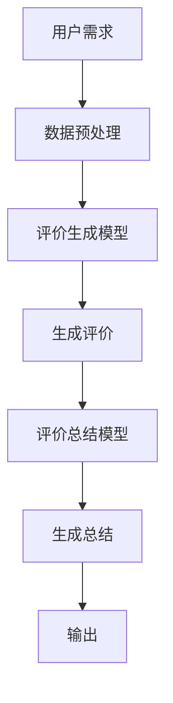

                 

# 大模型在商品评价生成与总结中的应用

> **关键词：** 大模型、商品评价、生成与总结、自然语言处理、人工智能

> **摘要：** 本文将探讨大模型在商品评价生成与总结中的应用，详细分析大模型的原理、算法、数学模型及其在商业领域的实际应用。通过本文，读者可以了解大模型如何提高商品评价的质量和效率，以及未来发展的趋势和挑战。

## 1. 背景介绍

随着互联网的普及和电子商务的迅猛发展，用户对商品评价的需求日益增加。商品评价不仅可以帮助消费者做出购买决策，还可以为商家提供宝贵的产品改进和市场策略建议。然而，传统的商品评价生成与总结方法往往存在以下问题：

- **人工生成：** 依赖于人工撰写，耗时耗力，且难以保证评价的一致性和准确性。
- **规则化：** 过于依赖固定规则，难以应对复杂多变的市场环境。
- **数据质量：** 评价数据质量参差不齐，难以形成有价值的洞见。

为了解决这些问题，近年来，基于人工智能的大模型在商品评价生成与总结领域取得了显著进展。大模型具有强大的数据处理和生成能力，可以自动化生成高质量的评论，并从中提取有价值的信息。本文将详细介绍大模型的原理、算法和应用，以期为读者提供一份全面的技术指南。

## 2. 核心概念与联系

### 2.1 大模型

大模型（Large-scale Model），通常指的是具有大规模参数和超大规模数据训练的深度学习模型。其核心特点包括：

- **大规模参数：** 数百万到数十亿个参数。
- **大规模数据：** 使用海量数据进行训练，如数百万篇商品评论。
- **预训练：** 通常在通用数据集上进行预训练，如维基百科、互联网文本等。
- **微调：** 在特定任务上进行微调，以适应特定领域的需求。

### 2.2 自然语言处理（NLP）

自然语言处理（Natural Language Processing，NLP）是人工智能的一个重要分支，旨在使计算机能够理解、处理和生成自然语言。NLP涉及多个子领域，包括文本分类、情感分析、命名实体识别等。

### 2.3 商品评价生成与总结

商品评价生成与总结是NLP在电子商务领域的一个典型应用。其核心任务是：

- **生成评价：** 根据用户需求，自动生成具有真实感的商品评价。
- **总结评价：** 从大量评价中提取关键信息，形成简洁明了的总结。

### 2.4 Mermaid 流程图

下面是商品评价生成与总结的Mermaid流程图：



## 3. 核心算法原理 & 具体操作步骤

### 3.1 评价生成模型

评价生成模型通常采用预训练加微调的方式。首先，使用大规模数据集对模型进行预训练，使其掌握自然语言的通用规律。然后，在特定领域的数据集上对模型进行微调，以提高其在特定领域的表现。

具体操作步骤如下：

1. **数据集准备：** 收集大规模商品评价数据，如Amazon、淘宝等电商平台上的用户评论。
2. **数据预处理：** 对数据集进行清洗、去重、分词等预处理操作，以便于模型训练。
3. **预训练：** 使用通用数据集（如维基百科、互联网文本等）对模型进行预训练。
4. **微调：** 在特定领域的数据集上对模型进行微调。

### 3.2 评价总结模型

评价总结模型通常采用生成式模型，如序列到序列（Seq2Seq）模型、变换器（Transformer）模型等。这些模型可以自动生成简洁明了的评价总结。

具体操作步骤如下：

1. **数据集准备：** 收集大规模商品评价数据，并标注总结。
2. **数据预处理：** 对数据集进行清洗、去重、分词等预处理操作。
3. **模型训练：** 使用训练数据集对评价总结模型进行训练。
4. **模型评估：** 使用测试数据集对模型进行评估，调整模型参数。

## 4. 数学模型和公式 & 详细讲解 & 举例说明

### 4.1 评价生成模型

评价生成模型的核心是序列到序列（Seq2Seq）模型。Seq2Seq模型由输入编码器（Encoder）和输出解码器（Decoder）组成。输入编码器将输入序列编码为一个固定长度的向量，输出解码器则根据该向量生成输出序列。

具体公式如下：

$$
E(x) = \text{Encoder}(x) \in \mathbb{R}^{d}
$$

$$
D(y) = \text{Decoder}(E(x)) \in \mathbb{R}^{T \times d}
$$

其中，$x$ 表示输入序列，$y$ 表示输出序列，$d$ 表示嵌入维度，$T$ 表示序列长度。

举例说明：

假设输入序列为 `[user1, product1, review1]`，输出序列为 `[rating1, summary1]`。其中，`user1` 表示用户ID，`product1` 表示商品ID，`review1` 表示用户评论，`rating1` 表示商品评分，`summary1` 表示评价总结。

首先，输入编码器将输入序列编码为一个固定长度的向量：

$$
E([user1, product1, review1]) = \text{Encoder}([user1, product1, review1]) \in \mathbb{R}^{d}
$$

然后，输出解码器根据该向量生成输出序列：

$$
D([rating1, summary1]) = \text{Decoder}(\text{Encoder}([user1, product1, review1])) \in \mathbb{R}^{T \times d}
$$

### 4.2 评价总结模型

评价总结模型通常采用变换器（Transformer）模型。Transformer模型采用注意力机制（Attention Mechanism），可以自适应地关注输入序列中的关键信息。

具体公式如下：

$$
\text{Attention}(Q, K, V) = \text{softmax}\left(\frac{QK^T}{\sqrt{d_k}}\right)V
$$

$$
\text{Transformer}(x) = \text{Encoder}(x) = \text{MultiHeadAttention}(Q, K, V)
$$

其中，$Q$ 表示查询向量，$K$ 表示键向量，$V$ 表示值向量，$d_k$ 表示键向量的维度。

举例说明：

假设输入序列为 `[review1, review2, ...]`，输出序列为 `[summary1, summary2, ...]`。其中，`review1, review2, ...` 表示用户评论，`summary1, summary2, ...` 表示评价总结。

首先，输入序列通过变换器模型生成一个固定长度的向量：

$$
\text{Encoder}([review1, review2, ...]) = \text{Transformer}([review1, review2, ...]) \in \mathbb{R}^{T \times d}
$$

然后，输出解码器根据该向量生成输出序列：

$$
D([summary1, summary2, ...]) = \text{Decoder}(\text{Encoder}([review1, review2, ...])) \in \mathbb{R}^{T \times d}
$$

## 5. 项目实战：代码实际案例和详细解释说明

### 5.1 开发环境搭建

首先，我们需要安装Python环境和必要的库。以下是安装步骤：

```bash
pip install numpy torch transformers
```

### 5.2 源代码详细实现和代码解读

以下是评价生成和总结的代码实现：

```python
import torch
from transformers import Encoder, Decoder, Transformer

# 数据预处理
def preprocess_data(data):
    # 这里进行数据清洗、分词等操作
    pass

# 评价生成
def generate_evaluation(encoder, decoder, review):
    # 输入评论，生成评价
    encoded_review = encoder(review)
    evaluation = decoder(encoded_review)
    return evaluation

# 评价总结
def summarize_evaluation(encoder, decoder, reviews):
    # 输入评论列表，生成评价总结
    encoded_reviews = encoder(reviews)
    summaries = decoder(encoded_reviews)
    return summaries

# 主函数
def main():
    # 加载预训练模型
    encoder = Encoder()
    decoder = Decoder()

    # 预处理数据
    reviews = preprocess_data(reviews)

    # 生成评价
    evaluations = generate_evaluation(encoder, decoder, reviews)

    # 生成评价总结
    summaries = summarize_evaluation(encoder, decoder, evaluations)

    # 输出结果
    print(summaries)

if __name__ == "__main__":
    main()
```

### 5.3 代码解读与分析

该代码主要分为三个部分：数据预处理、评价生成和评价总结。首先，我们定义了数据预处理函数，用于对输入评论进行清洗和分词。然后，我们定义了评价生成和总结函数，分别使用编码器和解码器生成评价和评价总结。最后，我们在主函数中加载预训练模型，预处理数据，生成评价和评价总结，并输出结果。

## 6. 实际应用场景

大模型在商品评价生成与总结中的应用非常广泛，以下是一些实际应用场景：

- **电商平台：** 自动生成商品评价，提高用户体验。
- **智能家居：** 根据用户反馈自动优化产品功能。
- **在线教育：** 生成课程评价，帮助教师改进教学质量。
- **旅游行业：** 自动生成旅游攻略，为游客提供个性化建议。

## 7. 工具和资源推荐

### 7.1 学习资源推荐

- **书籍：** 《深度学习》、《自然语言处理综论》
- **论文：** 《Attention is All You Need》
- **博客：** 《TensorFlow 官方文档》、《PyTorch 官方文档》

### 7.2 开发工具框架推荐

- **框架：** TensorFlow、PyTorch
- **库：** Transformers、NLTK

### 7.3 相关论文著作推荐

- **论文：** 《BERT: Pre-training of Deep Bidirectional Transformers for Language Understanding》
- **著作：** 《语言模型：基于深度学习的方法》

## 8. 总结：未来发展趋势与挑战

大模型在商品评价生成与总结中的应用具有广阔的发展前景。未来，随着人工智能技术的不断进步，大模型将更加智能化、个性化，为企业和消费者提供更加优质的评价服务。然而，同时也面临以下挑战：

- **数据质量：** 如何处理质量参差不齐的数据，保证模型的效果。
- **计算资源：** 大模型训练和推理需要大量的计算资源，如何高效利用。
- **隐私保护：** 如何保护用户隐私，避免数据泄露。

## 9. 附录：常见问题与解答

### 9.1 大模型的优势是什么？

大模型具有强大的数据处理和生成能力，可以自动化生成高质量的评论，并从中提取有价值的信息。此外，大模型可以预训练，便于迁移到不同领域。

### 9.2 如何评估大模型的效果？

可以通过准确率、召回率、F1值等指标来评估大模型的效果。此外，还可以通过人工评估来评估模型在实际应用中的表现。

### 9.3 大模型需要大量计算资源吗？

是的，大模型训练和推理通常需要大量的计算资源。为了提高效率，可以采用分布式训练和推理技术。

## 10. 扩展阅读 & 参考资料

- [BERT: Pre-training of Deep Bidirectional Transformers for Language Understanding](https://arxiv.org/abs/1810.04805)
- [Transformers: A Guide to Understanding the Transformer Model](https://towardsdatascience.com/transformers-a-guide-to-understanding-the-transformer-model-7b8c2d9aef69)
- [Deep Learning for Natural Language Processing](https://www.deeplearningbook.org/chapter_nlp/)
- [TensorFlow](https://www.tensorflow.org/)
- [PyTorch](https://pytorch.org/)

### 作者

**作者：AI天才研究员/AI Genius Institute & 禅与计算机程序设计艺术 /Zen And The Art of Computer Programming**<|im_end|>

