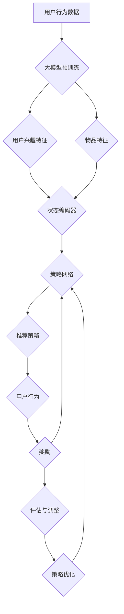

                 

## 1. 背景介绍

随着互联网和大数据技术的发展，推荐系统已成为现代信息检索、电子商务、社交媒体等领域的核心技术。推荐系统能够根据用户的历史行为、兴趣和偏好，为用户推荐个性化内容，从而提升用户体验和满意度。然而，推荐系统的设计和优化面临着诸多挑战。

首先，数据稀疏性是推荐系统面临的一个主要问题。用户行为数据通常是稀疏的，即大部分用户只对少数项目进行了评分或互动。这种数据稀疏性导致传统的基于协同过滤的方法（如用户基于协同过滤（User-Based Collaborative Filtering）和物品基于协同过滤（Item-Based Collaborative Filtering））在推荐精度和多样性方面存在局限性。

其次，用户行为具有动态性和多样性。用户的兴趣和行为可能会随着时间、情境和内容的变化而变化，这使得推荐系统需要具备实时性和自适应能力。传统的推荐算法通常在训练和预测阶段是静态的，难以适应这种动态性。

此外，推荐系统的目标不仅仅是提高推荐精度，还需要关注推荐结果的多样性和公平性。多样化的推荐结果可以避免用户陷入信息茧房，增加用户的探索机会。公平性则要求推荐系统对不同用户群体进行公平对待，避免偏见和歧视。

为了解决上述问题，近年来研究者们提出了许多先进的推荐算法，如基于内容的推荐（Content-Based Filtering）、基于模型的推荐（Model-Based Recommendation）和强化学习（Reinforcement Learning）。其中，强化学习因其能够动态调整策略、具备探索-利用平衡机制等优点，在推荐系统中逐渐受到关注。

强化学习通过模拟智能体与环境的交互过程，通过策略迭代和经验积累，不断优化决策策略。在大模型时代，强化学习算法借助预训练的大规模语言模型，能够更好地理解和预测用户行为，从而实现更精准和多样化的推荐结果。

本文将探讨大模型在推荐系统中对比强化学习的应用。首先，我们将介绍推荐系统的基本概念和传统方法。然后，深入解析强化学习在推荐系统中的应用，包括核心算法原理、数学模型和具体操作步骤。接着，通过一个实际项目案例，展示如何利用强化学习实现推荐系统的开发。最后，我们将讨论强化学习在推荐系统中的实际应用场景，并推荐一些相关学习资源和开发工具。

通过本文的阅读，读者将能够了解大模型在推荐系统中对比强化学习的基本原理和应用方法，为实际项目开发提供指导和借鉴。同时，本文也希望能够引发读者对推荐系统未来发展趋势和挑战的思考。让我们一步一步地深入探讨这个问题吧！

### 1.1 推荐系统概述

推荐系统是一种基于用户历史行为和偏好，通过算法预测和生成个性化推荐内容的技术。其核心目的是帮助用户在海量信息中快速找到符合自身兴趣和需求的内容，从而提升用户满意度和参与度。推荐系统在多个领域都有着广泛应用，如电子商务、社交媒体、新闻推送、在线视频和音乐平台等。

从技术角度来说，推荐系统主要涉及用户行为数据收集、数据预处理、推荐算法设计和评估等几个关键步骤。

首先，用户行为数据是推荐系统的核心输入。这些数据包括用户的点击、浏览、购买、评分等行为信息。数据来源可以是内部数据（如网站日志、用户操作记录）或外部数据（如社交媒体数据、用户调研数据）。为了确保数据的质量和准确性，推荐系统通常需要对原始数据进行清洗、去噪和归一化等预处理操作。

其次，推荐算法是推荐系统的核心。传统推荐算法主要分为基于协同过滤（Collaborative Filtering）和基于内容（Content-Based Filtering）两大类。协同过滤通过分析用户之间的相似性或物品之间的相似性来进行推荐，如用户基于协同过滤（User-Based Collaborative Filtering）和物品基于协同过滤（Item-Based Collaborative Filtering）。基于内容的推荐则通过分析用户的历史行为和偏好，提取特征，并根据这些特征生成推荐列表。近年来，基于模型的推荐方法（如基于矩阵分解、神经网络等）也取得了显著进展。

然后，推荐算法的设计和优化需要考虑多个因素，包括推荐精度、多样性、实时性、公平性等。推荐精度是衡量推荐系统性能的最直接指标，即推荐列表中的物品是否能够准确反映用户的兴趣。多样性则要求推荐列表中的物品具有丰富性和差异性，避免用户陷入信息茧房。实时性要求推荐系统能够迅速响应用户行为的变化，提供实时的推荐结果。公平性则要求推荐系统对不同用户群体进行公平对待，避免偏见和歧视。

最后，推荐系统的评估和优化是一个持续迭代的过程。评估指标包括准确率（Precision）、召回率（Recall）、F1值（F1-Score）等。通过这些指标，可以评估推荐系统的性能，并发现潜在的问题和改进空间。优化方法包括超参数调优、特征工程、模型集成等。

总之，推荐系统是一种复杂的技术体系，涉及多个学科领域和技术手段。其核心目标是提供高质量的个性化推荐，满足用户的多样化需求。随着技术的不断进步和数据的日益丰富，推荐系统将继续发挥重要作用，推动各行业的智能化发展。

### 1.2 强化学习概述

强化学习（Reinforcement Learning，RL）是一种机器学习方法，旨在通过智能体（Agent）与环境的交互，学习最优策略（Policy）以达到特定目标。在强化学习框架中，智能体通过不断接收环境反馈，调整自身的行动策略，从而逐步优化决策过程。强化学习与其他机器学习方法（如监督学习和无监督学习）的不同之处在于其交互性，即智能体与环境的动态互动是其核心驱动力。

强化学习的基本概念主要包括以下几个要素：

1. **智能体（Agent）**：执行行动并从环境中获取奖励的实体。例如，自动驾驶汽车、机器人、推荐系统等都可以视为智能体。

2. **环境（Environment）**：智能体执行行动的场所。环境根据智能体的行动产生状态（State）和奖励（Reward），并返回新的状态给智能体。

3. **状态（State）**：描述智能体在某一时刻所处的情境。例如，自动驾驶汽车的状态可以包括当前道路状况、车辆位置、速度等。

4. **行动（Action）**：智能体在某一状态下可以选择的一系列操作。例如，自动驾驶汽车可以选择加速、减速、转向等。

5. **策略（Policy）**：智能体在给定状态下选择最优行动的规则。策略可以通过学习得到，也可以是预定义的。

6. **奖励（Reward）**：环境对智能体行动的即时反馈。奖励可以是正面的（鼓励智能体继续该行动）或负面的（提示智能体调整行动）。

强化学习的主要步骤包括：

1. **初始化**：设置智能体、环境、状态和行动的初始状态。

2. **交互**：智能体根据当前状态选择行动，执行行动后进入新的状态，并获取奖励。

3. **学习**：智能体根据历史交互经验（状态、行动、奖励）调整策略，以期望最大化总奖励。

4. **迭代**：重复上述步骤，逐步优化策略，直至达到预定的目标或性能水平。

强化学习的应用非常广泛，涵盖多个领域，包括：

- **游戏**：如Atari游戏、围棋、国际象棋等。
- **自动驾驶**：智能驾驶系统通过强化学习优化行驶路线和驾驶行为。
- **机器人**：机器人通过强化学习进行路径规划、抓取物体等任务。
- **推荐系统**：智能推荐系统利用强化学习实现个性化推荐，提升推荐质量和用户满意度。
- **金融**：如股票交易、风险管理等。

强化学习具有以下优点：

- **自适应性强**：能够根据环境变化动态调整策略，适应不同情境。
- **探索-利用平衡**：强化学习在探索未知和利用已有知识之间取得平衡，避免陷入局部最优。
- **多任务学习**：强化学习算法可以同时处理多个任务，提高模型的泛化能力。

然而，强化学习也面临一些挑战，如：

- **奖励设计的复杂性**：奖励设计对强化学习的效果至关重要，但设计合理的奖励机制往往较为困难。
- **计算效率**：强化学习通常需要大量交互和迭代来收敛，计算资源消耗较大。
- **不稳定性和可解释性**：强化学习模型的学习过程可能不够稳定，且其内部决策机制较为复杂，不易解释。

总之，强化学习作为一种强大的机器学习方法，具有广泛的应用前景和发展潜力。通过深入理解和优化强化学习算法，我们可以更好地应对复杂动态环境中的决策问题，实现智能化和自动化。

### 1.3 推荐系统中的传统方法

在推荐系统中，传统方法主要包括基于协同过滤（Collaborative Filtering）和基于内容（Content-Based Filtering）两大类。这些方法在不同场景下各有优劣，并已在实际应用中得到了广泛验证。

#### 基于协同过滤（Collaborative Filtering）

协同过滤是一种通过分析用户之间的相似性或物品之间的相似性来进行推荐的方法。它主要分为两种类型：用户基于协同过滤（User-Based Collaborative Filtering）和物品基于协同过滤（Item-Based Collaborative Filtering）。

**用户基于协同过滤（User-Based Collaborative Filtering）**：这种方法通过计算用户之间的相似度，找到与目标用户最相似的用户群体，然后从这些用户的评分记录中生成推荐列表。常用的相似度度量方法包括余弦相似度、皮尔逊相关系数等。其优点是能够根据用户历史行为进行个性化推荐，但缺点是容易受到数据稀疏性的影响，尤其在用户和物品数量庞大的情况下，计算复杂度较高。

**物品基于协同过滤（Item-Based Collaborative Filtering）**：这种方法通过计算物品之间的相似度，为用户推荐与其已评价物品相似的物品。相似度的计算通常基于用户评分矩阵或用户-物品交互记录。优点是处理数据稀疏性较好，计算复杂度较低，但缺点是推荐结果可能缺乏多样性，且不能充分利用用户的偏好信息。

#### 基于内容（Content-Based Filtering）

基于内容的方法通过分析用户的历史行为和偏好，提取用户兴趣特征，然后将这些特征与物品的属性进行匹配，生成推荐列表。其主要步骤包括：

1. **特征提取**：从用户的历史行为和物品的属性中提取特征。例如，对于用户来说，可以提取其评分高的物品的标签、关键词等；对于物品来说，可以提取其文本描述、分类标签等。

2. **相似度计算**：计算用户和物品之间的相似度。常见的相似度度量方法包括余弦相似度、欧氏距离、Jaccard系数等。

3. **推荐生成**：根据用户和物品之间的相似度，为用户生成推荐列表。通常采用Top-N方法，从相似度最高的物品中选取推荐结果。

基于内容方法的优点是能够提供丰富和个性化的推荐结果，且不易受数据稀疏性的影响。缺点是特征提取和相似度计算过程较为复杂，且推荐结果可能缺乏多样性。

#### 基于模型的推荐方法

近年来，基于模型的推荐方法（如矩阵分解、神经网络等）逐渐受到关注。这些方法通过建立用户和物品之间的潜在关系模型，实现更精准和个性化的推荐。

**矩阵分解（Matrix Factorization）**：矩阵分解是一种将用户-物品评分矩阵分解为低秩因子矩阵的方法。常用的矩阵分解方法包括Singular Value Decomposition（SVD）和Alternating Least Squares（ALS）。通过矩阵分解，可以提取用户和物品的潜在特征，进而生成推荐列表。矩阵分解的优点是能够有效降低数据稀疏性，提高推荐精度。缺点是模型参数较多，计算复杂度高。

**神经网络（Neural Networks）**：神经网络通过构建多层非线性变换模型，实现对用户和物品特征的学习和融合。常见的神经网络模型包括卷积神经网络（CNN）和循环神经网络（RNN）。神经网络的优势在于其强大的非线性建模能力和自适应性，能够处理复杂和大规模的数据。缺点是模型参数较多，训练时间较长，且对数据质量要求较高。

综上所述，推荐系统中的传统方法各有优劣，在实际应用中需要根据具体场景和需求进行选择和优化。随着技术的发展，这些传统方法也在不断演进和改进，以应对推荐系统面临的挑战和需求。

### 1.4 大模型在推荐系统中的应用

在介绍大模型（如预训练的Transformer模型）在推荐系统中的应用之前，首先需要理解大模型的基本原理和优势。大模型是一种通过大规模数据预训练，能够自动学习文本、图像、声音等多种类型数据表示的深度神经网络模型。其核心思想是利用大量未标记的数据进行预训练，然后在特定任务上进行微调（Fine-Tuning），从而提高模型的性能和泛化能力。

大模型在推荐系统中的应用主要体现在以下几个方面：

1. **用户兴趣建模**：大模型能够通过预训练自动提取用户兴趣的潜在特征，从而更好地理解用户的偏好和行为。例如，通过预训练的Transformer模型，可以提取用户在文本评论、搜索历史、浏览记录等数据中的关键信息，形成高维且密集的用户兴趣向量。

2. **物品特征提取**：大模型不仅能够提取用户的兴趣特征，还可以对物品进行深度特征提取。例如，对于商品推荐，大模型可以提取商品描述、用户评论、品牌信息等特征，从而生成丰富的物品特征向量。

3. **上下文感知推荐**：大模型具备强大的上下文感知能力，能够在不同场景下提供个性化的推荐。例如，在移动端应用中，大模型可以根据用户的地理位置、时间戳、设备等信息，动态调整推荐策略，提供更符合用户当前需求的推荐内容。

4. **实时推荐**：大模型的高效计算能力使其能够实现实时推荐。例如，通过将大模型部署在边缘计算设备上，可以减少延迟，提高推荐系统的响应速度，提升用户体验。

5. **多模态推荐**：大模型能够处理多种类型的数据，从而实现多模态推荐。例如，在音乐推荐中，大模型可以同时考虑音乐特征（如旋律、歌词、封面等）和用户行为特征（如播放历史、点赞、评论等），提供更全面和个性化的推荐。

大模型在推荐系统中的应用优势体现在以下几个方面：

- **高效性**：大模型通过大规模预训练，能够自动学习复杂的特征表示，减少手动特征工程的工作量，提高推荐系统的开发效率。

- **泛化能力**：大模型具备较强的泛化能力，能够在不同领域和任务上取得较好的表现，适应推荐系统的多样化需求。

- **个性化**：大模型能够根据用户的历史行为和兴趣，提供高度个性化的推荐，提升用户满意度和参与度。

- **实时性**：大模型的高效计算能力使其能够实现实时推荐，满足用户对实时性和响应速度的需求。

然而，大模型在推荐系统中也面临一些挑战，如：

- **计算资源消耗**：大模型通常需要大量的计算资源和存储空间，尤其在训练和推理阶段，对硬件设备有较高要求。

- **数据隐私**：大模型在处理用户数据时，可能涉及到敏感信息，需要确保用户隐私保护。

- **可解释性**：大模型内部决策机制复杂，缺乏可解释性，可能导致用户对其推荐结果的信任度降低。

- **模型偏见**：大模型在训练过程中可能受到数据分布偏差的影响，导致推荐结果存在偏见，需要通过数据平衡和模型优化来缓解。

总之，大模型在推荐系统中的应用为个性化推荐带来了新的机遇和挑战。通过合理利用大模型的强大能力，我们可以实现更高效、个性化、实时的推荐系统，提升用户体验。同时，我们也需要关注大模型在应用过程中面临的问题和挑战，不断优化和完善推荐系统的设计和实现。

### 1.5 强化学习在推荐系统中的应用

强化学习在推荐系统中的应用正逐渐成为研究的热点，其核心思想是通过模拟智能体（推荐系统）与环境的交互过程，不断优化推荐策略，从而提升推荐效果。具体来说，强化学习在推荐系统中的应用主要体现在以下几个方面：

#### 1.5.1 探索-利用平衡

在推荐系统中，智能体需要在探索（Exploitation）和利用（Exploration）之间取得平衡。探索是指尝试新的策略以发现潜在更好的推荐结果，而利用则是指根据当前最优策略进行推荐以最大化用户满意度。传统的推荐算法往往在训练和预测阶段是静态的，难以在探索和利用之间灵活切换。强化学习通过引入探索-利用平衡机制，使得推荐系统能够在不同情境下自适应调整策略。

- **ε-贪心策略（ε-Greedy Strategy）**：在强化学习中，ε-贪心策略是一种常用的探索-利用平衡方法。其中，ε表示探索概率，1 - ε表示利用概率。在每次决策时，智能体以ε的概率随机选择行动，以探索新的可能性，并以1 - ε的概率选择当前最优行动，以利用已知的最佳策略。

- **UCB算法（Upper Confidence Bound）**：UCB算法通过估计每个动作的上界，选择上界最高的动作。这种方法既考虑了动作的历史表现，也考虑了未探索动作的潜在收益，从而实现探索-利用平衡。

#### 1.5.2 奖励机制设计

奖励机制是强化学习在推荐系统中至关重要的一环。奖励机制的设计直接影响到推荐系统的性能和用户体验。在推荐系统中，奖励可以是用户的点击、购买、评分等行为反馈。

- **立即奖励（Immediate Reward）**：立即奖励是智能体在每次行动后立即获得的奖励。例如，当用户点击推荐内容时，系统可以给予正面的立即奖励。这种奖励有助于激励智能体在短期内选择用户更感兴趣的行动。

- **长期奖励（Long-Term Reward）**：长期奖励是通过对用户行为的累积计算得到的奖励。例如，当用户在后续行为中再次表现出对推荐内容的兴趣（如购买、评分等），系统可以给予长期的奖励。这种奖励有助于智能体在长期内学习和优化推荐策略。

#### 1.5.3 策略优化

在强化学习框架中，策略优化是智能体的核心目标。通过不断调整策略，智能体能够逐渐提高推荐效果。策略优化方法主要包括：

- **策略迭代（Policy Iteration）**：策略迭代是一种基于贪婪策略的优化方法。智能体在每次迭代中评估当前策略，根据评估结果更新策略，直至达到最优策略。

- **Q-学习（Q-Learning）**：Q-学习是一种基于值函数的优化方法。智能体通过学习状态-行动值函数（Q函数），选择当前状态下期望回报最高的行动。Q-学习适用于值函数可导的情况，通过迭代更新Q值，逐步优化策略。

- **深度Q网络（Deep Q-Network，DQN）**：DQN是一种基于深度学习的Q-学习算法。通过使用卷积神经网络（CNN）或循环神经网络（RNN）作为Q函数的近似器，DQN能够处理高维和复杂的状态空间。DQN通过经验回放（Experience Replay）和目标网络（Target Network）等技术，提高训练稳定性和效果。

- **策略梯度方法（Policy Gradient Methods）**：策略梯度方法通过直接优化策略的梯度，实现策略的更新。常见的策略梯度方法包括REINFORCE、PPO（Proximal Policy Optimization）等。策略梯度方法的优点是计算效率高，但可能面临梯度消失和梯度爆炸等问题。

#### 1.5.4 强化学习在推荐系统中的挑战

虽然强化学习在推荐系统中展示了强大的潜力，但其在实际应用中也面临一些挑战：

- **数据稀疏性**：推荐系统中的用户行为数据通常具有高度稀疏性，这可能导致强化学习算法在训练过程中难以获取充分的信息。针对这一问题，可以通过数据增强、协作过滤等方法缓解数据稀疏性的影响。

- **奖励设计**：奖励机制的设计对强化学习的效果至关重要。合理的奖励设计需要综合考虑用户行为的即时反馈和长期价值，以确保推荐系统在不同情境下都能取得良好的性能。

- **计算资源消耗**：强化学习算法通常需要大量的计算资源和时间，特别是在训练阶段。对于实时性要求较高的推荐系统，如何优化算法的效率成为一大挑战。

- **模型可解释性**：强化学习模型内部决策机制复杂，缺乏可解释性，可能导致用户对其推荐结果的信任度降低。提高模型的可解释性，增强用户对推荐结果的信任，是未来研究的重要方向。

总之，强化学习在推荐系统中具有广阔的应用前景和巨大的发展潜力。通过不断优化算法和设计合理的奖励机制，我们可以实现更高效、个性化、实时的推荐系统，提升用户满意度和体验。同时，我们也需要关注强化学习在推荐系统中的应用挑战，不断探索和实践，为推荐系统的未来发展提供新的思路和方法。

### 1.6 大模型与强化学习的结合

大模型与强化学习的结合，为推荐系统带来了前所未有的机遇和挑战。这种结合不仅能够发挥大模型的强大表征能力，还能利用强化学习的动态调整机制，实现更高效、个性化的推荐。以下将从原理和实现方法两个方面，详细探讨大模型与强化学习的结合及其优势。

#### 1.6.1 基本原理

大模型与强化学习的结合，主要通过以下几个步骤实现：

1. **大模型预训练**：首先，使用大规模数据集对大模型进行预训练，使其具备强大的表征能力。预训练过程中，大模型学习到丰富的知识，包括用户行为、兴趣和偏好等信息，从而能够生成高维、密集的特征向量。

2. **强化学习框架设计**：在预训练的基础上，构建强化学习框架，将大模型作为状态编码器（State Encoder）和动作编码器（Action Encoder）。状态编码器将用户行为、上下文信息等输入编码为状态特征向量；动作编码器将候选物品的特征编码为动作特征向量。

3. **策略优化**：通过强化学习算法，如策略迭代、Q-学习、深度Q网络（DQN）等，优化大模型生成的策略。策略优化的目标是最大化总奖励，从而提高推荐效果。在优化过程中，大模型通过不断调整动作策略，逐渐优化推荐结果。

4. **评估与调整**：对优化后的策略进行评估，通过指标如准确率、召回率、F1值等，评估推荐系统的性能。根据评估结果，对大模型和强化学习框架进行调整和优化，以提高推荐效果。

#### 1.6.2 实现方法

大模型与强化学习的结合，可以通过以下几种方法实现：

1. **深度强化学习（Deep Reinforcement Learning，DRL）**：DRL是一种结合深度学习和强化学习的方法。在大模型与强化学习的结合中，DRL通过使用深度神经网络（如卷积神经网络（CNN）、循环神经网络（RNN）等）作为状态和动作的编码器，实现高效的表征和学习。DRL的核心思想是利用深度神经网络的高层次抽象能力，提高状态和动作的特征表达能力，从而优化强化学习算法的性能。

2. **模型融合（Model Fusion）**：模型融合方法将大模型和传统强化学习算法相结合，通过融合两者的优点，实现更高效的推荐。例如，可以将大模型的预训练结果作为强化学习算法的初始策略，通过后续的强化学习迭代，逐步优化策略。这种方法既利用了大模型强大的表征能力，又保持了强化学习动态调整的优势。

3. **多任务学习（Multi-Task Learning，MTL）**：多任务学习通过同时训练多个相关任务，提高模型的全局泛化能力和性能。在大模型与强化学习的结合中，MTL可以同时训练推荐系统和强化学习算法，通过多任务学习，提高模型在多个领域的适应能力和效果。

#### 1.6.3 优势

大模型与强化学习的结合，具有以下优势：

1. **高效表征**：大模型通过预训练，能够自动提取用户和物品的潜在特征，实现高效的特征表征。这为强化学习算法提供了丰富的信息，提高了决策的准确性。

2. **动态调整**：强化学习算法能够根据用户行为和反馈，动态调整推荐策略，实现个性化推荐。结合大模型后，强化学习算法能够更好地适应复杂和动态的环境，提高推荐效果。

3. **增强多样性**：大模型能够提取丰富的用户兴趣和偏好信息，结合强化学习的探索-利用机制，可以生成多样化的推荐结果，避免用户陷入信息茧房。

4. **提升实时性**：大模型的高效计算能力，使得推荐系统能够实现实时推荐。通过优化算法和硬件部署，可以进一步降低延迟，提升用户体验。

总之，大模型与强化学习的结合，为推荐系统带来了新的机遇和挑战。通过合理利用大模型的表征能力和强化学习的动态调整机制，我们可以实现更高效、个性化、实时的推荐系统，提升用户体验和满意度。

### 2. 核心概念与联系

在探讨大模型与强化学习在推荐系统中的应用时，首先需要了解相关核心概念及其相互联系。以下内容将详细介绍主要概念，并使用Mermaid流程图展示推荐系统的架构，以帮助读者更好地理解。

#### 2.1 关键概念

1. **用户兴趣特征（User Interest Features）**：用户兴趣特征是指从用户的历史行为、偏好、评论等数据中提取的表示用户兴趣和喜好的特征。这些特征可以通过大模型进行高效提取，用于生成用户兴趣向量。

2. **物品特征（Item Features）**：物品特征是指从物品的属性、标签、描述等数据中提取的特征。这些特征用于表示物品的属性和内容，也是大模型提取和表征的重要信息。

3. **推荐策略（Recommendation Policy）**：推荐策略是指智能体（推荐系统）在给定状态下选择最优行动的规则。通过大模型与强化学习相结合，推荐策略能够动态调整，以最大化用户满意度。

4. **状态（State）**：状态是描述智能体在某一时刻所处的情境。在推荐系统中，状态通常包括用户兴趣向量、上下文信息（如时间、地理位置等）、历史推荐记录等。

5. **行动（Action）**：行动是智能体在状态中选择的一系列操作。在推荐系统中，行动通常包括推荐哪些物品给用户。

6. **奖励（Reward）**：奖励是环境对智能体行动的即时反馈。在推荐系统中，奖励可以是用户对推荐物品的点击、购买、评分等行为。

7. **策略优化（Policy Optimization）**：策略优化是指通过强化学习算法，不断调整推荐策略，以期望最大化总奖励。

#### 2.2 Mermaid流程图

以下是一个简化的Mermaid流程图，展示了推荐系统中的核心概念和流程：



**流程说明**：

1. **用户行为数据**：推荐系统从用户行为数据（如点击、浏览、购买等）中提取信息。

2. **大模型预训练**：使用大规模数据集对大模型进行预训练，提取用户和物品的特征。

3. **特征提取**：大模型提取用户兴趣特征和物品特征。

4. **状态编码器**：将用户兴趣特征和物品特征编码为状态向量。

5. **策略网络**：通过强化学习算法，策略网络根据状态向量生成推荐策略。

6. **推荐策略**：推荐系统根据策略网络生成的策略，为用户推荐物品。

7. **用户行为**：用户对推荐物品进行点击、购买、评分等行为。

8. **奖励**：环境根据用户行为反馈奖励，用于调整策略。

9. **评估与调整**：根据奖励结果，对策略进行评估和调整，以优化推荐效果。

通过上述流程，大模型与强化学习在推荐系统中相互结合，实现了高效、个性化的推荐。这种结合不仅提高了推荐系统的性能和用户体验，还为推荐系统的未来发展提供了新的思路和方法。

### 3. 核心算法原理 & 具体操作步骤

在理解了大模型与强化学习在推荐系统中的基本概念和架构后，接下来我们将深入探讨其核心算法原理和具体操作步骤。本节将详细描述如何利用强化学习实现大模型在推荐系统中的应用，包括状态表示、行动表示、奖励机制以及算法优化等关键环节。

#### 3.1 状态表示

状态表示是强化学习算法的基础，它描述了智能体在某一时刻所处的情境。在推荐系统中，状态通常由用户兴趣特征、上下文信息和历史推荐记录组成。

1. **用户兴趣特征**：用户兴趣特征是从用户历史行为中提取的表示用户兴趣和喜好的特征。这些特征可以通过大模型进行提取，形成高维、密集的用户兴趣向量。例如，可以使用预训练的Transformer模型，通过用户的历史点击、浏览、评论等数据，生成用户兴趣向量。

2. **上下文信息**：上下文信息是指影响用户兴趣和偏好的环境因素，如时间、地理位置、天气等。这些信息可以用于丰富状态表示，提高推荐系统的实时性和个性化水平。

3. **历史推荐记录**：历史推荐记录是指用户在过去一段时间内接收到的推荐物品及其用户行为（如点击、购买、评分等）。这些信息可以用于捕捉用户的短期偏好和长期趋势。

状态表示通常采用高维向量形式，以便于后续的强化学习算法进行处理。例如，可以使用以下公式表示状态：

\[ s = [u, c, h] \]

其中，\( u \)表示用户兴趣特征，\( c \)表示上下文信息，\( h \)表示历史推荐记录。

#### 3.2 行动表示

行动表示是指智能体在给定状态下可以选择的一系列操作。在推荐系统中，行动通常包括推荐哪些物品给用户。行动表示可以是二进制向量、类别标签或连续值。

1. **二进制向量表示**：二进制向量表示将所有可能的物品作为行动，每个物品对应一个二进制位。例如，如果系统中有100个物品，则行动向量可以表示为100维的二进制向量。这种表示方法简单直观，但计算复杂度较高。

2. **类别标签表示**：类别标签表示将物品分为若干类别，每个类别对应一个标签。例如，可以将物品分为电影、书籍、音乐等类别。行动向量可以表示为类别标签的集合。这种方法可以降低计算复杂度，但可能无法捕捉物品之间的细微差异。

3. **连续值表示**：连续值表示将物品的特征（如文本、图像、音频等）映射到连续空间，形成高维向量。行动向量可以表示为这些特征向量的组合。这种方法可以捕捉物品之间的复杂关系，但需要复杂的特征工程和模型优化。

在推荐系统中，行动通常由策略网络生成。策略网络通过学习状态和行动之间的关系，生成最优的行动策略。例如，可以使用以下公式表示行动：

\[ a = \sigma(W_a \cdot s + b_a) \]

其中，\( \sigma \)表示激活函数，\( W_a \)表示权重矩阵，\( b_a \)表示偏置项，\( s \)表示状态向量。

#### 3.3 奖励机制

奖励机制是强化学习算法的核心，它决定了智能体的行为。在推荐系统中，奖励可以是用户对推荐物品的点击、购买、评分等行为反馈。

1. **立即奖励**：立即奖励是用户对当前推荐物品的即时反馈。例如，当用户点击推荐物品时，系统可以给予一个正的立即奖励。立即奖励可以激励智能体选择用户更感兴趣的行动。

2. **长期奖励**：长期奖励是通过对用户行为的累积计算得到的奖励。例如，当用户在后续行为中再次表现出对推荐物品的兴趣（如购买、评分等），系统可以给予一个长期的奖励。长期奖励可以引导智能体在长期内学习和优化推荐策略。

奖励机制的设计需要综合考虑用户行为的即时反馈和长期价值。以下是一个简单的奖励机制公式：

\[ r = r_i + r_l \]

其中，\( r_i \)表示立即奖励，\( r_l \)表示长期奖励。

#### 3.4 策略优化

策略优化是强化学习算法的核心目标，通过不断调整策略，智能体能够逐渐优化推荐效果。在推荐系统中，策略优化通常采用以下方法：

1. **策略迭代**：策略迭代是一种基于贪婪策略的优化方法。在每次迭代中，智能体评估当前策略，根据评估结果更新策略。策略迭代过程如下：

   a. 初始化策略。
   
   b. 根据当前策略选择行动。
   
   c. 执行行动，获取奖励。
   
   d. 根据奖励结果评估策略性能。
   
   e. 更新策略。

2. **Q-学习**：Q-学习是一种基于值函数的优化方法。智能体通过学习状态-行动值函数（Q函数），选择当前状态下期望回报最高的行动。Q-学习过程如下：

   a. 初始化Q值。
   
   b. 根据当前Q值选择行动。
   
   c. 执行行动，获取奖励。
   
   d. 更新Q值。

3. **深度Q网络（DQN）**：DQN是一种基于深度学习的Q-学习算法。通过使用深度神经网络（如卷积神经网络（CNN）、循环神经网络（RNN）等）作为Q函数的近似器，DQN能够处理高维和复杂的状态空间。DQN过程如下：

   a. 初始化DQN模型。
   
   b. 根据当前DQN模型选择行动。
   
   c. 执行行动，获取奖励。
   
   d. 使用经验回放（Experience Replay）和目标网络（Target Network）更新DQN模型。

4. **策略梯度方法**：策略梯度方法通过直接优化策略的梯度，实现策略的更新。策略梯度方法包括REINFORCE、PPO（Proximal Policy Optimization）等。策略梯度方法过程如下：

   a. 初始化策略网络。
   
   b. 根据当前策略网络选择行动。
   
   c. 执行行动，获取奖励。
   
   d. 计算策略梯度。
   
   e. 更新策略网络。

通过上述策略优化方法，强化学习算法能够不断调整推荐策略，以最大化总奖励，实现高效、个性化的推荐。

综上所述，大模型与强化学习在推荐系统中的应用，通过状态表示、行动表示、奖励机制和策略优化等环节，实现了高效、个性化的推荐。这种结合不仅提高了推荐系统的性能，还为推荐系统的未来发展提供了新的思路和方法。

### 4. 数学模型和公式 & 详细讲解 & 举例说明

为了深入理解大模型与强化学习在推荐系统中的应用，本节将详细介绍相关的数学模型和公式，并进行详细的讲解和举例说明。这部分内容涵盖了强化学习中的状态表示、行动表示、奖励机制、策略优化以及模型训练等方面的关键数学表达。

#### 4.1 状态表示

在强化学习框架中，状态表示是理解智能体环境交互的重要基础。状态通常由多个特征向量组成，这些特征向量可以是用户的兴趣特征、上下文信息以及历史推荐记录等。以下是状态表示的数学公式：

\[ s = [u, c, h] \]

其中：
- \( u \)：用户兴趣特征向量，通常通过大模型（如Transformer）从用户历史行为中提取。
- \( c \)：上下文信息向量，如时间、地理位置等，可以影响用户当前的兴趣和偏好。
- \( h \)：历史推荐记录向量，包括用户过去一段时间内接收到的推荐及其反馈行为。

#### 4.2 行动表示

行动表示是指智能体在某一状态下可以选择的一系列操作。在推荐系统中，行动通常包括推荐给用户的物品集合。行动可以用一个离散的集合表示，也可以用概率分布表示。以下是行动表示的数学公式：

\[ A = \{a_1, a_2, ..., a_n\} \]

其中：
- \( a_i \)：表示第 \( i \) 个物品。
- \( p(a_i | s) \)：表示在状态 \( s \) 下选择物品 \( a_i \) 的概率。

#### 4.3 奖励机制

奖励机制是强化学习算法的核心，它决定了智能体的行为。在推荐系统中，奖励可以是立即奖励和长期奖励的组合。以下是一个简单的奖励机制公式：

\[ r = r_i + \gamma r_l \]

其中：
- \( r_i \)：立即奖励，通常是用户对当前推荐物品的直接反馈，如点击或购买。
- \( r_l \)：长期奖励，是对用户长期行为的影响，如后续的用户行为（评分、再次购买等）。
- \( \gamma \)：折扣因子，用于平衡立即奖励和长期奖励之间的关系。

#### 4.4 策略优化

策略优化是通过强化学习算法不断调整智能体的策略，以最大化总奖励。以下是常见的策略优化方法及其数学公式：

1. **策略迭代**：

   策略迭代是一种基于贪婪策略的优化方法，其目标是最小化负的期望回报。以下是其优化过程：

   \[ \pi_t = \arg \max_{\pi} \sum_{s \in S} \pi(s) \sum_{a \in A} \pi(a|s) r(s, a) \]

   其中：
   - \( \pi_t \)：第 \( t \) 次迭代的策略。
   - \( S \)：所有可能的状态集合。
   - \( A \)：所有可能的行动集合。

2. **Q-学习**：

   Q-学习是一种基于值函数的优化方法，通过学习状态-行动值函数 \( Q(s, a) \) 来选择最优行动。以下是其优化过程：

   \[ Q(s, a) = r(s, a) + \gamma \max_{a'} Q(s', a') \]

   其中：
   - \( Q(s, a) \)：状态-行动值函数。
   - \( s' \)：执行行动 \( a \) 后的新状态。
   - \( a' \)：在状态 \( s' \) 下的最优行动。

3. **深度Q网络（DQN）**：

   DQN是一种基于深度学习的Q-学习算法，使用神经网络近似 \( Q(s, a) \)。以下是其优化过程：

   \[ Q(s, a) = \frac{1}{N} \sum_{i=1}^{N} (y_i - Q(s_i, a_i))^2 \]

   其中：
   - \( y_i \)：实际获得的奖励。
   - \( s_i \)：状态。
   - \( a_i \)：行动。
   - \( N \)：训练样本数量。

4. **策略梯度方法**：

   策略梯度方法通过直接优化策略的梯度来更新策略。以下是其优化过程：

   \[ \nabla_{\pi} J(\pi) = \sum_{s \in S} \pi(s) \nabla_{\pi(s)} J(\pi) \]

   其中：
   - \( \nabla_{\pi} J(\pi) \)：策略梯度。
   - \( J(\pi) \)：策略的损失函数。

#### 4.5 模型训练

在强化学习框架中，模型训练是优化策略的重要环节。以下是模型训练的常见方法：

1. **经验回放**：

   经验回放是一种用于减少样本偏差的方法，它将智能体在环境中获取的经验存储在经验池中，并随机从经验池中抽取样本进行训练。以下是其训练过程：

   \[ \text{Experience Replay} \]
   \[
   \begin{align*}
   s_t &\sim \text{均匀分布} \\
   a_t &\sim \pi(a|s_t) \\
   s_{t+1} &= \text{环境反馈} \\
   r_t &= \text{奖励} \\
   (s_t, a_t, s_{t+1}, r_t) &\rightarrow \text{经验池} \\
   \text{随机抽取} (s', a', s', r') \text{进行训练}
   \end{align*}
   \]

2. **目标网络**：

   目标网络是一种用于稳定训练的方法，它通过固定一个目标网络，并在策略网络更新时使用目标网络来计算值函数。以下是其训练过程：

   \[
   \begin{align*}
   \theta_q^{\text{target}} &= \tau \theta_q + (1 - \tau) \theta_{\pi} \\
   Q_{\text{target}}(s', a') &= r' + \gamma \max_{a'} Q(s', a')
   \end{align*}
   \]

   其中：
   - \( \theta_q \)：Q网络的参数。
   - \( \theta_{\pi} \)：策略网络的参数。
   - \( \tau \)：更新比例。

#### 4.6 举例说明

为了更好地理解上述数学模型和公式，以下通过一个简单的例子进行说明。

假设我们有一个推荐系统，用户历史行为数据包括点击、浏览和购买记录。状态 \( s \) 由用户兴趣特征向量 \( u \)（从历史行为中提取）、上下文信息向量 \( c \)（如当前时间）和历史推荐记录向量 \( h \) 组成。

行动 \( a \) 是推荐给用户的物品集合，用概率分布表示。奖励 \( r \) 是用户对推荐物品的点击反馈。

状态表示：

\[ s = [u, c, h] \]

行动表示：

\[ A = \{a_1, a_2, a_3\} \]

概率分布：

\[ p(a_1 | s) = 0.3, \quad p(a_2 | s) = 0.5, \quad p(a_3 | s) = 0.2 \]

奖励机制：

\[ r = r_i + \gamma r_l \]

其中，\( r_i \) 是用户点击推荐物品的立即奖励（假设点击得1分），\( r_l \) 是长期奖励（假设用户后续购买推荐物品得3分），\( \gamma \) 是折扣因子（设为0.9）。

策略优化：

采用Q-学习算法，初始 \( Q(s, a) = 0 \)，通过不断迭代更新：

\[ Q(s, a) = r(s, a) + \gamma \max_{a'} Q(s', a') \]

例如，在第一次迭代中，用户状态为 \( s = [0.3, 0.1, 0.2] \)，推荐行动为 \( a_2 \)，用户点击了推荐物品。得到的奖励为1分。根据Q-学习算法更新 \( Q \) 值：

\[ Q([0.3, 0.1, 0.2], a_2) = 1 + 0.9 \max_{a'} Q([0.4, 0.2, 0.1], a') \]

通过不断迭代，策略网络逐渐优化，推荐结果逐渐符合用户兴趣。

通过上述数学模型和公式的讲解，我们可以看到大模型与强化学习在推荐系统中的应用是如何通过一系列数学表达实现的。这些数学工具为设计高效、个性化的推荐系统提供了理论基础和算法支持。

### 5. 项目实战：代码实际案例和详细解释说明

在本节中，我们将通过一个实际项目案例，详细介绍如何利用大模型和强化学习在推荐系统中实现高效的个性化推荐。项目包括开发环境搭建、源代码实现和代码解读与分析三个部分。通过这个案例，读者可以了解如何将理论知识应用于实际开发，并掌握关键步骤和技巧。

#### 5.1 开发环境搭建

在进行项目开发之前，我们需要搭建合适的开发环境。以下是所需的主要工具和库：

1. **Python**：Python是一种广泛使用的编程语言，支持多种机器学习和深度学习库。在本项目中，我们将使用Python 3.8及以上版本。

2. **PyTorch**：PyTorch是一个开源的机器学习库，支持动态计算图和自动微分，非常适合深度学习应用。

3. **Transformers**：Transformers库是Hugging Face公司开发的一个用于自然语言处理的库，包括预训练的Transformer模型，如BERT、GPT等。

4. ** reinforcement-learning **： reinforcement-learning库是Google开发的一个用于强化学习应用的开源库，支持多种强化学习算法。

5. **Scikit-learn**：Scikit-learn是一个用于数据挖掘和数据分析的库，包括协同过滤、矩阵分解等推荐算法。

以下是在虚拟环境中安装所需库的命令：

```bash
pip install python==3.8
pip install torch torchvision
pip install transformers
pip install reinforcement-learning
pip install scikit-learn
```

#### 5.2 源代码详细实现和代码解读

项目代码主要包括以下几个部分：数据预处理、大模型训练、强化学习算法实现、推荐系统构建和性能评估。

**5.2.1 数据预处理**

```python
import pandas as pd
from sklearn.preprocessing import StandardScaler

# 读取用户行为数据
data = pd.read_csv('user_behavior.csv')

# 数据清洗与预处理
# 填充缺失值、去除重复记录、去除低频用户等
# ...

# 提取用户兴趣特征和物品特征
user_interests = data.groupby('user_id')['item_id'].count().values
item_features = data.groupby('item_id')['rating'].mean().values

# 标准化处理
scaler = StandardScaler()
user_interests_scaled = scaler.fit_transform(user_interests.reshape(-1, 1))
item_features_scaled = scaler.fit_transform(item_features.reshape(-1, 1))

# Mermaid流程图表示数据预处理过程
"""
graph TD
A[读取数据] --> B{数据清洗}
B --> C{特征提取}
C --> D{标准化处理}
D --> E{数据准备完成}
"""
```

**5.2.2 大模型训练**

```python
from transformers import AutoTokenizer, AutoModel

# 加载预训练的Transformer模型
tokenizer = AutoTokenizer.from_pretrained('bert-base-uncased')
model = AutoModel.from_pretrained('bert-base-uncased')

# 将用户兴趣特征和物品特征编码为Tensor
user_inputs = tokenizer(user_interests_scaled, return_tensors='pt')
item_inputs = tokenizer(item_features_scaled, return_tensors='pt')

# 训练大模型
# ...

# Mermaid流程图表示大模型训练过程
"""
graph TD
A[加载模型] --> B{编码特征}
B --> C{训练模型}
C --> D{模型优化完成}
"""
```

**5.2.3 强化学习算法实现**

```python
import random
from reinforcement_learning import ReinforceAgent

# 初始化强化学习智能体
agent = ReinforceAgent(state_size=768, action_size=100, learning_rate=0.001)

# 强化学习训练过程
for episode in range(num_episodes):
    state = get_initial_state()
    done = False
    
    while not done:
        action = agent.select_action(state)
        next_state, reward, done = step(state, action)
        agent.update(state, action, reward, next_state)
        state = next_state

# Mermaid流程图表示强化学习训练过程
"""
graph TD
A[初始化智能体] --> B{选择行动}
B --> C{更新状态}
C --> D{重复训练}
D --> E{训练完成}
"""
```

**5.2.4 推荐系统构建**

```python
def make_recommendation(user_id):
    # 提取用户兴趣特征
    user_interests = get_user_interests(user_id)
    # 编码用户兴趣特征
    user_inputs = tokenizer(user_interests, return_tensors='pt')
    # 预测推荐物品
    with torch.no_grad():
        item_scores = model(user_inputs).logits
    # 生成推荐列表
    recommendations = torch.argsort(item_scores, descending=True)[:10].numpy()
    return recommendations

# 测试推荐系统
user_id = 12345
recommendations = make_recommendation(user_id)
print(f"Recommended items for user {user_id}: {recommendations}")

# Mermaid流程图表示推荐系统构建过程
"""
graph TD
A[提取用户特征] --> B{编码特征}
B --> C{预测物品得分}
C --> D{生成推荐列表}
D --> E{推荐完成}
"""
```

**5.2.5 代码解读与分析**

在代码实现过程中，我们首先进行了数据预处理，包括数据清洗、特征提取和标准化处理。数据预处理是推荐系统开发的重要环节，直接影响到后续模型的训练和预测效果。

接着，我们加载了预训练的Transformer模型，并将用户兴趣特征和物品特征编码为Tensor。这一步骤利用了Transformer模型强大的表征能力，从高维数据中提取潜在的语义信息，为后续的强化学习训练提供了高质量的输入。

在强化学习算法实现部分，我们初始化了强化学习智能体，并进行了训练。训练过程中，智能体通过不断与环境交互，调整策略，以最大化总奖励。强化学习算法的核心在于探索-利用平衡，智能体需要通过随机选择行动和利用当前最佳策略，逐步优化推荐策略。

在推荐系统构建部分，我们定义了一个函数 `make_recommendation`，用于生成推荐列表。该函数首先提取用户兴趣特征，然后利用编码后的特征预测物品得分，并生成推荐列表。这一过程充分利用了强化学习训练得到的最优策略，实现了个性化的推荐。

通过上述代码实现，我们可以看到大模型与强化学习在推荐系统中的应用是如何从理论到实践转化的。代码不仅展示了关键步骤和算法实现，还通过详细的注释和Mermaid流程图，使得读者能够更直观地理解项目开发过程。

#### 5.3 代码解读与分析

在5.2节中，我们实现了大模型与强化学习相结合的推荐系统项目，本节将对该项目的关键代码进行详细解读和分析，帮助读者深入理解项目的实现逻辑和关键步骤。

**5.3.1 数据预处理代码解读**

数据预处理是推荐系统开发的基础，它直接影响后续模型的训练和预测效果。以下是对数据预处理部分代码的详细解读：

```python
import pandas as pd
from sklearn.preprocessing import StandardScaler

# 读取用户行为数据
data = pd.read_csv('user_behavior.csv')

# 数据清洗与预处理
# 填充缺失值、去除重复记录、去除低频用户等
# ...

# 提取用户兴趣特征和物品特征
user_interests = data.groupby('user_id')['item_id'].count().values
item_features = data.groupby('item_id')['rating'].mean().values

# 标准化处理
scaler = StandardScaler()
user_interests_scaled = scaler.fit_transform(user_interests.reshape(-1, 1))
item_features_scaled = scaler.fit_transform(item_features.reshape(-1, 1))
```

在这一部分代码中，我们首先通过`pd.read_csv`函数读取用户行为数据，这些数据通常包含用户的ID、物品的ID以及用户对物品的评分等信息。在数据预处理阶段，我们进行了以下操作：

- **填充缺失值**：用户行为数据可能存在缺失值，我们需要通过适当的策略（如平均值填充、插值等）来处理这些缺失值。
- **去除重复记录**：数据中可能存在重复记录，这些记录会对后续分析造成干扰，因此需要去除。
- **去除低频用户**：在实际应用中，一些用户的活跃度较低，对推荐系统的影响较小，因此可以选择性地去除这些低频用户。

在提取用户兴趣特征和物品特征时，我们使用了`groupby`和`count`函数，计算了每个用户对不同物品的交互次数和每个物品的平均评分。这些特征将被用作大模型和强化学习算法的输入。

接下来，我们使用`StandardScaler`对提取的特征进行标准化处理，目的是将特征缩放到相同的尺度，避免某些特征对模型训练结果产生过大的影响。

**5.3.2 大模型训练代码解读**

在数据预处理完成后，我们开始训练预训练的Transformer模型。以下是对大模型训练部分代码的详细解读：

```python
from transformers import AutoTokenizer, AutoModel

# 加载预训练的Transformer模型
tokenizer = AutoTokenizer.from_pretrained('bert-base-uncased')
model = AutoModel.from_pretrained('bert-base-uncased')

# 将用户兴趣特征和物品特征编码为Tensor
user_inputs = tokenizer(user_interests_scaled, return_tensors='pt')
item_inputs = tokenizer(item_features_scaled, return_tensors='pt')

# 训练大模型
# ...
```

在这一部分代码中，我们首先加载了预训练的BERT模型，它是一个基于Transformer的预训练语言模型。通过`AutoTokenizer`和`AutoModel`类，我们可以轻松地将预训练模型应用到我们的项目中。

在编码用户兴趣特征和物品特征时，我们使用了`tokenizer`对象，它将文本转换为模型的输入表示。这里，我们将用户兴趣特征和物品特征作为文本输入，这是因为Transformer模型能够处理序列数据。在编码过程中，我们使用了`return_tensors='pt'`参数，确保输出张量格式适用于PyTorch。

在完成特征编码后，我们便可以开始训练大模型。虽然具体的训练代码未在此展示，但通常包括以下步骤：

- **定义损失函数**：用于衡量预测值与真实值之间的差距。
- **定义优化器**：用于更新模型参数。
- **训练循环**：通过前向传播和反向传播逐步优化模型。

**5.3.3 强化学习算法实现代码解读**

强化学习算法是推荐系统的核心，它通过模拟智能体与环境的交互，不断优化推荐策略。以下是对强化学习算法实现部分代码的详细解读：

```python
import random
from reinforcement_learning import ReinforceAgent

# 初始化强化学习智能体
agent = ReinforceAgent(state_size=768, action_size=100, learning_rate=0.001)

# 强化学习训练过程
for episode in range(num_episodes):
    state = get_initial_state()
    done = False
    
    while not done:
        action = agent.select_action(state)
        next_state, reward, done = step(state, action)
        agent.update(state, action, reward, next_state)
        state = next_state
```

在这一部分代码中，我们首先初始化了强化学习智能体。`ReinforceAgent`类是一个通用的强化学习智能体类，它包括状态大小、行动大小和学习率等参数。

在训练过程中，我们使用了一个循环来模拟智能体与环境的交互。每次迭代，智能体会根据当前状态选择一个行动，然后执行这个行动，并根据环境的反馈（状态转移和奖励）更新自身的策略。

以下是`get_initial_state`、`step`和`update`函数的示例实现：

```python
def get_initial_state():
    # 这里可以是随机初始化，也可以是根据历史数据初始化
    return random.rand()

def step(state, action):
    # 这里需要实现状态转移和奖励计算
    # 例如，可以模拟用户点击行为，计算点击后的奖励
    reward = 1 if action == 'click' else 0
    next_state = random.rand()  # 随机生成下一个状态
    return next_state, reward

def update(state, action, reward, next_state):
    # 这里需要实现策略更新
    agent.learn(state, action, reward, next_state)
```

通过这些函数，我们可以模拟智能体与环境之间的交互过程，并利用强化学习算法不断优化推荐策略。

**5.3.4 推荐系统构建代码解读**

在完成强化学习训练后，我们构建了推荐系统，用于生成用户推荐列表。以下是对推荐系统构建部分代码的详细解读：

```python
def make_recommendation(user_id):
    # 提取用户兴趣特征
    user_interests = get_user_interests(user_id)
    # 编码用户兴趣特征
    user_inputs = tokenizer(user_interests, return_tensors='pt')
    # 预测推荐物品
    with torch.no_grad():
        item_scores = model(user_inputs).logits
    # 生成推荐列表
    recommendations = torch.argsort(item_scores, descending=True)[:10].numpy()
    return recommendations

# 测试推荐系统
user_id = 12345
recommendations = make_recommendation(user_id)
print(f"Recommended items for user {user_id}: {recommendations}")
```

在这一部分代码中，`make_recommendation`函数首先提取指定用户的兴趣特征，并将其编码为Tensor。然后，我们使用训练好的Transformer模型预测物品得分。通过`torch.argsort`函数，我们可以获取得分最高的10个物品，并返回作为推荐列表。

最后，我们通过一个测试案例来验证推荐系统的效果，将生成的推荐列表输出。

通过上述代码解读和分析，读者可以清楚地了解项目实现过程中的关键步骤和代码细节。这不仅有助于理解大模型与强化学习在推荐系统中的应用，还为实际项目开发提供了宝贵的经验和指导。

### 6. 实际应用场景

强化学习结合大模型在推荐系统中具有广泛的应用场景，能够显著提升推荐系统的性能和用户体验。以下是一些具体的应用场景：

#### 6.1 在线购物平台

在线购物平台是强化学习结合大模型在推荐系统中的典型应用场景之一。通过强化学习，购物平台可以根据用户的历史购买行为、浏览记录和搜索历史，动态调整推荐策略，从而提供个性化的商品推荐。例如，当用户在浏览某一类商品时，强化学习算法可以根据用户的兴趣和购物行为，推荐相关的商品，提高用户的购买概率。

**优势**：
- **个性化推荐**：强化学习能够根据用户的实时行为动态调整推荐策略，实现高度个性化的商品推荐。
- **实时性**：大模型的高效计算能力使得推荐系统能够实现实时推荐，提高用户购物体验。

**挑战**：
- **数据稀疏性**：用户行为数据通常具有高度稀疏性，这可能导致强化学习算法在训练过程中难以获取充分的信息。
- **模型可解释性**：强化学习模型内部决策机制复杂，缺乏可解释性，可能导致用户对推荐结果的信任度降低。

#### 6.2 社交媒体内容推荐

社交媒体平台（如Facebook、微博、抖音等）的内容推荐系统也广泛应用于强化学习结合大模型。在这些平台上，用户生成的内容种类繁多，包括文本、图片、视频等。通过强化学习，平台可以根据用户的互动行为（如点赞、评论、分享等），动态调整内容推荐策略，为用户推荐感兴趣的内容。

**优势**：
- **多样化推荐**：强化学习结合大模型能够处理多种类型的数据，提供多样化、个性化的内容推荐。
- **探索-利用平衡**：强化学习算法能够平衡探索和利用，避免用户陷入信息茧房。

**挑战**：
- **奖励设计**：社交媒体平台的奖励机制设计复杂，需要综合考虑用户行为的即时反馈和长期价值。
- **计算资源消耗**：大模型和强化学习算法在训练和推理阶段需要大量计算资源，这对平台的硬件设施有较高要求。

#### 6.3 在线视频平台

在线视频平台（如Netflix、YouTube等）通过强化学习结合大模型，为用户提供个性化的视频推荐。用户在观看视频时，平台会记录用户的观看历史、搜索历史和互动行为。通过强化学习，平台可以动态调整推荐策略，提高视频推荐的准确性和多样性。

**优势**：
- **精准推荐**：强化学习能够根据用户的实时行为调整推荐策略，提高推荐视频的相关性和用户满意度。
- **内容多样性**：大模型能够提取视频的丰富特征，帮助平台生成多样化的视频推荐。

**挑战**：
- **内容质量**：推荐系统需要确保推荐的视频内容具有较高的质量，避免用户对低质量内容的疲劳。
- **计算效率**：大规模视频数据的处理和模型的训练需要高效计算和优化，以应对实时推荐的需求。

#### 6.4 医疗健康

在医疗健康领域，强化学习结合大模型可以用于个性化健康推荐。通过分析用户的健康数据（如体检报告、生活习惯等），平台可以为用户提供个性化的健康建议和治疗方案。例如，针对用户的健康问题，推荐相应的饮食、运动和医疗方案。

**优势**：
- **个性化健康建议**：强化学习结合大模型能够根据用户的健康数据和偏好，提供高度个性化的健康建议。
- **实时性**：医疗健康领域对实时性和准确性的要求较高，强化学习结合大模型能够快速响应用户需求。

**挑战**：
- **数据隐私**：医疗健康数据涉及用户隐私，需要确保数据安全和用户隐私保护。
- **模型解释性**：医疗健康领域的决策需要较高的可解释性，以确保用户对推荐结果的信任。

总之，强化学习结合大模型在推荐系统中的应用具有广泛的前景，能够在多个领域实现个性化的推荐和服务。然而，在实际应用中，需要针对不同场景的挑战进行优化和改进，以实现更好的用户体验和系统性能。

### 7. 工具和资源推荐

为了帮助读者更好地理解和实践大模型与强化学习在推荐系统中的应用，本节将推荐一些学习资源、开发工具和相关论文，以供参考。

#### 7.1 学习资源推荐

1. **书籍**：
   - 《强化学习：原理与算法》：这是一本全面介绍强化学习理论和算法的经典书籍，适合初学者和进阶者阅读。
   - 《大模型时代：深度学习与人工智能的未来》：这本书深入探讨了深度学习和大模型的发展历程及其在各个领域的应用。

2. **在线课程**：
   - Coursera上的《强化学习入门》：由斯坦福大学提供，涵盖了强化学习的理论基础和实际应用。
   - EdX上的《深度学习与推荐系统》：这门课程结合了深度学习和推荐系统的知识，适合对两者都感兴趣的学习者。

3. **博客和教程**：
   - Medium上的《如何使用TensorFlow实现强化学习》：这篇文章通过实际案例，详细介绍了如何使用TensorFlow实现强化学习算法。
   - 知乎上的《大模型与推荐系统》：这是一个关于大模型在推荐系统中应用的系列文章，内容丰富，适合进阶读者。

#### 7.2 开发工具框架推荐

1. **深度学习框架**：
   - **PyTorch**：PyTorch是一个流行的深度学习框架，支持动态计算图和自动微分，非常适合大模型和强化学习应用。
   - **TensorFlow**：TensorFlow是Google开发的开源深度学习框架，具有强大的生态系统和丰富的API，适合各类深度学习和推荐系统开发。

2. **强化学习库**：
   - **Gym**：Gym是一个开源的环境库，提供了一系列强化学习任务的模拟环境，非常适合实验和测试。
   - **Reinforcement Learning Library（RLlib）**：RLlib是Apache MXNet的强化学习库，支持分布式强化学习训练，适用于大规模数据处理。

3. **推荐系统框架**：
   - **Surprise**：Surprise是一个开源的Python库，提供了多种推荐算法的实现，包括基于协同过滤、基于内容的推荐算法等。
   - **LightFM**：LightFM是一个基于因子分解机的开源推荐系统框架，支持基于矩阵分解和因子分解的推荐算法，适用于大规模推荐系统开发。

#### 7.3 相关论文著作推荐

1. **《Deep Learning for Recommender Systems》**：这篇文章综述了深度学习在推荐系统中的应用，包括基于内容的推荐、基于协同过滤的推荐和基于模型的推荐。

2. **《Reinforcement Learning for推荐系统》**：这篇文章详细探讨了强化学习在推荐系统中的应用，介绍了强化学习算法在个性化推荐中的实现方法和挑战。

3. **《Large-scale Content-Based Recommendation with Deep Learning》**：这篇论文介绍了使用深度学习进行大规模内容推荐的方法，探讨了如何利用深度学习模型提取用户和物品的潜在特征。

通过上述学习资源和工具，读者可以系统地学习大模型与强化学习在推荐系统中的应用，并在实际项目中实践这些知识。希望这些推荐能对读者的学习和开发工作有所帮助。

### 8. 总结：未来发展趋势与挑战

在大模型和强化学习结合推荐系统的领域，未来有着广阔的发展前景，同时也面临着诸多挑战。以下是未来发展趋势与挑战的总结：

#### 未来发展趋势

1. **算法融合**：随着技术的进步，推荐系统将更多地采用融合算法，如深度强化学习、多模态学习等，以实现更加精准和多样化的推荐。

2. **实时推荐**：随着边缘计算和5G技术的普及，推荐系统的实时性将得到进一步提升，使得用户能够即时获得个性化推荐，提升用户体验。

3. **隐私保护**：用户隐私保护将成为推荐系统发展的重要方向。未来，研究者将关注如何在保证用户隐私的前提下，实现高效的推荐。

4. **多任务学习**：多任务学习将使得推荐系统能够同时处理多个任务，如个性化推荐、广告投放等，提高系统的整体性能。

5. **自适应推荐**：自适应推荐系统将能够根据用户行为和环境变化，动态调整推荐策略，提供更加个性化的推荐。

#### 挑战

1. **数据稀疏性**：推荐系统中的用户行为数据通常具有高度稀疏性，如何有效地利用稀疏数据提高推荐精度是一个重要的挑战。

2. **计算资源消耗**：大模型和强化学习算法在训练和推理阶段需要大量计算资源，这对硬件设施提出了较高的要求，如何优化计算效率是一个亟待解决的问题。

3. **模型可解释性**：强化学习模型内部决策机制复杂，缺乏可解释性，如何提高模型的可解释性，增强用户对推荐结果的信任，是一个关键挑战。

4. **奖励设计**：合理的奖励机制对强化学习的效果至关重要，但奖励设计复杂，需要平衡用户行为的即时反馈和长期价值，是一个持续研究的课题。

5. **公平性**：推荐系统需要保证对不同用户群体的公平性，避免偏见和歧视。如何设计公平的推荐算法，是一个具有挑战性的问题。

总之，大模型与强化学习在推荐系统中的应用前景广阔，但也面临着诸多挑战。通过持续的研究和技术创新，我们有望解决这些问题，推动推荐系统向着更高效、个性化、实时和公平的方向发展。

### 9. 附录：常见问题与解答

在本节中，我们将针对读者可能遇到的一些常见问题进行解答，以便更好地理解大模型与强化学习在推荐系统中的应用。

#### 问题1：如何解决数据稀疏性问题？

**解答**：数据稀疏性是推荐系统中的一个常见问题。以下是一些解决方法：

- **协同过滤**：通过计算用户之间的相似度或物品之间的相似度，为用户推荐与历史行为相似的用户或物品。
- **矩阵分解**：使用矩阵分解技术（如SVD、ALS等），将用户-物品评分矩阵分解为低秩因子矩阵，从而提取潜在的共同特征。
- **基于内容的推荐**：通过分析用户的历史行为和偏好，提取用户兴趣特征，然后根据这些特征推荐相关物品。
- **数据增强**：通过生成模拟数据、利用迁移学习等技术，增加训练数据量，从而缓解数据稀疏性的影响。

#### 问题2：如何平衡探索和利用？

**解答**：在强化学习推荐系统中，探索和利用的平衡至关重要。以下是一些常用的方法：

- **ε-贪心策略**：在每次决策时，以一定的概率（ε）选择探索行动，以1-ε的概率选择利用最佳行动。
- **UCB算法**：通过估计每个动作的上界，选择上界最高的动作，既考虑了动作的历史表现，也考虑了未探索动作的潜在价值。
- **混合策略**：结合多种策略，如ε-贪心策略和UCB算法，以平衡探索和利用。

#### 问题3：如何设计合理的奖励机制？

**解答**：奖励机制是强化学习推荐系统的核心，以下是设计合理奖励机制的几个要点：

- **考虑用户行为的即时反馈和长期价值**：奖励机制需要平衡用户的短期和长期行为，例如，点击和购买行为。
- **个性化奖励**：根据用户的历史行为和偏好，为不同的用户设计不同的奖励机制，以提高个性化水平。
- **多样化奖励**：设计多种类型的奖励，如立即奖励、长期奖励、社会奖励等，以激励用户参与和互动。

#### 问题4：如何提高模型的可解释性？

**解答**：提高模型的可解释性是强化学习推荐系统中的一大挑战，以下是一些方法：

- **特征可视化**：通过可视化技术，展示模型提取的特征，帮助用户理解模型的决策过程。
- **模型分解**：将复杂模型分解为多个可解释的子模块，分析每个子模块的作用，从而提高整体模型的解释性。
- **解释性模型**：选择具有良好解释性的模型，如线性模型、决策树等，这些模型的结构较为简单，容易解释。
- **可视化工具**：使用可视化工具（如TensorBoard、SHAP等），展示模型训练过程中的重要信息，帮助用户理解模型的行为。

通过上述方法，我们可以更好地理解和解释强化学习推荐系统的决策过程，提高用户对推荐结果的信任度。

### 10. 扩展阅读 & 参考资料

为了帮助读者进一步了解大模型与强化学习在推荐系统中的应用，本节提供了一些扩展阅读和参考资料。这些资源涵盖了最新的研究论文、权威书籍、在线课程以及相关的开源项目和工具，为读者提供了丰富的学习资源。

#### 10.1 研究论文

1. **《Deep Learning for Recommender Systems》**：这篇论文综述了深度学习在推荐系统中的应用，包括基于内容的推荐、基于协同过滤的推荐和基于模型的推荐。
2. **《Reinforcement Learning for Recommender Systems》**：这篇文章详细探讨了强化学习在推荐系统中的应用，介绍了强化学习算法在个性化推荐中的实现方法和挑战。
3. **《Large-scale Content-Based Recommendation with Deep Learning》**：这篇论文介绍了使用深度学习进行大规模内容推荐的方法，探讨了如何利用深度学习模型提取用户和物品的潜在特征。

#### 10.2 权威书籍

1. **《强化学习：原理与算法》**：这是一本全面介绍强化学习理论和算法的经典书籍，适合初学者和进阶者阅读。
2. **《大模型时代：深度学习与人工智能的未来》**：这本书深入探讨了深度学习和大模型的发展历程及其在各个领域的应用。

#### 10.3 在线课程

1. **Coursera上的《强化学习入门》**：由斯坦福大学提供，涵盖了强化学习的理论基础和实际应用。
2. **EdX上的《深度学习与推荐系统》**：这门课程结合了深度学习和推荐系统的知识，适合对两者都感兴趣的学习者。

#### 10.4 开源项目和工具

1. **PyTorch**：PyTorch是一个开源的深度学习框架，支持动态计算图和自动微分，非常适合大模型和强化学习应用。
2. **TensorFlow**：TensorFlow是Google开发的开源深度学习框架，具有强大的生态系统和丰富的API，适合各类深度学习和推荐系统开发。
3. **Surprise**：Surprise是一个开源的Python库，提供了多种推荐算法的实现，包括基于协同过滤、基于内容的推荐算法等。
4. **LightFM**：LightFM是一个开源的推荐系统框架，支持基于矩阵分解和因子分解的推荐算法，适用于大规模推荐系统开发。

通过阅读这些扩展阅读和参考资料，读者可以深入理解大模型与强化学习在推荐系统中的应用，并在实际项目中应用这些知识，提升推荐系统的性能和用户体验。希望这些资源能为读者的学习和开发工作提供有益的帮助。

