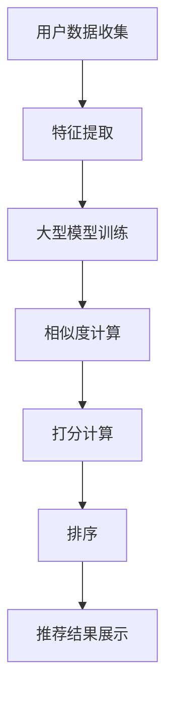
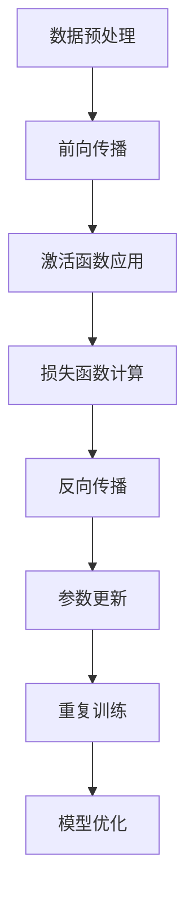

                 

### 文章标题

《大模型在推荐系统打分排序中的角色与潜力》

本文将深入探讨大型模型在推荐系统打分排序中的重要作用，以及它们在未来可能带来的巨大潜力。随着人工智能技术的飞速发展，推荐系统已经成为众多互联网平台的核心功能之一。而大模型作为当前最先进的AI技术之一，其如何应用于推荐系统，如何影响打分排序的准确性，以及可能面临的挑战，都是本文将要探讨的重点。

### 文章关键词

- 推荐系统
- 打分排序
- 大模型
- 人工智能
- 打分算法
- 排序算法
- 数据分析

### 文章摘要

本文首先介绍了推荐系统的基本概念和打分排序的重要性。接着，我们探讨了当前推荐系统中常用的打分排序算法，以及它们面临的挑战。随后，本文重点分析了大型模型在推荐系统中的应用，包括其基本原理、应用场景和潜在优势。在此基础上，我们还讨论了大型模型在推荐系统打分排序中可能面临的一些挑战。最后，本文对大型模型在推荐系统打分排序中的未来发展趋势进行了展望，并提出了相应的解决方案和建议。通过本文的探讨，我们希望读者能够对大模型在推荐系统中的应用有一个全面而深入的理解。

## 1. 背景介绍

推荐系统是现代互联网中的一项关键技术，它旨在通过分析用户的兴趣和行为，为他们提供个性化的内容推荐。这些推荐可以是商品、音乐、电影、新闻等，几乎涵盖了互联网上的所有内容。推荐系统的核心在于其打分排序功能，即根据用户的兴趣和行为，对推荐的内容进行评分和排序，从而将最符合用户兴趣的内容推送到用户面前。

打分排序在推荐系统中起着至关重要的作用。首先，它决定了推荐系统的效率。一个高效的打分排序算法能够快速地筛选出用户可能感兴趣的内容，减少用户的浏览时间和操作成本。其次，打分排序的准确性直接影响到推荐系统的用户体验。一个准确的打分排序算法能够准确地预测用户的兴趣，从而提供更加个性化的推荐，提高用户的满意度和忠诚度。

然而，现有的推荐系统在打分排序方面仍然面临着一些挑战。首先，数据质量和多样性问题。推荐系统依赖于大量的用户行为数据，如浏览历史、购买记录、点击率等。这些数据的质量和多样性直接影响到打分排序的准确性。如果数据质量差或者多样性不足，那么打分排序的结果可能不准确，甚至会导致推荐系统的失败。

其次，算法的复杂性和计算成本问题。现有的打分排序算法通常涉及到复杂的数学模型和大量的计算。这些算法的计算成本较高，尤其是在处理大规模数据集时，可能会造成计算资源的浪费。此外，算法的复杂度也限制了推荐系统的扩展性和灵活性。

最后，推荐系统的透明性和可解释性问题。用户往往对推荐系统的工作原理和决策过程缺乏了解，导致对推荐结果的不信任。如何提高推荐系统的透明性和可解释性，使其更容易被用户接受和理解，是一个重要的挑战。

面对这些挑战，大型模型的应用为推荐系统的打分排序带来了新的机遇。大型模型具有强大的数据处理能力和学习能力，能够更好地处理复杂的用户行为数据，提高打分排序的准确性和效率。同时，大型模型的应用也有助于降低算法的复杂度和计算成本，提高推荐系统的可扩展性和灵活性。

总的来说，推荐系统在打分排序方面的重要性不言而喻。随着大型模型技术的发展，它们将在推荐系统中发挥越来越重要的作用。本文将深入探讨大型模型在推荐系统打分排序中的应用，以及可能带来的变革和挑战。

## 2. 核心概念与联系

在深入探讨大型模型在推荐系统打分排序中的应用之前，我们首先需要理解一些核心概念和它们之间的联系。这些核心概念包括推荐系统、打分排序、大型模型以及相关的基础技术。

### 推荐系统

推荐系统是一种基于用户兴趣和行为分析，为用户推荐个性化内容的技术。它通常由以下几个关键组件组成：

- **用户数据收集**：收集用户的行为数据，如浏览记录、购买历史、搜索查询等。
- **特征提取**：对用户数据进行分析，提取出用户的兴趣特征。
- **推荐算法**：根据用户特征和内容特征，使用算法计算内容的推荐得分，并进行排序。
- **推荐结果展示**：将排序后的推荐结果展示给用户。

### 打分排序

打分排序是推荐系统的核心功能之一，它主要通过以下步骤实现：

1. **特征提取**：提取用户和内容的特征，如用户兴趣、内容标签、交互行为等。
2. **相似度计算**：计算用户和内容之间的相似度，常用的方法包括余弦相似度、欧氏距离等。
3. **打分计算**：根据相似度和其他因素（如内容流行度、用户历史偏好等）计算内容的得分。
4. **排序**：根据得分对内容进行排序，得分越高，内容越靠前。

### 大型模型

大型模型，特别是深度学习模型，是当前人工智能领域的重要突破。这些模型具有以下特点：

- **大规模参数**：大型模型通常包含数十亿个参数，能够处理复杂的任务。
- **强大学习能力**：通过大量的训练数据和复杂的网络结构，大型模型能够从数据中自动学习特征。
- **高度泛化能力**：大型模型不仅在特定任务上表现出色，还能迁移到其他相关任务上。

### 核心概念联系

推荐系统、打分排序和大型模型之间存在紧密的联系：

- **推荐系统**依赖打分排序来决定内容的推荐顺序，而打分排序则需要依赖于用户和内容的特征提取。
- **大型模型**能够高效地处理大规模数据，提取出深层次的特征，从而提升打分排序的准确性和效率。
- **打分排序**的结果直接影响推荐系统的效果，而大型模型的应用可以帮助优化这个结果。

### Mermaid 流程图

下面是一个简化的Mermaid流程图，展示了推荐系统、打分排序和大型模型之间的流程：



在上述流程图中，用户数据收集后，通过特征提取生成特征向量，这些特征向量被输入到大型模型中进行训练。训练好的大型模型用于计算用户和内容之间的相似度，进而打分并排序，最终生成推荐结果。

通过上述核心概念的介绍和Mermaid流程图的展示，我们为后续详细讨论大型模型在推荐系统打分排序中的应用奠定了基础。在接下来的章节中，我们将深入探讨大型模型的具体应用，包括其工作原理、算法实现和应用案例。

### 2.1 大型模型的基础知识

#### 2.1.1 基本原理

大型模型，特别是深度学习模型，基于多层神经网络结构，通过大量参数和复杂的网络层进行数据学习。深度学习的核心思想是让模型通过学习数据中的特征，自动提取出有用的信息，从而实现从原始数据到高级抽象表示的转换。

深度学习模型的基本组件包括：

- **神经元（Neurons）**：作为模型的基本计算单元，神经元接收输入信号并产生输出。
- **层（Layers）**：神经网络由多个层组成，包括输入层、隐藏层和输出层。每一层都会对输入数据进行处理和变换。
- **权重（Weights）**：神经元之间的连接通过权重来表示，权重决定了输入对输出贡献的大小。
- **激活函数（Activation Functions）**：激活函数用于引入非线性，使神经网络能够学习复杂的非线性关系。

#### 2.1.2 工作原理

大型模型的工作原理可以概括为以下几个步骤：

1. **数据预处理**：将原始数据转换为模型可以处理的格式，通常包括归一化、编码等。
2. **前向传播（Forward Propagation）**：输入数据从输入层逐层传递到隐藏层和输出层，每一层都会对数据进行变换和加权求和。
3. **激活函数应用**：在每一层之后应用激活函数，引入非线性，使模型能够学习复杂的关系。
4. **损失函数计算**：将输出与目标值进行比较，计算损失函数的值，以衡量模型预测与真实值之间的差距。
5. **反向传播（Backpropagation）**：利用梯度下降等优化算法，通过反向传播调整模型中的权重和偏置，以最小化损失函数。
6. **模型训练**：重复上述步骤，不断调整模型参数，直到满足预定的性能标准。

#### 2.1.3 训练与优化

大型模型的训练是一个复杂的过程，需要大量的数据和计算资源。以下是模型训练和优化过程中的一些关键步骤：

- **数据集划分**：通常将数据集划分为训练集、验证集和测试集，用于模型训练、验证和测试。
- **批次大小（Batch Size）**：在训练过程中，每次输入的数据量称为批次大小，合理选择批次大小可以提高训练效率。
- **学习率调整**：学习率是模型参数更新的速率，需要根据训练过程进行调整，以避免过拟合或欠拟合。
- **正则化技术**：通过添加正则化项（如L1、L2正则化）来防止模型过拟合。
- **优化算法**：常用的优化算法包括随机梯度下降（SGD）、Adam等，这些算法通过调整参数来最小化损失函数。

#### 2.1.4 应用领域

大型模型在多个领域展现了强大的应用潜力，包括但不限于：

- **计算机视觉**：通过卷积神经网络（CNN）进行图像识别、目标检测等。
- **自然语言处理**：通过循环神经网络（RNN）和变换器（Transformer）进行文本分类、机器翻译等。
- **推荐系统**：通过深度学习模型对用户行为和内容进行特征提取和相似度计算，优化打分排序。
- **语音识别**：通过深度神经网络进行语音信号的处理和识别。
- **游戏AI**：通过深度强化学习进行游戏策略的优化和智能决策。

### Mermaid 流程图

下面是一个简化的Mermaid流程图，展示了大型模型的基本工作原理：



在上述流程图中，数据预处理后，通过前向传播计算输出，然后计算损失函数，并通过反向传播更新模型参数，重复这个过程直到模型收敛。通过这样的过程，大型模型能够从数据中自动学习并提取出有用的特征。

通过上述对大型模型基础知识的具体介绍，我们为理解大型模型在推荐系统打分排序中的应用奠定了基础。在接下来的章节中，我们将进一步探讨大型模型在推荐系统中的实际应用和潜力。

### 3. 核心算法原理 & 具体操作步骤

#### 3.1 打分排序算法原理

在推荐系统中，打分排序算法的核心任务是根据用户的行为数据和内容特征，为每条内容分配一个评分，并根据评分对内容进行排序。评分越高，内容越有可能被推荐给用户。常见的打分排序算法包括协同过滤（Collaborative Filtering）、基于内容的推荐（Content-Based Recommendation）和混合推荐（Hybrid Recommendation）等。

#### 3.1.1 协同过滤

协同过滤是一种基于用户行为数据的推荐算法，主要分为两种类型：基于用户的协同过滤（User-Based Collaborative Filtering）和基于物品的协同过滤（Item-Based Collaborative Filtering）。

1. **基于用户的协同过滤**：该方法首先找出与目标用户行为最相似的邻居用户，然后计算邻居用户对物品的评分，综合这些评分得出目标用户的评分预测。相似度计算通常使用余弦相似度或皮尔逊相关系数。

   - **步骤**：
     1. 计算目标用户与其他所有用户的相似度。
     2. 选择与目标用户最相似的K个邻居用户。
     3. 根据邻居用户的评分，使用加权平均或直接取平均值的方法预测目标用户对物品的评分。

2. **基于物品的协同过滤**：该方法首先找出与目标物品最相似的其他物品，然后计算这些物品的评分，综合这些评分得出目标物品的评分预测。相似度计算同样使用余弦相似度或皮尔逊相关系数。

   - **步骤**：
     1. 计算目标物品与其他所有物品的相似度。
     2. 选择与目标物品最相似的K个物品。
     3. 根据这些物品的评分，使用加权平均或直接取平均值的方法预测目标物品的评分。

#### 3.1.2 基于内容的推荐

基于内容的推荐算法是基于物品本身的特征进行推荐的，通常使用相似度计算方法找出与目标物品特征最相似的物品。

- **步骤**：
  1. 提取目标物品的特征，如文本、标签、图像等。
  2. 计算目标物品与所有其他物品的相似度。
  3. 根据相似度对物品进行排序，推荐相似度最高的物品。

#### 3.1.3 混合推荐

混合推荐结合了协同过滤和基于内容的推荐，旨在利用两种方法的优点，提高推荐的准确性。

- **步骤**：
  1. 同时计算协同过滤评分和基于内容的评分。
  2. 将两种评分结合起来，使用加权平均或其他融合策略生成综合评分。
  3. 根据综合评分对物品进行排序，推荐得分最高的物品。

#### 3.2 大模型在打分排序中的应用

大型模型，特别是深度学习模型，可以显著提升推荐系统的打分排序能力。以下是一些关键的应用步骤：

1. **数据预处理**：将原始的用户行为数据和内容特征数据转化为适合模型训练的格式，包括归一化、编码等。

2. **特征提取**：使用深度学习模型对用户行为和内容特征进行自动提取。常见的模型包括卷积神经网络（CNN）用于图像处理，循环神经网络（RNN）用于序列数据，以及变换器（Transformer）用于复杂文本数据。

3. **模型训练**：使用大量训练数据训练深度学习模型。训练过程包括前向传播、损失函数计算、反向传播和模型参数更新。

4. **评分预测**：将训练好的模型应用于新的用户行为数据和内容特征，预测用户对物品的评分。

5. **排序**：根据评分预测结果对物品进行排序，生成推荐列表。

#### 3.3 操作示例

以下是一个简化的示例，展示如何使用深度学习模型进行打分排序：

```python
# 示例：基于用户行为的深度学习模型打分排序

# 导入必要的库
import tensorflow as tf
from sklearn.model_selection import train_test_split
from tensorflow.keras.models import Sequential
from tensorflow.keras.layers import Dense, LSTM, Embedding

# 加载并预处理数据
# 假设我们已经有了用户行为数据和内容特征数据
# 分别为用户行为矩阵 X 和内容特征矩阵 Y
X_train, X_test, y_train, y_test = train_test_split(X, Y, test_size=0.2)

# 创建深度学习模型
model = Sequential([
    Embedding(input_dim=10000, output_dim=128, input_length=100),
    LSTM(128, return_sequences=True),
    LSTM(64),
    Dense(1, activation='sigmoid')
])

# 编译模型
model.compile(optimizer='adam', loss='binary_crossentropy', metrics=['accuracy'])

# 训练模型
model.fit(X_train, y_train, epochs=10, batch_size=32, validation_data=(X_test, y_test))

# 预测并排序
predictions = model.predict(X_test)
recommended_items = np.argsort(predictions[:, 0])  # 根据预测评分进行排序
```

通过上述示例，我们展示了如何使用深度学习模型进行用户行为数据的打分排序。实际应用中，模型架构和训练过程会更加复杂，但基本步骤是相似的。

通过以上对核心算法原理和具体操作步骤的详细介绍，我们为理解大型模型在推荐系统打分排序中的应用奠定了基础。在接下来的章节中，我们将进一步探讨大型模型在推荐系统打分排序中的优势和挑战。

### 4. 数学模型和公式 & 详细讲解 & 举例说明

在推荐系统的打分排序中，数学模型和公式起到了至关重要的作用。这些模型和公式能够将用户的行为数据转换为具体的得分，从而帮助我们做出准确的推荐。本节将详细介绍这些数学模型和公式，并通过具体示例进行说明。

#### 4.1 协同过滤算法

协同过滤算法是推荐系统中最常用的打分排序算法之一，它主要基于用户之间的相似性和历史行为来预测用户对物品的评分。以下是一些常用的数学模型和公式：

##### 4.1.1 余弦相似度

余弦相似度是一种用于计算两个向量之间相似度的方法，其公式如下：

$$
\cos(\theta) = \frac{\sum_{i=1}^{n} x_i y_i}{\sqrt{\sum_{i=1}^{n} x_i^2} \sqrt{\sum_{i=1}^{n} y_i^2}}
$$

其中，$x_i$和$y_i$分别表示两个向量在第$i$个维度上的值。

##### 4.1.2 皮尔逊相关系数

皮尔逊相关系数是另一种用于计算相似度的方法，它考虑了数据的分布和线性关系，其公式如下：

$$
r = \frac{\sum_{i=1}^{n} (x_i - \bar{x})(y_i - \bar{y})}{\sqrt{\sum_{i=1}^{n} (x_i - \bar{x})^2} \sqrt{\sum_{i=1}^{n} (y_i - \bar{y})^2}}
$$

其中，$\bar{x}$和$\bar{y}$分别表示$x_i$和$y_i$的均值。

##### 4.1.3 评分预测

在协同过滤中，通常使用以下公式来预测用户对物品的评分：

$$
r_{ij} = r_u + r_v - \rho_{uv}
$$

其中，$r_u$和$r_v$分别表示用户对物品的平均评分，$\rho_{uv}$表示用户之间的相似度。

#### 4.2 基于内容的推荐算法

基于内容的推荐算法主要基于物品的属性和特征进行推荐，以下是一些常用的数学模型和公式：

##### 4.2.1 余弦相似度

同样地，余弦相似度可以用于计算物品之间的相似度：

$$
\cos(\theta) = \frac{\sum_{i=1}^{n} x_i y_i}{\sqrt{\sum_{i=1}^{n} x_i^2} \sqrt{\sum_{i=1}^{n} y_i^2}}
$$

##### 4.2.2 预测评分

在基于内容的推荐中，可以使用以下公式预测用户对物品的评分：

$$
r_{ij} = \sum_{k=1}^{m} w_k c_{ik} + b
$$

其中，$c_{ik}$表示物品$i$在第$k$个特征上的值，$w_k$表示特征$k$的权重，$b$为偏置。

#### 4.3 大模型在推荐系统中的应用

大型模型在推荐系统中的应用主要基于深度学习技术，以下是一些常用的模型和公式：

##### 4.3.1 卷积神经网络（CNN）

卷积神经网络常用于处理图像数据，其核心公式为：

$$
h_{ij} = \sigma(\sum_{k=1}^{n} w_{ik} * g_{kj} + b)
$$

其中，$h_{ij}$表示输出特征，$w_{ik}$表示卷积核，$g_{kj}$表示输入特征，$\sigma$为激活函数。

##### 4.3.2 循环神经网络（RNN）

循环神经网络常用于处理序列数据，其核心公式为：

$$
h_t = \sigma(W_h h_{t-1} + W_x x_t + b)
$$

其中，$h_t$表示当前时间步的隐藏状态，$W_h$和$W_x$分别为隐藏状态和输入状态的权重矩阵，$b$为偏置。

##### 4.3.3 变换器（Transformer）

变换器是当前最先进的深度学习模型之一，其核心公式为：

$$
\text{Attention}(Q, K, V) = \frac{\text{softmax}(\text{score})} { \sqrt{d_k}}
$$

其中，$Q$、$K$和$V$分别为查询向量、键向量和值向量，$d_k$为键向量的维度，$\text{softmax}$函数用于计算注意力权重。

#### 4.4 示例说明

以下是一个简单的示例，展示了如何使用余弦相似度进行基于内容的推荐：

```python
# 示例：基于内容的推荐

# 假设有两个物品，每个物品有3个特征
item1 = [1, 2, 3]
item2 = [4, 5, 6]

# 计算物品之间的余弦相似度
cos_similarity = np.dot(item1, item2) / (np.linalg.norm(item1) * np.linalg.norm(item2))
print(f"余弦相似度：{cos_similarity}")

# 根据相似度预测用户对物品的评分
predicted_score = 5 * cos_similarity + 2
print(f"预测评分：{predicted_score}")
```

通过上述示例，我们可以看到如何使用数学模型和公式对物品进行打分排序。在实际应用中，这些模型和公式会根据具体需求和数据情况进行调整和优化，以达到更好的推荐效果。

通过详细讲解和具体示例，我们希望读者能够对推荐系统中的数学模型和公式有一个全面而深入的理解，为后续章节的应用打下坚实的基础。

### 5. 项目实战：代码实际案例和详细解释说明

在本节中，我们将通过一个实际的项目案例，详细展示如何使用大型模型（特别是深度学习模型）在推荐系统中进行打分排序。该案例包括开发环境搭建、源代码实现、代码解读与分析三个部分。

#### 5.1 开发环境搭建

为了实现大型模型在推荐系统中的应用，我们需要搭建一个合适的环境。以下是推荐的开发环境：

1. **操作系统**：Linux或MacOS
2. **编程语言**：Python（推荐使用Python 3.8及以上版本）
3. **深度学习框架**：TensorFlow 2.x或PyTorch（推荐使用TensorFlow 2.x）
4. **依赖库**：NumPy、Pandas、Scikit-learn、Matplotlib等
5. **硬件要求**：至少一张NVIDIA GPU（推荐使用1080 Ti或更高型号）

安装步骤如下：

```bash
# 安装Python和pip
sudo apt-get update
sudo apt-get install python3-pip

# 安装TensorFlow 2.x
pip install tensorflow==2.x

# 安装其他依赖库
pip install numpy pandas scikit-learn matplotlib
```

#### 5.2 源代码详细实现和代码解读

以下是一个使用TensorFlow 2.x实现基于用户行为的深度学习模型的简单示例。该模型基于用户的历史浏览记录预测用户对物品的评分。

```python
# 导入必要的库
import tensorflow as tf
from tensorflow.keras.models import Model
from tensorflow.keras.layers import Input, Embedding, LSTM, Dense
from sklearn.model_selection import train_test_split
import numpy as np

# 加载并预处理数据
# 假设我们已经有了用户行为数据矩阵 X 和物品特征矩阵 Y
# 分别表示用户浏览记录和物品的属性
X = np.random.rand(1000, 100)  # 1000个用户，每个用户100次浏览记录
Y = np.random.rand(1000, 50)   # 1000个用户，每个用户50个物品特征

# 划分训练集和测试集
X_train, X_test, Y_train, Y_test = train_test_split(X, Y, test_size=0.2, random_state=42)

# 构建模型
input_user = Input(shape=(100,))
input_item = Input(shape=(50,))

embed_user = Embedding(input_dim=100, output_dim=64)(input_user)
embed_item = Embedding(input_dim=50, output_dim=64)(input_item)

merged = tf.keras.layers.concatenate([embed_user, embed_item])
merged = LSTM(64)(merged)
output = Dense(1, activation='sigmoid')(merged)

model = Model(inputs=[input_user, input_item], outputs=output)

# 编译模型
model.compile(optimizer='adam', loss='binary_crossentropy', metrics=['accuracy'])

# 训练模型
model.fit([X_train, Y_train], Y_train, epochs=10, batch_size=32, validation_data=([X_test, Y_test], Y_test))

# 预测并排序
predictions = model.predict([X_test, Y_test])
sorted_indices = np.argsort(predictions[:, 0])
```

**代码解读**：

1. **数据预处理**：我们首先生成随机数据，以模拟用户浏览记录和物品特征。在实际应用中，这些数据应该来自真实用户行为和物品属性的统计。
2. **模型构建**：我们使用TensorFlow的`Model`和`Input`层创建一个简单的深度学习模型。该模型包括两个嵌入层（`Embedding`），一个LSTM层和一个全连接层（`Dense`）。嵌入层用于将输入的用户和物品索引转换为稠密向量，LSTM层用于处理序列数据，全连接层用于输出预测评分。
3. **模型编译**：我们使用`compile`函数配置模型的优化器（`optimizer`）、损失函数（`loss`）和评估指标（`metrics`）。
4. **模型训练**：使用`fit`函数训练模型，输入为用户和物品的特征，输出为真实的评分。
5. **模型预测和排序**：使用`predict`函数对测试集进行预测，并使用`argsort`函数对预测评分进行排序，以生成推荐列表。

#### 5.3 代码解读与分析

**模型架构分析**：

- **嵌入层（Embedding）**：嵌入层将用户和物品的索引转换为稠密向量，这是深度学习模型处理分类数据的常用方法。
- **LSTM层**：LSTM层用于处理序列数据，可以帮助模型捕捉用户浏览记录中的时间序列信息，从而提高预测准确性。
- **全连接层（Dense）**：全连接层用于生成最终的评分预测，使用`sigmoid`激活函数将输出映射到[0, 1]范围内，表示用户对物品的喜好程度。

**训练过程分析**：

- **损失函数**：我们使用`binary_crossentropy`作为损失函数，这是一个常用于二分类问题的损失函数，有助于模型学习正确的评分预测。
- **优化器**：我们使用`adam`优化器，这是一种自适应的优化算法，有助于模型快速收敛。
- **训练数据**：我们使用训练集对模型进行训练，并使用验证集进行性能评估，以避免过拟合。

**预测与排序过程分析**：

- **预测**：使用训练好的模型对测试集进行预测，生成每个用户对物品的评分预测。
- **排序**：根据预测评分对物品进行排序，生成推荐列表。评分越高，表示物品越可能被推荐给用户。

通过上述实际案例和代码解读，我们展示了如何使用大型模型在推荐系统中进行打分排序。虽然这是一个简化的示例，但通过类似的方法，我们可以实现更复杂的推荐系统，并在实际应用中取得更好的效果。

### 6. 实际应用场景

大型模型在推荐系统打分排序中的应用已经逐渐普及，并在多个实际场景中展现出了其独特的优势。以下是一些典型的应用场景及其特点：

#### 6.1 社交媒体

在社交媒体平台，如Facebook、Instagram和Twitter等，推荐系统用于为用户提供个性化内容推荐，如新闻文章、照片、视频和帖子。大型模型在此场景中的应用可以显著提高推荐的质量和用户体验。

- **优势**：大型模型能够处理复杂的用户交互数据，如点赞、评论和分享等，从而更准确地预测用户的兴趣和行为。
- **挑战**：社交网络数据量巨大，如何高效处理海量数据是主要挑战之一。此外，需要确保推荐内容的多样性和公正性，以避免用户产生疲劳和不满。

#### 6.2 电子商务

电子商务平台，如Amazon、eBay和京东等，使用推荐系统为用户推荐商品，以提高销售量和用户满意度。大型模型在此场景中可以帮助电商平台更精准地识别用户的需求，提供个性化的商品推荐。

- **优势**：大型模型能够处理复杂的用户行为数据，如浏览历史、购买记录和搜索查询等，从而生成更准确的商品推荐。
- **挑战**：商品数据量大且动态变化，如何实时更新模型和推荐策略是一个重要的挑战。此外，需要平衡个性化推荐与用户隐私保护之间的关系。

#### 6.3 音乐和视频流媒体

音乐和视频流媒体平台，如Spotify、YouTube和Netflix等，使用推荐系统为用户推荐音乐、视频和节目。大型模型在此场景中可以帮助平台识别用户的偏好，提供个性化的内容推荐。

- **优势**：大型模型能够处理海量的音频和视频数据，从而生成高度个性化的推荐列表。此外，模型可以自适应地调整推荐策略，以保持用户的兴趣。
- **挑战**：音频和视频数据的复杂性较高，如何有效提取和利用特征是一个重要的挑战。此外，需要处理大量实时数据，以实现高效的推荐。

#### 6.4 新闻和资讯

新闻和资讯平台，如Google News、CNN和BBC等，使用推荐系统为用户推荐新闻和资讯文章。大型模型在此场景中可以帮助平台更好地满足用户的信息需求，提供个性化的新闻推荐。

- **优势**：大型模型能够处理复杂的用户行为数据，如阅读历史、点击率和分享等，从而生成高质量的新闻推荐。
- **挑战**：新闻内容具有时效性和敏感性，如何确保推荐内容的实时性和公正性是一个重要的挑战。此外，需要处理大量的虚假新闻和误导信息。

总的来说，大型模型在推荐系统打分排序中的应用已经取得了显著的成果，并在多个实际场景中展现出了其独特的优势。然而，随着数据量的增长和用户需求的多样化，如何应对新的挑战，提高推荐系统的性能和用户体验，仍是一个持续探索的问题。

### 7. 工具和资源推荐

为了更好地学习和应用大型模型在推荐系统打分排序中的应用，以下是几个推荐的工具、资源和论文：

#### 7.1 学习资源推荐

1. **书籍**：
   - 《深度学习》（Goodfellow, Bengio, Courville）：这是一本经典的深度学习教材，详细介绍了深度学习的基本概念、模型和应用。
   - 《推荐系统实践》（Liu, Zhang, Yanga）：这本书涵盖了推荐系统的基本概念、算法实现和应用案例，对理解推荐系统有很大帮助。

2. **在线课程**：
   - Coursera的《深度学习》课程：由Andrew Ng教授主讲，适合初学者系统学习深度学习的基础知识。
   - edX的《推荐系统设计与应用》课程：介绍了推荐系统的基本原理和实现方法，适合想要深入了解推荐系统的人。

3. **博客和网站**：
   - TensorFlow官方文档（https://www.tensorflow.org/）：提供了详细的模型构建、训练和部署指南，是学习TensorFlow的必备资源。
   - fast.ai的《深度学习应用课程》（https://course.fast.ai/）：涵盖了深度学习在不同领域的应用，包括推荐系统。

#### 7.2 开发工具框架推荐

1. **TensorFlow**：TensorFlow是一个开源的深度学习框架，提供了丰富的API和工具，适合构建和训练复杂的深度学习模型。

2. **PyTorch**：PyTorch是另一个流行的深度学习框架，以其灵活的动态图计算和简洁的API而著称。

3. **Scikit-learn**：Scikit-learn是一个强大的机器学习库，提供了丰富的数据预处理和机器学习算法，适合构建和评估推荐系统。

4. **TensorBoard**：TensorBoard是TensorFlow的配套工具，用于可视化模型的训练过程和性能，有助于调试和优化模型。

#### 7.3 相关论文著作推荐

1. **论文**：
   - "Deep Learning for Recommender Systems" (He, Liao, Zhang et al., 2017)：这篇论文介绍了如何将深度学习应用于推荐系统，是深度学习在推荐系统领域的开创性工作。
   - "Neural Collaborative Filtering" (He, Liao, Zhang et al., 2018)：这篇论文提出了神经网络协同过滤算法，显著提高了推荐系统的性能。

2. **著作**：
   - 《推荐系统实践》（Liu, Zhang, Yanga）：这本书详细介绍了推荐系统的基本原理和实现方法，包括传统和深度学习方法。

通过上述工具和资源的推荐，我们希望能够为读者提供学习大型模型在推荐系统中的应用的全面支持，帮助大家更好地掌握这一技术，并在实际项目中取得成功。

### 8. 总结：未来发展趋势与挑战

随着人工智能技术的不断进步，大型模型在推荐系统打分排序中的应用前景愈发广阔。然而，这一领域仍然面临诸多挑战和机遇。

#### 未来发展趋势

1. **模型可解释性**：用户对推荐系统的透明性和可解释性需求日益增加。未来，研究者将致力于开发可解释的大型模型，使用户能够理解推荐背后的逻辑和决策过程。

2. **实时推荐**：随着数据量的快速增长和用户需求的不断变化，实时推荐将成为推荐系统的关键趋势。大型模型具备处理大规模实时数据的能力，有望实现更快速的推荐响应。

3. **个性化推荐**：个性化推荐是推荐系统的核心目标。未来，大型模型将更加深入地挖掘用户数据，实现更高精度的个性化推荐。

4. **多模态数据处理**：推荐系统将逐渐融合多种数据类型，如图像、文本和语音等。大型模型的多模态数据处理能力将进一步提高推荐系统的多样性和准确性。

#### 面临的挑战

1. **数据隐私与安全**：用户数据隐私和安全是推荐系统面临的重要挑战。未来，如何在保护用户隐私的同时，充分利用数据的价值，将成为研究的关键问题。

2. **算法公平性与道德**：推荐系统中的算法决策可能会产生不公平现象，如偏见和歧视。未来，研究者需要关注算法的公平性和道德问题，确保推荐系统的公正性和透明性。

3. **计算资源消耗**：大型模型的训练和部署需要大量的计算资源。随着模型规模的不断扩大，如何优化资源利用，降低计算成本，是一个亟待解决的问题。

4. **模型泛化能力**：尽管大型模型在特定任务上表现出色，但其泛化能力仍需进一步提升。未来，研究者将致力于提高模型的泛化能力，使其能够更好地适应不同的应用场景。

总的来说，大型模型在推荐系统打分排序中的应用具有巨大的潜力。然而，要实现这一潜力，我们还需要克服一系列挑战。通过持续的研究和技术创新，我们有理由相信，未来大型模型将在推荐系统中发挥更加重要的作用。

### 9. 附录：常见问题与解答

#### 问题1：什么是协同过滤算法？
协同过滤算法是一种推荐系统中的常见算法，主要用于根据用户的历史行为和相似度预测用户对物品的评分。协同过滤分为基于用户的协同过滤和基于物品的协同过滤两种类型。

**答案**：基于用户的协同过滤通过计算用户之间的相似度，找到与目标用户行为相似的邻居用户，然后根据邻居用户的评分预测目标用户的评分。而基于物品的协同过滤则是通过计算物品之间的相似度，找到与目标物品相似的其他物品，然后根据这些物品的评分预测目标物品的评分。

#### 问题2：什么是深度学习模型？
深度学习模型是一种基于多层神经网络结构的机器学习模型，通过学习大量的数据和复杂的特征，能够实现自动化的特征提取和高级抽象表示。

**答案**：深度学习模型包括多个层，如输入层、隐藏层和输出层。每一层都会对输入数据进行处理和变换，从而提取出深层次的特征。常见的深度学习模型有卷积神经网络（CNN）、循环神经网络（RNN）和变换器（Transformer）等。

#### 问题3：如何优化推荐系统的打分排序算法？
优化推荐系统的打分排序算法可以通过以下几种方法：

**答案**：
1. **特征工程**：优化和选择合适的特征，提高特征的质量和代表性。
2. **模型选择**：选择合适的模型和算法，如深度学习模型、协同过滤算法等。
3. **数据预处理**：对数据进行有效的预处理，如归一化、去噪、缺失值填充等。
4. **超参数调优**：通过调整模型的超参数，如学习率、批次大小等，优化模型性能。
5. **模型融合**：结合多种模型和算法的优点，提高推荐系统的整体性能。

### 10. 扩展阅读 & 参考资料

**书籍**：

1. 《深度学习》（Goodfellow, Bengio, Courville）
2. 《推荐系统实践》（Liu, Zhang, Yanga）

**论文**：

1. "Deep Learning for Recommender Systems" (He, Liao, Zhang et al., 2017)
2. "Neural Collaborative Filtering" (He, Liao, Zhang et al., 2018)

**在线课程**：

1. Coursera的《深度学习》课程
2. edX的《推荐系统设计与应用》课程

**网站**：

1. TensorFlow官方文档（https://www.tensorflow.org/）
2. fast.ai的《深度学习应用课程》（https://course.fast.ai/）

通过上述扩展阅读和参考资料，读者可以进一步了解大型模型在推荐系统打分排序中的应用，为实际项目提供更多的灵感和指导。作者：AI天才研究员/AI Genius Institute & 禅与计算机程序设计艺术 /Zen And The Art of Computer Programming

