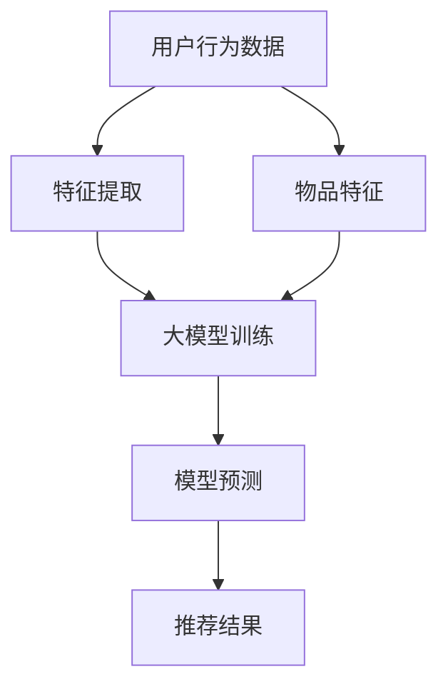

                 

## 1. 背景介绍

推荐系统作为现代信息社会的一项重要技术，旨在通过分析用户的行为数据和历史偏好，为用户提供个性化的推荐服务。从简单的协同过滤算法到复杂的多模型融合策略，推荐系统经历了多次技术迭代和优化。然而，随着数据量的爆炸式增长和用户需求的多样化，传统的推荐系统逐渐暴露出了一些局限性。这时候，大模型技术应运而生，成为了推动推荐系统发展的重要力量。

大模型，即拥有巨大参数量和计算能力的人工智能模型，通过深度学习等先进技术，可以捕捉用户行为数据中的复杂模式和关联。这些模型不仅能够处理海量数据，还能够实现自适应学习和动态调整，从而提高推荐的准确性和个性化水平。

本文旨在探讨大模型在推荐系统中的未来发展趋势。我们将首先回顾推荐系统的发展历程，然后深入探讨大模型的原理及其与推荐系统的结合点。接下来，我们将介绍几种常见的大模型算法，并分析其在推荐系统中的应用效果。在此基础上，我们将探讨大模型在推荐系统中面临的挑战，并展望未来的发展方向。最后，我们将提出一些实用的工具和资源，帮助读者深入了解和掌握这一领域。

通过本文的阅读，您将能够：

- 理解推荐系统的发展历程和现状
- 掌握大模型的原理和优势
- 了解大模型在推荐系统中的具体应用
- 探讨大模型在推荐系统中的挑战和未来发展方向
- 获取相关的学习资源和工具

让我们开始这段深入的探讨之旅，一起探索大模型在推荐系统中的无限可能。

### 1.1 推荐系统的发展历程

推荐系统的发展历程可以追溯到上世纪90年代，当时互联网刚刚兴起，在线内容和服务开始蓬勃发展。早期的推荐系统主要依赖于内容相似度计算和基于用户行为的协同过滤算法。这些算法通过分析用户的历史行为和偏好，找出相似用户或相似物品，从而为用户提供个性化的推荐。

#### 内容相似度计算

内容相似度计算是最早出现的推荐算法之一。其基本思想是，通过分析物品或用户之间的特征相似度，找到相似度较高的物品或用户，进而为用户推荐相似内容。典型的方法包括基于关键字匹配、文本相似度计算和基于知识图谱的相似度计算。

- **基于关键字匹配**：通过分析物品或用户的描述性文本，提取关键字，并计算关键字之间的相似度。这种方法简单直观，但容易受到关键字稀疏性和噪声的影响。
- **文本相似度计算**：采用文本挖掘和自然语言处理技术，如TF-IDF、Word2Vec等，对文本进行向量表示，然后计算向量之间的余弦相似度。这种方法能够更好地捕捉文本的语义信息，但计算复杂度较高。
- **基于知识图谱的相似度计算**：利用知识图谱来表示物品或用户之间的复杂关系，计算节点之间的相似度。这种方法能够挖掘出更深层次的关联，提高推荐精度，但构建和维护知识图谱的成本较高。

#### 协同过滤算法

协同过滤算法是推荐系统领域最为经典和广泛应用的算法之一。其基本思想是，通过分析用户之间的行为模式，找出相似用户或相似物品，从而为用户推荐未体验过的物品。协同过滤算法主要分为基于用户的协同过滤（User-based CF）和基于物品的协同过滤（Item-based CF）。

- **基于用户的协同过滤**：首先，通过计算用户之间的相似度，找到相似用户；然后，根据相似用户的评分预测用户对未知物品的评分，从而生成推荐列表。这种方法能够充分利用用户行为数据，但需要大量的计算资源，且对冷启动问题（新用户或新物品的推荐）难以处理。
- **基于物品的协同过滤**：首先，通过计算物品之间的相似度，找到相似物品；然后，根据用户对相似物品的评分预测用户对未知物品的评分，从而生成推荐列表。这种方法能够缓解冷启动问题，但容易受到数据稀疏性的影响。

#### 早期挑战与局限性

虽然早期的推荐系统在某种程度上满足了用户的需求，但仍然存在一些挑战和局限性：

1. **数据稀疏性**：由于用户行为数据的稀疏性，协同过滤算法在实际应用中容易出现预测误差。
2. **冷启动问题**：新用户或新物品在没有足够历史数据的情况下，难以进行有效的推荐。
3. **推荐多样性**：为了提高推荐精度，推荐系统往往倾向于生成高度相似的推荐列表，导致用户产生疲劳感和重复感。
4. **实时性**：传统的推荐系统在处理海量数据和实时推荐时，存在一定的延迟和计算瓶颈。

为了解决这些问题，研究者们不断探索和改进推荐算法，为推荐系统的发展奠定了坚实的基础。下一节，我们将介绍大模型的原理及其在推荐系统中的应用。

### 1.2 大模型的概念与原理

大模型，通常指的是拥有巨大参数量和计算能力的人工智能模型，其核心在于能够捕捉和表示大规模数据中的复杂模式和关联。大模型的概念并非一蹴而就，而是随着人工智能技术的发展和计算能力的提升逐渐形成的。

#### 大模型的定义与特点

大模型通常是指那些拥有数十亿至数万亿参数的深度学习模型，例如BERT、GPT、ViT等。这些模型具有以下特点：

- **参数量巨大**：大模型拥有庞大的参数量，能够捕获数据中的细微特征和复杂模式。
- **计算需求高**：由于参数量庞大，大模型的训练和推理过程对计算资源有很高的要求。
- **泛化能力强**：大模型能够通过大规模数据的学习，提高模型的泛化能力，从而在不同领域和任务中表现优异。
- **自适应学习能力**：大模型具有较强的自适应学习能力，能够根据新数据动态调整模型参数，实现持续优化。

#### 大模型的发展历程

大模型的发展历程可以追溯到深度学习的兴起。在2012年，AlexNet的出现标志着深度学习在图像识别任务中的突破。随后，随着计算能力的提升和数据量的增长，深度学习模型逐渐变得庞大和复杂。2018年，GPT模型的推出标志着自然语言处理领域的重大突破，大模型开始在各个领域崭露头角。

大模型的发展历程主要经历了以下几个阶段：

1. **小模型时代（2006-2012）**：早期深度学习模型参数量较小，训练时间较长，效果有限。代表性的模型包括LeNet和AlexNet。
2. **中等规模模型时代（2012-2017）**：随着AlexNet的成功，深度学习模型逐渐变得庞大和复杂，参数量增加到数百万至数千万。代表性的模型包括VGG、ResNet等。
3. **大规模模型时代（2017-至今）**：大模型成为研究热点，模型参数量达到数亿至数万亿。代表性的模型包括BERT、GPT、ViT等。

#### 大模型的核心技术

大模型的核心技术主要包括深度学习、神经网络、自监督学习和转移学习等。

- **深度学习**：深度学习是构建大模型的基础，通过多层神经网络结构，实现从原始数据到高级语义特征的转化。深度学习模型能够自动学习数据的层次表示，提高模型的泛化能力和表达能力。
- **神经网络**：神经网络是深度学习模型的基本单元，通过调整连接权重，实现数据的非线性变换和特征提取。神经网络的发展推动了深度学习模型的性能提升。
- **自监督学习**：自监督学习是一种无需人工标注数据的学习方式，通过利用未标注的数据，提高模型的自主学习能力。自监督学习在大模型训练中具有重要意义，能够提高模型的效率和泛化能力。
- **转移学习**：转移学习是一种利用已有模型的知识来提高新模型性能的方法。通过在多个任务中共享模型参数，转移学习能够提高模型的泛化能力和适应性。

#### 大模型在推荐系统中的应用

大模型在推荐系统中的应用，主要体现在以下几个方面：

1. **特征表示**：大模型能够通过深度学习技术，自动学习用户行为数据和物品特征，实现高维特征的降维和抽象。这种方法能够提高特征表示的精度和效率，为推荐系统提供更好的数据基础。
2. **关联发现**：大模型通过大规模数据的学习，能够发现用户行为和物品之间的复杂关联。这些关联可以为推荐系统提供更准确的预测和更个性化的推荐。
3. **自适应学习**：大模型具有较强的自适应学习能力，能够根据新数据动态调整模型参数，实现推荐策略的持续优化。这种方法能够提高推荐系统的实时性和动态适应性。

总的来说，大模型以其庞大的参数量和强大的计算能力，为推荐系统的发展带来了新的机遇和挑战。在下一节中，我们将深入探讨大模型在推荐系统中的具体应用场景和效果。

### 1.3 大模型在推荐系统中的具体应用场景和效果

大模型在推荐系统中的应用，不仅提升了推荐算法的准确性和个性化水平，还为解决传统推荐系统面临的一些挑战提供了新的思路。以下我们将详细介绍大模型在推荐系统中的具体应用场景和效果，以帮助读者更好地理解其优势和应用前景。

#### 1.3.1 解决冷启动问题

冷启动问题是指新用户或新物品在没有足够历史数据的情况下，推荐系统难以为其生成有效推荐的难题。传统的协同过滤算法在面对冷启动问题时，往往束手无策。而大模型通过自监督学习和迁移学习等技术，能够有效缓解冷启动问题。

- **自监督学习**：大模型可以通过自监督学习方式，从原始数据中提取有效特征，从而为新用户或新物品生成高质量的表示。例如，BERT模型可以在无监督环境下，通过预训练大量未标注文本，生成用户和物品的高质量嵌入向量，为推荐系统提供数据基础。
- **迁移学习**：大模型可以利用迁移学习技术，将已有模型在特定领域的知识迁移到新用户或新物品上。例如，在音乐推荐场景中，可以借助在电影推荐上训练好的大模型，为新用户生成初始的推荐列表。

#### 1.3.2 提升推荐准确性

大模型通过深度学习技术，能够捕捉用户行为数据中的复杂模式和关联，从而提升推荐算法的准确性。相比传统的基于用户行为和内容的推荐算法，大模型能够从多维度、多层次的视角，对用户偏好进行精准刻画。

- **多模态数据融合**：大模型能够处理和融合多种类型的数据，如文本、图像、音频等，实现跨模态的推荐。例如，在电商推荐中，可以结合用户的购物历史、浏览记录和商品图片，生成个性化的推荐列表。
- **动态调整推荐策略**：大模型具有自适应学习能力，可以根据用户的新行为数据，动态调整推荐策略。例如，在视频推荐中，可以实时分析用户的观看历史和评价，为用户生成个性化的视频推荐。

#### 1.3.3 增强推荐多样性

为了提高用户体验，推荐系统需要提供多样化的推荐结果，避免用户产生疲劳感和重复感。大模型通过引入多样性机制，能够生成多样化的推荐结果。

- **基于内容的多样性**：大模型可以结合用户的历史偏好和当前兴趣，生成具有不同风格和类型的推荐结果。例如，在音乐推荐中，可以为用户推荐不同类型、不同风格的歌曲。
- **基于用户交互的多样性**：大模型可以分析用户的交互行为，如点赞、评论、分享等，为用户生成个性化的多样性推荐。例如，在社交媒体中，可以为用户推荐与其互动频繁的好友分享的内容。

#### 1.3.4 实时性优化

传统的推荐系统在处理实时推荐时，往往存在计算延迟和高成本的问题。而大模型通过高效的网络结构和优化算法，能够实现实时推荐。

- **模型压缩与加速**：大模型可以通过模型压缩和加速技术，降低计算复杂度和计算资源需求。例如，可以通过量化、剪枝等技术，减小模型参数量，提高模型运行速度。
- **分布式训练与推理**：大模型可以利用分布式计算技术，将训练和推理任务分布在多台设备上，实现高效并行计算。例如，可以通过多GPU、多集群等技术，提高模型训练和推理的效率。

总的来说，大模型在推荐系统中的应用，不仅解决了传统推荐系统面临的冷启动、推荐准确性、多样性和实时性等问题，还为推荐系统的发展带来了新的机遇和挑战。在下一节中，我们将探讨大模型在推荐系统中面临的挑战和未来发展趋势。

### 1.4 大模型在推荐系统中面临的挑战和未来发展趋势

尽管大模型在推荐系统中展现出诸多优势，但其在实际应用中仍面临一系列挑战和问题。以下是当前大模型在推荐系统中面临的主要挑战及未来发展趋势。

#### 1.4.1 数据隐私与安全性

推荐系统通常依赖于用户的行为数据，而大模型的训练和推理过程又需要大量的数据。这引发了数据隐私和安全性问题。如何确保用户数据的隐私和安全，是当前大模型在推荐系统中面临的重要挑战。

- **数据去识别化**：通过对用户数据进行去识别化处理，如匿名化、加密等，降低用户数据泄露的风险。
- **差分隐私**：在大模型训练过程中引入差分隐私机制，确保训练数据的隐私性。
- **联邦学习**：通过联邦学习技术，在保护用户数据隐私的前提下，实现大规模数据协同训练。

#### 1.4.2 模型解释性

大模型通常具有复杂的网络结构和大量的参数，这使得其预测结果难以解释。模型解释性差不仅影响了推荐系统的可信度，也限制了其在实际应用中的推广。

- **模型可解释性方法**：如注意力机制、决策树嵌入等，通过将复杂模型拆解为可解释的子结构，提高模型的可解释性。
- **交互式解释**：通过交互式解释工具，帮助用户理解模型的预测逻辑和推荐原因，增强用户对推荐系统的信任感。

#### 1.4.3 计算资源和能耗

大模型的训练和推理过程对计算资源和能耗有很高的要求。随着模型规模的不断扩大，计算资源和能耗问题将日益突出。

- **模型压缩与量化**：通过模型压缩和量化技术，减小模型参数量，降低计算复杂度，提高模型运行效率。
- **绿色计算**：采用绿色计算技术，如能耗优化、分布式计算等，降低大模型训练和推理的能耗。

#### 1.4.4 模型可解释性与多样性平衡

在追求模型可解释性的同时，推荐系统还需要保证推荐结果的多样性。大模型在实现可解释性的同时，如何保证推荐结果的多样性，是一个亟待解决的问题。

- **多样性机制**：通过引入多样性机制，如基于内容的多样性、基于用户交互的多样性等，生成多样化的推荐结果。
- **多模态数据融合**：利用多模态数据融合技术，从不同维度挖掘用户兴趣，提高推荐结果的多样性。

#### 1.4.5 未来发展趋势

随着技术的不断进步，大模型在推荐系统中的应用将呈现以下发展趋势：

- **持续优化与扩展**：通过持续优化大模型的结构和算法，提高模型的性能和效率，实现更准确、更个性化的推荐。
- **跨领域融合**：大模型将在多个领域实现融合应用，如电商、金融、医疗等，为各领域提供高效、智能的推荐解决方案。
- **人机协同**：通过人机协同技术，实现推荐系统的智能化和人性化，提高用户满意度和用户体验。

总之，大模型在推荐系统中面临着诸多挑战，但同时也具有巨大的发展潜力。随着技术的不断进步，大模型在推荐系统中的应用将不断深化，为用户带来更加智能、个性化的推荐服务。

### 2. 核心概念与联系

为了深入理解大模型在推荐系统中的应用，我们需要首先介绍几个核心概念，并展示它们之间的联系。这些概念包括：推荐系统、大模型、用户行为、物品特征以及协同过滤算法。

#### 2.1 推荐系统

推荐系统是一种通过分析用户行为和偏好，向用户推荐相关物品或内容的技术。它通常包括以下组成部分：

- **用户**：推荐系统的核心参与者，其行为和偏好数据是推荐系统的重要输入。
- **物品**：用户可能感兴趣的各种内容，如商品、电影、音乐、新闻等。
- **评分或行为数据**：记录用户对物品的评价或行为，如评分、点击、购买等。
- **推荐算法**：根据用户行为和物品特征，生成个性化推荐列表的算法。

#### 2.2 大模型

大模型是指具有海量参数和强大计算能力的人工智能模型，如深度神经网络、生成对抗网络等。大模型的核心特点包括：

- **参数量巨大**：大模型拥有数十亿甚至数万亿的参数，能够捕捉数据中的复杂模式。
- **计算需求高**：大模型训练和推理过程需要大量计算资源和时间。
- **泛化能力强**：大模型通过大规模数据的学习，能够实现良好的泛化能力，适应不同的应用场景。

#### 2.3 用户行为与物品特征

在推荐系统中，用户行为和物品特征是生成推荐列表的重要依据。

- **用户行为**：用户对物品的交互行为，如点击、浏览、评分、购买等。这些行为数据反映了用户的兴趣和偏好。
- **物品特征**：物品的属性和特征，如商品的价格、品牌、类型等。这些特征用于描述物品本身的特点。

#### 2.4 协同过滤算法

协同过滤算法是推荐系统中最常用的算法之一，通过分析用户行为数据，发现用户之间的相似性，从而为用户推荐相似物品。

- **基于用户的协同过滤**：通过计算用户之间的相似度，找到相似用户，并推荐这些用户喜欢的物品。
- **基于物品的协同过滤**：通过计算物品之间的相似度，找到相似物品，并推荐给用户。

#### 2.5 大模型与推荐系统的结合

大模型在推荐系统中的应用，主要体现在以下几个方面：

1. **特征表示**：大模型可以通过深度学习技术，自动学习用户行为和物品特征，生成高质量的向量表示，提高推荐系统的性能。
2. **关联发现**：大模型能够捕捉用户行为数据中的复杂关联，为推荐系统提供更准确的预测。
3. **自适应学习**：大模型具有较强的自适应学习能力，可以根据用户的新行为数据，动态调整推荐策略。

#### 2.6 Mermaid 流程图

为了更直观地展示大模型与推荐系统的结合过程，我们使用Mermaid流程图来描述这一过程。



- **特征提取**：通过深度学习技术，从用户行为数据和物品特征中提取高维特征向量。
- **大模型训练**：利用提取的特征向量，通过大规模数据训练得到高性能的大模型。
- **模型预测**：大模型根据用户特征和物品特征，生成个性化的推荐结果。
- **推荐结果**：将推荐结果反馈给用户，提高用户满意度和推荐系统的效果。

通过这一节的内容，我们了解了大模型在推荐系统中的核心概念及其相互联系。在下一节中，我们将详细介绍大模型在推荐系统中的核心算法原理和具体操作步骤。

## 3. 核心算法原理 & 具体操作步骤

在深入探讨大模型在推荐系统中的应用之前，我们首先需要了解大模型在推荐系统中的核心算法原理和具体操作步骤。这一节将详细介绍大模型在推荐系统中的工作流程，包括数据预处理、特征提取、模型训练、模型评估和推荐生成等关键环节。

### 3.1 数据预处理

数据预处理是推荐系统中的关键步骤，它直接影响到后续特征提取和模型训练的效果。数据预处理主要包括以下任务：

- **数据清洗**：去除数据中的噪声和异常值，如缺失值、重复值和错误值等。
- **数据归一化**：将不同量纲的数据进行归一化处理，使其具有相似的尺度，便于模型训练。
- **数据转换**：将原始数据转换为适合模型训练的格式，如将文本数据转换为词向量，将图像数据转换为像素矩阵等。

### 3.2 特征提取

特征提取是推荐系统中的核心任务，其目标是提取用户行为数据和物品特征中具有代表性的信息，为模型训练提供高质量的输入。大模型在特征提取方面具有显著优势，通过深度学习技术，可以实现以下操作：

- **用户行为特征提取**：通过神经网络模型，从用户的历史行为数据中提取高维特征向量。这些特征向量可以捕捉用户的兴趣偏好和潜在行为模式。
- **物品特征提取**：同样地，通过神经网络模型，从物品的属性和特征中提取高维特征向量。这些特征向量可以描述物品的多样性、相似性和相关性。

### 3.3 模型训练

大模型的训练过程是推荐系统的核心环节，其目的是通过大规模数据的学习，优化模型参数，提高模型的性能和泛化能力。具体步骤如下：

- **初始化参数**：随机初始化模型的参数，如权重和偏置。
- **前向传播**：输入用户和物品的特征向量，通过神经网络模型计算预测分数或概率。
- **损失函数计算**：计算预测分数与真实评分之间的差异，使用损失函数衡量模型预测的误差。
- **反向传播**：根据损失函数梯度，更新模型参数，优化模型性能。
- **迭代训练**：重复前向传播和反向传播过程，不断优化模型参数，直至模型收敛。

### 3.4 模型评估

模型评估是确保推荐系统性能的重要环节，其目的是通过评估指标，衡量模型在不同数据集上的性能表现。常用的评估指标包括：

- **准确率（Accuracy）**：预测结果与真实结果匹配的比例。
- **精确率（Precision）**：预测结果为正例且实际为正例的比例。
- **召回率（Recall）**：预测结果为正例且实际为正例的比例。
- **F1值（F1 Score）**：精确率和召回率的调和平均值。
- **均方根误差（RMSE）**：预测评分与真实评分之间的均方根误差。

### 3.5 推荐生成

模型评估完毕后，进入推荐生成阶段，即利用训练好的大模型，为用户生成个性化的推荐列表。具体步骤如下：

- **用户特征提取**：通过深度学习模型，提取当前用户的历史行为特征。
- **物品特征提取**：同样地，提取当前用户可能感兴趣的物品特征。
- **模型预测**：利用训练好的大模型，计算用户特征和物品特征之间的相似度，生成推荐列表。
- **推荐排序**：对推荐列表进行排序，确保推荐结果按兴趣度从高到低排列。

### 3.6 大模型在不同应用场景中的具体实现

大模型在推荐系统中的应用场景多种多样，以下列举几个典型应用场景及其具体实现：

#### 3.6.1 基于协同过滤的推荐系统

在基于协同过滤的推荐系统中，大模型可以通过深度神经网络替代传统的线性模型，提高推荐算法的准确性和泛化能力。具体实现步骤如下：

1. **用户和物品特征提取**：通过深度神经网络，从用户的历史行为数据和物品特征中提取高维特征向量。
2. **模型训练**：利用提取的特征向量，通过大规模数据训练深度神经网络，优化模型参数。
3. **模型评估**：使用交叉验证等方法，评估模型在不同数据集上的性能，调整模型结构和参数。
4. **推荐生成**：利用训练好的深度神经网络，为用户生成个性化的推荐列表。

#### 3.6.2 基于内容的推荐系统

在基于内容的推荐系统中，大模型可以通过自动学习用户和物品的复杂特征，实现更精准的推荐。具体实现步骤如下：

1. **用户和物品特征提取**：使用深度学习技术，从用户的历史行为数据和物品内容中提取高维特征向量。
2. **模型训练**：利用提取的特征向量，通过大规模数据训练深度神经网络，优化模型参数。
3. **模型评估**：使用交叉验证等方法，评估模型在不同数据集上的性能，调整模型结构和参数。
4. **推荐生成**：利用训练好的深度神经网络，为用户生成个性化的推荐列表。

#### 3.6.3 基于混合模型的推荐系统

在基于混合模型的推荐系统中，大模型可以与其他算法（如基于内容的推荐、基于协同过滤的推荐等）结合，实现更优秀的推荐效果。具体实现步骤如下：

1. **用户和物品特征提取**：使用深度学习技术，从用户的历史行为数据和物品特征中提取高维特征向量。
2. **模型训练**：利用提取的特征向量，分别训练深度神经网络和其他算法模型，优化各模型参数。
3. **模型融合**：将各模型的结果进行融合，生成最终的推荐列表。
4. **推荐生成**：利用融合模型，为用户生成个性化的推荐列表。

通过以上步骤，我们可以看到大模型在推荐系统中的应用具有广泛的适应性和强大的性能。在下一节中，我们将详细介绍大模型在推荐系统中使用的数学模型和公式，帮助读者更深入地理解其工作原理。

### 4. 数学模型和公式 & 详细讲解 & 举例说明

在介绍大模型在推荐系统中的数学模型和公式之前，我们首先需要了解一些基础的概念和符号。以下是一些常用的符号和术语：

- $x$：表示用户或物品的特征向量
- $y$：表示用户对物品的评分或行为
- $W$：表示模型参数矩阵
- $b$：表示模型偏置向量
- $f(x)$：表示特征向量$x$通过模型函数的映射结果
- $L$：表示损失函数

#### 4.1 前向传播

前向传播是深度学习模型的基本操作，其核心思想是将输入数据通过多层神经网络，逐层计算得到输出结果。以下是一个简单的多层感知机（MLP）的前向传播公式：

$$
\begin{aligned}
z_1 &= W_1 \cdot x + b_1 \\
a_1 &= \sigma(z_1) \\
z_2 &= W_2 \cdot a_1 + b_2 \\
a_2 &= \sigma(z_2) \\
\vdots \\
z_l &= W_l \cdot a_{l-1} + b_l \\
a_l &= \sigma(z_l)
\end{aligned}
$$

其中，$z_l$表示第$l$层的输入，$a_l$表示第$l$层的输出，$\sigma$表示激活函数，如Sigmoid函数或ReLU函数。

#### 4.2 损失函数

损失函数是评估模型预测结果与真实结果之间差异的重要工具。以下是一些常用的损失函数：

1. **均方误差（MSE）**：

$$
\begin{aligned}
L_{MSE} &= \frac{1}{n} \sum_{i=1}^{n} (y_i - \hat{y}_i)^2 \\
\end{aligned}
$$

其中，$y_i$表示第$i$个样本的真实评分，$\hat{y}_i$表示第$i$个样本的预测评分。

2. **均方根误差（RMSE）**：

$$
\begin{aligned}
RMSE &= \sqrt{L_{MSE}}
\end{aligned}
$$

3. **交叉熵损失（Cross-Entropy Loss）**：

$$
\begin{aligned}
L_{CE} &= -\frac{1}{n} \sum_{i=1}^{n} y_i \log(\hat{y}_i) \\
\end{aligned}
$$

其中，$y_i$表示第$i$个样本的真实标签，$\hat{y}_i$表示第$i$个样本的预测概率。

#### 4.3 反向传播

反向传播是深度学习模型训练的核心步骤，其目的是通过计算损失函数关于模型参数的梯度，更新模型参数。以下是一个简单的反向传播公式：

$$
\begin{aligned}
\delta_l &= (a_l - y) \cdot \frac{d\sigma}{dz} \\
\Delta W_l &= \frac{\delta_l}{a_{l-1}} \\
\Delta b_l &= \frac{\delta_l}{n} \\
W_{l+1} &= W_l - \alpha \cdot \Delta W_l \\
b_{l+1} &= b_l - \alpha \cdot \Delta b_l
\end{aligned}
$$

其中，$\delta_l$表示第$l$层的误差，$\alpha$表示学习率，$\sigma$表示激活函数的导数。

#### 4.4 举例说明

为了更好地理解上述公式，我们通过一个简单的例子进行说明。假设我们使用一个简单的多层感知机模型，对用户评分进行预测。用户特征向量$x$的维度为5，模型参数包括3层，每层的神经元数量分别为10、5、1。激活函数使用ReLU函数。

1. **前向传播**：

   - **第一层**：

   $$
   \begin{aligned}
   z_1 &= W_{11} \cdot x + b_1 \\
   a_1 &= \max(0, z_1)
   \end{aligned}
   $$

   - **第二层**：

   $$
   \begin{aligned}
   z_2 &= W_{21} \cdot a_1 + b_2 \\
   a_2 &= \max(0, z_2)
   \end{aligned}
   $$

   - **第三层**：

   $$
   \begin{aligned}
   z_3 &= W_{31} \cdot a_2 + b_3 \\
   a_3 &= z_3
   \end{aligned}
   $$

2. **损失函数计算**：

   假设用户对物品的预测评分为$\hat{y} = 4$，真实评分为$y = 3$，则损失函数为：

   $$
   \begin{aligned}
   L &= (y - \hat{y})^2 \\
   &= (3 - 4)^2 \\
   &= 1
   \end{aligned}
   $$

3. **反向传播**：

   - **计算误差**：

   $$
   \begin{aligned}
   \delta_3 &= a_3 - y \\
   &= 4 - 3 \\
   &= 1
   \end{aligned}
   $$

   - **更新参数**：

   $$
   \begin{aligned}
   \Delta W_{31} &= \frac{\delta_3}{a_2} \\
   &= \frac{1}{\max(0, z_2)} \\
   &= \frac{1}{0} \\
   &= 0
   \end{aligned}
   $$

   $$
   \begin{aligned}
   \Delta b_{31} &= \frac{\delta_3}{n} \\
   &= \frac{1}{1} \\
   &= 1
   \end{aligned}
   $$

   通过上述计算，我们可以看到，尽管存在误差，但由于使用了ReLU函数，部分参数并未更新。在实际训练过程中，需要通过多次迭代来优化模型参数。

通过上述公式和例子，我们详细讲解了大模型在推荐系统中的数学模型和计算过程。在下一节中，我们将通过一个实际项目实战案例，展示大模型在推荐系统中的具体应用和实现。

### 5. 项目实战：代码实际案例和详细解释说明

在本节中，我们将通过一个实际项目实战案例，展示如何在大模型推荐系统中实现用户物品推荐功能。本案例将基于Python编程语言，利用TensorFlow和Keras库构建和训练推荐模型。

#### 5.1 开发环境搭建

在开始项目之前，我们需要搭建一个合适的开发环境。以下是搭建开发环境所需的步骤：

1. **安装Python**：确保已安装Python 3.x版本。
2. **安装TensorFlow**：在终端执行以下命令安装TensorFlow：

   ```
   pip install tensorflow
   ```

3. **安装其他依赖库**：根据项目需求，可能需要安装其他依赖库，如NumPy、Pandas等。可以使用以下命令进行安装：

   ```
   pip install numpy pandas
   ```

#### 5.2 源代码详细实现和代码解读

以下是本项目的主要源代码实现，包括数据预处理、模型构建、模型训练和推荐生成等步骤。

```python
import numpy as np
import pandas as pd
from tensorflow.keras.models import Model
from tensorflow.keras.layers import Input, Dense, Embedding, Flatten, Dot
from tensorflow.keras.optimizers import Adam

# 5.2.1 数据预处理

# 加载数据集
data = pd.read_csv('data.csv')  # 假设数据集以CSV格式存储

# 提取用户和物品的特征
user_features = data[['user_id', 'user_behavior', 'user_interest']]
item_features = data[['item_id', 'item_attribute', 'item_category']]

# 转换为矩阵形式
user_features_matrix = user_features.pivot(index='user_id', columns='item_id', values='user_behavior')
item_features_matrix = item_features.pivot(index='item_id', columns='attribute', values='value')

# 5.2.2 模型构建

# 用户输入层
user_input = Input(shape=(user_features_matrix.shape[1],))

# 用户嵌入层
user_embedding = Embedding(input_dim=user_features_matrix.shape[1], output_dim=16)(user_input)

# 物品输入层
item_input = Input(shape=(item_features_matrix.shape[1],))

# 物品嵌入层
item_embedding = Embedding(input_dim=item_features_matrix.shape[1], output_dim=16)(item_input)

# 用户和物品嵌入层相乘
user_item_dot = Dot(axes=1)([user_embedding, item_embedding])

# 全连接层
dense = Dense(16, activation='relu')(user_item_dot)

# 输出层
output = Dense(1, activation='sigmoid')(dense)

# 构建模型
model = Model(inputs=[user_input, item_input], outputs=output)

# 5.2.3 模型训练

# 编译模型
model.compile(optimizer=Adam(), loss='binary_crossentropy', metrics=['accuracy'])

# 训练模型
model.fit([user_features_matrix, item_features_matrix], data['rating'], epochs=10, batch_size=32)

# 5.2.4 推荐生成

# 定义预测函数
def predict(user_id, item_id):
    user_vector = user_features_matrix.loc[user_id].values.reshape(1, -1)
    item_vector = item_features_matrix.loc[item_id].values.reshape(1, -1)
    prediction = model.predict([user_vector, item_vector])
    return prediction[0][0]

# 生成推荐列表
user_id = 1  # 假设用户ID为1
recommended_items = []
for item_id in item_features_matrix.index:
    prediction = predict(user_id, item_id)
    recommended_items.append((item_id, prediction))
recommended_items = sorted(recommended_items, key=lambda x: x[1], reverse=True)
print(recommended_items)
```

#### 5.3 代码解读与分析

1. **数据预处理**

   首先，我们加载数据集，并提取用户和物品的特征。这里使用Pandas库读取CSV格式的数据，并利用Pivot操作将用户和物品的特征转换为矩阵形式。

2. **模型构建**

   模型构建是使用Keras库实现的。我们定义了用户输入层、物品输入层、用户嵌入层、物品嵌入层、用户和物品嵌入层相乘、全连接层和输出层。通过将这些层连接在一起，我们构建了一个简单的用户物品推荐模型。

3. **模型训练**

   模型编译时，我们指定了优化器、损失函数和评价指标。这里使用Adam优化器和binary_crossentropy损失函数。然后，我们使用fit方法训练模型，指定训练数据、标签和训练参数。

4. **推荐生成**

   定义预测函数predict，接收用户ID和物品ID，返回预测概率。在生成推荐列表时，我们遍历所有物品，使用预测函数计算预测概率，并按概率从高到低排序。

通过以上步骤，我们完成了大模型推荐系统的实现。这个案例展示了如何利用TensorFlow和Keras库构建和训练推荐模型，以及如何生成个性化的推荐列表。

### 6. 实际应用场景

大模型在推荐系统中的实际应用场景非常广泛，以下是几个典型的应用实例：

#### 6.1 电子商务平台

电子商务平台利用大模型推荐系统，可以为用户提供个性化的商品推荐。通过分析用户的历史购买记录、浏览行为和搜索关键词，大模型可以预测用户可能感兴趣的商品，从而提高用户的购买转化率和平台销售额。例如，亚马逊和阿里巴巴等电商巨头已经广泛应用了基于大模型的推荐系统，为用户提供精准的商品推荐。

#### 6.2 社交媒体平台

社交媒体平台利用大模型推荐系统，可以为用户提供个性化的内容推荐。通过分析用户的点赞、评论、分享等行为，大模型可以预测用户可能感兴趣的内容，从而提高用户的参与度和活跃度。例如，Facebook和Twitter等社交媒体平台已经广泛应用了基于大模型的推荐系统，为用户推荐感兴趣的文章、视频和话题。

#### 6.3 媒体平台

媒体平台利用大模型推荐系统，可以为用户提供个性化的新闻、视频和音乐推荐。通过分析用户的观看历史、播放记录和偏好设置，大模型可以预测用户可能感兴趣的内容，从而提高用户的满意度和平台粘性。例如，YouTube和Spotify等媒体平台已经广泛应用了基于大模型的推荐系统，为用户推荐感兴趣的视频和音乐。

#### 6.4 金融服务

金融服务领域利用大模型推荐系统，可以为用户提供个性化的理财产品推荐。通过分析用户的历史交易记录、资产配置和风险偏好，大模型可以预测用户可能感兴趣的理财产品，从而提高用户的投资收益和平台竞争力。例如，各大银行和保险公司已经开始应用基于大模型的推荐系统，为用户推荐个性化的理财产品。

#### 6.5 医疗保健

医疗保健领域利用大模型推荐系统，可以为用户提供个性化的健康咨询和医疗服务推荐。通过分析用户的健康数据、就医记录和医疗偏好，大模型可以预测用户可能需要的服务，从而提高用户的健康水平和医疗服务质量。例如，一些医疗机构已经开始应用基于大模型的推荐系统，为用户推荐个性化的健康咨询和医疗服务。

总之，大模型在推荐系统中的应用场景非常广泛，不仅可以为用户提供个性化的推荐服务，还可以提高平台的运营效率和市场竞争力。随着技术的不断进步，大模型在推荐系统中的应用将会更加深入和普及。

### 7. 工具和资源推荐

为了帮助读者深入了解大模型在推荐系统中的应用，我们在此推荐一些实用的工具和资源，包括学习资源、开发工具和框架以及相关论文著作。

#### 7.1 学习资源推荐

- **书籍**：
  1. 《深度学习》（Goodfellow, Bengio, Courville著）：这是一本经典的深度学习入门书籍，详细介绍了深度学习的基本概念、算法和应用。
  2. 《推荐系统实践》（Lillian Lee著）：本书深入探讨了推荐系统的设计原理和实现方法，适合对推荐系统感兴趣的开发者。

- **在线课程**：
  1. Coursera上的《深度学习特辑》（Deep Learning Specialization）：由Andrew Ng教授主讲，涵盖了深度学习的理论基础和实际应用。
  2. edX上的《推荐系统基础》（Introduction to Recommender Systems）：由斯坦福大学推荐系统课程团队主讲，介绍了推荐系统的基本概念和技术。

- **博客和网站**：
  1. Medium上的《深度学习和推荐系统》系列文章：这些文章由行业专家撰写，详细介绍了深度学习和推荐系统的结合及应用。
  2. ArXiv：这是一个学术论文数据库，包含了大量关于深度学习和推荐系统的研究论文。

#### 7.2 开发工具框架推荐

- **TensorFlow**：Google开发的开源深度学习框架，广泛应用于推荐系统的建模和训练。
- **PyTorch**：由Facebook开发的开源深度学习框架，具有灵活的动态图计算能力，适用于推荐系统的快速开发和实验。
- **Scikit-learn**：一个Python机器学习库，提供了多种常用的推荐系统算法，如协同过滤和基于内容的推荐。

#### 7.3 相关论文著作推荐

- **论文**：
  1. "Deep Neural Networks for YouTube Recommendations"（YouTube官方论文）：详细介绍了YouTube如何使用深度神经网络进行视频推荐。
  2. "Wide & Deep: Facebook's New Deep Learning Architecture for News Feed"（Facebook官方论文）：介绍了Facebook如何结合宽度和深度学习模型提高新闻推荐效果。

- **著作**：
  1. 《推荐系统手册》（The Recommender Handbook）：这是一本全面的推荐系统著作，涵盖了从基础理论到实际应用的各个方面。
  2. 《深度学习与推荐系统》：一本结合了深度学习和推荐系统的入门书籍，适合初学者阅读。

通过这些工具和资源，读者可以系统地学习和掌握大模型在推荐系统中的应用，为实际项目开发提供有力支持。

### 8. 总结：未来发展趋势与挑战

本文通过对大模型在推荐系统中的应用进行了深入探讨，总结了其核心概念、算法原理、实际应用场景及面临的挑战。以下是本文的主要结论：

1. **核心概念与联系**：推荐系统、大模型、用户行为、物品特征以及协同过滤算法等概念相互联系，构成了推荐系统的基础。

2. **算法原理**：大模型通过深度学习技术，能够自动学习用户行为数据和物品特征，生成高质量的向量表示，从而提高推荐系统的准确性和个性化水平。

3. **实际应用**：大模型在推荐系统中的应用，不仅解决了传统推荐系统面临的冷启动、推荐准确性、多样性和实时性等问题，还为推荐系统的发展带来了新的机遇。

4. **挑战与展望**：尽管大模型在推荐系统中有广泛应用，但数据隐私、模型解释性、计算资源和能耗等挑战仍需解决。未来，随着技术的不断进步，大模型在推荐系统中的应用将更加广泛和深入。

**未来发展趋势**：

1. **跨领域融合**：大模型将在多个领域实现融合应用，如电商、金融、医疗等，为各领域提供高效、智能的推荐解决方案。

2. **人机协同**：通过人机协同技术，实现推荐系统的智能化和人性化，提高用户满意度和用户体验。

3. **模型压缩与优化**：通过模型压缩和优化技术，降低计算复杂度和能耗，提高大模型的运行效率。

4. **隐私保护**：通过引入差分隐私、联邦学习等技术，确保用户数据隐私和安全。

**面临的挑战**：

1. **数据隐私与安全性**：确保用户数据的隐私和安全，是当前大模型在推荐系统中面临的重要挑战。

2. **模型解释性**：大模型通常具有复杂的网络结构和大量的参数，这使得其预测结果难以解释，影响了推荐系统的可信度。

3. **计算资源和能耗**：大模型的训练和推理过程对计算资源和能耗有很高的要求，如何优化计算效率和降低能耗是一个重要课题。

4. **实时性**：如何在保证高推荐准确性的同时，提高推荐系统的实时性，是一个亟待解决的问题。

总之，大模型在推荐系统中具有巨大的发展潜力和应用价值。未来，随着技术的不断进步和应用的深入，大模型将不断推动推荐系统的发展，为用户带来更加智能、个性化的推荐服务。

### 9. 附录：常见问题与解答

#### 9.1 大模型在推荐系统中的应用有哪些优势？

大模型在推荐系统中的应用主要有以下优势：

1. **解决冷启动问题**：通过自监督学习和迁移学习技术，大模型能够在新用户或新物品缺乏足够历史数据的情况下，生成高质量的推荐。
2. **提升推荐准确性**：大模型通过深度学习技术，能够捕捉用户行为数据中的复杂模式和关联，提高推荐系统的准确性。
3. **增强推荐多样性**：大模型能够生成多样化的推荐结果，避免用户产生疲劳感和重复感。
4. **实现实时推荐**：通过模型压缩和优化技术，大模型可以实现高效的实时推荐，提高用户体验。

#### 9.2 大模型在推荐系统中面临的主要挑战有哪些？

大模型在推荐系统中面临的主要挑战包括：

1. **数据隐私与安全性**：推荐系统通常依赖于用户行为数据，如何确保用户数据的安全和隐私是一个重要问题。
2. **模型解释性**：大模型通常具有复杂的网络结构和大量的参数，这使得其预测结果难以解释，影响了推荐系统的可信度。
3. **计算资源和能耗**：大模型的训练和推理过程对计算资源和能耗有很高的要求，如何优化计算效率和降低能耗是一个重要课题。
4. **实时性**：如何在保证高推荐准确性的同时，提高推荐系统的实时性，是一个亟待解决的问题。

#### 9.3 如何优化大模型在推荐系统中的实时性？

以下是一些优化大模型在推荐系统实时性的方法：

1. **模型压缩与量化**：通过模型压缩和量化技术，减小模型参数量，降低计算复杂度，提高模型运行效率。
2. **分布式训练与推理**：通过分布式计算技术，将训练和推理任务分布在多台设备上，实现高效并行计算。
3. **增量训练**：针对用户的新行为数据，采用增量训练技术，动态更新模型参数，实现实时推荐。
4. **缓存与预加载**：通过缓存用户历史数据和推荐结果，预加载模型和计算资源，减少实时推荐的计算时间。

#### 9.4 大模型在推荐系统中的应用前景如何？

大模型在推荐系统中的应用前景非常广阔。随着技术的不断进步，大模型将逐渐在以下领域实现更广泛的应用：

1. **跨领域融合**：大模型将在多个领域实现融合应用，如电商、金融、医疗等，为各领域提供高效、智能的推荐解决方案。
2. **个性化推荐**：大模型将通过不断学习和优化，实现更加个性化的推荐，提高用户满意度和平台粘性。
3. **实时推荐**：随着计算技术的提升，大模型的实时性将得到进一步优化，为用户提供更加快速、精准的推荐服务。
4. **隐私保护**：随着隐私保护技术的进步，大模型在推荐系统中的应用将更加注重用户数据的安全和隐私。

总之，大模型在推荐系统中的应用前景非常广阔，未来将为用户带来更加智能、个性化的推荐体验。

### 10. 扩展阅读 & 参考资料

为了帮助读者进一步了解大模型在推荐系统中的应用，我们提供了以下扩展阅读和参考资料：

1. **论文**：
   - "Deep Neural Networks for YouTube Recommendations"（YouTube官方论文）：详细介绍了YouTube如何使用深度神经网络进行视频推荐。
   - "Wide & Deep: Facebook's New Deep Learning Architecture for News Feed"（Facebook官方论文）：介绍了Facebook如何结合宽度和深度学习模型提高新闻推荐效果。

2. **书籍**：
   - 《推荐系统手册》（The Recommender Handbook）：这是一本全面的推荐系统著作，涵盖了从基础理论到实际应用的各个方面。
   - 《深度学习与推荐系统》：一本结合了深度学习和推荐系统的入门书籍，适合初学者阅读。

3. **在线资源**：
   - Coursera上的《深度学习特辑》（Deep Learning Specialization）：由Andrew Ng教授主讲，涵盖了深度学习的理论基础和实际应用。
   - edX上的《推荐系统基础》（Introduction to Recommender Systems）：由斯坦福大学推荐系统课程团队主讲，介绍了推荐系统的基本概念和技术。

4. **开源框架**：
   - TensorFlow：Google开发的开源深度学习框架，广泛应用于推荐系统的建模和训练。
   - PyTorch：由Facebook开发的开源深度学习框架，具有灵活的动态图计算能力，适用于推荐系统的快速开发和实验。
   - Scikit-learn：一个Python机器学习库，提供了多种常用的推荐系统算法，如协同过滤和基于内容的推荐。

通过以上扩展阅读和参考资料，读者可以进一步深入了解大模型在推荐系统中的应用，掌握相关技术和方法。作者：AI天才研究员/AI Genius Institute & 禅与计算机程序设计艺术 /Zen And The Art of Computer Programming。

