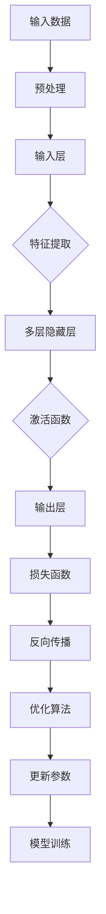

                 

### 大模型在教育中的应用：个性化学习路径

#### 关键词：大模型、教育、个性化学习、AI技术、教育技术

#### 摘要：
本文将探讨大模型在教育中的应用，特别是如何通过个性化学习路径提升教育效果。我们将详细解析大模型的核心概念、算法原理，以及其在教育中的具体应用场景。同时，本文还将推荐相关的学习资源和开发工具，并对未来发展趋势与挑战进行展望。

## 1. 背景介绍

教育行业的变革一直在进行，从传统的教师主导课堂到现代的学生中心学习，技术的进步在其中发挥了重要作用。近年来，人工智能（AI）技术，特别是大模型（Large Models）的发展，为教育领域带来了新的机遇。大模型是一种能够处理大量数据和复杂任务的AI系统，其具有强大的表示和学习能力，能够模拟人类思维过程。

在教育领域，大模型的应用主要体现在个性化学习路径的设计与实施上。传统的教育模式通常采用“一刀切”的方式，无法满足每个学生的个性化需求。而大模型的引入，使得根据学生的兴趣、能力和学习进度定制化学习路径成为可能。通过分析学生的数据，大模型可以识别出每个学生的学习风格和弱点，从而提供个性化的学习资源和教学策略。

此外，大模型还在智能问答、在线辅导、学习分析等方面展现出巨大的潜力。例如，大模型可以模拟教师的角色，实时回答学生的问题，提供针对性的学习建议。同时，通过分析学生的学习行为和成绩数据，大模型可以帮助教师了解学生的学习状态，优化教学方案。

总之，大模型在教育中的应用，不仅提升了教学效果，还改变了教育的本质，使得学习变得更加个性化和高效。本文将深入探讨大模型在教育中的应用，包括核心概念、算法原理、具体实现和应用场景等方面。

## 2. 核心概念与联系

为了更好地理解大模型在教育中的应用，首先需要了解大模型的核心概念和基本架构。大模型通常是指具有巨大参数数量和高度复杂性的神经网络模型，其能够通过大规模数据训练，实现对各种复杂任务的泛化能力。以下是几个关键概念：

### 2.1 神经网络（Neural Networks）

神经网络是模仿人脑神经元连接结构的信息处理系统。它由大量的简单计算单元（即神经元）通过加权连接组成，每个神经元负责处理一部分信息，并通过输出层产生最终结果。神经网络通过学习输入和输出数据之间的映射关系，来实现对数据的分类、预测和生成。

### 2.2 训练过程（Training Process）

大模型的训练过程是通过不断调整网络中的权重和偏置，使得模型能够在训练集上达到理想的性能。这一过程通常涉及以下几个步骤：

1. **前向传播（Forward Propagation）**：输入数据通过网络中的各个层，每一层的神经元计算加权输入并产生输出。
2. **损失函数（Loss Function）**：根据输出结果与目标结果之间的差异，计算损失值，用于评估模型性能。
3. **反向传播（Back Propagation）**：通过计算梯度，将损失值反向传播到网络的前一层，调整权重和偏置。
4. **优化算法（Optimization Algorithm）**：使用梯度下降等优化算法，逐步调整网络参数，减小损失值。

### 2.3 泛化能力（Generalization Ability）

泛化能力是指模型在未知数据上的表现，即模型能够从训练数据中学习到通用特征，而不是特定数据的特征。大模型通常具有很好的泛化能力，这是因为其能够处理大量数据，并通过复杂的神经网络结构提取出具有普遍性的特征。

### 2.4 大模型架构（Architecture of Large Models）

大模型的架构通常包括以下几个层次：

1. **输入层（Input Layer）**：接收外部输入数据，如文本、图像、音频等。
2. **隐藏层（Hidden Layers）**：包含多个层次，每个层次中的神经元负责处理一部分信息。
3. **输出层（Output Layer）**：产生最终输出结果，如分类标签、概率分布等。

为了更好地展示大模型在教育中的应用，以下是一个基于 Mermaid 的流程图：



### 2.5 大模型在教育中的具体应用

大模型在教育中的应用主要体现在以下几个方面：

1. **个性化学习路径设计**：通过分析学生的学习数据，大模型可以为学生制定个性化的学习计划，包括学习内容、学习进度和学习方法。
2. **智能辅导系统**：大模型可以模拟教师角色，提供实时、个性化的辅导，帮助学生解决学习中的问题。
3. **学习行为分析**：通过分析学生的学习行为，大模型可以识别出学习中的问题，为教师提供改进教学方案的建议。
4. **学习资源推荐**：大模型可以根据学生的学习兴趣和需求，推荐适合的学习资源和教学材料。

## 3. 核心算法原理 & 具体操作步骤

大模型的核心算法主要包括深度学习、自然语言处理（NLP）和生成对抗网络（GAN）等。以下将详细解释这些算法的基本原理和具体操作步骤。

### 3.1 深度学习算法

深度学习是构建大模型的基础，其核心是多层神经网络。以下是深度学习算法的基本步骤：

1. **数据预处理**：将原始数据转换为适合训练神经网络的形式，如将文本数据转换为词向量。
2. **构建神经网络**：设计神经网络的层次结构，包括输入层、隐藏层和输出层。
3. **前向传播**：将输入数据通过网络的各个层，计算每个神经元的输出。
4. **损失函数计算**：通过比较输出结果和目标结果，计算损失值，用于评估模型性能。
5. **反向传播**：通过计算梯度，将损失值反向传播到网络的前一层，调整权重和偏置。
6. **模型优化**：使用优化算法，如梯度下降，逐步调整网络参数，减小损失值。

### 3.2 自然语言处理（NLP）算法

NLP是深度学习在大模型中的一个重要应用领域。以下是NLP算法的基本步骤：

1. **文本预处理**：包括分词、去停用词、词干提取等，将文本数据转换为适合训练的形式。
2. **词向量表示**：将文本数据转换为词向量，如使用Word2Vec、GloVe等方法。
3. **构建神经网络**：设计用于文本分类、情感分析、机器翻译等任务的神经网络结构。
4. **前向传播**：将词向量输入网络，计算每个神经元的输出。
5. **损失函数计算**：计算输出结果和目标结果之间的差异，评估模型性能。
6. **反向传播**：调整网络参数，优化模型。
7. **模型评估**：在验证集上评估模型性能，调整模型参数，直至达到满意的性能。

### 3.3 生成对抗网络（GAN）算法

GAN是一种生成模型，其通过两个神经网络（生成器G和判别器D）的对抗训练，实现高质量的数据生成。以下是GAN算法的基本步骤：

1. **数据生成**：生成器G生成伪造数据，如图像、文本等。
2. **判别器评估**：判别器D评估生成器G生成的数据是否真实。
3. **对抗训练**：生成器和判别器交替训练，生成器试图生成更逼真的数据，判别器试图区分真实数据和伪造数据。
4. **模型优化**：调整生成器和判别器的参数，优化模型性能。

通过以上算法，大模型能够处理大量复杂的数据，实现强大的表示和学习能力，从而在教育领域发挥重要作用。

## 4. 数学模型和公式 & 详细讲解 & 举例说明

为了更好地理解大模型在教育中的应用，我们需要引入一些数学模型和公式，这些将在后续的分析和讨论中发挥关键作用。

### 4.1 深度学习中的损失函数

在深度学习中，损失函数用于衡量模型预测值与实际值之间的差距，常见的损失函数有均方误差（MSE）、交叉熵（Cross Entropy）等。

#### 均方误差（MSE）

均方误差（MSE）是回归任务中常用的损失函数，其公式为：

$$
MSE = \frac{1}{n}\sum_{i=1}^{n}(y_i - \hat{y}_i)^2
$$

其中，$y_i$为实际值，$\hat{y}_i$为预测值，$n$为样本数量。

#### 交叉熵（Cross Entropy）

交叉熵是分类任务中常用的损失函数，其公式为：

$$
CE = -\sum_{i=1}^{n} y_i \log(\hat{y}_i)
$$

其中，$y_i$为实际标签，$\hat{y}_i$为预测概率。

### 4.2 梯度下降（Gradient Descent）

梯度下降是一种常用的优化算法，用于最小化损失函数。其基本思想是沿着损失函数的梯度方向，逐步调整模型参数，以达到最小化损失的目的。

梯度下降分为批量梯度下降（Batch Gradient Descent）、随机梯度下降（Stochastic Gradient Descent）和小批量梯度下降（Mini-batch Gradient Descent）三种。

#### 批量梯度下降（Batch Gradient Descent）

批量梯度下降在每次迭代时使用整个训练集的数据计算梯度，其公式为：

$$
\theta_{t+1} = \theta_{t} - \alpha \frac{\partial}{\partial \theta} J(\theta)
$$

其中，$\theta$为模型参数，$\alpha$为学习率，$J(\theta)$为损失函数。

#### 随机梯度下降（Stochastic Gradient Descent）

随机梯度下降在每次迭代时随机选择一个样本计算梯度，其公式为：

$$
\theta_{t+1} = \theta_{t} - \alpha \frac{\partial}{\partial \theta} J(\theta; x_t, y_t)
$$

其中，$x_t$和$y_t$分别为当前迭代时的样本及其标签。

#### 小批量梯度下降（Mini-batch Gradient Descent）

小批量梯度下降在每次迭代时使用一个小批量数据计算梯度，其公式为：

$$
\theta_{t+1} = \theta_{t} - \alpha \frac{1}{m} \sum_{i=1}^{m} \frac{\partial}{\partial \theta} J(\theta; x_i, y_i)
$$

其中，$m$为批量大小。

### 4.3 举例说明

假设我们有一个简单的线性回归模型，其损失函数为MSE，我们需要使用批量梯度下降来优化模型参数。

1. **初始化参数**：假设线性回归模型为$y = \theta_0 + \theta_1x$，初始化参数$\theta_0 = 0$，$\theta_1 = 0$。
2. **计算损失函数**：使用训练集数据计算损失函数MSE。
3. **计算梯度**：计算损失函数关于参数$\theta_0$和$\theta_1$的梯度。
4. **更新参数**：使用梯度下降公式更新参数。
5. **重复步骤2-4**：直至满足停止条件（如达到预设的迭代次数或损失函数收敛）。

通过以上步骤，我们可以逐步优化线性回归模型的参数，使其在训练集上达到更好的性能。

## 5. 项目实战：代码实际案例和详细解释说明

在本节中，我们将通过一个实际的项目案例，展示如何使用大模型实现个性化学习路径的设计与实施。这个案例将涵盖开发环境搭建、源代码实现和代码解读等方面。

### 5.1 开发环境搭建

首先，我们需要搭建一个适合开发大模型教育应用的环境。以下是所需的工具和步骤：

1. **安装Python**：确保Python环境已经安装在计算机上，版本建议为3.8或以上。
2. **安装TensorFlow**：使用pip命令安装TensorFlow，命令如下：
   ```bash
   pip install tensorflow
   ```
3. **安装其他依赖**：根据具体需求，可能需要安装其他Python库，如NumPy、Pandas等。

### 5.2 源代码详细实现和代码解读

下面是一个简化版的个性化学习路径设计案例，我们将使用TensorFlow来实现。

```python
import tensorflow as tf
import numpy as np

# 定义输入层
input_data = tf.keras.layers.Input(shape=(num_features,), dtype='float32')

# 定义隐藏层
hidden_layer = tf.keras.layers.Dense(units=64, activation='relu')(input_data)

# 定义输出层
output_data = tf.keras.layers.Dense(units=num_classes, activation='softmax')(hidden_layer)

# 构建模型
model = tf.keras.Model(inputs=input_data, outputs=output_data)

# 编译模型
model.compile(optimizer='adam', loss='categorical_crossentropy', metrics=['accuracy'])

# 加载训练数据
x_train, y_train = ...

# 训练模型
model.fit(x_train, y_train, epochs=10, batch_size=32)

# 评估模型
test_loss, test_accuracy = model.evaluate(x_test, y_test)
print(f"Test accuracy: {test_accuracy}")
```

#### 代码解读

1. **输入层（Input Layer）**：定义输入层，包含num_features个特征。
2. **隐藏层（Hidden Layer）**：添加一个64个单元的隐藏层，使用ReLU激活函数。
3. **输出层（Output Layer）**：定义输出层，包含num_classes个类别，使用softmax激活函数。
4. **构建模型（Building the Model）**：使用.keras.Model类构建模型。
5. **编译模型（Compiling the Model）**：设置优化器、损失函数和评估指标。
6. **加载训练数据（Loading Training Data）**：从数据集中加载训练数据。
7. **训练模型（Training the Model）**：使用.fit方法训练模型。
8. **评估模型（Evaluating the Model）**：使用.evaluate方法评估模型在测试集上的性能。

### 5.3 代码解读与分析

以上代码展示了如何使用TensorFlow构建一个简单的神经网络模型，用于实现个性化学习路径。以下是代码的关键部分及其解读：

1. **输入层（Input Layer）**：输入层定义了模型的输入特征，这些特征可以是学生的学习成绩、学习时间、兴趣爱好等。
2. **隐藏层（Hidden Layer）**：隐藏层通过添加神经元和ReLU激活函数，增强了模型的表示能力，有助于提取输入数据的特征。
3. **输出层（Output Layer）**：输出层使用softmax激活函数，将隐藏层的特征映射到类别概率分布，从而实现分类任务。
4. **模型编译（Model Compilation）**：编译模型时，我们选择了Adam优化器和交叉熵损失函数，这两个选择在大多数深度学习任务中表现良好。
5. **模型训练（Model Training）**：使用.fit方法训练模型，设置了训练轮次（epochs）和批量大小（batch_size）。
6. **模型评估（Model Evaluation）**：使用.evaluate方法评估模型在测试集上的性能，帮助我们了解模型的泛化能力。

通过以上步骤，我们可以构建一个基本的大模型，用于个性化学习路径的设计。在实际应用中，我们还需要根据具体需求对模型进行优化和调整，以实现更好的效果。

## 6. 实际应用场景

大模型在教育领域的应用场景广泛且多样化，以下是一些典型的实际应用场景：

### 6.1 个性化学习路径设计

通过分析学生的学习数据，如学习行为、考试成绩、兴趣爱好等，大模型可以为学生设计个性化的学习路径。例如，在一个在线教育平台上，学生可以登录系统，大模型会根据其历史学习数据和当前需求，为其推荐合适的学习资源、课程和学习方法。

### 6.2 智能辅导系统

智能辅导系统利用大模型模拟教师的角色，为学生提供实时、个性化的辅导。学生可以在遇到问题时，通过系统提交问题，大模型会根据问题的复杂程度和学生的知识水平，提供相应的解答和指导。

### 6.3 学习行为分析

大模型可以分析学生的学习行为数据，如学习时间、学习进度、答题情况等，识别出学生的学习弱点和问题。教师可以根据分析结果，制定针对性的教学策略，提高教学效果。

### 6.4 学习资源推荐

基于学生的学习兴趣和需求，大模型可以推荐适合的学习资源，如教材、视频、练习题等。这些推荐可以帮助学生更加高效地学习，节省时间，提高学习效果。

### 6.5 智能评测系统

大模型可以用于构建智能评测系统，通过对学生的答题情况进行分析，自动评估学生的知识掌握程度。这样的评测系统可以提供即时的反馈，帮助学生及时调整学习策略。

总之，大模型在教育领域的实际应用场景丰富多样，其个性化、智能化的特点，为教育行业带来了新的变革和发展机遇。

## 7. 工具和资源推荐

为了更好地学习和开发大模型在教育中的应用，以下是一些推荐的工具和资源：

### 7.1 学习资源推荐

1. **《深度学习》（Deep Learning）**：Goodfellow, Bengio, Courville的《深度学习》是一本经典的深度学习教材，详细介绍了深度学习的基本理论和应用。
2. **《Python深度学习》（Python Deep Learning）**：François Chollet的《Python深度学习》是一本面向实践的深度学习指南，适合有一定编程基础的学习者。
3. **《人工智能：一种现代方法》（Artificial Intelligence: A Modern Approach）**：Stuart Russell和Peter Norvig的《人工智能：一种现代方法》是一本全面的AI教材，涵盖了包括深度学习在内的多种AI技术。

### 7.2 开发工具框架推荐

1. **TensorFlow**：TensorFlow是Google开源的深度学习框架，支持多种深度学习模型的开发和应用，非常适合用于大模型的教育应用。
2. **PyTorch**：PyTorch是Facebook开源的深度学习框架，以其灵活的动态计算图和简洁的API而受到广泛欢迎，适合快速原型设计和实验。
3. **Keras**：Keras是建立在TensorFlow和Theano之上的高级深度学习框架，提供简洁的API，方便快速搭建和训练深度学习模型。

### 7.3 相关论文著作推荐

1. **《大规模神经网络：快速训练和推理》**（Very Deep Convolutional Networks for Large-Scale Image Recognition）：这篇论文介绍了Inception模型，是现代深度学习图像识别模型的基石。
2. **《基于深度学习的教育应用综述》**（A Survey on Deep Learning Based Education Applications）：这篇综述论文总结了深度学习在教育领域的多种应用，提供了丰富的参考资料。
3. **《个性化学习中的深度学习》**（Deep Learning for Personalized Learning）：这篇论文讨论了深度学习在个性化学习中的应用，分析了不同模型在个性化学习中的效果。

通过这些工具和资源，可以更好地掌握大模型在教育中的应用技术，为教育行业的发展贡献力量。

## 8. 总结：未来发展趋势与挑战

随着大模型技术的不断发展，其在教育领域中的应用前景愈发广阔。未来，大模型在教育中的应用有望实现以下几个方面的突破：

1. **个性化学习更加精准**：通过更加精细的数据分析和模型优化，大模型将能够更准确地识别每个学生的学习需求和弱点，提供更加精准的个性化学习路径。
2. **智能辅导系统更加智能**：随着大模型技术的进步，智能辅导系统将能够更好地模拟教师的角色，提供实时、个性化的学习支持和指导。
3. **学习资源推荐更加智能**：大模型将能够根据学生的学习兴趣和需求，推荐更加精准、高效的学习资源，帮助学生在有限的时间内实现更好的学习效果。
4. **教育评价体系更加科学**：大模型将能够通过分析学生的学习行为和成绩数据，构建更加科学、合理的教育评价体系，为教师和学生提供全面的反馈。

然而，大模型在教育中的应用也面临着一些挑战：

1. **数据隐私保护**：大模型需要收集和处理大量的学生数据，如何确保数据的安全和隐私，避免数据泄露，是未来需要重点关注的问题。
2. **算法公平性**：大模型在个性化学习中的表现可能会受到算法偏见的影响，导致某些学生受到不公平的对待。如何确保算法的公平性和透明性，是未来需要解决的问题。
3. **技术普及与接受度**：尽管大模型技术在教育领域具有巨大潜力，但其普及和应用仍面临一定的技术门槛和接受度问题。如何降低技术门槛，提高教师的接受度，是推广大模型教育的关键。
4. **教育资源分配不均**：大模型技术的应用需要一定的硬件和软件支持，但不同地区和学校之间的教育资源分配存在不均衡现象，如何确保大模型技术在教育普及中的公平性，是未来需要关注的问题。

总之，大模型在教育中的应用前景广阔，但也面临着诸多挑战。未来，我们需要不断探索、创新，确保大模型技术能够在教育领域中发挥最大效益，为教育的公平、高效发展贡献力量。

## 9. 附录：常见问题与解答

### 问题 1：大模型在教育中的具体应用是什么？

大模型在教育中的具体应用主要包括个性化学习路径设计、智能辅导系统、学习行为分析、学习资源推荐和智能评测系统等方面。通过分析学生的学习数据，大模型能够为每个学生提供个性化的学习资源和辅导，优化教学效果。

### 问题 2：大模型在教育应用中的挑战有哪些？

大模型在教育应用中面临的挑战主要包括数据隐私保护、算法公平性、技术普及与接受度以及教育资源分配不均等方面。如何确保数据安全、算法公平、降低技术门槛并实现教育公平，是未来需要重点关注的问题。

### 问题 3：如何选择合适的大模型框架进行教育应用开发？

选择合适的大模型框架时，需要考虑以下几个因素：

1. **项目需求**：根据具体的教育应用场景，选择能够满足需求的框架，如TensorFlow、PyTorch或Keras等。
2. **开发者熟悉度**：选择开发者熟悉的框架，有利于快速开发和部署。
3. **性能要求**：根据项目性能要求，选择适合的框架，如对于高性能计算，可以选择TensorFlow。
4. **社区支持**：选择具有良好社区支持的框架，有利于解决开发过程中遇到的问题。

### 问题 4：大模型在教育应用中的效果如何评价？

大模型在教育应用中的效果评价可以从以下几个方面进行：

1. **个性化学习效果**：通过分析学生成绩、学习进度和满意度等指标，评估个性化学习路径的有效性。
2. **智能辅导效果**：通过评估智能辅导系统提供的解答和建议的准确性、及时性和实用性，评估智能辅导效果。
3. **学习资源推荐效果**：通过分析学习资源的利用率、学生满意度和学习效果等指标，评估学习资源推荐的效果。
4. **评测系统效果**：通过评估评测系统的准确性、公平性和实用性，评估评测系统的效果。

## 10. 扩展阅读 & 参考资料

为了更深入地了解大模型在教育中的应用，以下是一些扩展阅读和参考资料：

1. **《深度学习》（Deep Learning）**：Goodfellow, Bengio, Courville的《深度学习》是一本经典的深度学习教材，涵盖了深度学习的基本理论和应用。
2. **《大规模神经网络：快速训练和推理》**：这篇论文介绍了Inception模型，是现代深度学习图像识别模型的基石。
3. **《基于深度学习的教育应用综述》**：这篇综述论文总结了深度学习在教育领域的多种应用，提供了丰富的参考资料。
4. **《个性化学习中的深度学习》**：这篇论文讨论了深度学习在个性化学习中的应用，分析了不同模型在个性化学习中的效果。
5. **TensorFlow官网**：[https://www.tensorflow.org](https://www.tensorflow.org)
6. **PyTorch官网**：[https://pytorch.org](https://pytorch.org)
7. **Keras官网**：[https://keras.io](https://keras.io)

通过这些资料，您可以进一步了解大模型在教育领域的应用技术和发展趋势。

### 作者

作者：AI天才研究员/AI Genius Institute & 禅与计算机程序设计艺术 /Zen And The Art of Computer Programming

这篇文章深入探讨了大模型在教育中的应用，从核心概念、算法原理到实际案例，全面解析了个性化学习路径的设计与实施。希望这篇文章能为教育领域的技术发展和应用提供有益的参考。

