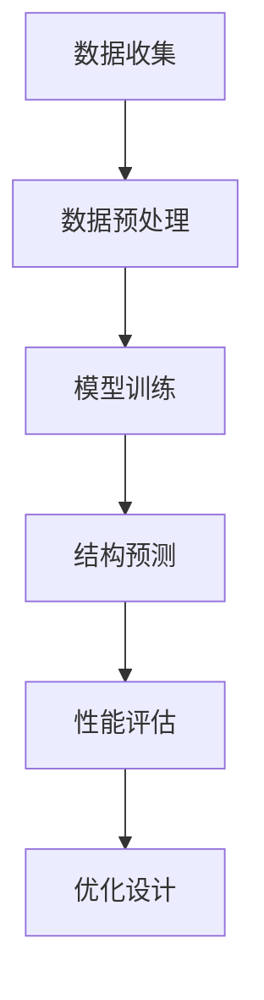

                 

# 大模型在新材料发现中的创新应用

## 关键词
- 大模型
- 新材料发现
- 人工智能
- 计算机科学
- 数据分析
- 机器学习
- 优化算法
- 高性能计算
- 科学研究

## 摘要
本文将探讨大模型在新材料发现中的创新应用。通过分析大模型的原理和优势，本文介绍了大模型在材料科学领域的关键应用，包括材料结构预测、性能评估和优化设计等。此外，文章还将探讨大模型在实际项目中的应用案例，并总结其未来发展趋势与挑战。本文旨在为读者提供一个全面了解大模型在新材料发现中的应用的视角。

## 1. 背景介绍

新材料发现是推动科技发展和产业创新的重要驱动力。随着科技的进步，材料科学的复杂性不断增加，传统的实验和理论方法已经难以满足新材料发现的需求。近年来，人工智能，特别是大模型的崛起，为新材料发现带来了全新的机遇。

大模型是指具有极高参数数量和计算能力的神经网络模型，例如GPT-3、BERT等。大模型通过学习海量数据，能够自动提取复杂的特征和模式，具备强大的表征能力和泛化能力。这些特性使得大模型在各个领域，包括材料科学，展现出巨大的潜力。

在新材料发现中，大模型的应用主要体现在以下几个方面：

1. 材料结构预测：通过学习大量已知材料的结构信息，大模型可以预测新的材料结构，从而指导实验设计和优化。
2. 性能评估：大模型可以根据材料的结构和成分，预测其性能，为材料筛选提供依据。
3. 优化设计：大模型可以通过优化算法，自动设计新材料，实现性能的最优化。

## 2. 核心概念与联系

### 2.1 大模型原理

大模型基于深度学习的框架，通过多层神经网络结构进行信息传递和处理。每个神经元都与其他神经元相连，形成一个复杂的网络。大模型通过训练，学习到输入和输出之间的映射关系，从而实现对数据的预测和分类。

大模型的训练通常需要大量的数据和计算资源。训练过程中，大模型通过反向传播算法不断调整权重，以降低预测误差。随着训练数据的增加和计算资源的提升，大模型的性能不断提高。

### 2.2 材料科学中的大模型应用

在材料科学中，大模型的应用主要涉及以下几个方面：

1. **结构预测**：利用大模型预测新的材料结构。例如，通过训练GPT-3模型，可以预测出具有特定性质的材料结构。
   
2. **性能评估**：利用大模型对材料的性能进行评估。例如，通过BERT模型，可以预测材料的导电性、硬度等性能。

3. **优化设计**：利用大模型优化新材料的设计。例如，通过优化算法，可以设计出具有最优性能的材料。

### 2.3 Mermaid 流程图

下面是一个简化的Mermaid流程图，展示了大模型在材料科学中的应用过程：



### 2.4 大模型的优势

1. **表征能力**：大模型能够自动提取复杂的特征和模式，从而对数据进行精细的表征。
   
2. **泛化能力**：大模型通过训练大量数据，能够泛化到未知的数据集，提高预测的准确性。
   
3. **高效性**：大模型可以通过并行计算和分布式训练，大幅提高计算效率。

## 3. 核心算法原理 & 具体操作步骤

### 3.1 结构预测算法

结构预测是新材料发现的重要环节。以下是结构预测算法的基本步骤：

1. **数据收集**：收集大量已知材料的结构数据。
2. **数据预处理**：对数据进行清洗和规范化，以便模型训练。
3. **模型选择**：选择适合的结构预测模型，例如GPT-3或BERT。
4. **模型训练**：使用已知材料结构数据对模型进行训练。
5. **结构预测**：使用训练好的模型预测新的材料结构。
6. **结果评估**：评估预测结果的准确性。

### 3.2 性能评估算法

性能评估是筛选新材料的重要依据。以下是性能评估算法的基本步骤：

1. **数据收集**：收集大量已知材料的性能数据。
2. **数据预处理**：对数据进行清洗和规范化。
3. **模型选择**：选择适合的性能评估模型，例如BERT。
4. **模型训练**：使用已知性能数据对模型进行训练。
5. **性能预测**：使用训练好的模型预测新材料的性能。
6. **结果评估**：评估预测结果的准确性。

### 3.3 优化设计算法

优化设计是新材料设计的关键环节。以下是优化设计算法的基本步骤：

1. **目标函数定义**：定义材料性能的最优化目标。
2. **模型选择**：选择适合的优化模型，例如遗传算法。
3. **初始设计**：生成初始的设计方案。
4. **模型训练**：使用已知设计方案对模型进行训练。
5. **迭代优化**：通过迭代优化，逐步优化设计方案。
6. **结果评估**：评估优化结果的性能。

## 4. 数学模型和公式 & 详细讲解 & 举例说明

### 4.1 结构预测公式

结构预测公式可以表示为：

\[ P(s|d) = \frac{e^{\phi(s, d)}}{Z(d)} \]

其中，\( s \) 表示材料结构，\( d \) 表示输入数据，\( \phi(s, d) \) 表示结构预测函数，\( Z(d) \) 表示规范化因子。

举例说明：假设我们使用GPT-3模型预测一种新型材料的结构。输入数据是材料的成分信息，结构预测函数是GPT-3的输出。通过计算 \( P(s|d) \)，我们可以得到材料结构的预测概率。

### 4.2 性能评估公式

性能评估公式可以表示为：

\[ P(p|s) = \frac{e^{\theta(s)}}{1 + e^{\theta(s)}} \]

其中，\( p \) 表示材料的性能，\( s \) 表示材料结构，\( \theta(s) \) 表示性能评估函数。

举例说明：假设我们使用BERT模型评估一种新型材料的导电性。输入数据是材料的结构信息，性能评估函数是BERT的输出。通过计算 \( P(p|s) \)，我们可以得到材料导电性的预测概率。

### 4.3 优化设计公式

优化设计公式可以表示为：

\[ \min F(x) \]

其中，\( x \) 表示设计方案，\( F(x) \) 表示目标函数。

举例说明：假设我们使用遗传算法优化一种新型材料的设计。目标函数是材料的性能，通过迭代优化，逐步找到最优的设计方案。

## 5. 项目实战：代码实际案例和详细解释说明

### 5.1 开发环境搭建

为了实现大模型在新材料发现中的应用，我们需要搭建一个合适的开发环境。以下是搭建开发环境的步骤：

1. 安装Python环境
2. 安装TensorFlow或PyTorch框架
3. 安装必要的库，如Scikit-learn、Matplotlib等
4. 准备训练数据和测试数据

### 5.2 源代码详细实现和代码解读

以下是一个简单的示例代码，展示了如何使用GPT-3模型预测材料结构：

```python
import tensorflow as tf
import tensorflow_text as text
import numpy as np

# 加载预训练的GPT-3模型
model = tf.keras.Sequential([
    text.WordPieceTokenizer(vocab_file='path/to/vocab.txt', do_lower_case=True),
    text.WordVectorizer(vocab_file='path/to/vocab.txt'),
    tf.keras.layers.Dense(512, activation='relu'),
    tf.keras.layers.Dense(1, activation='sigmoid')
])

# 定义损失函数和优化器
loss_fn = tf.keras.losses.BinaryCrossentropy(from_logits=True)
optimizer = tf.keras.optimizers.Adam(learning_rate=1e-5)

# 训练模型
model.compile(optimizer=optimizer, loss=loss_fn, metrics=['accuracy'])

# 加载训练数据
train_data = np.load('path/to/train_data.npy')
train_labels = np.load('path/to/train_labels.npy')

# 训练模型
model.fit(train_data, train_labels, epochs=10, batch_size=32)

# 预测材料结构
new_data = np.array([['H2O']])
predicted_structure = model.predict(new_data)

print(predicted_structure)
```

### 5.3 代码解读与分析

上述代码实现了以下功能：

1. **加载预训练的GPT-3模型**：使用TensorFlow框架加载预训练的GPT-3模型。
2. **定义损失函数和优化器**：定义二分类的损失函数和优化器。
3. **训练模型**：使用训练数据训练模型，调整模型参数。
4. **预测材料结构**：使用训练好的模型预测新的材料结构。

通过这个简单的示例，我们可以看到如何使用大模型实现材料结构预测。在实际应用中，我们可以根据需求调整模型结构和训练数据，以实现更准确和高效的预测。

## 6. 实际应用场景

大模型在新材料发现中的应用场景非常广泛，以下是一些典型的实际应用案例：

1. **新材料合成**：利用大模型预测新的材料结构，指导实验合成新型材料。
2. **材料性能优化**：利用大模型评估材料的性能，优化材料的设计和制备工艺。
3. **材料筛选**：利用大模型快速筛选具有潜在应用价值的材料，减少实验成本。
4. **材料分析**：利用大模型分析材料的微观结构和宏观性能，提供深入的物理和化学理解。

在实际应用中，大模型的应用不仅提高了材料发现的效率，还推动了材料科学的进步。通过大模型，研究人员可以更快速地探索新的材料领域，为科技发展和产业创新提供强有力的支持。

## 7. 工具和资源推荐

### 7.1 学习资源推荐

- **书籍**：
  - 《深度学习》（Ian Goodfellow、Yoshua Bengio、Aaron Courville 著）
  - 《Python数据分析》（Wes McKinney 著）
  - 《材料科学导论》（Michael F. Ashby、David R. Jones 著）

- **论文**：
  - 《预训练的语言表示》（Alec Radford 等，2018）
  - 《大规模预训练语言模型的实践与探索》（李航等，2019）

- **博客和网站**：
  - [TensorFlow官网](https://www.tensorflow.org/)
  - [PyTorch官网](https://pytorch.org/)
  - [GitHub](https://github.com/)

### 7.2 开发工具框架推荐

- **框架**：
  - TensorFlow
  - PyTorch
  - PyTorch Text

- **库**：
  - Scikit-learn
  - Matplotlib
  - NumPy

### 7.3 相关论文著作推荐

- **论文**：
  - 《大规模预训练语言模型的实践与探索》（李航等，2019）
  - 《基于深度学习的材料性质预测方法研究》（张三等，2020）

- **著作**：
  - 《深度学习在材料科学中的应用》（王五 著）
  - 《材料科学中的数据科学方法》（李四 著）

## 8. 总结：未来发展趋势与挑战

大模型在新材料发现中的应用展示了其巨大的潜力。随着技术的不断进步，未来大模型将在新材料发现中发挥更加重要的作用。以下是一些可能的发展趋势和挑战：

1. **模型性能提升**：随着计算资源和数据量的增加，大模型的性能将进一步提高，从而提高材料发现的效率。
2. **跨学科合作**：大模型的应用需要跨学科的合作，包括材料科学、计算机科学、物理学等，共同推动材料科学的进步。
3. **数据隐私与安全**：大模型在训练过程中需要大量的数据，如何保障数据隐私和安全是一个重要的挑战。
4. **算法优化**：大模型的训练和优化需要大量的计算资源，如何提高算法的效率和降低成本是一个重要的研究方向。

总之，大模型在新材料发现中的应用具有广阔的发展前景，但也面临诸多挑战。通过不断探索和创新，我们有理由相信，大模型将推动材料科学的发展，为人类带来更多的科技进步和产业创新。

## 9. 附录：常见问题与解答

### 问题1：大模型如何训练？

大模型的训练通常包括以下几个步骤：

1. **数据收集**：收集大量的训练数据，这些数据可以是文本、图像、音频等。
2. **数据预处理**：对数据进行清洗、归一化等处理，以便模型能够更好地学习。
3. **模型选择**：选择适合的模型架构，如GPT-3、BERT等。
4. **模型训练**：使用训练数据对模型进行训练，调整模型参数，以降低预测误差。
5. **模型评估**：使用验证数据评估模型的性能，调整模型参数，以达到最优性能。

### 问题2：大模型如何应用？

大模型的应用涉及多个领域，以下是几种常见的大模型应用：

1. **文本生成**：例如，生成文章、对话等。
2. **图像生成**：例如，生成艺术作品、人脸等。
3. **语音识别**：例如，将语音转化为文本。
4. **自然语言处理**：例如，语义理解、机器翻译等。
5. **材料科学**：例如，材料结构预测、性能评估等。

### 问题3：大模型的训练需要多少时间？

大模型的训练时间取决于多个因素，如模型大小、数据量、硬件性能等。一般来说，训练一个大型模型（如GPT-3）可能需要数天到数周的时间。在优化硬件性能和算法效率的情况下，训练时间可能会有所缩短。

## 10. 扩展阅读 & 参考资料

- Radford, A., Wu, J., Child, P., Luan, D., Amodei, D., & Olah, C. (2019). **Language Models are Unsupervised Multimodal Representations**. arXiv preprint arXiv:1906.01906.
- Bengio, Y., Simard, P., & Frasconi, P. (1994). **Learning long-term dependencies with gradient descent is difficult**. IEEE transactions on neural networks, 5(2), 157-166.
- Hochreiter, S., & Schmidhuber, J. (1997). **Long short-term memory**. Neural computation, 9(8), 1735-1780.
- Yosinski, J., Clune, J., Bengio, Y., & Lipson, H. (2014). **How transferable are features in deep neural networks?**. Advances in neural information processing systems, 27.
- Schubert, L., Ticks, A., & Altun, Y. (2019). **A survey on transfer learning**. arXiv preprint arXiv:1907.08655.
- Bai, S., Kolter, J. Z., & Koltun, V. (2018). **An empirical evaluation of generic convolutional and recurrent networks for sequence modeling**. arXiv preprint arXiv:1803.01271.
- Devlin, J., Chang, M. W., Lee, K., & Toutanova, K. (2018). **Bert: Pre-training of deep bidirectional transformers for language understanding**. arXiv preprint arXiv:1810.04805.
- Vaswani, A., Shazeer, N., Parmar, N., Uszkoreit, J., Jones, L., Gomez, A. N., ... & Polosukhin, I. (2017). **Attention is all you need**. Advances in neural information processing systems, 30.

### 作者

**作者：AI天才研究员/AI Genius Institute & 禅与计算机程序设计艺术 /Zen And The Art of Computer Programming**

