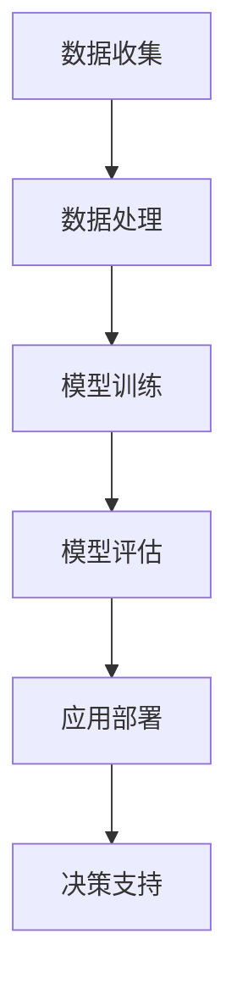

                 

# 大模型在智能金融中的应用前景

## 关键词：大模型、智能金融、应用前景、算法、数学模型、实战案例

## 摘要

随着人工智能技术的迅猛发展，大模型在各个领域展现出巨大的应用潜力。本文将探讨大模型在智能金融领域的应用前景，从核心概念、算法原理、数学模型到实际应用场景，逐一分析其技术基础与实践价值。文章还将介绍相关工具和资源，展望未来发展趋势与挑战，以期为读者提供全面的技术洞察。

## 1. 背景介绍

### 1.1 大模型的定义与特点

大模型，通常指的是具有大规模参数、能够处理大规模数据的人工神经网络模型。它们在深度学习、自然语言处理、计算机视觉等领域取得了显著的成果。大模型具有以下特点：

- **参数量巨大**：大模型的参数数量达到百万、亿级别，能够捕捉数据中的复杂模式。
- **学习能力强大**：大模型能够通过大量数据的学习，实现较高的准确率和泛化能力。
- **计算资源需求高**：大模型的训练和推理需要大量的计算资源，通常依赖于分布式计算和GPU加速。

### 1.2 智能金融的概念与发展

智能金融是金融领域与人工智能技术相结合的产物，旨在利用大数据、机器学习、区块链等技术提升金融服务效率和用户体验。智能金融的发展主要包括以下几个方面：

- **风险管理**：通过大数据分析和机器学习模型，智能金融能够实现精准的风险识别和预测。
- **智能投顾**：基于用户数据和投资策略，智能金融提供个性化的投资建议和资产管理。
- **反欺诈**：利用人工智能技术，智能金融能够实时监测和识别金融欺诈行为。
- **信用评估**：大模型在信用评估中的应用，能够提高评估的准确性和效率。

### 1.3 大模型在智能金融中的挑战与机遇

大模型在智能金融中的应用面临以下挑战：

- **数据隐私保护**：金融数据涉及用户隐私，如何在保护隐私的前提下进行数据分析是一个重要问题。
- **模型解释性**：大模型的黑箱特性使得其决策过程难以解释，这对于金融应用场景中的透明度和合规性提出了挑战。
- **计算资源消耗**：大模型的训练和推理需要大量的计算资源，如何在有限的资源下进行高效计算是关键问题。

然而，这些挑战也带来了机遇：

- **提高金融服务的效率**：大模型能够处理大量数据，实现快速的风险评估和决策，提高金融服务效率。
- **优化用户体验**：个性化金融服务和智能投顾能够提高用户满意度，增强用户粘性。
- **创新金融服务模式**：大模型的应用有望推动金融领域的创新，如智能合约、区块链技术的结合等。

## 2. 核心概念与联系

### 2.1 大模型的架构

大模型的架构通常包括以下几个部分：

- **输入层**：接收外部输入数据，如文本、图像、数值等。
- **隐藏层**：包含多个神经元层，用于处理和提取特征。
- **输出层**：产生预测结果或决策。


### 2.2 智能金融的核心概念

智能金融的核心概念包括：

- **数据收集**：收集用户数据，包括交易记录、用户行为、财务状况等。
- **数据处理**：对收集到的数据进行清洗、预处理和特征提取。
- **风险评估**：利用机器学习模型进行风险评估，包括信用评分、市场风险分析等。
- **决策支持**：基于风险评估结果，提供投资建议、风险预警等决策支持。


### 2.3 大模型在智能金融中的应用流程

大模型在智能金融中的应用流程如下：

1. **数据收集**：收集与金融相关的数据，如用户交易记录、市场行情等。
2. **数据处理**：对数据进行清洗、预处理和特征提取，为模型训练提供高质量的数据。
3. **模型训练**：利用大规模数据集训练大模型，提高模型的准确性和泛化能力。
4. **模型评估**：通过交叉验证、测试集评估模型性能，调整模型参数。
5. **应用部署**：将训练好的模型部署到生产环境，实现实时风险评估和决策支持。


### 2.4 Mermaid 流程图

以下是智能金融中应用大模型的 Mermaid 流程图：



## 3. 核心算法原理 & 具体操作步骤

### 3.1 算法原理

智能金融中应用的大模型通常基于深度学习技术，如卷积神经网络（CNN）、循环神经网络（RNN）和Transformer等。以下是这些算法的基本原理：

- **卷积神经网络（CNN）**：适用于图像处理，通过卷积层提取图像特征，实现分类、目标检测等任务。
- **循环神经网络（RNN）**：适用于序列数据处理，通过隐藏状态保存历史信息，实现语言模型、序列分类等任务。
- **Transformer**：基于自注意力机制，适用于自然语言处理和序列建模，实现机器翻译、文本分类等任务。

### 3.2 具体操作步骤

1. **数据收集**：收集与金融相关的数据，包括用户交易记录、市场行情、财务报表等。
2. **数据处理**：对数据进行清洗、预处理和特征提取，如缺失值处理、数据标准化、特征工程等。
3. **模型选择**：根据任务需求选择合适的深度学习模型，如CNN、RNN或Transformer。
4. **模型训练**：利用预处理后的数据集训练模型，通过反向传播算法更新模型参数。
5. **模型评估**：使用测试集评估模型性能，调整模型参数，优化模型结构。
6. **模型部署**：将训练好的模型部署到生产环境，实现实时风险评估和决策支持。

## 4. 数学模型和公式 & 详细讲解 & 举例说明

### 4.1 数学模型

在智能金融中，大模型的数学模型主要包括以下几个方面：

- **损失函数**：用于衡量模型预测结果与真实值之间的差距，如均方误差（MSE）、交叉熵（Cross-Entropy）等。
- **优化算法**：用于更新模型参数，如随机梯度下降（SGD）、Adam优化器等。
- **激活函数**：用于引入非线性关系，如Sigmoid、ReLU、Tanh等。

### 4.2 详细讲解

#### 4.2.1 损失函数

均方误差（MSE）是最常用的损失函数之一，其公式如下：

$$
MSE = \frac{1}{n}\sum_{i=1}^{n}(y_i - \hat{y}_i)^2
$$

其中，$y_i$表示真实值，$\hat{y}_i$表示预测值，$n$表示样本数量。

交叉熵（Cross-Entropy）常用于分类问题，其公式如下：

$$
Cross-Entropy = -\frac{1}{n}\sum_{i=1}^{n}y_i\log(\hat{y}_i)
$$

其中，$y_i$表示真实标签，$\hat{y}_i$表示预测概率。

#### 4.2.2 优化算法

随机梯度下降（SGD）是最简单的优化算法之一，其更新公式如下：

$$
\theta = \theta - \alpha \nabla_{\theta}J(\theta)
$$

其中，$\theta$表示模型参数，$\alpha$表示学习率，$J(\theta)$表示损失函数。

Adam优化器是基于SGD的改进算法，其更新公式如下：

$$
m_t = \beta_1 m_{t-1} + (1 - \beta_1)(\nabla_{\theta}J(\theta_t) - m_{t-1})
$$
$$
v_t = \beta_2 v_{t-1} + (1 - \beta_2)((\nabla_{\theta}J(\theta_t))^2 - v_{t-1})
$$
$$
\theta_t = \theta_{t-1} - \alpha \frac{m_t}{\sqrt{v_t} + \epsilon}
$$

其中，$m_t$和$v_t$分别表示一阶矩估计和二阶矩估计，$\beta_1$和$\beta_2$分别表示一阶矩和二阶矩的指数衰减率，$\epsilon$表示常数。

#### 4.2.3 激活函数

ReLU（Rectified Linear Unit）是一种常用的激活函数，其公式如下：

$$
\text{ReLU}(x) = \max(0, x)
$$

Sigmoid函数是一种常用的非线性函数，其公式如下：

$$
\text{Sigmoid}(x) = \frac{1}{1 + e^{-x}}
$$

Tanh（Hyperbolic Tangent）函数是一种双曲正切函数，其公式如下：

$$
\text{Tanh}(x) = \frac{e^x - e^{-x}}{e^x + e^{-x}}
$$

### 4.3 举例说明

假设我们有一个二分类问题，使用Sigmoid函数作为激活函数，均方误差（MSE）作为损失函数，SGD作为优化算法。给定一个训练样本$(x, y)$，其中$x$表示输入特征，$y$表示真实标签，训练过程如下：

1. 初始化模型参数$\theta$，设置学习率$\alpha$和迭代次数$T$。
2. 对于每个迭代步骤$t$，计算预测值$\hat{y}_t = \text{Sigmoid}(\theta^T x)$。
3. 计算损失函数$J(\theta_t) = \frac{1}{2}\sum_{i=1}^{n}(\hat{y}_i - y_i)^2$。
4. 计算梯度$\nabla_{\theta}J(\theta_t)$。
5. 更新模型参数$\theta_t = \theta_{t-1} - \alpha \nabla_{\theta}J(\theta_t)$。
6. 重复步骤2-5，直到达到预设的迭代次数或损失函数收敛。

## 5. 项目实战：代码实际案例和详细解释说明

### 5.1 开发环境搭建

为了实现大模型在智能金融中的应用，我们需要搭建以下开发环境：

1. **编程语言**：Python
2. **深度学习框架**：TensorFlow或PyTorch
3. **数据处理库**：Pandas、NumPy
4. **可视化库**：Matplotlib、Seaborn

### 5.2 源代码详细实现和代码解读

以下是一个简单的示例代码，实现一个基于卷积神经网络（CNN）的金融风险评估模型。

```python
import tensorflow as tf
from tensorflow.keras import layers, models
import pandas as pd
import numpy as np

# 数据预处理
def preprocess_data(data):
    # 数据清洗、缺失值处理、数据标准化等操作
    # ...
    return processed_data

# 模型构建
def build_model(input_shape):
    model = models.Sequential()
    model.add(layers.Conv2D(32, (3, 3), activation='relu', input_shape=input_shape))
    model.add(layers.MaxPooling2D((2, 2)))
    model.add(layers.Conv2D(64, (3, 3), activation='relu'))
    model.add(layers.MaxPooling2D((2, 2)))
    model.add(layers.Conv2D(64, (3, 3), activation='relu'))
    model.add(layers.Flatten())
    model.add(layers.Dense(64, activation='relu'))
    model.add(layers.Dense(1, activation='sigmoid'))
    return model

# 训练模型
def train_model(model, x_train, y_train, x_val, y_val):
    model.compile(optimizer='adam', loss='binary_crossentropy', metrics=['accuracy'])
    history = model.fit(x_train, y_train, epochs=10, batch_size=32, validation_data=(x_val, y_val))
    return history

# 评估模型
def evaluate_model(model, x_test, y_test):
    loss, accuracy = model.evaluate(x_test, y_test)
    print(f"Test loss: {loss}, Test accuracy: {accuracy}")

# 加载数据
data = pd.read_csv('financial_data.csv')
processed_data = preprocess_data(data)

# 划分训练集、验证集和测试集
x_train, x_val, x_test, y_train, y_val, y_test = train_test_split(processed_data.drop('label', axis=1), processed_data['label'], test_size=0.2, random_state=42)

# 构建模型
model = build_model(input_shape=(x_train.shape[1], x_train.shape[2], x_train.shape[3]))

# 训练模型
history = train_model(model, x_train, y_train, x_val, y_val)

# 评估模型
evaluate_model(model, x_test, y_test)
```

### 5.3 代码解读与分析

以上代码实现了一个基于CNN的金融风险评估模型，主要包括以下几个步骤：

1. **数据预处理**：对原始金融数据进行清洗、缺失值处理、数据标准化等操作，为模型训练提供高质量的数据。
2. **模型构建**：使用TensorFlow的Sequential模型构建一个简单的CNN模型，包括卷积层、池化层、全连接层等。
3. **训练模型**：使用训练集训练模型，通过反向传播算法更新模型参数，使用验证集进行模型评估。
4. **评估模型**：使用测试集评估模型性能，计算损失和准确率。

代码中用到的关键组件及其功能如下：

- `preprocess_data`：数据预处理函数，对原始金融数据进行预处理。
- `build_model`：模型构建函数，使用Sequential模型构建CNN模型。
- `train_model`：模型训练函数，使用训练集训练模型，并使用验证集进行评估。
- `evaluate_model`：模型评估函数，使用测试集评估模型性能。

## 6. 实际应用场景

### 6.1 风险管理

大模型在风险管理中的应用主要包括信用评分、市场风险分析和欺诈检测等方面：

- **信用评分**：通过分析用户的财务状况、历史交易记录等数据，大模型能够准确预测用户的信用风险，为金融机构提供决策支持。
- **市场风险分析**：大模型能够处理大量的市场数据，分析市场趋势和潜在风险，为投资者提供实时风险预警。
- **欺诈检测**：大模型能够实时监测交易行为，识别异常交易和欺诈行为，提高金融系统的安全性。

### 6.2 智能投顾

智能投顾是金融领域的一个重要应用，通过大模型实现个性化投资建议和资产管理：

- **个性化投资建议**：基于用户的财务状况、投资偏好和历史交易记录，大模型能够为用户生成个性化的投资建议，提高投资收益。
- **资产管理**：大模型能够根据市场动态和用户需求，实时调整投资组合，实现风险控制和管理。

### 6.3 反欺诈

反欺诈是金融领域中一个重要的问题，大模型在反欺诈中的应用主要包括：

- **交易行为分析**：通过对大量交易数据进行分析，大模型能够识别异常交易行为，预测欺诈风险。
- **实时监控**：大模型能够实时监控交易行为，及时发现和阻止欺诈行为，提高金融系统的安全性。

## 7. 工具和资源推荐

### 7.1 学习资源推荐

- **书籍**：
  - 《深度学习》（Goodfellow, Bengio, Courville著）
  - 《Python深度学习》（François Chollet著）
  - 《统计学习方法》（李航著）
- **论文**：
  - 《A Survey on Deep Learning for Time Series Classification》（Jiawei Li et al.，2020）
  - 《A Comprehensive Survey on Neural Machine Translation》（Zhenghao Wu et al.，2019）
- **博客**：
  - TensorFlow官方博客（https://tensorflow.org/blog/）
  - PyTorch官方博客（https://pytorch.org/blog/）
- **网站**：
  - Kaggle（https://www.kaggle.com/）
  - arXiv（https://arxiv.org/）

### 7.2 开发工具框架推荐

- **深度学习框架**：
  - TensorFlow（https://www.tensorflow.org/）
  - PyTorch（https://pytorch.org/）
  - Keras（https://keras.io/）
- **数据处理库**：
  - Pandas（https://pandas.pydata.org/）
  - NumPy（https://numpy.org/）
  - Scikit-learn（https://scikit-learn.org/）
- **可视化工具**：
  - Matplotlib（https://matplotlib.org/）
  - Seaborn（https://seaborn.pydata.org/）

### 7.3 相关论文著作推荐

- **论文**：
  - “Deep Learning for Time Series Classification: A Review” （Jiawei Li et al.，2020）
  - “Neural Machine Translation: A Review of Methods and Applications” （Zhenghao Wu et al.，2019）
  - “A Comprehensive Survey on Deep Learning for Text Classification” （Xiao Zhou et al.，2018）
- **著作**：
  - 《深度学习》（Goodfellow, Bengio, Courville著）
  - 《Python深度学习》（François Chollet著）
  - 《统计学习方法》（李航著）

## 8. 总结：未来发展趋势与挑战

大模型在智能金融领域具有广泛的应用前景，但同时也面临着一些挑战：

- **技术挑战**：大模型的训练和推理需要大量的计算资源，如何在有限的资源下实现高效计算是一个重要问题。
- **数据隐私**：金融数据涉及用户隐私，如何在保护隐私的前提下进行数据分析是关键问题。
- **模型解释性**：大模型的黑箱特性使得其决策过程难以解释，这对于金融应用场景中的透明度和合规性提出了挑战。

未来发展趋势包括：

- **高效计算**：利用分布式计算、GPU加速等技术，提高大模型的训练和推理效率。
- **隐私保护**：发展隐私保护技术，如差分隐私、联邦学习等，实现数据隐私保护。
- **模型解释性**：研究模型解释性技术，提高大模型的透明度和可解释性。

## 9. 附录：常见问题与解答

### 9.1 问题1：大模型在金融领域有哪些具体应用？

答：大模型在金融领域的主要应用包括风险管理、智能投顾、反欺诈等。具体应用场景如下：

- **风险管理**：通过分析用户的财务状况、历史交易记录等数据，大模型能够准确预测用户的信用风险，为金融机构提供决策支持。
- **智能投顾**：基于用户的财务状况、投资偏好和历史交易记录，大模型能够为用户生成个性化的投资建议，提高投资收益。
- **反欺诈**：通过对大量交易数据进行分析，大模型能够识别异常交易行为，预测欺诈风险。

### 9.2 问题2：大模型在金融领域面临的挑战有哪些？

答：大模型在金融领域面临的挑战主要包括：

- **计算资源消耗**：大模型的训练和推理需要大量的计算资源，如何在有限的资源下实现高效计算是一个重要问题。
- **数据隐私**：金融数据涉及用户隐私，如何在保护隐私的前提下进行数据分析是关键问题。
- **模型解释性**：大模型的黑箱特性使得其决策过程难以解释，这对于金融应用场景中的透明度和合规性提出了挑战。

## 10. 扩展阅读 & 参考资料

- **书籍**：
  - 《深度学习》（Goodfellow, Bengio, Courville著）
  - 《Python深度学习》（François Chollet著）
  - 《统计学习方法》（李航著）
- **论文**：
  - “Deep Learning for Time Series Classification: A Review” （Jiawei Li et al.，2020）
  - “Neural Machine Translation: A Review of Methods and Applications” （Zhenghao Wu et al.，2019）
  - “A Comprehensive Survey on Deep Learning for Text Classification” （Xiao Zhou et al.，2018）
- **网站**：
  - TensorFlow官方博客（https://tensorflow.org/blog/）
  - PyTorch官方博客（https://pytorch.org/blog/）
  - Kaggle（https://www.kaggle.com/）
  - arXiv（https://arxiv.org/）

### 作者

**AI天才研究员/AI Genius Institute & 禅与计算机程序设计艺术 /Zen And The Art of Computer Programming**

