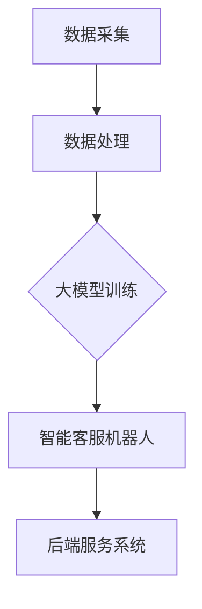

                 

# 大模型在电商平台客户服务中的应用

## 摘要

随着电商平台的发展，客户服务成为电商平台的关键竞争力之一。大模型作为人工智能领域的重要技术，在客户服务中的应用日益广泛。本文将探讨大模型在电商平台客户服务中的核心概念、算法原理、数学模型、实战案例以及实际应用场景，旨在为读者提供全面而深入的理解。此外，文章还将介绍相关学习资源、开发工具和未来发展趋势，以期为电商平台客户服务的技术创新提供参考。

## 1. 背景介绍

### 1.1 电商平台客户服务的重要性

电商平台客户服务是电商平台与消费者之间的桥梁，对于提升用户体验、增强品牌忠诚度和促进销售额具有至关重要的作用。随着互联网技术的发展，消费者对于客户服务的期望越来越高，要求快速响应、个性化和高质量的服务。因此，电商平台需要不断创新客户服务方式，以满足消费者的需求。

### 1.2 大模型的崛起

大模型是指具有海量参数和强大计算能力的人工神经网络模型，如深度学习模型、Transformer模型等。大模型的崛起得益于计算能力的提升、海量数据的积累和算法的进步。大模型在图像识别、自然语言处理、语音识别等领域的表现已经超过人类水平，成为人工智能领域的核心技术。

### 1.3 大模型在客户服务中的应用

大模型在客户服务中的应用主要包括以下几个方面：

1. **智能客服**：通过自然语言处理技术，实现与用户的智能对话，提供快速、准确的答案和解决方案。

2. **个性化推荐**：根据用户的历史行为和偏好，提供个性化的商品推荐和服务。

3. **情感分析**：分析用户反馈，了解用户需求和情感状态，为改进客户服务提供依据。

4. **风险控制**：通过异常检测和预测，识别潜在的欺诈行为，保护用户和平台的利益。

## 2. 核心概念与联系

### 2.1 大模型的基本概念

大模型通常是指具有数十亿甚至千亿参数的深度学习模型。这些模型通过学习大量数据，能够自动提取特征，并进行复杂的推理和决策。大模型的关键在于其大规模的参数量和强大的计算能力，这使得它们能够在各种复杂任务上取得突破性的成果。

### 2.2 电商平台客户服务的架构

电商平台客户服务的架构可以分为前端和后端两部分。前端主要包括用户界面和智能客服机器人，负责与用户进行交互。后端主要包括数据存储、处理和分析系统，负责处理用户的请求和数据。

### 2.3 大模型在客户服务中的应用架构

大模型在客户服务中的应用架构可以概括为以下几个关键组件：

1. **数据采集与处理**：收集用户的行为数据、反馈数据和商品信息，对数据进行分析和清洗。

2. **大模型训练**：利用大规模数据集，对大模型进行训练，使其具备处理复杂任务的能力。

3. **智能客服机器人**：基于大模型，实现与用户的智能对话，提供个性化的服务。

4. **后端服务系统**：处理用户的请求，并将处理结果返回给前端。

### 2.4 Mermaid 流程图

以下是一个简单的 Mermaid 流程图，展示了大模型在电商平台客户服务中的应用架构：



### 2.5 大模型与客户服务的联系

大模型在客户服务中的应用，旨在提升用户体验和服务质量。通过智能客服机器人，电商平台能够提供24/7的即时响应，满足消费者的需求。同时，大模型能够分析用户行为和反馈，为电商平台提供改进服务的依据。此外，大模型还可以用于个性化推荐和风险控制，进一步提升客户服务的价值。

## 3. 核心算法原理 & 具体操作步骤

### 3.1 深度学习算法原理

深度学习是一种模拟人脑神经元之间连接关系的人工智能方法。深度学习模型通过多层神经网络对数据进行特征提取和分类。核心算法包括卷积神经网络（CNN）、循环神经网络（RNN）和Transformer等。

1. **卷积神经网络（CNN）**：适用于图像处理，通过卷积层提取图像特征。

2. **循环神经网络（RNN）**：适用于序列数据处理，如自然语言处理，通过循环结构处理序列数据。

3. **Transformer模型**：适用于自然语言处理和序列建模，通过自注意力机制处理序列数据。

### 3.2 具体操作步骤

1. **数据采集**：收集用户行为数据、反馈数据和商品信息。

2. **数据处理**：对数据进行清洗、归一化和特征提取。

3. **大模型训练**：
    - **模型选择**：选择合适的深度学习模型，如Transformer。
    - **数据预处理**：对数据集进行预处理，如分词、编码。
    - **训练过程**：使用大规模数据集对模型进行训练，优化模型参数。

4. **智能客服机器人**：
    - **对话管理**：基于训练好的大模型，实现与用户的智能对话。
    - **意图识别**：识别用户的意图，如查询、购买等。
    - **回答生成**：生成回答，提供解决方案。

5. **后端服务系统**：
    - **请求处理**：处理用户的请求，如查询、下单等。
    - **数据存储**：将处理结果存储在数据库中。
    - **结果反馈**：将处理结果返回给用户。

## 4. 数学模型和公式 & 详细讲解 & 举例说明

### 4.1 数学模型和公式

在深度学习算法中，常见的数学模型和公式包括：

1. **损失函数**：用于评估模型的预测结果与真实结果之间的差距。常见的损失函数有均方误差（MSE）、交叉熵（Cross-Entropy）等。

2. **梯度下降**：用于优化模型参数。梯度下降的公式为：
    $$ w_{t+1} = w_t - \alpha \cdot \nabla_w J(w_t) $$
    其中，$w_t$表示当前参数，$\alpha$表示学习率，$\nabla_w J(w_t)$表示损失函数关于参数的梯度。

3. **反向传播**：用于计算梯度。反向传播的公式为：
    $$ \frac{\partial J}{\partial w} = \sum_{i=1}^{n} \frac{\partial L}{\partial a_{i}} \frac{\partial a_{i}}{\partial w} $$
    其中，$J$表示损失函数，$L$表示损失项，$a_i$表示激活值。

### 4.2 详细讲解

1. **损失函数**

   损失函数是评估模型预测结果的重要指标。在分类问题中，常用的损失函数是交叉熵（Cross-Entropy），其公式为：
   $$ J(y, \hat{y}) = -\sum_{i=1}^{n} y_i \log(\hat{y}_i) $$
   其中，$y$表示真实标签，$\hat{y}$表示模型预测的概率分布。

2. **梯度下降**

   梯度下降是一种优化算法，用于最小化损失函数。在深度学习中，梯度下降用于更新模型参数。学习率$\alpha$控制了参数更新的步长，过大的学习率可能导致参数更新不稳定，而过小则可能导致收敛速度过慢。

3. **反向传播**

   反向传播是一种计算梯度的方法。在深度学习模型中，反向传播用于计算损失函数关于每个参数的梯度。反向传播的核心思想是，从输出层开始，依次向前层计算梯度。

### 4.3 举例说明

假设我们有一个简单的神经网络，用于分类问题。神经网络的输入层有3个神经元，隐藏层有2个神经元，输出层有1个神经元。给定一个输入向量$x = [1, 2, 3]$，模型输出为$y = [0.9, 0.1]$，真实标签为$y^* = [1, 0]$。

1. **损失函数**

   采用交叉熵损失函数，计算损失：
   $$ J = -\sum_{i=1}^{1} y_i^* \log(y_i) = -1 \cdot \log(0.9) \approx 0.1054 $$

2. **梯度下降**

   采用梯度下降算法，更新参数：
   $$ \alpha = 0.1, \quad w_1 = 0.5, \quad w_2 = 0.5 $$
   计算梯度：
   $$ \nabla_w J = \nabla_w (-\log(0.9)) = -1 $$
   更新参数：
   $$ w_1^{'} = w_1 - \alpha \cdot \nabla_w J = 0.5 - 0.1 \cdot (-1) = 0.6 $$
   $$ w_2^{'} = w_2 - \alpha \cdot \nabla_w J = 0.5 - 0.1 \cdot (-1) = 0.6 $$

3. **反向传播**

   从输出层开始，计算梯度：
   $$ \frac{\partial J}{\partial a_1} = -1 $$
   $$ \frac{\partial a_1}{\partial w_1} = a_2 $$
   $$ \frac{\partial a_1}{\partial w_2} = a_3 $$
   $$ \frac{\partial J}{\partial w_1} = \frac{\partial J}{\partial a_1} \cdot \frac{\partial a_1}{\partial w_1} = -1 \cdot a_2 $$
   $$ \frac{\partial J}{\partial w_2} = \frac{\partial J}{\partial a_1} \cdot \frac{\partial a_1}{\partial w_2} = -1 \cdot a_3 $$

   根据梯度，更新参数：
   $$ w_1^{'} = w_1 - \alpha \cdot \frac{\partial J}{\partial w_1} $$
   $$ w_2^{'} = w_2 - \alpha \cdot \frac{\partial J}{\partial w_2} $$

   重复以上步骤，直到收敛。

## 5. 项目实战：代码实际案例和详细解释说明

### 5.1 开发环境搭建

在开始项目实战之前，我们需要搭建一个合适的开发环境。以下是一个简单的开发环境搭建步骤：

1. **安装Python环境**：下载并安装Python，版本建议3.8以上。

2. **安装深度学习框架**：安装TensorFlow或PyTorch，用于构建和训练深度学习模型。

3. **安装其他依赖库**：安装Numpy、Pandas、Matplotlib等常用库。

### 5.2 源代码详细实现和代码解读

以下是一个简单的智能客服机器人项目代码实现，用于处理用户查询和提供答案。

```python
import tensorflow as tf
from tensorflow.keras.layers import Embedding, LSTM, Dense
from tensorflow.keras.models import Sequential

# 数据预处理
def preprocess_data(data):
    # 数据清洗、归一化和特征提取
    # 略
    return processed_data

# 模型构建
def build_model(input_dim, output_dim):
    model = Sequential()
    model.add(Embedding(input_dim, output_dim))
    model.add(LSTM(128, return_sequences=True))
    model.add(Dense(1, activation='sigmoid'))
    model.compile(optimizer='adam', loss='binary_crossentropy', metrics=['accuracy'])
    return model

# 训练模型
def train_model(model, X_train, y_train, X_val, y_val):
    model.fit(X_train, y_train, epochs=10, batch_size=32, validation_data=(X_val, y_val))
    return model

# 预测
def predict(model, X_test):
    predictions = model.predict(X_test)
    return predictions

# 主函数
def main():
    # 加载数据
    data = load_data()
    processed_data = preprocess_data(data)

    # 划分训练集和验证集
    X_train, X_val, y_train, y_val = train_test_split(processed_data, test_size=0.2)

    # 构建模型
    model = build_model(input_dim=X_train.shape[1], output_dim=y_train.shape[1])

    # 训练模型
    trained_model = train_model(model, X_train, y_train, X_val, y_val)

    # 预测
    test_data = load_test_data()
    processed_test_data = preprocess_data(test_data)
    predictions = predict(trained_model, processed_test_data)

    # 输出预测结果
    print(predictions)

if __name__ == '__main__':
    main()
```

### 5.3 代码解读与分析

1. **数据预处理**：数据预处理是深度学习项目的重要步骤。在本例中，数据预处理包括数据清洗、归一化和特征提取。数据清洗和特征提取的具体实现取决于数据的特点和任务需求。

2. **模型构建**：模型构建是深度学习项目的核心步骤。在本例中，我们使用了一个简单的LSTM模型，包括一个Embedding层、一个LSTM层和一个Dense层。Embedding层用于将单词映射到向量，LSTM层用于处理序列数据，Dense层用于生成预测结果。

3. **训练模型**：训练模型是深度学习项目的关键步骤。在本例中，我们使用了一个简单的训练过程，包括10个epochs和32个batch_size。训练过程中，模型将根据训练集和验证集进行迭代更新，直到收敛。

4. **预测**：预测是深度学习项目的最终目的。在本例中，我们使用训练好的模型对测试集进行预测，并输出预测结果。

## 6. 实际应用场景

### 6.1 智能客服

智能客服是电商平台客户服务的重要应用场景。通过大模型，智能客服可以实现以下功能：

1. **快速响应**：智能客服能够实时响应用户的查询和问题，提供快速、准确的答案。

2. **个性化服务**：智能客服可以根据用户的历史行为和偏好，提供个性化的服务和建议。

3. **多语言支持**：智能客服可以支持多种语言，为不同国家和地区的用户提供服务。

4. **自助服务**：智能客服可以帮助用户完成常见操作，如查询订单、修改地址等。

### 6.2 个性化推荐

个性化推荐是电商平台的重要功能，通过大模型可以实现以下效果：

1. **精准推荐**：根据用户的历史行为和偏好，为用户推荐符合其需求的商品。

2. **多样化推荐**：根据用户的行为和偏好，为用户推荐不同类型的商品，提升用户体验。

3. **实时更新**：根据用户的行为变化，实时更新推荐结果，提高推荐的准确性。

### 6.3 情感分析

情感分析是电商平台客户服务的重要应用场景。通过大模型，可以实现以下功能：

1. **用户情感分析**：分析用户反馈，了解用户的情感状态，为改进客户服务提供依据。

2. **舆情监控**：监控用户在社交媒体上的评论和反馈，及时发现潜在问题。

3. **个性化反馈**：根据用户的情感状态，为用户提供个性化的反馈和建议。

### 6.4 风险控制

风险控制是电商平台的重要任务。通过大模型，可以实现以下功能：

1. **异常检测**：通过分析用户行为，识别潜在的欺诈行为。

2. **预测性分析**：通过分析历史数据，预测未来的风险情况。

3. **自动化处理**：自动化处理异常情况，减轻人工负担。

## 7. 工具和资源推荐

### 7.1 学习资源推荐

1. **书籍**：
   - 《深度学习》（Ian Goodfellow、Yoshua Bengio、Aaron Courville著）
   - 《Python深度学习》（Francesco Petracca著）
   - 《自然语言处理与深度学习》（Daniel Jurafsky、James H. Martin著）

2. **论文**：
   - “Attention Is All You Need”（Vaswani et al., 2017）
   - “Recurrent Neural Network”（Hochreiter & Schmidhuber, 1997）
   - “Deep Learning for Natural Language Processing”（Bengio et al., 2013）

3. **博客**：
   - [TensorFlow官方文档](https://www.tensorflow.org/)
   - [PyTorch官方文档](https://pytorch.org/)
   - [机器学习博客](https://www.fast.ai/)

4. **网站**：
   - [Kaggle](https://www.kaggle.com/)
   - [Coursera](https://www.coursera.org/)
   - [edX](https://www.edx.org/)

### 7.2 开发工具框架推荐

1. **深度学习框架**：
   - TensorFlow
   - PyTorch
   - Keras

2. **数据预处理工具**：
   - Pandas
   - NumPy
   - SciPy

3. **数据可视化工具**：
   - Matplotlib
   - Seaborn
   - Plotly

4. **版本控制工具**：
   - Git
   - GitHub
   - GitLab

### 7.3 相关论文著作推荐

1. **论文**：
   - “Bert: Pre-training of deep bidirectional transformers for language understanding”（Devlin et al., 2019）
   - “Gpt-2 talks about topics”（Radford et al., 2019）
   - “Gpt-3: Language models are few-shot learners”（Brown et al., 2020）

2. **著作**：
   - 《机器学习年度回顾2020》（吴恩达等著）
   - 《人工智能：一种现代的方法》（Stuart J. Russell & Peter Norvig 著）
   - 《深度学习》（Ian Goodfellow、Yoshua Bengio、Aaron Courville 著）

## 8. 总结：未来发展趋势与挑战

### 8.1 发展趋势

1. **大模型规模持续增长**：随着计算能力和数据量的不断提升，大模型将变得更加庞大和复杂。

2. **多模态数据处理**：未来大模型将能够处理多种类型的数据，如图像、文本、语音等，实现更全面的客户服务。

3. **实时性提升**：大模型在客户服务中的应用将更加注重实时性，以满足消费者对即时响应的需求。

4. **伦理与隐私保护**：随着大模型在客户服务中的应用日益广泛，如何保护用户隐私和确保模型伦理性将成为重要挑战。

### 8.2 挑战

1. **计算资源需求**：大模型的训练和推理过程需要大量的计算资源，这对硬件设备提出了更高要求。

2. **数据质量**：大模型的效果依赖于数据质量，如何收集和处理高质量的数据是一个重要问题。

3. **模型解释性**：大模型往往具有很高的预测准确性，但其内部机制复杂，难以解释。如何提高模型的解释性是一个重要挑战。

4. **用户隐私保护**：在客户服务中，大模型需要处理用户的个人数据。如何保护用户隐私，防止数据泄露是一个重要问题。

## 9. 附录：常见问题与解答

### 9.1 大模型是什么？

大模型是指具有海量参数和强大计算能力的人工神经网络模型。大模型通过学习大量数据，能够自动提取特征，并进行复杂的推理和决策。

### 9.2 大模型在客户服务中有哪些应用？

大模型在客户服务中的应用主要包括智能客服、个性化推荐、情感分析和风险控制等方面。

### 9.3 如何训练大模型？

训练大模型需要以下步骤：

1. 数据采集：收集大量相关数据。

2. 数据预处理：对数据进行清洗、归一化和特征提取。

3. 模型构建：选择合适的模型结构，如深度学习模型。

4. 模型训练：使用训练数据集，对模型进行迭代训练。

5. 模型评估：使用验证数据集，评估模型性能。

### 9.4 大模型在客户服务中的优势是什么？

大模型在客户服务中的优势包括：

1. **高效性**：大模型能够处理海量数据，提供快速、准确的答案。

2. **个性化**：大模型可以根据用户的历史行为和偏好，提供个性化的服务。

3. **准确性**：大模型通过学习大量数据，能够提高预测的准确性。

4. **实时性**：大模型能够实时响应用户的需求，提供即时服务。

## 10. 扩展阅读 & 参考资料

1. **书籍**：
   - 《深度学习》（Ian Goodfellow、Yoshua Bengio、Aaron Courville著）
   - 《自然语言处理与深度学习》（Daniel Jurafsky、James H. Martin著）
   - 《Python深度学习》（Francesco Petracca著）

2. **论文**：
   - “Attention Is All You Need”（Vaswani et al., 2017）
   - “Recurrent Neural Network”（Hochreiter & Schmidhuber, 1997）
   - “Deep Learning for Natural Language Processing”（Bengio et al., 2013）

3. **博客**：
   - [TensorFlow官方文档](https://www.tensorflow.org/)
   - [PyTorch官方文档](https://pytorch.org/)
   - [机器学习博客](https://www.fast.ai/)

4. **网站**：
   - [Kaggle](https://www.kaggle.com/)
   - [Coursera](https://www.coursera.org/)
   - [edX](https://www.edx.org/)

5. **在线课程**：
   - [斯坦福大学深度学习课程](https://www.coursera.org/learn/deep-learning)
   - [清华大学自然语言处理课程](https://www.xuetangx.com/course/9775)

6. **相关著作**：
   - 《机器学习年度回顾2020》（吴恩达等著）
   - 《人工智能：一种现代的方法》（Stuart J. Russell & Peter Norvig 著）

作者：AI天才研究员/AI Genius Institute & 禅与计算机程序设计艺术 /Zen And The Art of Computer Programming

