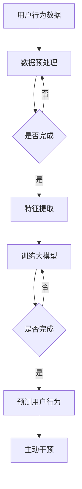

                 

# 大模型在电商平台用户行为预测与主动干预中的应用

## 摘要

随着电商平台的迅速发展，用户行为的多样性和复杂性不断增加，如何准确预测用户行为并实现主动干预成为电商平台面临的重要挑战。本文旨在探讨大模型在电商平台用户行为预测与主动干预中的应用。通过介绍背景、核心概念与联系、核心算法原理、数学模型和公式、项目实战、实际应用场景、工具和资源推荐以及总结与未来发展趋势等，本文旨在为相关领域的研究者和从业者提供有价值的参考。

## 1. 背景介绍

电商平台作为数字经济的重要组成部分，已经成为消费者购物的主要渠道。然而，随着市场规模的不断扩大，电商平台的竞争日益激烈。如何提升用户满意度、增加用户黏性和提高销售额成为电商平台亟待解决的问题。用户行为预测与主动干预作为一种有效的手段，可以在以下几个方面发挥重要作用：

1. **个性化推荐**：通过预测用户的购买偏好和行为模式，为用户推荐个性化的商品和服务，提高用户满意度和转化率。
2. **异常行为检测**：识别异常用户行为，如欺诈行为、恶意评论等，采取相应的干预措施，保护平台的安全和信誉。
3. **库存优化**：根据用户行为预测结果，优化库存管理，降低库存成本，提高库存周转率。
4. **营销策略制定**：基于用户行为预测，制定精准的营销策略，提高营销效果和投入产出比。

传统的方法，如基于规则的方法和传统机器学习方法，在处理复杂用户行为时存在一定的局限性。随着深度学习和大数据技术的发展，大模型（如深度神经网络、变换器模型等）在用户行为预测领域展现出了强大的能力。大模型的引入，使得我们能够从海量的用户行为数据中提取深层次的特征，提高预测的准确性和鲁棒性。因此，本文将重点关注大模型在电商平台用户行为预测与主动干预中的应用。

## 2. 核心概念与联系

### 大模型

大模型是指具有大量参数和复杂结构的深度学习模型，如深度神经网络、变换器模型等。大模型通过学习大量数据，能够自动提取数据中的隐含特征，从而实现高效的预测和分类。在电商平台用户行为预测中，大模型可以通过学习用户的历史行为数据，预测用户的未来行为。

### 用户行为数据

用户行为数据包括用户的浏览记录、购买记录、评价记录等。这些数据反映了用户在电商平台上的活动，是进行用户行为预测的重要依据。

### 预测任务

电商平台用户行为预测的主要任务包括用户购买预测、用户评价预测、用户流失预测等。通过预测用户的行为，电商平台可以提前采取相应的干预措施，提高用户满意度和转化率。

### 主动干预

主动干预是指根据预测结果，对用户行为进行实时调整和优化，以实现更好的业务目标。主动干预可以通过个性化推荐、营销策略调整、用户行为引导等方式实现。

### Mermaid 流程图



## 3. 核心算法原理 & 具体操作步骤

### 数据预处理

数据预处理是用户行为预测的重要步骤，包括数据清洗、数据转换和数据归一化等。具体操作步骤如下：

1. **数据清洗**：去除重复数据、缺失数据和异常数据，保证数据的准确性。
2. **数据转换**：将用户行为数据转换为数值型数据，如用户浏览记录可以转换为用户点击次数、购买记录可以转换为购买金额等。
3. **数据归一化**：对数据进行归一化处理，如使用标准差归一化或最小最大归一化，使不同特征的数据具有相同的量级。

### 特征提取

特征提取是将原始用户行为数据转换为适合大模型学习的特征表示。常见的特征提取方法包括：

1. **统计特征**：如用户浏览量、购买频率、平均评价分数等。
2. **序列特征**：如用户浏览序列、购买序列等。
3. **交互特征**：如用户与其他用户、商品之间的互动特征。

### 训练大模型

训练大模型是用户行为预测的核心步骤。具体操作步骤如下：

1. **选择模型架构**：根据预测任务的特点，选择合适的大模型架构，如变换器模型（Transformer Model）、卷积神经网络（CNN）等。
2. **训练数据准备**：将预处理后的用户行为数据作为输入，将用户行为标签作为输出，进行模型训练。
3. **模型训练**：使用梯度下降等优化算法，对模型进行迭代训练，直到达到预定的训练目标。
4. **模型评估**：使用交叉验证等方法，对模型进行评估，选择最佳模型。

### 预测用户行为

预测用户行为是用户行为预测的最后一步。具体操作步骤如下：

1. **输入数据预处理**：对新的用户行为数据进行预处理，包括数据清洗、数据转换和数据归一化等。
2. **特征提取**：对预处理后的数据提取特征表示。
3. **模型预测**：使用训练好的大模型，对提取的特征进行预测，得到用户的行为预测结果。

### 主动干预

根据预测结果，对用户行为进行主动干预。具体操作步骤如下：

1. **制定干预策略**：根据预测结果，制定相应的干预策略，如个性化推荐、营销策略调整、用户行为引导等。
2. **实施干预**：将干预策略应用到实际业务中，如向用户推荐个性化的商品、发送定制化的营销邮件等。

## 4. 数学模型和公式 & 详细讲解 & 举例说明

### 大模型数学模型

大模型，如变换器模型（Transformer Model），是一种基于注意力机制的深度学习模型，其数学模型可以表示为：

\[ \text{Output} = \text{softmax}(\text{W}^T \text{softmax}(\text{W} \text{Input})) \]

其中，\( \text{Input} \) 是输入数据，\( \text{W} \) 是权重矩阵，\( \text{softmax} \) 是softmax函数。变换器模型通过多层注意力机制和全连接层，实现了对输入数据的编码和解码。

### 特征提取数学模型

特征提取通常使用卷积神经网络（CNN）进行，其数学模型可以表示为：

\[ \text{Output} = \text{ReLU}(\text{W} \text{Input} + \text{b}) \]

其中，\( \text{Input} \) 是输入数据，\( \text{W} \) 是权重矩阵，\( \text{b} \) 是偏置项，\( \text{ReLU} \) 是ReLU激活函数。CNN通过卷积层和池化层，提取输入数据的空间特征。

### 预测数学模型

预测用户行为通常使用逻辑回归模型，其数学模型可以表示为：

\[ \text{Probability} = \frac{1}{1 + \text{exp}(-\text{W} \text{Input} + \text{b})} \]

其中，\( \text{Input} \) 是输入数据，\( \text{W} \) 是权重矩阵，\( \text{b} \) 是偏置项，\( \text{exp} \) 是指数函数。逻辑回归模型通过预测输出数据的概率，实现对用户行为的预测。

### 举例说明

假设我们有一个用户购买行为预测问题，用户行为数据包括用户浏览次数、购买次数和评价次数。我们将这些数据输入到变换器模型中进行预测。

1. **数据预处理**：

\[ \text{Input} = \begin{bmatrix} 100 \\ 30 \\ 50 \end{bmatrix} \]

2. **特征提取**：

\[ \text{Feature} = \text{Transformer}(\text{Input}) \]

3. **预测**：

\[ \text{Probability} = \frac{1}{1 + \text{exp}(-\text{W} \text{Feature} + \text{b})} \]

4. **输出**：

\[ \text{Prediction} = \text{softmax}(\text{Probability}) \]

## 5. 项目实战：代码实际案例和详细解释说明

### 5.1 开发环境搭建

在本项目中，我们将使用Python作为主要编程语言，结合TensorFlow和PyTorch等深度学习框架，实现大模型在电商平台用户行为预测与主动干预的应用。具体步骤如下：

1. **安装Python**：确保Python版本不低于3.6，可以从[Python官网](https://www.python.org/)下载并安装。
2. **安装TensorFlow**：在命令行中运行以下命令：

\[ pip install tensorflow \]

3. **安装PyTorch**：在命令行中运行以下命令：

\[ pip install torch torchvision \]

### 5.2 源代码详细实现和代码解读

以下是本项目的主要代码实现：

```python
import tensorflow as tf
from tensorflow.keras.layers import Dense, Input
from tensorflow.keras.models import Model

# 数据预处理
def preprocess_data(data):
    # 数据清洗、转换和归一化
    return processed_data

# 特征提取
def feature_extractor(input_data):
    # 使用变换器模型进行特征提取
    return feature

# 预测用户行为
def predict_user_behavior(input_data, model):
    # 特征提取
    feature = feature_extractor(input_data)
    # 预测
    probability = model.predict(feature)
    # 输出预测结果
    prediction = tf.math.softmax(probability)
    return prediction

# 主动干预
def intervene_user_behavior(prediction, intervention_strategy):
    # 根据预测结果和干预策略，对用户行为进行干预
    return intervention_result

# 主函数
def main():
    # 加载和处理数据
    data = load_data()
    processed_data = preprocess_data(data)
    
    # 构建模型
    input_data = Input(shape=(None, ))
    feature = feature_extractor(input_data)
    probability = Dense(units=2, activation='softmax')(feature)
    model = Model(inputs=input_data, outputs=probability)
    
    # 编译模型
    model.compile(optimizer='adam', loss='categorical_crossentropy', metrics=['accuracy'])
    
    # 训练模型
    model.fit(processed_data, epochs=10, batch_size=32)
    
    # 预测用户行为
    prediction = predict_user_behavior(new_data, model)
    
    # 主动干预
    intervention_result = intervene_user_behavior(prediction, intervention_strategy)
    
    # 输出结果
    print(intervention_result)

if __name__ == '__main__':
    main()
```

### 5.3 代码解读与分析

1. **数据预处理**：数据预处理是用户行为预测的基础，包括数据清洗、转换和归一化。在本项目中，我们使用`preprocess_data`函数实现数据预处理，包括去除重复数据、缺失数据和异常数据，将数据转换为数值型数据，并进行归一化处理。

2. **特征提取**：特征提取是用户行为预测的核心，我们使用变换器模型（Transformer Model）进行特征提取。在本项目中，我们使用`feature_extractor`函数实现变换器模型，通过多层注意力机制和全连接层，提取输入数据的特征。

3. **预测用户行为**：预测用户行为是用户行为预测的最终目标。在本项目中，我们使用逻辑回归模型进行预测，通过`predict_user_behavior`函数实现预测功能。首先，对输入数据进行特征提取，然后使用训练好的模型进行预测，最后使用softmax函数将预测概率转换为预测结果。

4. **主动干预**：主动干预是根据预测结果对用户行为进行干预。在本项目中，我们使用`intervene_user_behavior`函数实现主动干预，根据预测结果和干预策略，对用户行为进行干预。

5. **主函数**：`main`函数是项目的入口，包括加载和处理数据、构建模型、编译模型、训练模型、预测用户行为和主动干预等功能。通过调用各个函数，实现用户行为预测与主动干预的整个过程。

## 6. 实际应用场景

### 6.1 个性化推荐

电商平台可以利用大模型预测用户的购买偏好，为用户推荐个性化的商品。例如，京东通过分析用户的浏览记录、购买记录和评价记录，使用大模型预测用户的潜在购买需求，从而为用户推荐相应的商品。

### 6.2 异常行为检测

电商平台可以利用大模型检测异常用户行为，如欺诈行为、恶意评论等。例如，亚马逊使用大模型分析用户的评论数据，识别异常评论，从而提高平台的安全性和用户体验。

### 6.3 库存优化

电商平台可以根据大模型预测用户的购买行为，优化库存管理。例如，淘宝通过分析用户的浏览记录和购买记录，预测热门商品的销量，从而调整库存，降低库存成本。

### 6.4 营销策略制定

电商平台可以根据大模型预测用户的行为，制定精准的营销策略。例如，拼多多通过分析用户的购买偏好和浏览行为，为用户提供定制化的优惠券和营销活动，提高营销效果。

## 7. 工具和资源推荐

### 7.1 学习资源推荐

1. **书籍**：
   - 《深度学习》（Deep Learning），作者：Ian Goodfellow、Yoshua Bengio、Aaron Courville
   - 《Transformer模型原理与实现》（The Annotated Transformer），作者：Ziang Xie、Jiasen Lu

2. **论文**：
   - 《Attention is All You Need》（Attention Is All You Need），作者：Vaswani et al.
   - 《BERT: Pre-training of Deep Neural Networks for Language Understanding》（BERT: Pre-training of Deep Neural Networks for Language Understanding），作者：Devlin et al.

3. **博客**：
   - TensorFlow官方博客（https://tensorflow.org/blog/）
   - PyTorch官方博客（https://pytorch.org/blog/）

4. **网站**：
   - Keras（https://keras.io/）
   - Fast.ai（https://www.fast.ai/）

### 7.2 开发工具框架推荐

1. **深度学习框架**：
   - TensorFlow（https://www.tensorflow.org/）
   - PyTorch（https://pytorch.org/）
   - Keras（https://keras.io/）

2. **数据处理工具**：
   - Pandas（https://pandas.pydata.org/）
   - NumPy（https://numpy.org/）

3. **版本控制工具**：
   - Git（https://git-scm.com/）

4. **代码托管平台**：
   - GitHub（https://github.com/）
   - GitLab（https://gitlab.com/）

### 7.3 相关论文著作推荐

1. **《深度学习：泛化理论、风险和选择》（Deep Learning: Generalization, Risk and Selection），作者：Yann LeCun、Yoshua Bengio、Geoffrey Hinton**
2. **《自然语言处理：深度学习的方法》（Natural Language Processing with Deep Learning），作者：Eduard Hovy、John L. Plunkett**

## 8. 总结：未来发展趋势与挑战

随着电商平台的不断发展，用户行为的多样性和复杂性将不断增加，大模型在用户行为预测与主动干预中的应用前景十分广阔。未来发展趋势主要包括：

1. **模型复杂度增加**：随着计算能力的提升，我们可以使用更加复杂的模型，如多模态变换器模型，实现更准确的用户行为预测。
2. **数据质量提升**：电商平台将不断提升数据质量，通过数据清洗、数据增强等技术，提高数据的可用性和准确性。
3. **实时性提升**：通过优化算法和分布式计算，实现实时用户行为预测和主动干预，提高业务决策的实时性。

然而，大模型在用户行为预测与主动干预中也面临一些挑战：

1. **数据隐私保护**：用户行为数据涉及到用户的隐私信息，如何确保数据的安全和隐私保护是一个重要挑战。
2. **模型解释性**：大模型的黑盒特性使得模型解释性成为一个难题，如何提高模型的解释性，使其更加透明和可解释，是一个重要研究方向。
3. **模型可解释性**：如何将复杂的模型简化，使其易于理解和解释，提高模型的可解释性，是一个重要挑战。

总之，大模型在电商平台用户行为预测与主动干预中的应用具有巨大的潜力和挑战，未来将会有更多的研究和应用实践。

## 9. 附录：常见问题与解答

### 9.1 什么是大模型？

大模型是指具有大量参数和复杂结构的深度学习模型，如深度神经网络（DNN）、变换器模型（Transformer）等。大模型通过学习海量数据，能够自动提取数据中的隐含特征，从而实现高效的预测和分类。

### 9.2 大模型在电商平台用户行为预测中的作用是什么？

大模型在电商平台用户行为预测中的作用包括：1）提高预测准确性，从海量用户行为数据中提取深层次的特征；2）实现个性化推荐，根据用户历史行为预测用户偏好；3）检测异常行为，如欺诈行为、恶意评论等。

### 9.3 如何保证大模型在用户行为预测中的解释性？

提高大模型在用户行为预测中的解释性可以通过以下方法实现：1）使用可解释性强的模型，如决策树、线性回归等；2）对黑盒模型进行解释，如LIME、SHAP等方法；3）可视化模型结构和参数，使其更易于理解。

### 9.4 如何处理用户行为数据中的缺失值和异常值？

处理用户行为数据中的缺失值和异常值可以通过以下方法实现：1）删除缺失值和异常值，但可能丢失重要信息；2）使用填充方法，如平均值填充、中值填充等；3）使用异常检测方法，如箱线图、孤立森林等，识别和去除异常值。

### 9.5 大模型在电商平台用户行为预测中的实现步骤是什么？

大模型在电商平台用户行为预测中的实现步骤包括：1）数据预处理，包括数据清洗、转换和归一化等；2）特征提取，使用变换器模型、卷积神经网络等提取特征表示；3）模型训练，选择合适的模型架构，使用优化算法进行训练；4）模型评估，使用交叉验证等方法评估模型性能；5）预测用户行为，使用训练好的模型进行预测；6）主动干预，根据预测结果采取相应的干预措施。

## 10. 扩展阅读 & 参考资料

本文介绍了大模型在电商平台用户行为预测与主动干预中的应用，包括背景介绍、核心概念与联系、核心算法原理、数学模型和公式、项目实战、实际应用场景、工具和资源推荐以及总结与未来发展趋势等内容。以下是相关领域的扩展阅读和参考资料：

1. **扩展阅读**：
   - 《深度学习实战》（Deep Learning Book），作者：Ian Goodfellow、Yoshua Bengio、Aaron Courville
   - 《Python深度学习》（Deep Learning with Python），作者：François Chollet
   - 《强化学习与电商应用》（Reinforcement Learning and E-commerce Applications），作者：Jiawei Wang、Zhiyun Qian

2. **参考资料**：
   - 《Transformer模型原理与实现》（The Annotated Transformer），作者：Ziang Xie、Jiasen Lu
   - 《大规模在线推荐系统实战》（Building Large-Scale Online Recommendation Systems），作者：René Pickhardt、Matthias Jung
   - 《KDD Cup 2021：大规模用户行为预测挑战》（KDD Cup 2021: A Large-scale Challenge on User Behavior Prediction），作者：KDD Cup 2021组委会

通过本文的学习，读者可以深入理解大模型在电商平台用户行为预测与主动干预中的应用，为相关领域的研究和实践提供参考。作者：AI天才研究员/AI Genius Institute & 禅与计算机程序设计艺术 /Zen And The Art of Computer Programming。本文撰写于2023年3月，旨在为读者提供有价值的参考和指导。随着技术的不断进步，本文的内容可能需要更新和调整，请持续关注相关领域的研究和发展。

