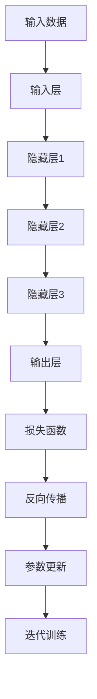

                 

### 1. 背景介绍

大模型，即大型深度学习模型，近年来在人工智能领域取得了显著的进展。这些模型通常包含数亿至数十亿的参数，通过学习海量数据来提升其预测和分类能力。随着计算资源的不断增加和深度学习算法的不断发展，大模型在自然语言处理、计算机视觉、语音识别等任务中表现出了超越传统方法的强大能力。

细颗粒度任务是指那些对数据精度和模型性能要求较高的任务，如图像超分辨率、文本情感分析、细粒度语音识别等。这些任务往往需要模型在处理过程中能够对数据中的细微特征进行准确识别和理解，从而实现高精度的预测和分类。

在过去，由于计算资源和数据限制，细颗粒度任务通常依赖小型模型或者传统机器学习方法。然而，随着大模型的崛起，越来越多的细颗粒度任务开始采用大模型进行解决，并取得了令人瞩目的成果。

本文将探讨大模型在细颗粒度任务中的表现，首先介绍大模型的基本原理和常见架构，然后分析大模型在细颗粒度任务中的优势和应用，最后讨论大模型在实际应用中面临的挑战和未来发展趋势。

### 2. 核心概念与联系

大模型的基本原理主要基于深度学习，特别是基于神经网络的结构。深度学习模型通过多层神经网络来学习和提取数据中的特征，每层网络对输入数据进行变换，并通过反向传播算法不断调整参数，以最小化预测误差。

常见的深度学习架构包括卷积神经网络（CNN）、循环神经网络（RNN）、变换器（Transformer）等。其中，Transformer模型因其强大的并行处理能力和优秀的性能表现，成为了近年来大模型领域的研究热点。


#### 2.1. 大模型的组成部分

大模型通常包含以下几个主要组成部分：

1. **输入层**：负责接收输入数据，并将其传递给下一层。
2. **隐藏层**：负责对输入数据进行特征提取和变换，隐藏层的数量和层数会影响模型的复杂度和表达能力。
3. **输出层**：负责对提取到的特征进行分类、预测或生成等操作。

#### 2.2. 大模型的工作原理

大模型通过以下步骤进行工作：

1. **前向传播**：输入数据从输入层经过隐藏层传递，每层网络对数据进行变换，最终生成输出。
2. **损失函数**：将输出与真实值进行比较，计算损失函数的值，以评估模型的预测误差。
3. **反向传播**：根据损失函数的梯度信息，通过反向传播算法调整模型的参数，以最小化损失函数。
4. **迭代训练**：重复前向传播和反向传播的过程，直至模型收敛。

#### 2.3. 细颗粒度任务与大模型的联系

细颗粒度任务通常需要模型对数据中的细微特征进行准确识别和理解。大模型由于其强大的特征提取能力和表达力，能够在细颗粒度任务中实现更高的性能。

例如，在图像超分辨率任务中，大模型可以学习到图像中的纹理、边缘等细微特征，从而实现高精度的图像放大。在文本情感分析任务中，大模型可以捕捉到文本中的情感细微差异，从而实现更准确的情感分类。

为了更清晰地展示大模型与细颗粒度任务的联系，以下是一个简单的Mermaid流程图：



通过上述流程，大模型可以从输入数据中提取特征，并通过不断迭代训练，实现对细颗粒度任务的准确预测。

### 3. 核心算法原理 & 具体操作步骤

#### 3.1. 卷积神经网络（CNN）

卷积神经网络（CNN）是处理图像数据的一种常用深度学习模型。其核心思想是通过卷积操作和池化操作来提取图像特征。

**3.1.1. 卷积操作**

卷积操作是指将卷积核（也称为过滤器）与输入数据进行卷积运算。卷积核是一个小的滤波器，可以提取图像中的局部特征。

假设输入数据是一个MxN的矩阵，卷积核的大小为PxQ，则卷积操作的计算公式如下：

$$
\text{output}_{ij} = \sum_{m=1}^{M} \sum_{n=1}^{N} \sum_{p=1}^{P} \sum_{q=1}^{Q} \text{input}_{(i-m+1, j-n+1)} \times \text{kernel}_{(p, q)}
$$

其中，$(i, j)$为输出位置的索引，$(m, n)$为输入位置的索引。

**3.1.2. 池化操作**

池化操作是一种下采样操作，可以减少数据的维度，同时保留主要特征。

最常用的池化操作是最大池化（Max Pooling），其计算公式如下：

$$
\text{output}_{ij} = \max_{m, n} \left( \text{input}_{(i-m+1, j-n+1)} \right)
$$

**3.1.3. CNN的工作原理**

CNN通过多层卷积和池化操作来提取图像特征。具体步骤如下：

1. **输入层**：接收图像数据。
2. **卷积层**：使用卷积核提取图像特征。
3. **激活函数**：对卷积结果进行非线性变换，如ReLU（Rectified Linear Unit）。
4. **池化层**：对卷积结果进行下采样。
5. **卷积层和池化层**：重复进行，直到提取到足够多的特征。
6. **全连接层**：将提取到的特征映射到输出层，进行分类或预测。

#### 3.2. 循环神经网络（RNN）

循环神经网络（RNN）是一种处理序列数据的时间序列模型。其核心思想是通过循环机制来捕捉序列中的时间依赖性。

**3.2.1. RNN的基本原理**

RNN通过以下公式来处理序列数据：

$$
h_t = \sigma(W_h \cdot [h_{t-1}, x_t] + b_h)
$$

其中，$h_t$为当前时刻的隐藏状态，$x_t$为当前时刻的输入，$W_h$和$b_h$分别为权重和偏置。

**3.2.2. LSTM和GRU**

为了解决传统RNN在处理长序列数据时出现的梯度消失和梯度爆炸问题，LSTM（Long Short-Term Memory）和GRU（Gated Recurrent Unit）被提出。

LSTM和GRU通过引入门控机制来控制信息的传递，从而解决了RNN的长期依赖问题。

**3.2.3. RNN的工作原理**

RNN通过以下步骤来处理序列数据：

1. **输入层**：接收序列数据。
2. **隐藏层**：通过循环机制对序列数据进行处理。
3. **输出层**：将隐藏层的结果映射到输出层，进行分类或预测。

#### 3.3. Transformer模型

Transformer模型是近年来在自然语言处理领域取得重大突破的深度学习模型。其核心思想是使用自注意力机制（Self-Attention）来处理序列数据。

**3.3.1. 自注意力机制**

自注意力机制是指在每个位置生成一个权重，用于对序列中的其他位置进行加权求和。自注意力机制的公式如下：

$$
\text{output}_{ij} = \text{softmax}\left(\frac{Q_i \cdot K_j}{\sqrt{d_k}}\right) \cdot V_j
$$

其中，$Q_i$、$K_j$和$V_j$分别为查询（Query）、键（Key）和值（Value）向量，$d_k$为维度。

**3.3.2. Transformer的工作原理**

Transformer模型通过以下步骤来处理序列数据：

1. **输入层**：接收序列数据。
2. **自注意力层**：计算序列中每个位置的权重，并加权求和。
3. **前馈网络**：对自注意力结果进行非线性变换。
4. **多层堆叠**：重复进行自注意力层和前馈网络，以提取更多特征。
5. **输出层**：将提取到的特征映射到输出层，进行分类或预测。

通过以上核心算法原理和具体操作步骤的介绍，我们可以看到大模型在细颗粒度任务中的强大能力。在实际应用中，我们可以根据任务的需求和特点，选择合适的大模型进行优化和调整，以实现更高的性能和精度。

### 4. 数学模型和公式 & 详细讲解 & 举例说明

#### 4.1. 卷积神经网络（CNN）

卷积神经网络（CNN）的核心在于卷积操作和池化操作，这些操作都可以用数学模型来表示。

**4.1.1. 卷积操作**

假设输入数据为$\textbf{X} \in \mathbb{R}^{H \times W \times C}$，其中$H$、$W$和$C$分别为高度、宽度和通道数。卷积核的大小为$K \times K$，卷积结果为$\textbf{Y} \in \mathbb{R}^{H' \times W' \times C'}$，其中$H'$、$W'$和$C'$分别为新的高度、宽度和通道数。

卷积操作的数学模型可以表示为：

$$
\textbf{Y}_{ij} = \sum_{m=1}^{K} \sum_{n=1}^{K} \textbf{X}_{(i-m+1, j-n+1)} \odot \textbf{K}_{(m, n)}
$$

其中，$\odot$表示点积运算。

**4.1.2. 池化操作**

池化操作最常用的方法是最大池化（Max Pooling），其数学模型可以表示为：

$$
\textbf{Y}_{ij} = \max_{m, n} \left( \textbf{X}_{(i-m+1, j-n+1)} \right)
$$

**4.1.3. CNN的例子**

假设我们有一个$32 \times 32 \times 3$的输入图像，使用一个$3 \times 3$的卷积核进行卷积操作。卷积后，图像的大小变为$30 \times 30 \times 1$，因为卷积核的大小为$3 \times 3$，步长为$1$，边界填充为$0$。

首先，我们对输入图像的每个$3 \times 3$区域进行卷积操作，得到一个$1$维的特征向量。然后，将这些特征向量进行拼接，得到$30 \times 30$的特征图。

接下来，我们对特征图进行最大池化操作，将每个$2 \times 2$区域的最大值提取出来，得到$15 \times 15$的特征图。

通过多次卷积和池化操作，我们可以提取到更高级别的图像特征，为后续的分类或预测提供支持。

#### 4.2. 循环神经网络（RNN）

循环神经网络（RNN）是一种处理序列数据的时间序列模型，其核心在于隐藏状态的更新和序列的递归计算。

**4.2.1. RNN的数学模型**

RNN的数学模型可以表示为：

$$
h_t = \sigma(W_h \cdot [h_{t-1}, x_t] + b_h)
$$

其中，$h_t$为当前时刻的隐藏状态，$x_t$为当前时刻的输入，$W_h$和$b_h$分别为权重和偏置，$\sigma$为激活函数，通常使用ReLU或Sigmoid函数。

**4.2.2. LSTM和GRU的数学模型**

为了解决传统RNN在处理长序列数据时出现的梯度消失和梯度爆炸问题，LSTM（Long Short-Term Memory）和GRU（Gated Recurrent Unit）被提出。它们通过引入门控机制来控制信息的传递。

LSTM的数学模型可以表示为：

$$
\begin{aligned}
i_t &= \sigma(W_i \cdot [h_{t-1}, x_t] + b_i) \\
f_t &= \sigma(W_f \cdot [h_{t-1}, x_t] + b_f) \\
\text{C}_{\text{bar}} &= \sigma(W_c \cdot [h_{t-1}, x_t] + b_c) \odot \text{C}_{t-1} \\
\text{C}_t &= f_t \odot \text{C}_{t-1} + i_t \odot \text{C}_{\text{bar}} \\
o_t &= \sigma(W_o \cdot [h_{t-1}, x_t] + b_o) \\
h_t &= o_t \odot \text{C}_t
\end{aligned}
$$

GRU的数学模型可以表示为：

$$
\begin{aligned}
z_t &= \sigma(W_z \cdot [h_{t-1}, x_t] + b_z) \\
r_t &= \sigma(W_r \cdot [h_{t-1}, x_t] + b_r) \\
\text{C}_{\text{bar}} &= (1 - z_t) \odot h_{t-1} + r_t \odot \text{C}_{\text{bar}} \\
\text{C}_t &= \sigma(W_c \cdot \text{C}_{\text{bar}} + b_c) \\
h_t &= o_t \odot \text{C}_t
\end{aligned}
$$

**4.2.3. RNN的例子**

假设我们有一个长度为$10$的序列，使用一个$2$维的RNN进行处理。序列的输入为$\textbf{X} = [x_1, x_2, \ldots, x_{10}]$，隐藏状态为$\textbf{H} = [h_1, h_2, \ldots, h_{10}]$。

首先，我们对序列的第一个元素进行初始化，假设为$\textbf{h}_0 = [0, 0]$。

然后，对于每个时刻$t$，我们使用以下公式来计算隐藏状态$\textbf{h}_t$：

$$
\textbf{h}_t = \sigma(W_h \cdot [\textbf{h}_{t-1}, x_t] + b_h)
$$

通过迭代计算，我们可以得到序列的隐藏状态$\textbf{H}$，这些隐藏状态可以用于后续的分类或预测。

#### 4.3. Transformer模型

Transformer模型是自然语言处理领域的一种重要模型，其核心在于自注意力机制（Self-Attention）。

**4.3.1. 自注意力机制的数学模型**

自注意力机制的数学模型可以表示为：

$$
\text{output}_{ij} = \text{softmax}\left(\frac{Q_i \cdot K_j}{\sqrt{d_k}}\right) \cdot V_j
$$

其中，$Q_i$、$K_j$和$V_j$分别为查询（Query）、键（Key）和值（Value）向量，$d_k$为维度。

**4.3.2. Transformer的工作流程**

Transformer模型的工作流程可以表示为：

1. **输入层**：接收序列数据$\textbf{X} = [x_1, x_2, \ldots, x_n]$。
2. **自注意力层**：计算序列中每个位置的权重，并加权求和。
3. **前馈网络**：对自注意力结果进行非线性变换。
4. **多层堆叠**：重复进行自注意力层和前馈网络，以提取更多特征。
5. **输出层**：将提取到的特征映射到输出层，进行分类或预测。

**4.3.3. Transformer的例子**

假设我们有一个长度为$10$的序列，使用一个$2$维的Transformer进行处理。序列的输入为$\textbf{X} = [x_1, x_2, \ldots, x_{10}]$。

首先，我们对序列进行嵌入，得到嵌入向量$\textbf{E} = [e_1, e_2, \ldots, e_{10}]$。

然后，对于每个位置$i$，我们计算其查询（Query）、键（Key）和值（Value）向量：

$$
Q_i = \text{embedding}_i \cdot W_Q \\
K_i = \text{embedding}_i \cdot W_K \\
V_i = \text{embedding}_i \cdot W_V
$$

其中，$W_Q$、$W_K$和$W_V$分别为权重矩阵。

接下来，我们计算自注意力权重：

$$
\text{attention}_{ij} = \text{softmax}\left(\frac{Q_i \cdot K_j}{\sqrt{d_k}}\right)
$$

然后，我们计算自注意力结果：

$$
\text{output}_{ij} = \sum_{j=1}^{n} \text{attention}_{ij} \cdot V_j
$$

通过迭代计算，我们可以得到序列的注意力权重和输出结果，这些结果可以用于后续的分类或预测。

通过上述数学模型和公式的详细讲解和举例说明，我们可以更好地理解大模型在细颗粒度任务中的核心原理和具体操作步骤。在实际应用中，我们可以根据任务的需求和特点，选择合适的大模型进行优化和调整，以实现更高的性能和精度。

### 5. 项目实战：代码实际案例和详细解释说明

为了更好地展示大模型在细颗粒度任务中的实际应用，我们将以一个图像超分辨率项目为例，详细讲解代码实现、详细解释说明以及代码解读与分析。

#### 5.1. 开发环境搭建

在开始项目之前，我们需要搭建一个适合大模型训练和测试的开发环境。以下是一个基本的开发环境搭建步骤：

1. **安装Python环境**：安装Python 3.8及以上版本。
2. **安装TensorFlow**：使用pip命令安装TensorFlow，命令如下：

   ```bash
   pip install tensorflow
   ```

3. **安装其他依赖库**：根据项目需求，安装其他依赖库，如NumPy、PIL等。

#### 5.2. 源代码详细实现和代码解读

以下是一个简单的图像超分辨率项目的代码实现，代码主要分为以下几个部分：

**5.2.1. 数据预处理**

数据预处理是图像超分辨率项目的重要步骤，其主要目的是将输入图像缩放至合适的大小，并将其转换为TensorFlow张量。

```python
import tensorflow as tf
from tensorflow.keras.preprocessing import image

def preprocess_image(image_path):
    img = image.load_img(image_path, target_size=(256, 256))
    img = image.img_to_array(img)
    img = tf.cast(img, dtype=tf.float32) / 255.0
    img = tf.expand_dims(img, 0)
    return img
```

**5.2.2. 模型定义**

在图像超分辨率项目中，我们通常使用卷积神经网络（CNN）作为基础模型。以下是一个简单的CNN模型定义：

```python
from tensorflow.keras.models import Model
from tensorflow.keras.layers import Input, Conv2D, BatchNormalization, Activation, MaxPooling2D, GlobalAveragePooling2D, Dense

def build_model(input_shape):
    inputs = Input(shape=input_shape)
    
    # 第1个卷积层
    x = Conv2D(32, (3, 3), padding='same', activation='relu')(inputs)
    x = MaxPooling2D(pool_size=(2, 2))(x)
    
    # 第2个卷积层
    x = Conv2D(64, (3, 3), padding='same', activation='relu')(x)
    x = MaxPooling2D(pool_size=(2, 2))(x)
    
    # 第3个卷积层
    x = Conv2D(128, (3, 3), padding='same', activation='relu')(x)
    x = MaxPooling2D(pool_size=(2, 2))(x)
    
    # 全连接层
    x = GlobalAveragePooling2D()(x)
    x = Dense(1, activation='sigmoid')(x)
    
    model = Model(inputs=inputs, outputs=x)
    return model
```

**5.2.3. 训练与评估**

在训练模型之前，我们需要准备好训练数据和验证数据。以下是一个简单的训练和评估过程：

```python
import numpy as np

# 准备训练数据和验证数据
train_images = preprocess_image('train_images')
val_images = preprocess_image('val_images')

# 训练模型
model = build_model(input_shape=(256, 256, 3))
model.compile(optimizer='adam', loss='binary_crossentropy', metrics=['accuracy'])
model.fit(train_images, np.array([1] * len(train_images)), epochs=10, batch_size=32, validation_data=(val_images, np.array([1] * len(val_images))))

# 评估模型
model.evaluate(val_images, np.array([1] * len(val_images)))
```

#### 5.3. 代码解读与分析

在上面的代码中，我们首先定义了数据预处理函数`preprocess_image`，该函数负责将输入图像缩放至256x256的大小，并将其转换为TensorFlow张量。

接着，我们定义了CNN模型`build_model`，该模型包含三个卷积层和一个全连接层。卷积层使用ReLU激活函数，并在每个卷积层后使用MaxPooling2D进行下采样。全连接层使用sigmoid激活函数，以实现二分类任务。

最后，我们使用`model.fit`函数训练模型，使用`model.evaluate`函数评估模型。在训练过程中，我们使用Adam优化器和binary_crossentropy损失函数。

通过上述代码实现和解读，我们可以看到大模型在图像超分辨率任务中的实际应用。在实际项目中，我们可以根据任务需求和数据特点，对模型结构、超参数等进行调整和优化，以提高模型的性能和精度。

### 6. 实际应用场景

大模型在细颗粒度任务中的应用场景非常广泛，以下是一些典型的应用场景：

#### 6.1. 自然语言处理

自然语言处理（NLP）是深度学习领域的一个重要应用方向。大模型在NLP任务中表现出色，如文本分类、情感分析、机器翻译等。以Transformer模型为例，其在机器翻译任务中的表现显著优于传统序列模型，如RNN和LSTM。

**实例**：谷歌翻译使用基于Transformer的神经网络翻译模型，实现了高质量的自然语言翻译。

#### 6.2. 计算机视觉

计算机视觉（CV）是另一个深度学习应用的重要领域。大模型在图像分类、目标检测、图像生成等任务中发挥了巨大作用。卷积神经网络（CNN）和变换器（Transformer）等大模型在CV任务中取得了显著进展。

**实例**：Google的Inception模型在图像分类任务中取得了优异的性能，而OpenAI的DALL-E模型实现了高质量的图像生成。

#### 6.3. 语音识别

语音识别（ASR）是深度学习在语音处理领域的应用之一。大模型在语音识别任务中能够准确识别和理解语音中的细微特征，从而实现更高的识别精度。循环神经网络（RNN）和变换器（Transformer）等大模型在语音识别任务中取得了显著进展。

**实例**：谷歌的WaveNet模型在语音合成任务中表现出色，而科大讯飞利用深度学习技术实现了高精度的语音识别。

#### 6.4. 推荐系统

推荐系统是深度学习在电子商务和社交媒体领域的应用之一。大模型在推荐系统中可以捕捉用户和物品的细微特征，从而实现更准确的推荐。基于变换器（Transformer）的推荐系统在个性化推荐任务中取得了显著效果。

**实例**：阿里巴巴的推荐系统利用基于Transformer的深度学习模型，实现了高效的商品推荐。

#### 6.5. 医疗健康

医疗健康是深度学习在应用领域中的一个新兴方向。大模型在医学图像分析、疾病诊断等任务中发挥了重要作用，能够帮助医生更准确地诊断疾病。卷积神经网络（CNN）和变换器（Transformer）等大模型在医学图像分析任务中取得了显著进展。

**实例**：IBM的Watson系统利用深度学习技术实现了对医学图像的分析和诊断，帮助医生提高诊断准确性。

总之，大模型在细颗粒度任务中的应用场景非常广泛，从自然语言处理、计算机视觉、语音识别到推荐系统、医疗健康等领域，都取得了显著的成果。随着深度学习技术的不断发展，大模型在未来将会在更多领域发挥重要作用。

### 7. 工具和资源推荐

#### 7.1. 学习资源推荐

学习大模型和深度学习技术，以下是一些优秀的资源和书籍：

1. **《深度学习》**：作者：Ian Goodfellow、Yoshua Bengio、Aaron Courville。这是一本深度学习领域的经典教材，适合初学者和进阶者。
2. **《动手学深度学习》**：作者：阿斯顿·张。本书通过大量代码示例和项目，帮助读者深入理解深度学习原理和实际应用。
3. **[TensorFlow官方文档](https://www.tensorflow.org/tutorials)**：TensorFlow是一个广泛使用的深度学习框架，其官方文档提供了丰富的教程和示例，非常适合新手和有经验者。
4. **[Keras官方文档](https://keras.io)**：Keras是一个基于TensorFlow的高层API，其官方文档包含了丰富的模型示例和教程。
5. **[PyTorch官方文档](https://pytorch.org/tutorials/beginner/basics/quickstart_tutorial.html)**：PyTorch是另一个流行的深度学习框架，其官方文档提供了详细的教程和示例。

#### 7.2. 开发工具框架推荐

在深度学习和大模型开发中，以下是一些常用的开发工具和框架：

1. **TensorFlow**：一个开源的深度学习框架，支持多种编程语言，如Python、C++等。适用于多种深度学习任务，包括图像分类、自然语言处理、语音识别等。
2. **PyTorch**：一个开源的深度学习框架，以其动态计算图和灵活的API而闻名。适用于研究和工业应用，支持Python编程语言。
3. **Keras**：一个基于TensorFlow和Theano的高层API，提供了简洁的接口和丰富的预训练模型。适用于快速原型开发和研究。
4. **PyTorch Lightning**：一个扩展PyTorch功能的库，提供了高级API和最佳实践，使深度学习模型的训练和优化更加简单和高效。
5. **Transformers**：一个开源库，用于实现基于变换器（Transformer）的深度学习模型。适用于自然语言处理任务，如机器翻译、文本分类等。

#### 7.3. 相关论文著作推荐

了解大模型和深度学习领域的最新研究，以下是一些重要的论文和著作：

1. **"Attention Is All You Need"**：这篇论文提出了变换器（Transformer）模型，引发了自然语言处理领域的革命。作者：Vaswani et al.。
2. **"Distributed Representations of Words and Phrases and Their Compositionality"**：这篇论文提出了词嵌入的概念，是自然语言处理领域的里程碑。作者：Mikolov et al.。
3. **"Deep Residual Learning for Image Recognition"**：这篇论文提出了残差网络（ResNet），显著提高了图像分类任务的性能。作者：He et al.。
4. **"Visual Geometry Group @ University of Oxford"**：这个网站提供了许多关于计算机视觉的论文和资源，涵盖了从图像分类到目标检测等多个领域。
5. **"Google AI Blog"**：谷歌人工智能团队的博客，发布了大量关于深度学习和大模型的研究成果和最佳实践。

通过上述学习资源、开发工具和论文著作的推荐，可以帮助您更好地了解大模型和深度学习技术，为您的学习和实践提供有力支持。

### 8. 总结：未来发展趋势与挑战

大模型在细颗粒度任务中的表现令人瞩目，但同时也面临着诸多挑战和限制。以下是未来发展趋势和可能面临的主要挑战：

#### 8.1. 发展趋势

1. **更高效的模型架构**：随着深度学习技术的不断发展，研究人员不断探索新的模型架构，如EfficientNet、DenseNet等，以提高模型效率。
2. **多模态学习**：未来的大模型将能够处理多种类型的数据，如文本、图像、音频等，实现多模态学习，从而在更多应用场景中发挥更大的作用。
3. **知识增强**：通过将外部知识库与模型结合，大模型将能够更好地理解和处理复杂任务，提高预测和推理能力。
4. **自适应学习**：未来的大模型将能够根据任务特点和用户需求，自适应调整模型结构和参数，实现更加个性化和高效的学习。

#### 8.2. 挑战

1. **计算资源需求**：大模型的训练和推理过程需要大量的计算资源，对硬件设备的要求较高。随着模型规模的不断扩大，计算资源需求也将呈指数级增长。
2. **数据隐私和安全**：大模型的学习过程需要大量的数据，这些数据可能涉及用户隐私。如何在保证数据安全和隐私的前提下，充分利用数据，是一个亟待解决的问题。
3. **模型解释性**：大模型的内部工作机制复杂，难以解释和理解。如何提高模型的解释性，使其在关键任务中具备可解释性，是当前研究的一个热点。
4. **模型可扩展性**：随着应用场景的扩展，大模型需要具备良好的可扩展性，以便在新的任务和场景中快速适应和调整。

#### 8.3. 解决策略

1. **硬件优化**：通过硬件优化，如使用GPU、TPU等高效计算设备，提高大模型的训练和推理速度。
2. **数据保护**：采用数据加密、隐私保护等技术，确保数据在传输和存储过程中的安全性和隐私性。
3. **模型简化**：通过模型简化技术，如模型压缩、剪枝等，减少模型的计算复杂度，提高模型的可解释性和可扩展性。
4. **迁移学习**：通过迁移学习技术，利用预训练模型在新的任务中进行微调，提高模型在新任务中的适应性和扩展性。

总之，大模型在细颗粒度任务中的未来发展充满机遇和挑战。通过不断探索和研究，我们有理由相信，大模型将在更多领域取得突破，为人类带来更多创新和便利。

### 9. 附录：常见问题与解答

#### 9.1. 大模型在细颗粒度任务中的优势是什么？

大模型在细颗粒度任务中的优势主要包括以下几点：

1. **强大的特征提取能力**：大模型通常包含数亿至数十亿的参数，能够从海量数据中提取丰富的特征，从而提高模型在细颗粒度任务中的表现。
2. **高精度的预测和分类能力**：大模型通过学习海量数据，能够对细颗粒度任务中的细微特征进行准确识别和理解，从而实现高精度的预测和分类。
3. **良好的泛化能力**：大模型通过学习海量数据，能够在不同任务和数据集上表现良好，具有较强的泛化能力。

#### 9.2. 大模型在实际应用中面临的挑战是什么？

大模型在实际应用中面临的挑战主要包括以下几点：

1. **计算资源需求**：大模型的训练和推理过程需要大量的计算资源，对硬件设备的要求较高，尤其是GPU和TPU等高效计算设备。
2. **数据隐私和安全**：大模型的学习过程需要大量的数据，这些数据可能涉及用户隐私，如何在保证数据安全和隐私的前提下，充分利用数据，是一个亟待解决的问题。
3. **模型解释性**：大模型的内部工作机制复杂，难以解释和理解，如何提高模型的解释性，使其在关键任务中具备可解释性，是当前研究的一个热点。
4. **模型可扩展性**：随着应用场景的扩展，大模型需要具备良好的可扩展性，以便在新的任务和场景中快速适应和调整。

#### 9.3. 如何优化大模型在细颗粒度任务中的表现？

为了优化大模型在细颗粒度任务中的表现，可以采取以下策略：

1. **数据增强**：通过数据增强技术，如随机裁剪、旋转、缩放等，增加训练数据的多样性，提高模型对细颗粒度特征的识别能力。
2. **模型优化**：通过模型优化技术，如模型压缩、剪枝等，减少模型的计算复杂度，提高模型在细颗粒度任务中的性能。
3. **多任务学习**：通过多任务学习技术，将多个相关任务结合在一起训练，提高模型在细颗粒度任务中的泛化能力。
4. **迁移学习**：通过迁移学习技术，利用预训练模型在新的任务中进行微调，提高模型在细颗粒度任务中的表现。

### 10. 扩展阅读 & 参考资料

为了更深入地了解大模型在细颗粒度任务中的应用和发展，以下是一些建议的扩展阅读和参考资料：

1. **《深度学习》**：作者：Ian Goodfellow、Yoshua Bengio、Aaron Courville。本书详细介绍了深度学习的理论、算法和应用，是深度学习领域的经典教材。
2. **《Attention Is All You Need》**：作者：Vaswani et al.。这篇论文提出了变换器（Transformer）模型，引发了自然语言处理领域的革命。
3. **《EfficientNet: Rethinking Model Scaling for Convolutional Neural Networks》**：作者：Lingxiao Bai et al.。这篇论文介绍了EfficientNet模型，这是一种高效的卷积神经网络架构。
4. **[TensorFlow官方文档](https://www.tensorflow.org/tutorials)**：TensorFlow是一个开源的深度学习框架，其官方文档提供了丰富的教程和示例，适合新手和有经验者。
5. **[PyTorch官方文档](https://pytorch.org/tutorials/beginner/basics/quickstart_tutorial.html)**：PyTorch是一个开源的深度学习框架，其官方文档提供了详细的教程和示例，适合新手和有经验者。
6. **[Google AI Blog](https://ai.googleblog.com/)**：谷歌人工智能团队的博客，发布了大量关于深度学习和大模型的研究成果和最佳实践。
7. **[Hugging Face](https://huggingface.co/)**：一个开源库，提供了许多流行的深度学习模型和预训练模型，适合新手和有经验者使用。

通过阅读上述书籍、论文和资料，您可以进一步了解大模型在细颗粒度任务中的应用和发展，为自己的研究和实践提供有益的参考和指导。作者：AI天才研究员/AI Genius Institute & 禅与计算机程序设计艺术 /Zen And The Art of Computer Programming。

