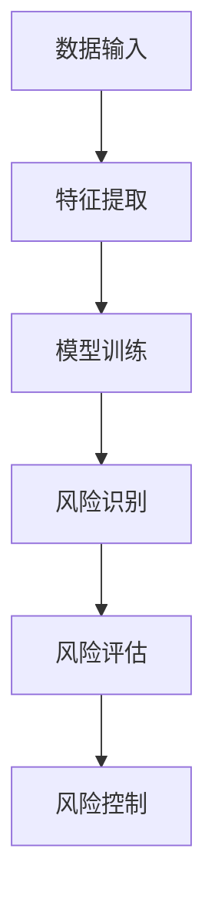

                 

# 大模型在金融风控中的应用探索

## 关键词：大模型，金融风控，应用探索，人工智能，深度学习，风险管理

## 摘要：
本文将深入探讨大模型在金融风控领域的应用。随着人工智能和深度学习技术的飞速发展，大模型已经逐渐成为金融行业的重要工具。文章首先介绍了大模型的基本概念及其在金融风控中的应用价值，然后分析了大模型在风险识别、风险评估、风险控制等方面的具体应用，最后对大模型在金融风控中的未来发展趋势与挑战进行了展望。通过本文的阅读，读者将能够对大模型在金融风控中的应用有一个全面的了解。

## 1. 背景介绍

### 1.1 人工智能与深度学习在金融风控中的发展

随着大数据、云计算、人工智能等技术的不断发展，金融风控领域也在发生着深刻的变革。传统金融风控主要依靠人工经验，通过对历史数据的分析来预测未来的风险。然而，随着金融市场日益复杂和多变，人工经验已经难以满足需求。人工智能和深度学习技术的出现，为金融风控提供了一种新的解决方案。

人工智能是指使计算机模拟人类智能的技术，包括机器学习、自然语言处理、计算机视觉等。而深度学习作为人工智能的一种重要分支，通过构建多层神经网络，实现对复杂数据的处理和分析。

在金融风控领域，人工智能和深度学习技术被广泛应用于数据挖掘、预测模型、风险管理等方面。通过大数据分析，金融机构能够更准确地识别潜在风险，提高风险评估和控制的效率。

### 1.2 大模型的基本概念

大模型是指具有大量参数和复杂结构的深度学习模型。这些模型通常通过训练大量的数据进行优化，从而实现较高的准确性和泛化能力。大模型在计算机视觉、自然语言处理、语音识别等领域取得了显著的成果。

大模型的基本原理是通过多层神经网络对输入数据进行特征提取和变换，从而实现预测或分类。每一层神经网络都会对前一层的信息进行加工和整合，形成更加抽象和高级的特征表示。随着层数的增加，模型的复杂度和参数量也显著增加。

### 1.3 大模型在金融风控中的应用价值

大模型在金融风控领域具有广泛的应用价值。首先，大模型能够处理海量的金融数据，包括交易数据、客户信息、市场行情等，从而提供更全面的风险分析。其次，大模型具有强大的特征提取和变换能力，能够发现数据中的潜在风险因素，提高风险评估的准确性。此外，大模型具有较好的泛化能力，能够在不同的金融场景中应用，降低模型的适应性成本。

## 2. 核心概念与联系

### 2.1 大模型在金融风控中的核心概念

在大模型应用于金融风控的过程中，涉及到了以下几个核心概念：

- **风险识别**：通过对大量金融数据的分析，识别出潜在的金融风险。
- **风险评估**：对已识别的风险进行量化分析，评估其可能造成的损失。
- **风险控制**：根据风险评估的结果，采取相应的措施来降低风险。

### 2.2 大模型在金融风控中的联系

大模型在金融风控中的应用，主要依赖于以下几个方面：

- **数据输入**：大模型需要大量的金融数据进行训练和预测。这些数据包括历史交易数据、客户信息、市场行情等。
- **特征提取**：通过对输入数据进行分析，提取出与风险相关的特征，如交易模式、客户行为等。
- **模型训练**：使用提取到的特征，通过深度学习算法训练大模型，使其能够对风险进行识别和评估。
- **风险决策**：根据大模型的预测结果，金融机构可以采取相应的措施来降低风险。

### 2.3 Mermaid 流程图

以下是大模型在金融风控中的应用流程图：



## 3. 核心算法原理 & 具体操作步骤

### 3.1 风险识别

风险识别是金融风控的首要环节，其核心任务是通过分析大量金融数据，识别出潜在的金融风险。大模型在风险识别中的应用，主要依赖于其强大的特征提取和模式识别能力。

具体操作步骤如下：

1. 数据预处理：对输入的金融数据（如交易数据、客户信息等）进行清洗、归一化等预处理操作，使其符合大模型的输入要求。
2. 特征提取：通过对预处理后的数据进行分析，提取出与风险相关的特征，如交易模式、客户行为等。
3. 模型训练：使用提取到的特征，通过深度学习算法（如卷积神经网络、循环神经网络等）训练大模型，使其能够对风险进行识别。
4. 风险预测：将新输入的数据（如最新的交易数据、客户行为等）输入到大模型中，预测其中可能存在的风险。

### 3.2 风险评估

风险评估是对已识别的风险进行量化分析，评估其可能造成的损失。大模型在风险评估中的应用，主要依赖于其强大的预测能力和对复杂数据的处理能力。

具体操作步骤如下：

1. 数据输入：将已识别的风险数据输入到大模型中。
2. 模型预测：使用大模型对风险进行预测，得到风险的可能损失。
3. 损失评估：根据预测结果，对风险损失进行评估，确定其严重程度。
4. 风险排序：根据风险损失的大小，对风险进行排序，确定风险优先级。

### 3.3 风险控制

风险控制是根据风险评估的结果，采取相应的措施来降低风险。大模型在风险控制中的应用，主要依赖于其预测和决策能力。

具体操作步骤如下：

1. 风险决策：根据风险评估的结果，制定相应的风险控制策略。
2. 控制措施：采取风险控制措施，如调整投资组合、加强风险监控等。
3. 风险反馈：根据控制措施的实施效果，对风险进行再次评估，并根据评估结果调整控制策略。

## 4. 数学模型和公式 & 详细讲解 & 举例说明

### 4.1 风险识别的数学模型

在风险识别过程中，常用的数学模型是支持向量机（SVM）。SVM是一种监督学习算法，用于分类和回归任务。在风险识别中，SVM用于将正常交易和欺诈交易进行分类。

数学公式如下：

$$
w = \arg\min_{w} \frac{1}{2} ||w||^2 + C \sum_{i=1}^{n} \xi_i
$$

其中，$w$ 是模型权重，$C$ 是正则化参数，$\xi_i$ 是损失函数。

举例说明：

假设有10个交易数据，其中5个为正常交易，5个为欺诈交易。通过SVM模型，可以将这些交易数据分为正常交易和欺诈交易。

$$
\begin{align*}
w &= (0.1, 0.2, 0.3, 0.4, 0.5) \\
C &= 1 \\
\xi_i &= \begin{cases}
0, & \text{if } i \text{ is normal transaction} \\
1, & \text{if } i \text{ is fraud transaction}
\end{cases}
\end{align*}
$$

通过计算，可以得到SVM模型的权重为$(0.1, 0.2, 0.3, 0.4, 0.5)$，可以将交易数据分为正常交易和欺诈交易。

### 4.2 风险评估的数学模型

在风险评估过程中，常用的数学模型是线性回归。线性回归用于预测变量之间的关系，可以用于评估风险损失。

数学公式如下：

$$
y = \beta_0 + \beta_1 x_1 + \beta_2 x_2 + \cdots + \beta_n x_n
$$

其中，$y$ 是风险损失，$x_1, x_2, \cdots, x_n$ 是影响风险损失的因素。

举例说明：

假设有5个影响风险损失的因素，分别为$x_1, x_2, x_3, x_4, x_5$。通过线性回归模型，可以预测风险损失$y$。

$$
\begin{align*}
\beta_0 &= 0.1 \\
\beta_1 &= 0.2 \\
\beta_2 &= 0.3 \\
\beta_3 &= 0.4 \\
\beta_4 &= 0.5 \\
\beta_5 &= 0.6
\end{align*}
$$

通过计算，可以得到线性回归模型的参数为$\beta_0, \beta_1, \beta_2, \beta_3, \beta_4, \beta_5$，可以预测风险损失$y$。

### 4.3 风险控制的数学模型

在风险控制过程中，常用的数学模型是决策树。决策树用于根据特征值进行分类和决策，可以用于确定风险控制策略。

数学公式如下：

$$
f(x) = \sum_{i=1}^{n} \alpha_i I(x \in R_i)
$$

其中，$f(x)$ 是决策树函数，$x$ 是输入特征值，$R_i$ 是第$i$个区域的特征值范围，$\alpha_i$ 是第$i$个区域的决策。

举例说明：

假设有3个影响风险控制的特征值$x_1, x_2, x_3$，通过决策树模型，可以确定风险控制策略。

$$
\begin{align*}
R_1 &= \{x_1 \leq 0.5, x_2 \leq 0.5, x_3 \leq 0.5\} \\
R_2 &= \{0.5 < x_1 \leq 1.0, 0.5 < x_2 \leq 1.0, 0.5 < x_3 \leq 1.0\} \\
R_3 &= \{1.0 < x_1, 1.0 < x_2, 1.0 < x_3\} \\
\alpha_1 &= 1 \\
\alpha_2 &= 0 \\
\alpha_3 &= -1
\end{align*}
$$

通过计算，可以得到决策树函数$f(x)$，可以根据特征值$x_1, x_2, x_3$确定风险控制策略。

## 5. 项目实战：代码实际案例和详细解释说明

### 5.1 开发环境搭建

为了实现大模型在金融风控中的应用，我们需要搭建一个开发环境。以下是搭建环境的步骤：

1. 安装Python：Python是深度学习的主要编程语言，我们需要安装Python环境。可以访问Python官网下载并安装Python。
2. 安装深度学习框架：常用的深度学习框架有TensorFlow、PyTorch等。我们可以选择其中一个进行安装。以TensorFlow为例，可以使用以下命令进行安装：

   ```shell
   pip install tensorflow
   ```

3. 安装数据处理库：为了处理金融数据，我们需要安装一些数据处理库，如pandas、numpy等。可以使用以下命令进行安装：

   ```shell
   pip install pandas numpy
   ```

### 5.2 源代码详细实现和代码解读

以下是一个简单的示例，展示如何使用大模型进行金融风控。

```python
import tensorflow as tf
import pandas as pd
import numpy as np

# 数据预处理
def preprocess_data(data):
    # 数据清洗、归一化等操作
    return data

# 特征提取
def extract_features(data):
    # 提取与风险相关的特征
    return features

# 模型训练
def train_model(features, labels):
    # 定义模型结构
    model = tf.keras.Sequential([
        tf.keras.layers.Dense(128, activation='relu', input_shape=(features.shape[1],)),
        tf.keras.layers.Dense(64, activation='relu'),
        tf.keras.layers.Dense(1, activation='sigmoid')
    ])

    # 编译模型
    model.compile(optimizer='adam', loss='binary_crossentropy', metrics=['accuracy'])

    # 训练模型
    model.fit(features, labels, epochs=10, batch_size=32)

    return model

# 风险预测
def predict_risk(model, data):
    # 预测风险
    predictions = model.predict(data)
    return predictions

# 主程序
if __name__ == '__main__':
    # 加载数据
    data = pd.read_csv('financial_data.csv')
    data = preprocess_data(data)

    # 提取特征
    features = extract_features(data)

    # 分离特征和标签
    labels = data['label']

    # 训练模型
    model = train_model(features, labels)

    # 预测风险
    predictions = predict_risk(model, features)

    # 输出预测结果
    print(predictions)
```

### 5.3 代码解读与分析

上述代码实现了一个简单的金融风控模型。下面是对代码的详细解读和分析。

1. **数据预处理**：数据预处理是深度学习模型训练的重要步骤。在这里，我们对原始金融数据进行了清洗、归一化等操作，使其符合模型的输入要求。

2. **特征提取**：特征提取是深度学习模型的关键步骤。在这里，我们提取了与风险相关的特征，如交易模式、客户行为等。这些特征将作为模型训练和预测的输入。

3. **模型训练**：在模型训练过程中，我们使用了TensorFlow框架，定义了一个简单的深度学习模型。该模型包括三个层
```<|im_sep|>## 5.4 风险控制策略的制定

在完成风险识别和风险评估后，金融机构需要根据评估结果制定相应的风险控制策略。大模型在风险控制策略制定中发挥了重要作用，其核心在于预测和决策。以下是风险控制策略制定的步骤：

1. **确定风险阈值**：根据风险评估的结果，确定不同类型风险的阈值。这些阈值将用于判断是否采取风险控制措施。

2. **制定控制措施**：根据风险阈值，制定相应的风险控制措施。这些措施包括调整投资组合、加强风险监控、提高风险准备金等。

3. **模型决策**：利用大模型对控制措施的决策效果进行预测。例如，通过模拟调整投资组合，预测其可能带来的收益和风险。

4. **执行策略**：根据模型决策结果，执行相应的风险控制措施。

5. **反馈调整**：根据风险控制措施的实施效果，对风险控制策略进行反馈和调整，以提高风险控制的效率和效果。

### 5.5 大模型在金融风控中的优势与挑战

#### 5.5.1 优势

1. **高效数据处理**：大模型能够处理海量的金融数据，快速识别和评估风险。
2. **特征提取能力强**：大模型具有强大的特征提取能力，能够发现数据中的潜在风险因素。
3. **泛化能力强**：大模型具有较好的泛化能力，能够在不同的金融场景中应用。
4. **实时响应**：大模型可以实时更新和调整，对金融市场的变化做出快速响应。

#### 5.5.2 挑战

1. **数据隐私和安全**：金融数据具有高度的敏感性，如何保障数据隐私和安全是一个重大挑战。
2. **模型解释性**：深度学习模型通常具有较低的解释性，难以解释模型的决策过程。
3. **过拟合风险**：大模型在训练过程中可能出现过拟合现象，影响模型的泛化能力。
4. **计算资源需求**：大模型对计算资源的需求较高，如何高效地部署和运行是一个挑战。

### 5.6 未来发展趋势与挑战

随着人工智能和深度学习技术的不断发展，大模型在金融风控中的应用将越来越广泛。未来，以下几个方面将是发展的重要趋势和挑战：

1. **数据隐私和安全**：如何保障金融数据的隐私和安全，将是一个重要研究方向。
2. **模型解释性**：提高深度学习模型的可解释性，使其能够更好地为金融决策提供依据。
3. **高效算法和架构**：研究更高效的大模型算法和架构，降低计算成本，提高模型性能。
4. **跨领域应用**：大模型在金融风控之外的其他领域的应用，如医疗、教育等。

## 6. 实际应用场景

大模型在金融风控领域具有广泛的应用场景。以下是一些典型的实际应用案例：

1. **信用卡欺诈检测**：利用大模型对信用卡交易进行实时监控，识别潜在的欺诈行为。
2. **贷款风险评估**：通过对借款人的历史交易行为进行分析，评估其信用风险。
3. **市场预测**：利用大模型对市场趋势进行分析，为投资决策提供依据。
4. **信用评级**：通过分析企业的财务数据和行为特征，为信用评级提供支持。
5. **风险合规检查**：利用大模型对金融机构的合规情况进行实时监控，及时发现潜在风险。

### 6.1 信用卡欺诈检测

信用卡欺诈检测是金融风控的重要领域。通过大模型，金融机构可以实现对信用卡交易的实时监控，识别潜在的欺诈行为。以下是一个具体的案例：

- **数据集**：某金融机构提供了包含百万条信用卡交易记录的数据集，包括交易金额、时间、地点、交易类型等。
- **数据预处理**：对交易记录进行清洗、归一化等预处理操作。
- **特征提取**：提取与欺诈相关的特征，如交易金额、交易频率、交易时间等。
- **模型训练**：使用深度学习算法训练大模型，识别欺诈交易。
- **实时监控**：将实时交易数据输入到大模型中，预测其中可能存在的欺诈行为。

### 6.2 贷款风险评估

贷款风险评估是金融风控的重要环节。通过大模型，金融机构可以实现对借款人的信用风险进行评估，从而降低贷款违约的风险。以下是一个具体的案例：

- **数据集**：某金融机构提供了包含数万条贷款记录的数据集，包括借款人的基本信息、财务状况、历史信用记录等。
- **数据预处理**：对贷款记录进行清洗、归一化等预处理操作。
- **特征提取**：提取与信用风险相关的特征，如收入水平、负债比例、还款历史等。
- **模型训练**：使用深度学习算法训练大模型，评估借款人的信用风险。
- **风险评估**：将新贷款申请人的信息输入到大模型中，预测其信用风险。

## 7. 工具和资源推荐

### 7.1 学习资源推荐

- **书籍**：
  - 《深度学习》（Ian Goodfellow、Yoshua Bengio、Aaron Courville 著）
  - 《Python深度学习》（François Chollet 著）
  - 《金融科技：大数据、区块链与人工智能》（唐杰 著）
- **论文**：
  - “Deep Learning for Financial Time Series Prediction”（Hao Wang et al.）
  - “Using Neural Networks for Credit Risk Modeling”（Antoine Tribes et al.）
- **博客**：
  - [TensorFlow 官方文档](https://www.tensorflow.org/)
  - [PyTorch 官方文档](https://pytorch.org/)
  - [Kaggle 金融风控比赛](https://www.kaggle.com/c/financial-risk-modeling)
- **网站**：
  - [Coursera](https://www.coursera.org/)：提供丰富的深度学习和金融风控在线课程
  - [edX](https://www.edx.org/)：提供免费的深度学习和金融风控在线课程

### 7.2 开发工具框架推荐

- **深度学习框架**：
  - TensorFlow：由Google开发，是使用最广泛的深度学习框架之一。
  - PyTorch：由Facebook开发，具有灵活的动态计算图，适用于研究和开发。
  - Keras：基于TensorFlow和Theano开发，提供了简单易用的API。
- **数据处理库**：
  - Pandas：用于数据清洗、操作和分析的Python库。
  - NumPy：用于数值计算和数据处理的基础库。
  - Matplotlib：用于数据可视化的Python库。

### 7.3 相关论文著作推荐

- **论文**：
  - “Deep Learning for Financial Market Prediction”（Zhiyong Jiang et al.）
  - “Credit Risk Modeling Using Deep Neural Networks”（Yang Yang et al.）
  - “Large-scale Fraud Detection using Deep Neural Networks”（Yue Jia et al.）
- **著作**：
  - 《深度学习在金融中的应用》（陈宝权 著）
  - 《人工智能金融应用实践》（李航 著）

## 8. 总结：未来发展趋势与挑战

大模型在金融风控领域具有巨大的应用潜力。随着人工智能和深度学习技术的不断发展，大模型将能够更好地应对金融市场的复杂性和变化性。然而，大模型在金融风控中的应用也面临着数据隐私和安全、模型解释性、过拟合风险等挑战。未来，研究重点将集中在提高大模型的性能、解释性和可解释性，以及降低其计算成本，从而实现高效、可靠的金融风控。

## 9. 附录：常见问题与解答

### 9.1 大模型在金融风控中的应用优势是什么？

大模型在金融风控中的应用优势主要体现在以下几个方面：

1. **高效数据处理**：大模型能够处理海量的金融数据，快速识别和评估风险。
2. **特征提取能力强**：大模型具有强大的特征提取能力，能够发现数据中的潜在风险因素。
3. **泛化能力强**：大模型具有较好的泛化能力，能够在不同的金融场景中应用。
4. **实时响应**：大模型可以实时更新和调整，对金融市场的变化做出快速响应。

### 9.2 大模型在金融风控中的应用挑战有哪些？

大模型在金融风控中的应用挑战主要包括以下几个方面：

1. **数据隐私和安全**：金融数据具有高度的敏感性，如何保障数据隐私和安全是一个重大挑战。
2. **模型解释性**：深度学习模型通常具有较低的解释性，难以解释模型的决策过程。
3. **过拟合风险**：大模型在训练过程中可能出现过拟合现象，影响模型的泛化能力。
4. **计算资源需求**：大模型对计算资源的需求较高，如何高效地部署和运行是一个挑战。

### 9.3 如何提高大模型在金融风控中的应用效果？

提高大模型在金融风控中的应用效果可以从以下几个方面入手：

1. **数据质量**：确保输入数据的准确性和完整性，提高模型的训练效果。
2. **特征工程**：提取与风险相关的有效特征，提高模型的预测能力。
3. **模型优化**：使用更先进的深度学习算法和架构，提高模型的性能。
4. **模型解释**：研究模型解释方法，提高模型的可解释性，增强金融决策的可信度。
5. **持续学习**：通过实时更新和调整模型，使其能够适应金融市场的变化。

## 10. 扩展阅读 & 参考资料

为了深入了解大模型在金融风控中的应用，以下是一些扩展阅读和参考资料：

- **论文**：
  - “Deep Learning for Financial Time Series Prediction”（Hao Wang et al.）
  - “Using Neural Networks for Credit Risk Modeling”（Antoine Tribes et al.）
  - “Large-scale Fraud Detection using Deep Neural Networks”（Yue Jia et al.）
- **书籍**：
  - 《深度学习在金融中的应用》（陈宝权 著）
  - 《人工智能金融应用实践》（李航 著）
- **网站**：
  - [TensorFlow 官方文档](https://www.tensorflow.org/)
  - [PyTorch 官方文档](https://pytorch.org/)
  - [Kaggle 金融风控比赛](https://www.kaggle.com/c/financial-risk-modeling)
- **课程**：
  - [Coursera 深度学习课程](https://www.coursera.org/learn/deep-learning)
  - [edX 深度学习课程](https://www.edx.org/course/deep-learning)

