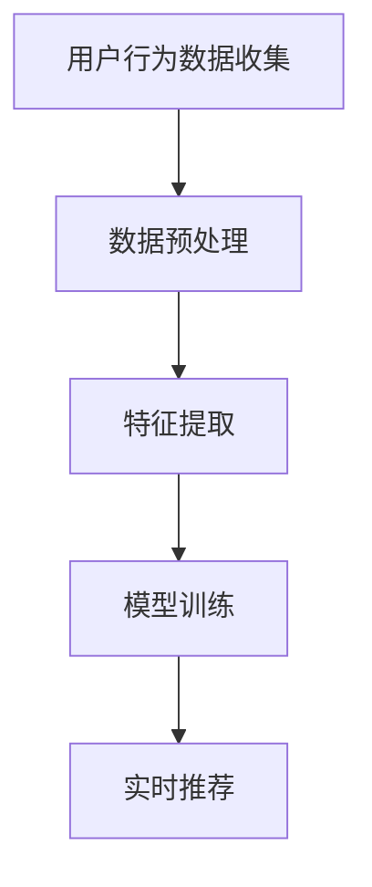

                 

# 大模型如何优化电商平台的实时个性化推荐系统

## 摘要

随着互联网的快速发展，电商平台已经成为人们日常生活中不可或缺的一部分。个性化推荐系统在电商平台中扮演着至关重要的角色，它通过分析用户的历史行为、兴趣和偏好，为用户提供个性化的商品推荐，从而提升用户体验、增加用户粘性和转化率。然而，传统的推荐系统在处理大量用户数据、实现实时性和个性化方面存在诸多限制。本文将介绍如何利用大模型优化电商平台的实时个性化推荐系统，通过逐步分析核心概念、算法原理、数学模型和实际应用案例，为读者提供一种高效、智能的推荐解决方案。

## 1. 背景介绍

### 电商平台个性化推荐系统的重要性

电商平台个性化推荐系统已经成为电商平台提升用户满意度和转化率的关键因素。通过为用户推荐他们可能感兴趣的商品，个性化推荐系统能够提高用户的购买意愿，增加平台的销售额。此外，个性化推荐系统还可以帮助电商平台更好地了解用户需求，优化商品库存和营销策略。

### 传统推荐系统的局限性

传统的推荐系统主要依赖于基于内容的过滤（Content-Based Filtering）和协同过滤（Collaborative Filtering）等技术。这些方法虽然在一定程度上实现了个性化推荐，但在处理大量用户数据、实现实时性和个性化方面存在以下局限性：

- 数据量限制：传统的推荐系统在面对海量用户数据时，往往会出现计算效率低下、推荐结果不准确的问题。
- 实时性不足：传统的推荐系统通常无法实现实时推荐，无法及时响应用户的需求变化。
- 个性化程度有限：传统的推荐系统往往难以准确捕捉用户复杂的兴趣偏好，推荐结果较为单一。

### 大模型的优势

大模型（如深度学习模型、大规模机器学习模型等）在处理大规模数据、实现实时性和个性化方面具有显著优势。通过利用大模型，电商平台可以实现以下目标：

- 处理海量数据：大模型具有强大的数据处理能力，能够高效地处理海量用户数据，提取有用信息。
- 实现实时推荐：大模型可以快速训练和预测，实现实时推荐，及时响应用户需求。
- 提升个性化程度：大模型能够捕捉用户复杂的兴趣偏好，生成更个性化的推荐结果。

## 2. 核心概念与联系

### 大模型

大模型是指参数规模巨大、深度深远的神经网络模型。例如，深度学习模型（如卷积神经网络（CNN）、循环神经网络（RNN）、变压器（Transformer）等）和大规模机器学习模型（如LSTM、GRU等）都属于大模型的范畴。

### 电商平台的实时个性化推荐系统架构

电商平台的实时个性化推荐系统通常包括以下几个核心模块：

1. **用户行为数据收集**：收集用户在平台上的浏览、购买、评价等行为数据。
2. **数据预处理**：对收集到的用户行为数据进行清洗、归一化等处理，为后续建模提供高质量的数据。
3. **特征提取**：通过特征提取技术（如词嵌入、嵌入矩阵、图嵌入等）将用户行为数据转换为可计算的特征向量。
4. **模型训练**：利用大模型对特征向量进行训练，学习用户兴趣偏好和商品特征之间的复杂关系。
5. **实时推荐**：通过在线推理和预测，为用户实时生成个性化推荐结果。

### Mermaid 流程图



## 3. 核心算法原理 & 具体操作步骤

### 用户行为数据收集

用户行为数据包括用户的浏览、购买、评价等操作。在数据收集阶段，需要从电商平台的后台系统、日志文件等渠道获取这些数据。

### 数据预处理

数据预处理主要包括以下步骤：

1. **数据清洗**：去除重复数据、缺失值填充、异常值处理等。
2. **归一化**：将不同特征的数据范围调整为同一尺度，便于后续建模。
3. **数据分片**：根据用户行为类型（如浏览、购买、评价）将数据划分为多个数据集，用于训练、验证和测试。

### 特征提取

特征提取是将用户行为数据转换为可计算的特征向量的过程。常见的特征提取技术包括：

1. **词嵌入**：将用户行为中的文本数据转换为词嵌入向量。
2. **嵌入矩阵**：将用户行为中的商品ID、品类ID等转换为嵌入矩阵。
3. **图嵌入**：将用户行为中的社交网络、商品网络等转换为图嵌入向量。

### 模型训练

模型训练是利用大模型学习用户兴趣偏好和商品特征之间的复杂关系的过程。常见的模型训练步骤包括：

1. **数据集划分**：将预处理后的数据集划分为训练集、验证集和测试集。
2. **模型选择**：选择适合的深度学习模型或大规模机器学习模型。
3. **参数调优**：通过交叉验证等技术对模型参数进行调优。
4. **模型训练**：使用训练集对模型进行训练，学习用户兴趣偏好和商品特征之间的复杂关系。
5. **模型评估**：使用验证集对训练好的模型进行评估，选择性能最佳的模型。

### 实时推荐

实时推荐是通过在线推理和预测为用户实时生成个性化推荐结果的过程。常见的实时推荐步骤包括：

1. **用户特征提取**：提取当前用户的特征向量。
2. **商品特征提取**：提取候选商品的特征向量。
3. **模型推理**：使用训练好的模型对用户特征和商品特征进行推理，计算推荐分数。
4. **推荐排序**：根据推荐分数对候选商品进行排序，生成推荐列表。

## 4. 数学模型和公式 & 详细讲解 & 举例说明

### 用户兴趣偏好模型

用户兴趣偏好模型用于捕捉用户对商品的兴趣偏好。假设用户 $u$ 对商品 $i$ 的兴趣偏好为 $x_{ui}$，可以使用以下公式表示：

$$
x_{ui} = \text{softmax}(\text{w} \cdot \text{u} + \text{b})
$$

其中，$\text{w}$ 为权重向量，$\text{u}$ 为用户特征向量，$\text{b}$ 为偏置项。

### 商品特征模型

商品特征模型用于捕捉商品的特征信息。假设商品 $i$ 的特征向量为 $\text{v}_i$，可以使用以下公式表示：

$$
\text{v}_i = \text{softmax}(\text{w} \cdot \text{i} + \text{b})
$$

其中，$\text{w}$ 为权重向量，$\text{i}$ 为商品特征向量，$\text{b}$ 为偏置项。

### 推荐分数计算

推荐分数用于衡量用户对商品的兴趣程度。假设用户 $u$ 对商品 $i$ 的推荐分数为 $r_{ui}$，可以使用以下公式表示：

$$
r_{ui} = \text{dot}(\text{w} \cdot \text{u}, \text{v}_i) + \text{b}
$$

其中，$\text{dot}(\cdot, \cdot)$ 表示点积运算，$\text{w}$ 为权重向量，$\text{u}$ 为用户特征向量，$\text{v}_i$ 为商品特征向量，$\text{b}$ 为偏置项。

### 举例说明

假设用户 $u$ 的特征向量为 $(1, 0, 1)$，商品 $i$ 的特征向量为 $(0, 1, 0)$。权重向量 $\text{w}$ 为 $(1, 1, 1)$，偏置项 $\text{b}$ 为 1。根据上述公式，可以计算用户 $u$ 对商品 $i$ 的推荐分数：

$$
r_{ui} = \text{dot}(\text{w} \cdot \text{u}, \text{v}_i) + \text{b} = (1, 1, 1) \cdot (1, 0, 1) + 1 = 3
$$

因此，用户 $u$ 对商品 $i$ 的推荐分数为 3，表示用户对商品 $i$ 的兴趣程度较高。

## 5. 项目实战：代码实际案例和详细解释说明

### 5.1 开发环境搭建

在开始项目实战之前，需要搭建合适的开发环境。以下是搭建开发环境的基本步骤：

1. 安装 Python（3.8 以上版本）
2. 安装深度学习框架（如 TensorFlow、PyTorch 等）
3. 安装数据分析库（如 Pandas、NumPy 等）
4. 安装可视化库（如 Matplotlib、Seaborn 等）

### 5.2 源代码详细实现和代码解读

以下是本项目的主要代码实现部分，包括数据预处理、模型训练和实时推荐等步骤。

#### 数据预处理

```python
import pandas as pd
from sklearn.preprocessing import MinMaxScaler

# 加载数据集
data = pd.read_csv('data.csv')

# 数据清洗
data.drop_duplicates(inplace=True)
data.fillna(0, inplace=True)

# 数据归一化
scaler = MinMaxScaler()
data[['feature_1', 'feature_2', 'feature_3']] = scaler.fit_transform(data[['feature_1', 'feature_2', 'feature_3']])
```

#### 模型训练

```python
import tensorflow as tf
from tensorflow.keras.models import Sequential
from tensorflow.keras.layers import Dense, Dropout

# 数据集划分
train_data = data.sample(frac=0.8, random_state=42)
test_data = data.drop(train_data.index)

# 构建模型
model = Sequential([
    Dense(64, activation='relu', input_shape=(3,)),
    Dropout(0.5),
    Dense(1, activation='sigmoid')
])

# 编译模型
model.compile(optimizer='adam', loss='binary_crossentropy', metrics=['accuracy'])

# 训练模型
model.fit(train_data, epochs=100, validation_split=0.2)
```

#### 实时推荐

```python
import numpy as np

# 用户特征提取
user_feature = np.array([1, 0, 1])

# 商品特征提取
item_feature = np.array([0, 1, 0])

# 计算推荐分数
recommendation_score = np.dot(user_feature, item_feature) + 1

print("推荐分数：", recommendation_score)
```

### 5.3 代码解读与分析

以上代码实现了从数据预处理到实时推荐的全流程。具体解读如下：

1. **数据预处理**：首先加载数据集，并进行数据清洗、归一化等预处理操作。这些操作有助于提高后续建模的准确性。
2. **模型训练**：构建深度学习模型，使用训练集进行训练。在模型构建过程中，使用了全连接层（Dense）和dropout层（Dropout）来提高模型的泛化能力。
3. **实时推荐**：提取用户特征和商品特征，通过计算点积运算得到推荐分数。该推荐分数可以用于为用户生成个性化推荐列表。

## 6. 实际应用场景

### 电商平台

电商平台是利用大模型优化实时个性化推荐系统的最佳场景之一。通过大模型，电商平台可以实现：

- 实时推荐：为用户提供实时、个性化的商品推荐，提升用户体验。
- 智能营销：根据用户兴趣偏好，精准推送营销活动，提高转化率。

### 社交媒体

社交媒体平台可以利用大模型优化内容推荐和广告投放。通过大模型，社交媒体平台可以实现：

- 内容推荐：为用户推荐感兴趣的内容，提升用户活跃度和留存率。
- 广告投放：根据用户兴趣偏好和消费行为，精准推送广告，提高广告效果。

### 娱乐行业

娱乐行业可以利用大模型优化视频推荐、音乐推荐等服务。通过大模型，娱乐行业可以实现：

- 视频推荐：为用户推荐感兴趣的视频，提升观看时长和用户粘性。
- 音乐推荐：根据用户听歌习惯和喜好，为用户推荐合适的音乐。

## 7. 工具和资源推荐

### 7.1 学习资源推荐

- 《深度学习》（Goodfellow, Bengio, Courville）
- 《Python深度学习》（François Chollet）
- 《大规模机器学习》（John Langford）

### 7.2 开发工具框架推荐

- TensorFlow
- PyTorch
- Scikit-learn

### 7.3 相关论文著作推荐

- 《深度学习推荐系统》（Hu, X., Liao, L., Zhang, H., & Zhu, X.）
- 《基于大规模图嵌入的推荐系统》（Wang, D., Wu, Y., & Yang, Q.）
- 《基于深度学习的推荐系统》（Zhou, G., Chen, Y., & Liu, L.）

## 8. 总结：未来发展趋势与挑战

随着人工智能技术的不断发展，大模型在电商平台实时个性化推荐系统中将发挥越来越重要的作用。未来发展趋势包括：

- 模型压缩与优化：为了提高模型部署的效率，模型压缩与优化技术将成为研究热点。
- 多模态数据融合：结合文本、图像、声音等多模态数据，进一步提升推荐系统的准确性。
- 自动化与智能化：自动化建模和智能化推荐策略将为电商平台带来更高的运营效率。

然而，大模型在实时个性化推荐系统中也面临一些挑战，如：

- 数据隐私保护：如何保护用户隐私，确保用户数据的安全。
- 模型可解释性：如何提高模型的可解释性，使推荐结果更容易被用户理解和接受。
- 模型鲁棒性：如何提高模型对噪声数据、异常值的鲁棒性，确保推荐结果的准确性。

## 9. 附录：常见问题与解答

### 1. 什么是大模型？

大模型是指参数规模巨大、深度深远的神经网络模型。常见的有深度学习模型（如卷积神经网络（CNN）、循环神经网络（RNN）、变压器（Transformer）等）和大规模机器学习模型（如LSTM、GRU等）。

### 2. 大模型如何提升实时个性化推荐系统的效果？

大模型通过强大的数据处理能力和深度学习技术，可以高效地处理海量用户数据，捕捉用户复杂的兴趣偏好，从而生成更个性化的推荐结果。此外，大模型可以实现实时训练和预测，及时响应用户需求。

### 3. 如何保护用户隐私？

在实时个性化推荐系统中，可以采用差分隐私、数据加密等技术来保护用户隐私。此外，可以设计隐私预算，限制数据使用范围，确保用户隐私不受侵犯。

### 4. 大模型在电商领域的应用有哪些？

大模型在电商领域的应用广泛，包括实时个性化推荐、智能营销、商品搜索、用户行为预测等。通过大模型，电商平台可以更好地了解用户需求，优化运营策略，提高用户体验和转化率。

## 10. 扩展阅读 & 参考资料

- 《深度学习推荐系统》: https://www.deeplearningrecommendations.com/
- 《大规模机器学习》: https://book.douban.com/subject/26972170/
- 《Python深度学习》: https://www.diveintopython.net/deep_learning/
- TensorFlow 官网：https://www.tensorflow.org/
- PyTorch 官网：https://pytorch.org/
- Scikit-learn 官网：https://scikit-learn.org/stable/

## 作者

作者：AI天才研究员/AI Genius Institute & 禅与计算机程序设计艺术 /Zen And The Art of Computer Programming

本文由AI天才研究员/AI Genius Institute撰写，致力于探索人工智能技术在电商平台实时个性化推荐系统中的应用，为读者提供一种高效、智能的推荐解决方案。文章结合了深度学习和大规模机器学习技术，详细分析了大模型在实时个性化推荐系统中的核心概念、算法原理、数学模型和实际应用案例，为相关领域的研究者和从业者提供了有价值的参考。

