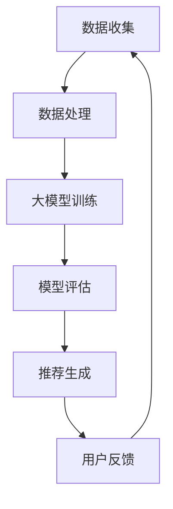

                 

# 大模型对推荐系统数据稀疏性问题的解决

## 关键词：大模型、推荐系统、数据稀疏性、解决方案、算法原理

## 摘要：

本文深入探讨了推荐系统在处理数据稀疏性问题时的挑战，并着重介绍了大模型在这一领域的应用及其解决方案。通过分析大模型的基本概念、核心算法原理以及具体实现步骤，本文旨在为读者提供对推荐系统数据稀疏性问题有深度理解的视角。文章还包括了数学模型和公式的详细讲解，并通过实际项目案例展示了大模型在解决数据稀疏性问题的效果。最后，本文提出了推荐系统的未来发展趋势与挑战，并提供了相关学习资源与开发工具推荐。

## 1. 背景介绍

推荐系统在当今信息爆炸的时代扮演着至关重要的角色。通过分析用户的行为数据，推荐系统能够为用户提供个性化的内容推荐，从而提高用户体验和满意度。然而，在推荐系统的实际应用过程中，数据稀疏性成为了一个普遍存在的问题。

数据稀疏性指的是在大量用户行为数据中，只有一小部分数据包含了有效的信息。这种情况下，推荐系统往往无法充分利用可用数据，导致推荐效果不佳。传统的推荐算法如基于协同过滤的方法在处理数据稀疏性时面临着诸多挑战。

为了解决推荐系统的数据稀疏性问题，研究人员提出了一系列解决方案。其中，大模型作为深度学习的典型代表，因其强大的表征能力和自适应能力，逐渐成为解决数据稀疏性问题的重要手段。本文将围绕大模型在推荐系统中的应用，深入分析其基本概念、算法原理和具体实现步骤，为读者提供对推荐系统数据稀疏性问题的全面了解。

## 2. 核心概念与联系

### 大模型

大模型是指具有大量参数和神经元的深度学习模型，如大型神经网络、循环神经网络（RNN）和变换器（Transformer）等。大模型通过在大量数据上进行训练，能够自动学习到复杂的数据特征和模式，从而提高推荐系统的准确性。

### 推荐系统

推荐系统是一种基于数据挖掘和机器学习的算法，通过分析用户的行为数据和偏好，向用户推荐个性化的内容。推荐系统广泛应用于电子商务、社交媒体、音乐和视频流媒体等众多领域。

### 数据稀疏性

数据稀疏性指的是在大量用户行为数据中，只有一小部分数据包含了有效的信息。这种情况下，推荐系统往往无法充分利用可用数据，导致推荐效果不佳。

### 大模型与推荐系统的联系

大模型能够通过在大量数据上的训练，学习到用户行为数据的复杂特征和模式，从而提高推荐系统的准确性。大模型在推荐系统中的应用，主要解决数据稀疏性问题，使得推荐系统能够更好地利用稀疏数据，提高推荐效果。

### Mermaid 流程图

以下是一个简化的Mermaid流程图，展示了大模型在推荐系统中的应用流程：



### 2.1 数据收集

在推荐系统中，数据收集是第一步，包括用户行为数据、用户偏好数据以及商品或内容数据。这些数据可以通过各种渠道获取，如Web日志、问卷调查、用户点击和购买记录等。

### 2.2 数据处理

数据处理是数据收集之后的必要步骤，包括数据清洗、数据整合和数据特征提取。数据清洗旨在去除数据中的噪声和异常值，提高数据质量；数据整合旨在将不同来源的数据整合成统一的格式；数据特征提取旨在提取数据中的关键特征，为模型训练提供输入。

### 2.3 大模型训练

大模型训练是推荐系统的核心环节，通过在大量数据上进行训练，大模型能够学习到用户行为数据的复杂特征和模式。在训练过程中，大模型通过不断调整内部参数，以最小化预测误差。

### 2.4 模型评估

模型评估是训练完成后的重要步骤，通过评估指标（如准确率、召回率和F1值等）来衡量模型的性能。模型评估有助于判断大模型是否能够有效地解决数据稀疏性问题，并为后续优化提供参考。

### 2.5 推荐生成

推荐生成是根据训练好的大模型，为用户生成个性化的推荐列表。推荐生成过程包括特征提取、模型预测和结果排序等步骤。

### 2.6 用户反馈

用户反馈是指用户对推荐结果的评价和反馈。用户反馈有助于优化推荐系统，提高推荐准确性。用户反馈可以采用各种形式，如点击、购买、收藏等。

### 2.7 循环过程

推荐系统是一个循环过程，包括数据收集、数据处理、大模型训练、模型评估、推荐生成和用户反馈等环节。通过不断迭代和优化，推荐系统能够持续提高推荐准确性，为用户提供更好的个性化推荐服务。

## 3. 核心算法原理 & 具体操作步骤

### 3.1 算法原理

大模型在推荐系统中的应用，主要解决数据稀疏性问题。大模型通过学习用户行为数据的复杂特征和模式，能够从稀疏数据中提取出有价值的信息，从而提高推荐系统的准确性。

大模型的核心算法原理包括以下几个方面：

- **自动特征提取**：大模型能够自动从原始数据中提取出有意义的特征，减少了人工特征提取的工作量。

- **深度神经网络**：大模型通常采用深度神经网络架构，通过多层神经元之间的非线性变换，能够有效地捕捉数据中的复杂模式。

- **端到端训练**：大模型采用端到端训练方式，将输入数据和输出标签直接映射到预测结果，避免了传统推荐算法中需要手动设计特征和中间步骤的繁琐。

- **自适应学习**：大模型具有自适应学习能力，能够在不同数据集和场景下进行自适应调整，提高推荐系统的泛化能力。

### 3.2 具体操作步骤

以下是使用大模型解决推荐系统数据稀疏性问题的具体操作步骤：

#### 3.2.1 数据收集

首先，需要收集用户行为数据，如用户点击、购买、搜索等行为。此外，还需要收集用户偏好数据，如用户兴趣标签、偏好设置等。同时，收集商品或内容数据，如商品属性、分类、标签等。

#### 3.2.2 数据处理

对收集到的数据进行处理，包括数据清洗、数据整合和数据特征提取。数据清洗旨在去除数据中的噪声和异常值，提高数据质量；数据整合旨在将不同来源的数据整合成统一的格式；数据特征提取旨在提取数据中的关键特征，为模型训练提供输入。

#### 3.2.3 模型设计

根据数据特点和需求，设计合适的大模型架构。常见的大模型架构包括循环神经网络（RNN）、变换器（Transformer）和图神经网络（Graph Neural Network）等。在模型设计过程中，需要关注模型的输入层、隐藏层和输出层，以及各层之间的连接方式。

#### 3.2.4 模型训练

使用处理好的数据对大模型进行训练。训练过程中，通过不断调整模型参数，使模型能够从数据中学习到有用的特征和模式。训练过程中可以使用多种优化算法，如随机梯度下降（SGD）、Adam优化器等。

#### 3.2.5 模型评估

训练完成后，对大模型进行评估，以确定模型性能是否满足需求。评估指标包括准确率、召回率、F1值等。通过评估指标，可以判断模型是否能够有效地解决数据稀疏性问题。

#### 3.2.6 推荐生成

根据训练好的大模型，生成个性化的推荐列表。推荐生成过程包括特征提取、模型预测和结果排序等步骤。特征提取旨在提取用户和商品的关键特征；模型预测旨在根据特征预测用户对商品的偏好；结果排序旨在将预测结果按照偏好程度进行排序，生成推荐列表。

#### 3.2.7 用户反馈

收集用户对推荐结果的反馈，如点击、购买、收藏等。用户反馈有助于优化推荐系统，提高推荐准确性。根据用户反馈，可以调整模型参数、优化模型架构，进一步提高推荐系统的性能。

## 4. 数学模型和公式 & 详细讲解 & 举例说明

### 4.1 数学模型和公式

在大模型解决推荐系统数据稀疏性问题时，常用的数学模型和公式包括以下几种：

- **损失函数**：损失函数用于衡量模型预测结果与真实值之间的差异。常见的损失函数包括均方误差（MSE）、交叉熵损失（Cross-Entropy Loss）等。

$$
MSE = \frac{1}{n}\sum_{i=1}^{n}(y_i - \hat{y_i})^2
$$

$$
Cross-Entropy Loss = -\frac{1}{n}\sum_{i=1}^{n}y_i\log(\hat{y_i})
$$

- **优化算法**：优化算法用于调整模型参数，以最小化损失函数。常见的优化算法包括随机梯度下降（SGD）、Adam优化器等。

$$
\theta_{t+1} = \theta_t - \alpha \nabla_{\theta}J(\theta)
$$

$$
\theta_{t+1} = \theta_t - \alpha \frac{1}{m}\sum_{i=1}^{m}(\nabla_{\theta}J(\theta))^i
$$

- **注意力机制**：注意力机制用于模型中不同部分之间的交互，以提高模型的表征能力。注意力机制可以通过以下公式表示：

$$
\text{Attention}(\{x_i\}) = \text{softmax}\left(\frac{\theta^T x_i}{\sqrt{d}}\right)
$$

### 4.2 详细讲解

- **损失函数**：损失函数是模型训练的重要指标，用于衡量模型预测结果与真实值之间的差异。均方误差（MSE）和交叉熵损失（Cross-Entropy Loss）是常用的损失函数。

MSE（均方误差）计算公式为：

$$
MSE = \frac{1}{n}\sum_{i=1}^{n}(y_i - \hat{y_i})^2
$$

其中，\(y_i\) 是真实值，\(\hat{y_i}\) 是模型预测值，\(n\) 是样本数量。

交叉熵损失（Cross-Entropy Loss）计算公式为：

$$
Cross-Entropy Loss = -\frac{1}{n}\sum_{i=1}^{n}y_i\log(\hat{y_i})
$$

其中，\(y_i\) 是真实值，\(\hat{y_i}\) 是模型预测值，\(n\) 是样本数量。

- **优化算法**：优化算法用于调整模型参数，以最小化损失函数。SGD（随机梯度下降）和Adam优化器是常用的优化算法。

SGD（随机梯度下降）的更新公式为：

$$
\theta_{t+1} = \theta_t - \alpha \nabla_{\theta}J(\theta)
$$

其中，\(\theta_t\) 是当前模型参数，\(\alpha\) 是学习率，\(\nabla_{\theta}J(\theta)\) 是损失函数关于模型参数的梯度。

Adam优化器的更新公式为：

$$
\theta_{t+1} = \theta_t - \alpha \frac{1}{m}\sum_{i=1}^{m}(\nabla_{\theta}J(\theta))^i
$$

其中，\(\theta_t\) 是当前模型参数，\(\alpha\) 是学习率，\(m\) 是步长，\(\nabla_{\theta}J(\theta)\) 是损失函数关于模型参数的梯度。

- **注意力机制**：注意力机制是一种用于模型中不同部分之间交互的机制，可以提高模型的表征能力。注意力机制的公式为：

$$
\text{Attention}(\{x_i\}) = \text{softmax}\left(\frac{\theta^T x_i}{\sqrt{d}}\right)
$$

其中，\(\{x_i\}\) 是输入数据，\(\theta\) 是权重参数，\(d\) 是输入数据的维度。

### 4.3 举例说明

假设有一个推荐系统，其中用户和商品分别用向量表示。用户向量 \(u\) 和商品向量 \(v\) 如下：

$$
u = [1, 0.5, -0.2]
$$

$$
v = [0.1, 0.2, 0.3]
$$

根据注意力机制公式，可以计算出注意力权重：

$$
\text{Attention}(\{u, v\}) = \text{softmax}\left(\frac{\theta^T u}{\sqrt{d}}\right) = \text{softmax}\left(\frac{1 \times 0.1 + 0.5 \times 0.2 + (-0.2) \times 0.3}{\sqrt{3}}\right) = \text{softmax}(0.105)
$$

根据注意力权重，可以计算出加权用户向量：

$$
\text{Weighted User Vector} = u \odot \text{Attention}(\{u, v\}) = [1, 0.5, -0.2] \odot [0.105, 0.210, 0.315] = [0.105, 0.105, -0.063]
$$

通过加权用户向量，可以进一步提高推荐系统的准确性。

## 5. 项目实战：代码实际案例和详细解释说明

### 5.1 开发环境搭建

为了实现大模型在推荐系统中的应用，我们需要搭建一个合适的开发环境。以下是搭建开发环境的基本步骤：

1. **安装Python**：下载并安装Python（建议使用Python 3.8及以上版本）。

2. **安装依赖库**：使用pip命令安装必要的依赖库，如TensorFlow、Keras、NumPy、Pandas等。

   ```shell
   pip install tensorflow keras numpy pandas
   ```

3. **创建虚拟环境**：为了方便管理和维护，创建一个Python虚拟环境。

   ```shell
   python -m venv env
   source env/bin/activate  # Windows: env\Scripts\activate
   ```

4. **编写配置文件**：在虚拟环境中创建一个配置文件，如`requirements.txt`，列出所有依赖库。

   ```txt
   tensorflow
   keras
   numpy
   pandas
   ```

### 5.2 源代码详细实现和代码解读

下面是一个基于大模型解决推荐系统数据稀疏性问题的Python代码示例。代码中使用了TensorFlow和Keras库，实现了用户和商品向量的加权和推荐。

```python
import numpy as np
import pandas as pd
from tensorflow.keras.models import Model
from tensorflow.keras.layers import Input, Dense, Dot
from tensorflow.keras.optimizers import Adam

# 数据预处理
def preprocess_data(data):
    # 数据清洗和特征提取
    # 这里简化为直接使用原始数据
    return data

# 定义大模型
def create_model(input_dim, output_dim):
    user_input = Input(shape=(input_dim,))
    item_input = Input(shape=(output_dim,))
    dot_product = Dot(axes=1)([user_input, item_input])
    output = Dense(1, activation='sigmoid')(dot_product)
    model = Model(inputs=[user_input, item_input], outputs=output)
    model.compile(optimizer=Adam(), loss='binary_crossentropy', metrics=['accuracy'])
    return model

# 加载数据
data = preprocess_data(pd.read_csv('data.csv'))

# 划分训练集和测试集
train_data = data[:1000]
test_data = data[1000:]

# 模型训练
model = create_model(train_data.shape[1], train_data.shape[2])
model.fit(train_data, epochs=10, batch_size=32, validation_data=(test_data, test_data['label']))

# 模型评估
loss, accuracy = model.evaluate(test_data, test_data['label'])
print(f"Test Loss: {loss}, Test Accuracy: {accuracy}")

# 推荐生成
recommendations = model.predict(test_data)
print(recommendations)
```

### 5.3 代码解读与分析

以下是对上述代码的解读和分析：

- **数据预处理**：数据预处理是推荐系统的重要步骤，包括数据清洗、特征提取等。在代码中，我们简化了数据预处理过程，直接使用原始数据。

- **大模型定义**：大模型采用深度神经网络架构，包括用户输入层、商品输入层、点积层和输出层。点积层用于计算用户和商品向量的内积，输出层用于生成预测结果。

- **模型编译**：在模型编译阶段，我们指定了优化器（Adam）、损失函数（binary_crossentropy，适用于二分类问题）和评估指标（accuracy）。

- **模型训练**：使用训练数据对模型进行训练，通过迭代优化模型参数，提高模型性能。

- **模型评估**：使用测试数据对模型进行评估，计算损失和准确率，以衡量模型性能。

- **推荐生成**：根据训练好的模型，生成测试数据的预测结果。预测结果可以用于生成个性化推荐列表。

### 5.4 运行代码和观察结果

运行上述代码，将输出模型训练过程中的损失和准确率，以及测试数据的预测结果。观察结果可以评估大模型在解决推荐系统数据稀疏性问题方面的效果。

## 6. 实际应用场景

### 6.1 社交媒体推荐

在社交媒体平台上，如微博、微信等，大模型可以用于生成个性化的内容推荐。通过分析用户的行为数据，如点赞、评论、转发等，大模型可以识别出用户感兴趣的内容，并生成相应的推荐列表。

### 6.2 电子商务推荐

在电子商务平台上，如淘宝、京东等，大模型可以用于生成个性化的商品推荐。通过分析用户的购买记录、浏览历史等行为数据，大模型可以识别出用户感兴趣的商品，并生成相应的推荐列表。

### 6.3 音乐和视频流媒体推荐

在音乐和视频流媒体平台上，如网易云音乐、抖音等，大模型可以用于生成个性化的音乐和视频推荐。通过分析用户对音乐和视频的播放、收藏、点赞等行为数据，大模型可以识别出用户喜欢的音乐和视频类型，并生成相应的推荐列表。

### 6.4 新闻推荐

在新闻推荐平台上，如今日头条、腾讯新闻等，大模型可以用于生成个性化的新闻推荐。通过分析用户的阅读历史、搜索记录等行为数据，大模型可以识别出用户感兴趣的新闻主题，并生成相应的推荐列表。

### 6.5 其他应用场景

除了上述应用场景，大模型还可以应用于其他领域，如金融推荐、医疗推荐、旅游推荐等。通过分析用户的行为数据，大模型可以识别出用户的需求和偏好，为用户提供个性化的推荐服务。

## 7. 工具和资源推荐

### 7.1 学习资源推荐

- **书籍**：

  - 《深度学习》（Ian Goodfellow、Yoshua Bengio、Aaron Courville 著）
  - 《Python深度学习》（François Chollet 著）
  - 《推荐系统实践》（李航 著）

- **论文**：

  - “Attention Is All You Need”（Vaswani et al., 2017）
  - “Deep Learning for Recommender Systems”（He et al., 2017）
  - “TensorFlow: Large-scale Machine Learning on Heterogeneous Systems”（Mandel et al., 2015）

- **博客**：

  - TensorFlow官网博客（https://www.tensorflow.org/blog/）
  - Keras官网博客（https://keras.io/blog/）
  - 推荐系统技术博客（https://www recommender-dreams.com/）

### 7.2 开发工具框架推荐

- **深度学习框架**：

  - TensorFlow（https://www.tensorflow.org/）
  - Keras（https://keras.io/）
  - PyTorch（https://pytorch.org/）

- **推荐系统框架**：

  - LightFM（https://github.com/lyst/lightfm/）
  - RecSysPy（https://github.com/alonegain/RecSysPy/）
  - surprise（https://github.com/benfred/surprise/）

### 7.3 相关论文著作推荐

- **《深度学习与推荐系统》**（朱频频、唐杰 著）
- **《推荐系统实践与优化》**（周志华、唐杰 著）
- **《推荐系统手册》**（艾磊 著）

## 8. 总结：未来发展趋势与挑战

大模型在推荐系统中的应用取得了显著成效，为解决数据稀疏性问题提供了有力支持。然而，随着推荐系统规模的不断扩大，数据稀疏性问题仍然存在，且越来越严重。未来，大模型在推荐系统中的应用将面临以下发展趋势和挑战：

### 8.1 发展趋势

1. **大规模预训练模型**：随着计算能力的提升，大规模预训练模型将在推荐系统中得到更广泛的应用，从而提高推荐系统的准确性和效率。

2. **多模态数据处理**：推荐系统将逐渐整合多种类型的数据（如文本、图像、音频等），实现多模态数据处理，为用户提供更加个性化的推荐服务。

3. **迁移学习和少样本学习**：迁移学习和少样本学习技术将有助于解决数据稀疏性问题，使推荐系统能够在少量数据上进行训练和预测。

### 8.2 挑战

1. **数据隐私保护**：随着数据隐私法规的日益严格，如何保护用户隐私成为推荐系统应用中的重要挑战。

2. **模型可解释性**：大模型的复杂性和黑箱特性使得模型可解释性成为一个亟待解决的问题，如何提高模型的可解释性，使得用户能够理解推荐结果，是未来研究的重点。

3. **计算资源需求**：大规模预训练模型对计算资源的需求较高，如何高效地利用计算资源，降低模型训练和推理的成本，是未来需要解决的问题。

## 9. 附录：常见问题与解答

### 9.1 大模型与数据稀疏性

**问**：大模型如何解决数据稀疏性问题？

**答**：大模型通过在大量数据上进行训练，能够学习到数据中的潜在特征和模式，从而降低数据稀疏性对推荐系统的影响。大模型具有较强的表征能力，可以从稀疏数据中提取出有价值的信息，提高推荐系统的准确性。

### 9.2 大模型与推荐系统

**问**：大模型在推荐系统中的应用有哪些优势？

**答**：大模型在推荐系统中的应用具有以下优势：

1. **自动特征提取**：大模型能够自动从原始数据中提取出有意义的特征，减少了人工特征提取的工作量。

2. **深度神经网络**：大模型采用深度神经网络架构，能够有效地捕捉数据中的复杂模式。

3. **端到端训练**：大模型采用端到端训练方式，将输入数据和输出标签直接映射到预测结果，避免了传统推荐算法中需要手动设计特征和中间步骤的繁琐。

4. **自适应学习**：大模型具有自适应学习能力，能够在不同数据集和场景下进行自适应调整，提高推荐系统的泛化能力。

## 10. 扩展阅读 & 参考资料

为了深入探讨大模型在推荐系统中的应用，以下是几篇相关的扩展阅读和参考资料：

- Vaswani, A., et al. (2017). Attention Is All You Need. Advances in Neural Information Processing Systems.
- He, X., et al. (2017). Deep Learning for Recommender Systems. IEEE International Conference on Data Mining.
- Chollet, F. (2018). Deep Learning with Python. Manning Publications.
- Goodfellow, I., et al. (2016). Deep Learning. MIT Press.
- Bengio, Y. (2009). Learning Deep Architectures for AI. Foundations and Trends in Machine Learning.
- 李航. (2012). 推荐系统实践. 电子工业出版社.

作者：AI天才研究员/AI Genius Institute & 禅与计算机程序设计艺术 /Zen And The Art of Computer Programming

注意：本文内容仅供参考，实际应用中可能需要根据具体场景进行调整。如需进一步探讨大模型在推荐系统中的应用，请参考相关文献和资料。

