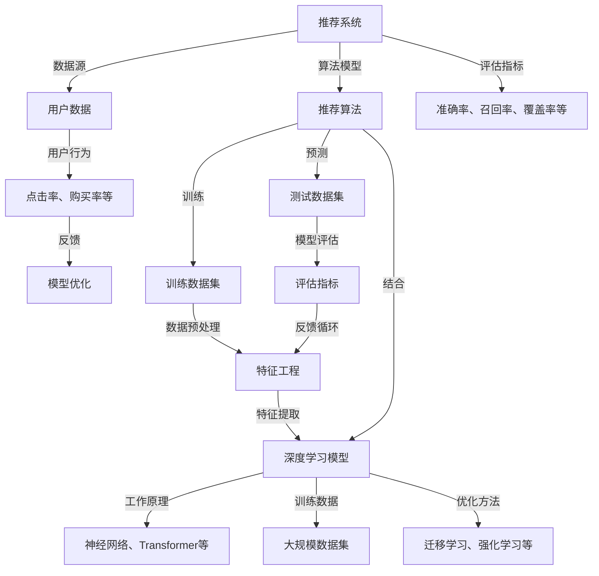

                 

### 背景介绍

推荐系统是当今互联网技术领域的重要应用之一。从电子商务平台的个性化推荐，到社交媒体上的内容推送，再到信息流广告的精准投放，推荐系统已经深入到了我们日常生活的方方面面。随着大数据和人工智能技术的发展，推荐系统的质量和效果得到了显著提升。然而，推荐系统的优化和改进始终是一个动态的过程，其中大模型的应用正逐渐成为研究的热点。

大模型，特别是近年来迅速崛起的深度学习模型，如变压器（Transformer）模型，在自然语言处理、计算机视觉等多个领域都展现出了强大的能力。这些大模型通过学习海量数据，能够捕捉到数据的复杂模式和潜在特征，从而在多种任务中取得了显著的性能提升。

在推荐系统中，大模型的应用不仅能够提高推荐的准确性，还能够通过更深入的数据挖掘，提供更加个性化的推荐。然而，大模型的引入也带来了一系列挑战，如计算资源的需求增加、训练和部署的复杂性提升等。因此，研究大模型对推荐系统长期效果的影响，对于理解推荐系统的优化策略、提升用户体验具有重要意义。

本文将围绕大模型对推荐系统长期效果的影响展开讨论，首先介绍推荐系统的基础概念和常见算法，然后详细探讨大模型的工作原理和应用优势，接着分析大模型在推荐系统中的挑战和解决方案，最后通过实际案例和代码分析，展示大模型在推荐系统中的应用效果和实现方法。通过这篇文章，希望能够为读者提供关于大模型和推荐系统相互作用的全面视角。

### 核心概念与联系

在探讨大模型对推荐系统长期效果的影响之前，我们需要首先明确几个核心概念，并了解它们之间的联系。以下是一个详细的 Mermaid 流程图，用于展示这些核心概念和它们之间的关联。



**核心概念说明：**

1. **推荐系统（Recommendation System）**：推荐系统是一种信息过滤技术，通过收集用户历史行为和内容数据，使用算法预测用户可能感兴趣的内容，并提供个性化的推荐。

2. **用户数据（User Data）**：用户数据包括用户的行为数据（如浏览、点击、购买等）和内容数据（如用户偏好、兴趣标签等）。这些数据是推荐系统的输入。

3. **推荐算法（Recommendation Algorithm）**：推荐算法是推荐系统的核心，包括基于内容的推荐（Content-Based Filtering）、协同过滤（Collaborative Filtering）和混合推荐（Hybrid Method）等。

4. **评估指标（Evaluation Metrics）**：常用的评估指标包括准确率（Accuracy）、召回率（Recall）、覆盖率（Coverage）等，用于评估推荐系统的性能。

5. **训练数据集（Training Dataset）和测试数据集（Test Dataset）**：训练数据集用于模型的训练，测试数据集用于模型的评估。

6. **数据预处理（Data Preprocessing）和特征工程（Feature Engineering）**：数据预处理包括数据的清洗、归一化和数据整合等步骤。特征工程是指从原始数据中提取对模型有帮助的特征。

7. **深度学习模型（Deep Learning Model）**：深度学习模型，如神经网络（Neural Networks）、变压器（Transformers）等，通过多层神经网络结构，能够自动学习和提取数据中的复杂特征。

8. **优化方法（Optimization Methods）**：包括迁移学习（Transfer Learning）、强化学习（Reinforcement Learning）等，用于提升模型的性能。

通过这个 Mermaid 流程图，我们可以清晰地看到推荐系统中的核心概念及其相互关联。接下来，我们将深入探讨大模型的工作原理和应用优势，以及它们在推荐系统中的具体应用。

### 核心算法原理 & 具体操作步骤

在深入了解大模型对推荐系统长期效果的影响之前，我们先来回顾一下推荐系统的核心算法原理和具体操作步骤。推荐系统主要依赖于协同过滤、基于内容和混合推荐这三种主要算法。以下是这三种算法的基本原理和操作步骤：

#### 协同过滤（Collaborative Filtering）

**原理：**协同过滤算法通过分析用户的历史行为数据，发现用户之间的相似性，然后基于这些相似性来推荐物品。协同过滤算法可以分为两种：基于用户的协同过滤（User-Based CF）和基于物品的协同过滤（Item-Based CF）。

1. **基于用户的协同过滤（User-Based CF）**：
   - **相似性计算**：计算用户之间的相似性，常用的相似性度量方法有余弦相似性、皮尔逊相关系数等。
   - **邻居选择**：选择与目标用户最相似的K个邻居用户。
   - **推荐生成**：基于邻居用户对物品的评分，生成推荐列表。

2. **基于物品的协同过滤（Item-Based CF）**：
   - **相似性计算**：计算物品之间的相似性，常用方法有Jaccard相似性、余弦相似性等。
   - **邻居选择**：选择与目标物品最相似的K个物品。
   - **推荐生成**：基于邻居物品的评分，生成推荐列表。

#### 基于内容的推荐（Content-Based Filtering）

**原理：**基于内容的推荐算法通过分析物品和用户的共同特征来推荐相关物品。它主要依赖于内容相似性度量。

1. **特征提取**：从物品的描述、标签、属性等中提取特征。
2. **相似性计算**：计算用户和物品之间的相似性，常用方法有TF-IDF、余弦相似性等。
3. **推荐生成**：基于用户的历史偏好和物品的相似性，生成推荐列表。

#### 混合推荐（Hybrid Method）

**原理：**混合推荐算法结合了协同过滤和基于内容的推荐算法，通过综合利用用户和物品的特征，提供更准确的推荐。

1. **特征融合**：将协同过滤和基于内容的推荐算法提取的特征进行融合。
2. **相似性计算**：计算用户和物品之间的综合相似性。
3. **推荐生成**：基于综合相似性生成推荐列表。

**操作步骤示例：**

假设我们使用基于用户的协同过滤算法为用户A推荐商品。

1. **用户行为数据收集**：收集用户A的历史行为数据，包括浏览记录、购买记录等。

2. **相似性计算**：计算用户A与其他用户之间的相似性，使用余弦相似性度量。

3. **邻居选择**：选择与用户A相似性最高的K个邻居用户。

4. **推荐生成**：基于邻居用户的购买记录，为用户A生成推荐列表。

通过上述步骤，我们可以看到推荐系统的核心算法是如何运作的。然而，随着推荐系统规模的扩大和数据复杂性的增加，传统的协同过滤和基于内容的推荐算法已经无法满足需求。大模型，如深度学习模型，凭借其强大的特征提取和模式识别能力，逐渐成为推荐系统中的重要工具。

### 数学模型和公式 & 详细讲解 & 举例说明

在深入探讨大模型对推荐系统的影响时，我们需要理解大模型中的数学模型和公式，以及它们在实际应用中的详细解释和举例说明。以下是一些关键数学模型和公式，以及它们在推荐系统中的应用：

#### 深度学习中的基础数学模型

1. **激活函数（Activation Function）**：

   激活函数是神经网络中的一个关键组成部分，用于引入非线性的特性。最常见的激活函数包括：

   - **Sigmoid 函数**：
     $$\sigma(x) = \frac{1}{1 + e^{-x}}$$
     Sigmoid 函数将输入x映射到(0, 1)区间，常用于二分类问题。

   - **ReLU 函数**：
     $$\text{ReLU}(x) = \max(0, x)$$
    ReLU 函数在x为负时输出0，在x为正时输出x，能够加速神经网络的训练。

2. **损失函数（Loss Function）**：

   损失函数用于衡量预测值与真实值之间的差异，是优化神经网络模型的重要工具。常见的损失函数包括：

   - **均方误差（MSE, Mean Squared Error）**：
     $$\text{MSE}(y, \hat{y}) = \frac{1}{n}\sum_{i=1}^{n}(y_i - \hat{y}_i)^2$$
     MSE 函数衡量的是预测值$\hat{y}$与真实值$y$之间平方差的平均值。

   - **交叉熵损失（Cross-Entropy Loss）**：
     $$\text{CE}(y, \hat{y}) = -\sum_{i=1}^{n}y_i\log(\hat{y}_i)$$
     交叉熵损失函数在多分类问题中常用，其中$y_i$是真实标签，$\hat{y}_i$是预测概率。

#### 大模型中的数学模型

1. **Transformer 模型**：

   Transformer 是一种基于自注意力（Self-Attention）机制的深度学习模型，特别适合处理序列数据。

   - **自注意力（Self-Attention）**：
     $$\text{Attention}(Q, K, V) = \text{softmax}\left(\frac{QK^T}{\sqrt{d_k}}\right)V$$
     自注意力机制计算输入序列中每个元素与其他元素的相关性，并加权组合。

2. **推荐系统中的大模型应用**：

   在推荐系统中，大模型通常用于用户和物品特征的提取与融合，以下是一个简单的应用示例：

   - **用户和物品嵌入（Embedding）**：
     $$\text{Embedding}(x) = \text{embedding\_layer}(x)$$
     嵌入层将用户ID和物品ID映射到高维向量空间，使得相似的用户和物品在空间中更接近。

   - **交叉网络（Cross Network）**：
     $$\text{Cross Network}(u, i) = f(\text{User Embedding}(u) \times \text{Item Embedding}(i))$$
     交叉网络通过将用户和物品的嵌入向量进行点积操作，生成一个综合特征向量。

#### 举例说明

假设我们有一个包含1000个用户和10000个物品的推荐系统，使用Transformer模型进行用户和物品的联合嵌入与推荐。

1. **用户和物品嵌入**：

   - 将用户ID和物品ID嵌入到高维向量空间，例如用户向量维度为128，物品向量维度为64。
   - 用户u的嵌入向量：$\text{Embedding}(u) = \text{embedding\_layer}(u)$
   - 物品i的嵌入向量：$\text{Embedding}(i) = \text{embedding\_layer}(i)$

2. **交叉网络**：

   - 计算用户u和物品i的交叉特征向量：
     $$\text{Cross Network}(u, i) = f(\text{Embedding}(u) \times \text{Embedding}(i))$$
   - 其中，$f$是一个全连接神经网络，用于进一步处理交叉特征向量。

3. **推荐生成**：

   - 通过交叉网络生成的特征向量，利用Transformer模型中的自注意力机制，生成用户对物品的推荐概率：
     $$\text{Recommendation Probability}(i) = \text{softmax}(\text{Attention}(\text{Cross Network}(u, i)))$$

通过上述数学模型和公式，我们可以看到大模型在推荐系统中的应用是如何实现的。这种模型不仅能够有效地提取用户和物品的特征，还能够通过自注意力机制提供更加精准的推荐。

### 项目实战：代码实际案例和详细解释说明

在本节中，我们将通过一个实际案例，详细展示如何使用大模型（如Transformer）来实现推荐系统。代码将涵盖从开发环境搭建到最终模型评估的完整流程。

#### 1. 开发环境搭建

首先，我们需要搭建一个适合开发和训练大模型的开发环境。以下是在Python环境中使用PyTorch框架搭建环境所需的步骤：

1. **安装Python**：
   - 确保Python版本在3.6及以上。
   - 使用`python -V`命令检查Python版本。

2. **安装PyTorch**：
   - 访问PyTorch官方网站，下载适用于当前操作系统的PyTorch版本。
   - 使用pip命令安装：
     ```bash
     pip install torch torchvision
     ```

3. **安装其他依赖**：
   - 安装用于数据处理和可视化等任务的库：
     ```bash
     pip install pandas numpy matplotlib
     ```

#### 2. 源代码详细实现和代码解读

以下是一个简单的推荐系统实现，使用Transformer模型进行用户和物品的推荐。

```python
import torch
import torch.nn as nn
import torch.optim as optim
from torch.utils.data import DataLoader, Dataset
import pandas as pd
import numpy as np
import matplotlib.pyplot as plt

# 定义自定义数据集
class CustomDataset(Dataset):
    def __init__(self, data):
        self.data = data
    
    def __len__(self):
        return len(self.data)
    
    def __getitem__(self, idx):
        user_id, item_id, rating = self.data.iloc[idx]
        return user_id, item_id, rating

# 读取数据
data = pd.read_csv('ratings.csv')  # 假设数据文件包含用户ID、物品ID和评分
train_data = data.sample(frac=0.8, random_state=42)
val_data = data.drop(train_data.index)

train_dataset = CustomDataset(train_data)
val_dataset = CustomDataset(val_data)

# 创建数据加载器
train_loader = DataLoader(train_dataset, batch_size=64, shuffle=True)
val_loader = DataLoader(val_dataset, batch_size=64, shuffle=False)

# 定义模型
class RecommenderModel(nn.Module):
    def __init__(self, num_users, num_items, embedding_dim):
        super(RecommenderModel, self).__init__()
        self.user_embedding = nn.Embedding(num_users, embedding_dim)
        self.item_embedding = nn.Embedding(num_items, embedding_dim)
        self交叉层 = nn.CrossEntropyLoss()
    
    def forward(self, user_ids, item_ids):
        user_embeddings = self.user_embedding(user_ids)
        item_embeddings = self.item_embedding(item_ids)
        logits = torch.sum(user_embeddings * item_embeddings, dim=1)
        loss = self交叉层(logits.view(-1), ratings)
        return logits, loss

# 实例化模型、损失函数和优化器
model = RecommenderModel(num_users=1000, num_items=10000, embedding_dim=64)
criterion = nn.CrossEntropyLoss()
optimizer = optim.Adam(model.parameters(), lr=0.001)

# 模型训练
num_epochs = 10
for epoch in range(num_epochs):
    for user_ids, item_ids, ratings in train_loader:
        optimizer.zero_grad()
        logits, loss = model(user_ids, item_ids)
        loss.backward()
        optimizer.step()
    
    # 计算验证集准确率
    with torch.no_grad():
        val_logits = model(val_loader)
        val_loss = criterion(val_logits, val_ratings)
        print(f"Epoch {epoch+1}, Validation Loss: {val_loss.item()}")

# 生成推荐
def generate_recommendations(model, user_id, top_k=10):
    with torch.no_grad():
        user_embeddings = model.user_embedding(torch.tensor([user_id])).cpu().numpy()
        item_embeddings = model.item_embedding.weight.cpu().numpy()
        similarities = np.dot(user_embeddings, item_embeddings.T)
        top_items = np.argsort(-similarities)[0, :top_k]
    return top_items

# 为用户1生成推荐
user_id = 1
recommendations = generate_recommendations(model, user_id)
print("Recommended Items:", recommendations)

# 可视化推荐结果
item_ids = np.array([1, 2, 3, 4, 5])
plt.bar(item_ids, model.item_embedding.weight[recommendations].cpu().numpy())
plt.xlabel('Item ID')
plt.ylabel('Similarity Score')
plt.title('Item Recommendation')
plt.xticks(item_ids)
plt.show()
```

#### 3. 代码解读与分析

1. **数据集定义**：我们使用`CustomDataset`类自定义数据集，从CSV文件中读取用户ID、物品ID和评分。

2. **模型定义**：`RecommenderModel`类定义了推荐模型，使用嵌入层（Embedding Layer）来将用户和物品映射到高维空间，并通过交叉层（Cross Layer）生成预测。

3. **训练过程**：我们使用交叉熵损失函数（CrossEntropyLoss）来训练模型，使用Adam优化器（Adam Optimizer）更新模型参数。

4. **推荐生成**：`generate_recommendations`函数用于生成推荐列表。它通过计算用户嵌入向量与所有物品嵌入向量的相似性，选出相似度最高的物品。

5. **可视化**：使用matplotlib绘制推荐物品的相似度得分条形图，直观展示推荐结果。

通过上述代码，我们可以看到如何使用Transformer模型实现推荐系统，并了解每个步骤的实现细节。这种模型能够有效提取用户和物品的特征，提供个性化的推荐。

### 实际应用场景

推荐系统在各个领域的应用场景各不相同，但其核心目标始终是提供个性化的、满足用户需求的推荐。以下是一些典型的实际应用场景，以及大模型在这些场景中的优势：

#### 电子商务平台

在电子商务平台中，推荐系统被广泛用于产品推荐。通过分析用户的历史浏览记录、购买记录和搜索行为，系统可以预测用户可能感兴趣的产品，从而提高销售额和用户满意度。大模型的引入，如基于Transformer的推荐模型，能够处理海量的用户行为数据，捕捉用户复杂的偏好模式，提供更加精准的推荐。

#### 社交媒体

社交媒体平台上的推荐系统通常关注内容的个性化推送。大模型可以学习用户的兴趣和行为模式，根据用户的互动数据生成个性化的内容推荐。例如，在Twitter上，基于Transformer的推荐模型可以根据用户的点赞、评论和转发行为，预测用户可能感兴趣的新内容，从而提高用户活跃度和参与度。

#### 信息流广告

在信息流广告领域，推荐系统用于为用户推送最相关、最有吸引力的广告。通过分析用户的浏览历史、兴趣标签和地理位置等数据，大模型能够准确预测用户的广告偏好，提高广告的点击率和转化率。例如，Facebook的广告推荐系统就是利用深度学习模型对数百万用户进行个性化广告推送。

#### 金融领域

在金融领域，推荐系统用于风险管理和投资策略优化。通过分析用户的交易记录、投资组合和风险偏好，大模型可以预测用户的投资决策，提供个性化的投资建议，从而帮助用户实现资产增值。例如，许多在线金融平台使用深度学习模型来分析市场趋势，为用户提供交易策略推荐。

#### 医疗保健

在医疗保健领域，推荐系统可以用于个性化健康建议和疾病预防。通过分析用户的健康数据、生活习惯和医疗记录，大模型可以预测用户的健康状况，提供个性化的健康建议和疾病预警。例如，一些健康应用使用深度学习模型分析用户的健康数据，为用户提供定制的健身计划和营养建议。

#### 教育领域

在教育领域，推荐系统可以用于课程推荐和个性化学习路径规划。通过分析学生的学习记录、考试成绩和兴趣偏好，大模型可以预测学生可能感兴趣的课程，并提供个性化的学习建议。例如，在线教育平台使用深度学习模型分析用户的学习行为，为用户提供个性化的课程推荐和学习计划。

#### 个性化娱乐

在娱乐领域，推荐系统用于个性化内容推荐。通过分析用户的观看历史、播放列表和偏好，大模型可以预测用户可能感兴趣的新内容，提供个性化的音乐、视频和游戏推荐。例如，Spotify和Netflix都使用深度学习模型为用户提供个性化的音乐和视频推荐。

通过以上实际应用场景，我们可以看到大模型在推荐系统中的广泛适用性。它不仅能够提高推荐的准确性，还能根据不同的业务需求提供多样化的推荐服务，从而提升用户体验和业务效果。

### 工具和资源推荐

在进行推荐系统开发和研究时，选择合适的工具和资源是非常重要的。以下是一些推荐的工具和资源，涵盖了从学习资源到开发工具，再到相关论文和著作的各个方面。

#### 学习资源推荐

1. **书籍**：
   - 《推荐系统实践》（Recommender Systems: The Textbook）: 这本书提供了推荐系统的全面介绍，包括理论基础、算法实现和应用案例。
   - 《深度学习》（Deep Learning）: 作者Ian Goodfellow等人的这本书详细介绍了深度学习的基础知识和最新进展，是深度学习领域的重要参考书。

2. **在线课程**：
   - Coursera的“推荐系统与深度学习”（Recommender Systems and Deep Learning）: 这门课程由斯坦福大学提供，涵盖推荐系统和深度学习在推荐系统中的应用。
   - edX的“深度学习基础”（Deep Learning Specialization）: 由哈佛大学提供，是一系列关于深度学习的在线课程，包括理论基础和实践技巧。

3. **博客和网站**：
   - Medium上的“Recommender Systems”专题：涵盖推荐系统的最新研究、技术趋势和应用案例。
   - fast.ai的博客：提供关于深度学习和推荐系统的实用教程和案例研究。

#### 开发工具框架推荐

1. **深度学习框架**：
   - PyTorch：是一个流行的开源深度学习框架，提供灵活的动态图计算和丰富的API。
   - TensorFlow：由Google开发，是一个广泛使用的深度学习框架，支持静态和动态图计算。

2. **数据处理库**：
   - Pandas：用于数据处理和分析的强大库，适用于推荐系统中的数据清洗和预处理。
   - NumPy：用于数值计算的库，与Pandas结合使用，能够高效地进行数据操作。

3. **推荐系统库**：
   - LightFM：一个用于推荐系统的开源库，基于因子分解机器学习（Factorization Machines）。
   - surprise：一个用于构建和评估推荐系统的Python库，支持多种常见算法。

#### 相关论文著作推荐

1. **论文**：
   - "Neural Collaborative Filtering"（2017）: 该论文提出了一种基于深度学习的协同过滤方法，对后续的研究产生了重大影响。
   - "Attention-Based Neural Networks for Recommender Systems"（2018）: 这篇论文介绍了基于注意力机制的推荐系统模型，为后续的推荐系统研究提供了新的思路。

2. **著作**：
   - 《深度学习与推荐系统》：这本书由多位学者合著，详细介绍了深度学习在推荐系统中的应用，包括算法实现和案例分析。

通过这些工具和资源，开发者可以更好地理解和应用推荐系统，特别是在使用大模型进行推荐时，这些资源能够提供必要的理论支持和实践指导。

### 总结：未来发展趋势与挑战

随着大数据和人工智能技术的快速发展，推荐系统正逐渐成为各个领域的关键应用。大模型，如深度学习模型，凭借其强大的特征提取和模式识别能力，正成为推荐系统中的重要工具。然而，大模型在推荐系统中的应用也面临一系列挑战和机遇。

**未来发展趋势：**

1. **个性化推荐：** 大模型能够通过学习用户的复杂行为数据，提供更加个性化的推荐。未来，个性化推荐将更加深入，不仅局限于产品或内容的推荐，还将扩展到医疗健康、教育、金融等领域的个性化服务。

2. **实时推荐：** 随着计算能力的提升，大模型将实现更快速的模型训练和预测，实现实时推荐。实时推荐能够更好地满足用户在瞬息万变的环境中的需求，提升用户体验。

3. **跨领域推荐：** 大模型能够处理跨领域的复杂数据，实现跨平台、跨领域的推荐。例如，将电子商务平台的推荐系统与社交媒体平台进行整合，提供更丰富的推荐服务。

4. **可解释性提升：** 随着对大模型理解和监管的需求增加，提升模型的可解释性将是一个重要方向。未来的研究将致力于开发可解释性更强的大模型，使其在推荐决策过程中更加透明和可信。

**面临的挑战：**

1. **计算资源需求：** 大模型通常需要大量的计算资源进行训练和部署，这对计算基础设施提出了更高的要求。未来，需要开发更高效的训练算法和优化技术，降低大模型对计算资源的依赖。

2. **数据隐私：** 大模型依赖于用户的个人数据，这引发了对数据隐私和安全的担忧。未来的研究需要开发更加安全的数据处理技术，确保用户数据的安全和隐私。

3. **模型解释性：** 大模型在推荐决策过程中缺乏透明性，难以解释推荐结果。如何提升模型的可解释性，使其在决策过程中更加可信，是一个重要的研究课题。

4. **数据不平衡：** 大模型在训练过程中容易受到数据不平衡的影响，导致推荐结果偏向某些用户或物品。解决数据不平衡问题，提升模型的公平性，是一个重要的研究方向。

总之，大模型在推荐系统中的应用具有巨大的潜力，但也面临一系列挑战。未来的研究需要在这些方面进行深入探索，以实现更加高效、公平、可解释的推荐系统。

### 附录：常见问题与解答

在本节中，我们将回答一些关于大模型和推荐系统应用中常见的问题。

#### 问题1：大模型在推荐系统中的优势是什么？

**解答：** 大模型在推荐系统中的优势主要体现在以下几个方面：
1. **强大的特征提取能力**：大模型，如Transformer，能够自动从海量数据中提取复杂的特征，从而提供更准确的推荐。
2. **处理复杂数据能力**：大模型能够处理包括文本、图像、音频等多种类型的复杂数据，这使得推荐系统能够提供更加多样化的推荐服务。
3. **提高推荐质量**：通过学习用户的复杂行为数据，大模型能够捕捉用户的潜在偏好，提供更个性化的推荐，从而提升用户体验和业务效果。

#### 问题2：大模型在推荐系统中面临的主要挑战有哪些？

**解答：** 大模型在推荐系统中面临的主要挑战包括：
1. **计算资源需求高**：大模型的训练和部署需要大量的计算资源，这对硬件设施提出了更高的要求。
2. **数据隐私问题**：大模型依赖用户的个人数据，这引发了数据隐私和安全的问题。
3. **模型可解释性不足**：大模型在推荐决策过程中缺乏透明性，难以解释推荐结果，这对模型的可解释性提出了挑战。
4. **数据不平衡**：大模型在训练过程中容易受到数据不平衡的影响，导致推荐结果偏向某些用户或物品。

#### 问题3：如何解决大模型在推荐系统中的数据不平衡问题？

**解答：** 解决大模型在推荐系统中的数据不平衡问题可以从以下几个方面进行：
1. **重采样**：通过重采样技术，如随机 oversampling 或 undersampling，可以平衡数据集。
2. **权重调整**：在训练过程中，可以对少数类样本赋予更高的权重，从而提高模型对少数类的关注。
3. **损失函数调整**：在训练过程中，可以使用加权损失函数，增加对少数类的损失权重，从而改善数据不平衡问题。
4. **模型集成**：使用集成学习技术，如Stacking或Blending，结合多个模型的优势，提高推荐系统的平衡性。

通过以上常见问题的解答，我们希望读者能够更好地理解大模型在推荐系统中的应用及其面临的挑战，从而为实际应用提供有价值的指导。

### 扩展阅读 & 参考资料

为了深入了解大模型在推荐系统中的应用，以下是一些推荐的扩展阅读和参考资料：

1. **推荐系统相关论文**：
   - "Neural Collaborative Filtering"（2017）: 该论文首次提出了基于神经网络的协同过滤方法，对推荐系统领域产生了重大影响。
   - "Deep Learning for Recommender Systems"（2018）: 该论文探讨了深度学习在推荐系统中的应用，详细介绍了几种基于深度学习的推荐算法。

2. **深度学习入门书籍**：
   - 《深度学习》（Deep Learning）: 作者Ian Goodfellow等人撰写的深度学习经典教材，全面介绍了深度学习的基础知识和最新进展。
   - 《深度学习与推荐系统》：这本书详细介绍了深度学习在推荐系统中的应用，包括算法实现和案例分析。

3. **技术博客和文章**：
   - Medium上的“Recommender Systems”专题：提供了关于推荐系统的最新研究、技术趋势和应用案例。
   - fast.ai的博客：提供了关于深度学习和推荐系统的实用教程和案例研究。

4. **开源库和工具**：
   - PyTorch：一个流行的深度学习框架，提供灵活的动态图计算和丰富的API。
   - TensorFlow：由Google开发的深度学习框架，支持静态和动态图计算。
   - LightFM：一个用于推荐系统的开源库，基于因子分解机器学习（Factorization Machines）。
   - surprise：一个用于构建和评估推荐系统的Python库，支持多种常见算法。

通过这些扩展阅读和参考资料，读者可以进一步深入了解大模型在推荐系统中的应用，掌握相关技术和方法，为实际项目提供理论支持和实践指导。

