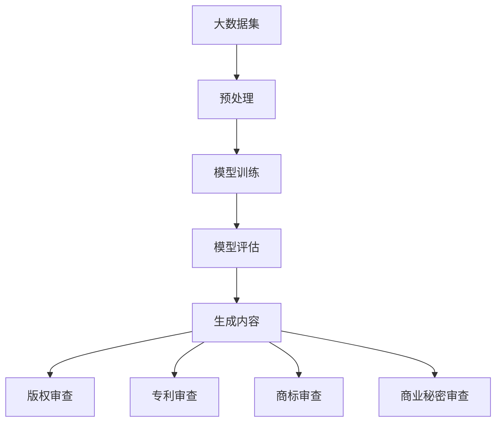

                 

# 大模型对知识产权的影响及应对策略

## 摘要

本文旨在探讨大模型（如大型语言模型、深度学习模型等）在迅速发展过程中对知识产权（IPR）领域产生的深远影响，并提出相应的应对策略。随着人工智能技术的不断突破，大模型的应用场景越来越广泛，不仅提升了产业效率，还带来了前所未有的创新机会。然而，这些模型在数据处理和生成内容时，也引发了版权、专利、隐私等诸多知识产权问题。本文将深入分析大模型涉及的知识产权风险，详细探讨其具体表现，并从法律、技术和管理层面提出应对策略，以期为相关从业者提供有益的参考。

## 1. 背景介绍

### 1.1 大模型的发展历程

大模型，指的是具有海量参数和复杂结构的机器学习模型，尤其是深度学习模型。其发展历程可以追溯到20世纪80年代神经网络研究的兴起。然而，直到近年来，随着计算能力的提升、数据资源的丰富和算法的进步，大模型才得以迅速发展。

1990年代，Rumelhart等人提出的反向传播算法使得神经网络在图像识别等领域取得了突破性进展。然而，由于计算资源和数据量的限制，神经网络模型在很长一段时间内未能实现大规模应用。

进入21世纪，随着计算能力的提升和互联网的发展，大量结构化数据和非结构化数据得以积累。在此基础上，2012年，Hinton等人利用大规模数据集训练出了AlexNet，使得神经网络在图像分类任务中超过了传统机器学习方法。这一突破标志着深度学习进入新的发展阶段。

2018年，GPT-3的发布标志着大型语言模型的崛起。GPT-3拥有超过1750亿个参数，能够生成高质量的自然语言文本。此后，类似的大型语言模型如BERT、T5等相继问世，推动了自然语言处理技术的飞速发展。

### 1.2 大模型的应用领域

大模型的应用领域非常广泛，涵盖了图像识别、自然语言处理、语音识别、推荐系统等多个领域。

在图像识别领域，深度卷积神经网络（CNN）已经被广泛应用于各种计算机视觉任务，如物体检测、人脸识别、图像分割等。这些模型在ImageNet、COCO等数据集上的性能表现远超传统方法。

在自然语言处理领域，大型语言模型如GPT、BERT等展示了惊人的文本生成和语言理解能力。它们在机器翻译、问答系统、文本摘要、情感分析等任务中取得了显著效果。

在语音识别领域，深度神经网络通过端到端训练方法，使得语音识别的准确率大幅提升。同时，语音合成技术也取得了显著进展，如WaveNet、Tacotron等模型能够生成逼真的语音。

在推荐系统领域，大模型通过学习用户历史行为和兴趣，实现了更加精准的推荐效果。例如，电商平台和社交媒体平台广泛使用深度学习模型进行商品和内容的推荐。

### 1.3 大模型的发展趋势

未来，大模型将继续沿着几个方向发展：

1. **模型规模将继续增大**：随着计算能力的提升，未来将有更多的资源投入到大型模型的训练中。模型参数数量和模型结构的复杂性将不断增加。

2. **多模态学习**：未来大模型将不仅仅局限于单一模态的数据处理，而是能够融合多种模态的数据，如文本、图像、语音等，实现更全面的信息理解和生成。

3. **迁移学习和泛化能力**：大模型将具备更强的迁移学习和泛化能力，能够适应更广泛的应用场景和领域。

4. **实时性**：随着算法和硬件的优化，大模型将能够实现更高的实时性，满足实时应用的需求。

5. **自主性和智能性**：未来大模型将具备更高的自主性和智能性，能够进行自我学习和优化，甚至在某些领域实现部分智能决策。

## 2. 核心概念与联系

### 2.1 知识产权（IPR）

知识产权是指人们就其智力劳动成果所依法享有的专有权利，通常是国家赋予创造性成果所有人对其智力成果在一定期限内的独占性使用和处του权利。知识产权包括但不限于版权、专利、商标、商业秘密等。

1. **版权（Copyright）**：版权是指作者对其原创作品享有的权利，包括复制权、发行权、表演权、展示权、翻译权等。

2. **专利（Patent）**：专利是指国家根据专利法授予发明人在一定时间内独占实施其发明创造的权利。专利包括发明专利、实用新型专利和外观设计专利。

3. **商标（Trademark）**：商标是指用于区分商品或服务来源的标志，包括文字、图形、字母、数字、三维标志、颜色组合等。

4. **商业秘密（Trade Secret）**：商业秘密是指不为公众所知悉、具有商业价值、并经权利人采取保密措施的技术信息、经营信息等商业信息。

### 2.2 大模型与知识产权的关系

大模型在数据处理和生成内容时，与知识产权密切相关。以下是几个关键点：

1. **版权问题**：大模型在生成文本、图像等作品时，可能涉及原创作品的版权问题。如果模型生成的作品与已有作品相似，且达到一定的独创性标准，则可能构成侵权。

2. **专利问题**：大模型在训练过程中使用的算法、结构等可能涉及专利问题。如果模型采用了受专利保护的算法或技术，则可能需要获得专利许可。

3. **商标问题**：大模型在生成广告、宣传材料等涉及商标使用时，需要遵守商标法的相关规定，确保不侵犯他人的商标权。

4. **商业秘密问题**：大模型在处理企业数据时，可能涉及商业秘密的保密问题。如果模型泄露了企业的商业秘密，可能导致严重的经济损失和法律风险。

### 2.3 Mermaid 流程图



在该流程图中，大模型从大数据集开始，经过预处理、模型训练、模型评估等步骤，最终生成内容。在这个过程中，需要对生成的内容进行版权、专利、商标和商业秘密的审查，以确保不侵犯他人的知识产权。

## 3. 核心算法原理 & 具体操作步骤

### 3.1 大模型的核心算法

大模型的核心算法主要包括深度学习、神经网络和生成模型等。以下是这些算法的基本原理：

1. **深度学习（Deep Learning）**：深度学习是一种基于多层神经网络的学习方法，通过构建深层网络结构来提取数据中的特征。其基本原理是模拟人脑的神经元连接结构，通过反向传播算法进行参数优化。

2. **神经网络（Neural Network）**：神经网络是由大量神经元组成的计算模型，每个神经元都与其他神经元相连，并传递信号。神经网络通过学习输入数据和标签之间的关系，实现对未知数据的预测。

3. **生成模型（Generative Model）**：生成模型是一种能够生成新数据的方法，其基本原理是学习数据分布，并生成符合该分布的新数据。常见的生成模型包括变分自编码器（VAE）、生成对抗网络（GAN）等。

### 3.2 大模型的操作步骤

大模型的操作步骤主要包括数据预处理、模型训练、模型评估和生成内容等。以下是每个步骤的具体操作：

1. **数据预处理**：数据预处理是模型训练的基础。主要包括数据清洗、数据转换和数据增强等。数据清洗旨在去除无效数据、填补缺失值等；数据转换是将原始数据转换为适合模型训练的格式；数据增强则是通过技术手段增加数据的多样性，提高模型的泛化能力。

2. **模型训练**：模型训练是利用预处理后的数据进行参数优化。深度学习模型通过反向传播算法，不断调整模型参数，使得模型在训练数据上的误差最小。训练过程中，需要选择合适的训练策略、优化器和损失函数等。

3. **模型评估**：模型评估是对训练好的模型进行性能测试和优化。常用的评估指标包括准确率、召回率、F1分数等。通过评估，可以确定模型在训练数据上的表现，并找出优化方向。

4. **生成内容**：生成内容是利用训练好的模型生成新的数据。在大模型的应用场景中，生成内容可以是文本、图像、音频等。生成过程需要根据具体的任务需求和模型特点进行设计和实现。

### 3.3 实例分析

以下是一个基于GPT-3的文本生成实例：

1. **数据预处理**：首先，需要准备一个包含大量文本数据的语料库，并进行清洗和预处理，得到适合模型训练的数据格式。

2. **模型训练**：使用GPT-3模型对预处理后的数据进行训练，调整模型参数，使得模型在训练数据上的表现达到预期。

3. **模型评估**：在训练数据上评估模型的性能，调整训练策略和参数，优化模型。

4. **生成内容**：利用训练好的GPT-3模型生成新的文本内容。输入一个指定主题的文本片段，模型将根据训练数据生成一段相关的新文本。

## 4. 数学模型和公式 & 详细讲解 & 举例说明

### 4.1 深度学习模型的基本公式

深度学习模型的核心是多层神经网络，其基本公式如下：

$$
Z^{(l)} = W^{(l)} \cdot A^{(l-1)} + b^{(l)}
$$

$$
A^{(l)} = \sigma(Z^{(l)})
$$

其中：

- \(Z^{(l)}\) 表示第 \(l\) 层的输入；
- \(A^{(l)}\) 表示第 \(l\) 层的激活值；
- \(W^{(l)}\) 表示第 \(l\) 层的权重矩阵；
- \(b^{(l)}\) 表示第 \(l\) 层的偏置向量；
- \(\sigma\) 表示激活函数，常见的激活函数包括 sigmoid、ReLU、Tanh 等。

### 4.2 反向传播算法

反向传播算法是深度学习模型训练的核心，其基本思想是通过计算输出层的误差，反向传播到每一层，更新模型的参数。其具体步骤如下：

1. **计算输出误差**：

$$
E = \frac{1}{2} \sum_{i} (y_i - \hat{y}_i)^2
$$

其中：

- \(y_i\) 表示真实标签；
- \(\hat{y}_i\) 表示预测标签。

2. **计算各层的误差**：

$$
\delta^{(l)} = \frac{\partial E}{\partial Z^{(l)}}
$$

3. **更新参数**：

$$
W^{(l)} = W^{(l)} - \alpha \cdot \frac{\partial E}{\partial W^{(l)}}
$$

$$
b^{(l)} = b^{(l)} - \alpha \cdot \frac{\partial E}{\partial b^{(l)}}
$$

其中：

- \(\alpha\) 表示学习率；
- \(\frac{\partial E}{\partial W^{(l)}}\) 和 \(\frac{\partial E}{\partial b^{(l)}}\) 分别表示权重和偏置的梯度。

### 4.3 举例说明

以下是一个简单的多层感知器（MLP）模型的训练过程举例：

1. **初始化参数**：

$$
W^{(1)} = \begin{bmatrix}
0.1 & 0.2 \\
0.3 & 0.4
\end{bmatrix}, \quad
b^{(1)} = \begin{bmatrix}
0.1 \\
0.2
\end{bmatrix}
$$

$$
W^{(2)} = \begin{bmatrix}
0.1 & 0.2 \\
0.3 & 0.4
\end{bmatrix}, \quad
b^{(2)} = \begin{bmatrix}
0.1 \\
0.2
\end{bmatrix}
$$

2. **前向传播**：

$$
A^{(1)} = \sigma(W^{(1)} \cdot X + b^{(1)})
$$

$$
A^{(2)} = \sigma(W^{(2)} \cdot A^{(1)} + b^{(2)})
$$

3. **计算输出误差**：

$$
E = \frac{1}{2} (y - A^{(2)})^2
$$

4. **反向传播**：

$$
\delta^{(2)} = (y - A^{(2)}) \cdot \sigma'(A^{(2)})
$$

$$
\delta^{(1)} = (W^{(2)} \cdot \delta^{(2)}) \cdot \sigma'(A^{(1)})
$$

5. **更新参数**：

$$
W^{(2)} = W^{(2)} - \alpha \cdot \frac{\partial E}{\partial W^{(2)}}
$$

$$
b^{(2)} = b^{(2)} - \alpha \cdot \frac{\partial E}{\partial b^{(2)}}
$$

$$
W^{(1)} = W^{(1)} - \alpha \cdot \frac{\partial E}{\partial W^{(1)}}
$$

$$
b^{(1)} = b^{(1)} - \alpha \cdot \frac{\partial E}{\partial b^{(1)}}
$$

通过反复迭代以上步骤，模型将不断优化参数，直至达到预期的性能指标。

## 5. 项目实战：代码实际案例和详细解释说明

### 5.1 开发环境搭建

在进行大模型项目开发前，需要搭建一个合适的开发环境。以下是一个基于Python的深度学习项目开发环境的搭建步骤：

1. **安装Python**：首先，确保系统中安装了Python，建议版本为Python 3.7或更高。

2. **安装依赖库**：使用pip工具安装深度学习相关的依赖库，如TensorFlow、Keras等。

   ```bash
   pip install tensorflow
   pip install keras
   ```

3. **配置GPU支持**：如果使用GPU进行训练，需要安装CUDA和cuDNN。具体安装步骤请参考相关文档。

4. **创建虚拟环境**：为了保持项目依赖的一致性，建议创建一个虚拟环境。

   ```bash
   python -m venv myenv
   source myenv/bin/activate
   ```

5. **安装项目依赖**：在虚拟环境中安装项目所需的依赖库。

   ```bash
   pip install -r requirements.txt
   ```

### 5.2 源代码详细实现和代码解读

以下是一个基于TensorFlow和Keras实现的多层感知器（MLP）模型的简单示例：

```python
import tensorflow as tf
from tensorflow.keras.models import Sequential
from tensorflow.keras.layers import Dense
from tensorflow.keras.optimizers import Adam

# 创建模型
model = Sequential()
model.add(Dense(64, input_dim=784, activation='relu'))
model.add(Dense(10, activation='softmax'))

# 编译模型
model.compile(optimizer=Adam(learning_rate=0.001), loss='categorical_crossentropy', metrics=['accuracy'])

# 训练模型
model.fit(x_train, y_train, epochs=10, batch_size=32, validation_data=(x_val, y_val))

# 评估模型
model.evaluate(x_test, y_test)
```

1. **创建模型**：使用`Sequential`模型创建一个线性堆叠的模型。首先添加一个全连接层（`Dense`），输入维度为784（28x28像素的图像），激活函数为ReLU。接着添加一个输出层，输出维度为10（10个类别），激活函数为softmax。

2. **编译模型**：配置模型编译器，选择Adam优化器和交叉熵损失函数。这里使用的学习率为0.001。

3. **训练模型**：使用`fit`方法训练模型，设置训练轮次为10轮，批量大小为32。同时提供验证数据，以便在训练过程中监控模型性能。

4. **评估模型**：使用`evaluate`方法评估模型在测试数据上的性能。

### 5.3 代码解读与分析

1. **模型创建**：`Sequential`模型是一个线性堆叠模型，可以方便地添加和删除层。`Dense`层是全连接层，每个神经元都与前一层的所有神经元相连。输入维度为784，对应于28x28像素的图像。激活函数ReLU能够加速训练，并引入非线性。

2. **编译模型**：编译模型时，需要指定优化器、损失函数和评价指标。Adam优化器是一种自适应优化算法，能够加快收敛速度。交叉熵损失函数适用于多分类问题，评价指标为准确率。

3. **训练模型**：`fit`方法接受训练数据、标签、轮次、批量大小和验证数据。在训练过程中，模型将不断调整参数，以最小化损失函数。验证数据用于监控模型在未见数据上的性能，防止过拟合。

4. **评估模型**：`evaluate`方法用于评估模型在测试数据上的性能。测试数据是模型未接触过的数据，用于验证模型的泛化能力。

### 5.4 实际应用案例

以下是一个实际应用案例，使用多层感知器模型对MNIST手写数字数据集进行分类：

1. **数据准备**：加载MNIST数据集，并进行预处理。

2. **模型训练**：使用训练数据训练模型，设置验证集。

3. **模型评估**：使用测试数据评估模型性能。

```python
from tensorflow.keras.datasets import mnist
from tensorflow.keras.utils import to_categorical

# 加载MNIST数据集
(x_train, y_train), (x_test, y_test) = mnist.load_data()

# 预处理
x_train = x_train.reshape(-1, 784).astype('float32') / 255.0
x_test = x_test.reshape(-1, 784).astype('float32') / 255.0
y_train = to_categorical(y_train)
y_test = to_categorical(y_test)

# 创建和编译模型
model = Sequential()
model.add(Dense(64, input_dim=784, activation='relu'))
model.add(Dense(10, activation='softmax'))
model.compile(optimizer=Adam(learning_rate=0.001), loss='categorical_crossentropy', metrics=['accuracy'])

# 训练模型
model.fit(x_train, y_train, epochs=10, batch_size=32, validation_split=0.1)

# 评估模型
model.evaluate(x_test, y_test)
```

通过以上步骤，多层感知器模型能够准确地对MNIST手写数字数据集进行分类。

## 6. 实际应用场景

大模型在多个领域和行业都展现出了巨大的应用潜力。以下是几个典型的实际应用场景：

### 6.1 自然语言处理

自然语言处理（NLP）是大模型的主要应用领域之一。大模型如GPT-3、BERT等在文本生成、文本分类、情感分析、机器翻译等任务中取得了显著的成果。例如，GPT-3可以用于自动生成文章、新闻摘要、对话系统等；BERT在问答系统、文本分类等领域展现了强大的能力。

### 6.2 计算机视觉

计算机视觉是另一个大模型应用广泛的重要领域。深度学习模型如ResNet、VGG、Inception等在图像分类、物体检测、图像分割等任务中取得了突破性进展。例如，自动驾驶系统利用深度学习模型进行物体检测和场景理解；医疗影像分析利用深度学习模型进行疾病诊断和预测。

### 6.3 语音识别与合成

语音识别与合成也是大模型的重要应用领域。深度神经网络模型如WaveNet、Tacotron等在语音识别和语音合成任务中取得了显著的效果。例如，智能助手如Siri、Alexa等利用深度学习模型进行语音识别和响应生成；语音合成技术在广告宣传、语音助教等领域得到了广泛应用。

### 6.4 推荐系统

推荐系统是另一个大模型应用广泛的重要领域。大模型通过学习用户历史行为和兴趣，能够实现更加精准的推荐效果。例如，电商平台的个性化推荐、社交媒体的首页内容推荐等，都利用了深度学习模型进行用户兴趣分析和内容推荐。

### 6.5 金融风控

金融风控领域也受益于大模型的应用。大模型可以用于风险识别、欺诈检测、信用评估等任务。例如，银行和金融机构利用深度学习模型进行贷款审批和信用评估，提高风险评估的准确性和效率；支付平台利用深度学习模型进行交易风险检测和欺诈识别。

### 6.6 医疗健康

医疗健康领域是大模型应用的重要方向。大模型可以用于医学图像分析、疾病诊断、药物发现等任务。例如，医疗影像分析利用深度学习模型进行肺癌、乳腺癌等疾病的早期诊断；药物发现领域利用深度学习模型进行分子对接和药物设计。

## 7. 工具和资源推荐

### 7.1 学习资源推荐

1. **书籍**：

   - 《深度学习》（Goodfellow, Bengio, Courville）：这本书是深度学习领域的经典教材，适合初学者和进阶者。

   - 《Python深度学习》（François Chollet）：这本书是Keras框架的作者写的，详细介绍了深度学习在Python中的应用。

   - 《神经网络与深度学习》（邱锡鹏）：这本书是国内关于深度学习的高质量教材，内容全面且深入浅出。

2. **论文**：

   - 《A Closer Look at Neural Network Capacity and Generalization》（2019）：这篇论文探讨了神经网络的能力和泛化性，对理解大模型的重要性提供了深入见解。

   - 《Understanding Deep Learning Requires Rethinking Generalization》（2020）：这篇论文提出了对深度学习泛化性的新理解，对大模型的可靠性具有重要意义。

   - 《Large-scale language modeling in 2018》（2018）：这篇论文介绍了GPT-2模型的训练方法和性能，对大语言模型的发展具有重要影响。

3. **博客**：

   - Fast.ai：这是一个专注于深度学习的在线学习平台，提供了大量的教程和课程。

   - Distill：这是一个关于深度学习的在线杂志，发表了许多高质量的深度学习论文解读和综述。

   - AI Alignment：这是一个关于人工智能伦理和安全的博客，讨论了深度学习模型在道德和社会影响方面的重要问题。

4. **网站**：

   - TensorFlow.org：这是TensorFlow官方文档网站，提供了详细的API文档和教程。

   - PyTorch.org：这是PyTorch官方文档网站，同样提供了丰富的教程和API文档。

   - Keras.io：这是Keras官方文档网站，包含了Keras的详细使用说明和示例。

### 7.2 开发工具框架推荐

1. **深度学习框架**：

   - TensorFlow：这是Google开发的开源深度学习框架，拥有丰富的API和生态系统。

   - PyTorch：这是Facebook开发的开源深度学习框架，以其灵活的动态计算图和丰富的API受到广泛关注。

   - Keras：这是Python深度学习库，提供了简洁的API，方便用户快速搭建和训练深度学习模型。

2. **数据预处理工具**：

   - Pandas：这是Python的数据分析库，提供了强大的数据操作和分析功能。

   - NumPy：这是Python的数值计算库，用于处理大型数组和矩阵运算。

   - Scikit-learn：这是Python的机器学习库，提供了丰富的机器学习算法和工具。

3. **版本控制工具**：

   - Git：这是版本控制系统，用于管理和跟踪代码的变更和协作开发。

   - GitHub：这是基于Git的代码托管平台，提供了代码共享、协作和社区交流的功能。

### 7.3 相关论文著作推荐

1. **论文**：

   - “Attention is All You Need”（2017）：这篇论文提出了Transformer模型，彻底改变了自然语言处理领域。

   - “BERT: Pre-training of Deep Neural Networks for Language Understanding”（2018）：这篇论文介绍了BERT模型，为自然语言处理领域带来了重大突破。

   - “GPT-3: Language Models are Few-Shot Learners”（2020）：这篇论文介绍了GPT-3模型，展示了大模型在零样本学习方面的能力。

2. **著作**：

   - 《深度学习》（Goodfellow, Bengio, Courville）：这本书是深度学习领域的经典著作，全面介绍了深度学习的基本原理和应用。

   - 《Python深度学习》（François Chollet）：这本书是Keras框架的作者写的，详细介绍了深度学习在Python中的应用。

   - 《深度学习实践》（Aurélien Géron）：这本书提供了大量的实际案例和代码示例，帮助读者将深度学习应用于实际问题。

## 8. 总结：未来发展趋势与挑战

大模型在人工智能领域的迅速发展，为我们带来了前所未有的机遇。然而，这一领域也面临着诸多挑战，尤其是知识产权方面的挑战。以下是未来发展趋势与挑战的简要总结：

### 8.1 发展趋势

1. **模型规模与性能的提升**：随着计算能力的提升和算法的优化，未来大模型的规模和性能将继续提升。这将推动人工智能技术在更多领域取得突破。

2. **多模态学习**：未来大模型将不仅仅局限于单一模态的数据处理，而是能够融合多种模态的数据，如文本、图像、语音等，实现更全面的信息理解和生成。

3. **迁移学习与泛化能力**：大模型将具备更强的迁移学习和泛化能力，能够适应更广泛的应用场景和领域。

4. **实时性与自主性**：随着算法和硬件的优化，大模型将能够实现更高的实时性，满足实时应用的需求。同时，大模型将具备更高的自主性和智能性，能够进行自我学习和优化。

### 8.2 挑战

1. **知识产权风险**：大模型在数据处理和生成内容时，涉及到的知识产权风险日益增加。如何确保模型生成的作品不侵犯他人的知识产权，是一个亟待解决的问题。

2. **隐私保护**：大模型在处理大量数据时，可能涉及用户隐私的保护问题。如何确保数据的安全和隐私，防止数据泄露和滥用，是一个重要的挑战。

3. **法律监管**：随着大模型的应用越来越广泛，相关的法律法规也在不断完善。如何确保大模型的应用符合法律法规，如何处理大模型引起的知识产权纠纷，是一个需要关注的问题。

4. **伦理与社会影响**：大模型的应用可能会带来一系列伦理和社会影响。如何确保大模型的应用不损害人类的利益，如何应对大模型可能带来的偏见和歧视，是一个需要深思的问题。

## 9. 附录：常见问题与解答

### 9.1 什么是大模型？

大模型是指具有海量参数和复杂结构的机器学习模型，尤其是深度学习模型。这些模型通常具有以下特点：

- **大规模参数**：大模型的参数数量通常在数百万到数十亿之间。
- **复杂结构**：大模型通常由多层神经网络组成，结构复杂。
- **高性能计算需求**：大模型对计算资源和存储资源的需求较高，通常需要高性能的计算机或GPU进行训练。

### 9.2 大模型与常规模型有何区别？

与常规模型相比，大模型具有以下几个显著区别：

- **参数数量**：大模型具有远超常规模型的参数数量。
- **结构复杂度**：大模型通常由多层神经网络组成，结构更为复杂。
- **计算资源需求**：大模型对计算资源和存储资源的需求更高。
- **泛化能力**：大模型在处理大量数据时，通常具有更强的泛化能力。

### 9.3 大模型如何影响知识产权？

大模型在数据处理和生成内容时，涉及到的知识产权问题主要包括：

- **版权问题**：大模型生成的作品可能侵犯他人的版权。
- **专利问题**：大模型采用的算法和结构可能侵犯他人的专利权。
- **商标问题**：大模型在生成广告、宣传材料时，可能侵犯他人的商标权。
- **商业秘密问题**：大模型在处理企业数据时，可能泄露他人的商业秘密。

### 9.4 如何应对大模型带来的知识产权挑战？

应对大模型带来的知识产权挑战，可以从以下几个方面进行：

- **加强法律监管**：制定和完善相关法律法规，确保大模型的应用符合法律要求。
- **加强技术防护**：采用技术手段，确保模型生成的作品不侵犯他人的知识产权。
- **提高透明度**：在模型训练和应用过程中，提高透明度，便于监管和评估。
- **合作与沟通**：与知识产权相关方进行合作和沟通，共同解决知识产权问题。

### 9.5 大模型在哪些领域应用广泛？

大模型在多个领域应用广泛，主要包括：

- **自然语言处理**：文本生成、文本分类、机器翻译等。
- **计算机视觉**：图像分类、物体检测、图像分割等。
- **语音识别与合成**：语音识别、语音合成等。
- **推荐系统**：个性化推荐、商品推荐等。
- **金融风控**：风险识别、欺诈检测等。
- **医疗健康**：医学影像分析、疾病诊断等。

## 10. 扩展阅读 & 参考资料

### 10.1 相关论文

1. "Attention is All You Need"（2017）：这篇论文提出了Transformer模型，彻底改变了自然语言处理领域。
2. "BERT: Pre-training of Deep Neural Networks for Language Understanding"（2018）：这篇论文介绍了BERT模型，为自然语言处理领域带来了重大突破。
3. "GPT-3: Language Models are Few-Shot Learners"（2020）：这篇论文介绍了GPT-3模型，展示了大模型在零样本学习方面的能力。

### 10.2 相关书籍

1. 《深度学习》（Goodfellow, Bengio, Courville）：这本书是深度学习领域的经典教材，适合初学者和进阶者。
2. 《Python深度学习》（François Chollet）：这本书是Keras框架的作者写的，详细介绍了深度学习在Python中的应用。
3. 《深度学习实践》（Aurélien Géron）：这本书提供了大量的实际案例和代码示例，帮助读者将深度学习应用于实际问题。

### 10.3 相关博客

1. Fast.ai：这是一个专注于深度学习的在线学习平台，提供了大量的教程和课程。
2. Distill：这是一个关于深度学习的在线杂志，发表了许多高质量的深度学习论文解读和综述。
3. AI Alignment：这是一个关于人工智能伦理和安全的博客，讨论了深度学习模型在道德和社会影响方面的重要问题。

### 10.4 相关网站

1. TensorFlow.org：这是TensorFlow官方文档网站，提供了详细的API文档和教程。
2. PyTorch.org：这是PyTorch官方文档网站，同样提供了丰富的教程和API文档。
3. Keras.io：这是Keras官方文档网站，包含了Keras的详细使用说明和示例。

以上内容涵盖了从大模型的基本概念到实际应用、知识产权影响及应对策略的全面探讨。希望对您在人工智能领域的研究和实践有所帮助。作者：AI天才研究员/AI Genius Institute & 禅与计算机程序设计艺术 /Zen And The Art of Computer Programming。

