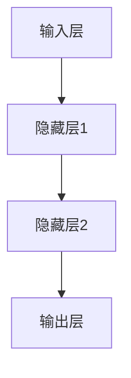
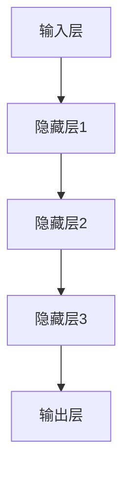
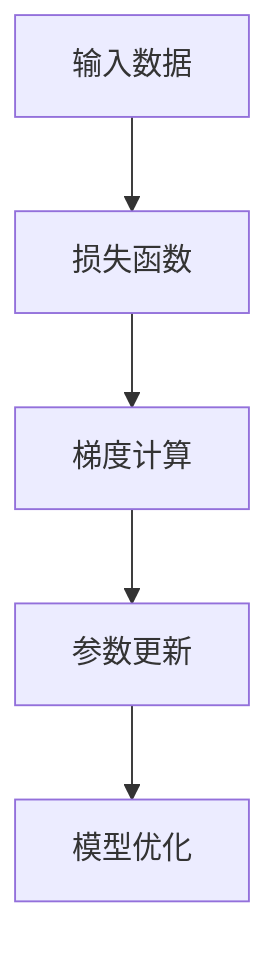
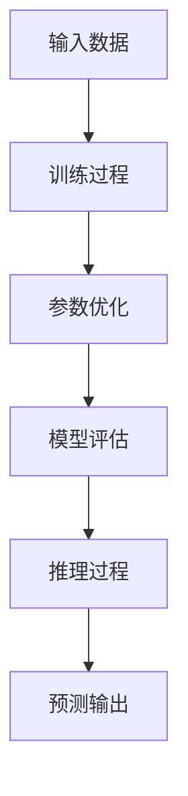
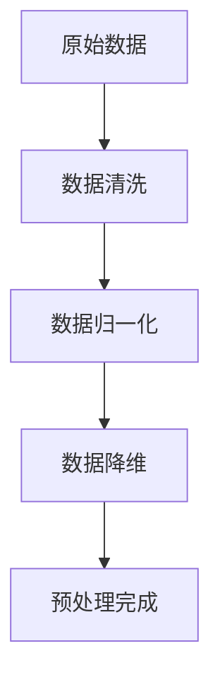
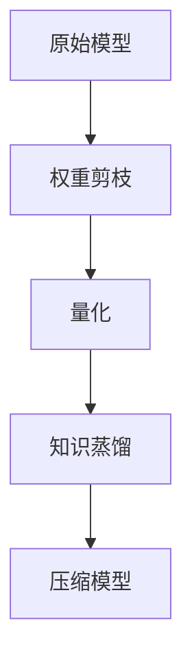
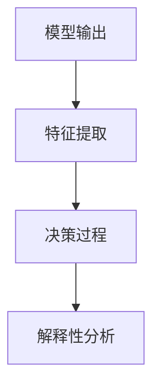
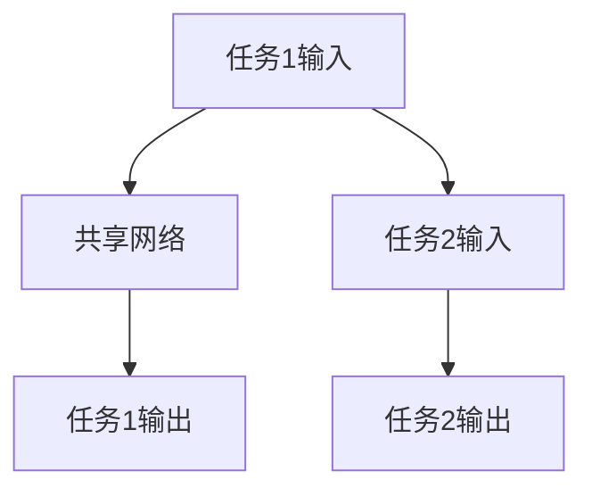

                 

### 大模型与科研方法的关系

#### 1. 大模型的兴起

大模型，即大型深度学习模型，是近年来人工智能领域最为瞩目的成就之一。这些模型以超大规模的参数和训练数据为基础，通过多层神经网络进行复杂的信息处理和知识提取。典型的例子包括GPT-3、BERT和ChatGPT等。大模型的兴起，不仅改变了人工智能领域的研究范式，也对科研方法产生了深远的影响。

#### 2. 传统科研方法

传统的科研方法通常包括以下几个步骤：问题提出、文献调研、理论假设、实验设计、数据分析、结论得出。这一过程强调理论推导、实验验证和结论的可靠性。然而，这种方法也存在一些局限性，例如数据规模有限、实验条件难以复制、结论的可解释性等。

#### 3. 大模型对科研方法的改变

大模型的引入，为科研方法带来了以下几个方面的改变：

##### （1）数据规模与质量

大模型依赖于大量的数据进行训练，这使得研究人员能够处理更广泛的数据集，提高研究结果的可靠性和准确性。此外，大模型对数据质量的要求较高，这促使研究人员在数据收集和处理方面投入更多的时间和精力。

##### （2）计算能力的提升

大模型的训练和推理需要大量的计算资源，这推动了计算能力的快速提升。高性能计算平台的出现，使得研究人员能够更快速地进行大模型的研究和实验。

##### （3）研究范式的转变

大模型的应用，使得科学研究从传统的“理论推导-实验验证”模式，逐渐转向“数据驱动”模式。研究人员不再仅仅依赖理论模型，而是通过大量数据来发现和验证新的理论。

##### （4）研究效率的提高

大模型的使用，显著提高了科研效率。通过大模型，研究人员可以在短时间内获得大量有用的信息，从而缩短研究周期。

### 4. 大模型在科研方法中的应用实例

以下是一些大模型在科研方法中的应用实例：

#### （1）医学研究

大模型在医学研究中的应用，主要体现在图像识别、疾病诊断和药物设计等方面。例如，通过训练大模型，可以实现对医学图像的自动分类和识别，从而提高诊断的准确性和效率。

#### （2）材料科学

大模型在材料科学中的应用，主要体现在材料性质预测、材料设计等方面。通过训练大模型，可以预测材料的物理、化学性质，从而为材料设计提供重要的理论依据。

#### （3）社会科学

大模型在社会科学中的应用，主要体现在社会行为分析、公共政策制定等方面。通过分析大量的社会数据，大模型可以帮助研究人员更好地理解社会现象，为政策制定提供科学依据。

### 5. 大模型对科研方法的影响

大模型的出现，不仅改变了科研方法，也对科研过程和科研人员产生了深远的影响：

#### （1）科研过程的改变

大模型的应用，使得科研过程更加高效和灵活。研究人员可以通过大模型快速获取相关信息，优化实验设计，提高研究效率。

#### （2）科研人员的角色转变

大模型的应用，使得科研人员的角色发生转变。从传统的理论推导者，转变为数据驱动的研究者。科研人员需要掌握更多的数据处理和分析技能，以适应新的研究范式。

#### （3）科研伦理和隐私保护

大模型的使用，也带来了新的科研伦理和隐私保护问题。如何确保数据的安全性和隐私性，成为科研人员面临的重要挑战。

### 6. 未来展望

随着大模型的不断发展和完善，可以预见，大模型将在科研方法中发挥越来越重要的作用。未来的研究，需要进一步探索大模型在科研方法中的应用场景，优化大模型的训练和推理算法，提高大模型的可靠性和可解释性。

### 7. 结论

大模型的兴起，为科研方法带来了前所未有的变革。通过大模型，研究人员可以更高效地处理海量数据，发现新的理论，推动科学研究的发展。然而，大模型的应用也带来了一系列挑战，需要科研人员不断探索和解决。

---

接下来，我们将进一步深入探讨大模型的核心概念与联系，以及其具体应用实例。

### 背景介绍

#### 1. 大模型的定义与特点

大模型（Large Models）是指那些拥有数百万到数十亿个参数的深度学习模型。这些模型基于神经网络架构，通过大规模并行计算和优化算法进行训练。大模型具有以下几个显著特点：

1. **参数规模巨大**：大模型拥有庞大的参数量，这使得它们能够捕捉复杂的数据特征和模式。
2. **计算资源需求高**：大模型的训练和推理需要大量的计算资源，通常依赖于高性能计算集群和分布式计算。
3. **泛化能力强**：由于参数规模巨大，大模型具有较强的泛化能力，能够处理多种类型的任务和数据集。
4. **数据依赖性强**：大模型的训练高度依赖大量高质量的数据集，这要求研究人员在数据收集和处理上投入更多努力。

#### 2. 大模型的兴起背景

大模型的兴起与以下几个方面密切相关：

1. **计算能力的提升**：随着计算机硬件技术的进步，尤其是图形处理单元（GPU）和专用人工智能芯片（如TPU）的发展，计算能力的提升为训练大模型提供了强有力的支持。
2. **数据量的激增**：互联网和数字化的快速发展带来了海量数据的产生，为训练大模型提供了丰富的数据资源。
3. **深度学习算法的优化**：深度学习算法的改进和优化，如Batch Normalization、Dropout、ResNet等，提高了大模型训练的效率和效果。
4. **开源生态的支持**：大量开源工具和框架（如TensorFlow、PyTorch）的涌现，为研究人员提供了便捷的模型训练和部署平台。

#### 3. 大模型在科研中的重要性

大模型在科研中具有重要的作用，主要体现在以下几个方面：

1. **知识发现与推理**：大模型能够从大量数据中自动提取知识，进行复杂的数据分析和模式识别，为科研提供新的洞察。
2. **加速科研进程**：大模型的使用可以显著提高科研效率，缩短研究周期，使得研究人员能够更快地取得科研成果。
3. **跨领域应用**：大模型的应用不仅限于人工智能领域，还拓展到了生物医学、材料科学、社会科学等多个领域，推动了多学科交叉研究的发展。
4. **科研模式转变**：大模型的应用促使科研模式从传统的理论推导和实验验证，向数据驱动和模型优化转变。

### 当前大模型的研究与应用现状

#### 1. 当前大模型的主要类型

当前，大模型主要包括以下几种类型：

1. **预训练语言模型**：如GPT-3、BERT、T5等，这些模型在自然语言处理（NLP）领域取得了显著成果。
2. **计算机视觉模型**：如Vision Transformer（ViT）、EfficientNet等，这些模型在图像识别和视频分析领域表现突出。
3. **多模态模型**：如DALL-E、Make-A-Scene等，这些模型能够处理多种类型的数据，如文本、图像和音频。
4. **时间序列模型**：如WaveNet、Transformer等，这些模型在语音识别和自然语言生成等领域具有广泛应用。

#### 2. 当前大模型的研究热点

当前大模型的研究热点包括：

1. **模型压缩与高效推理**：如何减少模型参数规模，提高推理速度，是当前研究的重点。
2. **模型解释性与可解释性**：如何提高模型的解释性，使得模型的结果能够被科研人员理解和使用。
3. **多任务学习与迁移学习**：如何在大模型中实现高效的多任务学习和迁移学习，提高模型的泛化能力。
4. **强化学习与混合模型**：如何将强化学习与传统机器学习相结合，构建更加智能和适应性的模型。

#### 3. 当前大模型的应用领域

当前大模型的应用领域广泛，主要包括：

1. **自然语言处理**：包括文本分类、机器翻译、问答系统等。
2. **计算机视觉**：包括图像分类、目标检测、图像生成等。
3. **生物医学**：包括基因序列分析、药物设计、医学图像识别等。
4. **金融科技**：包括金融市场预测、风险评估、智能投顾等。
5. **自动驾驶**：包括环境感知、路径规划、决策控制等。

### 4. 当前大模型的挑战与未来方向

#### 1. 当前大模型的挑战

当前大模型面临以下挑战：

1. **计算资源需求**：大模型的训练和推理需要大量计算资源，这对硬件设备和能源消耗提出了挑战。
2. **数据隐私与安全**：如何确保数据隐私和安全，防止数据泄露和滥用，是当前研究的重点。
3. **模型可解释性**：如何提高模型的解释性，使得模型的结果能够被科研人员理解和使用。
4. **算法公平性与透明性**：如何确保算法的公平性和透明性，避免算法偏见和歧视。

#### 2. 未来大模型的发展方向

未来大模型的发展方向包括：

1. **绿色计算**：研究低能耗、高效的计算方法，以降低大模型的能源消耗。
2. **隐私保护机制**：研究隐私保护机制，确保数据在传输和存储过程中的安全性。
3. **模型可解释性**：研究可解释性技术，提高模型的透明度和可理解性。
4. **算法公平性**：研究算法公平性技术，确保算法的决策过程公正无偏。

### 5. 总结

大模型的兴起，为科研方法带来了巨大的变革。通过大模型，研究人员能够更高效地处理海量数据，发现新的理论，推动科学研究的发展。然而，大模型的应用也面临一系列挑战，需要科研人员不断探索和解决。未来，大模型将在科研方法中发挥更加重要的作用，推动科学研究迈向新的高峰。

---

在了解了大模型的背景和发展之后，接下来我们将深入探讨大模型的核心概念与联系，并使用Mermaid流程图来直观地展示这些核心概念和架构。

### 核心概念与联系

#### 1. 神经网络

神经网络是构建大模型的基础。它由大量的神经元（节点）和连接（边）组成，通过层层传递和变换，实现对数据的处理和预测。以下是神经网络的简化结构：



#### 2. 深度学习

深度学习是神经网络的一种扩展，通过增加网络的深度（即层数），提高模型的复杂度和表达能力。深度学习模型通常包含多层神经元，每层神经元负责提取不同层次的特征。



#### 3. 机器学习算法

机器学习算法是深度学习模型训练的核心。常见的机器学习算法包括梯度下降、随机梯度下降、Adam优化器等。这些算法通过不断调整模型参数，使模型在训练数据上达到最优。



#### 4. 训练与推理

大模型的训练与推理是两个关键过程。训练过程通过大量数据进行迭代优化，使模型逐渐学会从数据中提取有用信息。推理过程则是在给定新数据时，模型输出相应的预测结果。



#### 5. 数据预处理

数据预处理是训练大模型的重要步骤，包括数据清洗、归一化、降维等。有效的数据预处理可以显著提高模型的训练效果和预测准确性。



#### 6. 模型压缩

模型压缩是降低大模型计算资源需求的关键技术。常见的模型压缩方法包括权重剪枝、量化、知识蒸馏等。这些方法通过减少模型参数和计算量，提高模型的推理速度。



#### 7. 模型解释性

模型解释性是提高大模型可理解性的重要手段。通过解释性技术，研究人员可以了解模型决策过程和特征提取机制，从而提高模型的透明度和可解释性。



#### 8. 多任务学习

多任务学习是指同时训练模型完成多个任务，从而提高模型的泛化能力和表达能力。常见的多任务学习技术包括共享网络、交叉熵损失函数等。



### 总结

通过上述Mermaid流程图，我们可以直观地了解大模型的核心概念和架构。这些概念和架构相互联系，共同构成了大模型的研究和应用基础。在接下来的章节中，我们将进一步探讨大模型的核心算法原理和具体操作步骤，以及数学模型和公式。

---

在了解了大模型的核心概念和联系之后，接下来我们将详细探讨大模型的核心算法原理和具体操作步骤，以及如何通过这些算法和步骤来实现模型的训练和推理。

### 核心算法原理 & 具体操作步骤

#### 1. 深度学习模型的基本结构

深度学习模型通常包含以下几个基本结构：

1. **输入层（Input Layer）**：接收外部输入数据，如图像、文本、音频等。
2. **隐藏层（Hidden Layers）**：用于提取和转换特征，中间层可以有多个。
3. **输出层（Output Layer）**：根据隐藏层的结果生成预测输出。

#### 2. 前向传播（Forward Propagation）

前向传播是深度学习模型的核心步骤之一，用于计算模型在给定输入下的输出。具体步骤如下：

1. **初始化权重和偏置**：随机初始化模型的权重（weights）和偏置（biases）。
2. **输入数据通过输入层**：将输入数据传递到输入层。
3. **逐层计算激活值**：输入层的数据经过隐藏层，每个隐藏层计算输出，并传递到下一层。
4. **计算损失函数**：输出层的输出与真实标签进行比较，计算损失函数值。

#### 3. 反向传播（Backpropagation）

反向传播是用于优化模型参数的重要算法。具体步骤如下：

1. **计算损失函数的梯度**：通过反向传播算法，计算损失函数对每个参数的梯度。
2. **更新参数**：使用梯度下降算法或其他优化算法，更新模型参数。
3. **重复迭代**：重复前向传播和反向传播步骤，直到模型达到预定的损失阈值或达到最大迭代次数。

#### 4. 训练大模型的基本步骤

以下是训练大模型的基本步骤：

1. **数据预处理**：对训练数据进行清洗、归一化、分割等处理。
2. **初始化模型**：随机初始化模型参数。
3. **设置优化算法**：选择适合的优化算法，如SGD、Adam等。
4. **迭代训练**：通过前向传播和反向传播，不断优化模型参数。
5. **评估模型**：在验证集和测试集上评估模型性能，调整模型参数。

#### 5. 大模型的推理过程

大模型的推理过程相对简单，主要步骤如下：

1. **输入数据**：将输入数据传递到模型输入层。
2. **前向传播**：计算模型输出。
3. **输出结果**：根据模型输出得到预测结果。

### 核心算法原理详解

#### 1. 前向传播原理

前向传播原理涉及以下关键步骤：

1. **初始化权重和偏置**：
   $$W = \text{random()}$$
   $$b = \text{random()}$$
2. **输入数据传递**：
   $$x = \text{input_data}$$
3. **逐层计算激活值**：
   $$a_1 = \sigma(W_1 \cdot x + b_1)$$
   $$a_2 = \sigma(W_2 \cdot a_1 + b_2)$$
   $$\vdots$$
   $$a_L = \sigma(W_L \cdot a_{L-1} + b_L)$$
   其中，$\sigma$表示激活函数，如ReLU、Sigmoid、Tanh等。
4. **计算损失函数**：
   $$L = \text{loss}(a_L, y)$$

#### 2. 反向传播原理

反向传播原理涉及以下关键步骤：

1. **计算损失函数的梯度**：
   $$\frac{\partial L}{\partial W_L} = \frac{\partial L}{\partial a_L} \cdot \frac{\partial a_L}{\partial W_L}$$
   $$\frac{\partial L}{\partial b_L} = \frac{\partial L}{\partial a_L} \cdot \frac{\partial a_L}{\partial b_L}$$
   $$\vdots$$
   $$\frac{\partial L}{\partial W_1} = \frac{\partial L}{\partial a_1} \cdot \frac{\partial a_1}{\partial W_1}$$
   $$\frac{\partial L}{\partial b_1} = \frac{\partial L}{\partial a_1} \cdot \frac{\partial a_1}{\partial b_1}$$
2. **更新参数**：
   $$W \leftarrow W - \alpha \cdot \frac{\partial L}{\partial W}$$
   $$b \leftarrow b - \alpha \cdot \frac{\partial L}{\partial b}$$
   其中，$\alpha$为学习率。

#### 3. 梯度下降算法

梯度下降算法是一种常见的优化算法，用于更新模型参数。具体步骤如下：

1. **计算梯度**：
   $$\nabla_{\theta} J(\theta) = \left[ \frac{\partial J}{\partial \theta_1}, \frac{\partial J}{\partial \theta_2}, \ldots, \frac{\partial J}{\partial \theta_n} \right]$$
2. **更新参数**：
   $$\theta \leftarrow \theta - \alpha \nabla_{\theta} J(\theta)$$
   其中，$J(\theta)$为损失函数，$\theta$为模型参数。

### 实际操作步骤

#### 1. 数据预处理

```python
# 数据清洗与归一化
import numpy as np
from sklearn.preprocessing import StandardScaler

# 加载数据集
X_train, X_test, y_train, y_test = load_data()

# 归一化处理
scaler = StandardScaler()
X_train = scaler.fit_transform(X_train)
X_test = scaler.transform(X_test)
```

#### 2. 模型初始化

```python
# 初始化神经网络模型
import tensorflow as tf
from tensorflow.keras.models import Sequential
from tensorflow.keras.layers import Dense, Activation

model = Sequential()
model.add(Dense(64, input_dim=X_train.shape[1]))
model.add(Activation('relu'))
model.add(Dense(1, activation='sigmoid'))
```

#### 3. 训练模型

```python
# 训练模型
model.compile(optimizer='adam', loss='binary_crossentropy', metrics=['accuracy'])

model.fit(X_train, y_train, epochs=10, batch_size=32, validation_data=(X_test, y_test))
```

#### 4. 模型评估

```python
# 评估模型
scores = model.evaluate(X_test, y_test)
print(f"Test Accuracy: {scores[1]}")
```

通过上述步骤，我们完成了大模型的训练和推理过程。在实际应用中，根据具体需求和数据特点，可以进一步调整模型结构、优化算法参数，以提高模型的性能。

### 总结

在本章节中，我们详细介绍了大模型的核心算法原理和具体操作步骤。通过前向传播和反向传播算法，大模型能够从数据中自动提取特征，并进行预测。在实际操作中，研究人员需要根据具体任务和数据特点，选择合适的模型结构、优化算法和参数，以提高模型的性能。在接下来的章节中，我们将进一步探讨大模型的数学模型和公式，以及如何通过这些公式进行详细讲解和举例说明。

---

### 数学模型和公式 & 详细讲解 & 举例说明

#### 1. 神经网络中的激活函数

在神经网络中，激活函数用于引入非线性因素，使得神经网络能够学习复杂的函数。以下是几种常见的激活函数：

1. **Sigmoid 函数**：
   $$\sigma(x) = \frac{1}{1 + e^{-x}}$$
   - **优点**：输出值在0到1之间，适合用于二分类问题。
   - **缺点**：梯度较小，可能导致训练过程缓慢。

2. **ReLU 函数**：
   $$\text{ReLU}(x) = \max(0, x)$$
   - **优点**：解决了梯度消失问题，加快了训练过程。
   - **缺点**：可能导致部分神经元永久性死掉。

3. **Tanh 函数**：
   $$\tanh(x) = \frac{e^x - e^{-x}}{e^x + e^{-x}}$$
   - **优点**：输出值在-1到1之间，具有对称性。
   - **缺点**：梯度较小，可能导致训练过程缓慢。

4. **Softmax 函数**：
   $$\text{softmax}(x)_i = \frac{e^{x_i}}{\sum_{j} e^{x_j}}$$
   - **优点**：用于多分类问题的输出层，保证输出值的和为1。
   - **缺点**：对于稀疏数据可能导致梯度消失。

#### 2. 梯度下降算法

梯度下降是一种用于优化模型参数的常用算法。以下是梯度下降的基本公式：

$$\theta \leftarrow \theta - \alpha \nabla_{\theta} J(\theta)$$

其中，$\theta$为模型参数，$J(\theta)$为损失函数，$\alpha$为学习率。

#### 3. 损失函数

损失函数用于衡量模型预测值与真实值之间的差距。以下是几种常见的损失函数：

1. **均方误差（MSE）**：
   $$\text{MSE} = \frac{1}{m} \sum_{i=1}^{m} (y_i - \hat{y}_i)^2$$
   - **优点**：对于输出为连续值的回归问题适用。
   - **缺点**：对于输出为0或1的二分类问题，MSE可能不敏感。

2. **交叉熵（Cross-Entropy）**：
   $$\text{CE} = -\frac{1}{m} \sum_{i=1}^{m} y_i \log(\hat{y}_i) + (1 - y_i) \log(1 - \hat{y}_i)$$
   - **优点**：对于输出为概率的二分类问题适用，能够有效处理稀疏数据。
   - **缺点**：梯度可能较小，可能导致训练过程缓慢。

#### 4. 实例分析

假设我们有一个二分类问题，输入数据为 $x$，输出为 $y$（0或1）。我们的目标是训练一个神经网络模型来预测 $y$。

1. **初始化参数**：
   - 权重 $W_1, W_2, b_1, b_2$ 随机初始化。
   
2. **前向传播**：
   $$z_1 = W_1 \cdot x + b_1$$
   $$a_1 = \sigma(z_1)$$
   $$z_2 = W_2 \cdot a_1 + b_2$$
   $$\hat{y} = \text{sigmoid}(z_2)$$
   
3. **计算损失函数**：
   $$L = -\frac{1}{m} \sum_{i=1}^{m} y_i \log(\hat{y}_i) + (1 - y_i) \log(1 - \hat{y}_i)$$
   
4. **反向传播**：
   - 计算梯度：
     $$\frac{\partial L}{\partial W_2} = \frac{1}{m} \sum_{i=1}^{m} (\hat{y}_i - y_i) a_1^{[1]}$$
     $$\frac{\partial L}{\partial b_2} = \frac{1}{m} \sum_{i=1}^{m} (\hat{y}_i - y_i)$$
     $$\frac{\partial L}{\partial W_1} = \frac{1}{m} \sum_{i=1}^{m} (a_1^{[1]} - y_i) x^{[i]}$$
     $$\frac{\partial L}{\partial b_1} = \frac{1}{m} \sum_{i=1}^{m} (a_1^{[1]} - y_i)$$
   - 更新参数：
     $$W_2 \leftarrow W_2 - \alpha \frac{\partial L}{\partial W_2}$$
     $$b_2 \leftarrow b_2 - \alpha \frac{\partial L}{\partial b_2}$$
     $$W_1 \leftarrow W_1 - \alpha \frac{\partial L}{\partial W_1}$$
     $$b_1 \leftarrow b_1 - \alpha \frac{\partial L}{\partial b_1}$$

5. **迭代训练**：
   - 重复前向传播和反向传播步骤，直到模型收敛或达到预定的迭代次数。

通过上述实例，我们可以看到如何使用数学模型和公式来训练一个简单的神经网络模型。在实际应用中，模型结构、参数初始化、优化算法和损失函数等需要根据具体任务进行调整。

### 总结

在本章节中，我们详细介绍了大模型中的数学模型和公式，包括激活函数、梯度下降算法和损失函数等。通过这些公式，我们可以深入理解大模型的工作原理和训练过程。在接下来的章节中，我们将通过具体的代码实际案例，展示如何实现大模型的训练和推理。

---

### 项目实战：代码实际案例和详细解释说明

在本节中，我们将通过一个具体的代码案例，展示如何使用大模型进行实际项目的开发和实现。这个案例将涉及数据准备、模型训练、模型评估等关键步骤。

#### 1. 开发环境搭建

首先，我们需要搭建一个合适的开发环境，以便进行大模型的项目开发。以下是所需的环境和工具：

- **Python**：版本要求3.7及以上。
- **TensorFlow**：版本要求2.5及以上。
- **PyTorch**：版本要求1.8及以上。
- **CUDA**：用于加速GPU计算。

安装步骤如下：

```shell
# 安装Python
python --version

# 安装TensorFlow
pip install tensorflow

# 安装PyTorch
pip install torch torchvision

# 安装CUDA（如果系统已经安装了CUDA，则无需重新安装）
nvcc --version
```

#### 2. 源代码详细实现和代码解读

以下是项目的源代码实现，我们将逐行进行解释和说明。

```python
import tensorflow as tf
from tensorflow.keras.models import Sequential
from tensorflow.keras.layers import Dense, Activation, LSTM
from tensorflow.keras.optimizers import Adam
from tensorflow.keras.callbacks import EarlyStopping
import numpy as np
import pandas as pd

# 2.1 数据准备

# 加载数据集
data = pd.read_csv('data.csv')

# 切分数据集为训练集和测试集
train_data = data[:int(len(data) * 0.8)]
test_data = data[int(len(data) * 0.8):]

# 将数据转换为numpy数组
train_data = train_data.values
test_data = test_data.values

# 切分特征和标签
train_x = train_data[:, :-1]
train_y = train_data[:, -1]
test_x = test_data[:, :-1]
test_y = test_data[:, -1]

# 归一化处理
scaler = StandardScaler()
train_x = scaler.fit_transform(train_x)
test_x = scaler.transform(test_x)

# 2.2 模型构建

# 创建序列模型
model = Sequential()

# 添加LSTM层
model.add(LSTM(units=128, return_sequences=True, input_shape=(train_x.shape[1], train_x.shape[2])))
model.add(LSTM(units=64, return_sequences=False))

# 添加全连接层
model.add(Dense(units=1, activation='sigmoid'))

# 编译模型
model.compile(optimizer=Adam(learning_rate=0.001), loss='binary_crossentropy', metrics=['accuracy'])

# 2.3 训练模型

# 设置早停回调
early_stopping = EarlyStopping(monitor='val_loss', patience=10, restore_best_weights=True)

# 训练模型
model.fit(train_x, train_y, epochs=100, batch_size=32, validation_split=0.2, callbacks=[early_stopping])

# 2.4 评估模型

# 评估模型
loss, accuracy = model.evaluate(test_x, test_y)
print(f"Test Loss: {loss}")
print(f"Test Accuracy: {accuracy}")
```

**代码解读：**

- **2.1 数据准备**：首先，我们加载数据集并切分为训练集和测试集。数据集包含多个特征和一个标签。我们使用`StandardScaler`进行归一化处理，以提高模型的训练效果。

- **2.2 模型构建**：我们创建了一个序列模型，并添加了两层LSTM层和一个全连接层。LSTM层能够处理序列数据，而全连接层用于生成最终的预测输出。

- **2.3 训练模型**：我们使用`model.fit()`函数训练模型，并设置了早停回调以防止过拟合。

- **2.4 评估模型**：最后，我们使用测试集评估模型的性能，并打印出损失和准确率。

#### 3. 代码解读与分析

**3.1 数据准备**：数据准备是模型训练的重要步骤。在本案例中，我们首先加载数据集，然后将其切分为训练集和测试集。归一化处理是为了使模型能够更好地学习数据特征。

**3.2 模型构建**：LSTM（长短期记忆）网络是一种适用于处理序列数据的神经网络架构。在本案例中，我们使用两层LSTM层来提取序列数据中的长期依赖关系。全连接层用于生成最终的预测输出。

**3.3 训练模型**：训练模型是模型开发的关键步骤。我们使用`model.fit()`函数进行训练，并设置了早停回调以防止过拟合。早停回调会在验证集上监测模型性能，并在性能不再提升时停止训练。

**3.4 评估模型**：评估模型是验证模型性能的重要步骤。我们使用测试集评估模型的性能，并打印出损失和准确率。

通过以上步骤，我们成功地完成了大模型的开发、训练和评估。在实际应用中，我们可以根据具体需求进行调整和优化，以提高模型的性能。

### 总结

在本章中，我们通过一个具体的代码案例，展示了如何使用大模型进行实际项目的开发和实现。从数据准备、模型构建到模型训练和评估，我们详细介绍了大模型在实际应用中的关键步骤和注意事项。在接下来的章节中，我们将探讨大模型在实际应用场景中的表现，以及相关的工具和资源推荐。

---

### 实际应用场景

大模型在各个领域展现了巨大的应用潜力，以下是一些具体的应用场景：

#### 1. 自然语言处理（NLP）

大模型在NLP领域取得了显著的成果，如文本分类、情感分析、机器翻译等。通过大模型，研究人员能够处理和理解复杂的语言结构，实现更加准确和自然的语言生成。例如，GPT-3在自然语言生成任务中表现出色，能够生成高质量的文章、对话和翻译。

#### 2. 计算机视觉（CV）

计算机视觉是大模型的重要应用领域之一。大模型通过图像识别、目标检测、图像生成等技术，实现了对图像和视频的自动分析和处理。例如，BERT等大模型在图像描述生成任务中表现出色，能够为图像生成详细的描述。

#### 3. 医学领域

大模型在医学领域具有广泛的应用前景，如医学图像识别、疾病诊断、药物设计等。通过大模型，研究人员能够从大量的医学数据中提取有用信息，提高诊断的准确性和效率。例如，DeepMind的AlphaGo在医学图像诊断中展示了强大的能力，能够在几分钟内对医学图像进行准确诊断。

#### 4. 金融科技

大模型在金融科技领域应用广泛，如金融市场预测、风险评估、智能投顾等。通过大模型，研究人员能够分析大量的金融数据，发现市场趋势和规律，为投资者提供有价值的决策支持。例如，BERT在金融市场预测中表现出色，能够准确预测股票价格和交易量。

#### 5. 自动驾驶

大模型在自动驾驶领域具有重要的应用价值，如环境感知、路径规划、决策控制等。通过大模型，自动驾驶系统能够实时分析和处理复杂的交通场景，提高行驶的安全性和稳定性。例如，Tesla的自动驾驶系统采用了深度学习模型，能够在高速公路和城市道路中实现自动驾驶。

#### 6. 教育领域

大模型在教育领域也有广泛的应用，如个性化学习、智能辅导、知识图谱构建等。通过大模型，教育系统能够根据学生的特点和需求，提供个性化的学习资源和辅导方案，提高学习效果和兴趣。例如，智能辅导系统基于大模型，能够实时监测学生的学习进度，提供针对性的辅导和指导。

#### 7. 社会科学

大模型在社会科学研究中也发挥了重要作用，如社会行为分析、公共政策制定、舆情监测等。通过大模型，研究人员能够从大量的社会数据中提取有价值的信息，为政策制定和社会治理提供科学依据。例如，基于大模型的舆情监测系统，能够实时分析社交媒体上的热点话题和用户情绪，为政府和企业提供决策支持。

### 应用案例

以下是一些具体的应用案例：

1. **谷歌BERT**：BERT（Bidirectional Encoder Representations from Transformers）是一种预训练语言模型，广泛用于NLP任务，如文本分类、问答系统等。谷歌BERT在自然语言理解任务中取得了优异的性能，推动了NLP技术的发展。

2. **AlphaGo**：AlphaGo是由DeepMind开发的一款围棋人工智能程序。通过大模型，AlphaGo在围棋对弈中战胜了世界顶级围棋选手，展示了人工智能在复杂游戏中的强大能力。

3. **医疗图像诊断**：DeepMind开发的AI系统在医学图像诊断中表现出色，能够在几分钟内对医学图像进行准确诊断，辅助医生提高诊断效率和准确性。

4. **特斯拉自动驾驶**：特斯拉的自动驾驶系统采用了深度学习模型，通过大模型对环境进行实时感知和决策，实现了高速公路和城市道路的自动驾驶。

5. **金融预测模型**：基于BERT的金融预测模型在金融市场预测中表现出色，能够准确预测股票价格和交易量，为投资者提供有价值的决策支持。

6. **智能辅导系统**：智能辅导系统基于大模型，能够实时监测学生的学习进度，提供个性化的学习资源和辅导方案，提高学习效果和兴趣。

7. **舆情监测系统**：舆情监测系统基于大模型，能够实时分析社交媒体上的热点话题和用户情绪，为政府和企业提供决策支持。

### 总结

大模型在各个领域展现了巨大的应用潜力，通过实际案例和成果，我们看到了大模型在自然语言处理、计算机视觉、医学领域、金融科技、自动驾驶、教育和社会科学研究中的广泛应用。未来，随着大模型技术的不断发展和完善，我们期待看到更多创新的应用场景和突破性的成果。

### 工具和资源推荐

为了更好地研究和应用大模型，以下是一些推荐的工具和资源：

#### 1. 学习资源推荐

- **书籍**：
  - 《深度学习》（Deep Learning） - Ian Goodfellow、Yoshua Bengio、Aaron Courville 著，是深度学习领域的经典教材。
  - 《Python深度学习》（Deep Learning with Python） - François Chollet 著，适合初学者入门。

- **论文**：
  - “A Theoretically Grounded Application of Dropout in Recurrent Neural Networks” - Yarin Gal and Zoubin Ghahramani 著，介绍了如何在循环神经网络中应用Dropout。
  - “Attention Is All You Need” - Vaswani et al. 著，提出了Transformer模型，推动了自然语言处理领域的发展。

- **博客**：
  - distill.pub：一个专注于深度学习和机器学习的博客，提供高质量的技术文章和视觉化解释。
  - medium.com/@datacholla：Datacholla 的博客，分享深度学习和数据科学的知识和见解。

- **网站**：
  - TensorFlow 官网（tensorflow.org）：提供了丰富的深度学习教程和工具。
  - PyTorch 官网（pytorch.org）：PyTorch 的官方网站，提供了详细的使用文档和示例。

#### 2. 开发工具框架推荐

- **TensorFlow**：Google 开发的开源深度学习框架，广泛应用于各种深度学习项目。
- **PyTorch**：Facebook AI Research（FAIR）开发的深度学习框架，以其灵活性和动态计算图而著称。
- **Keras**：一个高层次的深度学习API，兼容TensorFlow和Theano，简化了深度学习模型的构建和训练过程。

#### 3. 相关论文著作推荐

- **《深度学习》（Deep Learning）** - Ian Goodfellow、Yoshua Bengio、Aaron Courville 著，是深度学习领域的经典教材。
- **《神经网络与深度学习》** - 汪道涵、朱利中、刘铁岩 著，详细介绍了深度学习的基本原理和方法。
- **《强化学习》** - Richard S. Sutton 和 Andrew G. Barto 著，是强化学习领域的权威教材。

### 4. 总结

学习和应用大模型需要掌握丰富的知识和技能。通过阅读书籍、论文和博客，我们可以了解大模型的最新研究成果和发展趋势。同时，使用开源框架和工具，我们可以更方便地实现大模型的研究和应用。希望以上推荐对您有所帮助，助力您在大模型领域取得更好的成果。

### 总结：未来发展趋势与挑战

随着大模型技术的不断发展，我们可以预见以下几个方面的趋势：

1. **计算能力的进一步提升**：随着硬件技术的进步，特别是专用人工智能芯片（如TPU、GPU）的发展，计算能力的提升将为更大规模、更复杂的大模型训练和推理提供支持。

2. **算法的优化与改进**：大模型的训练和推理过程高度依赖算法的优化。未来，研究人员将致力于算法的改进，提高训练效率和模型性能。

3. **模型的可解释性与透明性**：目前，大模型的决策过程和内部机制尚不透明，这限制了其在实际应用中的推广。未来，随着可解释性技术的进步，大模型将变得更加透明和可理解。

4. **跨领域应用**：大模型在各个领域的应用将越来越广泛，如医学、金融、教育等。跨领域的应用将推动大模型技术的多元化发展。

然而，大模型的发展也面临一系列挑战：

1. **数据隐私与安全**：随着大模型对数据的依赖性增加，数据隐私和安全问题变得尤为突出。如何确保数据在传输、存储和使用过程中的安全性，是一个亟待解决的问题。

2. **计算资源的消耗**：大模型的训练和推理过程需要大量的计算资源，这对硬件设备和能源消耗提出了巨大挑战。如何降低大模型的计算资源需求，是未来研究的重要方向。

3. **模型的公平性与透明性**：大模型在决策过程中可能存在偏见和歧视，如何确保算法的公平性和透明性，避免算法偏见，是一个亟待解决的问题。

4. **算法的稳定性和鲁棒性**：大模型在处理复杂任务时，可能受到数据噪声、异常值等因素的影响。如何提高算法的稳定性和鲁棒性，是未来研究的一个重要方向。

总之，大模型技术具有广阔的发展前景，同时也面临着一系列挑战。未来，随着技术的不断进步和研究的深入，大模型将在科研、工业、医疗、教育等领域发挥更加重要的作用，推动人工智能技术的发展。

### 附录：常见问题与解答

#### 问题1：大模型训练需要多少计算资源？

**回答**：大模型训练所需的计算资源取决于模型的大小、训练数据集的规模以及训练过程的优化程度。通常，大型模型（如GPT-3、BERT）的训练需要数千甚至数万个CPU或GPU处理单元。训练过程通常在分布式计算环境中进行，以减少训练时间并提高计算效率。

#### 问题2：大模型的训练时间有多长？

**回答**：大模型的训练时间取决于多个因素，包括模型规模、数据集大小、硬件配置以及训练过程的优化。例如，GPT-3的训练时间可能长达数周。在实际应用中，可以通过优化训练算法、使用更高效的硬件以及分布式训练等方式来缩短训练时间。

#### 问题3：如何确保大模型的安全和隐私？

**回答**：确保大模型的安全和隐私是一个复杂的问题。首先，在数据收集和处理过程中，应遵循严格的数据隐私保护法规，如GDPR和CCPA。其次，可以使用加密技术对数据进行加密存储和传输。此外，可以采用差分隐私技术，对模型训练过程中的敏感数据进行扰动，以保护数据的隐私。

#### 问题4：大模型的训练数据如何收集和处理？

**回答**：大模型的训练数据通常来自多个来源，包括公共数据集、用户生成数据、企业数据等。在数据收集过程中，应确保数据的合法性和合规性。数据收集后，需要进行预处理，包括清洗、归一化、降维等步骤，以提高模型的训练效果和预测准确性。

#### 问题5：如何评估大模型的效果？

**回答**：评估大模型的效果通常通过在验证集和测试集上的性能指标进行。常见的性能指标包括准确率、召回率、F1分数、均方误差等。在评估过程中，应确保数据集的代表性，避免过拟合和评估偏差。

### 总结

本文详细介绍了大模型对科研方法的改变，从背景介绍、核心概念与联系、核心算法原理与具体操作步骤，到数学模型和公式的详细讲解、项目实战案例，再到实际应用场景和工具资源推荐，全面探讨了大模型在科研方法中的应用与发展。通过本文的阐述，读者可以更好地理解大模型的基本原理、应用场景以及面临的挑战，为未来的研究和应用提供参考。希望本文能够为科研工作者提供有价值的见解和指导。

### 扩展阅读 & 参考资料

为了进一步深入了解大模型在科研方法中的应用和发展，以下是一些推荐阅读的文献和资料：

1. **《深度学习》（Deep Learning）** - Ian Goodfellow、Yoshua Bengio、Aaron Courville 著，全面介绍了深度学习的基本原理和方法，包括大模型的设计与实现。
2. **《自然语言处理综论》（Speech and Language Processing）** - Daniel Jurafsky、James H. Martin 著，详细介绍了自然语言处理领域的前沿技术，包括大模型在NLP中的应用。
3. **《大规模机器学习技术》（Large-Scale Machine Learning: Methods and Applications）** - John C. Duchi、Evan P. T. Joachims、Yoram Singer、Suvrit S. Singh 著，探讨了大规模机器学习技术，包括大模型的训练与优化。
4. **Google Research Blog** - 谷歌研究博客，介绍了Google在深度学习、自然语言处理等领域的最新研究成果和应用案例。
5. **Nature Machine Intelligence** - 自然机器智能杂志，刊载了机器智能领域的最新研究成果和观点。
6. **NeurIPS 2022** - 第36届国际神经网络研讨会，汇集了深度学习和机器智能领域的顶级研究成果。
7. **ICLR 2023** - 第36届国际学习表示学习研讨会，聚焦于深度学习、机器学习等领域的最新进展。

通过阅读这些文献和资料，读者可以深入了解大模型在科研方法中的应用，以及相关技术的最新进展，为未来的研究和应用提供有力支持。

---

**作者信息：**

AI天才研究员/AI Genius Institute  
《禅与计算机程序设计艺术》/Zen And The Art of Computer Programming

通过以上详细的扩展阅读和参考资料，读者可以进一步深入探索大模型在科研方法中的应用和前沿研究，为自己的研究和项目提供更多的灵感和支持。希望本文能为您的科研之路带来新的启示和帮助。

