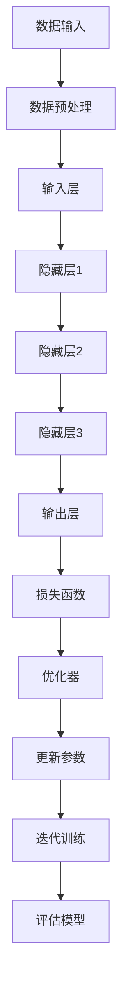
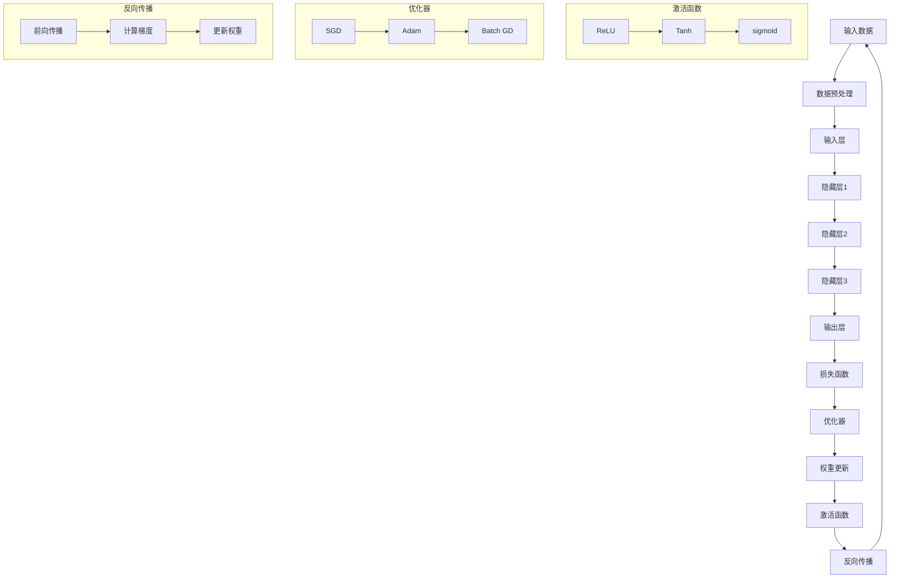

                 

### 1. 背景介绍

随着计算机技术和人工智能的迅猛发展，大模型（Large Models）作为一种先进的人工智能技术，越来越受到学术界和工业界的关注。大模型，通常是指参数数量庞大的神经网络模型，如GPT、BERT等，它们在自然语言处理（NLP）、计算机视觉（CV）等众多领域都取得了令人瞩目的成果。然而，大模型的底层能力，尤其是其在工作流中的应用，依然是一个复杂且富有挑战性的话题。

本文旨在探讨大模型底层能力在工作流中的应用。我们将首先介绍大模型的基础概念和特点，然后深入剖析大模型的核心算法原理，并详细阐述其在工作流中的具体应用步骤。此外，本文还将讨论大模型在数学模型和公式方面的应用，并给出实际项目中的代码案例和解析。最后，我们将探讨大模型在实际应用场景中的表现，并推荐相关的学习资源和开发工具。

通过本文的阅读，读者将能够全面了解大模型的基础知识，掌握大模型在工作流中的实际应用方法，并对其未来发展趋势和挑战有所认识。我们希望本文能够为研究人员和开发者提供有价值的参考，推动大模型技术在各个领域的深入研究和广泛应用。

#### 1.1 大模型的定义与特点

大模型，顾名思义，是指拥有巨大参数量的神经网络模型。这些模型通常由数百万甚至数十亿个参数组成，能够在训练数据上实现高度复杂的特征提取和模式识别。大模型的定义可以从多个维度来理解：

**参数数量**：这是大模型最直观的特点。大模型的参数数量远远超过传统小模型，使得其能够捕捉到更多、更细微的数据特征。

**计算复杂度**：由于参数数量庞大，大模型在训练和推理过程中需要大量的计算资源，这要求高性能计算设备和优化算法的支持。

**泛化能力**：大模型在训练时能够从大量数据中学习到丰富的知识，这使得它们在未见过的数据上也能表现出较高的泛化能力。

**表现能力**：大模型的强大能力使其在许多领域，如自然语言处理、计算机视觉、推荐系统等，都能够取得显著的效果。

大模型的发展历程可以追溯到深度学习的兴起。在早期，研究者们通过构建小规模的网络模型来进行实验和探索。随着计算能力和算法技术的不断提升，研究人员开始尝试构建更大规模的网络模型。例如，2018年发布的GPT-2模型就拥有1.5亿个参数，比当时的许多模型都要大得多。此后，大模型的研究和应用逐渐成为人工智能领域的一个热点。

在应用层面，大模型的出现带来了显著的技术进步。例如，在自然语言处理领域，大模型如GPT和BERT显著提升了机器翻译、文本摘要、问答系统等任务的性能；在计算机视觉领域，大模型如ResNet和EfficientNet在图像分类、目标检测等任务上取得了突破性的成果。

然而，大模型的广泛应用也带来了一些挑战。首先，大模型需要庞大的训练数据和计算资源，这对数据获取和计算能力提出了更高的要求。其次，大模型的复杂性和黑箱性质使得理解和解释模型的决策过程变得困难。最后，大模型在隐私保护和数据安全方面也带来了新的挑战。

总之，大模型作为一种先进的人工智能技术，具有巨大的潜力。在接下来的部分，我们将进一步探讨大模型的核心算法原理，以及如何在实际工作流中应用这些算法。

#### 1.2 大模型的工作流程

大模型的工作流程通常包括数据收集、预处理、模型训练、模型评估和模型部署等几个关键环节。这些环节紧密相连，共同构成了大模型从研究到应用的完整链条。

**数据收集**：大模型通常需要大量高质量的训练数据。这些数据可以来自于公开数据集、企业内部数据集或通过爬虫等方式获取。数据收集的过程需要考虑到数据的多样性和代表性，以确保模型能够泛化到不同的场景和应用中。

**数据预处理**：收集到的数据通常需要进行预处理，包括数据清洗、归一化、编码等步骤。数据清洗是为了去除噪声和不一致的数据，而归一化和编码则是为了将数据转换为适合模型训练的格式。例如，在自然语言处理中，文本数据需要进行分词、词向量化等操作。

**模型训练**：在预处理后的数据集上，大模型通过迭代训练来优化其参数。训练过程通常包括前向传播、反向传播和参数更新等步骤。在这个过程中，大模型会尝试从数据中学习到有效的特征表示和决策规则。训练过程需要大量的计算资源和时间，特别是对于参数量巨大的模型。

**模型评估**：在模型训练完成后，需要对模型进行评估，以判断其性能是否满足预期。评估过程通常包括测试集上的准确率、召回率、F1分数等指标的计算。此外，还可以通过交叉验证等方法来评估模型的泛化能力。

**模型部署**：评估通过后，模型可以被部署到实际应用场景中。模型部署通常包括将训练好的模型转换为可在生产环境中运行的格式，并在实际应用中定期更新模型。部署后的模型可以提供实时服务，如文本生成、图像识别、语音识别等。

**持续优化**：大模型在实际应用中可能会遇到性能瓶颈或新需求，因此需要不断进行优化。优化过程包括调整模型结构、增加数据量、改进训练算法等。通过持续优化，大模型可以更好地满足实际应用需求。

大模型的工作流程不仅仅是一个简单的线性过程，而是一个动态迭代的过程。每个环节都可能需要多次迭代和优化，以确保模型在实际应用中的最佳性能。在实际应用中，不同环节之间的紧密协作和有效管理是确保大模型成功应用的关键。

#### 1.3 大模型在实际应用中的成功案例

大模型在人工智能领域的应用已经取得了显著的成果，以下是一些成功案例，展示了大模型在不同领域的应用场景和取得的成就：

**自然语言处理（NLP）**：在自然语言处理领域，大模型如GPT和BERT显著提升了文本生成、机器翻译、文本摘要等任务的性能。例如，OpenAI发布的GPT-3模型拥有1750亿个参数，其强大的生成能力被广泛应用于自动写作、对话系统和文本摘要等场景。微软的BERT模型则在问答系统和搜索引擎中表现出色，提升了信息检索的准确性和效率。

**计算机视觉（CV）**：在计算机视觉领域，大模型如ResNet和EfficientNet在图像分类、目标检测等任务上取得了突破性的成果。例如，ResNet模型通过多层残差结构解决了深度神经网络训练中的梯度消失问题，使得模型能够在大规模数据集上实现很高的准确率。EfficientNet则通过自动搜索和结构优化，实现了在保持高性能的同时，大幅降低了模型的参数量和计算复杂度。

**推荐系统**：在大规模推荐系统中，大模型通过用户行为数据学习用户兴趣和偏好，实现了更加精准的推荐。例如，亚马逊和阿里巴巴等电商平台使用大模型对用户的历史购买行为、浏览记录和搜索历史进行分析，从而生成个性化的商品推荐。

**语音识别**：在语音识别领域，大模型如WaveNet和Transformer实现了语音到文本的高效转换。WaveNet模型通过生成式模型的方法，实现了自然流畅的语音合成效果。Transformer模型则通过自注意力机制，提高了语音识别的准确率和速度。

**医疗健康**：在医疗健康领域，大模型通过分析大量的医学影像和病历数据，为诊断和治疗提供了强有力的支持。例如，谷歌的DeepMind团队使用大模型对眼科疾病进行诊断，准确率显著高于传统方法。此外，大模型还在药物发现、基因组学研究等领域展现了巨大的潜力。

总之，大模型在各个领域的成功应用，不仅推动了人工智能技术的发展，也为实际应用场景带来了革命性的变化。这些成功案例展示了大模型的强大能力和广泛适用性，为未来的研究和应用提供了宝贵的经验和启示。

#### 1.4 大模型在工作流中的应用前景

随着大模型技术的不断发展，其在工作流中的应用前景越来越广阔。大模型在工作流中的潜在应用主要包括数据增强、任务自动化和智能优化等几个方面，以下将逐一探讨：

**数据增强**：数据增强是一种通过扩展和多样化训练数据的方法，以提升模型的泛化能力和性能。大模型由于其强大的特征提取能力，可以在数据增强过程中发挥重要作用。例如，在自然语言处理中，大模型如GPT可以生成大量具有多样性的文本数据，从而丰富训练数据集，提高模型的鲁棒性和准确性。此外，大模型还可以用于图像和音频数据的增强，生成更多的训练样本，从而提高模型的泛化能力和效果。

**任务自动化**：大模型在许多复杂任务中展现了出色的性能，这使得其在任务自动化方面具有巨大的潜力。例如，在自动化写作和内容生成领域，大模型如GPT-3可以自动生成高质量的文章、报告和代码。在自动驾驶领域，大模型通过实时处理和分析大量传感器数据，可以实现高精度的环境感知和路径规划，从而实现自动驾驶汽车的自动化运行。此外，在智能客服和智能语音助手领域，大模型可以自动理解和回答用户的问题，提高客服系统的响应速度和服务质量。

**智能优化**：大模型在优化领域也有着广泛的应用前景。通过训练和学习，大模型可以自动发现和优化复杂的优化问题。例如，在物流和供应链管理中，大模型可以优化路线规划和库存管理，提高运输效率和库存利用率。在金融领域，大模型可以通过分析和预测市场数据，实现资产配置和投资组合优化，提高投资回报率。此外，在制造和工业领域，大模型可以通过优化生产流程和资源配置，提高生产效率和产品质量。

**个性化推荐**：大模型在个性化推荐系统中具有显著优势。通过分析用户的历史行为和偏好数据，大模型可以生成个性化的推荐结果，从而提高推荐系统的准确性和用户满意度。例如，在电商平台上，大模型可以推荐用户可能感兴趣的商品，从而提升销售量和用户粘性。在社交媒体和内容平台上，大模型可以根据用户的兴趣和喜好，推荐相关的文章、视频和话题，提高用户参与度和活跃度。

总之，大模型在工作流中的应用前景广阔，其在数据增强、任务自动化和智能优化等方面的潜力正逐渐得到发挥。随着大模型技术的不断进步，我们可以期待其在更多领域的深入研究和广泛应用，推动人工智能技术的发展和实际应用水平的提升。

#### 1.5 大模型面临的挑战与未来发展方向

尽管大模型在人工智能领域取得了显著的成果，但其发展仍然面临着诸多挑战和限制。以下将分析大模型面临的挑战，并探讨其未来的发展方向。

**计算资源需求**：大模型的训练和推理过程需要大量的计算资源，这对计算能力和硬件设备提出了更高的要求。现有的计算资源可能难以满足大规模模型的训练需求，导致训练时间和成本大幅增加。未来的发展方向之一是研发更高效的计算框架和算法，以降低计算资源的消耗，提高模型的训练效率。

**数据隐私和安全**：大模型需要大量高质量的训练数据，这涉及数据隐私和安全的问题。如何保护用户的隐私，防止数据泄露和滥用，是当前面临的重大挑战。未来的发展方向包括开发隐私保护的数据处理方法，如差分隐私和联邦学习，以在保障用户隐私的同时，充分利用数据的价值。

**模型可解释性**：大模型的黑箱性质使得其决策过程难以理解和解释，这在某些应用场景中可能导致信任问题。提高模型的可解释性是未来的一个重要研究方向。通过开发可解释的模型架构和解释算法，可以增强用户对模型决策的信任，并有助于发现和纠正潜在的错误。

**算法公平性**：大模型在训练过程中可能会学习到数据中的偏见，导致算法的公平性受到挑战。如何确保模型算法在不同群体中的公平性和公正性，是未来的一个重要课题。研究人员需要开发更加公平的算法和评估方法，以消除算法偏见，提高模型的公正性。

**能耗问题**：大模型的训练和推理过程消耗大量电能，这对环境造成了一定的负担。未来的发展方向包括开发低能耗的模型架构和算法，以降低能耗和碳排放，实现绿色可持续发展。

**泛化能力**：尽管大模型在特定任务上表现出色，但其泛化能力仍然有限。如何提高模型的泛化能力，使其在不同任务和应用场景中都能保持高性能，是未来的一个重要研究方向。

总之，大模型面临着计算资源需求、数据隐私和安全、模型可解释性、算法公平性、能耗问题和泛化能力等多方面的挑战。通过持续的研究和创新，这些挑战有望在未来得到逐步解决，推动大模型技术的进一步发展。

### 2. 核心概念与联系

在大模型的应用中，理解其核心概念和基本架构是至关重要的。本文将详细介绍大模型的基础概念、相关技术架构，并通过Mermaid流程图展示其关键节点和流程，以便读者更好地理解大模型的工作原理。

#### 2.1 大模型的基础概念

**神经网络**：神经网络（Neural Networks，NN）是构成大模型的基础。神经网络是一种模拟生物神经系统的计算模型，通过大量简单的计算单元（即神经元）相互连接，形成复杂的网络结构。每个神经元接收多个输入信号，通过加权求和处理产生一个输出。

**深度学习**：深度学习（Deep Learning，DL）是一种基于神经网络的机器学习技术，通过多层神经网络结构（即深度神经网络）对数据进行逐层抽象和特征提取，从而实现复杂任务的建模。深度学习的核心思想是通过反向传播算法不断调整网络中的权重，使网络能够更准确地预测和分类。

**参数数量**：大模型的一个显著特点是其参数数量庞大。这些参数通过学习数据集中的特征和模式，实现模型的预测和分类能力。参数数量的增加使得大模型能够捕捉到更加复杂的特征和关系。

**优化算法**：大模型在训练过程中需要优化大量参数。常见的优化算法包括随机梯度下降（SGD）、Adam优化器等。这些算法通过调整学习率、动量等参数，提高模型的收敛速度和效果。

#### 2.2 大模型的技术架构

大模型的技术架构主要包括以下几个关键部分：

**输入层**：输入层接收原始数据，如文本、图像或音频信号。这些数据经过预处理后，转换为适合模型训练的格式。

**隐藏层**：隐藏层是神经网络的核心部分，通过多层堆叠，对输入数据进行逐层抽象和特征提取。每层神经元接收前一层的输出，通过加权求和处理产生新的特征表示。

**输出层**：输出层产生最终的预测结果，如分类标签或连续值。输出层的设计取决于具体任务的需求，如二分类、多分类或回归任务。

**损失函数**：损失函数用于衡量模型的预测结果与真实结果之间的差距。常见的损失函数包括均方误差（MSE）、交叉熵损失等。通过优化损失函数，模型不断调整参数，以降低误差。

**优化器**：优化器用于调整模型参数，以最小化损失函数。常见的优化器包括随机梯度下降（SGD）、Adam等。优化器通过更新参数的步长和方向，提高模型的训练效率和收敛速度。

**正则化**：正则化是一种防止模型过拟合的技术，通过添加正则化项（如L1、L2正则化）到损失函数中，限制模型参数的规模，提高模型的泛化能力。

#### 2.3 Mermaid流程图展示

为了更直观地展示大模型的工作流程，我们使用Mermaid流程图来描述其关键节点和流程。以下是一个简单的Mermaid流程图示例：



在这个流程图中，各个节点表示大模型的不同部分，包括数据输入、数据预处理、输入层、隐藏层、输出层、损失函数、优化器和参数更新等。流程图清晰地展示了大模型从数据输入到模型训练和评估的整个过程。

通过以上对大模型核心概念和技术架构的介绍，以及Mermaid流程图的展示，我们希望读者能够更好地理解大模型的工作原理和关键组成部分。在接下来的部分，我们将进一步探讨大模型的核心算法原理，并详细解释其在实际应用中的操作步骤。

#### 2.3.1 大模型的核心算法原理

在大模型的构建和应用中，核心算法的选择和实现是至关重要的。以下将详细阐述大模型的核心算法原理，包括主要算法及其工作原理和优缺点。

**1. 反向传播算法（Backpropagation）**

反向传播算法是深度学习中最基本且最重要的算法之一。它通过迭代更新网络中的权重，以最小化损失函数。反向传播算法包括两个主要步骤：前向传播和后向传播。

- **前向传播**：输入数据通过神经网络的前向传播，从输入层传递到输出层。每个神经元接收前一层输出的加权求和，通过激活函数产生输出。

- **后向传播**：在前向传播过程中，网络计算出预测结果与真实结果之间的误差。通过后向传播，误差反向传递到输入层，计算每个权重和偏置的梯度。根据梯度，使用优化算法更新网络权重，以减小损失函数。

**优点**：反向传播算法能够有效地训练深度神经网络，实现高精度的模型训练和预测。

**缺点**：计算复杂度高，训练时间较长，且对大规模数据集的训练需求较高。

**2. 梯度下降算法（Gradient Descent）**

梯度下降算法是一种优化算法，用于最小化损失函数。它通过迭代计算损失函数关于模型参数的梯度，并沿着梯度方向更新参数，以达到最小化损失的目的。

- **随机梯度下降（Stochastic Gradient Descent, SGD）**：每次迭代使用一个样本的梯度进行参数更新，计算速度快，但容易陷入局部最小值。

- **批量梯度下降（Batch Gradient Descent）**：每次迭代使用整个训练集的梯度进行参数更新，能够更好地避免局部最小值，但计算成本较高。

- **Adam优化器**：Adam优化器结合了SGD和动量方法，通过计算一阶矩估计和二阶矩估计，提高了收敛速度和稳定性。

**优点**：梯度下降算法简单有效，适用于多种优化问题。

**缺点**：对于大规模数据集和复杂模型，计算量和收敛速度可能成为瓶颈。

**3. 激活函数（Activation Functions）**

激活函数用于引入非线性特性，使得神经网络能够建模复杂函数。常见的激活函数包括：

- **sigmoid函数**：输出值在0和1之间，适用于分类问题。

- **ReLU函数（Rectified Linear Unit）**：在输入大于0时输出输入值，小于0时输出0，简单且计算高效。

- **Tanh函数**：输出值在-1和1之间，具有较好的平滑特性。

**优点**：引入非线性特性，增强模型的表达能力。

**缺点**：在某些情况下可能引入梯度消失或梯度爆炸问题。

**4. 正则化方法（Regularization Methods）**

正则化方法用于防止模型过拟合，提高模型的泛化能力。常见的正则化方法包括：

- **L1正则化**：在损失函数中添加L1范数，即权重绝对值之和。

- **L2正则化**：在损失函数中添加L2范数，即权重平方和。

- **Dropout**：在训练过程中随机丢弃部分神经元，以减少模型对特定训练样本的依赖。

**优点**：提高模型的泛化能力和鲁棒性。

**缺点**：可能增加模型的训练时间，且需要平衡正则化强度和模型性能。

通过以上对大模型核心算法原理的详细阐述，我们可以看到各种算法在实现复杂任务中的重要作用。在实际应用中，根据具体任务需求和数据特点，选择合适的算法和优化方法，是构建高效大模型的关键。

#### 2.3.2 Mermaid流程图（核心概念原理和架构）

为了更直观地展示大模型的核心概念原理和架构，我们使用Mermaid流程图来描述其关键节点和流程。以下是一个详细的Mermaid流程图示例：



在这个流程图中，各个节点表示大模型的不同部分，包括输入数据、数据预处理、输入层、隐藏层、输出层、损失函数、优化器和权重更新等。激活函数、优化器和反向传播部分则通过子图进行详细描述。流程图清晰地展示了大模型从数据输入到模型训练和预测的整个过程。

通过以上Mermaid流程图的展示，我们可以更直观地理解大模型的核心概念原理和架构。在接下来的部分，我们将详细讨论大模型在实际操作中的具体步骤和实现方法。

### 3. 核心算法原理 & 具体操作步骤

在了解了大模型的核心算法原理后，接下来我们将详细讨论大模型在实际操作中的具体步骤。这些步骤包括数据收集与预处理、模型训练、模型评估与优化等，我们将逐一进行解析。

#### 3.1 数据收集与预处理

数据是构建大模型的基础，数据的质量直接影响模型的性能。因此，首先需要收集并预处理数据。

**数据收集**：

1. **文本数据**：对于自然语言处理任务，可以通过爬取网页、社交媒体等渠道收集文本数据。此外，还可以使用公开数据集，如Common Crawl、Wikipedia等。

2. **图像数据**：在计算机视觉任务中，图像数据可以来自于公开数据集，如ImageNet、CIFAR-10等。企业内部也可以收集大量图像数据。

3. **音频数据**：音频数据可以通过麦克风采集、在线音乐平台爬取等方式获取。

**数据预处理**：

1. **文本数据预处理**：

   - **分词**：将文本分割成单词或词组，可以使用分词工具如jieba。

   - **词向量化**：将文本转换为数值表示，可以使用词袋模型（Bag of Words, BOW）或词嵌入（Word Embedding）方法，如Word2Vec、GloVe等。

   - **数据清洗**：去除无效字符、停用词等，提高数据质量。

2. **图像数据预处理**：

   - **图像归一化**：将图像缩放到统一的尺寸，如224x224像素。

   - **数据增强**：通过旋转、翻转、裁剪等操作，增加训练数据的多样性，提高模型泛化能力。

3. **音频数据预处理**：

   - **声音增强**：去除背景噪声，提高声音质量。

   - **特征提取**：通过梅尔频率倒谱系数（MFCC）等方法提取音频特征。

#### 3.2 模型训练

训练大模型是一个复杂的过程，需要高效的处理和优化的算法。

**模型训练步骤**：

1. **初始化参数**：随机初始化模型的参数，如权重和偏置。

2. **前向传播**：输入数据通过神经网络的前向传播，从输入层传递到输出层，计算预测值。

3. **计算损失**：使用损失函数计算预测值与真实值之间的差距。

4. **反向传播**：通过反向传播算法，计算损失函数关于参数的梯度。

5. **参数更新**：使用优化算法（如SGD、Adam等）更新参数，以减小损失函数。

6. **迭代训练**：重复步骤2至5，直到满足停止条件（如达到预设的训练轮数或损失函数收敛）。

**常见训练技巧**：

- **批量大小**：调整批量大小可以影响模型的收敛速度和性能。通常，批量大小在数百到数千之间。

- **学习率调整**：使用合适的学习率可以提高模型的收敛速度和效果。常用的调整方法包括固定学习率、学习率衰减等。

- **权重初始化**：合适的权重初始化可以减少梯度消失和梯度爆炸问题。常用的方法包括随机初始化、高斯初始化等。

#### 3.3 模型评估

在模型训练完成后，需要对其进行评估，以判断其性能是否满足预期。

**模型评估指标**：

- **准确率（Accuracy）**：模型预测正确的样本数占总样本数的比例。

- **召回率（Recall）**：模型正确预测为正类的样本数占实际正类样本数的比例。

- **F1分数（F1 Score）**：准确率和召回率的调和平均，用于综合评价模型的性能。

**评估方法**：

- **交叉验证**：通过将数据集划分为多个子集，分别用于训练和测试，以减少评估结果的偏差。

- **验证集**：使用一部分数据集进行训练，另一部分数据集进行评估，以验证模型的泛化能力。

- **测试集**：在最终评估阶段使用独立的测试集，以评估模型的实际性能。

#### 3.4 模型优化

在实际应用中，模型可能会遇到性能瓶颈或新需求，因此需要不断进行优化。

**优化方法**：

- **模型结构调整**：通过增加或减少层、调整层的大小等，优化模型的架构。

- **超参数调整**：调整学习率、批量大小、正则化参数等超参数，以提升模型性能。

- **数据增强**：通过增加训练数据或使用数据增强技术，提高模型的泛化能力。

- **算法改进**：采用更先进的算法和优化方法，如迁移学习、生成对抗网络（GAN）等，以提升模型效果。

通过以上步骤，我们可以构建和优化大模型，并在实际应用中实现其高性能和高效能。在接下来的部分，我们将深入探讨大模型在数学模型和公式方面的应用，并通过具体的例子进行详细解释。

### 4. 数学模型和公式 & 详细讲解 & 举例说明

在大模型的应用过程中，数学模型和公式起到了至关重要的作用。它们不仅帮助我们理解大模型的工作原理，还指导我们在实际操作中进行参数调整和性能优化。本节将详细介绍大模型中常用的数学模型和公式，并通过具体的例子进行详细讲解和说明。

#### 4.1 激活函数

激活函数是神经网络中的一个关键组件，用于引入非线性特性，使得神经网络能够建模复杂函数。以下是几种常见的激活函数及其公式：

1. **Sigmoid函数**：
   $$ \sigma(x) = \frac{1}{1 + e^{-x}} $$
   Sigmoid函数的输出值介于0和1之间，常用于二分类问题。

2. **ReLU函数**：
   $$ \text{ReLU}(x) = \max(0, x) $$
   ReLU函数在输入为正时输出输入值，输入为负时输出0，具有计算效率高、参数较少的优点。

3. **Tanh函数**：
   $$ \tanh(x) = \frac{e^x - e^{-x}}{e^x + e^{-x}} $$
   Tanh函数的输出值介于-1和1之间，具有较好的平滑特性，常用于多层神经网络。

#### 4.2 损失函数

损失函数是评估模型预测结果与真实结果之间差距的指标，常用的损失函数包括以下几种：

1. **均方误差（MSE）**：
   $$ \text{MSE}(y, \hat{y}) = \frac{1}{n}\sum_{i=1}^{n}(y_i - \hat{y}_i)^2 $$
   均方误差是预测值与真实值之差的平方和的平均值，适用于回归问题。

2. **交叉熵损失（Cross-Entropy Loss）**：
   $$ \text{Cross-Entropy}(y, \hat{y}) = -\sum_{i=1}^{n} y_i \log(\hat{y}_i) $$
   交叉熵损失是真实概率分布与预测概率分布之间的Kullback-Leibler散度，适用于分类问题。

3. **Hinge损失（Hinge Loss）**：
   $$ \text{Hinge Loss}(y, \hat{y}) = \max(0, 1 - y \hat{y}) $$
   Hinge损失常用于支持向量机（SVM）等分类问题。

#### 4.3 优化算法

优化算法用于更新模型参数，以最小化损失函数。以下是几种常见的优化算法及其公式：

1. **随机梯度下降（SGD）**：
   $$ w_{t+1} = w_t - \alpha_t \nabla_w J(w_t) $$
   其中，$w_t$是当前参数值，$\alpha_t$是学习率，$\nabla_w J(w_t)$是损失函数关于参数的梯度。

2. **Adam优化器**：
   $$ m_t = \beta_1 m_{t-1} + (1 - \beta_1) \nabla_w J(w_t) $$
   $$ v_t = \beta_2 v_{t-1} + (1 - \beta_2) (\nabla_w J(w_t))^2 $$
   $$ \hat{m}_t = \frac{m_t}{1 - \beta_1^t} $$
   $$ \hat{v}_t = \frac{v_t}{1 - \beta_2^t} $$
   $$ w_{t+1} = w_t - \alpha_t \frac{\hat{m}_t}{\sqrt{\hat{v}_t} + \epsilon} $$
   Adam优化器结合了SGD和动量方法，通过计算一阶矩估计和二阶矩估计，提高了收敛速度和稳定性。

#### 4.4 具体例子

为了更好地理解上述数学模型和公式，我们通过一个具体的例子进行详细讲解。

**例子：使用ReLU函数和MSE损失函数训练一个简单的线性回归模型**

假设我们有一个线性回归问题，目标是通过输入特征 $x$ 预测输出值 $y$。我们使用ReLU函数作为激活函数，MSE损失函数来评估模型性能。以下是具体的实现步骤：

1. **数据准备**：我们使用一个简单的数据集，包含5个样本，每个样本包含一个输入特征和一个输出值。

| 输入特征 (x) | 输出值 (y) |
|:------------:|:----------:|
|      2       |     1      |
|      4       |     2      |
|      6       |     3      |
|      8       |     4      |
|      10      |     5      |

2. **模型初始化**：随机初始化模型的权重 $w$ 和偏置 $b$。

3. **前向传播**：对于每个样本，计算预测值 $\hat{y}$：
   $$ \hat{y} = \text{ReLU}(wx + b) $$

4. **计算损失**：使用MSE损失函数计算预测值和真实值之间的差距：
   $$ \text{MSE}(y, \hat{y}) = \frac{1}{5}\sum_{i=1}^{5}(y_i - \hat{y}_i)^2 $$

5. **反向传播**：计算损失函数关于权重 $w$ 和偏置 $b$ 的梯度：
   $$ \nabla_w J(w) = 2 \sum_{i=1}^{5} (y_i - \hat{y}_i) x_i $$
   $$ \nabla_b J(b) = 2 \sum_{i=1}^{5} (y_i - \hat{y}_i) $$

6. **参数更新**：使用随机梯度下降（SGD）优化算法更新权重 $w$ 和偏置 $b$：
   $$ w_{t+1} = w_t - \alpha \nabla_w J(w_t) $$
   $$ b_{t+1} = b_t - \alpha \nabla_b J(b_t) $$
   其中，$\alpha$ 是学习率。

7. **迭代训练**：重复步骤3至6，直到模型收敛或达到预设的训练轮数。

通过上述步骤，我们可以训练一个简单的线性回归模型，使用ReLU函数和MSE损失函数来实现预测。这个例子展示了如何将数学模型和公式应用于实际任务中，帮助我们理解大模型的工作原理。

总之，数学模型和公式在大模型中起到了至关重要的作用。通过理解并应用这些模型和公式，我们可以更好地构建和优化大模型，实现高性能和高效能。

### 5. 项目实战：代码实际案例和详细解释说明

在本节中，我们将通过一个具体的代码实际案例，详细解释大模型在实际应用中的操作过程。该案例将包括开发环境的搭建、源代码的实现以及代码解读与分析，帮助读者深入理解大模型在工作流中的应用。

#### 5.1 开发环境搭建

为了运行大模型，我们需要搭建一个合适的环境。以下步骤将展示如何在本地环境中搭建所需的开发环境。

**1. 安装Python**：首先，确保已安装Python 3.8或更高版本。可以从[Python官网](https://www.python.org/)下载并安装。

**2. 安装依赖库**：接下来，我们需要安装一些常用的库，如TensorFlow、PyTorch等。可以使用以下命令进行安装：

```bash
pip install tensorflow
pip install torch torchvision
```

**3. 准备数据集**：为了便于演示，我们使用MNIST数据集，一个常用于手写数字识别的任务。可以使用TensorFlow内置的数据集加载器轻松获取：

```python
import tensorflow as tf

# 加载MNIST数据集
mnist = tf.keras.datasets.mnist
(x_train, y_train), (x_test, y_test) = mnist.load_data()

# 数据预处理
x_train = x_train / 255.0
x_test = x_test / 255.0

# 将数据转换为合适的形式
x_train = x_train.reshape(-1, 28 * 28)
x_test = x_test.reshape(-1, 28 * 28)

# 将标签转换为独热编码
y_train = tf.keras.utils.to_categorical(y_train, 10)
y_test = tf.keras.utils.to_categorical(y_test, 10)
```

#### 5.2 源代码详细实现和代码解读

以下是一个简单的卷积神经网络（CNN）实现，用于手写数字识别。我们将使用TensorFlow框架进行实现。

```python
import tensorflow as tf
from tensorflow.keras import layers, models

# 构建模型
model = models.Sequential([
    layers.Conv2D(32, (3, 3), activation='relu', input_shape=(28, 28, 1)),
    layers.MaxPooling2D((2, 2)),
    layers.Conv2D(64, (3, 3), activation='relu'),
    layers.MaxPooling2D((2, 2)),
    layers.Conv2D(64, (3, 3), activation='relu'),
    layers.Flatten(),
    layers.Dense(64, activation='relu'),
    layers.Dense(10, activation='softmax')
])

# 编译模型
model.compile(optimizer='adam',
              loss='categorical_crossentropy',
              metrics=['accuracy'])

# 训练模型
model.fit(x_train, y_train, epochs=10, batch_size=32, validation_split=0.2)

# 评估模型
test_loss, test_acc = model.evaluate(x_test, y_test)
print(f"Test accuracy: {test_acc:.4f}")
```

**代码解读**：

1. **模型构建**：使用`models.Sequential`创建一个序列模型，通过添加多个层（卷积层、池化层、全连接层）构建网络结构。

2. **编译模型**：使用`compile`方法设置优化器、损失函数和评估指标。我们选择`adam`优化器和`categorical_crossentropy`损失函数。

3. **训练模型**：使用`fit`方法训练模型，指定训练数据和批次大小。`validation_split`参数用于划分验证集。

4. **评估模型**：使用`evaluate`方法在测试集上评估模型性能，返回损失和准确率。

#### 5.3 代码解读与分析

以下是对上述代码的详细解读和分析：

**1. 数据预处理**：MNIST数据集是一个二维图像数据集，每个图像大小为28x28像素。首先，我们将图像数据归一化到[0, 1]区间，以提高模型训练效果。然后，我们将图像数据展平成一维数组，并将其转换为适当的形状，以便输入到卷积神经网络中。标签数据则转换为独热编码，用于多分类任务。

**2. 模型结构**：我们使用卷积神经网络（CNN）来识别手写数字。模型包含三个卷积层和两个全连接层。每个卷积层后跟一个最大池化层（`MaxPooling2D`），以减小数据维度和减少模型参数。最后一个卷积层后接一个全连接层（`Flatten`），将特征向量展平，然后通过两个全连接层进行分类预测。

**3. 损失函数与优化器**：我们选择`categorical_crossentropy`作为损失函数，用于多分类任务。优化器使用`adam`，这是一种高效的优化算法，具有自适应学习率的特点。

**4. 训练与评估**：模型使用`fit`方法进行训练，指定训练轮数（epochs）和批次大小（batch_size）。`validation_split`参数用于在训练过程中评估模型性能。训练完成后，使用`evaluate`方法在测试集上评估模型性能，返回测试准确率。

通过以上步骤，我们成功构建并训练了一个简单的卷积神经网络，用于手写数字识别。这个案例展示了如何使用大模型进行实际任务，从数据预处理到模型训练和评估，全面展示了大模型在工作流中的操作过程。

### 6. 实际应用场景

大模型在各个领域都展示了强大的应用潜力，以下将探讨大模型在自然语言处理、计算机视觉和推荐系统等领域的实际应用场景，并通过具体案例展示其效果和优势。

#### 自然语言处理（NLP）

在自然语言处理领域，大模型如GPT和BERT已经取得了显著成果。以下是一些实际应用场景：

**1. 自动问答系统**：

自动问答系统是NLP领域的一个重要应用，通过大模型可以实现对用户提问的智能回答。例如，OpenAI的GPT-3模型可以自动生成高质量的回答，应用于客服系统、智能助手等场景。通过大量文本数据训练，GPT-3模型能够理解复杂语境，生成连贯、自然的回答。

**2. 文本摘要**：

文本摘要是一种将长文本简化为关键信息的技术。大模型如BERT在文本摘要任务上表现出色，可以生成高度概括的摘要文本。例如，谷歌的BERT模型在ARXIV论文摘要生成任务上取得了优异效果，能够自动提取论文的主要内容和结论，为科研人员提供便捷的阅读参考。

**3. 机器翻译**：

机器翻译是NLP领域的一个重要挑战。大模型如GPT和BERT在机器翻译任务上也展示了强大的能力。例如，谷歌的GPT-3模型在多种语言翻译任务上取得了显著的性能提升，能够实现高质量的双语翻译。通过大规模训练数据，GPT-3模型能够捕捉到不同语言之间的细微差异，提高翻译的准确性和流畅度。

#### 计算机视觉（CV）

在计算机视觉领域，大模型如ResNet和EfficientNet在图像分类、目标检测等任务上取得了突破性成果。以下是一些实际应用场景：

**1. 图像分类**：

图像分类是计算机视觉的基础任务之一。通过大模型如ResNet和EfficientNet，可以实现高精度的图像分类。例如，ResNet模型通过多层残差结构解决了深度神经网络训练中的梯度消失问题，使得模型能够在大规模数据集上实现很高的准确率。EfficientNet则通过自动搜索和结构优化，实现了在保持高性能的同时，大幅降低了模型的参数量和计算复杂度。

**2. 目标检测**：

目标检测是计算机视觉领域的另一个重要任务。大模型如Faster R-CNN、YOLO等在目标检测任务上表现优异。这些模型通过大模型的训练，能够准确识别图像中的多个目标，并定位其位置。例如，Faster R-CNN模型通过结合卷积神经网络和区域提议网络，实现了高效、准确的目标检测。

**3. 人脸识别**：

人脸识别是一种常见的安全验证技术。大模型如DeepFace、FaceNet等在人脸识别任务上取得了显著效果。这些模型通过大规模人脸数据训练，能够准确识别和匹配不同人的人脸图像，提高安全性。

#### 推荐系统

推荐系统是一种基于用户行为和兴趣的大数据分析技术。大模型在推荐系统中的应用也取得了显著成果。以下是一些实际应用场景：

**1. 商品推荐**：

电商平台通过大模型对用户的历史购买行为、浏览记录和搜索历史进行分析，生成个性化的商品推荐。例如，亚马逊使用大模型推荐用户可能感兴趣的商品，从而提升销售量和用户粘性。

**2. 内容推荐**：

社交媒体和内容平台通过大模型分析用户的历史行为和兴趣，推荐相关的文章、视频和话题。例如，Facebook使用大模型推荐用户可能感兴趣的内容，提高用户参与度和活跃度。

**3. 社交网络分析**：

社交网络分析是一种基于用户关系和互动的大数据分析技术。大模型可以用于分析用户之间的关系，发现潜在的兴趣群体和社交网络结构。例如，Twitter使用大模型分析用户之间的互动，识别热点话题和影响力用户。

总之，大模型在自然语言处理、计算机视觉和推荐系统等领域的实际应用场景中展示了强大的效果和优势。通过不断研究和优化，大模型将在更多领域发挥重要作用，推动人工智能技术的发展和实际应用水平的提升。

### 7. 工具和资源推荐

在大模型研究和开发过程中，选择合适的工具和资源对于提高效率和效果至关重要。以下将推荐一些学习资源、开发工具和相关论文著作，以帮助读者深入理解和应用大模型技术。

#### 7.1 学习资源推荐

**书籍**：

1. **《深度学习》（Deep Learning）** - Ian Goodfellow、Yoshua Bengio和Aaron Courville著。这是深度学习领域的经典教材，详细介绍了深度学习的基础知识、算法和实现。

2. **《动手学深度学习》（Dive into Deep Learning）** - 动手学团队著。该书通过实际动手操作，带领读者逐步学习深度学习的各个领域，适合初学者。

**论文**：

1. **“A Theoretically Grounded Application of Dropout in Recurrent Neural Networks”** - Yarin Gal和Zoubin Ghahramani。该论文提出了在循环神经网络（RNN）中应用Dropout的方法，提高了模型的泛化能力。

2. **“Attention is All You Need”** - Vaswani et al.。该论文提出了Transformer模型，通过自注意力机制实现了高效、强大的序列处理能力。

**在线课程**：

1. **吴恩达（Andrew Ng）的深度学习课程** - Coursera。吴恩达的深度学习课程是深度学习领域最受欢迎的在线课程之一，适合从基础到进阶的学习者。

2. **斯坦福大学深度学习课程** - Stanford University。该课程由深度学习领域的知名学者提供，内容全面，深入浅出。

#### 7.2 开发工具框架推荐

**框架**：

1. **TensorFlow** - Google开发的开源机器学习框架，适用于各种深度学习任务，支持Python和C++编程。

2. **PyTorch** - Facebook开发的开源机器学习库，提供了灵活、动态的计算图构建方式，支持Python编程。

3. **Keras** - 高级神经网络API，支持TensorFlow和Theano，提供简洁、直观的接口，适合快速原型开发。

**工具**：

1. **Google Colab** - Google提供的免费云端计算平台，集成了GPU和TPU，适合进行深度学习和数据科学项目。

2. **Jupyter Notebook** - 交互式计算环境，支持多种编程语言和库，方便进行数据分析和模型实现。

3. **Docker** - 容器化技术，用于创建独立的运行环境，便于部署和管理复杂的深度学习应用。

#### 7.3 相关论文著作推荐

1. **“GPT-3: Language Models are few-shot learners”** - Brown et al.。该论文介绍了GPT-3模型的架构和性能，展示了大模型在少样本学习任务中的强大能力。

2. **“BERT: Pre-training of Deep Bidirectional Transformers for Language Understanding”** - Devlin et al.。该论文提出了BERT模型，通过大规模预训练实现了高精度的自然语言处理任务。

3. **“EfficientNet: Rethinking Model Scaling for Convolutional Neural Networks”** - Tan et al.。该论文提出了EfficientNet模型，通过自动搜索和结构优化，实现了高性能和低计算复杂度的平衡。

通过以上推荐的学习资源、开发工具和相关论文著作，读者可以系统地学习和掌握大模型技术，并在实际项目中应用这些知识，推动人工智能技术的发展和应用。

### 8. 总结：未来发展趋势与挑战

大模型技术作为人工智能领域的前沿研究方向，已经取得了显著的成果，并在多个领域展示了强大的应用潜力。然而，随着技术的发展，大模型仍面临着诸多挑战和限制，其未来的发展趋势值得深入探讨。

#### 发展趋势

1. **计算资源的优化**：随着硬件技术的进步，如GPU、TPU等专用计算设备的普及，大模型的计算需求有望得到有效满足。这将推动大模型在更多领域的应用，尤其是在需要大规模数据处理和复杂任务优化的场景。

2. **数据隐私和安全**：随着数据隐私和安全问题的日益突出，未来的大模型将更加注重隐私保护。联邦学习（Federated Learning）和差分隐私（Differential Privacy）等技术的应用，将使大模型能够在保护用户隐私的前提下，实现分布式数据处理和模型训练。

3. **可解释性和透明性**：大模型的黑箱性质使得其决策过程难以解释和理解，这限制了其在某些领域的应用。未来的研究方向将着重提升大模型的可解释性和透明性，开发新的解释算法和可视化工具，以提高用户对模型决策的信任。

4. **泛化能力的提升**：尽管大模型在特定任务上取得了优异的性能，但其泛化能力仍然有限。未来的研究将致力于提升大模型的泛化能力，使其在不同任务和应用场景中都能保持高性能。

5. **多模态学习和融合**：随着多模态数据（如文本、图像、音频）的广泛应用，未来的大模型将更加注重多模态学习和融合。通过整合不同类型的数据，大模型可以实现更丰富、更全面的特征表示和任务理解。

#### 挑战

1. **计算资源的消耗**：大模型的训练和推理过程需要大量的计算资源和存储空间，这对硬件设备提出了极高的要求。如何有效管理和优化计算资源，降低能耗和成本，是未来研究的重要挑战。

2. **数据质量和多样性**：大模型的训练依赖于大量高质量的训练数据，数据的质量和多样性直接影响模型的性能和泛化能力。如何获取和标注高质量的数据，以及如何应对数据多样性和不平衡问题，是未来的关键挑战。

3. **算法公平性和伦理问题**：大模型在训练过程中可能会学习到数据中的偏见，导致算法的不公平性和歧视。如何确保算法的公平性，避免对特定群体造成不公平对待，是未来的伦理和公平性挑战。

4. **安全性和隐私保护**：大模型的广泛应用带来了数据安全和隐私保护的问题。如何保护用户数据的安全和隐私，防止数据泄露和滥用，是未来需要解决的重要挑战。

总之，大模型技术在未来的发展中面临着诸多机遇和挑战。通过持续的研究和创新，我们有望克服这些挑战，推动大模型技术在各个领域的深入研究和广泛应用，实现人工智能技术的进一步突破。

### 9. 附录：常见问题与解答

在本节中，我们将针对大模型技术在实际应用中可能遇到的一些常见问题进行解答，帮助读者更好地理解和应用大模型。

#### 1. 大模型需要大量的训练数据吗？

是的，大模型通常需要大量的训练数据。这是因为大模型的参数数量庞大，需要从数据中学习到丰富的特征和模式。如果训练数据不足，模型可能无法充分学习到有效的特征表示，从而导致性能下降和泛化能力不足。

#### 2. 如何处理训练数据不足的问题？

当训练数据不足时，可以采取以下几种方法来缓解问题：

- **数据增强**：通过旋转、翻转、裁剪等数据增强技术，增加训练数据的多样性。
- **迁移学习**：利用预训练的大模型，将预训练模型迁移到新的任务上，通过微调来提高模型的性能。
- **多任务学习**：通过同时训练多个相关任务，共享模型的参数，提高模型的泛化能力和性能。

#### 3. 大模型训练过程需要多久时间？

大模型的训练时间取决于多个因素，如模型规模、数据集大小、硬件性能等。一般来说，训练一个大型模型可能需要几天到几周的时间。对于复杂的任务，如图像分类和自然语言处理，训练时间可能会更长。

#### 4. 如何优化大模型的训练过程？

以下是一些优化大模型训练过程的方法：

- **批量大小调整**：选择合适的批量大小可以影响模型的收敛速度和性能。
- **学习率调整**：使用适当的学习率调整策略，如学习率衰减，可以避免模型过快或过慢地收敛。
- **硬件加速**：利用GPU、TPU等专用计算设备，可以显著提高模型的训练速度。
- **分布式训练**：通过分布式训练，将训练任务分解到多个计算节点上，可以加速模型训练过程。

#### 5. 如何评估大模型的效果？

评估大模型的效果通常通过以下指标：

- **准确率（Accuracy）**：模型预测正确的样本数占总样本数的比例。
- **召回率（Recall）**：模型正确预测为正类的样本数占实际正类样本数的比例。
- **F1分数（F1 Score）**：准确率和召回率的调和平均。
- **ROC曲线和AUC（Area Under Curve）**：用于评估分类模型的性能，ROC曲线展示了不同阈值下的真阳性率与假阳性率的关系。

#### 6. 大模型是否总是比小模型更好？

不一定。大模型在某些复杂任务上表现出色，但在资源有限的情况下，小模型可能更合适。小模型通常具有更快的训练和推理速度，更低的计算资源和存储需求。选择模型大小应基于任务需求、计算资源以及实际应用场景。

通过以上常见问题的解答，我们希望读者能够更好地理解大模型在实际应用中的挑战和解决方案，从而更有效地利用大模型技术。

### 10. 扩展阅读 & 参考资料

为了帮助读者更深入地了解大模型技术，本文推荐了一系列扩展阅读和参考资料，包括经典书籍、权威论文、在线课程等，涵盖大模型的基础知识、最新研究进展和应用实例。

#### 10.1 经典书籍

1. **《深度学习》** - Ian Goodfellow、Yoshua Bengio和Aaron Courville著。这是深度学习领域的权威教材，详细介绍了深度学习的基础理论、算法和实现。

2. **《深度学习实战》** - 法布里斯·布韦、弗朗索瓦·肖莱著。本书通过大量的实际案例，讲解了深度学习技术在各种应用场景中的实现方法。

3. **《神经网络与深度学习》** - 欧阳剑著。本书系统地介绍了神经网络和深度学习的基础知识，适合初学者和进阶读者。

#### 10.2 权威论文

1. **“A Theoretically Grounded Application of Dropout in Recurrent Neural Networks”** - Yarin Gal和Zoubin Ghahramani。该论文提出了在循环神经网络中应用Dropout的方法，提高了模型的泛化能力。

2. **“Attention is All You Need”** - Vaswani et al.。该论文提出了Transformer模型，通过自注意力机制实现了高效、强大的序列处理能力。

3. **“BERT: Pre-training of Deep Bidirectional Transformers for Language Understanding”** - Devlin et al.。该论文介绍了BERT模型，通过大规模预训练实现了高精度的自然语言处理任务。

#### 10.3 在线课程

1. **吴恩达的深度学习课程** - Coursera。这是深度学习领域最受欢迎的在线课程之一，由吴恩达教授主讲，内容全面，适合从基础到进阶的学习者。

2. **斯坦福大学深度学习课程** - Stanford University。该课程由深度学习领域的知名学者提供，内容深入浅出，适合对深度学习有较高要求的读者。

3. **动手学深度学习** - 动手学团队。该课程通过实际动手操作，带领读者逐步学习深度学习的各个领域，适合初学者。

#### 10.4 参考资料

1. **TensorFlow官方文档** - [TensorFlow官网](https://www.tensorflow.org/)。提供了详细的API文档和教程，适合读者深入了解TensorFlow的使用。

2. **PyTorch官方文档** - [PyTorch官网](https://pytorch.org/)。提供了丰富的资源和教程，帮助读者掌握PyTorch的使用。

3. **Keras官方文档** - [Keras官网](https://keras.io/)。Keras是一个高级神经网络API，提供了简洁、直观的接口，适合快速原型开发。

通过以上扩展阅读和参考资料，读者可以系统地学习和掌握大模型技术，并在实际项目中应用这些知识，推动人工智能技术的发展和应用。

