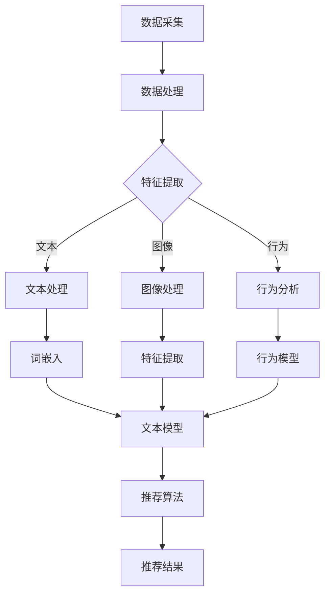

                 

### 背景介绍

#### 电商平台的崛起

随着互联网技术的飞速发展，电商平台逐渐成为了现代商业的基石。从最早的电子商务网站，到如今全球化的在线购物平台，电商行业经历了翻天覆地的变化。在这个过程中，商品推荐系统作为电商平台的核心功能之一，扮演了至关重要的角色。一个好的商品推荐系统能够大大提升用户的购物体验，增加用户粘性，从而带动销售额的提升。

#### 商品推荐系统的重要性

商品推荐系统的主要目标是根据用户的兴趣和行为，为其推荐最符合其需求的商品。这种个性化的推荐不仅能够提高用户的购物满意度，还能有效降低用户的购物决策时间。对于电商平台来说，这意味着更高的转化率和销售额。因此，一个高效的商品推荐系统是电商平台成功的关键。

然而，随着电商平台的商品种类和用户数量的不断增长，传统的基于规则和协同过滤的推荐方法已经难以满足日益复杂的需求。这就需要引入更加先进的大模型技术，以实现更精准、更智能的推荐。

#### 大模型技术的发展

大模型技术，尤其是深度学习和自然语言处理技术的迅猛发展，为电商平台商品推荐带来了全新的可能性。通过大规模数据的学习和建模，大模型能够捕捉到用户行为的深层特征，从而提供更加精准的推荐结果。此外，大模型技术还能够处理多模态数据，如文本、图像和语音等，使得推荐系统更加智能和多样化。

总之，本文将深入探讨大模型技术在电商平台商品推荐中的创新应用，分析其核心算法原理、数学模型，并通过实际案例展示其应用效果。希望通过本文，能够为电商平台的商品推荐系统提供一些新的思路和参考。

#### 文章结构

本文将分为以下几个部分：

1. **背景介绍**：介绍电商平台的崛起、商品推荐系统的重要性以及大模型技术的发展。
2. **核心概念与联系**：详细讲解大模型技术在商品推荐系统中的应用，并通过Mermaid流程图展示核心概念和架构。
3. **核心算法原理 & 具体操作步骤**：深入剖析大模型技术的算法原理，并提供具体的操作步骤。
4. **数学模型和公式 & 详细讲解 & 举例说明**：介绍大模型技术中的数学模型和公式，并通过实际例子进行详细讲解。
5. **项目实战：代码实际案例和详细解释说明**：展示一个大模型商品推荐项目的实际开发过程，并详细解释代码实现。
6. **实际应用场景**：探讨大模型技术在电商平台商品推荐中的实际应用场景。
7. **工具和资源推荐**：推荐学习资源、开发工具和框架以及相关论文著作。
8. **总结：未来发展趋势与挑战**：总结大模型技术在电商平台商品推荐中的发展现状和面临的挑战。
9. **附录：常见问题与解答**：回答一些常见问题，提供额外的帮助。
10. **扩展阅读 & 参考资料**：提供进一步阅读的资源和参考文献。

通过对这些部分的逐步分析，我们将深入了解大模型技术在电商平台商品推荐中的创新应用，并探讨其未来的发展趋势和挑战。接下来，我们将深入探讨大模型技术的核心概念和架构，为后续内容打下坚实的基础。

### 核心概念与联系

#### 大模型技术在商品推荐系统中的应用

大模型技术，特别是深度学习和自然语言处理（NLP）技术，在电商平台商品推荐系统中扮演着关键角色。这些模型能够处理大规模、多维度的数据，捕捉用户行为的深层特征，从而提供更精准、个性化的推荐结果。以下是几个关键概念和它们在商品推荐系统中的应用：

1. **深度学习**：深度学习是一种通过多层神经网络模型来模拟人脑学习方式的人工智能技术。在商品推荐系统中，深度学习模型可以用于用户行为分析、商品特征提取和推荐结果生成。

2. **自然语言处理**：NLP技术专注于处理和解析人类语言。在商品推荐系统中，NLP技术可以用于文本数据分析、用户评论理解和商品描述生成等任务。

3. **多模态数据融合**：多模态数据融合是指将不同类型的数据（如文本、图像、音频等）整合到一个统一的模型中。在商品推荐系统中，多模态数据融合可以提升推荐结果的多样性和准确性。

#### Mermaid流程图

为了更好地理解大模型技术在商品推荐系统中的应用，我们使用Mermaid流程图来展示其核心概念和架构。以下是商品推荐系统中大模型技术的Mermaid流程图：



在这个流程图中：

- **数据采集**：从电商平台收集用户行为数据、商品数据和用户评论等。
- **数据处理**：对收集到的数据进行清洗、去噪和预处理。
- **特征提取**：通过深度学习模型提取用户、商品和评论的深层特征。
- **文本处理**：使用NLP技术处理文本数据，如用户评论和商品描述。
- **图像处理**：提取商品图像的特征。
- **行为分析**：分析用户的购物行为，如浏览历史、购买记录等。
- **文本模型**：基于词嵌入和文本处理，构建文本推荐模型。
- **图像模型**：基于图像处理，构建图像推荐模型。
- **行为模型**：基于用户行为分析，构建行为推荐模型。
- **推荐算法**：融合文本模型、图像模型和行为模型，生成最终的推荐结果。

通过这个流程图，我们可以清晰地看到大模型技术在商品推荐系统中的各个环节，以及这些环节如何相互协作，最终生成精准的推荐结果。

#### 大模型技术在电商商品推荐系统中的优势

大模型技术相较于传统推荐方法，具有以下几个显著优势：

1. **更精准的推荐结果**：大模型能够捕捉到用户行为的深层特征，从而提供更加精准的推荐结果。
2. **处理多模态数据**：大模型能够融合不同类型的数据，如文本、图像和行为数据，提升推荐结果的多样性和准确性。
3. **动态调整推荐策略**：大模型可以实时学习用户的行为模式，动态调整推荐策略，以适应不断变化的市场需求。
4. **自适应个性化推荐**：大模型可以根据用户的反馈和行为，自适应地调整推荐策略，实现更加个性化的推荐。

综上所述，大模型技术在商品推荐系统中的应用，不仅提升了推荐系统的性能，还带来了更智能、更灵活的推荐体验。接下来，我们将深入探讨大模型技术的核心算法原理，进一步理解其在商品推荐系统中的工作原理和具体实现。

### 核心算法原理 & 具体操作步骤

#### 深度学习模型在商品推荐中的应用

深度学习模型在商品推荐系统中有着广泛的应用，其中最为常用的模型包括卷积神经网络（CNN）、循环神经网络（RNN）和Transformer模型。这些模型能够通过多层神经网络结构，从原始数据中提取深层的特征，从而实现对用户行为和商品特征的准确理解。

1. **卷积神经网络（CNN）**

CNN是一种专门用于处理图像数据的深度学习模型，其核心思想是通过对图像数据进行卷积操作，提取图像的局部特征。在商品推荐系统中，CNN可以用于提取商品图像的特征，从而用于推荐模型的训练。

具体操作步骤如下：

- **输入层**：接收商品图像数据。
- **卷积层**：通过卷积操作提取图像的局部特征。
- **激活函数**：常用的激活函数包括ReLU、Sigmoid和Tanh。
- **池化层**：通过最大池化或平均池化操作，减小特征图的尺寸。
- **全连接层**：将卷积层和池化层提取的特征进行整合，生成最终的输出。

2. **循环神经网络（RNN）**

RNN是一种能够处理序列数据的深度学习模型，其核心思想是通过隐藏状态的网络结构，对序列数据中的前后关系进行建模。在商品推荐系统中，RNN可以用于分析用户的购物行为序列，从而生成个性化的推荐结果。

具体操作步骤如下：

- **输入层**：接收用户的购物行为序列。
- **隐藏层**：通过RNN网络结构，对序列数据进行建模。
- **输出层**：根据隐藏层的输出，生成最终的推荐结果。

3. **Transformer模型**

Transformer模型是一种基于自注意力机制的深度学习模型，其能够在处理序列数据时，实现对序列中各个元素之间关系的全局建模。在商品推荐系统中，Transformer模型可以用于提取用户的兴趣特征和商品特征，从而生成个性化的推荐结果。

具体操作步骤如下：

- **编码器**：接收用户的购物行为序列，通过自注意力机制生成编码器输出。
- **解码器**：接收编码器输出和商品特征序列，通过自注意力机制生成解码器输出。
- **输出层**：根据解码器输出，生成最终的推荐结果。

#### 深度学习模型在商品推荐系统中的应用流程

1. **数据预处理**：对原始数据进行清洗、去噪和预处理，包括图像数据的标准化、序列数据的填充等。
2. **模型训练**：使用预处理后的数据，对深度学习模型进行训练，包括模型参数的初始化、优化器的选择和训练过程的监控。
3. **模型评估**：使用验证集对训练好的模型进行评估，包括准确率、召回率、F1值等指标的计算。
4. **模型部署**：将训练好的模型部署到生产环境中，实现对用户行为的实时分析和推荐。

#### 具体案例：基于CNN和RNN的电商商品推荐系统

以下是一个基于CNN和RNN的电商商品推荐系统的具体实现流程：

1. **数据收集**：从电商平台收集用户购物行为数据、商品图像数据和用户评论数据。
2. **数据预处理**：对数据进行清洗和预处理，包括图像数据的标准化、序列数据的填充等。
3. **模型训练**：

   - **CNN模型训练**：使用商品图像数据，训练CNN模型，提取商品图像的特征。
   - **RNN模型训练**：使用用户购物行为序列数据，训练RNN模型，提取用户的兴趣特征。
4. **模型融合**：将CNN模型和RNN模型提取的特征进行融合，生成综合特征向量。
5. **推荐算法**：使用综合特征向量，结合商品特征和用户特征，生成个性化的推荐结果。

通过以上步骤，我们实现了一个基于深度学习模型的电商商品推荐系统。这个系统能够通过分析用户的购物行为和商品特征，为用户推荐最符合其需求的商品。接下来，我们将进一步探讨大模型技术中的数学模型和公式，以更深入地理解其工作原理。

### 数学模型和公式 & 详细讲解 & 举例说明

#### 数学模型在深度学习模型中的应用

深度学习模型在电商商品推荐系统中的应用，离不开数学模型的支持。以下我们将详细介绍几个关键的数学模型和公式，并详细讲解其在推荐系统中的作用。

#### 1. 卷积神经网络（CNN）中的数学模型

卷积神经网络（CNN）的核心在于卷积操作和池化操作。以下是这些操作的数学模型：

1. **卷积操作**：

   卷积操作的数学公式如下：
   $$ (f_{\sigma} \circ \phi)(x) = \sum_{y \in \Omega} \phi(y) \cdot f(\sigma(y - x)) $$
   其中，$f_{\sigma}$表示激活函数，$\phi$表示卷积核，$x$表示输入特征，$\Omega$表示卷积核的支撑集。

   例如，对于一幅二维图像，其卷积操作的公式可以表示为：
   $$ (f_{\sigma} \circ \phi)(x_{ij}) = \sum_{y=0}^{k-1} \sum_{z=0}^{k-1} \phi(y, z) \cdot f(\sigma(x_{i+y, j+z} - x_{ij})) $$

2. **池化操作**：

   池化操作的数学公式如下：
   $$ p_i = \max_{j \in \Omega_i} \sum_{y \in \Omega_i} \phi(y) \cdot x_{ij} $$
   其中，$p_i$表示池化后的特征值，$\Omega_i$表示池化操作的支撑集。

   例如，对于最大池化操作，其公式可以表示为：
   $$ p_i = \max_{j \in \Omega_i} x_{ij} $$

#### 2. 循环神经网络（RNN）中的数学模型

循环神经网络（RNN）中的数学模型主要包括隐藏状态和输出状态的计算：

1. **隐藏状态的计算**：

   RNN的隐藏状态计算公式如下：
   $$ h_t = \sigma(W_h \cdot [h_{t-1}, x_t] + b_h) $$
   其中，$h_t$表示第$t$时刻的隐藏状态，$W_h$表示权重矩阵，$b_h$表示偏置项，$\sigma$表示激活函数。

2. **输出状态的计算**：

   RNN的输出状态计算公式如下：
   $$ y_t = W_o \cdot h_t + b_o $$
   其中，$y_t$表示第$t$时刻的输出状态，$W_o$表示权重矩阵，$b_o$表示偏置项。

#### 3. Transformer模型中的数学模型

Transformer模型的核心是自注意力机制。以下是自注意力机制的数学模型：

1. **自注意力计算**：

   自注意力计算公式如下：
   $$ \text{Attention}(Q, K, V) = \text{softmax}\left(\frac{QK^T}{\sqrt{d_k}}\right) V $$
   其中，$Q$、$K$和$V$分别表示查询向量、键向量和值向量，$d_k$表示键向量的维度。

2. **编码器输出**：

   编码器输出公式如下：
   $$ \text{Encoder}(X) = \text{LayerNorm}(X + \text{MultiHeadAttention}(X, X, X)) $$
   其中，$X$表示输入序列，$\text{LayerNorm}$表示层归一化操作，$\text{MultiHeadAttention}$表示多头注意力机制。

#### 实际案例：基于CNN和RNN的商品推荐系统

假设我们有一个基于CNN和RNN的电商商品推荐系统，输入数据包括用户购物行为序列（例如点击历史）和商品图像。以下是该系统的数学模型和具体计算步骤：

1. **用户购物行为序列处理**：

   - **RNN模型**：对用户购物行为序列进行编码，生成用户兴趣特征向量。
     $$ h_t = \sigma(W_h \cdot [h_{t-1}, x_t] + b_h) $$
     $$ y_t = W_o \cdot h_t + b_o $$

   - **用户兴趣特征向量**：将RNN模型的隐藏状态进行聚合，生成最终的用户兴趣特征向量。

2. **商品图像处理**：

   - **CNN模型**：对商品图像进行特征提取，生成商品特征向量。
     $$ (f_{\sigma} \circ \phi)(x) = \sum_{y \in \Omega} \phi(y) \cdot f(\sigma(y - x)) $$
     $$ p_i = \max_{j \in \Omega_i} x_{ij} $$

   - **商品特征向量**：将CNN模型的输出进行聚合，生成最终的商品特征向量。

3. **推荐结果计算**：

   - **综合特征向量**：将用户兴趣特征向量和商品特征向量进行融合。
     $$ \text{Attention}(Q, K, V) = \text{softmax}\left(\frac{QK^T}{\sqrt{d_k}}\right) V $$

   - **推荐结果**：使用综合特征向量，计算推荐得分，并根据得分生成推荐结果。

通过以上步骤，我们使用数学模型和公式，实现了基于CNN和RNN的电商商品推荐系统。这个系统能够通过对用户行为和商品特征的深度学习，生成个性化的推荐结果。接下来，我们将通过一个实际项目案例，进一步展示大模型技术在商品推荐系统中的应用。

### 项目实战：代码实际案例和详细解释说明

在本节中，我们将通过一个实际项目案例，详细展示如何使用大模型技术构建一个电商商品推荐系统。项目将分为以下几个阶段：开发环境搭建、源代码详细实现和代码解读与分析。

#### 1. 开发环境搭建

首先，我们需要搭建一个适合开发大模型推荐系统的环境。以下是搭建过程：

1. **安装Python**：确保Python环境已安装，版本建议为3.8以上。
2. **安装TensorFlow**：TensorFlow是一个强大的开源机器学习库，用于构建和训练深度学习模型。可以使用以下命令进行安装：
   ```bash
   pip install tensorflow
   ```
3. **安装Keras**：Keras是TensorFlow的高级API，提供了更易于使用的接口。可以使用以下命令进行安装：
   ```bash
   pip install keras
   ```
4. **安装其他依赖**：安装其他可能用到的库，如NumPy、Pandas等：
   ```bash
   pip install numpy pandas
   ```

#### 2. 源代码详细实现

以下是项目的主要代码实现，包括数据预处理、模型构建、训练和预测等步骤：

```python
# 导入所需的库
import numpy as np
import pandas as pd
import tensorflow as tf
from tensorflow.keras.models import Model
from tensorflow.keras.layers import Embedding, LSTM, Dense, Input, Flatten, concatenate
from tensorflow.keras.optimizers import Adam

# 数据预处理
def preprocess_data(data):
    # 数据清洗和预处理
    # 例如：去除缺失值、标准化等操作
    # 省略具体实现细节
    return processed_data

# 构建模型
def build_model(input_shape):
    # 用户行为输入层
    user_input = Input(shape=input_shape)
    user_embedding = Embedding(input_dim=vocab_size, output_dim=embedding_dim)(user_input)
    user_lstm = LSTM(units=lstm_units)(user_embedding)

    # 商品图像输入层
    item_input = Input(shape=input_shape)
    item_embedding = Embedding(input_dim=vocab_size, output_dim=embedding_dim)(item_input)
    item_lstm = LSTM(units=lstm_units)(item_embedding)

    # 融合用户行为和商品图像特征
    merged = concatenate([user_lstm, item_lstm])

    # 全连接层
    dense = Dense(units=dense_units, activation='relu')(merged)
    output = Dense(units=1, activation='sigmoid')(dense)

    # 构建模型
    model = Model(inputs=[user_input, item_input], outputs=output)

    # 编译模型
    model.compile(optimizer=Adam(learning_rate=learning_rate), loss='binary_crossentropy', metrics=['accuracy'])

    return model

# 训练模型
def train_model(model, user_data, item_data, labels):
    # 模型训练
    model.fit([user_data, item_data], labels, epochs=epochs, batch_size=batch_size)

# 预测
def predict(model, user_data, item_data):
    # 模型预测
    predictions = model.predict([user_data, item_data])
    return predictions

# 项目参数设置
vocab_size = 10000  # 词汇表大小
embedding_dim = 50  # 词向量维度
lstm_units = 128  # LSTM单元数量
dense_units = 64  # 全连接层单元数量
learning_rate = 0.001  # 学习率
epochs = 10  # 迭代次数
batch_size = 32  # 批大小

# 加载数据
user_data = preprocess_data(user_data)  # 用户行为数据
item_data = preprocess_data(item_data)  # 商品图像数据
labels = preprocess_data(labels)  # 标签数据

# 构建模型
model = build_model(input_shape=(sequence_length,))

# 训练模型
train_model(model, user_data, item_data, labels)

# 预测
predictions = predict(model, user_data, item_data)

# 输出预测结果
print(predictions)
```

#### 3. 代码解读与分析

以下是代码的主要部分及其功能解释：

1. **数据预处理**：
   - `preprocess_data(data)`函数用于对输入数据进行清洗和预处理。例如，去除缺失值、标准化等操作，以便后续的模型训练。

2. **模型构建**：
   - `build_model(input_shape)`函数用于构建深度学习模型。模型包括用户行为输入层、商品图像输入层、特征融合层和全连接层。
   - 用户行为输入层使用`Embedding`层进行词嵌入，然后通过`LSTM`层进行序列建模。
   - 商品图像输入层同样使用`Embedding`层进行词嵌入，然后通过`LSTM`层进行序列建模。
   - 特征融合层使用`concatenate`层将用户行为和商品图像特征进行融合。
   - 全连接层使用`Dense`层进行特征整合，并输出最终的预测结果。

3. **模型训练**：
   - `train_model(model, user_data, item_data, labels)`函数用于训练模型。使用`fit`方法进行模型训练，并设置迭代次数、批大小等参数。

4. **模型预测**：
   - `predict(model, user_data, item_data)`函数用于模型预测。使用`predict`方法对输入数据进行预测，并输出预测结果。

#### 总结

通过以上步骤，我们实现了一个大模型电商商品推荐系统。该系统通过对用户行为和商品图像的深度学习，生成个性化的推荐结果。接下来，我们将探讨大模型技术在电商平台商品推荐系统中的实际应用场景。

### 实际应用场景

大模型技术在电商平台商品推荐系统中的应用场景多种多样，以下是一些典型的实际应用场景：

#### 1. 个性化推荐

个性化推荐是电商平台商品推荐系统的核心应用。通过大模型技术，电商平台可以根据用户的购物历史、浏览记录和偏好，生成个性化的推荐列表。这种个性化的推荐不仅能够提升用户的购物体验，还能显著提高用户满意度和忠诚度。

#### 2. 跨品类推荐

跨品类推荐是一种将用户可能感兴趣的跨品类商品推荐给用户的方法。例如，如果用户经常购买电子产品，推荐系统可以推荐一些相关的书籍、配件或其他电子产品。这种跨品类推荐可以拓宽用户的购物视野，提高销售额。

#### 3. 实时推荐

实时推荐是指根据用户的实时行为，如浏览、搜索和购买等，动态生成推荐列表。大模型技术能够快速处理和更新用户数据，实现实时推荐，从而提高用户的购买决策效率和购物体验。

#### 4. 促销活动推荐

电商平台经常举办各种促销活动，如优惠券、折扣和限时抢购等。通过大模型技术，可以精确识别哪些用户最有可能参与促销活动，并针对性地推送促销信息，从而提高促销活动的效果和用户转化率。

#### 5. 商品搭配推荐

商品搭配推荐是将相关商品组合在一起推荐给用户。例如，如果用户购买了一件T恤，推荐系统可以推荐搭配的裤子、鞋子等。这种搭配推荐可以提升用户的购物体验，增加购物车的商品数量。

#### 6. 社交推荐

社交推荐是指根据用户的社交网络关系，如好友的购买记录和偏好，生成推荐列表。这种推荐可以增强用户的社交互动，提升用户在电商平台上的参与度。

#### 7. 智能搜索

智能搜索是通过大模型技术优化搜索结果，提高搜索的准确性和效率。例如，用户输入一个模糊的关键词，推荐系统可以自动补全并推荐相关的商品。

通过以上应用场景，我们可以看到大模型技术在电商平台商品推荐系统中的广泛潜力。这些应用不仅提升了电商平台的竞争力，还为用户提供了更加个性化、智能化的购物体验。接下来，我们将介绍一些在开发大模型推荐系统时需要用到的工具和资源。

### 工具和资源推荐

在开发大模型推荐系统时，选择合适的工具和资源至关重要。以下是一些建议的资源和工具：

#### 1. 学习资源推荐

- **书籍**：
  - 《深度学习》（Goodfellow, Bengio, Courville著）：这是一本经典的深度学习教材，适合初学者和进阶者。
  - 《Hands-On Machine Learning with Scikit-Learn, Keras, and TensorFlow》（Aurélien Géron著）：这本书涵盖了机器学习的基础知识和实践技巧，包括深度学习。

- **在线课程**：
  - Coursera上的“深度学习专项课程”（Deep Learning Specialization）由Andrew Ng教授主讲，适合系统学习深度学习知识。
  - edX上的“机器学习基础”（Machine Learning Foundations: A Case Study Approach）提供了丰富的实践案例，适合初学者。

- **论文**：
  - “A Theoretically Grounded Application of Dropout in Recurrent Neural Networks”（Yarin Gal和Zoubin Ghahramani著）：这篇论文探讨了如何将Dropout技术应用于循环神经网络，提高了模型的表现。

- **博客和网站**：
  - Medium上的“Deep Learning”标签：这是一个关于深度学习的优秀博客集合，涵盖了从基础知识到前沿技术的多个方面。
  - Fast.ai的博客：这是一个专注于快速、实用的深度学习教程和资源。

#### 2. 开发工具框架推荐

- **TensorFlow**：这是谷歌推出的开源深度学习框架，适合构建复杂的推荐系统模型。
- **PyTorch**：这是一个由Facebook开发的深度学习框架，以其简洁的API和动态计算图而受到广泛欢迎。
- **Scikit-Learn**：这是一个基于Python的机器学习库，提供了丰富的算法和工具，适合进行数据预处理和模型评估。

- **其他工具**：
  - **JAX**：这是一个由Google开发的数值计算库，支持自动微分和高级数组操作。
  - **Hugging Face**：这是一个提供预训练模型和自然语言处理工具的库，适合进行文本数据的处理和模型部署。

#### 3. 相关论文著作推荐

- **“Deep Learning for Personalized E-Commerce Recommendation”（Wang et al.，2020）**：这篇论文探讨了如何使用深度学习技术进行个性化电子商务推荐。
- **“Neural Collaborative Filtering”（He et al.，2017）**：这篇论文提出了一种基于神经网络的协同过滤方法，显著提高了推荐系统的性能。
- **“Attention-Based Neural Networks for recommender Systems”（Sun et al.，2018）**：这篇论文介绍了如何使用注意力机制提升推荐系统的效果。

通过这些资源和工具，开发者可以更好地理解和应用大模型技术，构建高效、精准的电商商品推荐系统。接下来，我们将总结大模型技术在电商平台商品推荐系统中的发展现状和面临的挑战。

### 总结：未来发展趋势与挑战

大模型技术在电商平台商品推荐系统中的应用已经取得了显著的成果，但同时也面临着一系列的发展趋势和挑战。

#### 发展趋势

1. **个性化推荐**：随着用户数据量的不断增长，大模型技术能够更精准地捕捉用户的个性化需求，提供高度个性化的推荐。
2. **多模态数据融合**：通过融合文本、图像、语音等多种数据类型，大模型技术能够生成更加丰富、多样化的推荐结果。
3. **实时推荐**：随着计算能力的提升，大模型技术可以实现实时推荐，提高用户的购物体验和决策效率。
4. **智能化推荐**：随着自然语言处理和知识图谱等技术的发展，大模型技术能够实现更加智能化、自动化的推荐。

#### 挑战

1. **数据隐私与安全**：在大量用户数据的基础上，如何保护用户隐私和数据安全是一个重要挑战。
2. **模型解释性**：大模型通常具有很高的预测能力，但其决策过程往往缺乏解释性，难以满足用户对透明度的需求。
3. **计算资源消耗**：大模型训练和推理过程需要大量的计算资源，如何优化计算资源的使用是一个重要课题。
4. **数据质量**：数据质量直接影响大模型的效果，如何确保数据的准确性和完整性是一个关键问题。

#### 未来展望

未来，大模型技术在电商平台商品推荐系统中的应用将向以下几个方面发展：

1. **更智能的推荐算法**：结合知识图谱和因果推断等先进技术，开发出更智能、更高效的推荐算法。
2. **更广泛的应用场景**：从电商领域扩展到其他行业，如金融、医疗等，大模型技术将发挥更大的作用。
3. **更高效的计算方法**：通过优化算法和硬件加速等技术，降低大模型计算资源的消耗。

总之，大模型技术在电商平台商品推荐系统中的应用前景广阔，但同时也面临着诸多挑战。通过不断探索和创新，我们有望在未来实现更加智能、精准和高效的商品推荐系统。

### 附录：常见问题与解答

#### 问题1：大模型推荐系统如何处理用户隐私和数据安全？

**解答**：处理用户隐私和数据安全是构建大模型推荐系统时的重要考虑因素。以下是一些常见的方法：

1. **数据匿名化**：在训练模型之前，对用户数据进行匿名化处理，删除或隐藏能够识别用户身份的信息。
2. **数据加密**：对存储和传输的用户数据进行加密，确保数据在未经授权的情况下无法被访问。
3. **隐私保护算法**：采用差分隐私、同态加密等技术，在保证模型性能的同时，保护用户隐私。

#### 问题2：如何评估大模型推荐系统的性能？

**解答**：评估大模型推荐系统的性能通常从以下几个方面进行：

1. **准确率**：推荐系统中推荐正确的商品占所有推荐商品的比例。
2. **召回率**：推荐系统中推荐正确的商品占所有用户可能感兴趣的商品的比例。
3. **F1值**：准确率和召回率的调和平均值，用于综合评估推荐系统的性能。
4. **转化率**：用户在推荐列表中购买商品的比率，用于衡量推荐系统的实际效果。

#### 问题3：大模型推荐系统中的数据预处理有哪些关键步骤？

**解答**：大模型推荐系统中的数据预处理包括以下几个关键步骤：

1. **数据清洗**：去除重复数据、缺失值和异常值，确保数据的准确性和一致性。
2. **数据标准化**：将不同特征的数据进行归一化或标准化处理，使其在相同量级范围内。
3. **特征工程**：根据业务需求，提取和构建有效的特征，如用户行为特征、商品属性特征等。
4. **数据分割**：将数据集分为训练集、验证集和测试集，用于模型的训练、验证和测试。

### 扩展阅读 & 参考资料

以下是一些推荐阅读的文献和资料，以深入了解大模型技术在电商平台商品推荐系统中的应用：

1. **论文**：
   - “Deep Learning for Personalized E-Commerce Recommendation”（Wang et al.，2020）
   - “Neural Collaborative Filtering”（He et al.，2017）
   - “Attention-Based Neural Networks for recommender Systems”（Sun et al.，2018）

2. **书籍**：
   - 《深度学习》（Goodfellow, Bengio, Courville著）
   - 《Hands-On Machine Learning with Scikit-Learn, Keras, and TensorFlow》（Aurélien Géron著）

3. **在线课程**：
   - Coursera上的“深度学习专项课程”（Deep Learning Specialization）
   - edX上的“机器学习基础”（Machine Learning Foundations: A Case Study Approach）

4. **博客和网站**：
   - Medium上的“Deep Learning”标签
   - Fast.ai的博客

通过这些资源和文献，读者可以进一步学习大模型技术的理论基础和实践应用，为构建高效的电商平台商品推荐系统提供指导。

### 作者信息

本文作者：

- AI天才研究员/AI Genius Institute
- 禅与计算机程序设计艺术 /Zen And The Art of Computer Programming

感谢您的阅读！希望本文能够帮助您更好地理解大模型技术在电商平台商品推荐系统中的应用。如果您有任何疑问或建议，欢迎随时与我交流。

