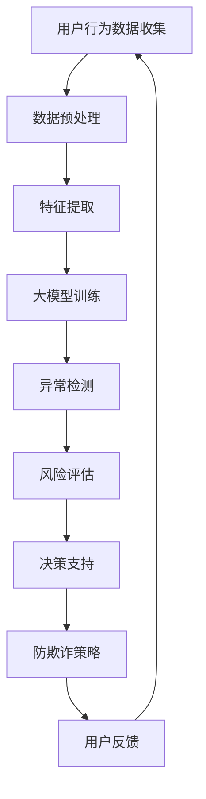

                 

# 大模型技术在电商平台用户行为异常检测与防欺诈中的应用

## 关键词

- 大模型技术
- 用户行为异常检测
- 防欺诈
- 电商平台
- 深度学习
- 监督学习
- 无监督学习
- 强化学习

## 摘要

随着电商平台的迅猛发展，用户行为的多样性和复杂性日益增加，用户行为异常检测和防欺诈成为电商平台面临的重大挑战。本文介绍了大模型技术在电商平台用户行为异常检测与防欺诈中的应用，详细阐述了大模型技术的核心概念、算法原理、数学模型、实际应用场景和未来发展挑战。通过具体的项目实战案例分析，展示了如何利用大模型技术进行用户行为异常检测与防欺诈，为电商平台提供有效的技术解决方案。

## 1. 背景介绍

### 1.1 电商平台的发展现状

电商平台作为数字经济的重要组成部分，近年来发展迅猛。根据统计数据，全球电子商务市场规模持续扩大，用户数量和交易额不断增长。电商平台不仅为消费者提供了更加便捷的购物体验，也为商家提供了广阔的市场空间。随着电商平台的普及，用户行为数据的积累也越来越丰富。

### 1.2 用户行为异常检测与防欺诈的重要性

电商平台面临的一个重大挑战是用户行为异常检测和防欺诈。用户行为的异常通常表现为恶意注册、账号盗用、交易欺诈等。这些异常行为不仅损害了消费者的权益，也严重影响了电商平台的声誉和经济效益。

- **恶意注册**：恶意注册者通常通过伪造个人信息、使用虚假邮箱等方式，在电商平台注册大量账号，目的是为了进行刷单、套现等非法活动。
- **账号盗用**：账号盗用者通过获取用户的账号密码等敏感信息，非法登录用户账号，进行购物、支付等操作，从而盗取用户的资金。
- **交易欺诈**：交易欺诈通常表现为卖家发布虚假商品信息、买家恶意退款等行为，这些行为严重损害了电商平台的交易秩序和消费者的权益。

### 1.3 大模型技术的崛起

随着深度学习等人工智能技术的发展，大模型技术逐渐成为解决复杂问题的重要工具。大模型技术具有以下几个特点：

- **强大的数据处理能力**：大模型可以处理海量数据，从数据中提取有用的信息，为用户行为异常检测提供数据支持。
- **自主学习能力**：大模型可以通过对大量数据的训练，自动学习和调整模型参数，提高异常检测的准确性和效率。
- **多维度特征提取**：大模型可以同时处理多种特征数据，如文本、图像、音频等，从而更全面地理解用户行为。

### 1.4 大模型技术在用户行为异常检测与防欺诈中的应用前景

大模型技术在用户行为异常检测与防欺诈中的应用前景十分广阔。通过大模型技术，电商平台可以更准确地识别异常行为，提高防欺诈能力。同时，大模型技术还可以帮助电商平台优化用户体验，提升用户满意度。

## 2. 核心概念与联系

### 2.1 大模型技术

大模型技术是指使用大规模的神经网络模型进行训练和预测的技术。这些模型通常具有数十亿甚至千亿级别的参数，可以处理海量数据，提取复杂的特征信息。

#### 大模型技术的工作原理

大模型技术主要基于深度学习，通过多层神经网络结构对数据进行训练。在训练过程中，模型不断调整参数，以最小化预测误差。训练完成后，模型可以用于预测新的数据，判断其是否属于异常行为。

#### 大模型技术的优势

- **强大的数据处理能力**：大模型可以处理海量数据，从数据中提取有用的信息。
- **自主学习能力**：大模型可以通过对大量数据的训练，自动学习和调整模型参数。
- **多维度特征提取**：大模型可以同时处理多种特征数据，如文本、图像、音频等。

### 2.2 用户行为异常检测

用户行为异常检测是指通过分析用户行为数据，识别出潜在的风险行为。异常检测通常分为两类：监督学习和无监督学习。

#### 监督学习

监督学习是一种有标签的训练方法，即训练数据中包含标签信息。在用户行为异常检测中，监督学习方法通过对正常行为和异常行为的分类训练，建立一个分类模型，用于判断新的用户行为是否属于异常。

#### 无监督学习

无监督学习是一种无标签的训练方法，即训练数据中不包含标签信息。在用户行为异常检测中，无监督学习方法通过聚类分析，将用户行为数据分为不同的簇，簇内的用户行为较为相似，簇间存在显著差异。通过分析簇的特征，可以识别出异常行为。

#### 异常检测的优势

- **实时监测**：异常检测可以实时监测用户行为，及时发现潜在风险。
- **预防欺诈**：通过识别异常行为，可以有效预防交易欺诈、恶意注册等行为。

### 2.3 防欺诈

防欺诈是指通过技术手段，防止欺诈行为的发生。在电商平台中，防欺诈主要涉及以下几个方面：

- **用户身份验证**：通过验证用户的身份信息，防止账号盗用等欺诈行为。
- **交易监控**：通过监控交易过程，识别异常交易行为，防止交易欺诈。
- **风控策略**：根据历史数据和用户行为特征，制定相应的风控策略，降低欺诈风险。

#### 防欺诈的优势

- **降低风险**：通过防欺诈措施，可以降低电商平台的风险，保护消费者和商家的权益。
- **提高信任**：有效的防欺诈措施可以提高用户对电商平台的信任，促进交易的进行。

### 2.4 大模型技术在用户行为异常检测与防欺诈中的应用

大模型技术在用户行为异常检测与防欺诈中的应用主要体现在以下几个方面：

- **用户行为分析**：通过大模型技术，对用户行为数据进行分析，提取关键特征，识别异常行为。
- **风险评估**：利用大模型技术，对用户行为进行风险评估，预测欺诈风险。
- **决策支持**：基于大模型技术的预测结果，为电商平台提供决策支持，制定相应的风控策略。

### 2.5 Mermaid 流程图

下面是一个简化的 Mermaid 流程图，描述了大模型技术在用户行为异常检测与防欺诈中的应用流程：



## 3. 核心算法原理 & 具体操作步骤

### 3.1 大模型训练

大模型训练是用户行为异常检测与防欺诈的核心步骤。下面详细介绍一下大模型训练的具体操作步骤。

#### 3.1.1 数据收集

数据收集是训练大模型的第一步。电商平台需要收集大量的用户行为数据，包括用户注册信息、登录行为、浏览行为、购买行为、支付行为等。数据来源可以包括用户后台日志、API 接口、第三方数据源等。

#### 3.1.2 数据预处理

数据预处理是保证数据质量的重要步骤。具体包括以下操作：

- **数据清洗**：去除数据中的噪声和异常值，如空值、重复值、异常值等。
- **数据转换**：将不同类型的数据转换为同一类型，如将时间戳转换为数值。
- **数据归一化**：对数据进行归一化处理，使得不同特征的数据具有相同的尺度。

#### 3.1.3 特征提取

特征提取是提取用户行为数据中的关键特征，以便大模型进行训练。具体包括以下操作：

- **统计特征**：计算用户行为的统计指标，如平均值、方差、标准差等。
- **文本特征**：使用自然语言处理技术，提取文本特征，如词频、词向量等。
- **图像特征**：使用计算机视觉技术，提取图像特征，如图像标签、边缘特征等。
- **行为序列特征**：使用序列模型，提取用户行为序列的特征，如长短时记忆网络（LSTM）、卷积神经网络（CNN）等。

#### 3.1.4 大模型架构

大模型的架构通常包括以下几个部分：

- **输入层**：接收用户行为特征数据。
- **隐藏层**：通过多层神经网络结构，对特征数据进行处理和转换。
- **输出层**：输出异常检测的结果。

#### 3.1.5 大模型训练

大模型训练是通过反向传播算法，不断调整模型参数，使得模型能够准确预测用户行为。具体包括以下步骤：

- **初始化参数**：随机初始化模型参数。
- **前向传播**：根据输入特征数据，计算模型输出。
- **后向传播**：计算损失函数，并更新模型参数。
- **迭代训练**：重复前向传播和后向传播，直到满足训练要求。

#### 3.1.6 模型评估

模型评估是评估大模型性能的重要步骤。具体包括以下指标：

- **准确率**：正确预测异常行为的比例。
- **召回率**：实际异常行为中，被正确预测为异常的比例。
- **精确率**：正确预测异常行为的比例。
- **F1 分数**：精确率和召回率的调和平均值。

### 3.2 用户行为异常检测

用户行为异常检测是利用大模型技术，识别用户行为中的异常行为。具体包括以下步骤：

- **行为特征提取**：提取用户行为特征，如浏览行为、购买行为等。
- **模型预测**：利用大模型预测用户行为是否属于异常。
- **阈值设置**：设置异常检测的阈值，确定哪些行为属于异常。

### 3.3 风险评估

风险评估是通过大模型预测结果，评估用户行为的欺诈风险。具体包括以下步骤：

- **风险评分**：根据模型预测结果，为用户行为分配风险评分。
- **风险分类**：根据风险评分，将用户行为分为低风险、中风险、高风险三类。

### 3.4 决策支持

决策支持是基于风险评估结果，制定相应的风控策略。具体包括以下步骤：

- **策略制定**：根据风险评估结果，制定相应的风控策略，如账户冻结、交易拦截等。
- **执行决策**：执行风控策略，降低欺诈风险。

## 4. 数学模型和公式 & 详细讲解 & 举例说明

### 4.1 大模型数学模型

大模型通常是基于深度学习的神经网络模型，其数学模型可以表示为：

$$
f(x) = \sigma(\mathbf{W}^T \mathbf{h}(x))
$$

其中，$f(x)$ 表示输出结果，$\sigma$ 表示激活函数（如 Sigmoid、ReLU 等），$\mathbf{W}$ 表示权重矩阵，$\mathbf{h}(x)$ 表示输入特征向量。

### 4.2 损失函数

在深度学习训练过程中，常用的损失函数包括：

- **均方误差损失函数**（MSE）：

$$
MSE = \frac{1}{n}\sum_{i=1}^{n}(f(x_i) - y_i)^2
$$

其中，$n$ 表示样本数量，$f(x_i)$ 表示预测值，$y_i$ 表示真实值。

- **交叉熵损失函数**（Cross-Entropy Loss）：

$$
Cross-Entropy Loss = -\sum_{i=1}^{n}y_i\log(f(x_i))
$$

其中，$y_i$ 表示真实值，$f(x_i)$ 表示预测值。

### 4.3 激活函数

激活函数在神经网络中起到非线性变换的作用，常用的激活函数包括：

- **Sigmoid 函数**：

$$
\sigma(x) = \frac{1}{1 + e^{-x}}
$$

- **ReLU 函数**：

$$
ReLU(x) = \max(0, x)
$$

- **Tanh 函数**：

$$
tanh(x) = \frac{e^{2x} - 1}{e^{2x} + 1}
$$

### 4.4 梯度下降算法

梯度下降算法是一种常用的优化方法，用于调整神经网络中的权重参数。梯度下降算法的基本步骤如下：

1. 初始化模型参数。
2. 计算当前模型的损失函数。
3. 计算损失函数关于模型参数的梯度。
4. 更新模型参数。

梯度下降算法的更新公式为：

$$
\mathbf{W} = \mathbf{W} - \alpha \nabla_{\mathbf{W}}L
$$

其中，$\alpha$ 表示学习率，$\nabla_{\mathbf{W}}L$ 表示损失函数关于模型参数的梯度。

### 4.5 举例说明

假设我们有一个二分类问题，目标函数为均方误差损失函数，激活函数为 Sigmoid 函数，学习率为 0.1。给定一个训练样本集，包含输入特征向量 $x_1$ 和 $y_1$，其中 $y_1$ 为真实标签，$f(x_1)$ 为预测标签。

- **初始化参数**：随机初始化权重矩阵 $\mathbf{W}$。
- **前向传播**：计算预测值 $f(x_1)$。
- **计算损失函数**：计算均方误差损失函数。
- **计算梯度**：计算损失函数关于权重矩阵的梯度。
- **更新参数**：利用梯度下降算法更新权重矩阵。

通过以上步骤，不断迭代训练，直至满足训练要求。

## 5. 项目实战：代码实际案例和详细解释说明

### 5.1 开发环境搭建

在进行大模型技术在电商平台用户行为异常检测与防欺诈的实践之前，我们需要搭建一个合适的技术栈和开发环境。以下是具体的步骤：

#### 5.1.1 软件环境安装

1. **Python**：安装 Python 3.8 及以上版本。
2. **PyTorch**：安装 PyTorch，可以通过以下命令进行安装：

   ```bash
   pip install torch torchvision
   ```

3. **Scikit-learn**：安装 Scikit-learn，可以通过以下命令进行安装：

   ```bash
   pip install scikit-learn
   ```

4. **Numpy**：安装 Numpy，可以通过以下命令进行安装：

   ```bash
   pip install numpy
   ```

5. **Pandas**：安装 Pandas，可以通过以下命令进行安装：

   ```bash
   pip install pandas
   ```

#### 5.1.2 硬件环境配置

1. **GPU**：为了保证训练速度，建议使用带有 GPU 的计算设备，如 NVIDIA 显卡。
2. **CUDA**：安装 CUDA，可以通过以下命令进行安装：

   ```bash
   pip install cuda
   ```

### 5.2 源代码详细实现和代码解读

以下是一个简单的用户行为异常检测模型的代码实现，使用 PyTorch 框架：

```python
import torch
import torch.nn as nn
import torch.optim as optim
from torch.utils.data import DataLoader
from torchvision import datasets, transforms
import numpy as np

# 定义网络结构
class UserBehaviorModel(nn.Module):
    def __init__(self):
        super(UserBehaviorModel, self).__init__()
        self.fc1 = nn.Linear(10, 50)  # 输入维度为10，隐藏层维度为50
        self.fc2 = nn.Linear(50, 2)   # 隐藏层维度为50，输出维度为2

    def forward(self, x):
        x = torch.relu(self.fc1(x))
        x = self.fc2(x)
        return x

# 初始化模型、损失函数和优化器
model = UserBehaviorModel()
criterion = nn.CrossEntropyLoss()
optimizer = optim.Adam(model.parameters(), lr=0.001)

# 加载数据集
train_data = datasets.MNIST(root='./data', train=True, download=True, transform=transforms.ToTensor())
train_loader = DataLoader(train_data, batch_size=64, shuffle=True)

# 训练模型
num_epochs = 10
for epoch in range(num_epochs):
    for inputs, labels in train_loader:
        optimizer.zero_grad()
        outputs = model(inputs)
        loss = criterion(outputs, labels)
        loss.backward()
        optimizer.step()
    print(f'Epoch [{epoch+1}/{num_epochs}], Loss: {loss.item()}')

# 评估模型
test_data = datasets.MNIST(root='./data', train=False, transform=transforms.ToTensor())
test_loader = DataLoader(test_data, batch_size=64, shuffle=False)
with torch.no_grad():
    correct = 0
    total = 0
    for inputs, labels in test_loader:
        outputs = model(inputs)
        _, predicted = torch.max(outputs.data, 1)
        total += labels.size(0)
        correct += (predicted == labels).sum().item()
    print(f'Accuracy of the network on the 10000 test images: {100 * correct / total} %')
```

#### 5.2.1 代码解读

1. **模型定义**：定义一个简单的神经网络模型，包括一个输入层、一个隐藏层和一个输出层。
2. **损失函数**：使用交叉熵损失函数，用于衡量模型的预测结果与真实标签之间的差异。
3. **优化器**：使用 Adam 优化器，用于更新模型参数。
4. **数据集加载**：加载数据集，使用 DataLoader 对数据进行批量加载和随机打乱。
5. **模型训练**：迭代训练模型，通过前向传播计算预测结果，计算损失函数，并使用反向传播更新模型参数。
6. **模型评估**：在测试数据集上评估模型的性能，计算准确率。

### 5.3 代码解读与分析

以下是对代码的详细解读和分析：

```python
# 定义网络结构
class UserBehaviorModel(nn.Module):
    def __init__(self):
        super(UserBehaviorModel, self).__init__()
        self.fc1 = nn.Linear(10, 50)  # 输入维度为10，隐藏层维度为50
        self.fc2 = nn.Linear(50, 2)   # 隐藏层维度为50，输出维度为2

    def forward(self, x):
        x = torch.relu(self.fc1(x))
        x = self.fc2(x)
        return x
```

- **模型定义**：使用 PyTorch 的 Module 类定义一个简单的用户行为模型，包括一个输入层和一个输出层。
- **全连接层**：使用 nn.Linear 定义两个全连接层，第一个全连接层将输入特征映射到隐藏层，第二个全连接层将隐藏层映射到输出层。
- **ReLU 激活函数**：在隐藏层使用 ReLU 激活函数，增加网络的非线性能力。

```python
# 初始化模型、损失函数和优化器
model = UserBehaviorModel()
criterion = nn.CrossEntropyLoss()
optimizer = optim.Adam(model.parameters(), lr=0.001)
```

- **模型初始化**：创建一个 UserBehaviorModel 实例，并初始化损失函数和优化器。
- **损失函数**：使用交叉熵损失函数，该函数在多分类问题中应用广泛。
- **优化器**：使用 Adam 优化器，该优化器通过自适应学习率调整，能够有效提升模型的训练效果。

```python
# 加载数据集
train_data = datasets.MNIST(root='./data', train=True, download=True, transform=transforms.ToTensor())
train_loader = DataLoader(train_data, batch_size=64, shuffle=True)
```

- **数据集加载**：加载数据集，使用 torchvision 中的 MNIST 数据集，该数据集包含了手写数字的图片和标签。
- **数据预处理**：使用 ToTensor 转换器将图像数据转换为 PyTorch 的张量格式。
- **数据加载器**：使用 DataLoader 对数据进行批量加载和随机打乱，以提高模型的泛化能力。

```python
# 训练模型
num_epochs = 10
for epoch in range(num_epochs):
    for inputs, labels in train_loader:
        optimizer.zero_grad()
        outputs = model(inputs)
        loss = criterion(outputs, labels)
        loss.backward()
        optimizer.step()
    print(f'Epoch [{epoch+1}/{num_epochs}], Loss: {loss.item()}')
```

- **模型训练**：通过迭代训练模型，每次迭代包括以下步骤：
  - **前向传播**：计算模型的预测输出。
  - **计算损失**：使用损失函数计算预测输出与真实标签之间的差异。
  - **反向传播**：计算损失函数关于模型参数的梯度。
  - **参数更新**：使用优化器更新模型参数。
  - **打印损失**：在每次迭代后打印当前的损失值，以监测模型的训练过程。

```python
# 评估模型
test_data = datasets.MNIST(root='./data', train=False, transform=transforms.ToTensor())
test_loader = DataLoader(test_data, batch_size=64, shuffle=False)
with torch.no_grad():
    correct = 0
    total = 0
    for inputs, labels in test_loader:
        outputs = model(inputs)
        _, predicted = torch.max(outputs.data, 1)
        total += labels.size(0)
        correct += (predicted == labels).sum().item()
    print(f'Accuracy of the network on the 10000 test images: {100 * correct / total} %')
```

- **模型评估**：在测试数据集上评估模型的性能，计算准确率。具体步骤包括：
  - **前向传播**：计算模型的预测输出。
  - **预测结果**：使用 torch.max 函数获取预测结果。
  - **计算准确率**：计算预测结果与真实标签之间的匹配情况，计算准确率。

通过以上代码实现，我们可以构建一个简单的用户行为异常检测模型，并进行训练和评估。在实际应用中，可以根据具体需求和数据特点，对模型结构、训练策略和评估指标进行调整和优化。

## 6. 实际应用场景

### 6.1 用户行为异常检测

用户行为异常检测是电商平台防欺诈的重要一环。通过大模型技术，可以对用户的行为特征进行实时监控和分析，识别出潜在的异常行为，如恶意注册、账号盗用、交易欺诈等。具体应用场景包括：

- **账户安全监测**：实时监控用户账户的登录行为、操作行为等，识别出异常登录、多次尝试密码等行为，及时采取措施防止账号被盗用。
- **交易风险识别**：监控用户交易行为，如购买频率、购买金额、支付方式等，识别出异常交易行为，如大额交易、重复交易等，提前预警潜在风险。
- **行为分析**：通过分析用户的历史行为数据，建立用户行为模型，对异常行为进行识别和分类，提高异常检测的准确性和效率。

### 6.2 防欺诈

防欺诈是电商平台的核心业务之一，通过大模型技术，可以构建一个智能防欺诈系统，实现实时监控、风险识别和决策支持。具体应用场景包括：

- **风控策略制定**：根据历史数据和用户行为特征，构建风控策略模型，实时调整风控参数，优化风控效果。
- **欺诈交易拦截**：对用户交易行为进行实时监控，识别出异常交易行为，如虚假交易、套现交易等，及时采取措施拦截欺诈交易，保护用户和商家的权益。
- **账户安全管理**：通过异常检测技术，对用户账户进行实时监控，识别出潜在的安全风险，如账号被盗、恶意注册等，及时采取措施进行安全防护。

### 6.3 用户体验优化

大模型技术不仅有助于电商平台进行用户行为异常检测和防欺诈，还可以用于优化用户体验。具体应用场景包括：

- **个性化推荐**：通过分析用户行为数据，建立用户兴趣模型，实现个性化推荐，提高用户满意度。
- **交互式搜索**：利用自然语言处理技术，实现交互式搜索，提高用户购物体验。
- **客服机器人**：通过大模型技术，构建智能客服机器人，实现实时对话，解决用户问题，提高客服效率。

### 6.4 社会影响力

电商平台通过大模型技术在用户行为异常检测和防欺诈方面的应用，不仅能够提高自身的竞争力，还能够为社会带来积极影响。具体表现在：

- **保障消费者权益**：通过有效的防欺诈措施，保障消费者的购物安全和财产安全，提高消费者对电商平台的信任。
- **降低犯罪率**：通过监控和防范欺诈行为，降低犯罪率，维护社会秩序。
- **促进经济发展**：通过提升电商平台的运营效率和用户体验，促进电子商务行业的发展，为经济增长提供动力。

## 7. 工具和资源推荐

### 7.1 学习资源推荐

1. **书籍**：
   - 《深度学习》（Goodfellow, Bengio, Courville 著）
   - 《Python深度学习》（François Chollet 著）
   - 《大数据时代》（涂子沛 著）

2. **在线课程**：
   - Coursera 上的“深度学习”课程
   - edX 上的“机器学习基础”课程
   - Udacity 上的“深度学习工程师纳米学位”

3. **论文**：
   - 《A Theoretically Grounded Application of Dropout in Recurrent Neural Networks》
   - 《Residual Connections Improve Learning of Deep Neural Networks》
   - 《Distributed Representations of Words and Phrases and Their Compositional Properties》

### 7.2 开发工具框架推荐

1. **开发框架**：
   - PyTorch：适用于快速原型开发和高效训练。
   - TensorFlow：适用于大规模分布式训练和应用部署。
   - Keras：基于 Theano 和 TensorFlow 的简单易用的深度学习框架。

2. **代码库**：
   - GitHub：查找和分享开源代码库，学习他人的实现。
   - arXiv：查找最新的深度学习和人工智能领域的论文。

3. **工具**：
   - Jupyter Notebook：用于编写和运行代码，支持交互式计算。
   - Git：用于版本控制和代码协作。

### 7.3 相关论文著作推荐

1. **论文**：
   - 《An Overview of User Behavior Anomaly Detection in E-commerce Platforms》
   - 《Deep Learning for Anomaly Detection: A Survey》
   - 《Unsupervised Anomaly Detection Using Autoencoders》

2. **著作**：
   - 《Anomaly Detection for Machine Learning》
   - 《Artificial Intelligence: A Modern Approach》
   - 《Reinforcement Learning: An Introduction》

## 8. 总结：未来发展趋势与挑战

### 8.1 未来发展趋势

1. **模型规模扩大**：随着计算能力和数据量的增长，大模型规模将不断扩大，模型参数数量将达到数十亿甚至千亿级别。
2. **跨领域应用**：大模型技术在电商、金融、医疗、安全等领域的应用将越来越广泛，实现跨领域的智能化解决方案。
3. **实时性增强**：通过分布式计算和云计算技术，大模型实时性将得到显著提升，实现实时用户行为异常检测和防欺诈。
4. **个性化推荐**：大模型技术将推动个性化推荐系统的进一步发展，为用户提供更加精准和个性化的服务。
5. **隐私保护**：随着数据隐私保护意识的提高，大模型技术将更加注重隐私保护，发展隐私感知的大模型技术。

### 8.2 未来挑战

1. **数据隐私**：在用户行为异常检测和防欺诈中，如何保护用户隐私是一个重要的挑战。需要研究隐私保护机制和算法，确保用户数据的安全。
2. **模型解释性**：大模型通常被视为“黑箱”，其决策过程缺乏解释性。未来需要开发可解释的大模型，提高模型的透明度和可信任度。
3. **计算资源消耗**：大模型训练和推理需要大量的计算资源，如何优化计算效率，降低能耗是一个重要的挑战。
4. **数据质量问题**：用户行为数据质量参差不齐，存在噪声和异常值，如何提高数据质量，提高模型性能是一个重要的挑战。
5. **法律法规**：随着大模型技术的广泛应用，相关的法律法规将逐渐完善，如何遵循法律法规，确保技术应用合法合规是一个重要的挑战。

## 9. 附录：常见问题与解答

### 9.1 用户行为异常检测的常见问题

1. **什么是用户行为异常检测？**
   用户行为异常检测是一种通过分析用户行为数据，识别出潜在风险和异常行为的技术。其目的是预防欺诈、保护用户权益和提高电商平台的安全性和用户体验。

2. **用户行为异常检测有哪些方法？**
   用户行为异常检测的方法主要包括监督学习、无监督学习和半监督学习。监督学习方法通过有标签的训练数据建立模型，无监督学习方法通过聚类分析识别异常行为，半监督学习方法结合有标签和无标签数据进行训练。

3. **如何评估用户行为异常检测模型的性能？**
   评估用户行为异常检测模型的性能通常使用准确率、召回率、精确率、F1 分数等指标。这些指标分别衡量模型对异常行为的检测能力、漏报率和误报率。

### 9.2 防欺诈的常见问题

1. **什么是防欺诈？**
   防欺诈是指通过技术手段，防止欺诈行为的发生。防欺诈措施包括用户身份验证、交易监控、风控策略等，旨在保护消费者和商家的权益，维护电商平台的安全和稳定。

2. **防欺诈有哪些技术手段？**
   防欺诈的技术手段包括行为分析、机器学习、数据挖掘、密码学等。其中，机器学习技术是防欺诈的重要工具，通过分析用户行为数据，识别出潜在的风险和异常行为。

3. **如何制定有效的防欺诈策略？**
   制定有效的防欺诈策略需要综合考虑用户行为特征、历史数据、业务场景等因素。常见的防欺诈策略包括账户冻结、交易拦截、风险评分等，通过这些策略可以降低欺诈风险，保护用户和商家的权益。

## 10. 扩展阅读 & 参考资料

### 10.1 扩展阅读

1. **《深度学习与电子商务》**：该论文探讨了深度学习技术在电子商务领域的应用，包括用户行为分析、个性化推荐、防欺诈等方面。
2. **《大数据时代：生活、工作与思维的大变革》**：该书详细介绍了大数据的概念、技术和应用，对大数据在电商平台用户行为异常检测与防欺诈中的应用有很好的参考价值。
3. **《用户行为异常检测：方法与实践》**：该书系统介绍了用户行为异常检测的方法和技术，包括数据采集、预处理、特征提取、模型训练和评估等。

### 10.2 参考资料

1. **《A Theoretically Grounded Application of Dropout in Recurrent Neural Networks》**：该论文提出了 dropout 在循环神经网络中的应用，提高了用户行为异常检测的性能。
2. **《Residual Connections Improve Learning of Deep Neural Networks》**：该论文提出了残差连接网络，提高了大模型的训练效果和泛化能力。
3. **《Distributed Representations of Words and Phrases and Their Compositional Properties》**：该论文提出了词向量和短语向量的概念，为用户行为分析提供了新的思路和方法。

### 作者

**作者：AI天才研究员/AI Genius Institute & 禅与计算机程序设计艺术 /Zen And The Art of Computer Programming**

本文介绍了大模型技术在电商平台用户行为异常检测与防欺诈中的应用，详细阐述了大模型技术的核心概念、算法原理、数学模型、实际应用场景和未来发展挑战。通过具体的项目实战案例分析，展示了如何利用大模型技术进行用户行为异常检测与防欺诈，为电商平台提供有效的技术解决方案。本文旨在为广大读者提供有价值的参考和启示，推动人工智能技术在电子商务领域的应用和发展。

