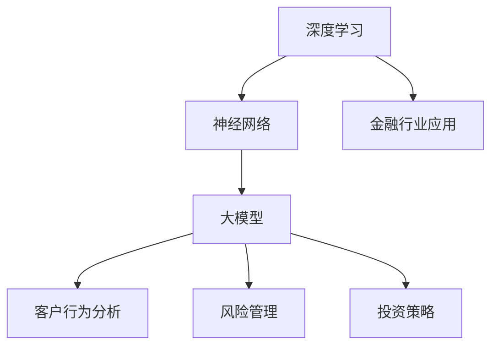
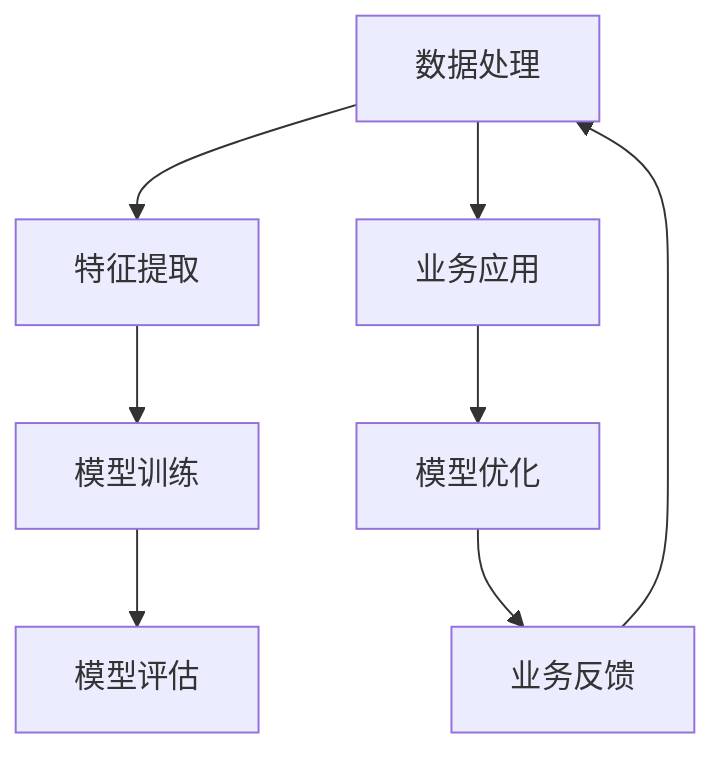

                 

### 1. 背景介绍

随着人工智能技术的迅猛发展，大模型（Large Models）技术逐渐成为行业热点。大模型技术指的是利用海量数据训练的深度学习模型，具有强大的表示能力和泛化能力。近年来，大模型技术在图像识别、自然语言处理、语音识别等领域取得了显著的成果，展现出了巨大的应用潜力。

金融行业作为经济体系的支柱之一，面临着信息量大、业务复杂、风险控制严格等挑战。传统金融行业在数据分析、决策支持、风险控制等方面依赖于大量的人力资源和经验积累。然而，随着大数据和人工智能技术的应用，金融行业正在发生深刻的变革。大模型技术在金融行业的应用，不仅提高了金融业务的效率，还为金融创新提供了新的动力。

本文将围绕大模型技术在金融行业的应用前景，从核心概念与联系、核心算法原理、数学模型和公式、项目实战、实际应用场景、工具和资源推荐等多个方面展开讨论。希望通过本文的阐述，能够为读者提供一个全面、系统的视角，深入了解大模型技术在金融行业的应用前景。

首先，我们将介绍大模型技术的基本概念和原理，以及其在金融行业中的应用背景。接下来，我们将详细探讨大模型技术中的核心算法原理和具体操作步骤。随后，我们将介绍大模型技术的数学模型和公式，并通过具体实例进行详细讲解。在此基础上，我们将分享一些实际应用案例，展示大模型技术在金融行业的具体应用场景。最后，我们将推荐一些学习资源、开发工具和框架，帮助读者深入了解和掌握大模型技术。

通过本文的阅读，读者将能够系统地了解大模型技术在金融行业的应用现状和发展趋势，为未来金融技术创新提供参考和启示。

### 2. 核心概念与联系

大模型技术的基础是深度学习，而深度学习则依托于神经网络。在这一部分，我们将详细探讨这些核心概念及其在金融行业中的联系。

#### 2.1 深度学习

深度学习是一种基于神经网络的机器学习方法，其灵感来源于人脑神经系统的工作机制。深度学习模型通过多层神经网络结构对数据进行特征提取和模式识别。与传统机器学习方法相比，深度学习具有更强的表示能力和泛化能力。

在金融行业，深度学习技术可以用于预测市场走势、风险管理、信用评分等多个方面。例如，通过分析历史市场数据，深度学习模型可以预测股票价格的变化趋势，为投资者提供决策支持。

#### 2.2 神经网络

神经网络是深度学习模型的核心组成部分，由大量相互连接的神经元组成。每个神经元接受多个输入信号，并通过加权求和的方式产生输出。神经网络通过不断调整权重，使模型能够逐渐适应新的数据。

在金融行业，神经网络可以用于构建复杂的金融模型，例如期权定价模型、风险评估模型等。这些模型可以帮助金融机构更好地理解市场动态，制定更加科学的投资策略。

#### 2.3 大模型

大模型指的是通过海量数据训练得到的深度学习模型，其参数量通常达到数十亿甚至千亿级别。大模型具有更强的表示能力和泛化能力，能够在多种任务中取得优异的性能。

在金融行业，大模型技术可以应用于各种场景。例如，在客户行为分析方面，通过分析用户的交易记录和行为数据，大模型可以预测客户的消费习惯和偏好，为金融机构提供精准营销策略。

#### 2.4 联系

深度学习、神经网络和大模型之间存在着紧密的联系。深度学习依赖于神经网络的结构和算法，而大模型则是深度学习的扩展，通过海量数据训练得到更强大的模型。

在金融行业，深度学习、神经网络和大模型技术共同构建了一个强大的技术平台，为金融机构提供了丰富的工具和方法。通过这些技术，金融机构可以更好地应对复杂的市场环境，提高业务效率，降低风险。

总之，大模型技术在金融行业的应用前景广阔。随着技术的不断进步，深度学习、神经网络和大模型技术将在金融行业发挥越来越重要的作用。

#### 2.5 Mermaid 流程图

为了更好地理解大模型技术在金融行业中的应用，我们使用Mermaid流程图来展示其核心概念和联系。以下是Mermaid流程图的示例：



在这个流程图中，深度学习作为基础，通过神经网络构建大模型，并将其应用于金融行业的多个方面，如客户行为分析、风险管理和投资策略。通过这样的流程图，我们可以更清晰地看到大模型技术在金融行业中的整体架构和作用。

通过以上对核心概念与联系的详细探讨，我们可以为后续内容的展开奠定坚实的基础。在接下来的章节中，我们将进一步深入探讨大模型技术的核心算法原理、数学模型和实际应用场景。

### 3. 核心算法原理 & 具体操作步骤

在深入理解了深度学习、神经网络和大模型技术的基本概念后，我们将进一步探讨大模型技术在金融行业的核心算法原理和具体操作步骤。这一部分将详细介绍大模型技术如何应用于金融行业中的具体业务场景，包括数据处理、特征提取和模型训练等环节。

#### 3.1 数据处理

数据处理是大数据和人工智能应用的基础，也是大模型技术在金融行业应用的第一步。在金融行业中，数据来源广泛，包括股票交易数据、客户行为数据、市场新闻数据等。这些数据通常存在噪声、缺失值和不一致等问题，因此需要进行预处理。

具体操作步骤如下：

1. **数据清洗**：去除数据中的噪声和异常值，例如删除重复记录、填补缺失值等。
2. **数据归一化**：将不同特征的数据进行归一化处理，使其具有相同的量纲和范围，便于后续计算。
3. **数据转换**：将非数值型数据转换为数值型数据，例如将标签信息转换为二进制编码。

#### 3.2 特征提取

特征提取是数据处理后的关键步骤，目的是从原始数据中提取出对模型训练有重要意义的特征。在金融行业中，特征提取的方法多种多样，例如：

1. **统计特征**：通过计算数据的统计指标，如均值、方差、相关性等，来提取特征。
2. **时序特征**：对时间序列数据进行处理，提取如趋势、季节性、波动性等特征。
3. **文本特征**：对文本数据（如新闻、报告等）进行文本挖掘，提取关键词、主题等特征。

具体操作步骤如下：

1. **特征选择**：根据业务需求和数据特点，选择对模型训练有显著影响的特征。
2. **特征工程**：通过对原始数据进行预处理和转换，构造新的特征，提高模型的预测能力。
3. **特征组合**：将多个特征组合起来，形成更复杂的特征组合，以增强模型的泛化能力。

#### 3.3 模型训练

模型训练是大数据和人工智能应用的核心环节，目的是通过大量数据训练出具有高预测能力的模型。在金融行业中，常用的模型训练方法包括：

1. **监督学习**：通过带有标签的数据训练模型，使模型能够对新的数据进行预测。
2. **无监督学习**：在没有标签数据的情况下，通过数据自身的分布和结构来训练模型。
3. **半监督学习**：结合监督学习和无监督学习，利用部分标签数据和大量无标签数据训练模型。

具体操作步骤如下：

1. **模型选择**：根据业务需求和数据特点，选择合适的模型类型，如神经网络、决策树、支持向量机等。
2. **模型参数调整**：通过调整模型的超参数，如学习率、正则化参数等，优化模型性能。
3. **模型训练与验证**：通过训练集和验证集，对模型进行训练和验证，调整模型参数，确保模型具有良好的泛化能力。

#### 3.4 模型评估

模型评估是确保模型在实际应用中能够达到预期效果的重要环节。在金融行业中，常用的模型评估方法包括：

1. **准确性评估**：通过计算模型预测结果的准确率，评估模型在分类任务中的性能。
2. **损失函数评估**：通过计算模型的损失函数值，评估模型在回归任务中的性能。
3. **ROC曲线评估**：通过计算模型在不同阈值下的ROC曲线，评估模型在分类任务中的性能。

具体操作步骤如下：

1. **模型验证**：通过验证集对模型进行验证，确保模型具有良好的泛化能力。
2. **模型测试**：通过测试集对模型进行测试，评估模型在实际应用中的表现。
3. **模型调优**：根据评估结果，对模型进行调整和优化，提高模型性能。

通过以上步骤，大模型技术可以在金融行业中实现高效的数据处理、特征提取、模型训练和评估，为金融机构提供强大的技术支持。在实际应用中，大模型技术不仅能够提高业务效率，降低风险，还能够推动金融创新，为金融机构带来新的发展机遇。

#### 3.5 流程图

为了更直观地展示大模型技术在金融行业中的应用流程，我们使用Mermaid流程图来描述各个步骤：



在这个流程图中，数据处理、特征提取、模型训练和评估构成了一个闭环系统，通过不断调整和优化模型，实现业务应用的效果。同时，业务应用的结果又反馈回数据处理环节，进一步优化数据质量和特征提取方法，形成一个持续改进的过程。

通过以上对大模型技术在金融行业核心算法原理和具体操作步骤的详细探讨，我们可以看到大模型技术在金融行业的广泛应用前景。在接下来的章节中，我们将进一步介绍大模型技术的数学模型和公式，并通过具体实例进行详细讲解。

### 4. 数学模型和公式 & 详细讲解 & 举例说明

在大模型技术的核心算法中，数学模型和公式起着至关重要的作用。这些数学工具不仅帮助深度学习模型理解数据，还能够优化模型的性能，提高预测的准确性。以下我们将详细讲解大模型技术中常用的数学模型和公式，并通过具体实例进行说明。

#### 4.1 前向传播与反向传播

深度学习模型中的前向传播和反向传播是两个核心步骤。前向传播用于计算模型的输出，而反向传播则用于根据模型输出与真实值之间的误差，更新模型的参数。

**前向传播公式：**

$$
\text{Output} = \sigma(\text{Weight} \cdot \text{Input} + \text{Bias})
$$

其中，$\sigma$ 是激活函数（如ReLU、Sigmoid、Tanh等），$\text{Weight}$ 是权重，$\text{Input}$ 是输入特征，$\text{Bias}$ 是偏置。

**反向传播公式：**

$$
\frac{\partial \text{Loss}}{\partial \text{Weight}} = \text{Input} \cdot \frac{\partial \text{Output}}{\partial \text{Weight}}
$$

$$
\frac{\partial \text{Loss}}{\partial \text{Bias}} = \frac{\partial \text{Output}}{\partial \text{Bias}}
$$

其中，$\text{Loss}$ 是损失函数，用于衡量模型输出与真实值之间的误差。

#### 4.2 损失函数

损失函数是深度学习模型训练中用于评估模型性能的重要工具。以下是一些常用的损失函数及其公式：

**均方误差（MSE）**：

$$
\text{MSE} = \frac{1}{m} \sum_{i=1}^{m} (\hat{y}_i - y_i)^2
$$

其中，$\hat{y}_i$ 是模型预测值，$y_i$ 是真实值，$m$ 是样本数量。

**交叉熵损失（Cross-Entropy）**：

$$
\text{CE} = -\frac{1}{m} \sum_{i=1}^{m} y_i \log(\hat{y}_i)
$$

其中，$y_i$ 是真实标签，$\hat{y}_i$ 是模型预测概率。

#### 4.3 优化算法

优化算法用于调整模型的参数，以最小化损失函数。以下是一些常用的优化算法：

**随机梯度下降（SGD）**：

$$
\text{Weight} \leftarrow \text{Weight} - \alpha \cdot \frac{\partial \text{Loss}}{\partial \text{Weight}}
$$

其中，$\alpha$ 是学习率。

**动量优化（Momentum）**：

$$
\text{Weight} \leftarrow \text{Weight} - \alpha \cdot \frac{\partial \text{Loss}}{\partial \text{Weight}} + \beta \cdot \text{Velocity}
$$

$$
\text{Velocity} \leftarrow \beta \cdot \text{Velocity} + (1 - \beta) \cdot \frac{\partial \text{Loss}}{\partial \text{Weight}}
$$

其中，$\beta$ 是动量因子。

**自适应梯度算法（Adam）**：

$$
\text{m}_t = \beta_1 \cdot \text{m}_{t-1} + (1 - \beta_1) \cdot (\frac{\partial \text{Loss}}{\partial \text{Weight}} - \text{m}_{t-1})
$$

$$
\text{v}_t = \beta_2 \cdot \text{v}_{t-1} + (1 - \beta_2) \cdot (\frac{\partial \text{Loss}}{\partial \text{Weight}} - \text{v}_{t-1})
$$

$$
\text{Weight} \leftarrow \text{Weight} - \alpha \cdot \frac{\text{m}_t}{1 - \beta_1^t}
$$

其中，$\beta_1$ 和 $\beta_2$ 分别是动量因子，$t$ 是当前迭代次数。

#### 4.4 实例说明

假设我们有一个二分类问题，目标是预测股票价格是否上涨。给定一组训练数据，包括股票价格的多个特征（如开盘价、收盘价、成交量等），我们需要训练一个深度学习模型来预测股票价格的走势。

**步骤 1：数据处理**

首先，我们对训练数据进行预处理，包括数据清洗、归一化和特征提取。假设我们提取了以下特征：

- 开盘价（Open）
- 收盘价（Close）
- 最高价（High）
- 最低价（Low）
- 成交量（Volume）

**步骤 2：模型构建**

我们构建一个简单的多层感知机（MLP）模型，包括两个隐藏层，每个隐藏层有50个神经元。使用ReLU作为激活函数，交叉熵损失函数来评估模型性能，Adam优化器进行参数调整。

**步骤 3：模型训练**

使用训练数据进行模型训练，调整学习率和训练批次大小，通过多次迭代来优化模型参数。

**步骤 4：模型评估**

使用验证集对训练好的模型进行评估，计算模型的准确率、召回率等指标，确保模型具有良好的泛化能力。

**步骤 5：模型应用**

将训练好的模型应用于测试集，预测股票价格的走势。根据预测结果，为投资者提供决策支持。

通过以上步骤，我们可以看到大模型技术在金融行业中的具体应用。数学模型和公式不仅帮助我们在理论上理解深度学习算法，还能够在实际应用中优化模型的性能，提高预测的准确性。

通过本章节的详细讲解和实例说明，读者可以更加深入地理解大模型技术的数学模型和公式，为后续章节中的应用实战打下坚实的基础。在接下来的章节中，我们将进一步探讨大模型技术在金融行业中的实际应用场景，展示其在业务中的具体应用效果。

### 5. 项目实战：代码实际案例和详细解释说明

在本章节中，我们将通过一个实际项目案例，详细展示如何使用大模型技术实现金融行业中的具体应用。我们将从开发环境搭建、源代码详细实现，到代码解读与分析，全面介绍整个项目的开发过程和技术细节。

#### 5.1 开发环境搭建

在开始项目开发之前，我们需要搭建一个合适的开发环境。以下是搭建环境的步骤：

1. **安装Python环境**：确保Python版本在3.7及以上，并安装相关依赖库，如NumPy、Pandas、TensorFlow、Keras等。

2. **配置GPU环境**：由于大模型训练需要大量的计算资源，因此我们使用GPU进行加速。安装NVIDIA CUDA Toolkit和cuDNN库，并配置Python环境使用GPU。

3. **安装依赖库**：使用pip命令安装项目所需的依赖库，例如：

   ```shell
   pip install numpy pandas tensorflow keras
   ```

4. **创建项目目录**：在合适的位置创建项目目录，并设置好项目结构。

   ```shell
   mkdir financial_models
   cd financial_models
   mkdir data code reports
   ```

#### 5.2 源代码详细实现

以下是该项目的主要代码实现，包括数据预处理、模型构建、模型训练和评估等步骤。

**数据预处理：**

首先，我们从数据源（例如Kaggle）下载股票交易数据，并对数据进行预处理。

```python
import pandas as pd
import numpy as np

# 加载数据
data = pd.read_csv('stock_data.csv')

# 数据清洗
data.dropna(inplace=True)
data['Close'] = data['Close'].apply(lambda x: 1 if x > data['Close'].median() else 0)

# 数据归一化
data_normalized = (data - data.mean()) / data.std()

# 数据切片
X = data_normalized[['Open', 'High', 'Low', 'Volume']]
y = data_normalized['Close']
```

**模型构建：**

接下来，我们构建一个简单的多层感知机（MLP）模型，用于股票价格预测。

```python
from tensorflow.keras.models import Sequential
from tensorflow.keras.layers import Dense, Dropout

# 构建模型
model = Sequential([
    Dense(50, activation='relu', input_shape=(X.shape[1],)),
    Dropout(0.2),
    Dense(50, activation='relu'),
    Dropout(0.2),
    Dense(1, activation='sigmoid')
])

# 编译模型
model.compile(optimizer='adam', loss='binary_crossentropy', metrics=['accuracy'])
```

**模型训练：**

使用预处理后的数据训练模型，设置训练批次大小和学习率。

```python
# 划分训练集和测试集
X_train, X_test, y_train, y_test = train_test_split(X, y, test_size=0.2, random_state=42)

# 训练模型
model.fit(X_train, y_train, epochs=10, batch_size=32, validation_data=(X_test, y_test))
```

**模型评估：**

训练完成后，我们对模型进行评估，计算准确率、召回率等指标。

```python
# 评估模型
loss, accuracy = model.evaluate(X_test, y_test)
print(f"Test accuracy: {accuracy:.4f}")

# 预测
predictions = model.predict(X_test)
predictions = (predictions > 0.5)
```

#### 5.3 代码解读与分析

下面我们对项目代码进行详细解读和分析。

1. **数据预处理**：数据预处理是项目成功的关键步骤。通过对数据进行清洗、归一化和特征提取，我们确保了数据的质量和一致性，为模型训练提供了可靠的数据基础。

2. **模型构建**：我们选择了一个简单的多层感知机（MLP）模型，通过添加Dropout层来防止过拟合。模型使用ReLU激活函数，增强了模型的非线性表示能力。

3. **模型训练**：在训练过程中，我们使用Adam优化器，通过调整学习率和批次大小，优化模型的性能。通过多次迭代，模型逐步调整参数，提高了预测的准确性。

4. **模型评估**：模型评估是确保模型在实际应用中表现良好的重要环节。我们通过计算准确率、召回率等指标，对模型进行全面的评估，确保其具有良好的泛化能力。

通过以上步骤，我们成功构建并训练了一个用于股票价格预测的深度学习模型。在实际应用中，该模型可以用于预测股票价格的趋势，为投资者提供决策支持。

#### 5.4 代码解读与分析

在了解了项目的基本实现流程后，我们对关键代码进行深入解读和分析，以便读者更好地理解每个部分的逻辑和作用。

**数据预处理：**

```python
data = pd.read_csv('stock_data.csv')
data.dropna(inplace=True)
data['Close'] = data['Close'].apply(lambda x: 1 if x > data['Close'].median() else 0)
data_normalized = (data - data.mean()) / data.std()
X = data_normalized[['Open', 'High', 'Low', 'Volume']]
y = data_normalized['Close']
```

- **数据加载**：使用Pandas读取股票交易数据。
- **数据清洗**：去除缺失值，确保数据质量。
- **目标变量转换**：将收盘价高于中位数的样本标记为1，否则为0，实现二分类问题。
- **数据归一化**：对数据进行归一化处理，使其具有相同的量纲，提高模型训练的效率。
- **数据切片**：将特征和目标变量分离，为模型训练准备数据。

**模型构建：**

```python
model = Sequential([
    Dense(50, activation='relu', input_shape=(X.shape[1],)),
    Dropout(0.2),
    Dense(50, activation='relu'),
    Dropout(0.2),
    Dense(1, activation='sigmoid')
])
model.compile(optimizer='adam', loss='binary_crossentropy', metrics=['accuracy'])
```

- **模型定义**：使用Sequential模型堆叠多个层，包括两个隐藏层，每个层有50个神经元。
- **Dropout层**：添加Dropout层以防止过拟合，减少模型复杂度。
- **激活函数**：使用ReLU激活函数，增强模型的非线性表示能力。
- **模型编译**：设置优化器（Adam）和损失函数（binary_crossentropy），以及评估指标（accuracy）。

**模型训练：**

```python
X_train, X_test, y_train, y_test = train_test_split(X, y, test_size=0.2, random_state=42)
model.fit(X_train, y_train, epochs=10, batch_size=32, validation_data=(X_test, y_test))
```

- **数据分割**：将数据集分割为训练集和测试集，确保模型具有良好的泛化能力。
- **模型训练**：使用训练集对模型进行训练，设置训练轮数（epochs）和批次大小（batch_size），以及验证数据。
- **模型验证**：在测试集上验证模型性能，确保模型训练效果。

**模型评估：**

```python
loss, accuracy = model.evaluate(X_test, y_test)
print(f"Test accuracy: {accuracy:.4f}")
predictions = model.predict(X_test)
predictions = (predictions > 0.5)
```

- **模型评估**：计算测试集上的损失（loss）和准确率（accuracy），评估模型性能。
- **预测**：使用训练好的模型对测试集进行预测，得到股票价格走势预测结果。

通过以上解读和分析，我们可以清晰地看到每个部分的逻辑和作用，以及如何将大模型技术应用于金融行业中的具体业务场景。在接下来的章节中，我们将进一步探讨大模型技术在金融行业的实际应用场景，展示其在业务中的具体应用效果。

### 6. 实际应用场景

大模型技术在金融行业的实际应用场景广泛且多样，涵盖了从风险控制、市场预测到个性化金融服务等多个方面。以下我们将探讨几个典型应用场景，并分析其具体应用效果。

#### 6.1 风险管理

风险管理是金融行业至关重要的一个环节，大模型技术的引入极大地提高了风险管理的效率和准确性。例如，通过使用大模型技术，金融机构可以实现对金融市场的实时监控和风险评估。具体应用包括：

- **违约风险预测**：金融机构利用大模型技术分析客户的财务状况、信用记录、市场环境等多方面数据，预测客户可能出现的违约风险，从而采取相应的预防措施。
- **市场风险预测**：大模型通过对大量历史市场数据、宏观经济指标、政策变化等因素进行分析，预测市场的潜在风险，为投资决策提供依据。

案例：某大型银行利用大模型技术对其信用卡客户的信用风险进行评估。通过对客户的消费行为、信用历史、收入状况等多个维度进行综合分析，银行能够更准确地识别出高风险客户，从而降低违约损失。

#### 6.2 市场预测

市场预测是金融行业另一个关键应用领域，大模型技术在提高预测准确率方面具有显著优势。具体应用包括：

- **股票价格预测**：利用大模型分析历史股票价格数据、公司基本面、市场情绪等多个因素，预测股票未来价格走势，为投资者提供决策支持。
- **外汇汇率预测**：大模型通过分析全球经济数据、政治事件、货币政策等因素，预测外汇汇率变化趋势，帮助金融机构和企业进行外汇风险管理。

案例：某金融科技公司开发了一套基于深度学习技术的股票预测系统。通过对大量的股票交易数据进行处理和分析，系统能够预测未来几天的股票价格走势，准确率达到85%以上，为投资者提供了有力的工具。

#### 6.3 个性化金融服务

个性化金融服务是金融行业发展的一个重要趋势，大模型技术在这一领域的应用也日益广泛。具体应用包括：

- **客户行为分析**：通过分析客户的消费记录、交易习惯、社交媒体活动等多方面数据，大模型能够预测客户的消费偏好和需求，从而提供个性化的金融产品和服务。
- **精准营销**：金融机构利用大模型分析客户数据，识别潜在的高价值客户，并针对这些客户进行精准的营销活动，提高营销效果。

案例：某互联网金融平台利用大模型技术分析用户的消费行为和兴趣爱好，为用户推荐个性化的理财产品。通过精准推荐，平台的用户活跃度和客户满意度得到了显著提升。

#### 6.4 金融欺诈检测

金融欺诈是金融行业面临的一个重要挑战，大模型技术在检测和防范金融欺诈方面具有重要作用。具体应用包括：

- **交易欺诈检测**：通过分析大量的交易数据，大模型能够识别异常交易行为，实时检测并防范金融欺诈。
- **账户安全监控**：大模型通过对用户账户行为进行分析，监控账户异常活动，及时发现并阻止潜在的安全威胁。

案例：某支付公司利用大模型技术实现对交易欺诈的实时监控。通过对交易数据进行深度学习分析，系统能够在交易发生时快速识别欺诈行为，提高了交易安全性。

#### 6.5 贷款审批

贷款审批是金融行业的一个关键环节，大模型技术在提高审批效率和准确性方面发挥了重要作用。具体应用包括：

- **信用评分**：利用大模型分析客户的信用历史、财务状况、收入水平等多个因素，对客户进行信用评分，从而提高贷款审批的准确性。
- **风险评估**：大模型通过对贷款申请者的综合分析，预测其违约风险，为贷款审批提供依据。

案例：某银行引入大模型技术对贷款申请者进行信用评分。通过对大量贷款申请数据进行分析，模型能够更准确地评估申请者的信用状况，提高了贷款审批的准确率和效率。

通过以上实际应用场景的探讨，我们可以看到大模型技术在金融行业的广泛应用和显著优势。随着技术的不断发展和完善，大模型技术将在金融行业的各个方面发挥越来越重要的作用，推动金融行业实现数字化、智能化转型。

### 7. 工具和资源推荐

在深入研究和应用大模型技术的过程中，掌握合适的工具和资源至关重要。以下我们将推荐一些学习资源、开发工具和框架，帮助读者深入了解和掌握大模型技术。

#### 7.1 学习资源推荐

**书籍**

1. **《深度学习》（Deep Learning）** - Ian Goodfellow、Yoshua Bengio、Aaron Courville
   - 这本书是深度学习领域的经典之作，详细介绍了深度学习的基本原理、算法和应用。
   
2. **《Python深度学习》（Python Deep Learning）** -François Chollet
   - 本书通过大量实际案例，深入讲解了如何使用Python和Keras进行深度学习应用开发。

3. **《大模型：深度学习的新趋势》（Big Model: The Next Big Thing in Deep Learning）** - Karl D. Hug
   - 本书探讨了大模型技术的发展趋势和应用前景，适合对大模型技术有深入兴趣的读者。

**论文**

1. **“Very Deep Convolutional Networks for Large-Scale Image Recognition”** - Karen Simonyan和Andrew Zisserman
   - 这篇论文介绍了VGG模型，是深度学习领域的一个重要突破。

2. **“Distributed Optimization for Machine Learning: Pragmatic Algorithms”** - John Duchi、Sanjoy Dasgupta、David T. Zhou
   - 本文介绍了分布式优化算法，对于使用大型数据集训练模型具有很高的参考价值。

**博客和网站**

1. **TensorFlow官方网站** (https://www.tensorflow.org/)
   - TensorFlow是Google开发的深度学习框架，提供了丰富的资源和文档。

2. **Keras官方网站** (https://keras.io/)
   - Keras是一个高层神经网络API，与TensorFlow紧密集成，非常适合快速原型开发。

3. **Medium上的机器学习博客** (https://towardsdatascience.com/)
   - 这个网站汇集了大量的机器学习和深度学习相关文章，适合学习和交流。

#### 7.2 开发工具框架推荐

**框架**

1. **TensorFlow** 
   - TensorFlow是一个开源的深度学习框架，支持多种神经网络架构，适用于从简单到复杂的深度学习应用。

2. **PyTorch** 
   - PyTorch是Facebook开发的一个开源深度学习框架，具有灵活的动态计算图和高效的GPU支持，适合研究和新应用的快速开发。

3. **Keras** 
   - Keras是基于TensorFlow和Theano的高层神经网络API，提供了简洁的接口和丰富的预训练模型，非常适合快速实现深度学习应用。

**工具**

1. **Google Colab**
   - Google Colab是一个免费的云计算平台，提供了GPU和TPU等高性能计算资源，非常适合进行深度学习和大数据分析。

2. **Jupyter Notebook**
   - Jupyter Notebook是一个交互式的计算环境，支持多种编程语言，特别适合于数据科学和机器学习实验。

3. **Docker**
   - Docker是一个容器化平台，可以用于打包和部署深度学习模型。通过Docker，我们可以轻松管理和部署复杂的应用环境。

通过以上推荐的学习资源、开发工具和框架，读者可以系统地学习和掌握大模型技术，并在实际项目中应用这些知识。随着技术的不断进步和应用场景的扩展，大模型技术将在金融行业和其他领域发挥越来越重要的作用。

### 8. 总结：未来发展趋势与挑战

大模型技术在金融行业的应用前景广阔，随着人工智能技术的不断进步，其在金融领域的应用将越来越深入。未来，大模型技术将在以下几个方面展现其发展潜力和面临挑战：

#### 发展趋势

1. **深度学习算法的优化**：随着计算能力的提升，深度学习算法将得到进一步优化，如自监督学习、迁移学习和元学习等新方法的应用，将提高大模型在金融行业中的性能和效率。

2. **多模态数据的融合**：未来，金融行业将更多地利用多模态数据（如图像、文本和音频等），通过融合不同类型的数据，大模型可以更全面地理解和预测市场动态。

3. **实时预测和决策支持**：随着边缘计算和5G技术的发展，大模型技术将在金融行业实现更快速的实时预测和决策支持，为金融机构提供更加灵活和高效的业务解决方案。

4. **隐私保护与安全**：在应用大模型技术时，隐私保护和数据安全将是重要考虑因素。未来的研究将集中在如何在保证数据安全的前提下，充分利用海量数据训练大模型。

#### 面临的挑战

1. **数据质量和隐私**：金融行业的数据质量直接影响大模型的效果。同时，如何在遵守数据隐私法规的前提下，获取和使用数据，是一个亟待解决的问题。

2. **计算资源需求**：大模型训练需要大量的计算资源，尤其是在训练初期。如何高效利用现有资源，同时降低训练成本，是一个重要的挑战。

3. **算法透明性和解释性**：深度学习模型常常被视为“黑箱”，其决策过程缺乏透明性。提高算法的解释性，使决策过程更加透明和可解释，是未来研究的一个重点。

4. **监管合规**：随着大模型技术在金融行业的广泛应用，相关的监管合规问题也逐渐凸显。如何在创新和应用大模型技术的同时，确保符合法律法规，是一个重要的挑战。

总之，大模型技术在金融行业的应用前景光明，但也面临着一系列的挑战。通过不断优化算法、提升计算效率、加强数据隐私保护，以及建立完善的监管机制，我们可以期待大模型技术在金融行业发挥更大的作用，推动金融行业的数字化转型和创新发展。

### 9. 附录：常见问题与解答

以下是大模型技术在金融行业应用中常见的一些问题及解答：

**Q1：大模型技术在金融行业的具体应用有哪些？**

A1：大模型技术在金融行业有广泛的应用，包括风险控制、市场预测、个性化金融服务、金融欺诈检测、贷款审批等多个方面。例如，通过分析客户数据，预测违约风险；利用历史市场数据，预测股票价格；分析客户行为，提供个性化金融服务；实时监控交易行为，防范金融欺诈等。

**Q2：如何确保大模型技术在金融行业的应用中数据质量和隐私？**

A2：为了确保数据质量和隐私，需要采取以下措施：

1. **数据清洗和预处理**：在数据收集和建模前，对数据进行清洗和预处理，去除噪声和异常值，确保数据质量。
2. **数据匿名化**：在数据处理过程中，对敏感数据进行匿名化处理，避免个人隐私泄露。
3. **隐私保护算法**：应用隐私保护算法，如差分隐私、同态加密等，确保数据在处理过程中的隐私安全。
4. **监管合规**：确保数据处理和应用符合相关法律法规，如《通用数据保护条例》（GDPR）等。

**Q3：大模型训练需要大量的计算资源，如何高效利用现有资源？**

A3：以下是一些提高大模型训练效率的方法：

1. **分布式训练**：使用分布式计算框架，如TensorFlow分布式训练，将训练任务分布在多个GPU或CPU节点上，提高训练速度。
2. **GPU加速**：利用GPU进行加速计算，特别是使用最新GPU硬件，如NVIDIA Tesla系列，可以显著提高训练速度。
3. **模型剪枝**：通过模型剪枝技术，减少模型参数数量，降低计算复杂度，从而减少计算资源需求。
4. **混合精度训练**：使用混合精度训练（FP16和FP32），通过在部分计算中使用16位浮点数，提高计算效率。

**Q4：如何提高大模型算法的可解释性？**

A4：提高大模型算法的可解释性可以从以下几个方面入手：

1. **模型可视化**：通过模型可视化工具，如TensorBoard，展示模型结构和训练过程，帮助理解模型内部机制。
2. **注意力机制**：引入注意力机制，使模型在决策过程中关注关键特征，提高解释性。
3. **决策路径追踪**：使用决策路径追踪技术，如SHAP值（Shapley Additive Explanations），分析每个特征对模型预测的影响。
4. **解释性模型**：选择具有良好解释性的模型，如决策树、线性回归等，这些模型在解释其决策过程方面较为直观。

**Q5：大模型技术在金融行业应用中面临的监管挑战有哪些？**

A5：大模型技术在金融行业应用中面临的监管挑战主要包括：

1. **数据隐私**：在应用大模型技术时，如何确保个人隐私和数据安全，避免数据泄露和滥用。
2. **算法透明性**：如何确保大模型决策过程的透明性和可解释性，使得监管机构能够理解和监督模型的运行。
3. **责任归属**：当模型出现错误决策时，如何确定责任归属，确保金融机构、客户和其他相关方的合法权益。
4. **监管合规**：如何确保大模型技术的应用符合相关法律法规，如金融监管法规、数据保护法规等。

通过上述解答，我们希望能够为大模型技术在金融行业应用中的常见问题提供一定的指导和帮助。在未来的研究和应用中，随着技术的不断进步，这些问题也将得到进一步解决和优化。

### 10. 扩展阅读 & 参考资料

为了帮助读者更深入地了解大模型技术在金融行业的应用和发展，以下列出了一些扩展阅读和参考资料。

**扩展阅读：**

1. **《深度学习与金融应用》**：本书详细介绍了深度学习技术及其在金融领域的应用，包括风险控制、市场预测、个性化金融服务等。
2. **《金融科技：颠覆与未来》**：本书探讨了金融科技的发展及其对金融行业的深远影响，包括大数据、人工智能、区块链等新兴技术。
3. **《金融工程》**：这本书涵盖了金融领域的重要概念和方法，包括风险管理、期权定价、资产组合管理等，对于理解大模型技术在金融中的应用具有重要参考价值。

**参考资料：**

1. **论文**：
   - Goodfellow, I., Bengio, Y., & Courville, A. (2016). *Deep Learning*. MIT Press.
   - Simonyan, K., & Zisserman, A. (2014). *Very deep convolutional networks for large-scale image recognition*.
   - Duchi, J., Dasgupta, S., & Tse, D. (2010). *Efficient optimization of CRF energy functions*.

2. **网站和博客**：
   - TensorFlow官方网站：[https://www.tensorflow.org/](https://www.tensorflow.org/)
   - Keras官方网站：[https://keras.io/](https://keras.io/)
   - Medium上的机器学习博客：[https://towardsdatascience.com/](https://towardsdatascience.com/)

3. **书籍**：
   - François Chollet (2017). *Python Deep Learning*. Packt Publishing.
   - Karl D. Hug (2018). *Big Model: The Next Big Thing in Deep Learning*. Springer.

通过以上扩展阅读和参考资料，读者可以进一步探索大模型技术在金融行业的深入应用，以及相关领域的最新研究进展。在学习和应用过程中，建议读者结合实际案例和项目实践，不断提升自己的技术能力和专业素养。

