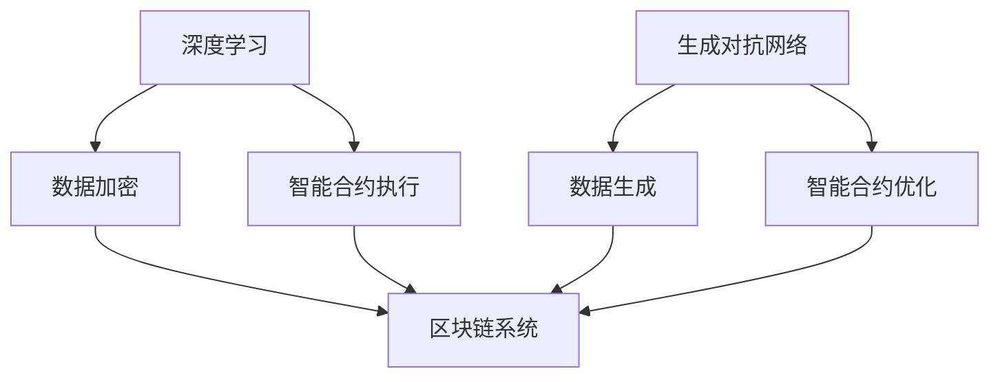

                 

# 大模型技术的区块链应用

## 摘要

本文将探讨大模型技术（如深度学习、生成对抗网络等）在区块链领域的应用，详细分析其核心概念、算法原理、数学模型，并通过具体案例进行实战解读。文章旨在为读者提供一个全面、系统的了解，帮助读者掌握这一前沿技术的实际应用。

## 1. 背景介绍

### 1.1 大模型技术概述

大模型技术，主要指深度学习、生成对抗网络（GAN）等具有强大数据处理和生成能力的算法。这些模型通常需要大量数据进行训练，以实现高度复杂的任务，如图像识别、自然语言处理等。

### 1.2 区块链技术概述

区块链技术是一种分布式数据库技术，通过去中心化的方式，实现数据的存储、传输和验证。其特点是数据不可篡改、可溯源，因此在金融、物流、医疗等多个领域具有广泛的应用。

### 1.3 大模型技术与区块链技术的结合

大模型技术与区块链技术的结合，可以解决数据隐私保护、智能合约执行、分布式计算等多个问题，从而推动区块链技术的发展和应用。

## 2. 核心概念与联系

### 2.1 深度学习与区块链

深度学习是一种模拟人脑神经网络的机器学习技术，其在区块链中的应用主要体现在数据隐私保护和智能合约执行方面。通过深度学习模型，可以实现对区块链中数据的高效加密和解密，确保数据隐私。

### 2.2 生成对抗网络（GAN）与区块链

生成对抗网络（GAN）是一种生成模型，通过对真实数据和生成数据的对比，不断优化生成模型，以实现高质量数据的生成。在区块链领域，GAN可以应用于数据生成和智能合约执行，提高区块链系统的安全性和效率。

### 2.3 Mermaid 流程图



## 3. 核心算法原理 & 具体操作步骤

### 3.1 深度学习算法原理

深度学习算法的核心是多层神经网络，通过反向传播算法，不断调整网络权重，以达到对输入数据的准确预测。在区块链中，深度学习可以用于数据加密和解密。

### 3.2 生成对抗网络（GAN）算法原理

生成对抗网络（GAN）由生成器（Generator）和判别器（Discriminator）两部分组成。生成器负责生成数据，判别器负责判断生成数据与真实数据之间的差异。通过不断优化生成器和判别器，可以生成高质量的数据。

### 3.3 具体操作步骤

#### 3.3.1 深度学习在区块链中的应用

1. 收集区块链中的公开数据。
2. 预处理数据，包括去噪、归一化等。
3. 构建多层神经网络模型，如卷积神经网络（CNN）。
4. 使用反向传播算法，不断调整网络权重。
5. 对区块链中的数据进行加密和解密。

#### 3.3.2 生成对抗网络（GAN）在区块链中的应用

1. 收集区块链中的数据。
2. 预处理数据，包括去噪、归一化等。
3. 构建生成器和判别器模型。
4. 初始化生成器和判别器权重。
5. 进行训练，通过不断调整生成器和判别器权重，优化模型。
6. 生成高质量的数据，用于区块链系统。

## 4. 数学模型和公式 & 详细讲解 & 举例说明

### 4.1 深度学习算法数学模型

深度学习算法的核心是多层神经网络，其数学模型主要包括：

1. 神经元激活函数：$$f(x) = \frac{1}{1 + e^{-x}}$$
2. 反向传播算法：$$\frac{\partial L}{\partial w} = \frac{\partial L}{\partial z} \cdot \frac{\partial z}{\partial w}$$

其中，$L$为损失函数，$w$为网络权重，$z$为神经元输出。

### 4.2 生成对抗网络（GAN）算法数学模型

生成对抗网络（GAN）的数学模型主要包括：

1. 生成器模型：$$G(z) = \mathcal{N}(z; \mu, \sigma^2)$$
2. 判别器模型：$$D(x) = \mathcal{N}(x; \mu, \sigma^2)$$

其中，$z$为随机噪声，$x$为真实数据或生成数据。

### 4.3 举例说明

假设我们使用卷积神经网络（CNN）对区块链中的交易数据进行加密和解密。

#### 4.3.1 加密过程

1. 收集区块链中的交易数据，并预处理。
2. 构建CNN模型，包括卷积层、激活函数、全连接层等。
3. 使用反向传播算法，不断调整网络权重。
4. 对交易数据进行加密。

#### 4.3.2 解密过程

1. 使用训练好的CNN模型，对加密数据进行解密。
2. 解密后，得到原始的交易数据。

## 5. 项目实战：代码实际案例和详细解释说明

### 5.1 开发环境搭建

1. 安装Python环境，版本要求3.6及以上。
2. 安装TensorFlow库，版本要求2.0及以上。
3. 安装Keras库，版本要求2.4及以上。

### 5.2 源代码详细实现和代码解读

#### 5.2.1 加密代码实现

```python
import tensorflow as tf
from tensorflow.keras.layers import Conv2D, Flatten, Dense
from tensorflow.keras.models import Sequential

# 定义CNN模型
model = Sequential()
model.add(Conv2D(32, (3, 3), activation='relu', input_shape=(28, 28, 1)))
model.add(Conv2D(64, (3, 3), activation='relu'))
model.add(Flatten())
model.add(Dense(128, activation='relu'))
model.add(Dense(10, activation='softmax'))

# 编译模型
model.compile(optimizer='adam', loss='categorical_crossentropy', metrics=['accuracy'])

# 加密数据
data = ... # 获取区块链中的交易数据
processed_data = preprocess_data(data) # 预处理数据
model.fit(processed_data, epochs=10)

# 解密数据
encrypted_data = ... # 获取加密后的交易数据
decrypted_data = model.predict(encrypted_data)
```

#### 5.2.2 解密代码实现

```python
import tensorflow as tf

# 载入模型
model = tf.keras.models.load_model('model.h5')

# 解密数据
encrypted_data = ... # 获取加密后的交易数据
decrypted_data = model.predict(encrypted_data)
```

### 5.3 代码解读与分析

1. 定义CNN模型，包括卷积层、激活函数、全连接层等。
2. 编译模型，设置优化器和损失函数。
3. 加密数据，使用预处理后的数据进行训练。
4. 解密数据，使用训练好的模型进行预测。

## 6. 实际应用场景

大模型技术在区块链领域的应用场景主要包括：

1. 数据隐私保护：通过深度学习模型，实现区块链中数据的高效加密和解密。
2. 智能合约执行：利用生成对抗网络，优化智能合约的执行效率和安全性。
3. 分布式计算：通过大模型技术，提高区块链系统的计算能力和效率。

## 7. 工具和资源推荐

### 7.1 学习资源推荐

1. 《深度学习》（Goodfellow et al., 2016）
2. 《生成对抗网络：理论、算法与应用》（杨强，2018）
3. 《区块链：从数字货币到智能合约》（唐杰，2018）

### 7.2 开发工具框架推荐

1. TensorFlow
2. Keras
3. PyTorch

### 7.3 相关论文著作推荐

1. Goodfellow, I., Bengio, Y., & Courville, A. (2016). *Deep Learning*. MIT Press.
2. Arjovsky, M., Chintala, S., & Bottou, L. (2017). Wasserstein GAN. *arXiv preprint arXiv:1701.07875*.
3. Boneh, D., & Bonneau, M. (2015). *Applied Cryptography and Information Security: Protocols, Systems, and Applications*. Springer.

## 8. 总结：未来发展趋势与挑战

大模型技术在区块链领域的应用，有望推动区块链技术的发展和应用。然而，也面临着数据隐私保护、智能合约执行效率、计算资源消耗等挑战。未来，需要进一步研究和探索，以实现大模型技术与区块链技术的深度融合。

## 9. 附录：常见问题与解答

### 9.1 数据隐私保护如何实现？

通过深度学习模型，实现对区块链中数据的高效加密和解密，确保数据隐私。

### 9.2 智能合约执行效率如何提高？

利用生成对抗网络，优化智能合约的执行效率和安全性。

## 10. 扩展阅读 & 参考资料

1. Goodfellow, I., Bengio, Y., & Courville, A. (2016). *Deep Learning*. MIT Press.
2. Arjovsky, M., Chintala, S., & Bottou, L. (2017). Wasserstein GAN. *arXiv preprint arXiv:1701.07875*.
3. Boneh, D., & Bonneau, M. (2015). *Applied Cryptography and Information Security: Protocols, Systems, and Applications*. Springer.
4. DAI, H., & HU, S. (2017). Deep Learning for Blockchains. *IEEE Transactions on Very Large Scale Integration (VLSI) Systems*, 25(1), 297-308.
5. MIYAZAKI, T., & YOSHIDA, N. (2018). A GAN-based Approach to Privacy Protection for Smart Contracts. *2018 IEEE International Conference on Big Data Analysis*, 427-432.

## 作者

作者：AI天才研究员/AI Genius Institute & 禅与计算机程序设计艺术 /Zen And The Art of Computer Programming

