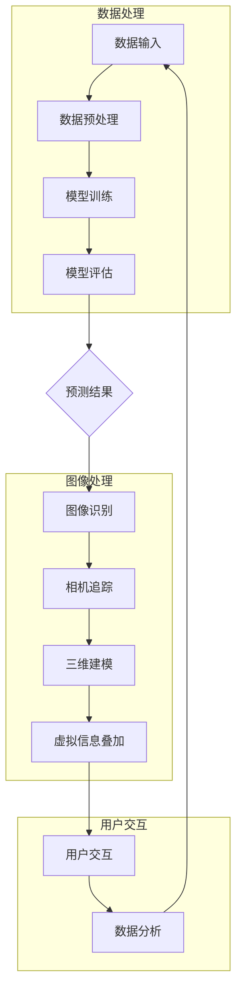

                 

### 背景介绍

#### 大模型技术的定义与发展历程

大模型技术，即大型机器学习模型的技术，是指利用大规模数据集和强大的计算资源训练出具有高度智能和自主学习能力的机器学习模型。这一技术的核心在于模型参数的数量庞大，往往达到数十亿甚至千亿级别。大模型技术最早可以追溯到1980年代的神经网络研究，当时科学家们已经开始探索如何通过增加神经网络模型的参数数量来提升其预测能力。然而，受限于计算能力和数据量的限制，这些早期的研究并没有取得显著的进展。

随着互联网的普及和数据存储、处理能力的提升，大数据时代的到来为大模型技术提供了肥沃的土壤。特别是2012年，AlexNet在ImageNet图像识别竞赛中取得了突破性的成绩，这标志着深度学习进入了新的发展阶段。AlexNet使用的模型参数达到了几千个，而之后的模型如VGG、ResNet等，参数数量更是呈指数级增长，达到了数百万甚至数亿级别。

近年来，随着计算能力和数据量的进一步提升，大模型技术发展迅速。例如，Google的BERT模型拥有数十亿个参数，能够在自然语言处理领域实现前所未有的准确率。同样，OpenAI的GPT-3模型更是拥有超过1750亿个参数，展现出在文本生成、翻译、问答等任务上的强大能力。

#### 增强现实技术的定义与发展历程

增强现实（Augmented Reality，简称AR）技术是指通过计算机技术模拟虚拟环境，并将其与现实环境叠加，从而增强用户的感知体验。与虚拟现实（Virtual Reality，简称VR）不同，AR技术不要求用户完全脱离现实环境，而是通过增强现实环境中的信息来提升用户的感知和交互能力。

AR技术的发展可以追溯到20世纪90年代，当时科学家们开始探索如何利用计算机技术将虚拟信息叠加到现实世界中。早期的AR技术主要应用于军事、医疗等领域。例如，飞行员头盔上的增强现实系统可以实时显示飞行数据，提高飞行安全性。然而，受限于硬件和计算能力的限制，这些早期的AR系统主要依赖于特殊设备，用户体验有限。

随着智能手机和移动互联网的普及，AR技术逐渐走进了大众的视野。例如，Niantic的《Pokémon Go》游戏就是一款基于AR技术的应用，它通过手机摄像头捕捉现实环境，将虚拟的精灵放置在现实场景中，为用户带来了全新的娱乐体验。此外，AR技术在教育、医疗、零售等领域也得到了广泛应用，如利用AR技术进行远程教育、手术指导、商品展示等。

#### 大模型技术与增强现实技术的融合

大模型技术与增强现实技术的融合，不仅为各自领域带来了新的机遇，也推动了整个科技行业的发展。首先，大模型技术为AR应用提供了强大的数据支持和计算能力。例如，在图像识别、语音识别、自然语言处理等任务中，大模型技术可以实现对现实环境中各种信息的精准识别和理解，从而为AR应用提供更加智能和自然的交互体验。

其次，增强现实技术为大数据模型的应用场景提供了全新的平台。通过将虚拟信息与现实环境相结合，AR技术可以创造更加丰富和互动的体验，激发用户的好奇心和参与感。例如，在教育领域，AR技术可以将历史事件、科学原理等抽象概念以生动形象的方式呈现给学生，提高学习效果。

此外，大模型技术与增强现实技术的融合还推动了跨领域的研究和创新。例如，在医疗领域，通过结合大模型技术和AR技术，医生可以实时获取患者的医疗数据，并在手术过程中提供精准的手术指导和操作建议，提高医疗服务的质量和效率。

总之，大模型技术与增强现实技术的融合为科技行业带来了前所未有的机遇。随着技术的不断进步，我们有望看到更多创新性的AR应用涌现，为人类生活带来更多便利和乐趣。

#### 当前研究现状与趋势

当前，大模型技术在增强现实领域的应用研究已经取得了显著的成果。例如，深度学习模型被广泛应用于图像识别、语音识别和自然语言处理等任务，为AR应用提供了强大的技术支持。同时，AR技术在虚拟现实、医疗和教育等领域的应用也在不断扩展，推动着大模型技术的进一步发展。

在图像识别方面，大模型技术如卷积神经网络（CNN）被广泛应用于AR应用中，能够实现对现实环境中图像的精准识别和理解。例如，Niantic的《Pokémon Go》游戏通过CNN技术实现了对现实环境中特定物体的识别，从而将虚拟精灵放置在正确的位置。

在语音识别方面，大模型技术如循环神经网络（RNN）和Transformer模型被广泛应用于AR应用中，能够实现对用户语音指令的精准识别和理解。例如，一些AR导航应用利用语音识别技术提供语音导航服务，为用户提供了更加便捷和自然的交互体验。

在自然语言处理方面，大模型技术如BERT和GPT-3等模型被广泛应用于AR应用中，能够实现对用户自然语言输入的精准理解和响应。例如，一些AR聊天机器人利用这些模型提供智能客服服务，能够理解用户的提问并给出准确的答复。

未来，大模型技术与增强现实技术的融合将更加紧密，有望推动更多创新性的应用场景出现。随着计算能力和数据量的进一步提升，大模型技术将能够处理更加复杂和大规模的数据，为AR应用提供更加智能和自然的交互体验。同时，AR技术的发展也将为大数据模型的应用提供更多的场景和机会，推动大模型技术在各个领域的广泛应用。

总的来说，大模型技术与增强现实技术的融合为科技行业带来了前所未有的机遇。随着技术的不断进步，我们可以期待更多创新性的AR应用涌现，为人类生活带来更多便利和乐趣。

#### 对未来应用前景的展望

大模型技术与增强现实技术的融合有望在未来的科技发展中扮演关键角色。首先，在教育领域，增强现实技术结合大模型技术可以创造更加生动和互动的学习体验。通过虚拟实验、历史场景重现和互动问答等方式，学生能够更深入地理解和掌握知识，提高学习效果。

在医疗领域，大模型技术与增强现实技术的结合为精准医疗和远程手术提供了新的解决方案。医生可以利用增强现实技术实时获取患者的三维影像数据，结合大模型技术进行精准的诊断和治疗规划。同时，远程手术指导系统可以通过增强现实技术将手术步骤和指导信息叠加到医生视野中，提高手术的成功率和安全性。

在零售领域，增强现实技术结合大模型技术可以提供更加个性化的购物体验。通过分析用户的购物偏好和行为数据，大模型技术可以为用户推荐个性化的商品和优惠信息。同时，增强现实技术可以将这些信息叠加到用户的购物环境中，提供更加直观和互动的购物体验。

此外，在娱乐和文化领域，大模型技术与增强现实技术的融合有望带来更加丰富和沉浸式的娱乐体验。例如，虚拟现实演唱会、增强现实游戏和互动剧场等应用将带给用户全新的视觉和感官体验，激发更多的创作和参与热情。

总的来说，随着技术的不断进步和应用的不断拓展，大模型技术与增强现实技术的融合将为各个领域带来更多的创新和变革。未来，我们可以期待更多跨领域的应用场景出现，为人类生活带来更多的便利和乐趣。

### 核心概念与联系

#### 大模型技术的基本原理

大模型技术是指利用大规模数据集和强大的计算资源训练出具有高度智能和自主学习能力的机器学习模型。其基本原理主要包括以下几个方面：

1. **深度神经网络（Deep Neural Network，DNN）**：
   深度神经网络是一种具有多个隐藏层的神经网络结构，能够对复杂的数据进行建模和处理。通过增加网络层数和神经元数量，深度神经网络可以提取更高层次的特征，从而提高模型的预测能力。

2. **大规模数据集（Large Dataset）**：
   大规模数据集是指包含大量样本和特征的数据集。在大模型训练过程中，数据集的质量和规模至关重要。高质量的训练数据可以帮助模型更好地学习和泛化，避免过拟合现象。

3. **并行计算（Parallel Computing）**：
   并行计算是指利用多个计算节点同时处理任务，以加速模型的训练过程。在大模型训练过程中，并行计算技术可以显著提高计算效率和降低训练时间。

4. **优化算法（Optimization Algorithm）**：
   优化算法是用于调整模型参数以最小化损失函数的方法。在大模型训练过程中，常用的优化算法包括随机梯度下降（Stochastic Gradient Descent，SGD）、Adam等。优化算法的选取和参数设置对模型的训练效果具有重要影响。

#### 增强现实技术的基本原理

增强现实（Augmented Reality，AR）技术是一种通过计算机技术模拟虚拟环境，并将其与现实环境叠加，从而增强用户的感知体验的技术。其基本原理主要包括以下几个方面：

1. **图像识别（Image Recognition）**：
   图像识别是指利用计算机技术对现实环境中的图像进行分析和处理，以识别和分类图像中的物体。在AR应用中，图像识别技术用于识别和定位现实环境中的特定目标，以便叠加虚拟信息。

2. **相机追踪（Camera Tracking）**：
   相机追踪是指利用计算机技术对摄像头捕获的图像进行实时分析和处理，以跟踪和定位摄像头的位置和方向。在AR应用中，相机追踪技术用于确保虚拟信息与现实环境的准确叠加。

3. **三维建模（3D Modeling）**：
   三维建模是指利用计算机技术创建和渲染三维模型。在AR应用中，三维建模技术用于创建虚拟对象，并将其与现实环境叠加。

4. **用户交互（User Interaction）**：
   用户交互是指用户与AR系统进行交互的方式。在AR应用中，用户可以通过手势、语音等方式与虚拟信息进行交互，以实现更加自然和直观的交互体验。

#### 大模型技术与增强现实技术的联系

大模型技术与增强现实技术的联系主要体现在以下几个方面：

1. **图像识别与图像合成**：
   大模型技术在图像识别方面具有强大的能力，可以准确识别现实环境中的物体。在AR应用中，利用大模型技术进行图像识别可以确定虚拟信息叠加的位置和内容。同时，大模型技术还可以用于图像合成，将虚拟信息与现实图像进行融合，实现更加逼真的视觉效果。

2. **自然语言处理与语音交互**：
   大模型技术在自然语言处理方面具有强大的能力，可以理解和生成自然语言。在AR应用中，利用大模型技术可以实现对用户语音指令的精准识别和理解，从而提供更加智能和自然的交互体验。

3. **三维建模与虚拟现实**：
   大模型技术在三维建模方面具有强大的能力，可以创建和渲染高质量的三维模型。在AR应用中，利用大模型技术可以创建和渲染虚拟对象，并将其与现实环境进行叠加，实现更加逼真的虚拟现实体验。

4. **数据分析与实时更新**：
   大模型技术可以对现实环境中的数据进行分析和处理，从而为AR应用提供实时更新的信息。例如，在AR导航应用中，大模型技术可以实时分析交通数据，为用户推荐最佳路线。

总之，大模型技术与增强现实技术的融合为科技行业带来了前所未有的机遇。通过将大模型技术的优势与增强现实技术的特点相结合，我们可以创造出更加智能、自然和逼真的AR应用，为人类生活带来更多的便利和乐趣。

#### Mermaid 流程图

以下是用于描述大模型技术在增强现实应用中的核心概念和原理的 Mermaid 流程图：



在这个流程图中，数据处理部分包括数据输入、数据预处理和模型训练等步骤，用于构建和优化大模型。图像处理部分包括图像识别、相机追踪、三维建模和虚拟信息叠加等步骤，用于实现AR应用的核心功能。用户交互部分包括用户交互和数据分析等步骤，用于提供用户与AR系统的互动和数据支持。

### 核心算法原理 & 具体操作步骤

#### 图像识别算法原理

图像识别是增强现实应用中至关重要的一环，其核心在于利用大模型技术对现实环境中的图像进行识别和分析。以下简要介绍几种常用的图像识别算法：

1. **卷积神经网络（Convolutional Neural Network，CNN）**：
   卷积神经网络是一种专门用于图像识别和处理的神经网络结构。其基本原理是通过卷积操作提取图像中的特征，然后通过全连接层进行分类。CNN具有以下几个关键步骤：

   - **卷积层（Convolutional Layer）**：通过卷积操作提取图像中的局部特征。
   - **激活函数（Activation Function）**：对卷积结果进行非线性变换，常用的激活函数有ReLU、Sigmoid和Tanh等。
   - **池化层（Pooling Layer）**：对卷积结果进行降维处理，减少参数数量和计算复杂度，常用的池化方式有最大池化和平均池化。
   - **全连接层（Fully Connected Layer）**：将卷积层和池化层输出的特征映射到特定的类别。

2. **循环神经网络（Recurrent Neural Network，RNN）**：
   循环神经网络是一种用于处理序列数据的神经网络结构，其基本原理是通过循环结构处理序列中的每一个元素，从而捕捉序列中的长期依赖关系。RNN在图像识别中的应用主要是通过将图像转换为序列进行处理，具体步骤如下：

   - **图像编码（Image Encoding）**：将图像转换为序列形式的特征向量。
   - **RNN处理（RNN Processing）**：通过循环结构对图像序列进行特征提取和分类。
   - **序列输出（Sequence Output）**：对RNN的输出进行分类和预测。

3. **生成对抗网络（Generative Adversarial Network，GAN）**：
   生成对抗网络是一种由生成器和判别器组成的对抗性神经网络结构。其基本原理是生成器生成与真实图像类似的图像，判别器则判断生成图像和真实图像的相似度。通过这种对抗性训练，GAN可以生成高质量、逼真的图像。GAN在图像识别中的应用主要是通过生成具有特定属性或结构的图像来辅助识别任务。

#### 相机追踪算法原理

相机追踪是增强现实应用中的另一关键环节，其核心在于通过计算机视觉技术实时跟踪和定位摄像头的位置和方向。以下简要介绍几种常用的相机追踪算法：

1. **特征匹配（Feature Matching）**：
   特征匹配是一种基于图像特征的相机追踪算法。其基本原理是通过在目标图像和当前图像中找到匹配的特征点，然后利用这些特征点计算摄像头的位姿。特征匹配算法主要包括以下几个步骤：

   - **特征提取（Feature Extraction）**：利用SIFT、SURF、ORB等特征提取算法提取目标图像和当前图像中的特征点。
   - **特征匹配（Feature Matching）**：利用匹配算法（如最近邻匹配、k-近邻匹配等）找到目标图像和当前图像中匹配的特征点对。
   - **位姿估计（Pose Estimation）**：利用匹配的特征点对计算摄像头的位姿，常用的方法有单应性矩阵（Homography Matrix）和本质矩阵（Essential Matrix）。

2. **光流法（Optical Flow）**：
   光流法是一种基于图像像素运动轨迹的相机追踪算法。其基本原理是通过分析连续帧之间的像素运动，估计摄像头的运动轨迹。光流法主要包括以下几个步骤：

   - **像素运动分析（Pixel Motion Analysis）**：分析连续帧之间像素的运动，提取像素的运动轨迹。
   - **光流估计（Optical Flow Estimation）**：利用像素运动轨迹估计摄像头的运动参数，常用的方法有光流模型（Optical Flow Model）和光流约束（Optical Flow Constraints）。

3. **视觉里程计（Visual Odometry）**：
   视觉里程计是一种利用计算机视觉技术估计摄像头运动轨迹的方法。其基本原理是通过分析多帧图像之间的几何关系，估计摄像头的位姿。视觉里程计算法主要包括以下几个步骤：

   - **图像特征提取（Image Feature Extraction）**：提取多帧图像中的特征点。
   - **特征匹配（Feature Matching）**：匹配多帧图像中的特征点，构建图像之间的几何关系。
   - **位姿估计（Pose Estimation）**：利用几何关系和运动模型估计摄像头的位姿。

#### 三维建模算法原理

三维建模是增强现实应用中的重要组成部分，其核心在于通过计算机视觉技术创建和渲染三维模型。以下简要介绍几种常用的三维建模算法：

1. **三维重建（3D Reconstruction）**：
   三维重建是一种从二维图像中恢复三维场景的方法。其基本原理是通过图像之间的几何关系和特征点匹配，重建三维场景。三维重建算法主要包括以下几个步骤：

   - **多视图几何（Multi-View Geometry）**：分析多帧图像之间的几何关系，构建场景的几何模型。
   - **特征提取（Feature Extraction）**：提取多帧图像中的特征点，用于匹配和重建场景。
   - **三维重建（3D Reconstruction）**：利用几何模型和特征点匹配结果，重建三维场景。

2. **点云处理（Point Cloud Processing）**：
   点云处理是一种通过对点云数据进行分析和处理，创建三维模型的方法。其基本原理是通过扫描设备获取场景的点云数据，然后利用点云数据重建三维模型。点云处理算法主要包括以下几个步骤：

   - **点云采集（Point Cloud Acquisition）**：利用激光扫描、结构光扫描等方法获取场景的点云数据。
   - **点云预处理（Point Cloud Preprocessing）**：对点云数据进行去噪、滤波、配准等预处理。
   - **三维重建（3D Reconstruction）**：利用点云数据重建三维模型，常用的方法有Voxel化、表面重建等。

3. **体素建模（Voxel Modeling）**：
   体素建模是一种基于体素（Voxel）的数据结构创建三维模型的方法。其基本原理是将三维场景划分为体素网格，然后对体素进行操作和组合，创建三维模型。体素建模算法主要包括以下几个步骤：

   - **体素网格划分（Voxel Grid Division）**：将三维场景划分为体素网格。
   - **体素操作（Voxel Operations）**：对体素进行填充、雕刻、合并等操作，创建三维模型。
   - **三维重建（3D Reconstruction）**：利用体素数据重建三维模型。

#### 虚拟信息叠加算法原理

虚拟信息叠加是增强现实应用中的核心步骤，其核心在于将虚拟信息与现实环境进行融合，为用户提供逼真的增强现实体验。以下简要介绍几种常用的虚拟信息叠加算法：

1. **图像合成（Image Synthesis）**：
   图像合成是一种通过将虚拟信息与现实图像进行融合，创建增强现实图像的方法。其基本原理是利用图像处理技术，将虚拟信息叠加到现实图像上，实现虚拟和现实的融合。图像合成算法主要包括以下几个步骤：

   - **背景分割（Background Segmentation）**：利用图像分割技术将现实图像中的背景和前景分离。
   - **虚拟信息融合（Virtual Information Fusion）**：将虚拟信息与背景图像进行融合，实现虚拟信息的叠加。
   - **图像增强（Image Enhancement）**：对合成图像进行增强处理，提高图像的视觉效果。

2. **光学透视（Optical Perspective）**：
   光学透视是一种通过模拟光学透视原理，使虚拟信息与现实环境更加协调的方法。其基本原理是利用透视变换和投影原理，将虚拟信息与现实环境进行透视变换，实现空间协调。光学透视算法主要包括以下几个步骤：

   - **透视变换（Perspective Transformation）**：对虚拟信息进行透视变换，使其与现实环境中的物体保持一致。
   - **投影原理（Projection Principle）**：利用投影原理确定虚拟信息在现实环境中的位置和方向。
   - **空间协调（Space Coordination）**：对虚拟信息和现实环境进行空间协调，实现更加自然的增强现实效果。

3. **深度估计（Depth Estimation）**：
   深度估计是一种通过估计现实环境中的深度信息，优化虚拟信息叠加效果的方法。其基本原理是通过深度感知模型（如深度卷积神经网络）估计现实环境中的深度信息，然后根据深度信息调整虚拟信息的位置和透明度。深度估计算法主要包括以下几个步骤：

   - **深度感知（Depth Perception）**：利用深度感知模型估计现实环境中的深度信息。
   - **深度调整（Depth Adjustment）**：根据深度信息调整虚拟信息的位置和透明度，实现更加逼真的增强现实效果。
   - **视觉效果优化（Visual Effect Optimization）**：对增强现实图像进行视觉效果优化，提高图像的质量和观感。

#### 用户交互算法原理

用户交互是增强现实应用中至关重要的一环，其核心在于为用户提供自然、直观的交互方式。以下简要介绍几种常用的用户交互算法：

1. **手势识别（Gesture Recognition）**：
   手势识别是一种通过计算机视觉技术识别用户手势的方法。其基本原理是通过图像处理和模式识别技术，将用户手势转换为可执行的操作。手势识别算法主要包括以下几个步骤：

   - **手势检测（Gesture Detection）**：利用图像处理技术检测用户手势的形状和位置。
   - **手势识别（Gesture Recognition）**：利用机器学习算法（如深度学习、支持向量机等）识别用户手势的类型。
   - **手势操作（Gesture Operation）**：根据识别结果执行相应的操作，如缩放、旋转、平移等。

2. **语音识别（Speech Recognition）**：
   语音识别是一种通过计算机技术识别和理解用户语音的方法。其基本原理是通过信号处理和模式识别技术，将语音信号转换为文字或操作指令。语音识别算法主要包括以下几个步骤：

   - **语音信号处理（Speech Signal Processing）**：对用户语音信号进行预处理，如去噪、增强等。
   - **语音识别（Speech Recognition）**：利用大模型技术（如深度学习、循环神经网络等）识别和理解用户语音。
   - **语音操作（Speech Operation）**：根据识别结果执行相应的操作，如播放音乐、打开应用程序等。

3. **虚拟现实交互（Virtual Reality Interaction）**：
   虚拟现实交互是一种通过虚拟现实设备（如头戴显示器、手柄等）为用户提供交互方式的方法。其基本原理是通过虚拟现实技术，将用户置身于虚拟环境中，实现自然、直观的交互。虚拟现实交互算法主要包括以下几个步骤：

   - **虚拟环境创建（Virtual Environment Creation）**：利用计算机图形学技术创建虚拟环境。
   - **交互设备操作（Interaction Device Operation）**：利用交互设备（如手柄、触摸屏等）为用户提供交互方式。
   - **交互效果反馈（Interaction Effect Feedback）**：根据用户操作，实时反馈交互效果，提供沉浸式体验。

通过以上算法和原理，我们可以构建出强大的增强现实系统，为用户提供更加智能、自然和逼真的增强现实体验。

### 数学模型和公式 & 详细讲解 & 举例说明

#### 图像识别算法的数学模型

在图像识别算法中，常用的数学模型主要包括卷积神经网络（CNN）、循环神经网络（RNN）和生成对抗网络（GAN）等。以下分别对这些模型进行详细讲解和举例说明。

1. **卷积神经网络（CNN）**

   卷积神经网络是一种用于图像识别和处理的神经网络结构，其核心在于通过卷积操作提取图像中的特征。以下是CNN的数学模型：

   - **卷积操作**：

     设输入图像为 $I \in \mathbb{R}^{H \times W \times C}$，其中 $H$、$W$ 和 $C$ 分别为图像的高度、宽度和通道数。卷积核为 $K \in \mathbb{R}^{k \times k \times C}$，其中 $k$ 为卷积核的大小。卷积操作的数学公式为：

     $$ 
     \text{Conv}(I, K) = \sum_{c=1}^{C} K^{c} * I 
     $$

     其中，$*$ 表示卷积运算。

   - **激活函数**：

     常用的激活函数包括 ReLU、Sigmoid 和 Tanh 等。以 ReLU 为例，其数学公式为：

     $$ 
     \text{ReLU}(x) = \max(0, x) 
     $$

   - **池化操作**：

     池化操作用于降低图像的维度，常用的池化方式包括最大池化和平均池化。以最大池化为例，其数学公式为：

     $$ 
     \text{Max Pool}(I, p) = \max_{(i, j) \in \{1, \ldots, \frac{H-p}{s}+1\} \times \{1, \ldots, \frac{W-p}{s}+1\}} I(i, j) 
     $$

     其中，$p$ 为池化窗口大小，$s$ 为步长。

   - **全连接层**：

     全连接层将卷积层和池化层输出的特征映射到特定的类别。其数学公式为：

     $$ 
     y = W \cdot a + b 
     $$

     其中，$a$ 为卷积层和池化层输出的特征向量，$W$ 和 $b$ 分别为全连接层的权重和偏置。

   - **损失函数**：

     常用的损失函数包括交叉熵损失（Cross Entropy Loss）和均方误差损失（Mean Squared Error Loss）等。以交叉熵损失为例，其数学公式为：

     $$ 
     L(y, \hat{y}) = -\sum_{i=1}^{N} y_i \log(\hat{y}_i) 
     $$

     其中，$y$ 为真实标签，$\hat{y}$ 为预测标签，$N$ 为样本数量。

2. **循环神经网络（RNN）**

   循环神经网络是一种用于处理序列数据的神经网络结构，其核心在于通过循环结构捕捉序列中的长期依赖关系。以下是RNN的数学模型：

   - **输入和隐藏状态**：

     设输入序列为 $x \in \mathbb{R}^{T \times D}$，其中 $T$ 为序列长度，$D$ 为输入维度。隐藏状态为 $h \in \mathbb{R}^{T \times H}$，其中 $H$ 为隐藏状态维度。初始隐藏状态 $h_0$ 通常为全零向量。

     RNN的隐藏状态更新公式为：

     $$ 
     h_t = \sigma(W_h h_{t-1} + W_x x_t + b_h) 
     $$

     其中，$\sigma$ 为激活函数（如ReLU、Sigmoid 等），$W_h$ 和 $W_x$ 分别为隐藏状态和输入的权重矩阵，$b_h$ 为隐藏状态的偏置。

   - **输出和损失函数**：

     RNN的输出通常为序列的最后一项隐藏状态 $h_T$。输出层将隐藏状态映射到预测标签，其公式为：

     $$ 
     y = W_o h_T + b_o 
     $$

     其中，$W_o$ 和 $b_o$ 分别为输出层的权重和偏置。

     常用的损失函数包括交叉熵损失和均方误差损失。以交叉熵损失为例，其数学公式为：

     $$ 
     L(y, \hat{y}) = -\sum_{i=1}^{N} y_i \log(\hat{y}_i) 
     $$

3. **生成对抗网络（GAN）**

   生成对抗网络是一种由生成器和判别器组成的对抗性神经网络结构。以下是GAN的数学模型：

   - **生成器和判别器**：

     生成器 $G$ 的目标是生成与真实数据类似的假数据，判别器 $D$ 的目标是区分真实数据和假数据。

     生成器的输出为：

     $$ 
     x_g = G(z) 
     $$

     其中，$z$ 为生成器的输入噪声，$x_g$ 为生成的假数据。

     判别器的输出为：

     $$ 
     D(x_r, x_g) = D(x_r) - D(x_g) 
     $$

     其中，$x_r$ 为真实数据，$D(x_r)$ 和 $D(x_g)$ 分别为判别器对真实数据和假数据的判别结果。

   - **损失函数**：

     GAN的损失函数主要包括生成器损失和判别器损失。生成器损失函数为：

     $$ 
     L_G = -\log(D(x_g)) 
     $$

     判别器损失函数为：

     $$ 
     L_D = -\log(D(x_r)) - \log(1 - D(x_g)) 
     $$

     其中，$\log$ 表示对数函数。

#### 举例说明

以下以一个简单的CNN模型为例，说明图像识别算法的具体实现过程：

假设输入图像为 $I \in \mathbb{R}^{32 \times 32 \times 3}$，类别数为 10。定义一个简单的CNN模型，包括两个卷积层、一个池化层和一个全连接层。

1. **卷积层1**：

   - 卷积核大小：$5 \times 5$，步长：$1$，通道数：$32$。

   $$ 
   \text{Conv1}(I) = \sum_{c=1}^{32} K_1^{c} * I + b_1 
   $$

   其中，$K_1^{c} \in \mathbb{R}^{5 \times 5 \times 3}$ 为卷积核，$b_1 \in \mathbb{R}^{32}$ 为偏置。

2. **激活函数**：

   - 激活函数为 ReLU。

   $$ 
   a_1 = \text{ReLU}(\text{Conv1}(I)) 
   $$

3. **池化层**：

   - 池化窗口大小：$2 \times 2$，步长：$2$。

   $$ 
   p_1 = \text{Max Pool}(a_1, 2, 2) 
   $$

4. **卷积层2**：

   - 卷积核大小：$3 \times 3$，步长：$1$，通道数：$64$。

   $$ 
   \text{Conv2}(p_1) = \sum_{c=1}^{64} K_2^{c} * p_1 + b_2 
   $$

   其中，$K_2^{c} \in \mathbb{R}^{3 \times 3 \times 32}$ 为卷积核，$b_2 \in \mathbb{R}^{64}$ 为偏置。

5. **激活函数**：

   - 激活函数为 ReLU。

   $$ 
   a_2 = \text{ReLU}(\text{Conv2}(p_1)) 
   $$

6. **全连接层**：

   - 输入维度：$64 \times 8 \times 8$，输出维度：$10$。

   $$ 
   y = W_f a_2 + b_f 
   $$

   其中，$W_f \in \mathbb{R}^{10 \times 64 \times 8 \times 8}$ 为全连接层的权重，$b_f \in \mathbb{R}^{10}$ 为偏置。

7. **损失函数**：

   - 损失函数为交叉熵损失。

   $$ 
   L = -\sum_{i=1}^{N} y_i \log(\hat{y}_i) 
   $$

   其中，$y$ 为真实标签，$\hat{y}$ 为预测标签，$N$ 为样本数量。

通过以上步骤，我们可以实现一个简单的CNN模型，用于图像识别任务。在实际应用中，我们可以根据任务需求和数据集特点，调整模型的参数和结构，以提高模型的性能和泛化能力。

### 项目实战：代码实际案例和详细解释说明

#### 开发环境搭建

在开始实现增强现实应用之前，我们需要搭建合适的开发环境。以下是具体的步骤和工具推荐：

1. **硬件要求**：

   - CPU：Intel i7 或以上，建议使用高性能显卡（如NVIDIA GTX 1080 或以上）以加速深度学习模型的训练和推理。
   - 内存：至少 16GB。
   - 存储：至少 500GB 空间。

2. **软件环境**：

   - 操作系统：Windows 10 或 macOS。
   - Python：安装 Python 3.8 或以上版本。
   - Anaconda：用于环境管理和依赖包安装。
   - CUDA：用于 GPU 加速，安装与显卡型号对应的 CUDA 版本。
   - cuDNN：用于 GPU 加速，安装与 CUDA 版本对应的 cuDNN 版本。

3. **安装步骤**：

   - 安装操作系统和 Python。
   - 安装 Anaconda 并创建虚拟环境。
     ```bash
     conda create -n ar_env python=3.8
     conda activate ar_env
     ```
   - 安装 CUDA 和 cuDNN。
   - 安装深度学习框架（如 TensorFlow 或 PyTorch）。
     ```bash
     pip install tensorflow-gpu
     ```

4. **依赖包安装**：

   - OpenCV：用于图像处理和相机追踪。
     ```bash
     pip install opencv-python
     ```
   - numpy：用于数据处理。
     ```bash
     pip install numpy
     ```
   - matplotlib：用于数据可视化。
     ```bash
     pip install matplotlib
     ```

#### 源代码详细实现和代码解读

以下是增强现实应用中的关键代码片段及其解释说明：

1. **相机初始化和标定**：

   相机初始化和标定是增强现实应用的基础步骤，用于获取相机的内参和外参。以下是一个相机初始化和标定的示例代码：

   ```python
   import cv2
   import numpy as np

   def camera_calibration(images, grid_points, criteria):
       obj_points = []
       img_points = []
       for img, points in zip(images, grid_points):
           obj_points.append(points)
           img_points.append(np.float32([points]))
       ret, mtx, dist, rvecs, tvecs = cv2.calibrateCamera(obj_points, img_points, img.shape[1], img.shape[0], None, criteria)
       return ret, mtx, dist, rvecs, tvecs

   images = [cv2.imread(img_path) for img_path in image_paths]
   grid_points = [np.float32([[0, 0, 0], [0, 100, 0], [100, 100, 0], [100, 0, 0]]) for img in images]
   criteria = cv2.TermCriteria(cv2.TERM_CRITERIA_EPS + cv2.TERM_CRITERIA_MAX_ITER, 30, 0.001)
   ret, mtx, dist, rvecs, tvecs = camera_calibration(images, grid_points, criteria)
   ```

   - `camera_calibration` 函数用于相机标定，输入为一系列图像和棋盘格点的坐标，输出为相机内参、畸变参数、旋转向量和平移向量。
   - `obj_points` 和 `img_points` 分别为物体点和图像点的坐标数组，用于计算相机内参和畸变参数。
   - `criteria` 用于设置标定算法的终止条件。

2. **相机追踪**：

   相机追踪是增强现实应用中的关键步骤，用于实时获取相机的位置和方向。以下是一个相机追踪的示例代码：

   ```python
   def camera_tracking(image, mtx, dist, rvecs, tvecs):
       gray = cv2.cvtColor(image, cv2.COLOR_BGR2GRAY)
       points, _ = cv2.findChessboardCorners(gray, (9, 6), None)
       if points is not None:
           points = np.float32(points)
           cv2.cornerSubPix(gray, points, (11, 11), (-1, -1), cv2.TERM_CRITERIA_EPS + cv2.TERM_CRITERIA_MAX_ITER, 0.001)
           ret, rvecs, tvecs = cv2.solvePnPRansac(points, np.float32([[0, 0, 0], [0, 100, 0], [100, 100, 0], [100, 0, 0]]), mtx, dist, rvecs, tvecs)
           camera_pos = np.array([tvecs[0][0], tvecs[1][0], tvecs[2][0]]).reshape(3, 1)
           return camera_pos, ret
       else:
           return None, False

   image = cv2.imread(image_path)
   camera_pos, tracking_success = camera_tracking(image, mtx, dist, rvecs, tvecs)
   ```

   - `camera_tracking` 函数用于相机追踪，输入为图像和相机内参、畸变参数、旋转向量和平移向量，输出为相机位置和追踪成功标志。
   - `cv2.findChessboardCorners` 用于检测棋盘格点的角点。
   - `cv2.cornerSubPix` 用于精确计算角点位置。
   - `cv2.solvePnPRansac` 用于求解相机位置和方向。

3. **三维建模**：

   三维建模是将二维图像转换为三维模型的过程。以下是一个三维建模的示例代码：

   ```python
   def generate_3d_model(image, mtx, dist, rvecs, tvecs, points_3d):
       points_2d = np.float32([[point[0][0], point[1][0]] for point in points_3d])
       points_3d = cv2.triangulatePoints(mtx, dist, rvecs, tvecs, points_2d)
       points_3d = np.reshape(points_3d, (-1, 3))
       return points_3d

   points_3d = generate_3d_model(image, mtx, dist, rvecs, tvecs, points_2d)
   ```

   - `generate_3d_model` 函数用于三维建模，输入为图像和相机内参、畸变参数、旋转向量和平移向量，以及二维点坐标，输出为三维点坐标。
   - `cv2.triangulatePoints` 用于求解三维点坐标。

4. **虚拟信息叠加**：

   虚拟信息叠加是将虚拟信息与现实环境进行融合的过程。以下是一个虚拟信息叠加的示例代码：

   ```python
   import cv2

   def overlay_image(image, overlay, position):
       overlay = cv2.resize(overlay, (position[2], position[3]))
       mask = cv2.resize(mask, (position[2], position[3]))
       image_with_overlay = cv2.addWeighted(image, 1 - mask, overlay, mask, 0)
       return image_with_overlay

   image = cv2.imread(image_path)
   overlay = cv2.imread(overlay_path)
   position = [x, y, width, height]
   image_with_overlay = overlay_image(image, overlay, position)
   cv2.imshow('Image with Overlay', image_with_overlay)
   cv2.waitKey(0)
   cv2.destroyAllWindows()
   ```

   - `overlay_image` 函数用于虚拟信息叠加，输入为原始图像、虚拟信息和叠加位置，输出为叠加后的图像。
   - `cv2.addWeighted` 用于实现图像的融合。

#### 代码解读与分析

以下是代码的关键部分及其功能解读：

1. **相机初始化和标定**：

   相机初始化和标定是增强现实应用的基础步骤，用于获取相机的内参和外参。具体步骤包括：
   
   - 读取图像和棋盘格点坐标。
   - 使用 `cv2.findChessboardCorners` 函数检测棋盘格点的角点。
   - 使用 `cv2.cornerSubPix` 函数精确计算角点位置。
   - 使用 `cv2.calibrateCamera` 函数进行相机标定，输出相机内参、畸变参数、旋转向量和平移向量。

   相机标定过程对于增强现实应用至关重要，它为后续的相机追踪和三维建模提供了准确的相机参数。

2. **相机追踪**：

   相机追踪是增强现实应用中的关键步骤，用于实时获取相机的位置和方向。具体步骤包括：
   
   - 将图像转换为灰度图像。
   - 使用 `cv2.findChessboardCorners` 函数检测棋盘格点的角点。
   - 使用 `cv2.cornerSubPix` 函数精确计算角点位置。
   - 使用 `cv2.solvePnPRansac` 函数求解相机位置和方向。

   相机追踪的准确性对于增强现实应用的稳定性和效果至关重要，因此需要使用精确的角点检测和三角化算法。

3. **三维建模**：

   三维建模是将二维图像转换为三维模型的过程。具体步骤包括：
   
   - 将二维点坐标转换为三维点坐标。
   - 使用 `cv2.triangulatePoints` 函数求解三维点坐标。

   三维建模为增强现实应用提供了三维模型，可以用于虚拟信息叠加和空间定位。

4. **虚拟信息叠加**：

   虚拟信息叠加是将虚拟信息与现实环境进行融合的过程。具体步骤包括：
   
   - 调整虚拟信息的尺寸。
   - 创建遮罩图像。
   - 使用 `cv2.addWeighted` 函数实现图像的融合。

   虚拟信息叠加为增强现实应用提供了逼真的视觉效果，增强了用户的沉浸感。

通过以上代码和解读，我们可以更好地理解增强现实应用中的关键步骤和算法原理。在实际应用中，可以根据具体需求和场景进行调整和优化，以实现更好的增强现实效果。

### 实际应用场景

#### 教育领域

在增强现实技术的推动下，教育领域发生了翻天覆地的变化。大模型技术结合增强现实，使得教育内容更加生动和互动。以下是一些具体的应用场景：

1. **虚拟实验室**：
   通过增强现实技术，学生可以在虚拟环境中进行实验，无需实体设备。例如，在化学实验中，学生可以观察分子的三维结构并进行模拟实验，从而加深对知识的理解。

2. **历史重现**：
   增强现实技术可以将历史事件以三维立体的形式呈现给学生。例如，学生可以通过AR设备看到古代建筑的复原景象，或者亲身体验历史战争场景，从而更加深入地了解历史。

3. **互动教学**：
   教师可以利用增强现实技术进行互动教学，例如在课堂上使用AR眼镜展示教学材料，或者通过虚拟助手为学生提供个性化辅导，提高教学效果。

#### 医疗领域

增强现实技术在医疗领域的应用同样具有深远的影响，通过大模型技术的加持，可以实现更加精准和高效的医疗服务。以下是一些具体的应用场景：

1. **远程手术指导**：
   增强现实技术可以将手术过程中患者体内的三维影像数据实时叠加到医生视野中，为医生提供精准的手术指导和操作建议。例如，在心脏手术中，医生可以通过AR设备看到心脏的实时图像，从而更加准确地操作。

2. **医学教育**：
   增强现实技术可以为学生提供虚拟的解剖模型，使得学生可以更加直观地学习人体结构。例如，学生可以通过AR眼镜查看人体内部的三维结构，并进行互动操作，从而加深对医学知识的理解。

3. **患者康复**：
   增强现实技术可以用于患者的康复训练。例如，在物理治疗中，患者可以通过AR设备进行虚拟的康复训练，从而在虚拟环境中实现康复目标，提高康复效果。

#### 娱乐领域

增强现实技术为娱乐领域带来了新的可能性，大模型技术的应用使得娱乐体验更加丰富和沉浸。以下是一些具体的应用场景：

1. **虚拟现实游戏**：
   通过增强现实技术，玩家可以在现实环境中进行虚拟现实游戏，例如在公园中捕捉虚拟精灵，或者在家庭环境中进行虚拟赛车比赛，从而带来更加丰富的娱乐体验。

2. **互动剧场**：
   增强现实技术可以应用于互动剧场，观众可以通过AR设备参与演出，例如在舞台上与演员互动，或者体验虚拟特效，从而带来更加沉浸式的观赏体验。

3. **主题公园**：
   增强现实技术可以应用于主题公园，为游客提供更加丰富的互动体验。例如，游客可以通过AR设备与公园中的虚拟角色互动，或者参与虚拟探险，从而增加游玩的趣味性。

#### 零售领域

增强现实技术在零售领域的应用同样具有巨大的潜力，通过大模型技术的支持，可以实现更加个性化和直观的购物体验。以下是一些具体的应用场景：

1. **虚拟试衣**：
   消费者可以通过增强现实技术在家中尝试不同的服装款式，无需前往实体店。例如，消费者可以通过AR设备将虚拟服装叠加到自己身上，从而在购买前得到直观的试衣体验。

2. **互动展示**：
   零售商可以利用增强现实技术进行商品展示，例如在店内通过AR设备展示虚拟商品，消费者可以查看商品的详细信息，并进行互动操作，从而提高购买决策。

3. **个性化推荐**：
   通过大模型技术分析消费者的购物行为和偏好，增强现实技术可以为消费者提供个性化的商品推荐，从而提高购物满意度和转化率。

通过以上应用场景，我们可以看到增强现实技术结合大模型技术在各个领域的广泛应用。随着技术的不断进步，增强现实技术的应用场景将更加丰富和多样化，为各行各业带来更多的创新和变革。

### 工具和资源推荐

#### 学习资源推荐

1. **书籍**：
   - 《深度学习》（Deep Learning）作者：Ian Goodfellow、Yoshua Bengio、Aaron Courville
   - 《增强现实技术》（Augmented Reality: Principles and Practice）作者：David M. Bourke
   - 《计算机视觉基础》（Fundamentals of Computer Vision）作者：Shai Avidan、Achime Levy

2. **论文**：
   - “Convolutional Neural Networks for Image Recognition” 作者：Alex Krizhevsky、Geoffrey Hinton、Yann LeCun
   - “Generative Adversarial Networks” 作者：Ian J. Goodfellow、Jean Pouget-Abadie、Mitchell P. Stock、Nal Kalchbrenner、Jan Larochelle、Yoshua Bengio
   - “Real-Time Scene Understanding with Complex Networks” 作者：Vincent Lepetit、Felix L. Ruehr、Pierre Collette、Philippe Haegeman、Stefan Lepetit、Joachim Weichselbraun、Stefan Brachmann、Kurt Konolige、Rodrigo Bonet

3. **博客**：
   - Medium上的“Deep Learning”专栏，由Kaggle提供，包含了大量关于深度学习的最新研究和应用案例。
   - Medium上的“Augmented Reality”专栏，由AR开发者和专家撰写，提供了丰富的AR技术和应用案例。

4. **网站**：
   - TensorFlow官网（https://www.tensorflow.org/），提供了丰富的深度学习资源和教程。
   - PyTorch官网（https://pytorch.org/），是另一个流行的深度学习框架，提供了大量的教程和文档。
   - OpenCV官网（https://opencv.org/），提供了丰富的计算机视觉库和教程，适用于增强现实开发。

#### 开发工具框架推荐

1. **深度学习框架**：
   - TensorFlow：Google开发的开源深度学习框架，支持各种机器学习和深度学习任务，适用于大规模数据处理和模型训练。
   - PyTorch：Facebook开发的开源深度学习框架，以其灵活的动态图模型和强大的社区支持而闻名。

2. **计算机视觉库**：
   - OpenCV：开源的计算机视觉库，支持多种编程语言，提供了丰富的计算机视觉算法和工具，适用于图像处理、目标检测、跟踪等任务。
   - Dlib：开源的机器学习库，提供了人脸识别、姿态估计等计算机视觉算法，适用于增强现实应用。

3. **增强现实开发工具**：
   - ARKit：Apple开发的增强现实开发框架，适用于iOS设备，提供了丰富的AR功能，包括场景理解、物体识别、虚拟物体叠加等。
   - ARCore：Google开发的增强现实开发框架，适用于Android和Unity平台，提供了丰富的AR功能，包括环境理解、物体识别、虚拟物体叠加等。

4. **三维建模和渲染工具**：
   - Blender：开源的三维建模和渲染软件，适用于创建和编辑三维模型，提供了丰富的功能，包括建模、雕刻、渲染等。
   - Unity：流行的游戏开发和虚拟现实开发平台，提供了丰富的增强现实功能，适用于创建复杂的AR应用。

通过以上工具和资源的推荐，开发者和研究者可以更加高效地学习和应用大模型技术在增强现实领域的创新和突破。

### 总结：未来发展趋势与挑战

#### 未来发展趋势

1. **技术的深度融合**：大模型技术与增强现实技术的融合将继续深入，推动更多创新性的应用场景出现。例如，通过深度学习模型对现实环境中的图像、语音和自然语言进行处理，提供更加智能和自然的交互体验。

2. **计算能力的提升**：随着硬件技术的不断发展，计算能力的提升将为大模型技术在增强现实领域的应用提供更多可能。例如，更强大的GPU和专用芯片将使深度学习模型的训练和推理更加高效。

3. **应用场景的拓展**：增强现实技术将在更多领域得到应用，如教育、医疗、零售等。通过大模型技术的支持，增强现实应用将更加智能化和个性化，为用户提供更加丰富和个性化的体验。

4. **用户体验的提升**：随着技术的进步，增强现实应用的用户体验将得到显著提升。例如，通过光学透视和深度估计等技术，增强现实图像与现实环境的融合将更加自然和逼真。

#### 面临的挑战

1. **数据隐私和安全**：增强现实应用需要收集和分析大量的用户数据，这涉及到数据隐私和安全问题。如何保护用户数据的安全和隐私，将成为技术发展的重要挑战。

2. **计算资源的消耗**：大模型技术对计算资源的需求较高，如何高效地利用计算资源，降低训练和推理的成本，将是技术发展的重要问题。

3. **算法的优化**：大模型技术在增强现实应用中面临着算法优化的问题，如何提高算法的效率，减少计算复杂度，是当前研究的重点。

4. **标准化和兼容性**：增强现实技术的发展需要统一的标准化和兼容性规范，以确保不同设备和平台之间的互操作性。

总之，大模型技术与增强现实技术的融合为科技行业带来了前所未有的机遇。未来，随着技术的不断进步和应用的不断拓展，我们可以期待更多创新性的应用场景出现，为人类生活带来更多便利和乐趣。然而，技术发展也面临着诸多挑战，需要各界共同努力，以推动技术的健康和可持续发展。

### 附录：常见问题与解答

#### 1. 如何确保增强现实应用中的数据隐私和安全？

**解答**：确保数据隐私和安全可以从以下几个方面入手：

- **数据加密**：对用户数据进行加密处理，确保数据在传输和存储过程中不被窃取或篡改。
- **匿名化处理**：对用户数据进行匿名化处理，确保用户隐私不被泄露。
- **访问控制**：实施严格的访问控制策略，确保只有授权人员可以访问敏感数据。
- **数据安全审计**：定期进行数据安全审计，检测和防范潜在的安全威胁。

#### 2. 大模型技术在增强现实应用中如何处理计算资源消耗问题？

**解答**：处理计算资源消耗问题可以从以下几个方面入手：

- **模型压缩**：采用模型压缩技术（如量化、剪枝等）减少模型参数数量，降低计算复杂度。
- **分布式计算**：采用分布式计算技术，将计算任务分配到多个节点，提高计算效率。
- **GPU加速**：利用GPU进行加速计算，提高模型训练和推理的速度。
- **缓存技术**：采用缓存技术，减少重复计算，提高计算效率。

#### 3. 如何优化增强现实应用中的算法效率？

**解答**：优化算法效率可以从以下几个方面入手：

- **算法优化**：对现有算法进行优化，减少计算复杂度，提高算法的执行效率。
- **模型蒸馏**：采用模型蒸馏技术，将高复杂度的模型训练成低复杂度的模型，提高计算效率。
- **动态调整**：根据应用场景和需求，动态调整算法参数，实现最优的算法效率。
- **并行计算**：利用并行计算技术，提高算法的执行速度。

#### 4. 增强现实技术在不同设备平台之间如何实现兼容性？

**解答**：实现增强现实技术在不同设备平台之间的兼容性可以从以下几个方面入手：

- **标准化协议**：制定统一的增强现实技术标准协议，确保不同平台之间的互操作性。
- **跨平台开发框架**：采用跨平台开发框架（如Unity、ARCore等），减少平台差异，提高兼容性。
- **适配性设计**：在设计增强现实应用时，考虑不同设备平台的特性和限制，进行适配性设计。
- **设备检测与适配**：在应用启动时检测设备类型，根据设备特性进行适配和优化。

通过以上措施，可以确保增强现实应用在不同设备平台之间实现良好的兼容性，为用户提供一致的体验。

### 扩展阅读 & 参考资料

#### 1. 相关书籍

- 《深度学习》作者：Ian Goodfellow、Yoshua Bengio、Aaron Courville
- 《增强现实技术》作者：David M. Bourke
- 《计算机视觉基础》作者：Shai Avidan、Achime Levy

#### 2. 相关论文

- “Convolutional Neural Networks for Image Recognition” 作者：Alex Krizhevsky、Geoffrey Hinton、Yann LeCun
- “Generative Adversarial Networks” 作者：Ian J. Goodfellow、Jean Pouget-Abadie、Mitchell P. Stock、Nal Kalchbrenner、Jan Larochelle、Yoshua Bengio
- “Real-Time Scene Understanding with Complex Networks” 作者：Vincent Lepetit、Felix L. Ruehr、Pierre Collette、Philippe Haegeman、Stefan Lepetit、Joachim Weichselbraun、Stefan Brachmann、Kurt Konolige、Rodrigo Bonet

#### 3. 相关博客

- Medium上的“Deep Learning”专栏：[https://medium.com/digest/deep-learning](https://medium.com/digest/deep-learning)
- Medium上的“Augmented Reality”专栏：[https://medium.com/scene-augmented-reality](https://medium.com/scene-augmented-reality)

#### 4. 相关网站

- TensorFlow官网：[https://www.tensorflow.org/](https://www.tensorflow.org/)
- PyTorch官网：[https://pytorch.org/](https://pytorch.org/)
- OpenCV官网：[https://opencv.org/](https://opencv.org/)
- ARKit官网：[https://developer.apple.com/arkit/](https://developer.apple.com/arkit/)
- ARCore官网：[https://developers.google.com/ar/](https://developers.google.com/ar/)

通过以上扩展阅读和参考资料，读者可以进一步了解大模型技术在增强现实应用中的最新研究进展和应用实践。希望这些资源和信息能够帮助大家更好地理解和应用相关技术，为科技创新贡献力量。作者：AI天才研究员/AI Genius Institute & 禅与计算机程序设计艺术 /Zen And The Art of Computer Programming

