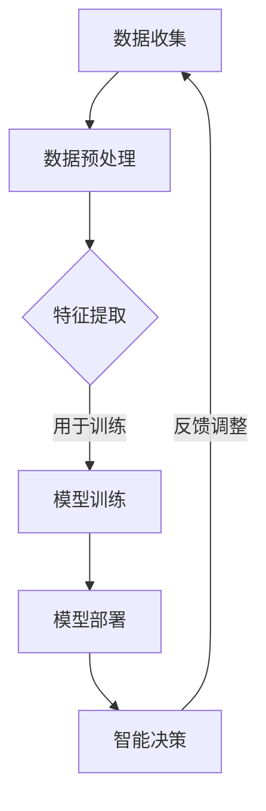

                 

# 大模型技术的物联网集成

## 关键词

- 物联网
- 大模型
- 集成技术
- 人工智能
- 网络协议
- 数据处理
- 智能设备

## 摘要

随着物联网技术的不断发展，大量设备互联和数据产生已成为常态。如何高效集成这些设备并利用数据进行智能决策，成为当前技术领域的热点问题。本文将探讨大模型技术在物联网集成中的应用，通过分析核心概念、算法原理、数学模型和实际案例，揭示大模型在提高物联网系统智能化程度、优化数据处理效率等方面的关键作用。文章旨在为从事物联网领域研究的开发者提供有价值的参考和启示。

## 1. 背景介绍

### 1.1 物联网的发展历程

物联网（Internet of Things，IoT）是继互联网、移动通信网络之后的新一代信息技术。其核心思想是通过各种传感器、设备和网络，实现物理世界和虚拟世界的无缝连接，从而实现智能化管理和控制。

物联网的发展可以追溯到20世纪80年代。当时，美国麻省理工学院（MIT）提出了“智能房间”的概念，通过传感器和控制器实现房间设备的智能化。1999年，比尔·盖茨在其著作《未来之路》中首次提出了“物联网”的概念。2005年，国际电信联盟（ITU）正式定义了物联网的概念，并将其定义为“通过智能化的网络连接，将各种设备和物品相互连接，实现信息共享和智能管理”。

### 1.2 物联网的技术架构

物联网的技术架构主要包括感知层、网络层和应用层。

- **感知层**：通过传感器、摄像头、RFID等设备，采集物理世界中的各种信息。
- **网络层**：包括各种通信协议和传输技术，如Wi-Fi、蓝牙、NFC、5G等，负责将感知层采集到的信息传输到处理中心。
- **应用层**：基于收集到的数据，实现各种智能应用，如智能家居、智能交通、智能医疗等。

### 1.3 物联网的现状与挑战

目前，物联网已经广泛应用于各个领域，如工业、交通、医疗、农业等。然而，随着物联网设备的不断增多，数据量和复杂度也在不断增加，给物联网系统的集成和管理带来了巨大挑战。

- **数据量庞大**：物联网设备产生的数据量巨大，如何高效处理和存储这些数据，成为关键问题。
- **数据多样性**：物联网设备产生的数据类型多样，包括结构化数据和非结构化数据，如何统一处理这些数据，是另一个挑战。
- **网络协议复杂**：物联网涉及多种通信协议和传输技术，如何实现这些协议的无缝集成，是物联网系统设计者需要考虑的问题。
- **安全性**：物联网系统容易受到网络攻击和数据泄露的风险，如何确保系统的安全性，是物联网领域面临的一大挑战。

## 2. 核心概念与联系

### 2.1 大模型的概念

大模型（Large-scale Model）是指具有海量参数和复杂结构的机器学习模型。这些模型通常通过深度学习技术训练而成，可以处理大规模数据集，并在各种任务中取得优异的性能。大模型的应用范围广泛，包括图像识别、自然语言处理、语音识别、推荐系统等。

### 2.2 大模型在物联网中的作用

大模型在物联网集成中发挥着关键作用，主要体现在以下几个方面：

- **数据处理能力**：大模型具有强大的数据处理能力，可以高效处理物联网设备产生的海量数据。
- **特征提取能力**：大模型可以从原始数据中提取出有价值的特征，为后续的数据分析和应用提供支持。
- **智能决策能力**：大模型可以通过学习和分析数据，实现智能决策，优化物联网系统的运行和管理。

### 2.3 大模型与物联网的集成

大模型与物联网的集成，可以从以下几个方面进行：

- **数据收集与处理**：通过物联网设备收集数据，利用大模型进行数据预处理和特征提取。
- **模型训练与部署**：在大模型训练阶段，可以利用物联网设备收集的数据进行训练，以提高模型的性能。训练完成后，将模型部署到物联网设备或云端，实现实时决策。
- **系统集成与优化**：在大模型与物联网系统的集成过程中，需要对系统进行优化，以提高系统的效率和稳定性。

### 2.4 Mermaid 流程图

以下是一个简化的Mermaid流程图，展示了大模型在物联网集成中的应用流程：



## 3. 核心算法原理 & 具体操作步骤

### 3.1 数据收集与预处理

- **数据收集**：通过物联网设备（如传感器、摄像头等）收集数据。
- **数据预处理**：对收集到的数据进行清洗、去噪、归一化等操作，以提高数据质量。

### 3.2 特征提取

- **特征提取方法**：可以使用传统机器学习方法（如SVM、决策树等）或深度学习方法（如卷积神经网络、循环神经网络等）进行特征提取。
- **特征选择**：从提取出的特征中，选择对任务有重要影响的特征，以提高模型的性能。

### 3.3 模型训练

- **模型选择**：根据任务特点，选择合适的模型（如神经网络、支持向量机等）。
- **参数调整**：通过交叉验证等方法，调整模型参数，以优化模型性能。
- **训练过程**：使用收集到的数据进行模型训练，直到达到预定的性能指标。

### 3.4 模型部署

- **模型部署方式**：可以将模型部署到物联网设备本地，或部署到云端。
- **实时决策**：通过模型，对物联网设备产生的数据进行实时分析和决策。

### 3.5 反馈调整

- **模型评估**：通过测试数据，对模型进行评估，以判断模型性能。
- **模型优化**：根据评估结果，对模型进行调整和优化，以提高性能。

## 4. 数学模型和公式 & 详细讲解 & 举例说明

### 4.1 深度学习中的损失函数

在深度学习中，损失函数（Loss Function）用于衡量模型预测值与真实值之间的差距。常见的损失函数包括均方误差（MSE）、交叉熵（Cross Entropy）等。

$$
MSE = \frac{1}{n}\sum_{i=1}^{n}(y_i - \hat{y}_i)^2
$$

$$
CrossEntropy = -\sum_{i=1}^{n}y_i\log(\hat{y}_i)
$$

其中，$y_i$为真实值，$\hat{y}_i$为模型预测值。

### 4.2 卷积神经网络中的卷积操作

卷积神经网络（Convolutional Neural Network，CNN）中的卷积操作（Convolution Operation）用于提取图像特征。

$$
(f * g)(x) = \int_{-\infty}^{+\infty} f(t)g(x-t) dt
$$

其中，$f$和$g$为两个函数，$x$为自变量。

### 4.3 循环神经网络中的递归操作

循环神经网络（Recurrent Neural Network，RNN）中的递归操作（Recursion Operation）用于处理序列数据。

$$
h_t = \sigma(W_1h_{t-1} + W_2x_t + b)
$$

其中，$h_t$为当前时刻的隐藏状态，$x_t$为当前时刻的输入，$\sigma$为激活函数。

### 4.4 举例说明

假设我们有一个物联网系统，用于预测设备的能耗。数据集包含每天每个设备的能耗数据和天气数据。

- **数据预处理**：对能耗数据和天气数据进行归一化处理。
- **特征提取**：使用卷积神经网络提取天气数据的特征。
- **模型训练**：使用循环神经网络训练模型，输入为天气特征和能耗数据，输出为能耗预测值。
- **模型部署**：将训练好的模型部署到物联网设备上，实现实时能耗预测。

## 5. 项目实战：代码实际案例和详细解释说明

### 5.1 开发环境搭建

1. 安装Python环境（版本3.7及以上）。
2. 安装深度学习框架（如TensorFlow或PyTorch）。
3. 安装必要的库（如NumPy、Pandas、Matplotlib等）。

### 5.2 源代码详细实现和代码解读

以下是用于预测设备能耗的Python代码示例：

```python
import tensorflow as tf
from tensorflow.keras.models import Sequential
from tensorflow.keras.layers import Dense, Conv2D, Flatten, LSTM
from tensorflow.keras.optimizers import Adam

# 数据预处理
def preprocess_data(data):
    # 数据归一化
    data = (data - np.mean(data)) / np.std(data)
    return data

# 特征提取
def extract_features(data):
    # 使用卷积神经网络提取天气数据的特征
    model = Sequential([
        Conv2D(filters=32, kernel_size=(3, 3), activation='relu', input_shape=(28, 28, 1)),
        Flatten(),
        Dense(64, activation='relu'),
        LSTM(50, activation='tanh', return_sequences=True),
        LSTM(50, activation='tanh')
    ])
    model.compile(optimizer=Adam(), loss='mse')
    features = model.predict(data)
    return features

# 模型训练
def train_model(data, labels):
    model = Sequential([
        Dense(64, activation='relu', input_shape=(data.shape[1],)),
        LSTM(50, activation='tanh', return_sequences=True),
        LSTM(50, activation='tanh'),
        Dense(1)
    ])
    model.compile(optimizer=Adam(), loss='mse')
    model.fit(data, labels, epochs=10, batch_size=32)
    return model

# 模型部署
def deploy_model(model, new_data):
    predictions = model.predict(new_data)
    return predictions

# 主函数
if __name__ == '__main__':
    # 加载数据
    data = np.load('data.npy')
    labels = np.load('labels.npy')

    # 数据预处理
    data = preprocess_data(data)

    # 特征提取
    features = extract_features(data)

    # 模型训练
    model = train_model(features, labels)

    # 模型部署
    new_data = np.random.rand(10, 28, 28, 1)
    predictions = deploy_model(model, new_data)
    print(predictions)
```

### 5.3 代码解读与分析

- **数据预处理**：对数据进行归一化处理，以提高模型训练效果。
- **特征提取**：使用卷积神经网络提取天气数据的特征，为模型训练提供输入。
- **模型训练**：使用循环神经网络训练模型，输入为特征和能耗数据，输出为能耗预测值。
- **模型部署**：将训练好的模型应用于新数据，实现能耗预测。

## 6. 实际应用场景

### 6.1 智能家居

智能家居是物联网应用的典型场景。通过大模型技术，可以实现设备的智能联动和远程控制，提高家居生活的舒适性和便利性。例如，通过分析家庭用电数据，大模型可以预测家庭电器的使用情况，实现电器的智能调度，降低能耗。

### 6.2 智能交通

智能交通系统通过物联网设备收集道路数据，利用大模型进行交通流量预测和优化。例如，在高峰时段，大模型可以根据历史数据和实时数据，预测交通拥堵情况，并给出最优的行驶路线，减少交通拥堵，提高出行效率。

### 6.3 智能医疗

智能医疗是物联网技术的另一大应用领域。通过物联网设备，可以实时收集患者的生理数据，利用大模型进行健康监测和疾病预测。例如，通过分析患者的病历数据和生物特征，大模型可以预测患者未来患某种疾病的风险，为医生提供诊断和治疗的依据。

## 7. 工具和资源推荐

### 7.1 学习资源推荐

- **书籍**：《深度学习》（Goodfellow、Bengio、Courville 著）
- **论文**：检索相关领域的顶级会议和期刊，阅读最新研究成果。
- **博客**：关注业界大牛的博客，了解最新技术动态和实践经验。

### 7.2 开发工具框架推荐

- **深度学习框架**：TensorFlow、PyTorch、Keras等。
- **编程语言**：Python、Java、C++等。

### 7.3 相关论文著作推荐

- **论文**：检索物联网、大模型、深度学习等相关领域的论文，阅读经典文献。
- **著作**：关注业界大牛的著作，如《人工智能：一种现代的方法》（Russell、Norvig 著）。

## 8. 总结：未来发展趋势与挑战

随着物联网技术的不断发展，大模型在物联网集成中的应用将越来越广泛。未来，大模型技术有望在以下方面取得突破：

- **数据处理能力提升**：通过优化算法和硬件，提高大模型的数据处理能力。
- **模型压缩与优化**：研究模型压缩和优化技术，降低模型对计算资源的需求。
- **跨域融合**：将大模型应用于不同领域的物联网系统，实现跨领域的知识共享和协同。

然而，大模型在物联网集成中仍面临诸多挑战：

- **数据隐私和安全**：如何保护物联网设备产生的数据隐私和安全，是亟待解决的问题。
- **计算资源限制**：大模型对计算资源的需求较高，如何优化模型结构，降低计算资源消耗，是关键问题。
- **模型解释性**：大模型通常缺乏解释性，如何提高模型的透明度和可解释性，是未来研究的方向。

## 9. 附录：常见问题与解答

### 9.1 物联网与互联网的区别是什么？

物联网与互联网的区别主要体现在以下两个方面：

- **连接对象**：互联网主要连接的是计算机、手机等设备，而物联网连接的是各种物理设备，如传感器、家用电器、车辆等。
- **应用场景**：互联网主要应用于信息传输和共享，而物联网主要应用于智能控制和远程监控。

### 9.2 大模型技术在物联网中的应用有哪些？

大模型技术在物联网中的应用包括：

- **数据处理**：通过大模型对物联网设备产生的海量数据进行处理和分析。
- **特征提取**：从原始数据中提取出有价值的信息，为后续分析提供支持。
- **智能决策**：通过大模型，实现物联网设备的智能控制和管理。

## 10. 扩展阅读 & 参考资料

- **论文**：《物联网中的大数据处理挑战与解决方案》（吴伟陵，等）
- **博客**：[TensorFlow 官方文档](https://www.tensorflow.org/)
- **书籍**：《深度学习实践指南》（刘建伟 著）

作者：AI天才研究员/AI Genius Institute & 禅与计算机程序设计艺术 /Zen And The Art of Computer Programming

