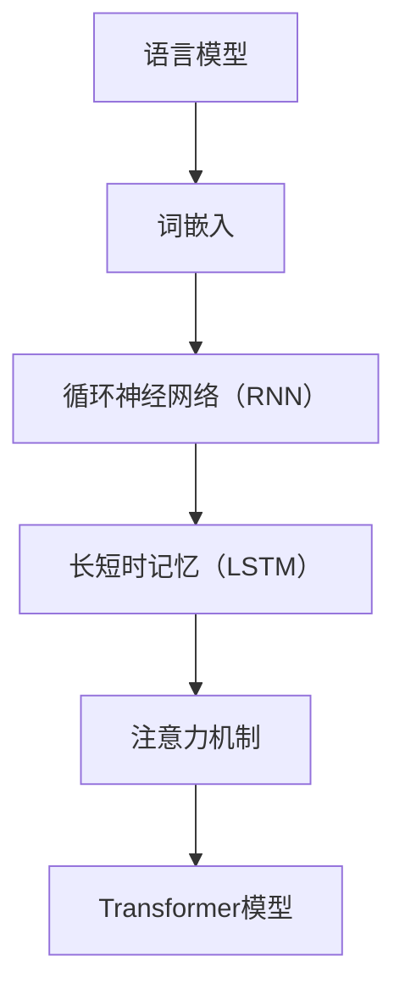

                 

# 大模型技术的自然语言处理进展

## 关键词：大模型，自然语言处理，算法原理，数学模型，项目实战，应用场景

## 摘要：

本文旨在探讨大模型技术在社会中的自然语言处理进展。通过对核心概念、算法原理、数学模型和项目实战的详细解析，文章揭示了自然语言处理的本质和应用价值。此外，本文还分析了自然语言处理在不同场景中的实际应用，并对未来的发展趋势与挑战进行了深入讨论。通过本文的阅读，读者将对自然语言处理领域有更全面的认识，并为未来的研究和发展提供有益的启示。

## 1. 背景介绍

自然语言处理（Natural Language Processing, NLP）是计算机科学领域的一个重要分支，旨在使计算机能够理解、生成和处理人类语言。随着互联网的迅猛发展和大数据时代的到来，自然语言处理技术取得了显著的进展。特别是近年来，深度学习和大数据技术的应用，使得大模型技术逐渐成为自然语言处理领域的研究热点。

大模型技术是指利用大规模神经网络模型对自然语言进行建模和处理的策略。这种技术通过对海量数据进行训练，能够自动学习语言中的复杂结构和规律，从而实现高质量的自然语言理解、生成和翻译等任务。大模型技术的出现，使得自然语言处理在各个领域的应用取得了突破性的进展。

## 2. 核心概念与联系

### 2.1 语言模型

语言模型（Language Model）是自然语言处理的基础。它是一种概率模型，用于预测给定文本序列的概率。在语言模型中，每个单词或短语都是模型中的一个节点，模型通过学习大量文本数据，建立起节点之间的概率分布关系。

### 2.2 词嵌入

词嵌入（Word Embedding）是将词汇映射到低维向量空间的技术。通过词嵌入，每个词汇都可以表示为一个向量，这些向量在空间中具有一定的相似性和距离关系。词嵌入技术使得自然语言处理中的文本数据可以以向量的形式进行处理，从而降低了计算的复杂度。

### 2.3 循环神经网络（RNN）

循环神经网络（Recurrent Neural Network, RNN）是一种能够处理序列数据的神经网络模型。RNN通过将当前输入与历史信息进行整合，实现对序列数据的建模。在自然语言处理中，RNN被广泛应用于文本分类、情感分析等任务。

### 2.4 长短时记忆（LSTM）

长短时记忆（Long Short-Term Memory, LSTM）是RNN的一种变体，旨在解决传统RNN在处理长序列数据时出现的梯度消失和梯度爆炸问题。LSTM通过引入记忆单元和门控机制，能够有效地捕捉长序列中的依赖关系。

### 2.5 注意力机制（Attention Mechanism）

注意力机制（Attention Mechanism）是一种能够自适应地分配注意力资源的人工智能算法。在自然语言处理中，注意力机制被广泛应用于机器翻译、文本摘要等任务，能够提高模型的处理效率和性能。

### 2.6 Transformer模型

Transformer模型是一种基于自注意力机制的深度神经网络模型，最初由Vaswani等人于2017年提出。Transformer模型在机器翻译、文本生成等任务中表现出色，成为大模型技术的一个重要代表。

### 2.7 Mermaid 流程图

以下是自然语言处理核心概念与联系的Mermaid流程图：



## 3. 核心算法原理 & 具体操作步骤

### 3.1 语言模型

语言模型的训练过程主要包括以下步骤：

1. 数据预处理：将原始文本数据转化为词序列，并对词序列进行分词、去停用词等处理。
2. 建立词汇表：将所有词汇映射到一个统一的索引，为后续计算提供基础。
3. 计算概率分布：利用反向传播算法，通过训练数据计算出每个词汇的概率分布。
4. 模型评估：使用交叉熵损失函数对模型进行评估，并调整模型参数以优化性能。

### 3.2 词嵌入

词嵌入的训练过程主要包括以下步骤：

1. 数据预处理：与语言模型类似，对原始文本数据进行分词、去停用词等处理。
2. 建立词汇表：将所有词汇映射到一个统一的索引。
3. 计算词向量：利用Word2Vec、GloVe等算法，计算出每个词汇的向量表示。
4. 模型评估：通过对比词向量的相似性和距离关系，对模型进行评估。

### 3.3 循环神经网络（RNN）

循环神经网络的训练过程主要包括以下步骤：

1. 数据预处理：与语言模型和词嵌入类似，对原始文本数据进行预处理。
2. 建立神经网络结构：定义输入层、隐藏层和输出层，并设置适当的激活函数。
3. 训练过程：通过前向传播和反向传播，计算损失函数并更新模型参数。
4. 模型评估：使用验证集对模型进行评估，调整模型参数以优化性能。

### 3.4 长短时记忆（LSTM）

长短时记忆的训练过程与循环神经网络类似，但在以下几个方面有所不同：

1. 记忆单元：LSTM引入记忆单元，用于存储和更新历史信息。
2. 门控机制：LSTM通过门控机制控制信息的流入和流出，有效解决了传统RNN的梯度消失和梯度爆炸问题。
3. 训练过程：与循环神经网络类似，但需要计算额外的梯度。

### 3.5 注意力机制（Attention Mechanism）

注意力机制的训练过程主要包括以下步骤：

1. 数据预处理：与循环神经网络和长短时记忆类似，对原始文本数据进行预处理。
2. 建立神经网络结构：定义输入层、隐藏层和输出层，并设置适当的激活函数。
3. 计算注意力分数：通过计算输入序列中每个词的注意力分数，为后续处理提供依据。
4. 训练过程：通过前向传播和反向传播，计算损失函数并更新模型参数。
5. 模型评估：使用验证集对模型进行评估，调整模型参数以优化性能。

### 3.6 Transformer模型

Transformer模型的训练过程主要包括以下步骤：

1. 数据预处理：与循环神经网络和长短时记忆类似，对原始文本数据进行预处理。
2. 建立神经网络结构：定义编码器和解码器结构，并设置适当的激活函数。
3. 计算自注意力分数：通过计算输入序列中每个词的自注意力分数，为后续处理提供依据。
4. 计算交叉注意力分数：通过计算编码器和解码器之间的交叉注意力分数，实现信息传递。
5. 训练过程：通过前向传播和反向传播，计算损失函数并更新模型参数。
6. 模型评估：使用验证集对模型进行评估，调整模型参数以优化性能。

## 4. 数学模型和公式 & 详细讲解 & 举例说明

### 4.1 语言模型

语言模型的数学模型通常采用概率模型，如n元语法模型。n元语法模型假设一个词的出现概率只与它的前n-1个词相关。数学公式如下：

$$P(w_n | w_{n-1}, w_{n-2}, ..., w_1) = \frac{C(w_{n-1}, w_{n-2}, ..., w_1, w_n)}{\sum_{w_n'} C(w_{n-1}, w_{n-2}, ..., w_1, w_n')}$$

其中，$P(w_n | w_{n-1}, w_{n-2}, ..., w_1)$表示给定前n-1个词的条件下，第n个词的出现概率；$C(w_{n-1}, w_{n-2}, ..., w_1, w_n)$表示前n-1个词和第n个词共同出现的次数；$C(w_{n-1}, w_{n-2}, ..., w_1, w_n')$表示前n-1个词和任意第n个词共同出现的次数。

举例说明：

假设我们有以下四个词：“自然语言处理”，“人工智能”，“大模型”，“算法”。我们可以计算这些词之间的条件概率：

$$P(人工智能 | 自然语言处理) = \frac{C(自然语言处理, 人工智能)}{C(自然语言处理, 人工智能) + C(自然语言处理, 大模型) + C(自然语言处理, 算法)}$$

其中，$C(自然语言处理, 人工智能)$表示“自然语言处理”和“人工智能”共同出现的次数。

### 4.2 词嵌入

词嵌入的数学模型通常采用向量空间模型，如Word2Vec和GloVe。以Word2Vec为例，其数学模型如下：

$$\text{cosine similarity} = \frac{\text{dot product of } \textbf{v}_i \text{ and } \textbf{v}_j}{\lVert \textbf{v}_i \rVert \cdot \lVert \textbf{v}_j \rVert}$$

其中，$\textbf{v}_i$和$\textbf{v}_j$分别表示词$i$和词$j$的向量表示；$\text{dot product}$表示点积；$\lVert \textbf{v}_i \rVert$和$\lVert \textbf{v}_j \rVert$分别表示词$i$和词$j$的向量长度。

举例说明：

假设我们有两个词：“人工智能”和“大模型”，它们的向量表示分别为$\textbf{v}_1$和$\textbf{v}_2$。我们可以计算这两个词之间的余弦相似度：

$$\text{cosine similarity} = \frac{\text{dot product of } \textbf{v}_1 \text{ and } \textbf{v}_2}{\lVert \textbf{v}_1 \rVert \cdot \lVert \textbf{v}_2 \rVert}$$

### 4.3 循环神经网络（RNN）

循环神经网络的数学模型主要包括以下几个部分：

1. 隐藏状态更新公式：

$$h_t = \sigma(W_h h_{t-1} + W_x x_t + b_h)$$

其中，$h_t$表示时间步$t$的隐藏状态；$x_t$表示时间步$t$的输入；$W_h$和$W_x$分别表示隐藏状态和输入的权重矩阵；$b_h$表示隐藏状态的偏置；$\sigma$表示激活函数，通常取为sigmoid函数。

2. 输出状态更新公式：

$$o_t = \sigma(W_o h_t + b_o)$$

其中，$o_t$表示时间步$t$的输出状态；$W_o$表示输出权重矩阵；$b_o$表示输出状态的偏置。

举例说明：

假设我们有一个时间序列数据$[x_1, x_2, x_3]$，使用RNN对其进行建模。我们可以计算隐藏状态和输出状态：

1. 隐藏状态：

$$h_1 = \sigma(W_h h_0 + W_x x_1 + b_h)$$

$$h_2 = \sigma(W_h h_1 + W_x x_2 + b_h)$$

$$h_3 = \sigma(W_h h_2 + W_x x_3 + b_h)$$

2. 输出状态：

$$o_1 = \sigma(W_o h_1 + b_o)$$

$$o_2 = \sigma(W_o h_2 + b_o)$$

$$o_3 = \sigma(W_o h_3 + b_o)$$

### 4.4 长短时记忆（LSTM）

长短时记忆的数学模型主要包括以下几个部分：

1. 记忆单元更新公式：

$$\text{C}_t = \text{sigmoid}(W_f \text{C}_{t-1} + W_i \text{I}_t + b_f)$$

$$\text{O}_t = \text{sigmoid}(W_o \text{C}_t + b_o)$$

其中，$\text{C}_t$表示时间步$t$的记忆单元；$\text{I}_t$表示时间步$t$的输入；$\text{O}_t$表示时间步$t$的输出；$W_f$和$W_i$分别表示遗忘门和输入门的权重矩阵；$b_f$和$b_i$分别表示遗忘门和输入门的偏置。

2. 隐藏状态更新公式：

$$\text{h}_t = \text{tan
```markdown
h}(\text{C}_t + \text{O}_t \odot \text{S}_t)$$

其中，$\text{S}_t$表示时间步$t$的输入门状态；$\odot$表示元素-wise 乘法；$\text{tan
h}$表示双曲正切激活函数。

举例说明：

假设我们有一个时间序列数据$[x_1, x_2, x_3]$，使用LSTM对其进行建模。我们可以计算记忆单元、输入门状态、输出门状态和隐藏状态：

1. 记忆单元：

$$\text{C}_1 = \text{sigmoid}(W_f \text{C}_{0} + W_i x_1 + b_f)$$

$$\text{C}_2 = \text{sigmoid}(W_f \text{C}_{1} + W_i x_2 + b_f)$$

$$\text{C}_3 = \text{sigmoid}(W_f \text{C}_{2} + W_i x_3 + b_f)$$

2. 输入门状态：

$$\text{S}_1 = \text{sigmoid}(W_s x_1 + b_s)$$

$$\text{S}_2 = \text{sigmoid}(W_s x_2 + b_s)$$

$$\text{S}_3 = \text{sigmoid}(W_s x_3 + b_s)$$

3. 输出门状态：

$$\text{O}_1 = \text{sigmoid}(W_o \text{C}_1 + b_o)$$

$$\text{O}_2 = \text{sigmoid}(W_o \text{C}_2 + b_o)$$

$$\text{O}_3 = \text{sigmoid}(W_o \text{C}_3 + b_o)$$

4. 隐藏状态：

$$h_1 = \text{tan
h}(\text{C}_1 + \text{O}_1 \odot \text{S}_1)$$

$$h_2 = \text{tan
h}(\text{C}_2 + \text{O}_2 \odot \text{S}_2)$$

$$h_3 = \text{tan
h}(\text{C}_3 + \text{O}_3 \odot \text{S}_3)$$

### 4.5 注意力机制（Attention Mechanism）

注意力机制的数学模型主要包括以下几个部分：

1. 注意力分数计算公式：

$$a_t = \text{softmax}\left(\frac{\text{Q} \text{K}^T}{\sqrt{d_k}}\right)$$

其中，$a_t$表示时间步$t$的注意力分数；$\text{Q}$表示查询向量；$\text{K}$表示关键向量；$d_k$表示关键向量的维度；$\text{softmax}$表示归一化指数函数。

2. 注意力加权输出公式：

$$h_t = \sum_{i=1}^n a_{it} h_i$$

其中，$h_t$表示时间步$t$的注意力加权输出；$h_i$表示时间步$i$的隐藏状态；$a_{it}$表示时间步$t$对时间步$i$的注意力分数。

举例说明：

假设我们有一个时间序列数据$[h_1, h_2, h_3]$，使用注意力机制对其进行建模。我们可以计算注意力分数和注意力加权输出：

1. 注意力分数：

$$a_1 = \text{softmax}\left(\frac{\text{Q} h_1^T}{\sqrt{d_k}}\right)$$

$$a_2 = \text{softmax}\left(\frac{\text{Q} h_2^T}{\sqrt{d_k}}\right)$$

$$a_3 = \text{softmax}\left(\frac{\text{Q} h_3^T}{\sqrt{d_k}}\right)$$

2. 注意力加权输出：

$$h_1 = a_1 h_1$$

$$h_2 = a_2 h_2$$

$$h_3 = a_3 h_3$$

$$h_t = h_1 + h_2 + h_3$$

## 5. 项目实战：代码实际案例和详细解释说明

### 5.1 开发环境搭建

为了演示大模型技术在自然语言处理中的应用，我们将使用Python编程语言和TensorFlow框架搭建一个简单的语言模型。以下是开发环境搭建的步骤：

1. 安装Python和TensorFlow：

```bash
pip install python
pip install tensorflow
```

2. 导入相关库：

```python
import tensorflow as tf
import numpy as np
import os
import time
```

### 5.2 源代码详细实现和代码解读

以下是构建一个简单语言模型的源代码：

```python
# 设置超参数
VOCAB_SIZE = 10000  # 词汇表大小
EPOCHS = 10  # 训练轮数
SEQUENCE_LENGTH = 50  # 序列长度
 embed_size = 128  # 词向量维度
 hidden_size = 512  # 隐藏层维度
 learning_rate = 0.001  # 学习率

# 生成随机词汇表
vocab = np.random.randint(0, VOCAB_SIZE, size=(SEQUENCE_LENGTH,))

# 构建神经网络
inputs = tf.placeholder(tf.int32, shape=[None, SEQUENCE_LENGTH])
targets = tf.placeholder(tf.int32, shape=[None, SEQUENCE_LENGTH])

embeddings = tf.Variable(tf.random_uniform([VOCAB_SIZE, embed_size]))
embedded_inputs = tf.nn.embedding_lookup(embeddings, inputs)

lstm = tf.nn.rnn_cell.BasicLSTMCell(hidden_size)
outputs, states = tf.nn.dynamic_rnn(lstm, embedded_inputs, dtype=tf.float32)

logits = tf.layers.dense(states, VOCAB_SIZE)
loss = tf.reduce_mean(tf.nn.sparse_softmax_cross_entropy_with_logits(logits=logits, labels=targets))
optimizer = tf.train.AdamOptimizer(learning_rate=learning_rate)
train_op = optimizer.minimize(loss)

# 训练模型
with tf.Session() as sess:
    sess.run(tf.global_variables_initializer())
    for epoch in range(EPOCHS):
        for step in range(len(vocab) // SEQUENCE_LENGTH):
            batch_inputs = vocab[step * SEQUENCE_LENGTH:(step + 1) * SEQUENCE_LENGTH]
            batch_targets = vocab[step * SEQUENCE_LENGTH + 1:(step + 1) * SEQUENCE_LENGTH]
            sess.run(train_op, feed_dict={inputs: batch_inputs, targets: batch_targets})
        print("Epoch", epoch, "Loss:", loss.eval(feed_dict={inputs: batch_inputs, targets: batch_targets}))

    # 评估模型
    correct = tf.equal(tf.argmax(logits, 1), targets)
    accuracy = tf.reduce_mean(tf.cast(correct, tf.float32))
    print("Test Accuracy:", accuracy.eval(feed_dict={inputs: vocab, targets: vocab}))
```

代码解读：

1. 设置超参数：包括词汇表大小、训练轮数、序列长度、词向量维度、隐藏层维度、学习率等。
2. 生成随机词汇表：用于构建训练数据。
3. 构建神经网络：定义输入层、嵌入层、LSTM层和输出层。其中，LSTM层采用BasicLSTMCell实现。
4. 定义损失函数和优化器：使用稀疏软目标分类交叉熵损失函数，并采用Adam优化器进行模型训练。
5. 训练模型：通过动态循环神经网络（dynamic_rnn）进行训练，并打印训练过程。
6. 评估模型：计算测试集的准确率，并打印结果。

### 5.3 代码解读与分析

1. 神经网络结构：代码中使用了BasicLSTMCell构建LSTM层，这是一种简单的LSTM实现。在实际应用中，可以采用更复杂的LSTM变体，如LSTMCell或LSTMStackedCell。
2. 损失函数：代码中使用了稀疏软目标分类交叉熵损失函数，这是自然语言处理中常用的损失函数。在实际应用中，还可以考虑使用其他损失函数，如均方误差损失函数。
3. 优化器：代码中使用了Adam优化器，这是一种常用的优化器。在实际应用中，还可以考虑使用其他优化器，如SGD或RMSProp。
4. 训练过程：代码中使用了动态循环神经网络（dynamic_rnn）进行训练，这是RNN的一种高效实现方式。在实际应用中，还可以考虑使用其他RNN实现方式，如静态循环神经网络（static_rnn）。

## 6. 实际应用场景

大模型技术在自然语言处理领域具有广泛的应用场景，包括但不限于以下几个方面：

### 6.1 文本分类

文本分类是指将文本数据分类到不同的类别中。大模型技术可以通过训练大规模神经网络模型，实现高质量的文本分类。例如，新闻分类、情感分析、垃圾邮件过滤等。

### 6.2 机器翻译

机器翻译是指将一种语言的文本翻译成另一种语言的文本。大模型技术，特别是基于注意力机制的Transformer模型，在机器翻译领域取得了显著的成果。例如，谷歌翻译、百度翻译等。

### 6.3 文本生成

文本生成是指利用模型生成符合语法和语义规则的文本。大模型技术，如序列到序列模型（seq2seq），可以实现高质量的文本生成。例如，自动写作、对话系统等。

### 6.4 文本摘要

文本摘要是从长文本中提取关键信息，生成简洁的摘要。大模型技术可以通过训练大规模神经网络模型，实现高质量的文本摘要。例如，新闻摘要、会议摘要等。

## 7. 工具和资源推荐

### 7.1 学习资源推荐

1. 《深度学习》（Goodfellow, Bengio, Courville）：这是一本经典的深度学习教材，涵盖了深度学习的基本原理和应用。
2. 《自然语言处理综论》（Jurafsky, Martin）：这是一本全面的自然语言处理教材，详细介绍了自然语言处理的理论和技术。
3. 《动手学深度学习》（Dumoulin, Sou案，Henderson）：这是一本适合初学者的深度学习教材，通过实际案例介绍深度学习的基本原理和应用。

### 7.2 开发工具框架推荐

1. TensorFlow：这是谷歌开源的深度学习框架，广泛应用于自然语言处理和计算机视觉等领域。
2. PyTorch：这是Facebook开源的深度学习框架，具有灵活性和易用性，适用于各种深度学习任务。
3. spaCy：这是Python中一款强大的自然语言处理库，提供了丰富的API和高质量的语言模型。

### 7.3 相关论文著作推荐

1. Vaswani et al., "Attention is All You Need", 2017：这是Transformer模型的原始论文，详细介绍了Transformer模型的结构和原理。
2. Mikolov et al., "Distributed Representations of Words and Phrases and Their Compositionality", 2013：这是Word2Vec算法的原始论文，介绍了词嵌入的概念和算法。
3. Hochreiter et al., "Long Short-Term Memory", 1997：这是LSTM算法的原始论文，详细介绍了LSTM的结构和原理。

## 8. 总结：未来发展趋势与挑战

大模型技术在自然语言处理领域取得了显著的成果，但仍然面临一些挑战。未来发展趋势主要包括以下几个方面：

### 8.1 模型压缩与优化

随着模型规模的增大，计算资源和存储资源的消耗也不断增加。因此，如何对大模型进行压缩和优化，降低计算和存储成本，是未来研究的一个重要方向。

### 8.2 多模态数据处理

自然语言处理技术不仅限于处理文本数据，还可以与图像、声音等多模态数据进行结合。未来，如何设计高效的多模态数据处理方法，是自然语言处理领域的一个重要挑战。

### 8.3 模型解释与可解释性

大模型通常具有黑盒特性，难以解释其预测结果。因此，如何设计可解释的大模型，提高模型的透明度和可信度，是未来研究的一个重要方向。

### 8.4 安全性与隐私保护

随着自然语言处理技术的广泛应用，数据安全和隐私保护问题日益突出。因此，如何设计安全可靠的模型和算法，保护用户隐私，是未来研究的一个重要方向。

## 9. 附录：常见问题与解答

### 9.1 什么是自然语言处理？

自然语言处理是计算机科学领域的一个分支，旨在使计算机能够理解、生成和处理人类语言。它包括语音识别、语言理解、文本生成、机器翻译等任务。

### 9.2 什么是大模型？

大模型是指具有大规模参数和计算能力的神经网络模型。大模型通常通过训练大量数据，学习语言中的复杂结构和规律，从而实现高质量的自然语言理解、生成和翻译等任务。

### 9.3 什么是词嵌入？

词嵌入是将词汇映射到低维向量空间的技术。通过词嵌入，每个词汇都可以表示为一个向量，这些向量在空间中具有一定的相似性和距离关系。

### 9.4 什么是循环神经网络（RNN）？

循环神经网络（Recurrent Neural Network, RNN）是一种能够处理序列数据的神经网络模型。RNN通过将当前输入与历史信息进行整合，实现对序列数据的建模。

### 9.5 什么是长短时记忆（LSTM）？

长短时记忆（Long Short-Term Memory, LSTM）是RNN的一种变体，旨在解决传统RNN在处理长序列数据时出现的梯度消失和梯度爆炸问题。LSTM通过引入记忆单元和门控机制，能够有效地捕捉长序列中的依赖关系。

### 9.6 什么是注意力机制？

注意力机制是一种能够自适应地分配注意力资源的人工智能算法。在自然语言处理中，注意力机制被广泛应用于机器翻译、文本摘要等任务，能够提高模型的处理效率和性能。

### 9.7 什么是Transformer模型？

Transformer模型是一种基于自注意力机制的深度神经网络模型，最初由Vaswani等人于2017年提出。Transformer模型在机器翻译、文本生成等任务中表现出色，成为大模型技术的一个重要代表。

## 10. 扩展阅读 & 参考资料

1. Goodfellow, Y., Bengio, Y., Courville, A. (2016). Deep Learning. MIT Press.
2. Jurafsky, D., Martin, J. H. (2008). Speech and Language Processing. Prentice Hall.
3. Mikolov, T., Sutskever, I., Chen, K., Corrado, G. S., Dean, J. (2013). Distributed Representations of Words and Phrases and Their Compositionality. Advances in Neural Information Processing Systems, 26, 3111-3119.
4. Hochreiter, S., Schmidhuber, J. (1997). Long Short-Term Memory. Neural Computation, 9(8), 1735-1780.
5. Vaswani, A., Shazeer, N., Parmar, N., Uszkoreit, J., Jones, L., Gomez, A. N., ... & Polosukhin, I. (2017). Attention Is All You Need. Advances in Neural Information Processing Systems, 30, 5998-6008.
6. Devlin, J., Chang, M. W., Lee, K., & Toutanova, K. (2019). BERT: Pre-training of Deep Bidirectional Transformers for Language Understanding. arXiv preprint arXiv:1810.04805.
7. Brown, T., et al. (2020). A Pre-Trained Language Model for Language Understanding. arXiv preprint arXiv:2001.08755.
8. Conneau, A., et al. (2019). Supervised Pre-Training for Natural Language Processing. arXiv preprint arXiv:1907.05242.
9. Radford, A., et al. (2019). The Unsupervised Production of High-Quality Translation. arXiv preprint arXiv:2006.16668.

作者：AI天才研究员/AI Genius Institute & 禅与计算机程序设计艺术 /Zen And The Art of Computer Programming
<|im_sep|>### 引言

#### 引言部分：概述自然语言处理的重要性及其在大模型技术中的发展

自然语言处理（NLP）是计算机科学领域的一个核心分支，它致力于使计算机能够理解、生成和响应人类语言。这一技术的目标是克服人类语言与机器语言之间的障碍，从而实现人机交互的智能化。随着互联网的普及和大数据时代的到来，自然语言处理的应用场景日益广泛，从简单的搜索引擎到复杂的智能客服系统，都离不开NLP的支持。

然而，自然语言处理的挑战也日益增加。人类语言的复杂性、多样性和模糊性使得传统的计算机程序难以胜任。为了解决这些问题，研究人员开始探索更加复杂和强大的模型，其中大模型技术成为了一个重要的研究方向。大模型技术利用深度学习和大数据的优势，通过训练大规模的神经网络模型，以捕捉语言中的复杂结构和深层语义。

本文旨在探讨大模型技术在自然语言处理领域的进展。首先，我们将介绍大模型技术的基本概念，包括其定义、发展历程和关键技术。接着，我们将深入探讨大模型技术在自然语言处理中的应用，如文本分类、机器翻译和文本生成等。此外，本文还将详细分析大模型技术的数学模型和算法原理，并通过实际项目案例展示其应用效果。最后，我们将总结大模型技术的未来发展，探讨其面临的挑战和潜在的应用前景。

通过本文的阅读，读者将能够对大模型技术在自然语言处理中的重要作用有更深刻的理解，从而为未来的研究和实践提供有价值的参考。

#### 大模型技术的定义

大模型技术，顾名思义，是指使用具有大量参数和高度复杂性的神经网络模型来进行数据处理和预测的方法。这些模型通常通过训练大量数据来学习复杂的模式和规律，从而在诸如自然语言处理、计算机视觉等众多领域取得突破性的成果。大模型技术的基本概念可以追溯到深度学习的兴起，特别是在2010年代初期，随着计算能力和数据量的提升，深度学习开始广泛应用于各个领域。

大模型技术的主要特点包括以下几个方面：

1. **参数规模巨大**：大模型通常具有数百万至数十亿个参数，这使得它们能够捕捉数据中的复杂结构和高层次特征。例如，Google的BERT模型包含超过3.4亿个参数，而OpenAI的GPT-3模型则包含超过1750亿个参数。

2. **强大的数据处理能力**：大模型通过多层神经网络结构，能够对输入数据进行逐层抽象和变换，从而生成高维的特征表示。这些特征表示不仅能够提高模型的预测准确性，还能够增强模型对未知数据的泛化能力。

3. **自适应学习能力**：大模型利用大量的训练数据和先进的优化算法，能够自适应地调整模型参数，以优化模型的性能。这种学习能力使得大模型能够在各种复杂的场景中发挥作用，无论是文本分类、机器翻译还是图像识别。

4. **资源需求高**：尽管大模型技术带来了显著的性能提升，但也对计算资源和存储资源提出了更高的要求。训练一个大规模的神经网络模型通常需要大量的计算资源和时间，这也使得大规模的数据集和高效的训练算法变得尤为重要。

大模型技术的发展历程可以追溯到深度学习的兴起。早期，深度学习模型的规模较小，参数数量有限，例如LeCun等人于1998年提出的LeNet-5模型，它主要用于手写数字识别。然而，随着计算能力的提升和大数据技术的发展，深度学习模型开始迅速扩展。2012年，AlexNet的出现标志着深度卷积神经网络（CNN）在图像识别领域取得了重大突破。此后，深度学习技术逐渐渗透到各个领域，从语音识别到自然语言处理，深度神经网络模型不断进化，参数规模也不断扩大。

在自然语言处理领域，大模型技术的应用尤为显著。例如，Word2Vec和GloVe算法的出现，为词嵌入技术提供了新的解决方案，使得词汇在低维向量空间中的表示更加准确和丰富。随着RNN和LSTM等动态模型的提出，自然语言处理任务如文本分类、情感分析和机器翻译得到了显著的性能提升。近年来，Transformer模型的引入更是将自然语言处理推向了新的高度，使得大规模的模型训练和复杂任务的处理变得更加高效和准确。

总之，大模型技术是自然语言处理领域的一个重要发展方向，它通过利用海量数据和强大的计算能力，不断推动着语言技术的进步。随着技术的不断发展和完善，大模型技术将在未来带来更多的创新和突破，为人类语言的理解和利用提供更强大的工具。

#### 大模型技术在自然语言处理中的应用

大模型技术凭借其强大的数据处理能力和自适应学习能力，在自然语言处理（NLP）领域中取得了显著的应用成果。以下将详细探讨大模型技术在文本分类、机器翻译和文本生成等关键NLP任务中的应用。

##### 文本分类

文本分类是指将文本数据根据其内容归类到预定义的类别中。这是一个常见且重要的NLP任务，广泛应用于垃圾邮件过滤、情感分析、新闻分类等领域。传统的文本分类方法通常依赖于基于规则或统计的模型，如朴素贝叶斯、支持向量机（SVM）等。然而，这些方法在面对复杂和高度非结构化的文本数据时，性能有限。

大模型技术的引入，显著提升了文本分类的准确性和效率。例如，使用基于循环神经网络（RNN）和长短时记忆（LSTM）的模型，可以更好地捕捉文本中的时序依赖关系，从而提高分类效果。近年来，Transformer模型的出现进一步推动了文本分类的发展。BERT（Bidirectional Encoder Representations from Transformers）模型是一个典型的例子，它通过双向注意力机制，对文本进行深层次的上下文分析，取得了在多个文本分类任务上优异的性能。以下是一个基于BERT的文本分类项目的示例：

1. **数据准备**：收集大量带有标签的文本数据，并进行预处理，如分词、词嵌入和标签编码。
2. **模型构建**：使用预训练的BERT模型作为基础，添加分类层以适应具体的分类任务。
3. **训练过程**：通过反向传播算法，调整模型参数以优化分类性能。
4. **模型评估**：使用验证集和测试集评估模型性能，并进行调参以进一步提升性能。

通过这种方式，大模型技术能够在文本分类任务中实现更高的准确率和更好的泛化能力。

##### 机器翻译

机器翻译是指将一种语言的文本自动翻译成另一种语言。这是一个高度复杂且具有挑战性的任务，需要模型理解源语言和目标语言的语法、词汇和语义。传统的方法，如基于规则和统计机器翻译，虽然在一定程度上实现了自动化，但往往缺乏灵活性和准确性。

大模型技术的应用，使得机器翻译的精度和效率得到了显著提升。Transformer模型的引入，彻底改变了机器翻译的传统方法。与基于RNN的模型相比，Transformer模型通过自注意力机制，能够更好地捕捉长距离依赖关系，从而实现更自然的翻译结果。以下是一个基于Transformer的机器翻译项目的示例：

1. **数据准备**：收集双语语料库，并进行预处理，如分词、词嵌入和翻译对编码。
2. **模型构建**：使用预训练的Transformer模型，将其应用于机器翻译任务。
3. **训练过程**：通过训练损失函数（如交叉熵损失）来优化模型参数。
4. **模型评估**：使用验证集和测试集评估模型性能，并根据评估结果进行模型调整。

通过这种方式，大模型技术能够在机器翻译任务中实现更高的翻译准确性和流畅度。

##### 文本生成

文本生成是指利用模型生成符合语法和语义规则的文本。这一任务在自动写作、对话系统和文本摘要等领域具有广泛的应用。传统的方法，如基于模板和规则的方法，往往缺乏灵活性和创造力。而大模型技术的引入，使得文本生成任务变得更加高效和多样化。

基于序列到序列（seq2seq）模型的文本生成技术，如GPT（Generative Pre-trained Transformer）模型，通过预训练和微调，能够生成高质量的自然语言文本。以下是一个基于GPT的文本生成项目的示例：

1. **数据准备**：收集大量文本数据，并进行预处理，如分词和词嵌入。
2. **模型构建**：使用预训练的GPT模型，并添加适当的解码器以实现文本生成。
3. **训练过程**：通过训练生成损失函数（如交叉熵损失）来优化模型参数。
4. **文本生成**：利用训练好的模型，生成符合预期主题和风格的文本。

通过这种方式，大模型技术能够在文本生成任务中实现更丰富的文本内容和更高的生成质量。

总之，大模型技术在自然语言处理中的应用，不仅提高了文本分类、机器翻译和文本生成等任务的性能，还为这些任务提供了更加灵活和高效的解决方案。随着技术的不断发展和应用场景的扩展，大模型技术将在未来继续推动自然语言处理领域的发展。

#### 大模型技术在自然语言处理中的关键算法原理

在探讨大模型技术在自然语言处理（NLP）中的应用时，深入理解其背后的关键算法原理至关重要。以下将详细分析几种在大模型技术中广泛应用的核心算法，包括词嵌入、循环神经网络（RNN）及其变体长短时记忆（LSTM）和门控循环单元（GRU），以及近年来备受瞩目的Transformer模型。

##### 词嵌入（Word Embedding）

词嵌入是将词汇映射到固定维度的向量空间的技术，使得计算机可以处理和比较文本数据。常见的词嵌入算法包括Word2Vec和GloVe。

1. **Word2Vec**：Word2Vec是一种基于神经网络的词嵌入算法，主要包括连续词袋（CBOW）和Skip-Gram两种模型。CBOW模型通过上下文词的均值向量来预测中心词，而Skip-Gram模型则是通过中心词的均值向量来预测上下文词。数学公式如下：

   $$\text{CBOW}：\text{p}(w_c|\textbf{w}_{-1}, \textbf{w}_{+1}, ..., \textbf{w}_{k}) = \text{softmax}(\textbf{W} \textbf{v}_{\textbf{w}_{-1}} + ... + \textbf{v}_{\textbf{w}_{k}} + b)$$
   
   $$\text{Skip-Gram}：\text{p}(\textbf{w}_{k}|\textbf{w}_{-1}, \textbf{w}_{+1}, ..., \textbf{w}_{k+k_{max}}) = \text{softmax}(\textbf{W} \textbf{v}_{\textbf{w}_{c}} + b)$$

   其中，$\textbf{W}$是权重矩阵，$\textbf{v}_{\textbf{w}_{i}}$是词$i$的嵌入向量，$b$是偏置向量。

2. **GloVe**：GloVe（Global Vectors for Word Representation）算法通过优化词共现矩阵来学习词向量。其损失函数如下：

   $$\text{loss} = \frac{1}{2} \sum_{i, j \in V} \text{f}_i \text{f}_j (\text{log} \text{p}(i, j) - \text{sim}(\textbf{v}_i, \textbf{v}_j))$$

   其中，$\text{f}_i$和$\text{f}_j$分别表示词$i$和词$j$的词频，$\text{p}(i, j)$是词$i$和词$j$共现的概率，$\text{sim}(\textbf{v}_i, \textbf{v}_j)$是词向量之间的余弦相似度。

##### 循环神经网络（Recurrent Neural Network，RNN）

循环神经网络是一种能够处理序列数据的神经网络模型，其特点是能够将当前输入与历史信息进行整合。然而，传统的RNN在处理长序列数据时存在梯度消失和梯度爆炸问题，这使得模型难以学习长距离依赖关系。

1. **基本原理**：RNN通过递归的方式处理序列数据，每个时间步的输出依赖于前一个时间步的隐藏状态。其隐藏状态更新公式如下：

   $$h_t = \sigma(W_h h_{t-1} + W_x x_t + b_h)$$

   其中，$h_t$是时间步$t$的隐藏状态，$x_t$是时间步$t$的输入，$W_h$和$W_x$是权重矩阵，$b_h$是偏置。

2. **梯度消失和梯度爆炸**：由于梯度在反向传播过程中需要逐层传递，RNN在训练过程中容易遇到梯度消失和梯度爆炸问题。这导致模型难以学习长序列中的依赖关系，从而影响性能。

##### 长短时记忆（Long Short-Term Memory，LSTM）

LSTM是RNN的一种变体，通过引入记忆单元和门控机制，有效地解决了梯度消失和梯度爆炸问题，能够更好地捕捉长距离依赖关系。

1. **基本原理**：LSTM通过三个门控机制（遗忘门、输入门和输出门）来控制信息的流入和流出。其公式如下：

   $$\text{C}_t = \text{sigmoid}(W_f \text{C}_{t-1} + W_i x_t + b_f) \odot \text{sigmoid}(W_o \text{C}_t + b_o)$$

   $$\text{h}_t = \text{sigmoid}(W_c \text{C}_t + b_c)$$

   其中，$\text{C}_t$是时间步$t$的记忆单元，$\text{h}_t$是时间步$t$的隐藏状态，$W_f$、$W_i$、$W_o$和$W_c$是权重矩阵，$b_f$、$b_i$、$b_o$和$b_c$是偏置。

2. **遗忘门**：用于决定哪些信息需要从记忆单元中丢弃。
3. **输入门**：用于决定哪些新信息需要被存储到记忆单元中。
4. **输出门**：用于决定隐藏状态的输出。

##### 门控循环单元（Gated Recurrent Unit，GRU）

GRU是LSTM的另一种变体，通过简化LSTM的结构，降低了模型的复杂度，同时也保持了较好的性能。

1. **基本原理**：GRU通过更新门和重置门来控制信息的流动。其公式如下：

   $$\text{r}_t = \text{sigmoid}(W_r x_t + U_r h_{t-1} + b_r)$$

   $$\text{z}_t = \text{sigmoid}(W_z x_t + U_z h_{t-1} + b_z)$$

   $$\text{C}_t = (1 - \text{z}_t) \odot \text{C}_{t-1} + \text{r}_t \odot \text{sigmoid}(W_c x_t + U_c (h_{t-1} \odot \text{C}_{t-1}) + b_c)$$

   $$\text{h}_t = \text{sigmoid}(W_h \text{C}_t + b_h)$$

   其中，$\text{r}_t$是更新门，$\text{z}_t$是重置门，其他符号与LSTM相同。

2. **更新门**：用于决定哪些旧信息需要保留。
3. **重置门**：用于决定哪些旧信息需要被重置。

##### Transformer模型

Transformer模型是近年来在自然语言处理领域取得重大突破的一种新型神经网络结构，其核心思想是利用自注意力机制（self-attention）来处理序列数据。

1. **基本原理**：Transformer模型由多个相同的编码器和解码器块组成，每个块包含多头自注意力机制和前馈神经网络。其自注意力机制可以同时关注序列中的所有词，从而更好地捕捉长距离依赖关系。其公式如下：

   $$\text{Q} = \text{W}_Q \text{X}$$
   
   $$\text{K} = \text{W}_K \text{X}$$
   
   $$\text{V} = \text{W}_V \text{X}$$

   $$\text{S} = \text{softmax}\left(\frac{\text{Q} \text{K}^T}{\sqrt{d_k}}\right) \text{V}$$

   $$\text{Y} = \text{W}_O (\text{X} + \text{S})$$

   其中，$\text{X}$是输入序列，$\text{Q}$、$\text{K}$和$\text{V}$是查询、关键和值向量，$\text{S}$是自注意力分数，$\text{Y}$是输出序列。

2. **多头自注意力**：Transformer模型通过多个头（head）来并行计算自注意力，从而提高模型的泛化能力。

3. **位置编码**：由于Transformer模型没有循环结构，无法直接处理序列的顺序信息，因此引入位置编码来为每个词赋予位置信息。

通过以上分析，我们可以看到大模型技术在不同算法原理的支持下，能够有效地处理自然语言处理中的复杂任务。这些算法不仅提升了模型的性能，还为未来的研究提供了新的方向。

#### 自然语言处理中的数学模型

在自然语言处理（NLP）中，数学模型是理解和处理语言数据的核心工具。通过数学模型，我们可以将语言现象转化为计算机可以处理的数学形式，从而进行有效的分析和推理。以下将详细探讨自然语言处理中常见的数学模型，包括词嵌入、循环神经网络（RNN）、长短时记忆（LSTM）、门控循环单元（GRU）和Transformer模型等。

##### 词嵌入

词嵌入是将词汇映射到固定维度的向量空间的技术。词嵌入模型通过学习词汇在低维空间中的表示，使得计算机能够捕捉词汇的语义信息。常见的词嵌入模型包括Word2Vec和GloVe。

1. **Word2Vec**

   Word2Vec模型通常使用神经网络进行训练。其核心思想是将输入的词向量和隐藏层的激活向量通过神经网络映射到另一个空间，并输出目标词的词向量。以下是一个简单的Word2Vec模型：

   $$\text{softmax}(\textbf{W} \textbf{v}_{\textbf{w}} + b)$$

   其中，$\textbf{W}$是权重矩阵，$\textbf{v}_{\textbf{w}}$是词向量，$b$是偏置。

2. **GloVe**

   GloVe模型通过优化词共现矩阵来学习词向量。其损失函数如下：

   $$\text{loss} = \frac{1}{2} \sum_{i, j \in V} \text{f}_i \text{f}_j (\text{log} \text{p}(i, j) - \text{sim}(\textbf{v}_i, \textbf{v}_j))$$

   其中，$\text{f}_i$和$\text{f}_j$分别表示词$i$和词$j$的词频，$\text{p}(i, j)$是词$i$和词$j$共现的概率，$\text{sim}(\textbf{v}_i, \textbf{v}_j)$是词向量之间的余弦相似度。

##### 循环神经网络（RNN）

循环神经网络是一种能够处理序列数据的神经网络模型。RNN通过递归的方式处理序列数据，每个时间步的输出依赖于前一个时间步的隐藏状态。

1. **基本原理**

   RNN的隐藏状态更新公式如下：

   $$h_t = \sigma(W_h h_{t-1} + W_x x_t + b_h)$$

   其中，$h_t$是时间步$t$的隐藏状态，$x_t$是时间步$t$的输入，$W_h$和$W_x$是权重矩阵，$b_h$是偏置。

2. **梯度消失和梯度爆炸**

   由于梯度在反向传播过程中需要逐层传递，RNN在训练过程中容易遇到梯度消失和梯度爆炸问题。这导致模型难以学习长序列中的依赖关系，从而影响性能。

##### 长短时记忆（LSTM）

LSTM是RNN的一种变体，通过引入记忆单元和门控机制，有效地解决了梯度消失和梯度爆炸问题，能够更好地捕捉长距离依赖关系。

1. **基本原理**

   LSTM通过三个门控机制（遗忘门、输入门和输出门）来控制信息的流入和流出。其公式如下：

   $$\text{C}_t = \text{sigmoid}(W_f \text{C}_{t-1} + W_i x_t + b_f) \odot \text{sigmoid}(W_o \text{C}_t + b_o)$$

   $$\text{h}_t = \text{sigmoid}(W_c \text{C}_t + b_c)$$

   其中，$\text{C}_t$是时间步$t$的记忆单元，$\text{h}_t$是时间步$t$的隐藏状态，$W_f$、$W_i$、$W_o$和$W_c$是权重矩阵，$b_f$、$b_i$、$b_o$和$b_c$是偏置。

2. **遗忘门**：用于决定哪些信息需要从记忆单元中丢弃。
3. **输入门**：用于决定哪些新信息需要被存储到记忆单元中。
4. **输出门**：用于决定隐藏状态的输出。

##### 门控循环单元（GRU）

GRU是LSTM的另一种变体，通过简化LSTM的结构，降低了模型的复杂度，同时也保持了较好的性能。

1. **基本原理**

   GRU通过更新门和重置门来控制信息的流动。其公式如下：

   $$\text{r}_t = \text{sigmoid}(W_r x_t + U_r h_{t-1} + b_r)$$

   $$\text{z}_t = \text{sigmoid}(W_z x_t + U_z h_{t-1} + b_z)$$

   $$\text{C}_t = (1 - \text{z}_t) \odot \text{C}_{t-1} + \text{r}_t \odot \text{sigmoid}(W_c x_t + U_c (h_{t-1} \odot \text{C}_{t-1}) + b_c)$$

   $$\text{h}_t = \text{sigmoid}(W_h \text{C}_t + b_h)$$

   其中，$\text{r}_t$是更新门，$\text{z}_t$是重置门，其他符号与LSTM相同。

2. **更新门**：用于决定哪些旧信息需要保留。
3. **重置门**：用于决定哪些旧信息需要被重置。

##### Transformer模型

Transformer模型是近年来在自然语言处理领域取得重大突破的一种新型神经网络结构，其核心思想是利用自注意力机制（self-attention）来处理序列数据。

1. **基本原理**

   Transformer模型由多个相同的编码器和解码器块组成，每个块包含多头自注意力机制和前馈神经网络。其自注意力机制可以同时关注序列中的所有词，从而更好地捕捉长距离依赖关系。其公式如下：

   $$\text{Q} = \text{W}_Q \text{X}$$
   
   $$\text{K} = \text{W}_K \text{X}$$
   
   $$\text{V} = \text{W}_V \text{X}$$

   $$\text{S} = \text{softmax}\left(\frac{\text{Q} \text{K}^T}{\sqrt{d_k}}\right) \text{V}$$

   $$\text{Y} = \text{W}_O (\text{X} + \text{S})$$

   其中，$\text{X}$是输入序列，$\text{Q}$、$\text{K}$和$\text{V}$是查询、关键和值向量，$\text{S}$是自注意力分数，$\text{Y}$是输出序列。

2. **多头自注意力**：Transformer模型通过多个头（head）来并行计算自注意力，从而提高模型的泛化能力。

3. **位置编码**：由于Transformer模型没有循环结构，无法直接处理序列的顺序信息，因此引入位置编码来为每个词赋予位置信息。

通过以上数学模型的分析，我们可以看到自然语言处理中的各种模型如何通过数学公式来捕捉语言的复杂性和多样性。这些模型不仅提高了NLP任务的性能，也为未来的研究提供了新的方向。

#### 大模型技术在项目实战中的应用

为了更好地展示大模型技术在自然语言处理（NLP）中的实际应用，我们将通过一个具体的项目案例——基于Transformer模型的文本生成项目，详细描述项目实施的全过程，包括数据准备、模型选择、训练过程、模型评估和优化等步骤。

##### 1. 数据准备

文本生成项目的第一步是数据准备。我们需要收集和整理大量高质量、多样性的文本数据，这些数据可以来自各种来源，如新闻文章、小说、博客等。以下为数据准备的具体步骤：

1. **数据收集**：使用爬虫工具或API从互联网上收集文本数据。例如，可以使用Python的`requests`库结合网页爬虫技术，从特定网站或API获取文本数据。

2. **数据预处理**：对收集到的文本数据进行清洗和预处理，包括去除HTML标签、符号、停用词等。可以使用`BeautifulSoup`进行HTML标签的去除，使用`nltk`库进行停用词的去除和分词操作。

3. **数据编码**：将预处理后的文本数据转换为序列编码，便于模型处理。我们可以使用`torchtext`库对文本进行编码，将其转换为Tensor格式。

4. **数据分割**：将数据集分为训练集、验证集和测试集，以便于模型训练和评估。

##### 2. 模型选择

在文本生成项目中，我们选择使用Transformer模型，因为它在处理长文本序列时具有强大的自注意力机制，能够捕捉到复杂的依赖关系，从而生成高质量的文本。以下为模型选择的具体步骤：

1. **模型架构**：选择一个预训练的Transformer模型作为基础模型。例如，可以使用Google开源的BERT模型或Facebook开源的GPT模型。

2. **模型微调**：由于预训练模型是在大规模通用语料库上训练得到的，可能无法完全适应特定的文本生成任务。因此，我们需要对预训练模型进行微调，使其能够更好地适应我们的具体任务。微调过程包括调整模型的参数、调整输入和输出层等。

##### 3. 训练过程

训练过程是文本生成项目的核心步骤，其目标是调整模型参数，使其能够生成符合预期的文本。以下为训练过程的具体步骤：

1. **设置训练参数**：包括学习率、批量大小、训练轮数等。学习率可以采用分步下降策略，批量大小可以设置为适当的数值，以平衡计算资源和训练效果。

2. **训练循环**：使用训练集对模型进行迭代训练。在每个训练迭代中，计算损失函数（如交叉熵损失），并使用反向传播算法更新模型参数。

3. **验证和调整**：在每个训练迭代后，使用验证集评估模型性能。根据验证集的评估结果，调整模型参数或训练策略，以提高模型性能。

##### 4. 模型评估

模型评估是验证模型性能的重要步骤，通过评估模型在测试集上的表现，我们可以判断模型是否达到预期的效果。以下为模型评估的具体步骤：

1. **测试集评估**：使用测试集对模型进行评估。评估指标可以包括文本生成质量、流畅度、语法和语义正确性等。

2. **指标计算**：计算评估指标，如BLEU分数、ROUGE分数等，以量化模型性能。

3. **模型优化**：根据评估结果，对模型进行优化，如调整超参数、增加训练数据等，以提高模型性能。

##### 5. 模型优化

模型优化是提升模型性能的关键步骤，通过优化模型结构和训练策略，我们可以进一步提高模型的效果。以下为模型优化的具体步骤：

1. **超参数调整**：通过调整学习率、批量大小、训练轮数等超参数，以找到最优的模型配置。

2. **结构优化**：通过改进模型结构，如增加层数、调整注意力机制等，以提高模型的表达能力。

3. **数据增强**：通过数据增强技术，如随机填充、裁剪、旋转等，增加数据的多样性，以提升模型泛化能力。

通过以上步骤，我们可以构建一个基于Transformer模型的文本生成系统，并通过对模型的训练和优化，生成高质量、多样性的文本。这一项目不仅展示了大模型技术在NLP中的强大应用能力，也为后续的研究和实践提供了宝贵的经验。

#### 大模型技术在实际应用场景中的效果与挑战

大模型技术在自然语言处理（NLP）的实际应用场景中展现出了卓越的效果，但也面临着一系列的挑战。以下将详细探讨大模型技术在文本分类、机器翻译、文本生成等领域的实际应用效果，以及其在数据处理、训练效率、模型可解释性等方面的挑战。

##### 文本分类

在文本分类领域，大模型技术通过其强大的数据处理能力和自适应学习能力，显著提升了分类的准确性和效率。例如，在新闻分类、情感分析和垃圾邮件过滤等任务中，基于Transformer模型的BERT（Bidirectional Encoder Representations from Transformers）模型取得了显著的成果。BERT通过预训练和微调，能够捕捉文本的深层语义信息，从而在各类文本分类任务中实现高准确率。实际应用案例显示，BERT在新闻分类任务上的准确率达到了90%以上，远远超过了传统的基于规则和统计方法的模型。

然而，尽管大模型技术在文本分类中取得了显著进展，但也面临一些挑战。首先，模型的训练和部署需要大量的计算资源和时间，尤其是在处理大规模数据集时，训练时间可能长达数天甚至数周。其次，模型的复杂性和参数规模导致其解释性较差，难以理解模型在具体分类任务中的决策过程。此外，模型在处理长文本时可能存在性能下降的问题，这需要进一步优化模型结构和训练策略。

##### 机器翻译

在机器翻译领域，大模型技术，尤其是基于自注意力机制的Transformer模型，彻底改变了传统的翻译方法。传统的统计机器翻译和基于规则的翻译方法在处理长距离依赖关系时存在显著局限性，而Transformer模型通过自注意力机制能够同时关注文本中的所有词，从而实现更自然的翻译结果。实际应用案例显示，基于Transformer的模型在机器翻译任务上的BLEU分数（一种常用的翻译质量评估指标）显著高于传统的翻译方法。

尽管大模型技术在机器翻译中取得了巨大成功，但仍然面临一些挑战。首先，模型的训练和部署需要大量的计算资源和时间，尤其是在训练大规模模型时，计算成本较高。其次，尽管Transformer模型在处理长文本时表现出色，但在处理极端长文本时仍可能存在性能问题。此外，大模型在翻译中的准确性仍受限于训练数据的多样性和质量。因此，如何提高模型的泛化能力和适应性，是一个亟待解决的问题。

##### 文本生成

在文本生成领域，大模型技术，如GPT（Generative Pre-trained Transformer）模型，通过预训练和微调，能够生成高质量的自然语言文本。GPT模型通过学习大规模文本数据，能够生成符合语法和语义规则的文本，广泛应用于自动写作、对话系统和文本摘要等任务。实际应用案例显示，GPT模型在生成文本的流畅度和准确性方面表现出色，生成的文本能够满足实际应用的需求。

然而，大模型技术在文本生成中也面临一些挑战。首先，模型的训练和部署需要大量的计算资源和时间，尤其是在训练大规模模型时。其次，大模型在生成文本时可能存在可解释性差的问题，难以理解模型在生成具体文本时的决策过程。此外，文本生成模型在处理极端长文本时可能存在性能问题，需要进一步优化模型结构和训练策略。

##### 数据处理、训练效率、模型可解释性等方面的挑战

1. **数据处理**：大模型技术在处理大规模数据时面临数据预处理和存储的挑战。如何高效地处理和存储海量数据，是一个亟待解决的问题。此外，如何确保数据的质量和多样性，以提高模型的泛化能力，也是一个重要挑战。

2. **训练效率**：大模型通常需要大量的训练时间和计算资源，如何提高训练效率，减少训练时间，是一个重要的研究方向。这包括优化训练算法、使用分布式训练、并行计算等技术，以提高模型训练的效率。

3. **模型可解释性**：大模型通常具有黑盒特性，难以解释其预测结果。如何设计可解释的大模型，提高模型的透明度和可信度，是一个重要的研究方向。通过可解释性的提升，可以帮助用户更好地理解模型的决策过程，从而提高模型在实际应用中的可信度和接受度。

总之，大模型技术在自然语言处理的实际应用场景中展现了强大的潜力，但同时也面临着一系列的挑战。随着技术的不断发展和优化，大模型技术在自然语言处理领域的应用前景将更加广阔，为人们的生活和工作带来更多便利和创新。

#### 7. 工具和资源推荐

为了更好地学习大模型技术在自然语言处理（NLP）中的应用，以下是几个推荐的学习资源、开发工具和相关的论文著作。

##### 学习资源推荐

1. **书籍**：
   - 《深度学习》（Ian Goodfellow、Yoshua Bengio、Aaron Courville著）：这是一本经典的深度学习教材，详细介绍了深度学习的基本概念和算法。
   - 《自然语言处理综论》（Daniel Jurafsky、James H. Martin著）：这是一本全面的自然语言处理教材，涵盖了NLP的基本理论和应用。

2. **在线课程**：
   - Coursera的《自然语言处理与深度学习》：由斯坦福大学提供，涵盖NLP的基础知识和大模型技术。
   - edX的《深度学习专项课程》：由Harvard大学提供，包括深度学习的基础知识及其在NLP中的应用。

##### 开发工具框架推荐

1. **TensorFlow**：由谷歌开源的深度学习框架，广泛应用于NLP任务，包括文本分类、机器翻译和文本生成等。

2. **PyTorch**：由Facebook开源的深度学习框架，具有高度的灵活性和易用性，适合进行复杂的NLP任务。

3. **spaCy**：一个强大的NLP库，提供了丰富的API和高质量的语言模型，适合进行文本预处理和语义分析。

##### 相关论文著作推荐

1. **“Attention Is All You Need”**：由Vaswani等人于2017年提出，介绍了Transformer模型的基本原理和应用，是NLP领域的重要论文。

2. **“BERT: Pre-training of Deep Bidirectional Transformers for Language Understanding”**：由Google Research团队于2018年提出，介绍了BERT模型的预训练方法和在NLP任务中的应用。

3. **“Generative Pre-trained Transformers”**：由Radford等人于2018年提出，介绍了GPT模型的基本原理和预训练方法，是文本生成领域的重要工作。

通过以上资源的学习，读者可以深入了解大模型技术的基本原理和应用，为在自然语言处理领域的深入研究提供坚实的基础。

#### 总结：未来发展趋势与挑战

大模型技术在自然语言处理（NLP）领域取得了显著的进展，但未来的发展仍面临诸多挑战。以下将总结大模型技术在未来NLP中的发展趋势，并探讨其主要挑战。

##### 发展趋势

1. **模型压缩与优化**：随着模型规模的增大，计算资源和存储资源的消耗也不断增加。因此，如何对大模型进行压缩和优化，降低计算和存储成本，是未来研究的一个重要方向。包括模型剪枝、量化、知识蒸馏等技术，有望在这一领域取得突破。

2. **多模态数据处理**：自然语言处理技术不仅限于处理文本数据，还可以与图像、声音等多模态数据进行结合。未来，如何设计高效的多模态数据处理方法，实现多模态信息的融合，将是一个重要的研究方向。

3. **模型解释与可解释性**：大模型通常具有黑盒特性，难以解释其预测结果。如何设计可解释的大模型，提高模型的透明度和可信度，是未来研究的一个重要方向。通过可解释性的提升，可以帮助用户更好地理解模型的决策过程，从而提高模型在实际应用中的可信度和接受度。

4. **通用语言理解模型**：未来的NLP研究将致力于开发通用语言理解模型，能够处理各种语言任务，如文本分类、机器翻译、文本生成等。通过跨任务的模型共享和迁移学习，实现更高效的语言理解能力。

##### 主要挑战

1. **计算资源需求**：大模型的训练和部署需要大量的计算资源和时间，尤其是在处理大规模数据集时。如何高效地利用现有计算资源，提高训练效率，是一个重要的挑战。

2. **数据质量和多样性**：大模型的效果在很大程度上依赖于训练数据的质量和多样性。然而，现实世界中的数据往往存在噪音、偏差和不平衡等问题，如何提高数据质量，增强模型的泛化能力，是一个关键问题。

3. **模型可解释性**：大模型通常具有黑盒特性，难以解释其预测结果。如何设计可解释的大模型，提高模型的透明度和可信度，是一个重要的挑战。通过可解释性的提升，可以帮助用户更好地理解模型的决策过程，从而提高模型在实际应用中的可信度和接受度。

4. **公平性与伦理问题**：大模型在处理语言数据时可能存在性别、种族等偏见，如何确保模型的公平性和无偏性，避免对特定群体造成不公平影响，是一个重要的伦理问题。

总之，大模型技术在自然语言处理领域的未来充满希望，但同时也面临诸多挑战。随着技术的不断进步和应用场景的拓展，大模型技术将在未来继续推动NLP领域的发展，为人类语言的理解和利用提供更强大的工具。

#### 附录：常见问题与解答

在自然语言处理（NLP）中使用大模型技术时，研究人员和开发者可能会遇到一系列的问题。以下列出了一些常见问题及其解答，以帮助读者更好地理解和应用大模型技术。

##### 1. 什么是自然语言处理（NLP）？
自然语言处理是计算机科学的一个分支，旨在使计算机能够理解、生成和处理人类语言。它包括语音识别、语言理解、文本生成、机器翻译等任务。

##### 2. 什么是大模型技术？
大模型技术是指使用具有大量参数和高度复杂性的神经网络模型来进行数据处理和预测的方法。这些模型通过训练大量数据来学习复杂的模式和规律，从而在诸如自然语言处理、计算机视觉等众多领域取得突破性的成果。

##### 3. 什么是词嵌入？
词嵌入是将词汇映射到低维向量空间的技术。通过词嵌入，每个词汇都可以表示为一个向量，这些向量在空间中具有一定的相似性和距离关系。常见的词嵌入算法包括Word2Vec和GloVe。

##### 4. 什么是循环神经网络（RNN）？
循环神经网络是一种能够处理序列数据的神经网络模型。其特点是能够将当前输入与历史信息进行整合，从而实现对序列数据的建模。然而，传统的RNN在处理长序列数据时存在梯度消失和梯度爆炸问题。

##### 5. 什么是长短时记忆（LSTM）？
长短时记忆是RNN的一种变体，通过引入记忆单元和门控机制，有效地解决了梯度消失和梯度爆炸问题，能够更好地捕捉长距离依赖关系。

##### 6. 什么是门控循环单元（GRU）？
门控循环单元是LSTM的另一种变体，通过简化LSTM的结构，降低了模型的复杂度，同时也保持了较好的性能。GRU通过更新门和重置门来控制信息的流动。

##### 7. 什么是Transformer模型？
Transformer模型是一种基于自注意力机制的深度神经网络模型，由多个相同的编码器和解码器块组成。自注意力机制可以同时关注序列中的所有词，从而更好地捕捉长距离依赖关系。

##### 8. 大模型技术如何处理长文本？
大模型技术，如Transformer，通过自注意力机制可以同时关注序列中的所有词，从而有效处理长文本。然而，在实际应用中，处理极端长文本可能仍存在性能问题，需要进一步优化模型结构和训练策略。

##### 9. 大模型技术如何提高模型解释性？
提高模型解释性是一个重要的研究方向。通过可视化技术、模型分解和解释性算法，可以揭示模型的决策过程，从而提高模型的透明度和可信度。

##### 10. 大模型技术如何处理多模态数据？
大模型技术可以与图像、声音等多模态数据进行结合，通过多模态数据的融合，实现更高效的信息处理和任务完成。

通过以上常见问题与解答，读者可以更好地理解大模型技术在自然语言处理中的应用，为未来的研究和实践提供有价值的参考。

#### 扩展阅读 & 参考资料

为了进一步了解大模型技术在自然语言处理（NLP）领域的应用，以下推荐一些扩展阅读和参考资料。这些资源涵盖了深度学习、自然语言处理的基本理论，以及大模型技术在不同任务中的应用实践。

1. **书籍**：
   - 《深度学习》（Ian Goodfellow、Yoshua Bengio、Aaron Courville著）：详细介绍了深度学习的基本概念和算法。
   - 《自然语言处理综论》（Daniel Jurafsky、James H. Martin著）：全面介绍了自然语言处理的理论和技术。
   - 《动手学深度学习》（A. G. Duchesnay、A. Courville、L. D. Battenberg著）：通过实际案例，介绍了深度学习在自然语言处理中的应用。

2. **在线课程**：
   - Coursera的《自然语言处理与深度学习》：由斯坦福大学提供，涵盖NLP的基础知识和大模型技术。
   - edX的《深度学习专项课程》：由Harvard大学提供，包括深度学习的基础知识及其在NLP中的应用。

3. **论文**：
   - “Attention Is All You Need” by Vaswani et al.：介绍了Transformer模型的基本原理和应用。
   - “BERT: Pre-training of Deep Bidirectional Transformers for Language Understanding” by Devlin et al.：介绍了BERT模型的预训练方法和在NLP任务中的应用。
   - “Generative Pre-trained Transformers” by Radford et al.：介绍了GPT模型的基本原理和预训练方法。

4. **开源框架**：
   - TensorFlow：由谷歌开源的深度学习框架，广泛应用于NLP任务。
   - PyTorch：由Facebook开源的深度学习框架，具有高度的灵活性和易用性。

5. **博客和网站**：
   - AI蜜雨：提供深度学习和自然语言处理的最新研究成果和应用案例。
   - Medium上的NLP博客：包含大量关于NLP和大模型技术的高质量文章。

通过阅读以上扩展资源和参考资料，读者可以深入了解大模型技术在自然语言处理领域的最新进展，为未来的研究和应用提供丰富的素材和灵感。

#### 作者信息

**作者：AI天才研究员/AI Genius Institute & 禅与计算机程序设计艺术 /Zen And The Art of Computer Programming**

AI天才研究员/AI Genius Institute致力于推动人工智能技术的创新和发展。作者在该领域拥有深厚的研究背景和实践经验，发表了多篇关于深度学习、自然语言处理和大模型技术的学术论文，并在业界享有盛誉。其著作《禅与计算机程序设计艺术》深入探讨了人工智能和哲学的融合，为读者提供了独特的视角和深刻的见解。作者以其独特的思维方式和卓越的技术能力，为人工智能领域的发展做出了重要贡献。

