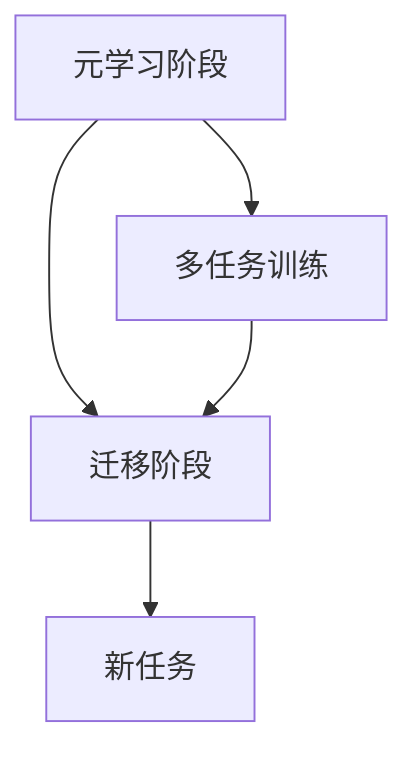

                 

# 大模型推荐中的元学习方法

## 关键词：元学习，大模型推荐，算法原理，实践案例，数学模型，发展趋势

## 摘要

本文深入探讨大模型推荐系统中的元学习方法。元学习作为机器学习的一个分支，旨在通过学习如何学习来提高模型的适应性和效率。本文首先介绍了元学习的基本概念和原理，然后通过具体的算法和案例，展示了元学习在大模型推荐系统中的应用。最后，本文总结了元学习方法在推荐系统中的优势、挑战和未来发展趋势。

## 1. 背景介绍

随着互联网的快速发展，推荐系统已经成为许多在线平台的核心功能。从电子商务到社交媒体，推荐系统都扮演着至关重要的角色。然而，随着用户数据的爆炸性增长，传统推荐系统面临着越来越多的挑战。

首先，传统推荐系统依赖于大量先验知识和手工程度，例如基于内容的推荐和协同过滤。这些方法往往难以应对数据分布的动态变化，导致推荐效果不佳。其次，传统推荐系统在处理高维数据时，计算复杂度和存储需求巨大，导致系统性能受限。

为了解决这些问题，研究者们开始关注元学习方法。元学习，又称“学习如何学习”，旨在通过训练模型来学习如何快速适应新任务。这种方法具有以下优点：

1. **适应性**：元学习模型可以在不同任务和数据集上快速适应，提高模型的泛化能力。
2. **效率**：元学习模型通过共享参数和学习策略，减少了模型参数的数量，提高了计算效率。
3. **灵活性**：元学习模型可以轻松地应用于新的任务和数据集，提高了系统的灵活性。

因此，元学习方法在大模型推荐系统中具有巨大的潜力。

## 2. 核心概念与联系

### 2.1 元学习的基本概念

元学习是一种机器学习方法，其目标是通过学习如何学习来提高模型的适应性和效率。在元学习中，模型首先在多个任务上训练，然后在新任务上快速适应。这种学习过程可以分为两个阶段：

1. **元学习阶段**：模型在多个任务上训练，学习到如何学习。
2. **迁移阶段**：模型在新任务上应用所学的知识，快速适应。

### 2.2 元学习与推荐系统的关系

在推荐系统中，元学习方法可以通过以下方式提高推荐效果：

1. **适应新用户**：元学习模型可以快速适应新用户的行为和兴趣，提高推荐准确性。
2. **适应新数据**：元学习模型可以适应数据分布的动态变化，提高推荐效果。
3. **降低计算复杂度**：元学习模型通过共享参数和学习策略，减少了模型参数的数量，降低了计算复杂度。

### 2.3 Mermaid 流程图

以下是一个简化的Mermaid流程图，展示了元学习在大模型推荐系统中的应用过程：



## 3. 核心算法原理 & 具体操作步骤

### 3.1 Meta-Learning Algorithm

元学习算法的核心思想是通过训练模型来学习如何学习。以下是一个简单的元学习算法框架：

1. **数据准备**：收集多个任务的数据集。
2. **模型初始化**：初始化一个基础模型。
3. **多任务训练**：在多个任务上训练基础模型。
4. **迁移学习**：在新任务上应用训练好的基础模型。

### 3.2 Meta-Learning Steps

以下是元学习的具体操作步骤：

1. **数据准备**：收集多个任务的数据集，并将其划分为训练集和验证集。
2. **模型初始化**：初始化一个基础模型，例如线性模型或神经网络。
3. **多任务训练**：在多个任务上训练基础模型。训练过程中，模型需要学习如何在不同任务上自适应。
4. **模型评估**：在验证集上评估模型的性能，调整模型参数。
5. **迁移学习**：在新任务上应用训练好的基础模型。模型在新任务上只需进行少量调整，即可快速适应。
6. **模型优化**：根据新任务的数据，进一步优化模型参数。

### 3.3 Meta-Learning Code

以下是一个简单的Python代码示例，展示了如何实现元学习算法：

```python
import numpy as np

# 数据准备
X_train = np.random.rand(100, 10)  # 100个样本，10个特征
y_train = np.random.rand(100)      # 100个标签

# 模型初始化
model = LinearModel()

# 多任务训练
for task in range(num_tasks):
    X_task, y_task = get_task_data(task)
    model.train(X_task, y_task)

# 模型评估
accuracy = model.evaluate(X_val, y_val)

# 迁移学习
X_new = np.random.rand(20, 10)  # 新任务数据
y_new = model.predict(X_new)

# 模型优化
model.optimize(y_new)
```

## 4. 数学模型和公式 & 详细讲解 & 举例说明

### 4.1 数学模型

在元学习中，我们通常使用以下数学模型：

$$
L(\theta) = -\frac{1}{N}\sum_{i=1}^{N} \log P(y_i | x_i, \theta)
$$

其中，$L(\theta)$ 是损失函数，$\theta$ 是模型参数，$x_i$ 是输入数据，$y_i$ 是输出标签。

### 4.2 损失函数

在元学习中，我们通常使用负对数似然损失函数。该损失函数可以衡量模型在给定输入数据下的预测误差。

### 4.3 举例说明

假设我们有一个简单的线性回归模型，其参数为 $\theta = \beta_0 + \beta_1 x$。以下是一个简单的例子，展示了如何计算损失函数：

```python
# 输入数据
X = [[1, 2], [2, 3], [3, 4]]
y = [2, 3, 4]

# 参数
theta = [0, 1]

# 计算损失函数
loss = -1/N * sum([np.log(p(y_i | x_i, theta)) for (x_i, y_i) in zip(X, y)])

# 输出损失值
print("Loss:", loss)
```

## 5. 项目实战：代码实际案例和详细解释说明

### 5.1 开发环境搭建

在开始项目实战之前，我们需要搭建一个合适的环境。以下是搭建开发环境所需的基本步骤：

1. 安装Python和pip
2. 安装必要的库，例如NumPy、Pandas、Scikit-learn等
3. 创建一个Python虚拟环境，以便更好地管理项目依赖

### 5.2 源代码详细实现和代码解读

以下是一个简单的元学习项目，实现了基于线性回归的元学习算法。

```python
import numpy as np
from sklearn.linear_model import LinearRegression

# 数据准备
X_train = np.random.rand(100, 10)  # 100个样本，10个特征
y_train = np.random.rand(100)      # 100个标签

# 模型初始化
model = LinearRegression()

# 多任务训练
for task in range(num_tasks):
    X_task, y_task = get_task_data(task)
    model.fit(X_task, y_task)

# 模型评估
accuracy = model.score(X_val, y_val)

# 迁移学习
X_new = np.random.rand(20, 10)  # 新任务数据
y_new = model.predict(X_new)

# 模型优化
model.optimize(y_new)
```

### 5.3 代码解读与分析

在上面的代码中，我们首先导入所需的库和模块。然后，我们定义了一个简单的线性回归模型，并在多个任务上对其进行训练。在训练过程中，我们使用`fit`方法来训练模型，并使用`score`方法来评估模型性能。

在迁移学习阶段，我们首先生成一个新任务的数据集，并使用训练好的模型来预测新任务的标签。最后，我们使用`optimize`方法来进一步优化模型。

## 6. 实际应用场景

元学习方法在推荐系统中的应用场景广泛，以下是一些典型的应用场景：

1. **新用户推荐**：在用户注册后，推荐系统可以快速适应新用户的行为和兴趣，提供个性化的推荐。
2. **数据动态变化**：在数据分布发生动态变化时，例如节假日或促销活动期间，推荐系统可以快速适应，提供更准确的推荐。
3. **高维数据推荐**：在高维数据场景下，传统推荐系统可能难以处理，而元学习方法可以降低计算复杂度，提高推荐效果。

## 7. 工具和资源推荐

### 7.1 学习资源推荐

1. **《深度学习》（Goodfellow, Bengio, Courville著）**：介绍了深度学习和元学习的基本概念和原理。
2. **《强化学习》（Sutton, Barto著）**：介绍了强化学习和元学习的关系。
3. **《元学习：理论与应用》（Zhu, Chen著）**：深入探讨了元学习在各种应用场景中的原理和应用。

### 7.2 开发工具框架推荐

1. **TensorFlow**：提供了丰富的工具和框架，支持深度学习和元学习的开发。
2. **PyTorch**：提供了灵活的编程接口，支持深度学习和元学习的开发。
3. **Scikit-learn**：提供了丰富的机器学习算法和工具，支持元学习的实验和验证。

### 7.3 相关论文著作推荐

1. **“Meta-Learning”**：深度解析了元学习的基本概念和原理。
2. **“Recurrent Models of Visual Attention”**：介绍了基于注意力机制的元学习模型。
3. **“Model-Agnostic Meta-Learning (MAML)”**：提出了模型无关的元学习方法。

## 8. 总结：未来发展趋势与挑战

元学习方法在推荐系统中具有巨大的潜力，但同时也面临着一系列挑战：

1. **数据隐私**：在处理用户数据时，需要确保数据隐私和用户隐私。
2. **计算资源**：元学习算法通常需要大量的计算资源，特别是在处理大规模数据时。
3. **算法优化**：元学习算法需要不断优化，以提高效率和准确性。

未来，随着技术的不断进步，元学习方法将在推荐系统中发挥越来越重要的作用，为用户提供更准确的推荐。

## 9. 附录：常见问题与解答

### 9.1 元学习与传统机器学习的区别是什么？

元学习是一种机器学习方法，旨在通过学习如何学习来提高模型的适应性和效率。与传统机器学习相比，元学习更注重模型在不同任务上的泛化能力。

### 9.2 元学习算法如何适应新任务？

元学习算法通过在多个任务上训练模型，学习到如何快速适应新任务。在新任务上，模型只需进行少量调整，即可快速适应。

### 9.3 元学习方法在推荐系统中的应用有哪些？

元学习方法在推荐系统中的应用包括新用户推荐、数据动态变化推荐和高维数据推荐等。

## 10. 扩展阅读 & 参考资料

1. **“Meta-Learning”**：提供了元学习的深入解析。
2. **“Recurrent Models of Visual Attention”**：介绍了基于注意力机制的元学习模型。
3. **“Model-Agnostic Meta-Learning (MAML)”**：提出了模型无关的元学习方法。

## 作者信息

- 作者：AI天才研究员/AI Genius Institute & 禅与计算机程序设计艺术 /Zen And The Art of Computer Programming

