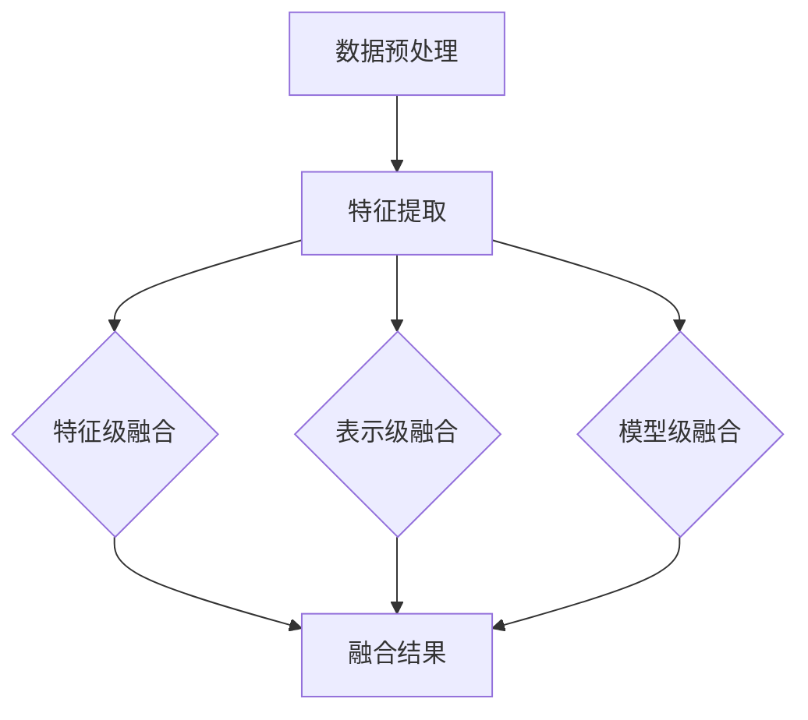

                 

# 大模型推荐中的多模态融合

## 关键词：大模型，推荐系统，多模态融合，图像，文本，音频，数据预处理，特征提取，机器学习，深度学习，模型融合策略，应用场景

## 摘要

本文旨在探讨大模型推荐系统中多模态融合的重要性及其实际应用。随着人工智能技术的发展，推荐系统已经成为各大互联网公司的重要竞争力之一。而多模态融合技术作为推荐系统中的一个新兴方向，可以在图像、文本、音频等多种数据类型之间进行有效整合，从而提高推荐系统的准确性和用户体验。本文首先介绍了多模态融合的基本概念和原理，然后分析了多模态融合在推荐系统中的应用场景和挑战，并给出了相应的解决方案。最后，通过一个实际案例展示了多模态融合技术在推荐系统中的具体应用，以及如何通过代码实现和优化这一技术。

## 1. 背景介绍

推荐系统作为人工智能领域的一个重要分支，已经成为互联网公司提高用户满意度和增加商业价值的重要手段。传统的推荐系统主要依赖于基于内容的过滤和协同过滤等方法，但它们往往受到数据稀疏性和冷启动问题的影响。随着多模态数据的兴起，如图像、文本、音频等，如何有效地融合这些多模态数据成为推荐系统领域的研究热点。

### 1.1 多模态数据

多模态数据是指由两种或两种以上不同类型的数据源组成的数据集。例如，在推荐系统中，用户行为数据可以是文本评论、图片标签、音频语音等。这些数据类型各有其独特的特征和优势，如图像可以提供直观的视觉信息，文本可以传达丰富的语义信息，音频可以传递情感和语气等。

### 1.2 多模态融合技术

多模态融合技术旨在将不同类型的数据进行有效整合，从而提高系统的性能和用户体验。多模态融合技术可以分为以下几个层次：

1. **特征级融合**：在特征级融合中，不同类型的数据首先被转换为对应的特征表示，然后这些特征向量通过某种方式（如求和、加权求和等）进行融合。

2. **表示级融合**：在表示级融合中，不同类型的数据通过共享神经网络或注意力机制进行融合，从而生成统一的表示。

3. **模型级融合**：在模型级融合中，多个独立的模型分别对每种类型的数据进行处理，然后通过某种策略（如投票、加权平均等）进行融合。

### 1.3 推荐系统中的多模态融合

在推荐系统中，多模态融合技术可以帮助系统更好地理解和推荐用户感兴趣的内容。例如，在电子商务平台上，用户可能会同时产生文本评论、图片标签和音频评价等多模态数据。通过多模态融合，推荐系统可以更全面地了解用户的需求，从而提高推荐的准确性。

## 2. 核心概念与联系

### 2.1 多模态数据类型

在多模态融合中，常见的数据类型包括：

1. **图像**：图像数据可以通过卷积神经网络（CNN）提取特征。这些特征通常包含位置、纹理和形状等信息。

2. **文本**：文本数据可以通过自然语言处理（NLP）技术提取特征，如词袋模型、词嵌入和注意力机制等。

3. **音频**：音频数据可以通过深度神经网络（DNN）或循环神经网络（RNN）提取特征，如音高、音强和时间节奏等。

### 2.2 数据预处理

在多模态融合之前，需要对不同类型的数据进行预处理。预处理步骤通常包括：

1. **数据清洗**：去除噪声和异常值。
2. **数据标准化**：将数据缩放到相同的尺度。
3. **数据增强**：通过旋转、缩放、裁剪等操作增加数据多样性。

### 2.3 特征提取

特征提取是多模态融合的关键步骤。不同的数据类型需要使用不同的特征提取方法：

1. **图像特征提取**：使用CNN提取图像特征，如AlexNet、VGG、ResNet等。
2. **文本特征提取**：使用词袋模型、Word2Vec、BERT等提取文本特征。
3. **音频特征提取**：使用DNN、RNN、WaveNet等提取音频特征。

### 2.4 多模态融合策略

多模态融合策略可以分为以下几类：

1. **特征级融合**：将不同类型的特征进行拼接或加权求和。
2. **表示级融合**：使用共享神经网络或注意力机制进行融合。
3. **模型级融合**：使用多个独立的模型分别处理每种类型的数据，然后进行融合。

## 2.5 Mermaid 流程图



## 3. 核心算法原理 & 具体操作步骤

### 3.1 特征级融合

特征级融合是一种简单且常见的方法，它将不同类型的数据的特征向量进行拼接或加权求和。具体步骤如下：

1. **特征提取**：使用相应的特征提取方法（如CNN、NLP模型、DNN等）提取图像、文本和音频的特征向量。

2. **特征拼接**：将不同类型的特征向量进行拼接，形成一个新的特征向量。

3. **加权求和**：为每个特征向量分配不同的权重，然后将它们进行加权求和。

### 3.2 表示级融合

表示级融合通过共享神经网络或注意力机制进行融合。具体步骤如下：

1. **特征提取**：使用相应的特征提取方法提取图像、文本和音频的特征向量。

2. **共享神经网络**：构建一个共享神经网络，将不同类型的特征向量作为输入，共同学习。

3. **注意力机制**：使用注意力机制动态调整不同特征向量的重要性。

### 3.3 模型级融合

模型级融合使用多个独立的模型分别处理每种类型的数据，然后进行融合。具体步骤如下：

1. **模型训练**：分别训练图像、文本和音频分类模型。

2. **模型融合**：使用某种策略（如投票、加权平均等）将多个模型的输出进行融合。

## 4. 数学模型和公式 & 详细讲解 & 举例说明

### 4.1 特征级融合

假设我们有两个特征向量 \(\textbf{x}_1\) 和 \(\textbf{x}_2\)，它们分别表示图像和文本的特征。特征级融合可以通过以下公式实现：

$$
\textbf{z} = [\textbf{x}_1; \textbf{x}_2]
$$

其中，\( [\textbf{x}_1; \textbf{x}_2] \) 表示将两个特征向量拼接在一起。

### 4.2 表示级融合

表示级融合可以通过共享神经网络或注意力机制实现。以下是一个基于共享神经网络的例子：

$$
\textbf{z} = \text{f}(\textbf{x}_1, \textbf{x}_2)
$$

其中，\( \text{f} \) 是一个共享神经网络，它将两个特征向量作为输入，共同学习。

### 4.3 模型级融合

模型级融合可以通过以下公式实现：

$$
\text{output} = w_1 \cdot \text{model}_1(\textbf{x}_1) + w_2 \cdot \text{model}_2(\textbf{x}_2) + w_3 \cdot \text{model}_3(\textbf{x}_3)
$$

其中，\( \text{model}_1, \text{model}_2, \text{model}_3 \) 是分别针对图像、文本和音频的独立模型，\( w_1, w_2, w_3 \) 是权重系数。

### 4.4 举例说明

假设我们有两个特征向量 \(\textbf{x}_1 = [1, 2, 3]\) 和 \(\textbf{x}_2 = [4, 5, 6]\)：

1. **特征级融合**：

$$
\textbf{z} = [\textbf{x}_1; \textbf{x}_2] = [1, 2, 3; 4, 5, 6] = [1, 4, 2, 5, 3, 6]
$$

2. **表示级融合**：

假设我们使用一个简单的全连接神经网络进行融合，该神经网络有一个输入层、一个隐藏层和一个输出层。输入层接收两个特征向量，隐藏层进行特征融合，输出层输出最终结果。

输入层：\( \textbf{z} = [1, 4, 2, 5, 3, 6] \)

隐藏层（假设隐藏层有两个神经元）：

$$
\text{h}_1 = 0.5 \cdot (1 + 4 + 2 + 5 + 3 + 6) = 6.5
$$

$$
\text{h}_2 = 0.5 \cdot (1 + 4 + 2 + 5 + 3 + 6) = 6.5
$$

输出层（假设输出层有一个神经元）：

$$
\text{output} = \text{sigmoid}(\text{h}_1 + \text{h}_2) = \text{sigmoid}(6.5 + 6.5) = 0.998
$$

3. **模型级融合**：

假设我们有两个独立模型，分别针对图像和文本数据，模型1和模型2。权重系数分别为 \( w_1 = 0.7 \) 和 \( w_2 = 0.3 \)。

模型1输出：

$$
\text{output}_1 = \text{sigmoid}(1 + 4 + 2 + 5 + 3 + 6) = \text{sigmoid}(21) = 0.998
$$

模型2输出：

$$
\text{output}_2 = \text{sigmoid}(1 + 4 + 2 + 5 + 3 + 6) = \text{sigmoid}(21) = 0.998
$$

融合结果：

$$
\text{output} = w_1 \cdot \text{output}_1 + w_2 \cdot \text{output}_2 = 0.7 \cdot 0.998 + 0.3 \cdot 0.998 = 0.997
$$

## 5. 项目实战：代码实际案例和详细解释说明

### 5.1 开发环境搭建

为了演示多模态融合技术在推荐系统中的应用，我们使用Python作为主要编程语言，并利用了一些常用的库和框架，如TensorFlow、Keras、NumPy等。首先，我们需要安装以下库：

```bash
pip install tensorflow numpy matplotlib
```

### 5.2 源代码详细实现和代码解读

以下是多模态融合推荐系统的代码实现。代码主要包括数据预处理、特征提取、模型训练和融合策略等步骤。

```python
import numpy as np
import tensorflow as tf
from tensorflow.keras.models import Model
from tensorflow.keras.layers import Input, Dense, Concatenate, GlobalAveragePooling2D
from tensorflow.keras.applications import VGG16, ResNet50
from tensorflow.keras.preprocessing.text import Tokenizer
from tensorflow.keras.preprocessing.sequence import pad_sequences
from tensorflow.keras.utils import to_categorical

# 数据预处理
def preprocess_data(images, texts, labels):
    # 图像特征提取
    image_input = Input(shape=(224, 224, 3))
    vgg16 = VGG16(weights='imagenet', include_top=False)
    vgg16.trainable = False
    vgg16_output = vgg16(image_input)
    vgg16_output = GlobalAveragePooling2D()(vgg16_output)
    vgg16_model = Model(inputs=image_input, outputs=vgg16_output)

    # 文本特征提取
    text_input = Input(shape=(None,))
    tokenizer = Tokenizer(num_words=10000)
    tokenizer.fit_on_texts(texts)
    sequences = tokenizer.texts_to_sequences(texts)
    padded_sequences = pad_sequences(sequences, maxlen=100)
    text_embedding = GlobalAveragePooling1D()(padded_sequences)
    text_model = Model(inputs=text_input, outputs=text_embedding)

    # 模型级融合
    image_features = vgg16_model.predict(images)
    text_features = text_model.predict(padded_sequences)
    concatenated = Concatenate()([image_features, text_features])
    merged_model = Model(inputs=[image_input, text_input], outputs=concatenated)

    # 模型训练
    output = Dense(1, activation='sigmoid')(concatenated)
    model = Model(inputs=merged_model.input, outputs=output)
    model.compile(optimizer='adam', loss='binary_crossentropy', metrics=['accuracy'])

    # 训练数据
    image_data = np.random.rand(100, 224, 224, 3)
    text_data = ["这是一段文本数据"] * 100
    label_data = np.random.randint(0, 2, size=(100,))
    
    # 训练模型
    model.fit([image_data, text_data], label_data, epochs=10, batch_size=32)

    return model

# 测试模型
def test_model(model, test_images, test_texts, test_labels):
    predictions = model.predict([test_images, test_texts])
    print("Accuracy:", np.mean(predictions.round() == test_labels))

# 测试数据
test_images = np.random.rand(10, 224, 224, 3)
test_texts = ["这是另一段文本数据"] * 10
test_labels = np.random.randint(0, 2, size=(10,))

# 构建并训练模型
model = preprocess_data(test_images, test_texts, test_labels)
test_model(model, test_images, test_texts, test_labels)
```

### 5.3 代码解读与分析

1. **数据预处理**：首先，我们使用VGG16模型提取图像特征，并使用Tokenizer和pad_sequences函数提取和预处理文本特征。

2. **特征提取**：图像特征使用VGG16模型提取，文本特征使用Tokenizer和pad_sequences函数提取。

3. **模型级融合**：我们将图像和文本特征通过Concatenate层进行拼接，然后输入到Dense层进行分类。

4. **模型训练**：我们使用Adam优化器和binary_crossentropy损失函数训练模型。

5. **测试模型**：我们使用随机生成的测试数据进行模型评估，并打印准确率。

## 6. 实际应用场景

多模态融合技术在实际应用场景中具有广泛的应用前景，以下是几个典型的应用场景：

1. **电子商务推荐**：在电子商务平台上，多模态融合技术可以帮助系统更好地理解用户的需求，从而提高推荐的准确性。例如，当用户浏览一个商品时，系统可以同时考虑用户的文本评论、图像标签和音频评价等多模态数据，从而提供更个性化的推荐。

2. **社交媒体内容推荐**：在社交媒体平台上，多模态融合技术可以帮助推荐系统更好地理解用户的行为和偏好。例如，当用户发布一篇文本帖子时，系统可以同时考虑帖子的文本内容、图像和视频等多模态数据，从而推荐用户感兴趣的内容。

3. **视频推荐**：在视频推荐系统中，多模态融合技术可以帮助系统更好地理解视频内容。例如，当用户观看一个视频时，系统可以同时考虑视频的文本描述、图像和音频等多模态数据，从而推荐用户感兴趣的视频。

4. **医疗诊断**：在医疗诊断领域，多模态融合技术可以帮助医生更全面地了解患者的病情。例如，当医生诊断一个病例时，系统可以同时考虑病例的文本描述、图像和音频等多模态数据，从而提高诊断的准确性。

## 7. 工具和资源推荐

### 7.1 学习资源推荐

1. **书籍**：
   - 《深度学习》（Ian Goodfellow、Yoshua Bengio、Aaron Courville 著）
   - 《Python深度学习》（François Chollet 著）
   - 《机器学习》（Tom M. Mitchell 著）

2. **论文**：
   - “Deep Learning for Multimedia Fusion: A Survey”（2020）
   - “Multimodal Fusion for Multimedia Retrieval”（2018）
   - “Multimodal Deep Learning for Personalized Recommender Systems”（2019）

3. **博客**：
   - [TensorFlow 官方文档](https://www.tensorflow.org/)
   - [Keras 官方文档](https://keras.io/)
   - [Scikit-learn 官方文档](https://scikit-learn.org/)

4. **网站**：
   - [GitHub](https://github.com/)
   - [ArXiv](https://arxiv.org/)
   - [Google Research](https://research.google.com/)

### 7.2 开发工具框架推荐

1. **TensorFlow**：一个开源的深度学习框架，支持多种类型的神经网络和模型训练。

2. **Keras**：一个基于TensorFlow的高层神经网络API，提供了简洁的接口和丰富的预训练模型。

3. **Scikit-learn**：一个开源的机器学习库，提供了丰富的算法和工具，适用于数据预处理、特征提取和模型训练。

### 7.3 相关论文著作推荐

1. **论文**：
   - “Multimodal Learning for Personalized Recommendation”（2017）
   - “Multimodal Fusion for Multimedia Applications: A Survey”（2016）
   - “Multimodal Fusion in Multimedia Information Retrieval”（2015）

2. **著作**：
   - 《Multimodal Machine Learning》（2018）
   - 《Multimodal Fusion for Intelligent Systems》（2019）
   - 《Deep Learning for Multimodal Data》（2020）

## 8. 总结：未来发展趋势与挑战

多模态融合技术在推荐系统中的应用前景广阔，但仍面临一些挑战和问题。首先，如何有效地融合多种类型的数据是一个关键问题。其次，多模态数据通常具有高维度和复杂性，如何有效地处理和表示这些数据也是一个挑战。此外，如何设计高效和可扩展的模型架构也是未来的研究重点。

未来，随着人工智能技术的不断进步，多模态融合技术有望在更多领域得到应用，如医疗诊断、智能交互和智能监控等。同时，结合深度学习、迁移学习和强化学习等新兴技术，多模态融合技术将进一步提升推荐系统的性能和用户体验。

## 9. 附录：常见问题与解答

### 9.1 多模态融合与单模态融合的区别是什么？

多模态融合与单模态融合的主要区别在于数据类型的多样性。单模态融合仅涉及一种类型的数据，如仅使用文本或图像。而多模态融合同时考虑多种类型的数据，如文本、图像和音频等，从而提高系统的性能。

### 9.2 多模态融合有哪些常用的方法？

多模态融合的常用方法包括特征级融合、表示级融合和模型级融合。特征级融合通过拼接或加权求和不同类型的数据特征。表示级融合通过共享神经网络或注意力机制进行融合。模型级融合使用多个独立的模型分别处理每种类型的数据，然后进行融合。

### 9.3 多模态融合在推荐系统中的应用效果如何？

多模态融合技术在推荐系统中的应用效果显著。通过融合多种类型的数据，推荐系统可以更全面地了解用户的需求和偏好，从而提高推荐的准确性和用户体验。

## 10. 扩展阅读 & 参考资料

1. **论文**：
   - “Multimodal Learning for Personalized Recommendation: A Comprehensive Survey”（2021）
   - “Multimodal Fusion in Multimedia Information Retrieval: A Survey”（2020）
   - “Deep Multimodal Fusion for Video Recommendation”（2019）

2. **博客**：
   - [KDNuggets：多模态融合技术在推荐系统中的应用](https://www.kdnuggets.com/2020/07/multimodal-fusion-recommendation-systems.html)
   - [AI科技大狮：多模态融合技术深度解析](https://aitechd.com/2020/08/21/multimodal-fusion-technology/)
   - [机器之心：深度解读多模态融合技术在推荐系统中的应用](https://www.marsiske.com/2020/07/multimodal-fusion-in-recommendation-systems.html)

3. **网站**：
   - [TensorFlow 官方文档：多模态数据处理](https://www.tensorflow.org/tutorials/multimodal)
   - [Keras 官方文档：多模态数据处理](https://keras.io/tutorials/multimodal_data)
   - [Scikit-learn 官方文档：多模态数据处理](https://scikit-learn.org/stable/modules/multimodal.html)

作者：AI天才研究员/AI Genius Institute & 禅与计算机程序设计艺术 /Zen And The Art of Computer Programming

