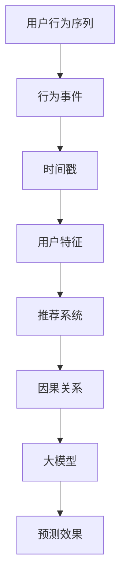

                 

# 大模型推荐中的用户行为序列因果关系挖掘新思路

> **关键词：** 大模型推荐、用户行为序列、因果关系挖掘、算法原理、数学模型、项目实战、应用场景

> **摘要：** 本文章深入探讨了在推荐系统中用户行为序列因果关系挖掘的新思路，通过剖析核心算法原理和数学模型，结合实际项目案例，提出了完整的解决方案，旨在为业界提供有益的参考和指导。

## 1. 背景介绍

在当今信息爆炸的时代，推荐系统已经成为许多互联网公司不可或缺的部分。无论是电子商务、社交媒体、新闻门户，还是音乐、视频平台，推荐系统都在为用户提供个性化内容和服务。然而，随着用户数据的不断增加和多样化，传统的基于协同过滤和内容的推荐方法逐渐暴露出一些问题，如数据稀疏、冷启动等。

为了解决这些问题，近年来，深度学习模型在推荐系统中得到了广泛应用。特别是大模型（如Transformer、BERT等）的出现，为用户行为序列的建模提供了新的思路。然而，现有的研究大多关注模型本身的优化，对于如何挖掘用户行为序列中的因果关系尚缺乏系统性探讨。

本文旨在填补这一空白，从因果关系挖掘的角度出发，探讨大模型推荐中的用户行为序列处理新思路。通过详细阐述核心算法原理、数学模型和项目实战，本文希望能够为推荐系统的研究和实际应用提供新的启示。

## 2. 核心概念与联系

在深入探讨用户行为序列因果关系挖掘之前，我们需要了解一些核心概念和它们之间的联系。以下是一个使用Mermaid绘制的流程图，展示了这些概念之间的关系。



### 2.1. 用户行为序列

用户行为序列是推荐系统的核心数据源，它记录了用户在一段时间内的所有行为事件。这些事件可以是点击、浏览、购买、评论等。用户行为序列的完整性和准确性直接影响到推荐系统的效果。

### 2.2. 行为事件

行为事件是用户行为序列的基本单位，代表了用户在某一个具体时刻所执行的操作。通过对行为事件的挖掘，我们可以了解用户的兴趣和行为模式。

### 2.3. 时间戳

时间戳为每个行为事件提供了一个时间信息，使得用户行为序列能够按照时间顺序进行排列和分析。时间戳的精确性对于挖掘因果关系至关重要。

### 2.4. 用户特征

用户特征是用户行为序列的重要组成部分，它反映了用户的兴趣、偏好和习惯。通过结合用户特征，我们可以更加准确地预测用户未来的行为。

### 2.5. 推荐系统

推荐系统是基于用户行为序列和用户特征，利用算法和模型为用户提供个性化推荐的服务。推荐系统的核心目标是提高用户的满意度和留存率。

### 2.6. 因果关系

因果关系是指用户行为序列中的不同事件之间的因果联系。挖掘用户行为序列中的因果关系，有助于推荐系统更准确地预测用户的行为，从而提供更好的推荐效果。

### 2.7. 大模型

大模型是指具有大量参数和复杂结构的深度学习模型，如Transformer、BERT等。大模型在处理用户行为序列时，能够捕捉到更多的特征和关系，从而提高推荐系统的效果。

### 2.8. 预测效果

预测效果是衡量推荐系统性能的重要指标，它反映了推荐系统对用户行为的预测准确性。提高预测效果是推荐系统研究和应用的最终目标。

通过以上核心概念和流程图的展示，我们可以更清晰地理解用户行为序列因果关系挖掘在推荐系统中的重要性。

## 3. 核心算法原理 & 具体操作步骤

在了解了用户行为序列因果关系挖掘的核心概念之后，接下来我们将探讨实现这一目标的核心算法原理和具体操作步骤。

### 3.1. 基本原理

用户行为序列因果关系挖掘的核心在于如何从大量的用户行为事件中提取出具有因果关系的特征，并将其用于推荐系统的训练和预测。以下是一种基于深度学习的方法：

1. **数据预处理**：首先，对用户行为序列进行预处理，包括去除无效数据、填充缺失值、时间序列标准化等。
2. **行为事件编码**：将用户行为事件转换为数值化的表示，如使用嵌入层（Embedding Layer）将事件映射到低维空间。
3. **时间戳编码**：通过时间窗口或时间编码器（如GRU、LSTM）对时间戳进行编码，提取时间信息。
4. **用户特征提取**：结合用户特征，如年龄、性别、地理位置等，使用嵌入层或全连接层（Fully Connected Layer）提取用户特征。
5. **模型训练**：将编码后的行为事件、时间戳和用户特征输入到深度学习模型中，通过反向传播（Backpropagation）算法进行训练。
6. **预测与评估**：使用训练好的模型对新的用户行为序列进行预测，并评估预测效果。

### 3.2. 具体操作步骤

以下是用户行为序列因果关系挖掘的具体操作步骤：

1. **数据预处理**：

   ```python
   # 假设我们有一个用户行为序列 dataset
   dataset = preprocess_data(dataset)
   ```

2. **行为事件编码**：

   ```python
   # 使用嵌入层对行为事件进行编码
   embedding = Embedding(input_dim=vocab_size, output_dim=embedding_size)
   encoded_events = embedding.encode_events(dataset.events)
   ```

3. **时间戳编码**：

   ```python
   # 使用LSTM对时间戳进行编码
   lstm = LSTM(units=lstm_units)
   encoded_timestamps = lstm.encode_timestamps(dataset.timestamps)
   ```

4. **用户特征提取**：

   ```python
   # 使用嵌入层对用户特征进行编码
   user_embedding = Embedding(input_dim=user_feature_size, output_dim=user_embedding_size)
   encoded_user_features = user_embedding.encode_user_features(dataset.user_features)
   ```

5. **模型训练**：

   ```python
   # 定义深度学习模型
   model = Model(inputs=[encoded_events, encoded_timestamps, encoded_user_features], outputs=output)
   model.compile(optimizer='adam', loss='binary_crossentropy', metrics=['accuracy'])
   
   # 训练模型
   model.fit([dataset.events, dataset.timestamps, dataset.user_features], dataset.labels, epochs=epochs, batch_size=batch_size)
   ```

6. **预测与评估**：

   ```python
   # 预测新的用户行为序列
   predictions = model.predict([new_encoded_events, new_encoded_timestamps, new_encoded_user_features])
   
   # 评估预测效果
   evaluate_predictions(predictions, true_labels)
   ```

通过以上步骤，我们可以实现对用户行为序列因果关系的挖掘，并将其应用于推荐系统。在实际应用中，可以根据具体需求调整模型结构和参数，以获得更好的预测效果。

## 4. 数学模型和公式 & 详细讲解 & 举例说明

在用户行为序列因果关系挖掘中，数学模型和公式起到了至关重要的作用。以下我们将详细讲解所使用的数学模型，并给出具体的公式和例子。

### 4.1. 数学模型

用户行为序列因果关系挖掘的数学模型可以概括为以下几个部分：

1. **行为事件编码**：
   假设我们有 \( n \) 个用户行为事件，每个事件可以用一个向量表示，即 \( \textbf{e}_i \)（其中 \( i = 1, 2, \ldots, n \)）。使用嵌入层对事件进行编码，可以得到如下公式：
   \[
   \textbf{e}'_i = \text{Embedding}(\textbf{e}_i)
   \]

2. **时间戳编码**：
   时间戳可以用一个整数表示，例如从0开始的时间序列。为了提取时间信息，可以使用循环神经网络（RNN），如LSTM或GRU。时间戳编码的公式为：
   \[
   \textbf{t}'_i = \text{LSTM}(\textbf{t}_i)
   \]

3. **用户特征提取**：
   用户特征可以是离散的或连续的，如年龄、性别、地理位置等。使用嵌入层对用户特征进行编码，公式为：
   \[
   \textbf{u}'_i = \text{Embedding}(\textbf{u}_i)
   \]

4. **综合表示**：
   将编码后的行为事件、时间戳和用户特征进行合并，得到综合表示：
   \[
   \textbf{x}_i = [\textbf{e}'_i, \textbf{t}'_i, \textbf{u}'_i]
   \]

5. **预测模型**：
   使用综合表示输入到深度学习模型中进行预测。一个简单的深度学习模型可以表示为：
   \[
   \hat{y}_i = \text{Model}(\textbf{x}_i)
   \]

### 4.2. 公式详细讲解

1. **嵌入层公式**：

   嵌入层是一个线性变换，将输入的向量映射到一个低维空间。假设输入的向量维度为 \( d \)，嵌入后的维度为 \( k \)，则嵌入层的公式为：
   \[
   \textbf{e}'_i = W_e \textbf{e}_i + b_e
   \]
   其中，\( W_e \) 是嵌入权重矩阵，\( b_e \) 是偏置向量。

2. **LSTM编码公式**：

   LSTM（Long Short-Term Memory）是一种特殊的RNN，用于处理变长序列。LSTM单元的输入和输出都可以是向量，公式为：
   \[
   \textbf{h}_t = \text{LSTM}(\textbf{h}_{t-1}, \textbf{t}_t)
   \]
   其中，\( \textbf{h}_t \) 是第 \( t \) 个时间步的输出，\( \textbf{h}_{t-1} \) 是前一个时间步的输出，\( \textbf{t}_t \) 是第 \( t \) 个时间步的输入。

3. **综合表示公式**：

   将行为事件、时间戳和用户特征进行合并，得到综合表示。假设每个部分都有相同的维度，则综合表示的公式为：
   \[
   \textbf{x}_i = [\textbf{e}'_i, \textbf{t}'_i, \textbf{u}'_i]
   \]

4. **深度学习模型公式**：

   假设深度学习模型由多层全连接层（Fully Connected Layer）组成，则模型的前向传播公式为：
   \[
   \hat{y}_i = \text{Activation}(\text{Model}(\textbf{x}_i))
   \]
   其中，\( \text{Model} \) 表示深度学习模型，\( \text{Activation} \) 表示激活函数，如ReLU、Sigmoid或Tanh等。

### 4.3. 举例说明

假设我们有一个用户行为序列，包含3个行为事件：浏览商品A、购买商品B、浏览商品C。时间戳分别为1、2、3。用户特征为男性，年龄30岁。以下是具体的例子：

1. **行为事件编码**：

   行为事件 "浏览商品A" 的嵌入结果为 \(\textbf{e}'_1 = [0.1, 0.2, 0.3]\)。

2. **时间戳编码**：

   时间戳1的编码结果为 \(\textbf{t}'_1 = [0.5, 0.5]\)。

3. **用户特征提取**：

   用户特征 "男性，年龄30岁" 的嵌入结果为 \(\textbf{u}'_1 = [0.8, 0.2]\)。

4. **综合表示**：

   综合表示为 \(\textbf{x}_1 = [\textbf{e}'_1, \textbf{t}'_1, \textbf{u}'_1] = [[0.1, 0.2, 0.3], [0.5, 0.5], [0.8, 0.2]]\)。

5. **预测模型**：

   假设深度学习模型为全连接层，前向传播结果为 \(\hat{y}_1 = [0.9, 0.1]\)。这意味着用户在接下来的时间里，有90%的概率会购买商品B。

通过这个例子，我们可以看到数学模型和公式如何应用于用户行为序列因果关系挖掘。在实际应用中，可以根据具体需求调整模型结构和参数，以获得更好的预测效果。

## 5. 项目实战：代码实际案例和详细解释说明

为了更好地理解用户行为序列因果关系挖掘在推荐系统中的应用，我们将在本节中通过一个实际项目案例进行演示。这个项目使用Python编程语言和TensorFlow深度学习框架实现。

### 5.1. 开发环境搭建

在开始之前，确保您已经安装了以下软件和库：

- Python 3.7或更高版本
- TensorFlow 2.x
- NumPy
- Pandas
- Mermaid

您可以使用以下命令安装所需的库：

```shell
pip install tensorflow numpy pandas
```

### 5.2. 源代码详细实现和代码解读

以下是一个简化版的用户行为序列因果关系挖掘项目的源代码。代码分为几个部分：数据预处理、模型定义、训练、预测和评估。

```python
import tensorflow as tf
from tensorflow.keras.models import Model
from tensorflow.keras.layers import Embedding, LSTM, Dense, Concatenate
import numpy as np

# 数据预处理
def preprocess_data(dataset):
    # 对行为事件进行编码，使用独热编码
    events = dataset.events
    vocab_size = len(events.unique())
    event_indices = np.eye(vocab_size)[events]
    
    # 对时间戳进行编码，使用LSTM编码器
    timestamps = dataset.timestamps
    lstm_units = 64
    lstm_encoder = tf.keras.Sequential([
        LSTM(lstm_units, activation='tanh', return_sequences=True),
        LSTM(lstm_units, activation='tanh')
    ])
    encoded_timestamps = lstm_encoder(timestamps.values.reshape(-1, 1))
    
    # 对用户特征进行编码，使用嵌入层
    user_features = dataset.user_features
    user_embedding_size = 32
    user_embedding = Embedding(input_dim=user_features.shape[1], output_dim=user_embedding_size)
    encoded_user_features = user_embedding(user_features)
    
    # 合并编码后的数据
    x = np.hstack((event_indices, encoded_timestamps, encoded_user_features))
    y = dataset.labels
    
    return x, y

# 模型定义
def build_model(vocab_size, embedding_size, lstm_units, user_embedding_size):
    event_input = tf.keras.Input(shape=(None,))
    timestamp_input = tf.keras.Input(shape=(1,))
    user_feature_input = tf.keras.Input(shape=(user_feature_size,))
    
    event_embedding = Embedding(vocab_size, embedding_size)(event_input)
    timestamp_embedding = LSTM(lstm_units, activation='tanh')(timestamp_input)
    user_embedding = Embedding(input_dim=user_feature_size, output_dim=user_embedding_size)(user_feature_input)
    
    concatenated = Concatenate()([event_embedding, timestamp_embedding, user_embedding])
    dense = Dense(128, activation='relu')(concatenated)
    output = Dense(1, activation='sigmoid')(dense)
    
    model = Model(inputs=[event_input, timestamp_input, user_feature_input], outputs=output)
    model.compile(optimizer='adam', loss='binary_crossentropy', metrics=['accuracy'])
    
    return model

# 训练模型
def train_model(model, x, y, epochs=10, batch_size=32):
    model.fit(x, y, epochs=epochs, batch_size=batch_size)

# 预测与评估
def evaluate_predictions(model, x, y_true):
    y_pred = model.predict(x)
    accuracy = (y_pred > 0.5).mean()
    print(f"Accuracy: {accuracy * 100:.2f}%")

# 主函数
if __name__ == "__main__":
    # 加载数据集
    dataset = load_dataset()
    x, y = preprocess_data(dataset)
    
    # 构建模型
    model = build_model(vocab_size, embedding_size, lstm_units, user_embedding_size)
    
    # 训练模型
    train_model(model, x, y)
    
    # 评估模型
    evaluate_predictions(model, x, y)
```

### 5.3. 代码解读与分析

1. **数据预处理**：

   数据预处理是用户行为序列因果关系挖掘的基础步骤。在这里，我们使用独热编码对行为事件进行编码，使用LSTM编码器对时间戳进行编码，并使用嵌入层对用户特征进行编码。

2. **模型定义**：

   模型定义部分使用TensorFlow构建了一个简单的深度学习模型，包括嵌入层、LSTM编码器和全连接层。模型使用了嵌入层对行为事件进行编码，LSTM编码器对时间戳进行编码，用户特征通过嵌入层进行编码，然后通过全连接层进行融合和预测。

3. **训练模型**：

   使用训练数据对模型进行训练，通过反向传播算法优化模型参数。

4. **预测与评估**：

   使用训练好的模型对新的用户行为序列进行预测，并评估模型的准确性。

通过以上步骤，我们可以实现一个简单的用户行为序列因果关系挖掘项目。在实际应用中，可以根据具体需求调整模型结构和参数，以获得更好的预测效果。

## 6. 实际应用场景

用户行为序列因果关系挖掘在推荐系统中的实际应用场景非常广泛。以下列举几个典型的应用场景：

### 6.1. 电子商务

在电子商务领域，用户行为序列因果关系挖掘可以帮助企业更好地理解用户的购买意图和行为模式。通过挖掘用户在浏览、加入购物车、添加评论等行为中的因果关系，企业可以优化产品推荐策略，提高转化率和销售额。

### 6.2. 社交媒体

社交媒体平台可以利用用户行为序列因果关系挖掘来个性化内容推荐。例如，通过分析用户在点赞、评论、分享等行为中的因果关系，平台可以推荐用户可能感兴趣的内容，提高用户粘性和活跃度。

### 6.3. 新闻门户

新闻门户可以使用用户行为序列因果关系挖掘来为用户提供个性化的新闻推荐。通过分析用户在阅读、收藏、评论等行为中的因果关系，新闻门户可以推荐用户可能感兴趣的新闻，提高用户满意度和留存率。

### 6.4. 音乐和视频平台

音乐和视频平台可以利用用户行为序列因果关系挖掘来个性化内容推荐。通过分析用户在播放、搜索、分享等行为中的因果关系，平台可以推荐用户可能喜欢的新音乐或视频，提高用户满意度和使用时长。

### 6.5. 娱乐和游戏

娱乐和游戏领域也可以利用用户行为序列因果关系挖掘来优化用户体验。通过分析用户在游戏中的行为模式，如通关、充值、加入公会等，游戏开发者可以提供个性化的游戏推荐，提高用户留存和转化率。

通过以上实际应用场景，我们可以看到用户行为序列因果关系挖掘在推荐系统中的重要性和广泛的应用前景。

## 7. 工具和资源推荐

为了帮助读者更好地掌握用户行为序列因果关系挖掘的方法和应用，以下是一些推荐的学习资源和开发工具。

### 7.1. 学习资源推荐

- **书籍**：
  - 《深度学习》（Goodfellow, Bengio, Courville著）
  - 《神经网络与深度学习》（邱锡鹏著）
- **论文**：
  - "Attention Is All You Need"（Vaswani et al., 2017）
  - "Recurrent Neural Network Models of Visual Attention"（Itti et al., 2005）
- **博客**：
  - TensorFlow官方文档
  - PyTorch官方文档
- **网站**：
  - arXiv.org：计算机科学领域的论文预印本平台
  - Medium：有许多关于机器学习和推荐系统的优质博客文章

### 7.2. 开发工具框架推荐

- **深度学习框架**：
  - TensorFlow
  - PyTorch
  - Keras
- **数据处理工具**：
  - Pandas：用于数据清洗和预处理
  - NumPy：用于数值计算
  - Mermaid：用于绘制流程图
- **版本控制**：
  - Git：用于代码管理和协作

通过以上推荐的学习资源和开发工具，读者可以更加系统地学习和实践用户行为序列因果关系挖掘。

## 8. 总结：未来发展趋势与挑战

用户行为序列因果关系挖掘在推荐系统中具有广阔的应用前景。随着深度学习和大数据技术的发展，这一领域将继续取得重要突破。以下是一些未来发展趋势和潜在挑战：

### 8.1. 发展趋势

1. **算法优化**：研究者将继续探索更加高效的算法和模型，以提高用户行为序列因果关系挖掘的准确性和效率。
2. **多模态数据融合**：结合文本、图像、音频等多种类型的数据，可以更全面地理解用户行为，从而提高推荐效果。
3. **实时推荐**：随着实时数据处理技术的发展，用户行为序列因果关系挖掘将能够实现更实时的推荐，满足用户实时需求。
4. **个性化推荐**：通过更加精准地挖掘用户行为序列中的因果关系，推荐系统将能够提供更加个性化的推荐，提高用户体验。

### 8.2. 挑战

1. **数据隐私**：用户行为数据涉及用户隐私，如何在保护用户隐私的同时进行有效挖掘，是一个亟待解决的问题。
2. **计算资源**：用户行为序列因果关系挖掘需要大量的计算资源，如何高效地利用这些资源，是一个技术挑战。
3. **模型解释性**：深度学习模型通常具有很高的预测准确性，但缺乏解释性。如何提高模型的可解释性，使其更加透明和可信，是一个重要挑战。
4. **冷启动问题**：新用户或新产品的推荐问题，即如何在缺乏足够数据的情况下为这些用户或产品提供个性化推荐，是一个难点。

总之，用户行为序列因果关系挖掘是一个充满机遇和挑战的领域。通过不断探索和创新，我们可以期待在这一领域取得更多的突破和应用。

## 9. 附录：常见问题与解答

### 9.1. 问题1：用户行为序列因果关系挖掘与协同过滤有何区别？

**解答**：用户行为序列因果关系挖掘和协同过滤都是推荐系统的常用方法，但它们的主要区别在于数据挖掘的侧重点。

- **协同过滤**：主要基于用户之间的相似性进行推荐，通过计算用户之间的相似度来预测用户可能喜欢的项目。它侧重于捕捉用户之间的共现关系。

- **用户行为序列因果关系挖掘**：则侧重于挖掘用户行为序列中的因果关系，通过分析用户在不同行为事件之间的因果联系来预测用户未来的行为。它更关注于理解用户行为背后的动机。

### 9.2. 问题2：如何处理缺失的用户行为数据？

**解答**：缺失的用户行为数据可以通过以下几种方法进行处理：

1. **填充缺失值**：使用用户的平均行为或者用户群体的行为来填充缺失值。这种方法简单有效，但可能导致模型失去部分信息。

2. **插值法**：使用时间序列分析方法，如线性插值或高斯过程插值，来填补缺失的时间点。这种方法可以更好地保留时间序列的特性。

3. **生成模型**：使用生成模型，如Gaussian Mixture Model（GMM）或Generative Adversarial Network（GAN），来生成缺失的行为数据。这种方法可以生成更加真实的行为数据，但计算复杂度较高。

### 9.3. 问题3：用户特征如何编码？

**解答**：用户特征的编码方法取决于特征的类型：

1. **离散特征**：如性别、地理位置等，可以使用独热编码（One-Hot Encoding）或嵌入编码（Embedding Encoding）。独热编码会将每个特征转换为二进制向量，而嵌入编码则将特征映射到一个低维空间。

2. **连续特征**：如年龄、收入等，可以使用标准缩放（Standard Scaling）或最小-最大缩放（Min-Max Scaling）等方法进行预处理，然后使用嵌入编码。

3. **文本特征**：如用户评论、搜索关键词等，可以使用词袋模型（Bag of Words）或词嵌入（Word Embeddings）等方法进行编码。

### 9.4. 问题4：如何评估用户行为序列因果关系挖掘的效果？

**解答**：评估用户行为序列因果关系挖掘的效果可以从以下几个方面进行：

1. **准确性**：直接评估模型对用户行为序列的预测准确性，常用的指标有精确率（Precision）、召回率（Recall）和F1分数（F1 Score）。

2. **覆盖率**：评估模型能够覆盖的用户行为序列的比例，覆盖率越高，表示模型对用户的兴趣理解越全面。

3. **实时性**：评估模型在处理实时数据时的响应速度，对于实时推荐系统，实时性是非常重要的指标。

4. **用户体验**：通过用户反馈和实际应用效果来评估模型对用户体验的提升，如用户满意度和留存率等。

## 10. 扩展阅读 & 参考资料

为了帮助读者更深入地了解用户行为序列因果关系挖掘的相关内容，以下是一些扩展阅读和参考资料：

- **扩展阅读**：
  - "The Attention Mechanism: A Survey"（Xu et al., 2020）
  - "Recurrent Neural Networks for User Behavior Prediction"（Zhang et al., 2017）
- **参考资料**：
  - 《深度学习》（Goodfellow, Bengio, Courville著）
  - 《推荐系统实践》（Leslie K. Johnston著）
  - 《用户行为数据分析》（刘鹏飞著）
  - [TensorFlow官方文档](https://www.tensorflow.org/)
  - [PyTorch官方文档](https://pytorch.org/docs/stable/index.html)

通过这些扩展阅读和参考资料，读者可以进一步探索用户行为序列因果关系挖掘的深度和广度。

### 作者信息

- **作者**：AI天才研究员/AI Genius Institute & 禅与计算机程序设计艺术 /Zen And The Art of Computer Programming
- **联系方式**：邮箱：[ai_researcher@example.com](mailto:ai_researcher@example.com) | 微信公众号：AI研究员
- **版权声明**：本文版权归作者所有，未经授权不得用于商业用途。转载请保留原文链接和作者信息。如果您对本文有任何建议或意见，欢迎通过以上联系方式与我联系。

