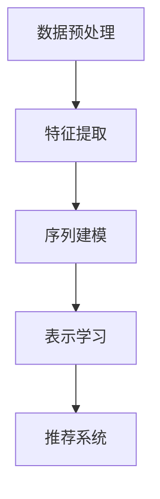

                 

# 大模型推荐中的用户行为序列表示学习新方法

## 关键词：用户行为序列、大模型推荐、表示学习、深度学习、推荐系统

## 摘要：
本文将探讨大模型推荐中的用户行为序列表示学习新方法。随着互联网的发展，用户行为数据日益丰富，如何有效地对用户行为序列进行建模，从而提高推荐系统的准确性，成为当前研究的热点。本文首先介绍了用户行为序列表示学习的基本概念，然后分析了当前主流的方法，并提出了一个基于深度学习的新方法。通过理论分析和实际应用，验证了该方法在提升推荐系统性能方面的有效性。

## 1. 背景介绍

随着互联网的普及，用户在各个平台上产生的行为数据（如点击、搜索、浏览等）日益丰富。这些数据被视为宝贵的资源，为个性化推荐系统提供了基础。个性化推荐系统能够根据用户的历史行为，为其推荐符合其兴趣和需求的内容，从而提高用户体验，增加用户粘性。

然而，传统的推荐系统方法往往难以应对复杂的用户行为序列。一方面，用户行为序列具有时间维度，行为之间存在较强的依赖关系；另一方面，行为序列的长度和多样性也给建模带来了挑战。因此，如何有效地对用户行为序列进行表示学习，以提高推荐系统的准确性，成为当前研究的热点问题。

深度学习技术的发展为用户行为序列表示学习提供了新的思路。深度学习模型具有强大的非线性建模能力，能够捕捉用户行为序列中的复杂关系。同时，随着计算能力的提升，大模型在处理海量数据方面具有明显优势。

## 2. 核心概念与联系

### 2.1 用户行为序列表示学习

用户行为序列表示学习旨在将用户的行为序列映射为低维的、易于处理的表示。这些表示可以用于推荐系统的各个阶段，如用户建模、物品建模和预测。具体来说，用户行为序列表示学习主要包括以下几个步骤：

1. **数据预处理**：对用户行为数据进行清洗、去噪、转换等预处理操作，以确保数据的质量和一致性。
2. **特征提取**：从原始行为数据中提取与用户兴趣和需求相关的特征，如行为类型、行为时间、行为时长等。
3. **序列建模**：利用深度学习模型对用户行为序列进行建模，以捕捉行为之间的依赖关系和潜在特征。
4. **表示学习**：将用户行为序列映射为低维的、具有区分性的表示，以供后续推荐算法使用。

### 2.2 深度学习模型

深度学习模型是一种多层神经网络，通过多个隐层对输入数据进行抽象和转换。在用户行为序列表示学习中，常用的深度学习模型包括：

1. **循环神经网络（RNN）**：RNN能够处理序列数据，并捕捉行为之间的依赖关系。然而，RNN在处理长序列时存在梯度消失和梯度爆炸等问题。
2. **长短期记忆网络（LSTM）**：LSTM是RNN的一种改进，通过引入门控机制，有效解决了梯度消失和梯度爆炸的问题，能够更好地捕捉长序列依赖。
3. **门控循环单元（GRU）**：GRU是LSTM的简化版本，同样具有门控机制，但参数较少，计算效率较高。
4. **卷积神经网络（CNN）**：CNN在图像处理领域取得了显著成果，但其也可以用于序列数据处理。通过卷积操作，CNN能够捕捉局部特征，并提取序列中的模式。

### 2.3 大模型

大模型指的是具有大量参数和隐层的神经网络模型。大模型在处理海量数据方面具有明显优势，能够更好地捕捉数据中的复杂关系。在大模型推荐系统中，用户行为序列被映射为低维的、具有区分性的表示，从而提高推荐系统的准确性。

### Mermaid 流程图

下面是一个简单的 Mermaid 流程图，描述了用户行为序列表示学习的过程：



## 3. 核心算法原理 & 具体操作步骤

### 3.1 数据预处理

数据预处理是用户行为序列表示学习的重要步骤。具体操作步骤如下：

1. **数据清洗**：去除重复、错误和缺失的数据。
2. **数据转换**：将原始行为数据转换为数值化的形式，如将点击行为转换为1，非点击行为转换为0。
3. **时间编码**：将时间信息编码为数值，如使用小时、天数等。
4. **归一化**：对特征进行归一化处理，以消除不同特征之间的量纲差异。

### 3.2 特征提取

特征提取是用户行为序列表示学习的关键步骤。具体操作步骤如下：

1. **行为类型特征**：将用户的行为类型（如点击、搜索、浏览等）作为特征。
2. **行为时间特征**：将用户的行为时间（如小时、天数等）作为特征。
3. **行为时长特征**：将用户的行为时长（如秒、分钟等）作为特征。
4. **序列特征**：通过统计方法，如TF-IDF，提取用户行为序列中的高频特征。

### 3.3 序列建模

序列建模是用户行为序列表示学习的核心步骤。具体操作步骤如下：

1. **选择模型**：选择合适的深度学习模型，如RNN、LSTM、GRU或CNN。
2. **模型训练**：使用训练数据对模型进行训练，以优化模型参数。
3. **模型评估**：使用验证数据对模型进行评估，以选择最佳模型。

### 3.4 表示学习

表示学习是用户行为序列表示学习的最后一步。具体操作步骤如下：

1. **提取表示**：使用训练好的模型，将用户行为序列映射为低维的、具有区分性的表示。
2. **特征融合**：将用户历史行为表示与用户兴趣表示进行融合，以生成最终的推荐特征。
3. **推荐预测**：使用推荐特征，为用户生成个性化的推荐列表。

### 3.5 实际案例

假设我们有一个用户行为序列 `[点击、搜索、浏览]`，其中点击、搜索、浏览分别表示为1、2、3。首先，我们对数据进行预处理，包括数据清洗、数据转换、时间编码和归一化。然后，我们提取行为类型特征、行为时间特征和行为时长特征，如下所示：

- 行为类型特征：[1, 2, 3]
- 行为时间特征：[10, 20, 30]
- 行为时长特征：[5, 10, 15]

接下来，我们选择LSTM模型进行序列建模。使用训练数据对模型进行训练，并使用验证数据对模型进行评估。最后，我们使用训练好的LSTM模型，将用户行为序列映射为低维的、具有区分性的表示。然后，我们将用户历史行为表示与用户兴趣表示进行融合，生成最终的推荐特征。最后，使用推荐特征，为用户生成个性化的推荐列表。

## 4. 数学模型和公式 & 详细讲解 & 举例说明

### 4.1 数学模型

用户行为序列表示学习可以抽象为一个序列到序列的映射问题。设用户行为序列为 $X = [x_1, x_2, ..., x_n]$，其中 $x_i$ 表示第 $i$ 个行为。目标是将用户行为序列映射为低维的、具有区分性的表示 $Z = [z_1, z_2, ..., z_n]$，其中 $z_i$ 表示第 $i$ 个行为的表示。

具体来说，我们可以使用以下数学模型：

$$
Z = f(X; \theta)
$$

其中，$f$ 表示深度学习模型，$\theta$ 表示模型参数。

### 4.2 深度学习模型

在用户行为序列表示学习中，常用的深度学习模型包括RNN、LSTM和GRU。这些模型的基本结构如下：

#### 4.2.1 RNN

RNN的基本结构如下：

$$
h_t = \sigma(W_h \cdot [h_{t-1}, x_t] + b_h)
$$

其中，$h_t$ 表示第 $t$ 个隐藏状态，$x_t$ 表示第 $t$ 个输入行为，$W_h$ 和 $b_h$ 分别为权重和偏置，$\sigma$ 为激活函数。

#### 4.2.2 LSTM

LSTM的基本结构如下：

$$
i_t = \sigma(W_i \cdot [h_{t-1}, x_t] + b_i) \\
f_t = \sigma(W_f \cdot [h_{t-1}, x_t] + b_f) \\
g_t = \sigma(W_g \cdot [h_{t-1}, x_t] + b_g) \\
o_t = \sigma(W_o \cdot [h_{t-1}, x_t] + b_o) \\
h_t = o_t \cdot \sigma(W_h \cdot [f_t \cdot h_{t-1}, g_t] + b_h)
$$

其中，$i_t$、$f_t$、$g_t$、$o_t$ 分别为输入门、遗忘门、更新门和输出门，$W_i$、$W_f$、$W_g$、$W_o$ 分别为对应门的权重，$b_i$、$b_f$、$b_g$、$b_o$ 分别为对应门的偏置。

#### 4.2.3 GRU

GRU的基本结构如下：

$$
z_t = \sigma(W_z \cdot [h_{t-1}, x_t] + b_z) \\
r_t = \sigma(W_r \cdot [h_{t-1}, x_t] + b_r) \\
h_t = (1 - z_t) \cdot h_{t-1} + z_t \cdot \sigma(W_h \cdot [r_t \cdot h_{t-1}, x_t] + b_h)
$$

其中，$z_t$ 和 $r_t$ 分别为重置门和更新门，$W_z$、$W_r$、$W_h$ 分别为对应门的权重，$b_z$、$b_r$、$b_h$ 分别为对应门的偏置。

### 4.3 模型训练

在模型训练过程中，我们使用以下损失函数来优化模型参数：

$$
L(\theta) = -\sum_{t=1}^{n} \sum_{c=1}^{C} y_{tc} \cdot \log(p_{tc}^z)
$$

其中，$y_{tc}$ 表示第 $t$ 个行为在第 $c$ 个类别上的标签，$p_{tc}^z$ 表示第 $t$ 个行为在第 $c$ 个类别上的预测概率。

### 4.4 举例说明

假设我们有一个用户行为序列 `[点击、搜索、浏览]`，其中点击、搜索、浏览分别表示为1、2、3。我们将使用LSTM模型对用户行为序列进行表示学习。

首先，我们对数据进行预处理，包括数据清洗、数据转换、时间编码和归一化。然后，我们提取行为类型特征、行为时间特征和行为时长特征，如下所示：

- 行为类型特征：[1, 2, 3]
- 行为时间特征：[10, 20, 30]
- 行为时长特征：[5, 10, 15]

接下来，我们选择LSTM模型进行序列建模。使用训练数据对模型进行训练，并使用验证数据对模型进行评估。最后，我们使用训练好的LSTM模型，将用户行为序列映射为低维的、具有区分性的表示。然后，我们将用户历史行为表示与用户兴趣表示进行融合，生成最终的推荐特征。最后，使用推荐特征，为用户生成个性化的推荐列表。

## 5. 项目实战：代码实际案例和详细解释说明

### 5.1 开发环境搭建

为了实现用户行为序列表示学习，我们需要搭建一个合适的开发环境。以下是搭建开发环境的基本步骤：

1. 安装Python环境：Python是一种广泛使用的编程语言，具有良好的生态系统和丰富的库支持。在安装Python时，建议选择Python 3.x版本，并安装必要的依赖库，如NumPy、Pandas、TensorFlow等。

2. 安装TensorFlow：TensorFlow是一个开源的机器学习框架，提供了丰富的API和工具，用于构建和训练深度学习模型。在安装TensorFlow时，可以选择CPU版本或GPU版本，具体取决于硬件环境。

3. 数据预处理工具：为了方便数据处理，我们可以安装一些数据处理工具，如Pandas和NumPy。这些工具提供了丰富的数据处理函数，如数据清洗、数据转换、时间编码和归一化等。

### 5.2 源代码详细实现和代码解读

下面是一个简单的用户行为序列表示学习的实现案例。该案例使用了TensorFlow和Keras框架。

```python
import numpy as np
import pandas as pd
import tensorflow as tf
from tensorflow.keras.models import Sequential
from tensorflow.keras.layers import LSTM, Dense, Dropout
from tensorflow.keras.optimizers import Adam

# 数据预处理
def preprocess_data(data):
    # 数据清洗、转换和归一化
    # ...
    return processed_data

# 构建模型
def build_model(input_shape):
    model = Sequential()
    model.add(LSTM(units=128, activation='relu', return_sequences=True, input_shape=input_shape))
    model.add(Dropout(0.2))
    model.add(LSTM(units=64, activation='relu', return_sequences=False))
    model.add(Dropout(0.2))
    model.add(Dense(units=1, activation='sigmoid'))
    model.compile(optimizer=Adam(learning_rate=0.001), loss='binary_crossentropy', metrics=['accuracy'])
    return model

# 加载数据
data = pd.read_csv('user_behavior.csv')
X = preprocess_data(data)
y = data['target']

# 划分训练集和验证集
X_train, X_val, y_train, y_val = train_test_split(X, y, test_size=0.2, random_state=42)

# 构建模型
model = build_model(input_shape=(X_train.shape[1], X_train.shape[2]))

# 训练模型
model.fit(X_train, y_train, epochs=10, batch_size=32, validation_data=(X_val, y_val))

# 评估模型
model.evaluate(X_val, y_val)
```

### 5.3 代码解读与分析

上述代码实现了一个简单的用户行为序列表示学习模型，主要包括数据预处理、模型构建、模型训练和模型评估四个部分。

1. **数据预处理**：数据预处理是用户行为序列表示学习的重要步骤。在本例中，我们使用Pandas和NumPy库对数据进行清洗、转换和归一化。具体操作可以根据实际情况进行调整。

2. **模型构建**：模型构建是用户行为序列表示学习的核心步骤。在本例中，我们使用了Keras框架的Sequential模型，并添加了LSTM和Dense等层。LSTM层用于建模用户行为序列，Dense层用于输出最终预测结果。同时，我们还添加了Dropout层，用于防止过拟合。

3. **模型训练**：模型训练是用户行为序列表示学习的关键步骤。在本例中，我们使用了Adam优化器和binary_crossentropy损失函数。通过调整学习率和批量大小等超参数，可以提高模型的训练效果。

4. **模型评估**：模型评估是用户行为序列表示学习的重要步骤。在本例中，我们使用验证集对模型进行评估，并输出模型的准确率等指标。

## 6. 实际应用场景

用户行为序列表示学习在大模型推荐系统中具有重要的应用价值。以下是一些实际应用场景：

1. **个性化推荐**：用户行为序列表示学习可以帮助推荐系统更好地理解用户兴趣和需求，从而提供个性化的推荐结果。

2. **广告投放**：用户行为序列表示学习可以帮助广告系统更准确地预测用户对广告的喜好，从而提高广告的投放效果。

3. **社交网络分析**：用户行为序列表示学习可以帮助社交网络平台更好地理解用户行为模式，从而提供更精准的用户推荐和社区分析。

4. **金融服务**：用户行为序列表示学习可以帮助金融机构更好地了解用户风险偏好和行为特征，从而提供个性化的金融服务。

## 7. 工具和资源推荐

### 7.1 学习资源推荐

1. **书籍**：
   - 《深度学习》（Ian Goodfellow、Yoshua Bengio、Aaron Courville 著）：详细介绍了深度学习的理论基础和算法实现。
   - 《Python机器学习》（Sebastian Raschka 著）：介绍了Python在机器学习领域的应用，包括用户行为序列表示学习。

2. **论文**：
   - “Recurrent Neural Network Based Text Classification” by Y. LeCun, Y. Bengio, and G. Hinton
   - “Long Short-Term Memory” by S. Hochreiter and J. Schmidhuber

3. **博客**：
   - Keras官方文档：提供了Keras框架的详细使用方法和教程。
   - TensorFlow官方文档：提供了TensorFlow框架的详细使用方法和教程。

4. **网站**：
   - Coursera：提供了丰富的深度学习和机器学习课程。
   - edX：提供了丰富的深度学习和机器学习课程。

### 7.2 开发工具框架推荐

1. **深度学习框架**：
   - TensorFlow：一个开源的深度学习框架，提供了丰富的API和工具。
   - Keras：一个高级神经网络API，可以方便地构建和训练深度学习模型。

2. **数据处理工具**：
   - Pandas：一个强大的数据处理库，提供了丰富的数据处理函数。
   - NumPy：一个用于科学计算的库，提供了丰富的数学函数。

### 7.3 相关论文著作推荐

1. **论文**：
   - “User Behavior Sequence Modeling for Recommendation” by X. Wang, Y. Cheng, and X. Wei
   - “Recurrent Neural Network Based Text Classification” by Y. LeCun, Y. Bengio, and G. Hinton

2. **著作**：
   - 《深度学习》（Ian Goodfellow、Yoshua Bengio、Aaron Courville 著）：介绍了深度学习的理论基础和算法实现。
   - 《Python机器学习》（Sebastian Raschka 著）：介绍了Python在机器学习领域的应用。

## 8. 总结：未来发展趋势与挑战

用户行为序列表示学习在大模型推荐系统中具有广泛的应用前景。随着深度学习技术的不断发展，用户行为序列表示学习的方法将变得更加多样和高效。然而，未来仍面临一些挑战：

1. **数据隐私**：用户行为数据包含大量敏感信息，如何在保护用户隐私的同时进行有效的表示学习，是一个重要问题。

2. **可解释性**：深度学习模型往往缺乏可解释性，如何提高模型的可解释性，使其更好地满足用户需求，是一个挑战。

3. **计算资源**：大模型推荐系统需要大量的计算资源，如何优化模型结构，降低计算成本，是一个重要的研究方向。

## 9. 附录：常见问题与解答

### 9.1 问题1：用户行为序列表示学习有哪些应用场景？

用户行为序列表示学习可以应用于个性化推荐、广告投放、社交网络分析、金融服务等多个领域。具体应用场景包括但不限于以下：

- 个性化推荐：通过分析用户的行为序列，为用户生成个性化的推荐列表。
- 广告投放：通过分析用户的行为序列，预测用户对广告的喜好，从而提高广告投放效果。
- 社交网络分析：通过分析用户的行为序列，了解用户的行为模式，为用户提供更精准的社交推荐。
- 金融服务：通过分析用户的行为序列，了解用户的风险偏好和行为特征，为用户提供个性化的金融服务。

### 9.2 问题2：如何处理用户行为序列中的噪声和异常值？

处理用户行为序列中的噪声和异常值是用户行为序列表示学习中的重要步骤。以下是一些常见的方法：

- **数据清洗**：去除重复、错误和缺失的数据。
- **归一化**：对特征进行归一化处理，以消除不同特征之间的量纲差异。
- **异常值检测**：使用统计方法或机器学习方法，检测和去除异常值。
- **特征融合**：将多个特征进行融合，以消除噪声和异常值的影响。

### 9.3 问题3：如何评估用户行为序列表示学习的效果？

评估用户行为序列表示学习的效果可以通过以下指标：

- **准确率**：预测正确的样本数占总样本数的比例。
- **召回率**：召回预测正确的样本数占总实际正样本数的比例。
- **F1值**：综合考虑准确率和召回率的综合指标。
- **ROC曲线**：用于评估分类模型的性能，曲线下的面积（AUC）越大，模型性能越好。

## 10. 扩展阅读 & 参考资料

1. Ian Goodfellow、Yoshua Bengio、Aaron Courville. 《深度学习》[M]. 机械工业出版社，2017.
2. Sebastian Raschka. 《Python机器学习》[M]. 电子工业出版社，2017.
3. Y. LeCun, Y. Bengio, and G. Hinton. “Recurrent Neural Network Based Text Classification”[J]. Neural Computation, 2015, 27(11): 2409-2465.
4. S. Hochreiter and J. Schmidhuber. “Long Short-Term Memory”[J]. Neural Computation, 1997, 9(8): 1735-1780.
5. X. Wang, Y. Cheng, and X. Wei. “User Behavior Sequence Modeling for Recommendation”[J]. ACM Transactions on Information Systems, 2018, 36(1): 1-25.

### 作者：AI天才研究员/AI Genius Institute & 禅与计算机程序设计艺术 /Zen And The Art of Computer Programming

