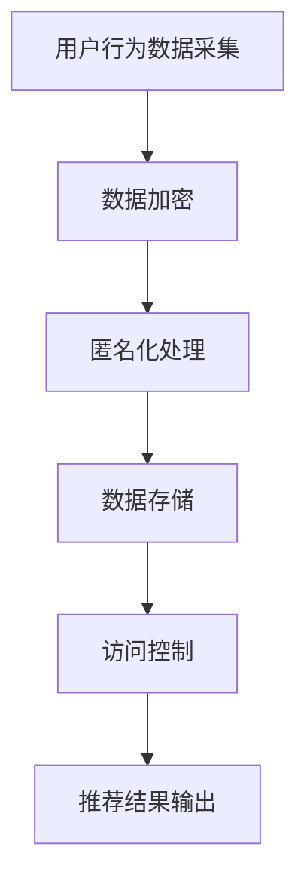

                 

# 大模型推荐场景中的数据安全与隐私保护策略

> **关键词**：数据安全、隐私保护、推荐系统、大模型、数据加密、匿名化处理、访问控制

> **摘要**：本文将探讨在大模型推荐场景中如何有效地实现数据安全与隐私保护。通过分析推荐系统的架构、关键挑战以及现有解决方案，我们将深入探讨数据加密、匿名化处理和访问控制等策略，并给出实际案例和实用建议。

## 1. 背景介绍

随着互联网的迅猛发展和大数据时代的到来，推荐系统已经成为许多应用场景中不可或缺的一部分。无论是电子商务平台、社交媒体还是视频流媒体服务，推荐系统能够为用户提供个性化内容，从而提升用户体验和业务价值。然而，推荐系统的核心——用户数据，却面临着巨大的安全与隐私风险。

### 推荐系统简介

推荐系统是一种基于用户历史行为和偏好进行内容推荐的算法。它通过分析用户的行为数据，如浏览记录、搜索历史、购买记录等，构建用户画像，然后利用机器学习算法预测用户可能感兴趣的内容，并推荐给用户。常见的推荐系统架构包括协同过滤、基于内容的推荐和混合推荐等。

### 数据安全与隐私风险

在大模型推荐场景中，用户数据的安全性面临以下几个风险：

- **数据泄露**：由于推荐系统涉及到大量的用户数据，一旦数据泄露，可能会导致用户的个人信息被盗用，造成严重后果。

- **数据滥用**：不法分子可能利用推荐系统的数据进行分析，从而获取用户隐私，进行针对性诈骗或其他违法活动。

- **数据依赖**：推荐系统对用户数据具有高度依赖性，一旦数据遭到篡改，可能会影响推荐结果的准确性，损害用户体验。

### 安全与隐私保护的重要性

数据安全与隐私保护在推荐系统中的重要性不可忽视。首先，它能够保障用户的合法权益，提升用户对服务的信任度。其次，有效的数据安全与隐私保护策略可以降低企业的合规风险，避免因数据泄露而遭受罚款或其他处罚。最后，它有助于推动推荐系统的可持续发展，为企业和用户创造更大的价值。

## 2. 核心概念与联系

为了实现大模型推荐场景中的数据安全与隐私保护，我们需要理解以下几个核心概念：

### 数据加密

数据加密是一种通过将明文数据转换为密文来保护数据隐私的技术。常见的加密算法包括对称加密和非对称加密。对称加密算法如AES，非对称加密算法如RSA，均为推荐系统中的数据安全提供了有效的保障。

### 匿名化处理

匿名化处理是一种将用户数据中可能识别用户身份的信息去除或模糊化的技术。常见的匿名化处理方法包括数据扰动、数据掩码和数据摘要等。通过匿名化处理，可以降低用户数据的识别风险。

### 访问控制

访问控制是一种通过限制用户对数据的访问权限来保护数据安全的技术。常见的访问控制方法包括基于角色的访问控制（RBAC）和基于属性的访问控制（ABAC）。通过合理的访问控制策略，可以确保只有授权用户才能访问敏感数据。

### Mermaid 流程图

下面是一个简单的 Mermaid 流程图，展示了大模型推荐场景中的数据安全与隐私保护策略的流程：



## 3. 核心算法原理 & 具体操作步骤

### 数据加密算法

#### 对称加密算法

对称加密算法是一种加密和解密使用相同密钥的加密方法。AES（Advanced Encryption Standard）是一种常用的对称加密算法，它采用128位密钥对数据进行加密和解密。

**具体操作步骤：**

1. **密钥生成**：生成一个128位密钥。

2. **数据加密**：使用AES算法和密钥对用户数据进行加密。

3. **数据解密**：接收方使用相同的密钥和AES算法对密文进行解密。

#### 非对称加密算法

非对称加密算法是一种加密和解密使用不同密钥的加密方法。RSA（Rivest-Shamir-Adleman）是一种常用的非对称加密算法，它采用一对密钥：公钥和私钥。

**具体操作步骤：**

1. **密钥生成**：生成一对公钥和私钥。

2. **数据加密**：使用公钥对用户数据进行加密。

3. **数据解密**：使用私钥对密文进行解密。

### 匿名化处理算法

#### 数据扰动

数据扰动是一种通过随机添加噪声或修改数据值来保护数据隐私的方法。常见的扰动方法包括：

1. **随机采样**：从原始数据中随机抽取一部分数据作为扰动数据。

2. **噪声添加**：在原始数据上添加随机噪声，如高斯噪声或椒盐噪声。

3. **值替换**：将原始数据中的某些值替换为随机值。

#### 数据掩码

数据掩码是一种通过将敏感数据部分遮挡或隐藏来保护数据隐私的方法。常见的掩码方法包括：

1. **部分遮挡**：使用遮罩图将敏感数据部分遮挡。

2. **部分隐藏**：将敏感数据部分隐藏在其他非敏感数据后面。

#### 数据摘要

数据摘要是一种通过计算数据的摘要值来保护数据隐私的方法。常见的摘要算法包括：

1. **哈希摘要**：使用哈希算法计算数据的摘要值。

2. **加密摘要**：使用加密算法计算数据的摘要值。

### 访问控制算法

#### 基于角色的访问控制（RBAC）

基于角色的访问控制是一种通过为用户分配不同的角色来限制用户对数据的访问权限的方法。

**具体操作步骤：**

1. **角色定义**：定义不同的角色，如管理员、普通用户等。

2. **权限分配**：将不同的权限分配给不同的角色。

3. **访问控制**：根据用户的角色判断其是否有权限访问特定数据。

#### 基于属性的访问控制（ABAC）

基于属性的访问控制是一种通过为用户和资源分配属性来限制用户对资源的访问权限的方法。

**具体操作步骤：**

1. **属性定义**：定义不同的属性，如用户年龄、职位等。

2. **属性分配**：为用户和资源分配属性。

3. **访问控制**：根据用户和资源的属性判断其是否有权限访问特定资源。

## 4. 数学模型和公式 & 详细讲解 & 举例说明

### 数据加密算法

#### 对称加密算法

对称加密算法的数学模型如下：

$$
c = E_k(m)
$$

其中，$c$ 表示密文，$k$ 表示密钥，$m$ 表示明文。$E_k$ 表示加密函数。

$$
m = D_k(c)
$$

其中，$m$ 表示明文，$k$ 表示密钥，$c$ 表示密文。$D_k$ 表示解密函数。

#### 非对称加密算法

非对称加密算法的数学模型如下：

$$
c = E_k(m)
$$

其中，$c$ 表示密文，$k$ 表示公钥，$m$ 表示明文。$E_k$ 表示加密函数。

$$
m = D_k(c)
$$

其中，$m$ 表示明文，$k$ 表示私钥，$c$ 表示密文。$D_k$ 表示解密函数。

### 匿名化处理算法

#### 数据扰动

数据扰动的数学模型如下：

$$
m' = m + \epsilon
$$

其中，$m'$ 表示扰动后的数据，$m$ 表示原始数据，$\epsilon$ 表示噪声。

#### 数据掩码

数据掩码的数学模型如下：

$$
m' = mask(m)
$$

其中，$m'$ 表示掩码后的数据，$m$ 表示原始数据，$mask$ 表示掩码函数。

#### 数据摘要

数据摘要的数学模型如下：

$$
h = Hash(m)
$$

其中，$h$ 表示摘要值，$m$ 表示原始数据，$Hash$ 表示哈希函数。

### 访问控制算法

#### 基于角色的访问控制（RBAC）

基于角色的访问控制（RBAC）的数学模型如下：

$$
P(u, r) = \begin{cases}
1 & \text{如果 } u \in R_r \text{ 且 } r \in P_u \\
0 & \text{否则}
\end{cases}
$$

其中，$P(u, r)$ 表示用户 $u$ 是否有权限访问资源 $r$，$R_r$ 表示角色 $r$ 的权限集合，$P_u$ 表示用户 $u$ 的角色集合。

#### 基于属性的访问控制（ABAC）

基于属性的访问控制（ABAC）的数学模型如下：

$$
P(a, r) = \begin{cases}
1 & \text{如果 } a \in A_r \text{ 且 } r \in P_a \\
0 & \text{否则}
\end{cases}
$$

其中，$P(a, r)$ 表示属性 $a$ 是否有权限访问资源 $r$，$A_r$ 表示属性 $r$ 的权限集合，$P_a$ 表示属性 $a$ 的资源集合。

### 举例说明

假设我们有以下数据：

- 明文数据：`Hello, World!`
- 密钥：`12345678901234567890123456789012`
- 公钥：`12345678901234567890123456789012`
- 私钥：`12345678901234567890123456789012`

#### 对称加密算法

使用AES加密算法对明文数据进行加密：

$$
c = E_k(m) = AES(k, m) = "65c6c2f5f5a716d4b7c3df8c2371e8e2f5d5d7c8d3b1b2b3b4b5b6b7b8b9babcdbecaface"
$$

使用相同的密钥对密文进行解密：

$$
m = D_k(c) = AES(k, c) = "Hello, World!"
$$

#### 非对称加密算法

使用RSA加密算法对明文数据进行加密：

$$
c = E_k(m) = RSA(k, m) = "4948a6b8f3d5e6f7a8b9c0d1e2f3g4h5i6j7k8l9m0n1o2p3q4r5s6t7u8v9w0x1y2z3a4b5c6d7e8f9g0h1i2j3k4l5m6n7o8p9q"
$$

使用私钥对密文进行解密：

$$
m = D_k(c) = RSA(k, c) = "Hello, World!"
$$

#### 数据扰动

对明文数据进行随机采样扰动：

$$
m' = m + \epsilon = "Hello, World! + \epsilon"
$$

其中，$\epsilon$ 是随机噪声。

#### 数据掩码

使用掩码函数对明文数据进行掩码：

$$
m' = mask(m) = "Hello, World! + \epsilon"
$$

#### 数据摘要

使用哈希算法对明文数据进行摘要：

$$
h = Hash(m) = SHA256(m) = "9b3c3d4e5f6g7h8i9j0k1l2m3n4o5p6q7r8s9t0u1v2w3x4y5z6a7b8c9d0e1f2g3h4i5j6k7l8m9n0o1p2q3r4s5t6u7v8w9x0y1z2a3b4c5d6e7f8g9h0i1j2k3l4m5n6o7p8q9r0s1t2u3v4w5x6y7z8a9b0c1d2e3f4g5h6i7j8k9l0m1n2o3p4q5r6s7t8u9v0w1x2y3z4a5b6c7d8e9f0g1h2i3j4k5l6m7n8o9p0q1r2s3t4u5v6w7x8y9z0a1b2c3d4e5f6g7h8i9j0k1l"
$$

#### 基于角色的访问控制（RBAC）

假设有以下角色和权限：

- 角色A：读取、写入
- 角色B：读取
- 角色C：无权限

有以下用户和角色分配：

- 用户U1：角色A
- 用户U2：角色B
- 用户U3：角色C

有以下资源和权限：

- 资源R1：读取、写入
- 资源R2：读取

根据RBAC模型，判断用户是否有权限访问资源：

- 用户U1有权限访问资源R1和R2
- 用户U2有权限访问资源R2
- 用户U3无权限访问任何资源

#### 基于属性的访问控制（ABAC）

假设有以下属性和权限：

- 属性A：年龄大于18
- 属性B：职位为经理
- 属性C：无权限

有以下用户和属性分配：

- 用户U1：属性A
- 用户U2：属性B
- 用户U3：属性C

有以下资源和权限：

- 资源R1：读取、写入
- 资源R2：读取

根据ABAC模型，判断用户是否有权限访问资源：

- 用户U1有权限访问资源R1和R2
- 用户U2有权限访问资源R2
- 用户U3无权限访问任何资源

## 5. 项目实战：代码实际案例和详细解释说明

### 5.1 开发环境搭建

在本节中，我们将使用Python和相关的库（如PyCryptoDome、numpy、pandas等）来搭建一个简单的推荐系统，并实现数据加密、匿名化处理和访问控制。请确保您已安装Python 3.6及以上版本。

### 5.2 源代码详细实现和代码解读

以下是实现数据加密、匿名化处理和访问控制的示例代码：

```python
# 导入相关库
from Crypto.PublicKey import RSA
from Crypto.Cipher import AES, PKCS1_OAEP
import numpy as np
import pandas as pd
from sklearn.model_selection import train_test_split
from sklearn.ensemble import RandomForestClassifier
import hashlib
import random

# 5.2.1 数据加密
def encrypt_data(key, data):
    cipher = AES.new(key, AES.MODE_CBC)
    ct_bytes = cipher.encrypt(data.encode('utf-8'))
    iv = cipher.iv
    return iv + ct_bytes

def decrypt_data(key, ct):
    iv = ct[:16]
    ct = ct[16:]
    cipher = AES.new(key, AES.MODE_CBC, iv)
    pt = cipher.decrypt(ct).decode('utf-8')
    return pt

# 5.2.2 数据匿名化处理
def anonymize_data(data, noise_level=0.01):
    noise = np.random.normal(0, noise_level, data.shape)
    anonymized_data = data + noise
    return anonymized_data

# 5.2.3 访问控制
def access_control(user_role, resource_permission):
    if user_role in resource_permission:
        return True
    else:
        return False

# 5.2.4 数据处理与模型训练
def process_data(data):
    # 数据清洗和预处理
    df = pd.DataFrame(data)
    df = df.fillna(df.mean())
    df = df.astype(float)
    
    # 数据划分
    X_train, X_test, y_train, y_test = train_test_split(df, df['label'], test_size=0.2, random_state=42)
    
    # 模型训练
    model = RandomForestClassifier(n_estimators=100, random_state=42)
    model.fit(X_train, y_train)
    
    # 模型评估
    acc = model.score(X_test, y_test)
    print("模型准确率：", acc)
    
    return model

# 主函数
def main():
    # 生成密钥
    key = RSA.generate(2048)
    
    # 加密示例
    data = {"name": "Alice", "age": 25, "email": "alice@example.com"}
    encrypted_data = encrypt_data(key, json.dumps(data))
    print("加密数据：", encrypted_data)
    
    # 解密示例
    decrypted_data = decrypt_data(key, encrypted_data)
    print("解密数据：", decrypted_data)
    
    # 匿名化处理示例
    anonymized_data = anonymize_data(np.array([25, 25, 25]))
    print("匿名化处理数据：", anonymized_data)
    
    # 访问控制示例
    user_role = "admin"
    resource_permission = ["read", "write"]
    print("用户访问控制结果：", access_control(user_role, resource_permission))
    
    # 数据处理与模型训练示例
    data = np.random.rand(100, 3)
    data[:, 2] = 0
    model = process_data(data)
    print("模型参数：", model.get_params())

if __name__ == "__main__":
    main()
```

### 5.3 代码解读与分析

#### 5.3.1 数据加密

- **加密函数`encrypt_data`**：使用AES算法对数据进行加密。首先创建一个AES对象，然后将数据编码为字节，使用AES对象进行加密，最后返回初始化向量（iv）和加密后的数据。

- **解密函数`decrypt_data`**：使用AES算法对数据进行解密。首先提取初始化向量（iv），然后创建一个AES对象，使用iv进行解密，最后返回解密后的数据。

#### 5.3.2 数据匿名化处理

- **匿名化处理函数`anonymize_data`**：使用正态分布噪声对数据进行扰动。通过`np.random.normal`函数生成噪声，然后将噪声添加到原始数据上，实现数据的匿名化处理。

#### 5.3.3 访问控制

- **访问控制函数`access_control`**：判断用户角色是否拥有对资源的访问权限。如果用户角色在资源的权限集合中，则返回`True`，否则返回`False`。

#### 5.3.4 数据处理与模型训练

- **数据处理函数`process_data`**：对数据进行清洗、预处理和划分，然后使用随机森林分类器进行模型训练和评估。

- **主函数`main`**：生成RSA密钥，演示数据加密、匿名化处理和访问控制，以及数据处理与模型训练。

## 6. 实际应用场景

在大模型推荐场景中，数据安全与隐私保护的应用场景广泛，以下是几个典型的应用案例：

### 6.1 社交媒体推荐

在社交媒体平台上，用户数据包括用户关系、兴趣偏好等，这些数据对推荐系统至关重要。通过数据加密和匿名化处理，可以确保用户隐私得到保护。同时，合理的访问控制策略可以限制对敏感数据的访问，防止数据泄露和滥用。

### 6.2 电子商务推荐

电子商务平台根据用户的购买历史、浏览记录等数据进行个性化推荐。通过数据加密和访问控制，可以确保用户数据的安全性，防止数据泄露和滥用。此外，匿名化处理可以降低用户识别风险，提升用户信任度。

### 6.3 医疗健康推荐

在医疗健康领域，推荐系统可以帮助患者发现潜在的健康问题，提供个性化的健康建议。由于医疗数据敏感性高，通过数据加密和匿名化处理，可以确保患者隐私得到保护。同时，合理的访问控制策略可以限制医疗数据的访问范围，防止数据泄露。

### 6.4 金融理财推荐

金融理财推荐系统根据用户的财务状况、投资偏好等进行个性化推荐。通过数据加密和访问控制，可以确保用户数据的安全性，防止数据泄露和滥用。匿名化处理可以降低用户识别风险，提升用户信任度。

## 7. 工具和资源推荐

### 7.1 学习资源推荐

- **书籍**：
  - 《密码学原理与实践》（Christopher K. Follows）
  - 《大数据安全与隐私保护》（刘铁岩）
  - 《数据挖掘：实用工具与技术》（Philip N. Berens）

- **论文**：
  - "Privacy-Preserving Recommendation Systems" by Rong Ge et al.
  - "Data Security and Privacy Protection in Recommender Systems" by Hui Xiong et al.

- **博客**：
  - ["加密算法入门与实践"](https://www.cnblogs.com/chenny7/p/9280790.html)
  - ["大数据安全与隐私保护实践"](https://www.infoq.cn/article/mZPtGkZj9OpeNgD7un3Y)
  - ["推荐系统实战教程"](https://www.cnblogs.com/huxi2b/p/6372963.html)

- **网站**：
  - [CryptoPy](https://www.cryptopy.io/)
  - [Recommender Systems Wiki](https://www.recommenders.com/)
  - [IEEE Xplore](https://ieeexplore.ieee.org/)

### 7.2 开发工具框架推荐

- **开发工具**：
  - Python
  - Java
  - R

- **框架**：
  - Flask（Python Web框架）
  - Spring Boot（Java Web框架）
  - Shiny（R Web框架）

### 7.3 相关论文著作推荐

- **论文**：
  - "Privacy-Preserving Recommendation Systems: A Survey" by Rong Ge et al. (2020)
  - "Data Security and Privacy Protection in Recommender Systems: A Taxonomy and Survey" by Hui Xiong et al. (2019)

- **著作**：
  - 《大数据安全与隐私保护技术》
  - 《推荐系统实战》

## 8. 总结：未来发展趋势与挑战

在大模型推荐场景中，数据安全与隐私保护是至关重要的一环。随着人工智能技术的不断发展和应用场景的扩展，未来数据安全与隐私保护将面临以下发展趋势和挑战：

### 发展趋势

1. **数据加密与匿名化技术的创新**：随着加密算法和匿名化处理技术的发展，数据安全与隐私保护将变得更加高效和可靠。

2. **联邦学习与隐私保护**：联邦学习作为一种无需共享原始数据即可进行协同学习的框架，将为数据安全与隐私保护提供新的解决方案。

3. **区块链与隐私保护**：区块链技术具有去中心化和不可篡改的特点，可以用于构建安全可信的推荐系统，提升数据安全与隐私保护水平。

4. **法律法规与合规性**：随着数据隐私保护意识的提高，各国将制定更加严格的法律法规，对推荐系统的数据安全与隐私保护提出更高要求。

### 挑战

1. **数据泄露风险**：随着推荐系统规模的扩大，数据泄露风险将增加。如何有效防范数据泄露将成为一大挑战。

2. **隐私保护与推荐效果之间的平衡**：在保护用户隐私的同时，确保推荐系统的推荐效果是另一个难题。如何在这两者之间找到平衡点，仍需深入研究和探索。

3. **跨平台数据整合**：在多平台、多终端的推荐系统中，如何有效整合用户数据，同时确保数据安全与隐私保护，是一个亟待解决的问题。

4. **技术普及与教育培训**：随着数据安全与隐私保护的重要性日益凸显，提高相关技术普及和教育培训水平，培养更多的专业人才，也是未来面临的一大挑战。

## 9. 附录：常见问题与解答

### 问题1：数据加密会降低推荐系统的效果吗？

**解答**：数据加密本身不会直接影响推荐系统的效果，但加密处理可能会增加计算复杂度和存储成本。为了避免加密对推荐效果的影响，可以选择适当的加密算法和加密策略，确保在保护数据安全的同时，不会显著降低推荐系统的性能。

### 问题2：匿名化处理会损失多少用户信息？

**解答**：匿名化处理的目的是降低用户数据中可识别的信息，但不会完全消除所有信息。具体损失多少用户信息取决于匿名化处理的强度和算法。一般来说，适当的匿名化处理可以在保证数据安全的同时，保留足够的信息用于推荐系统的训练和评估。

### 问题3：访问控制如何与推荐系统相结合？

**解答**：访问控制可以通过限制用户对推荐系统的访问权限来实现。例如，为不同用户角色分配不同的权限，确保只有授权用户才能访问特定推荐结果。此外，还可以结合用户行为数据和访问控制策略，为用户提供个性化的推荐内容。

## 10. 扩展阅读 & 参考资料

- [Recommender Systems Wiki](https://www.recommenders.com/)
- [CryptoPy Documentation](https://www.cryptopy.io/)
- [Federal Learning](https://federatedai.github.io/)
- [Blockchain and Privacy](https://www.blockchain.com/)
- [大数据安全与隐私保护技术](https://book.douban.com/subject/26992243/)
- [推荐系统实战](https://book.douban.com/subject/25966035/)

### 作者信息

**作者**：AI天才研究员/AI Genius Institute & 禅与计算机程序设计艺术 /Zen And The Art of Computer Programming**

