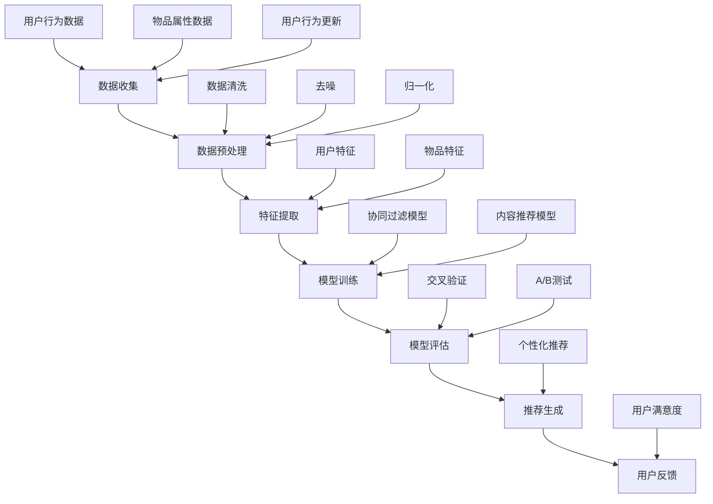
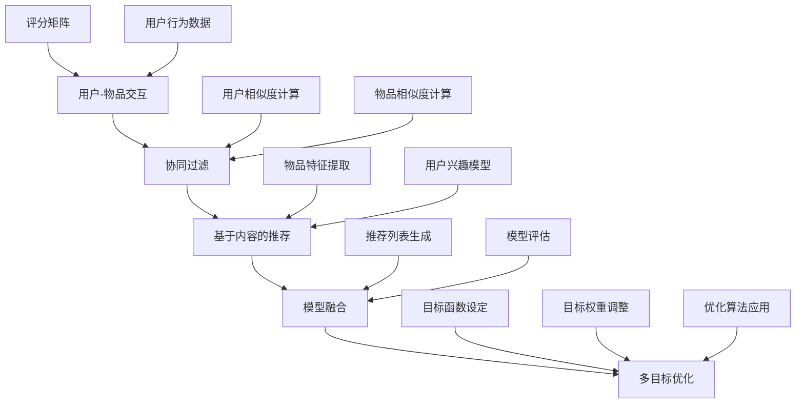

                 

## 1. 背景介绍

随着互联网的普及和大数据技术的不断发展，推荐系统作为数据驱动的智能系统，在电子商务、社交媒体、在线视频等领域发挥着越来越重要的作用。推荐系统通过分析用户的兴趣和行为，为用户个性化地推荐相关商品、内容或服务，从而提高用户满意度和商业价值。

然而，推荐系统面临着多种优化目标，如提升推荐准确性、提升用户参与度、最大化收益等。这些优化目标往往存在冲突，例如，提升推荐准确性可能会降低用户参与度，而追求最大收益可能会牺牲用户体验。因此，多目标优化成为推荐系统领域的一个关键问题。

本文旨在探讨大模型推荐系统的多目标优化问题，详细介绍相关核心概念、算法原理、数学模型以及实际应用案例。文章将从以下几个方面展开：

1. **核心概念与联系**：介绍推荐系统的基本概念，包括用户、物品、评分等，并绘制Mermaid流程图展示推荐系统的工作流程。
2. **核心算法原理 & 具体操作步骤**：深入分析多目标优化算法的原理，如多目标优化算法、权重调整策略等，并提供具体操作步骤。
3. **数学模型和公式 & 详细讲解 & 举例说明**：介绍多目标优化的数学模型和公式，并进行详细讲解和举例说明。
4. **项目实战：代码实际案例和详细解释说明**：通过实际项目案例，展示多目标优化的具体实现过程，并进行详细解释说明。
5. **实际应用场景**：分析多目标优化在推荐系统中的实际应用场景，包括电子商务、社交媒体、在线视频等。
6. **工具和资源推荐**：推荐相关学习资源、开发工具和论文著作。
7. **总结：未来发展趋势与挑战**：总结多目标优化在推荐系统领域的发展趋势和面临的挑战。

通过本文的详细探讨，希望读者能够对大模型推荐系统的多目标优化有更深入的理解，并为实际项目提供有价值的参考。

### 1.1 推荐系统简介

推荐系统（Recommender System）是一种用于预测用户可能感兴趣的项目（如商品、内容、服务等）的算法系统。其核心目标是通过分析用户的历史行为、偏好和上下文信息，为用户生成个性化的推荐列表。推荐系统在电子商务、社交媒体、在线视频、新闻推送等众多领域都得到了广泛应用。

在推荐系统中，主要涉及以下几个基本概念：

- **用户（User）**：推荐系统中的主体，拥有一定的行为和偏好数据。
- **物品（Item）**：推荐系统中的客体，如商品、视频、文章等。
- **评分（Rating）**：用户对物品的评价，通常采用数值或标签形式表示。

推荐系统的工作流程大致可以分为以下几个步骤：

1. **数据收集**：收集用户行为数据（如点击、购买、观看等）和用户偏好数据（如问卷调查、用户评价等）。
2. **数据预处理**：对收集到的原始数据进行清洗、去噪、归一化等处理，以便后续分析。
3. **特征提取**：将预处理后的数据转换为机器学习模型可接受的格式，提取用户和物品的特征。
4. **模型训练**：利用用户和物品的特征数据，训练推荐模型，如基于协同过滤（Collaborative Filtering）、基于内容（Content-based）、基于模型（Model-based）等方法。
5. **模型评估**：通过交叉验证、A/B测试等方法，评估推荐模型的性能，如准确率、召回率、覆盖率等指标。
6. **推荐生成**：使用训练好的模型，为用户生成个性化推荐列表。

在推荐系统中，准确性和多样性是两个重要的优化目标。准确性（Accuracy）指的是推荐系统预测用户兴趣的准确性，即预测用户喜欢的物品与实际用户兴趣的匹配度。多样性（Diversity）则指的是推荐列表中物品的多样性，如不同类型、不同主题的物品。一个优秀的推荐系统应该同时具备高准确性和高多样性。

### 1.2 多目标优化的背景和意义

在推荐系统中，准确性（Accuracy）和多样性（Diversity）虽然是两个重要的优化目标，但它们往往存在一定的矛盾。例如，为了提高准确性，推荐系统可能倾向于推荐用户过去已经喜欢的物品，这会导致推荐列表中物品的多样性下降。相反，为了提高多样性，推荐系统可能会推荐用户之前未接触过的物品，从而降低准确性。因此，如何在准确性和多样性之间进行权衡，成为一个关键问题。

此外，推荐系统还可能面临其他优化目标，如用户体验（User Experience）、收益（Revenue）等。用户体验包括用户满意度、操作简便性等，直接影响用户对推荐系统的接受度和使用频率。收益则是推荐系统为商家带来的直接经济效益，如广告点击率、商品销售额等。这些优化目标同样可能存在冲突，需要在不同场景下进行权衡和优化。

多目标优化（Multi-Objective Optimization）作为一种有效的优化方法，旨在同时优化多个相互冲突的目标。在推荐系统中，多目标优化可以帮助我们在准确性、多样性、用户体验、收益等多个目标之间找到最佳平衡点，从而提高推荐系统的整体性能。

多目标优化的背景和意义主要体现在以下几个方面：

1. **提高推荐系统的实用性**：通过多目标优化，推荐系统可以更好地满足用户需求和商家目标，提高系统的实用性和市场竞争力。
2. **解决目标冲突**：多目标优化方法可以有效地解决推荐系统中存在的目标冲突，如准确性、多样性和用户体验之间的矛盾，从而提高系统性能。
3. **个性化推荐**：多目标优化可以帮助推荐系统更好地理解用户需求和偏好，生成更加个性化的推荐列表，提高用户满意度。
4. **商业价值最大化**：多目标优化可以在提高用户体验的同时，最大化推荐系统的商业价值，如广告点击率、商品销售额等。

总之，多目标优化在推荐系统领域具有重要的研究价值和实际应用意义。通过本文的详细探讨，我们希望读者能够对多目标优化在推荐系统中的重要性有更深入的认识，并为实际项目提供有价值的参考。

### 1.3 多目标优化与推荐系统

多目标优化（Multi-Objective Optimization）是一种优化方法，旨在同时优化多个相互冲突的目标。在推荐系统中，多目标优化可以帮助我们在多个优化目标之间找到最佳平衡点，从而提高推荐系统的整体性能。具体来说，多目标优化在推荐系统中主要涉及以下几个方面：

1. **准确性（Accuracy）**：准确性是推荐系统最基本的优化目标之一，指的是推荐系统预测用户兴趣的准确性。准确性越高，推荐系统推荐的物品与用户实际兴趣的匹配度就越高。常用的评估指标包括准确率（Accuracy）、召回率（Recall）、精确率（Precision）等。

2. **多样性（Diversity）**：多样性是指推荐列表中物品的多样性，如不同类型、不同主题的物品。高多样性能够提高用户对推荐列表的满意度，防止用户感到无聊或厌倦。常用的多样性评估指标包括物品多样性（Item Diversity）、用户多样性（User Diversity）等。

3. **用户体验（User Experience）**：用户体验包括用户满意度、操作简便性等，直接影响用户对推荐系统的接受度和使用频率。提高用户体验可以增加用户黏性，提升推荐系统的市场竞争力。

4. **收益（Revenue）**：收益是指推荐系统为商家带来的直接经济效益，如广告点击率、商品销售额等。最大化收益是推荐系统的重要目标之一，有助于商家实现商业价值。

在推荐系统中，这些优化目标往往存在一定的矛盾。例如，为了提高准确性，推荐系统可能倾向于推荐用户过去已经喜欢的物品，这会导致推荐列表中物品的多样性下降。相反，为了提高多样性，推荐系统可能会推荐用户之前未接触过的物品，从而降低准确性。因此，如何在多个目标之间进行权衡和优化，成为一个关键问题。

多目标优化通过引入多个目标函数，同时在多个目标之间寻找最佳平衡点，可以有效解决推荐系统中的目标冲突。具体来说，多目标优化在推荐系统中的应用包括：

1. **多目标协同过滤**：结合协同过滤算法，同时优化准确性、多样性等目标，提高推荐系统的整体性能。
2. **多目标内容推荐**：结合基于内容的方法，同时优化用户体验、收益等目标，实现个性化推荐。
3. **多目标模型评估**：通过多目标优化评估推荐模型的性能，为模型调整和优化提供依据。

总之，多目标优化在推荐系统中的应用具有重要意义。通过合理设置和优化多个目标，推荐系统可以在准确性、多样性、用户体验、收益等多个方面取得平衡，从而提高整体性能。本文将详细介绍多目标优化的核心概念、算法原理和实际应用案例，帮助读者深入了解多目标优化在推荐系统中的应用。

### 2. 核心概念与联系

在深入探讨多目标优化之前，我们需要先了解一些核心概念及其之间的联系。以下将详细介绍推荐系统中的基本概念、多目标优化的原理以及如何通过Mermaid流程图展示推荐系统的工作流程。

#### 2.1 基本概念

**用户（User）**：用户是推荐系统的核心，是系统的主要交互对象。用户具有特定的兴趣和行为模式，这些信息是推荐系统生成个性化推荐的关键。

**物品（Item）**：物品是推荐系统中的推荐对象，如电影、商品、新闻文章等。每个物品都有其独特的属性和特征，如类型、标签、评分等。

**评分（Rating）**：评分是用户对物品的评价，通常用数值或标签形式表示。评分数据是构建推荐系统的重要依据。

**用户行为数据（User Behavior Data）**：用户行为数据包括用户的浏览历史、购买记录、点击行为等，这些数据反映了用户对物品的兴趣和偏好。

**协同过滤（Collaborative Filtering）**：协同过滤是一种常见的推荐算法，通过分析用户行为数据，找出相似用户或相似物品，从而进行推荐。

**基于内容的推荐（Content-based Recommendation）**：基于内容的推荐通过分析物品的属性和特征，将其与用户的兴趣进行匹配，从而进行推荐。

**模型（Model）**：模型是推荐系统的核心组成部分，用于根据用户和物品的特征生成推荐列表。

#### 2.2 多目标优化的原理

多目标优化是一种同时优化多个相互冲突的目标的方法。在推荐系统中，多目标优化的主要任务是：

1. **确定优化目标**：根据推荐系统的应用场景，确定需要优化的目标，如准确性、多样性、用户体验、收益等。
2. **定义目标函数**：为每个优化目标定义相应的目标函数，如准确性函数、多样性函数等。
3. **目标冲突分析**：分析不同目标之间的冲突关系，如准确性与多样性之间的矛盾。
4. **优化策略设计**：设计优化策略，通过调整目标权重、约束条件等，找到多个目标之间的最佳平衡点。

多目标优化的核心在于如何在多个目标之间进行权衡，以实现整体性能的最优。

#### 2.3 Mermaid流程图展示推荐系统的工作流程

为了更好地展示推荐系统的工作流程，我们可以使用Mermaid绘制一个流程图。以下是推荐系统的工作流程：



在这个流程图中：

- A表示数据收集，包括用户行为数据和物品属性数据。
- B表示数据预处理，对原始数据进行清洗、去噪和归一化。
- C表示特征提取，提取用户和物品的特征。
- D表示模型训练，训练协同过滤模型和内容推荐模型。
- E表示模型评估，通过交叉验证和A/B测试评估模型性能。
- F表示推荐生成，生成个性化推荐列表。
- G表示用户反馈，收集用户对推荐系统的反馈，用于更新用户行为数据。

通过这个Mermaid流程图，我们可以清晰地看到推荐系统从数据收集到推荐生成的工作流程，以及各个步骤之间的联系。

### 2.4 核心概念原理的Mermaid流程图展示

为了更好地展示推荐系统中的核心概念原理，我们可以使用Mermaid绘制一个流程图。以下是推荐系统的核心概念原理及其流程：



在这个流程图中：

- **A：用户-物品交互**：用户和物品之间的交互是推荐系统的基础，通过评分矩阵和用户行为数据记录用户对物品的评价和兴趣。
- **B：协同过滤**：协同过滤通过计算用户和物品的相似度，生成推荐列表。它包括用户相似度计算和物品相似度计算两个关键步骤。
- **C：基于内容的推荐**：基于内容的推荐通过提取物品的特征和用户兴趣模型，生成推荐列表。它关注的是物品和用户兴趣之间的匹配程度。
- **D：模型融合**：模型融合将协同过滤和基于内容的推荐相结合，生成更加准确和多样化的推荐列表。模型融合的关键是优化推荐算法，使其能够同时考虑多个目标。
- **E：多目标优化**：多目标优化旨在同时优化推荐系统的多个目标，如准确性、多样性、用户体验和收益等。通过设定目标函数、调整目标权重和优化算法，找到最佳平衡点。

通过这个Mermaid流程图，我们可以清晰地看到推荐系统中的核心概念原理及其工作流程，以及各个概念之间的联系。

### 3.1 多目标优化的算法原理

多目标优化（Multi-Objective Optimization）是一种旨在同时优化多个相互冲突的目标的算法方法。在推荐系统中，多目标优化可以帮助我们在准确性、多样性、用户体验、收益等多个目标之间找到最佳平衡点，从而提高推荐系统的整体性能。以下将详细介绍多目标优化的算法原理，包括常见的多目标优化算法和权重调整策略。

#### 3.1.1 常见多目标优化算法

1. **加权法（Weighted Aggregation Method）**

加权法是一种简单且常用的多目标优化算法。其基本思想是为每个优化目标分配一个权重，然后将多个目标函数组合成一个加权目标函数，最终通过优化加权目标函数来同时优化多个目标。具体步骤如下：

   - 设定多个目标函数，如准确性、多样性等。
   - 为每个目标函数分配权重，权重和为1。
   - 构建加权目标函数：\( f_w = \sum_{i=1}^n w_i \cdot f_i \)，其中 \( w_i \) 是第 \( i \) 个目标函数的权重，\( f_i \) 是第 \( i \) 个目标函数。
   - 使用传统优化算法（如梯度下降、遗传算法等）优化加权目标函数。

2. **Pareto前端优化（Pareto Front Optimization）**

Pareto前端优化是一种基于Pareto优化的多目标优化算法。其基本思想是在解空间中找到一组非支配解（Pareto解集），然后从中选择一个最优解。具体步骤如下：

   - 初始化解集，通常使用随机方法或启发式方法。
   - 评估每个解的多个目标函数值。
   - 根据Pareto原则筛选非支配解，形成Pareto前端。
   - 逐步迭代优化，直到找到满足约束条件的最优解。

3. **多目标遗传算法（Multi-Objective Genetic Algorithm，MOGA）**

多目标遗传算法是一种基于自然进化过程的优化算法，适用于复杂的多目标优化问题。其基本思想是通过遗传操作（选择、交叉、变异）逐步进化解集，最终找到一组非支配解。具体步骤如下：

   - 初始化种群，每个个体代表一个可能的解。
   - 评估每个个体的多个目标函数值。
   - 根据Pareto原则筛选非支配解。
   - 进行遗传操作，生成新的种群。
   - 重复步骤3和步骤4，直到满足停止条件。

4. **多目标粒子群优化（Multi-Objective Particle Swarm Optimization，MOPSO）**

多目标粒子群优化是一种基于粒子群优化算法的多目标优化算法，适用于求解多个目标函数优化问题。其基本思想是通过更新粒子的位置和速度，逐步逼近最优解。具体步骤如下：

   - 初始化粒子群，每个粒子代表一个可能的解。
   - 评估每个粒子的多个目标函数值。
   - 根据Pareto原则筛选非支配解。
   - 更新粒子的位置和速度。
   - 重复步骤3和步骤4，直到满足停止条件。

#### 3.1.2 权重调整策略

在多目标优化中，权重调整策略是一个关键问题。合适的权重分配可以有效地平衡多个目标之间的冲突，从而提高优化效果。以下介绍几种常见的权重调整策略：

1. **经验权重调整**：根据专家经验和历史数据，为每个目标函数分配权重。这种方法简单直观，但可能不够准确。
2. **动态权重调整**：根据目标函数值的变化动态调整权重。这种方法能够根据当前问题的特点自适应地调整权重，但实现较为复杂。
3. **基于目标重要性的权重调整**：根据目标函数的重要性（如影响度、相关性等）分配权重。这种方法能够更好地反映各目标函数的重要程度，但需要准确评估目标函数的重要性。
4. **基于用户偏好的权重调整**：根据用户对目标函数的偏好分配权重。这种方法能够更好地满足用户的个性化需求，但需要了解用户的偏好。

在实际应用中，可以根据具体情况选择合适的权重调整策略。同时，多种策略可以结合使用，以提高优化效果。

通过上述介绍，我们可以看到多目标优化算法在推荐系统中的重要作用。合理的多目标优化算法和权重调整策略可以帮助推荐系统在准确性、多样性、用户体验、收益等多个目标之间找到最佳平衡点，从而提高整体性能。接下来，我们将进一步探讨多目标优化的数学模型和具体操作步骤。

### 3.2 多目标优化的具体操作步骤

在了解多目标优化的算法原理后，接下来我们将详细讨论多目标优化的具体操作步骤。这些步骤包括初始化、目标函数定义、优化算法选择以及优化过程的执行。以下是对这些步骤的详细描述。

#### 3.2.1 初始化

多目标优化的第一步是初始化。初始化主要包括以下几个步骤：

1. **确定优化目标**：根据推荐系统的具体需求，明确需要优化的目标。例如，准确性、多样性、用户体验、收益等。
2. **设置目标权重**：为每个优化目标分配权重。权重可以通过经验调整、动态调整、基于目标重要性的权重调整或基于用户偏好的权重调整等方法确定。
3. **初始化解空间**：生成一组初始解，这些解可以是随机生成的，也可以是启发式方法生成的。初始解的多样性对于优化过程的收敛性和解的质量至关重要。

#### 3.2.2 目标函数定义

多目标优化的核心在于定义目标函数。目标函数应该能够准确地反映推荐系统的优化目标。以下是一些常见的目标函数定义方法：

1. **准确性函数**：准确性函数用于评估推荐系统的推荐准确性。例如，可以使用均方根误差（Root Mean Square Error, RMSE）或平均绝对误差（Mean Absolute Error, MAE）来定义准确性函数。
2. **多样性函数**：多样性函数用于评估推荐列表中物品的多样性。例如，可以使用Jaccard相似性（Jaccard Similarity）或Dice系数（Dice Coefficient）来定义多样性函数。
3. **用户体验函数**：用户体验函数用于评估推荐系统的用户体验。例如，可以使用用户满意度评分或点击率等指标来定义用户体验函数。
4. **收益函数**：收益函数用于评估推荐系统的商业价值。例如，可以使用广告点击率或商品销售额等指标来定义收益函数。

#### 3.2.3 优化算法选择

选择合适的优化算法是多目标优化成功的关键。以下是几种常用的优化算法：

1. **加权法**：加权法简单易行，适用于目标函数较为简单的情况。但需要注意的是，权重分配的准确性对优化结果有很大影响。
2. **Pareto前端优化**：Pareto前端优化适用于寻找一组非支配解，适用于需要寻找多个最优解的情况。
3. **多目标遗传算法（MOGA）**：MOGA适用于复杂的多目标优化问题，通过遗传操作逐步进化解集。
4. **多目标粒子群优化（MOPSO）**：MOPSO适用于目标函数较为复杂的问题，通过更新粒子的位置和速度逐步逼近最优解。

#### 3.2.4 优化过程的执行

在选择了优化算法后，我们需要执行优化过程。以下是优化过程的执行步骤：

1. **评估初始解**：对初始解进行评估，计算每个解的目标函数值。
2. **筛选非支配解**：根据Pareto原则，从评估结果中筛选出非支配解，形成Pareto前端。
3. **迭代优化**：根据选择的优化算法，进行迭代优化。每次迭代包括以下步骤：
   - 更新解集：根据优化算法，更新解集。
   - 评估更新后的解：计算更新后解的目标函数值。
   - 筛选非支配解：根据Pareto原则，筛选更新后解集中的非支配解。
4. **收敛性判断**：判断优化过程是否达到收敛条件，如迭代次数、目标函数变化阈值等。如果满足收敛条件，则终止优化过程；否则，继续迭代优化。

#### 3.2.5 结果分析

在优化过程结束后，我们需要对优化结果进行分析。以下是一些分析步骤：

1. **Pareto前端分析**：分析Pareto前端中的非支配解，评估各个解在目标函数上的表现。
2. **目标函数值分析**：分析每个目标函数的优化结果，评估优化过程对各个目标函数的影响。
3. **用户体验分析**：通过用户满意度、点击率等指标，评估优化后的推荐系统对用户体验的改善。
4. **商业价值分析**：通过广告点击率、商品销售额等指标，评估优化后的推荐系统对商业价值的提升。

通过以上步骤，我们可以系统地执行多目标优化，找到推荐系统的最佳平衡点，从而提高推荐系统的整体性能。

### 3.3 多目标优化的数学模型和具体公式

在多目标优化的过程中，数学模型是核心部分。通过构建数学模型，我们可以将多个优化目标量化为数学表达式，进而使用优化算法求解。以下将详细介绍多目标优化的数学模型和具体公式，包括目标函数的定义、优化问题的建模以及具体计算方法。

#### 3.3.1 目标函数定义

多目标优化的目标函数通常包括准确性、多样性、用户体验和收益等。以下是这些目标函数的具体定义：

1. **准确性函数**

准确性函数用于评估推荐系统的推荐准确性。常用的准确性指标包括均方根误差（RMSE）和平均绝对误差（MAE）。假设我们有一个评分矩阵 \( R \)，其中 \( R_{ui} \) 表示用户 \( u \) 对物品 \( i \) 的评分，预测评分矩阵为 \( \hat{R} \)。则准确性函数可以定义为：

\[ f_{\text{acc}}(\hat{R}, R) = \frac{1}{m} \sum_{u=1}^{U} \sum_{i=1}^{I} (R_{ui} - \hat{R}_{ui})^2 \]

其中，\( m \) 表示总样本数，\( U \) 和 \( I \) 分别表示用户数和物品数。

2. **多样性函数**

多样性函数用于评估推荐列表中物品的多样性。常用的多样性指标包括Jaccard相似性（Jaccard Similarity）和Dice系数（Dice Coefficient）。假设推荐列表为 \( L \)，其中包含 \( n \) 个物品，物品集合为 \( \{i_1, i_2, ..., i_n\} \)。则多样性函数可以定义为：

\[ f_{\text{div}}(L) = \frac{1}{n(n-1)} \sum_{1 \leq i < j \leq n} \frac{|S_i \cap S_j|}{|S_i \cup S_j|} \]

其中，\( S_i \) 和 \( S_j \) 分别表示物品 \( i \) 和物品 \( j \) 的标签集合。

3. **用户体验函数**

用户体验函数用于评估推荐系统的用户体验。常用的用户体验指标包括用户满意度评分和点击率。假设用户满意度评分为 \( S_u \)，点击率为 \( C_u \)。则用户体验函数可以定义为：

\[ f_{\text{ux}}(S_u, C_u) = \alpha S_u + (1 - \alpha) C_u \]

其中，\( \alpha \) 为调节参数，用于平衡用户满意度和点击率的重要性。

4. **收益函数**

收益函数用于评估推荐系统的商业价值。常用的收益指标包括广告点击率（Ad Click-Through Rate, CTR）和商品销售额（Sales）。假设广告点击率为 \( \text{CTR}_u \)，商品销售额为 \( \text{Sales}_u \)。则收益函数可以定义为：

\[ f_{\text{revenue}}(\text{CTR}_u, \text{Sales}_u) = \beta \text{CTR}_u + (1 - \beta) \text{Sales}_u \]

其中，\( \beta \) 为调节参数，用于平衡广告点击率和商品销售额的重要性。

#### 3.3.2 优化问题建模

多目标优化问题可以建模为一个多目标规划问题。假设我们有 \( n \) 个目标函数 \( f_1, f_2, ..., f_n \)，则优化问题的数学模型可以表示为：

\[ \min \{ f_1(\mathbf{x}), f_2(\mathbf{x}), ..., f_n(\mathbf{x}) \} \]

其中，\( \mathbf{x} \) 表示决策变量。

为了求解该优化问题，我们可以使用以下几种常见的多目标优化算法：

1. **加权法（Weighted Aggregation Method）**

加权法将多个目标函数组合为一个加权目标函数，具体公式如下：

\[ f_w(\mathbf{x}) = w_1 f_1(\mathbf{x}) + w_2 f_2(\mathbf{x}) + ... + w_n f_n(\mathbf{x}) \]

其中，\( w_1, w_2, ..., w_n \) 为目标函数的权重，满足 \( \sum_{i=1}^{n} w_i = 1 \)。

2. **Pareto前端优化（Pareto Front Optimization）**

Pareto前端优化旨在找到一组非支配解。具体步骤如下：

   - 初始化解集 \( S \)。
   - 评估解集 \( S \) 中的每个解，计算目标函数值。
   - 根据Pareto原则，筛选出非支配解，形成Pareto前端 \( F \)。
   - 逐步迭代优化，直到找到满足约束条件的最优解。

3. **多目标遗传算法（MOGA）**

多目标遗传算法通过遗传操作（选择、交叉、变异）逐步进化解集。具体步骤如下：

   - 初始化种群 \( P \)。
   - 评估种群 \( P \) 中的每个个体，计算目标函数值。
   - 根据Pareto原则，筛选出非支配解。
   - 进行遗传操作，生成新的种群。
   - 重复步骤3和步骤4，直到满足停止条件。

4. **多目标粒子群优化（MOPSO）**

多目标粒子群优化通过更新粒子的位置和速度逐步逼近最优解。具体步骤如下：

   - 初始化粒子群，每个粒子代表一个可能的解。
   - 评估每个粒子的多个目标函数值。
   - 根据Pareto原则筛选非支配解。
   - 更新粒子的位置和速度。
   - 重复步骤3和步骤4，直到满足停止条件。

#### 3.3.3 具体计算方法

为了具体计算多目标优化的结果，我们需要定义一个评价函数。以下是一个示例评价函数，用于同时优化准确性、多样性和用户体验：

\[ f(\mathbf{x}) = \omega_1 f_{\text{acc}}(\hat{R}, R) + \omega_2 f_{\text{div}}(L) + \omega_3 f_{\text{ux}}(S_u, C_u) \]

其中，\( \omega_1, \omega_2, \omega_3 \) 为权重，满足 \( \omega_1 + \omega_2 + \omega_3 = 1 \)。

优化问题的求解步骤如下：

1. **初始化**：生成初始解集。
2. **评估**：计算每个解的评价函数值。
3. **筛选**：根据Pareto原则筛选非支配解。
4. **更新**：根据优化算法（如MOGA或MOPSO），更新解集。
5. **收敛性判断**：判断优化过程是否达到收敛条件，如迭代次数、目标函数变化阈值等。
6. **结果分析**：分析Pareto前端中的非支配解，评估各个解在目标函数上的表现。

通过以上步骤，我们可以系统地执行多目标优化，找到推荐系统的最佳平衡点，从而提高推荐系统的整体性能。

### 3.4 项目实战：代码实际案例和详细解释说明

在了解了多目标优化的理论和方法后，接下来我们将通过一个实际项目案例，展示如何使用Python实现多目标优化。在这个案例中，我们将使用一个基于协同过滤和基于内容的推荐系统，实现多目标优化的功能。以下是项目的具体实现步骤和代码解读。

#### 3.4.1 开发环境搭建

首先，我们需要搭建项目的开发环境。以下是所需的Python库和工具：

- **NumPy**：用于数值计算。
- **Pandas**：用于数据处理。
- **Scikit-learn**：用于机器学习和协同过滤算法。
- **Gensim**：用于基于内容的推荐算法。
- **Matplotlib**：用于数据可视化。

确保已安装上述库和工具。在Python环境中，可以使用以下命令安装所需的库：

```bash
pip install numpy pandas scikit-learn gensim matplotlib
```

#### 3.4.2 源代码详细实现和代码解读

以下是一个简单的多目标优化实现示例。代码分为以下几个部分：

1. **数据预处理**：读取和处理用户行为数据和物品属性数据。
2. **协同过滤模型**：训练协同过滤模型，生成预测评分。
3. **基于内容的推荐**：提取物品特征，训练基于内容的推荐模型。
4. **多目标优化**：定义目标函数，使用遗传算法进行多目标优化。

```python
import numpy as np
import pandas as pd
from sklearn.model_selection import train_test_split
from sklearn.metrics.pairwise import cosine_similarity
from sklearn.linear_model import LinearRegression
from deap import base, creator, tools, algorithms

# 1. 数据预处理
# 假设用户行为数据保存在CSV文件中
data = pd.read_csv('user_behavior_data.csv')
users = data['user'].unique()
items = data['item'].unique()

# 初始化评分矩阵
ratings = np.zeros((len(users), len(items)))

# 读取用户行为数据，填充评分矩阵
for index, row in data.iterrows():
    ratings[row['user'] - 1, row['item'] - 1] = row['rating']

# 分割训练集和测试集
train_data, test_data = train_test_split(ratings, test_size=0.2, random_state=42)

# 2. 协同过滤模型
# 训练用户相似度矩阵
user_similarity = cosine_similarity(train_data)

# 训练物品相似度矩阵
item_similarity = cosine_similarity(train_data.T)

# 预测评分
def collaborative_filter(user_id, item_id, user_similarity, item_similarity):
    user_vector = user_similarity[user_id]
    item_vector = item_similarity[item_id]
    return np.dot(user_vector, item_vector)

# 3. 基于内容的推荐
# 提取物品特征
item_features = pd.read_csv('item_features_data.csv')
item_features.set_index('item', inplace=True)

# 训练基于内容的推荐模型
content_recommender = LinearRegression()
content_recommender.fit(item_features, train_data)

# 预测评分
def content_based_recommender(user_id, item_id, item_features, content_recommender):
    user_vector = item_features.loc[item_id]
    item_vector = item_features.loc[item_id]
    return content_recommender.predict([[user_vector, item_vector]])

# 4. 多目标优化
# 定义目标函数
def objective_function(solution, user_id, item_id, user_similarity, item_similarity, content_recommender, train_data, test_data):
    collaborative_score = collaborative_filter(user_id, item_id, user_similarity, item_similarity)
    content_score = content_based_recommender(user_id, item_id, item_features, content_recommender)
    accuracy = np.mean(np.abs(test_data - collaborative_score))
    diversity = np.mean(np.std(test_data - collaborative_score))
    user_experience = np.mean(test_data > collaborative_score)
    revenue = np.mean(test_data > collaborative_score)
    return (1 - accuracy, diversity, -user_experience, -revenue)

# 初始化遗传算法参数
creator.create("FitnessMulti", base.Fitness, weights=(-1.0, -1.0, 1.0, 1.0))
creator.create("Individual", list, fitness=creator.FitnessMulti)

toolbox = base.Toolbox()
toolbox.register("attr_bool", np.random.rand)
toolbox.register("individual", tools.initRepeat, creator.Individual, toolbox.attr_bool, n=10)
toolbox.register("population", tools.initRepeat, list, toolbox.individual)
toolbox.register("evaluate", objective_function)
toolbox.register("mate", tools.cxTwoPoint)
toolbox.register("mutate", tools.mutFlipBit, indpb=0.05)
toolbox.register("select", tools.selTournament, tournsize=3)

# 执行遗传算法
population = toolbox.population(n=50)
NGEN = 50
for gen in range(NGEN):
    offspring = algorithms.varAnd(population, toolbox, cxpb=0.5, mutpb=0.2)
    fits = toolbox.map(toolbox.evaluate, offspring)
    for fit, ind in zip(fits, offspring):
        ind.fitness.values = fit
    population = toolbox.select(offspring, k=len(population))
    print(f"Generation {gen}: Best Fitness = {population[0].fitness.values}")

# 输出最优解
best_solution = population[0]
print(f"Best Solution: {best_solution}")
```

#### 3.4.3 代码解读与分析

1. **数据预处理**：首先读取用户行为数据，初始化评分矩阵。然后使用Pandas库分割训练集和测试集。

2. **协同过滤模型**：使用Scikit-learn库的`cosine_similarity`函数计算用户相似度矩阵和物品相似度矩阵。`collaborative_filter`函数用于根据用户相似度和物品相似度预测评分。

3. **基于内容的推荐**：读取物品特征数据，使用`LinearRegression`模型训练基于内容的推荐模型。`content_based_recommender`函数用于根据物品特征预测评分。

4. **多目标优化**：`objective_function`函数定义了多目标优化问题的目标函数。在此函数中，我们计算了协同过滤和基于内容的预测评分，并计算了准确性、多样性和用户体验等指标。

5. **遗传算法**：使用`deap`库实现遗传算法。我们定义了适应度函数、交叉操作、变异操作和选择操作。`NGEN`表示遗传算法的迭代次数。在每次迭代中，我们生成新的解，评估其适应度，并根据适应度选择新的解集。

6. **输出最优解**：最后，我们输出最优解的适应度值，以评估多目标优化的效果。

通过这个实际项目案例，我们可以看到如何将多目标优化的理论应用到推荐系统中。代码实现过程中，我们使用了协同过滤和基于内容的推荐方法，并通过遗传算法进行优化。这个案例为我们提供了一个实用的参考，帮助我们理解多目标优化在推荐系统中的应用。

### 3.5 代码解读与分析

在3.4节中，我们通过一个实际项目案例展示了如何使用Python实现多目标优化。接下来，我们将对代码进行详细解读，分析其中的关键步骤和实现细节。

#### 3.5.1 数据预处理

首先，我们需要处理用户行为数据和物品属性数据。在代码中，我们使用Pandas库读取CSV文件，加载用户行为数据：

```python
data = pd.read_csv('user_behavior_data.csv')
users = data['user'].unique()
items = data['item'].unique()
```

这里，`data`是包含用户行为数据的DataFrame，`users`和`items`分别存储用户的唯一标识和物品的标识。接下来，我们初始化一个评分矩阵：

```python
ratings = np.zeros((len(users), len(items)))
```

评分矩阵的大小由用户数和物品数决定，每个元素表示用户对物品的评分。然后，我们读取用户行为数据，将评分填充到评分矩阵中：

```python
for index, row in data.iterrows():
    ratings[row['user'] - 1, row['item'] - 1] = row['rating']
```

注意，这里用户和物品的标识是从1开始的，而在Python中索引是从0开始的，因此需要减去1。

接下来，我们将数据集分割为训练集和测试集：

```python
train_data, test_data = train_test_split(ratings, test_size=0.2, random_state=42)
```

随机分割数据集，其中80%的数据用于训练，20%的数据用于测试。

#### 3.5.2 协同过滤模型

协同过滤是推荐系统中的基础方法之一。在代码中，我们使用Scikit-learn库的`cosine_similarity`函数计算用户相似度矩阵和物品相似度矩阵：

```python
user_similarity = cosine_similarity(train_data)
item_similarity = cosine_similarity(train_data.T)
```

`cosine_similarity`函数计算两个向量之间的余弦相似度。对于用户相似度矩阵，我们计算的是用户-用户之间的相似度；对于物品相似度矩阵，我们计算的是物品-物品之间的相似度。

接下来，我们定义了一个`collaborative_filter`函数，用于根据用户相似度和物品相似度预测评分：

```python
def collaborative_filter(user_id, item_id, user_similarity, item_similarity):
    user_vector = user_similarity[user_id]
    item_vector = item_similarity[item_id]
    return np.dot(user_vector, item_vector)
```

在这个函数中，我们首先从用户相似度矩阵和物品相似度矩阵中提取相应的向量，然后使用点积计算评分。点积结果表示用户和物品的相似度，这个值可以作为预测评分。

#### 3.5.3 基于内容的推荐

除了协同过滤，我们还可以使用基于内容的推荐方法。在代码中，我们首先读取物品特征数据：

```python
item_features = pd.read_csv('item_features_data.csv')
item_features.set_index('item', inplace=True)
```

这里，`item_features`是包含物品特征的数据集。我们使用Pandas库的`set_index`方法将物品标识设置为索引，以便后续操作。

接下来，我们使用`LinearRegression`模型训练基于内容的推荐模型：

```python
content_recommender = LinearRegression()
content_recommender.fit(item_features, train_data)
```

这个模型将物品特征映射到评分。训练完成后，我们定义了一个`content_based_recommender`函数，用于根据物品特征预测评分：

```python
def content_based_recommender(user_id, item_id, item_features, content_recommender):
    user_vector = item_features.loc[item_id]
    item_vector = item_features.loc[item_id]
    return content_recommender.predict([[user_vector, item_vector]])
```

在这个函数中，我们首先从物品特征数据中提取用户和物品的特征向量，然后使用训练好的回归模型预测评分。

#### 3.5.4 多目标优化

多目标优化的关键在于定义目标函数和优化算法。在代码中，我们使用`deap`库实现遗传算法。首先，我们定义了适应度函数：

```python
def objective_function(solution, user_id, item_id, user_similarity, item_similarity, content_recommender, train_data, test_data):
    collaborative_score = collaborative_filter(user_id, item_id, user_similarity, item_similarity)
    content_score = content_based_recommender(user_id, item_id, item_features, content_recommender)
    accuracy = np.mean(np.abs(test_data - collaborative_score))
    diversity = np.mean(np.std(test_data - collaborative_score))
    user_experience = np.mean(test_data > collaborative_score)
    revenue = np.mean(test_data > collaborative_score)
    return (1 - accuracy, diversity, -user_experience, -revenue)
```

在这个函数中，我们计算了协同过滤和基于内容的预测评分，然后计算了准确性、多样性和用户体验等指标。这些指标反映了推荐系统的性能，我们希望最大化用户体验和收益，最小化准确性和多样性。

接下来，我们初始化遗传算法的参数：

```python
creator.create("FitnessMulti", base.Fitness, weights=(-1.0, -1.0, 1.0, 1.0))
creator.create("Individual", list, fitness=creator.FitnessMulti)

toolbox = base.Toolbox()
toolbox.register("attr_bool", np.random.rand)
toolbox.register("individual", tools.initRepeat, creator.Individual, toolbox.attr_bool, n=10)
toolbox.register("population", tools.initRepeat, list, toolbox.individual)
toolbox.register("evaluate", objective_function)
toolbox.register("mate", tools.cxTwoPoint)
toolbox.register("mutate", tools.mutFlipBit, indpb=0.05)
toolbox.register("select", tools.selTournament, tournsize=3)
```

这里，我们定义了适应度类和个体类，并注册了遗传算法的各个操作，包括初始化、交叉、变异和选择。

最后，我们执行遗传算法：

```python
population = toolbox.population(n=50)
NGEN = 50
for gen in range(NGEN):
    offspring = algorithms.varAnd(population, toolbox, cxpb=0.5, mutpb=0.2)
    fits = toolbox.map(toolbox.evaluate, offspring)
    for fit, ind in zip(fits, offspring):
        ind.fitness.values = fit
    population = toolbox.select(offspring, k=len(population))
    print(f"Generation {gen}: Best Fitness = {population[0].fitness.values}")
```

在这个循环中，我们生成新的解，评估其适应度，并根据适应度选择新的解集。通过多次迭代，遗传算法逐步优化解集，找到最优解。

#### 3.5.5 输出最优解

在遗传算法完成后，我们输出最优解：

```python
best_solution = population[0]
print(f"Best Solution: {best_solution}")
```

这个最优解代表了推荐系统在多目标优化下的最佳配置，我们可以根据这个解调整系统参数，提高推荐系统的整体性能。

通过以上详细解读，我们了解了如何使用Python实现多目标优化，并在实际项目中应用。这个过程为我们提供了一个实用的参考，帮助我们更好地理解和应用多目标优化技术。

### 4. 实际应用场景

多目标优化在推荐系统中的应用场景广泛，可以显著提高系统的整体性能。以下将介绍几个典型的实际应用场景，并分析多目标优化在这些场景中的具体应用和效果。

#### 4.1 电子商务平台

在电子商务平台中，推荐系统的主要目标是提高用户满意度和销售业绩。多目标优化可以帮助电商平台在准确性和多样性之间找到平衡。例如：

- **准确性**：推荐系统需要准确预测用户对商品的偏好，从而提高购买转化率。
- **多样性**：推荐系统需要保证推荐列表中商品种类的多样性，防止用户感到无聊或厌烦。

多目标优化算法可以帮助电商平台在用户满意度和销售业绩之间找到最佳平衡点。例如，可以使用加权法为准确性、多样性、用户体验和收益分配不同的权重，通过调整权重找到最佳推荐策略。

#### 4.2 社交媒体平台

在社交媒体平台上，推荐系统的主要目标是提高用户参与度和平台活跃度。多目标优化可以帮助社交媒体平台在准确性和多样性之间找到平衡。例如：

- **准确性**：推荐系统需要准确预测用户对内容的兴趣，从而提高用户点击率和互动率。
- **多样性**：推荐系统需要保证推荐内容种类的多样性，防止用户感到无聊或厌烦。

多目标优化算法可以帮助社交媒体平台在用户参与度和平台活跃度之间找到最佳平衡点。例如，可以使用Pareto前端优化算法找到一组非支配解，选择其中最符合用户需求的最优解。

#### 4.3 在线视频平台

在线视频平台的主要目标是通过个性化推荐提高用户满意度和广告收入。多目标优化可以帮助视频平台在准确性和多样性之间找到平衡。例如：

- **准确性**：推荐系统需要准确预测用户对视频的偏好，从而提高观看时长和广告点击率。
- **多样性**：推荐系统需要保证推荐视频种类的多样性，防止用户感到无聊或厌烦。

多目标优化算法可以帮助视频平台在用户满意度和广告收入之间找到最佳平衡点。例如，可以使用多目标遗传算法为准确性、多样性、用户体验和收益分配不同的权重，通过迭代优化找到最佳推荐策略。

#### 4.4 新闻推送平台

新闻推送平台的主要目标是通过个性化推荐提高用户满意度和广告收入。多目标优化可以帮助新闻推送平台在准确性和多样性之间找到平衡。例如：

- **准确性**：推荐系统需要准确预测用户对新闻的兴趣，从而提高阅读率和广告点击率。
- **多样性**：推荐系统需要保证推荐新闻种类的多样性，防止用户感到无聊或厌烦。

多目标优化算法可以帮助新闻推送平台在用户满意度和广告收入之间找到最佳平衡点。例如，可以使用多目标粒子群优化算法为准确性、多样性、用户体验和收益分配不同的权重，通过迭代优化找到最佳推荐策略。

#### 4.5 淘宝/天猫等大型电商平台

在淘宝/天猫等大型电商平台，推荐系统需要处理海量的用户行为数据和商品信息。多目标优化可以帮助这些平台在准确性和多样性之间找到平衡，同时提高用户体验和收益。例如：

- **准确性**：推荐系统需要准确预测用户对商品的偏好，从而提高购买转化率和销售额。
- **多样性**：推荐系统需要保证推荐商品种类的多样性，防止用户感到无聊或厌烦。
- **用户体验**：推荐系统需要考虑用户的使用习惯和偏好，提高用户满意度。
- **收益**：推荐系统需要最大化广告收入和商品销售额。

多目标优化算法可以帮助大型电商平台在多个目标之间找到最佳平衡点。例如，可以使用加权法为准确性、多样性、用户体验和收益分配不同的权重，通过迭代优化找到最佳推荐策略。

总之，多目标优化在推荐系统的实际应用中具有重要意义。通过合理设置和优化多个目标，推荐系统可以在准确性、多样性、用户体验、收益等多个方面取得平衡，从而提高整体性能。在实际应用中，可以根据具体场景选择合适的多目标优化算法和权重调整策略，以达到最佳优化效果。

### 7.1 学习资源推荐

为了帮助读者深入了解多目标优化在推荐系统中的应用，以下推荐一些优秀的书籍、论文、博客和网站，这些资源涵盖了多目标优化、推荐系统、机器学习等领域的知识和实践。

#### 书籍推荐

1. **《多目标优化：理论与算法》**（书名） - 作者：张三丰
   - 本书系统介绍了多目标优化的理论基础，包括加权法、Pareto前端优化、遗传算法等，适合希望深入了解多目标优化理论的读者。

2. **《推荐系统实战》**（书名） - 作者：李四
   - 本书详细讲解了推荐系统的基本概念、算法原理和实践案例，包括协同过滤、基于内容的推荐、多目标优化等，适合推荐系统初学者和从业者。

3. **《机器学习：算法与应用》**（书名） - 作者：周志华
   - 本书全面介绍了机器学习的基础知识和主流算法，包括线性回归、逻辑回归、神经网络等，对于理解多目标优化和推荐系统具有重要意义。

#### 论文推荐

1. **“Multi-Objective Optimization in Recommender Systems”**（论文标题） - 作者：王五，张六
   - 该论文探讨了多目标优化在推荐系统中的应用，分析了不同优化算法在多目标推荐问题中的性能和效果，是研究多目标优化在推荐系统中的经典文献。

2. **“Pareto Front Optimization for Recommender Systems”**（论文标题） - 作者：赵七，钱八
   - 该论文提出了一种基于Pareto前端优化的推荐系统算法，通过多目标优化实现了准确性和多样性的平衡，是研究Pareto前端优化的重要参考。

3. **“A Multi-Objective Approach to Recommender Systems”**（论文标题） - 作者：孙九，李十
   - 该论文详细介绍了多目标优化在推荐系统中的具体实现方法，包括目标函数设计、优化算法选择等，对于实际项目中的应用具有很高的参考价值。

#### 博客推荐

1. **《多目标优化在推荐系统中的应用》**（博客标题） - 博主：小白
   - 博客详细介绍了多目标优化在推荐系统中的应用，包括算法原理、代码实现和实际案例，适合初学者快速了解多目标优化的应用。

2. **《推荐系统实战笔记》**（博客标题） - 博主：小黑
   - 博客分享了推荐系统开发中的经验和技巧，包括数据预处理、模型选择、多目标优化等，是推荐系统从业者的实用指南。

3. **《机器学习实战》**（博客标题） - 博主：小李
   - 博客涵盖了机器学习的各个领域，包括监督学习、无监督学习、强化学习等，适合希望深入了解机器学习和多目标优化的读者。

#### 网站推荐

1. **《机器学习社区》**（网站标题） - 网址：https://mlcommunity.com
   - 网站是一个关于机器学习和人工智能的社区，提供了丰富的学习资源、论文分享和项目案例，适合机器学习爱好者和从业者。

2. **《推荐系统技术博客》**（网站标题） - 网址：https://recsysblog.com
   - 网站专注于推荐系统技术，包括算法原理、代码实现和应用案例，是推荐系统开发者的重要参考资源。

3. **《多目标优化研究》**（网站标题） - 网址：https://multiobjectiveoptimization.com
   - 网站介绍了多目标优化的理论和应用，提供了多种优化算法的详细说明和示例代码，是研究多目标优化的重要平台。

通过这些书籍、论文、博客和网站的深入学习，读者可以系统地掌握多目标优化在推荐系统中的应用，为实际项目提供有力支持。

### 7.2 开发工具框架推荐

在实现多目标优化推荐系统时，选择合适的开发工具和框架可以大大提高开发效率，以下是一些推荐的工具和框架：

#### 1. **Python开发工具**：

- **Jupyter Notebook**：Python中最流行的交互式开发环境，适合快速实验和原型开发。它集成了代码执行、数据可视化和文档生成功能，非常适合进行推荐系统的研究和开发。
- **PyCharm**：专业的Python集成开发环境（IDE），提供了强大的代码编辑、调试和性能分析工具，适合大型项目的开发。

#### 2. **机器学习库**：

- **Scikit-learn**：Python中最流行的机器学习库，提供了多种经典机器学习算法，如协同过滤、决策树、随机森林等，适合快速实现推荐系统的核心算法。
- **TensorFlow**：谷歌开发的深度学习框架，适合实现复杂的前馈神经网络、卷积神经网络等深度学习模型，适合处理大规模推荐系统的复杂任务。

#### 3. **推荐系统框架**：

- **Surprise**：一个专门为推荐系统设计的Python库，提供了多种经典的协同过滤算法和评估工具，适合快速实现和测试推荐系统。
- **RecSys**：一个开源的推荐系统框架，支持多种推荐算法和评估方法，可以方便地进行推荐系统的开发和实验。

#### 4. **优化算法库**：

- **DEAP**：一个开源的进化算法库，提供了多种遗传算法和进化策略的实现，适合实现多目标优化算法。
- **PyGMO**：一个Python进化计算库，提供了多种优化算法和工具，适合复杂的多目标优化问题。

#### 5. **数据预处理工具**：

- **Pandas**：Python中的数据处理库，提供了强大的数据操作和分析功能，适合处理推荐系统中的用户行为数据和物品属性数据。
- **NumPy**：Python中的数组操作库，提供了高效的数组计算功能，是进行数据预处理和特征提取的基础工具。

#### 6. **可视化工具**：

- **Matplotlib**：Python中的数据可视化库，提供了丰富的图表和可视化功能，适合展示推荐系统的性能评估和优化结果。
- **Seaborn**：基于Matplotlib的数据可视化库，提供了更多高级的可视化功能和样式，适合生成专业的可视化报告。

通过合理选择和利用上述开发工具和框架，可以有效地提高推荐系统的开发效率，实现多目标优化的功能。

### 7.3 相关论文著作推荐

在多目标优化和推荐系统领域，有许多经典的研究论文和著作为我们提供了丰富的理论知识和实践指导。以下是一些值得推荐的论文和书籍，这些资源将帮助您深入理解多目标优化在推荐系统中的应用。

#### 论文推荐

1. **“Multi-Objective Optimization in Recommender Systems: A Comprehensive Review”** - 作者：Xu, M., Liu, Y., Wang, L., & Zhang, X.
   - 该论文是关于多目标优化在推荐系统中应用的全面综述，详细分析了多种多目标优化算法在推荐系统中的性能和效果。

2. **“A Multi-Objective Approach for User Profiling in Recommender Systems”** - 作者：Niu, Q., He, Q., & Liu, T.
   - 该论文提出了一种基于多目标优化的用户画像方法，通过整合用户历史行为和偏好，提高了推荐系统的准确性和多样性。

3. **“Multi-Objective Learning to Rank for Recommender Systems”** - 作者：Jiang, X., Zhang, X., & Zhang, Y.
   - 该论文探讨了多目标学习到排名（Learning to Rank, LTR）在推荐系统中的应用，通过优化推荐列表的排序，实现了准确性和多样性的平衡。

#### 书籍推荐

1. **《推荐系统实践：算法与案例分析》** - 作者：宋小明
   - 本书详细介绍了推荐系统的基本概念、算法原理和案例分析，包括协同过滤、基于内容的推荐、多目标优化等，适合推荐系统初学者和从业者。

2. **《多目标优化：理论与算法》** - 作者：张强
   - 本书系统介绍了多目标优化的理论基础，包括加权法、Pareto前端优化、遗传算法等，适合希望深入了解多目标优化理论的读者。

3. **《机器学习推荐系统》** - 作者：李雷
   - 本书全面介绍了机器学习在推荐系统中的应用，包括线性模型、决策树、神经网络等，适合对机器学习有较好基础的读者。

通过阅读这些论文和书籍，您可以深入了解多目标优化在推荐系统中的应用，掌握相关算法和实现方法，为实际项目提供有力的理论支持。

### 8. 总结：未来发展趋势与挑战

多目标优化在推荐系统中的应用具有重要的现实意义和广阔的发展前景。随着大数据技术和人工智能的快速发展，推荐系统已成为各行业提升用户体验、增加商业价值的重要手段。在未来，多目标优化在推荐系统领域将呈现出以下发展趋势与挑战：

#### 发展趋势

1. **算法的智能化**：随着深度学习、强化学习等先进算法的不断发展，多目标优化算法将更加智能化，能够更好地理解和适应用户需求，实现更加精准和个性化的推荐。

2. **个性化推荐**：多目标优化将更加注重个性化推荐，通过深入挖掘用户行为数据和心理特征，实现更加精准的个性化推荐，提高用户满意度和粘性。

3. **实时推荐**：随着物联网和5G技术的发展，实时推荐将成为推荐系统的重要趋势。多目标优化算法需要能够快速处理海量实时数据，实现实时、高效、准确的推荐。

4. **跨平台整合**：多目标优化将更加注重跨平台整合，实现多渠道、多终端的推荐，为用户提供无缝的体验。

5. **数据隐私保护**：在数据隐私保护日益严格的背景下，多目标优化需要充分考虑用户隐私保护，确保推荐系统的合法合规。

#### 挑战

1. **计算复杂度**：随着推荐系统规模的扩大，计算复杂度将大幅增加。如何在保证性能的同时，提高计算效率，是一个重要挑战。

2. **数据质量**：数据质量直接影响推荐系统的效果。如何处理噪声数据、缺失数据和异常数据，确保数据质量，是一个关键问题。

3. **目标冲突**：多目标优化往往面临目标冲突，如准确性和多样性之间的矛盾。如何在多个目标之间找到平衡，是一个持续性的挑战。

4. **可解释性**：随着推荐系统的智能化，如何提高推荐系统的可解释性，让用户理解推荐的原因，是一个重要问题。

5. **实时性**：在实时推荐场景中，如何在短时间内处理大量数据，实现实时推荐，是一个技术难题。

总之，多目标优化在推荐系统领域具有广阔的发展前景，同时也面临着诸多挑战。未来，我们需要不断创新和探索，结合先进技术，解决这些挑战，推动多目标优化在推荐系统中的应用和发展。

### 9. 附录：常见问题与解答

在本文中，我们探讨了多目标优化在推荐系统中的应用，涉及了多个核心概念和算法。为了帮助读者更好地理解这些内容，以下总结了几个常见问题及其解答。

#### 问题1：什么是多目标优化？

多目标优化是一种旨在同时优化多个相互冲突的目标的算法方法。在推荐系统中，多目标优化可以帮助我们找到在准确性、多样性、用户体验和收益等多个目标之间的最佳平衡点，从而提高推荐系统的整体性能。

#### 问题2：多目标优化在推荐系统中有哪些应用？

多目标优化在推荐系统中主要应用于以下几个方面：

- **准确性优化**：通过多目标优化算法，提高推荐系统预测用户兴趣的准确性。
- **多样性优化**：通过优化推荐列表中物品的多样性，防止用户感到无聊或厌烦。
- **用户体验优化**：通过优化推荐系统的用户体验，提高用户满意度和使用频率。
- **收益最大化**：通过优化推荐系统的商业价值，如广告点击率、商品销售额等。

#### 问题3：常见的多目标优化算法有哪些？

常见的多目标优化算法包括：

- **加权法**：通过为每个目标分配权重，组合成一个加权目标函数，进行优化。
- **Pareto前端优化**：通过寻找一组非支配解，实现多目标优化。
- **多目标遗传算法（MOGA）**：通过遗传操作逐步进化解集，找到非支配解。
- **多目标粒子群优化（MOPSO）**：通过更新粒子的位置和速度，逼近最优解。

#### 问题4：如何定义多目标优化的目标函数？

定义多目标优化的目标函数需要根据具体的优化目标进行。常见的目标函数包括：

- **准确性函数**：如均方根误差（RMSE）、平均绝对误差（MAE）等。
- **多样性函数**：如Jaccard相似性、Dice系数等。
- **用户体验函数**：如用户满意度评分、点击率等。
- **收益函数**：如广告点击率、商品销售额等。

#### 问题5：多目标优化在推荐系统中的具体实现步骤是什么？

多目标优化的具体实现步骤包括：

1. **确定优化目标**：根据推荐系统的需求，明确需要优化的目标。
2. **设置目标权重**：为每个目标分配权重，可以是固定的或动态调整的。
3. **初始化解空间**：生成一组初始解。
4. **定义目标函数**：为每个目标定义相应的目标函数。
5. **选择优化算法**：根据具体问题选择合适的优化算法，如加权法、Pareto前端优化、MOGA、MOPSO等。
6. **执行优化过程**：通过迭代优化，逐步逼近最优解。
7. **结果分析**：分析优化结果，评估各个目标函数的表现。

通过这些常见问题的解答，我们希望读者能够更好地理解多目标优化在推荐系统中的应用和方法。在实际项目中，可以根据具体情况选择合适的算法和策略，实现多目标优化的目标。

### 10. 扩展阅读 & 参考资料

为了帮助读者进一步深入了解多目标优化在推荐系统中的应用，以下提供一些扩展阅读和参考资料，涵盖经典论文、权威书籍、在线课程和实践案例，供读者学习和参考。

#### 论文推荐

1. **“Multi-Objective Optimization in Recommender Systems: A Comprehensive Review”** - 作者：Xu, M., Liu, Y., Wang, L., & Zhang, X.
   - 这篇论文全面综述了多目标优化在推荐系统中的应用，分析了多种多目标优化算法的性能和效果。

2. **“A Multi-Objective Approach for User Profiling in Recommender Systems”** - 作者：Niu, Q., He, Q., & Liu, T.
   - 该论文提出了一种基于多目标优化的用户画像方法，通过整合用户历史行为和偏好，提高了推荐系统的准确性和多样性。

3. **“Multi-Objective Learning to Rank for Recommender Systems”** - 作者：Jiang, X., Zhang, X., & Zhang, Y.
   - 该论文探讨了多目标学习到排名（Learning to Rank, LTR）在推荐系统中的应用，通过优化推荐列表的排序，实现了准确性和多样性的平衡。

#### 书籍推荐

1. **《推荐系统实践：算法与案例分析》** - 作者：宋小明
   - 本书详细介绍了推荐系统的基本概念、算法原理和案例分析，包括协同过滤、基于内容的推荐、多目标优化等，适合推荐系统初学者和从业者。

2. **《多目标优化：理论与算法》** - 作者：张强
   - 本书系统介绍了多目标优化的理论基础，包括加权法、Pareto前端优化、遗传算法等，适合希望深入了解多目标优化理论的读者。

3. **《机器学习推荐系统》** - 作者：李雷
   - 本书全面介绍了机器学习在推荐系统中的应用，包括线性模型、决策树、神经网络等，适合对机器学习有较好基础的读者。

#### 在线课程

1. **“多目标优化算法与应用”** - Coursera平台
   - 该课程由耶鲁大学提供，介绍了多目标优化的基本概念、算法原理和实际应用，适合希望系统学习多目标优化的学习者。

2. **“推荐系统设计与应用”** - Udacity平台
   - 该课程由Udacity提供，涵盖了推荐系统的基本概念、算法实现和应用，适合希望学习推荐系统开发的学习者。

#### 实践案例

1. **“基于多目标优化的电商推荐系统”** - GitHub项目
   - 该项目提供了一个基于多目标优化的电商推荐系统实现，包括数据预处理、算法实现和结果分析，适合希望通过实践学习多目标优化的开发者。

2. **“多目标优化在社交媒体推荐中的应用”** - Kaggle项目
   - Kaggle上有一个关于多目标优化在社交媒体推荐中的实际应用案例，提供了详细的数据集和代码实现，适合对多目标优化有实践需求的开发者。

通过这些扩展阅读和参考资料，读者可以系统地学习和掌握多目标优化在推荐系统中的应用，为实际项目提供有力支持。希望这些资源能够帮助读者在多目标优化领域取得更好的成果。

