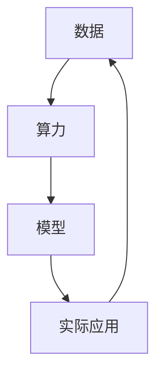

                 

## 1. 背景介绍

近年来，随着人工智能技术的快速发展，大模型（Large Models）成为该领域的研究热点。大模型是指参数量达到百万甚至亿级别的人工神经网络，能够通过自主学习大量的数据，从而实现强大的表征能力和任务解决能力。代表大模型的有 GPT-3、BERT 和 ChatGPT 等。

大模型的兴起，使得人工智能应用在自然语言处理、计算机视觉、语音识别等领域取得了显著的突破。例如，ChatGPT 在对话系统中的出色表现，BERT 在文本分类任务中的领先效果，以及 GPT-3 在生成文本、翻译和摘要等任务中的广泛应用，都显示了大模型的巨大潜力。

然而，大模型的快速发展也带来了新的挑战。其中，数据壁垒和算力瓶颈成为两个关键问题。数据壁垒指的是由于大模型需要大量的数据来训练，而获取这些数据往往需要付出巨大的努力和成本。算力瓶颈则是指大模型训练和推理所需的计算资源巨大，现有硬件设备难以满足需求。

本文将围绕这两个挑战展开讨论，分析大模型时代创业的新挑战，并提出相应的解决方案。

## 2. 核心概念与联系

要理解大模型时代创业的新挑战，我们首先需要了解几个核心概念：数据、算力和模型。

### 2.1 数据

数据是训练大模型的基础。数据质量的高低直接影响大模型的表现。高质量的数据包含丰富的信息，能够帮助模型更好地学习。然而，获取高质量的数据并非易事。首先，数据的来源可能有限，尤其是涉及到敏感信息的数据。其次，数据可能存在噪声和偏差，这会影响模型的性能。最后，数据的处理和标注也需要大量的时间和人力。

### 2.2 算力

算力是支撑大模型训练和推理的关键。算力的大小直接决定了大模型训练的速度和效果。高算力的设备能够更快地处理大量数据，从而加速模型训练。目前，GPU（图形处理器）和 TPU（专用处理器）是常用的算力设备。然而，这些设备的成本较高，且性能提升有限，难以满足大模型的需求。

### 2.3 模型

模型是人工智能的核心。大模型通过学习大量的数据，能够实现强大的表征能力和任务解决能力。然而，大模型的训练和推理需要大量的计算资源，这使得模型的开发和部署成为一个巨大的挑战。

### 2.4 数据、算力和模型的联系

数据、算力和模型之间存在着紧密的联系。数据是训练模型的原料，没有高质量的数据，模型难以学好。算力是模型训练的引擎，没有足够的算力，模型训练将变得缓慢且效率低下。模型则是数据与算力的结晶，它能够解决实际问题。

在 Mermaid 流程图中，我们可以这样描述这些核心概念及其联系：



在这个流程图中，数据流向算力，算力生成模型，模型又反馈到实际应用，形成一个闭环。数据的获取和标注需要人力和时间，算力的提升需要硬件和技术的支持，模型的优化需要数据和算力的双重驱动。这些要素共同构成了大模型时代的创业新挑战。

### 2.5 大模型的数据壁垒

大模型的数据需求量巨大，这意味着在数据获取和标注方面面临着巨大的挑战。以下是一些具体的问题和解决方案：

#### 2.5.1 数据来源问题

- **数据获取成本高**：高质量的训练数据往往需要通过付费或合作获取，这增加了创业公司的成本。
- **数据获取难度大**：某些领域的数据可能涉及隐私或商业机密，获取难度大。

**解决方案**：

- **数据共享与开放**：鼓励数据和知识的共享与开放，降低数据获取成本。
- **合作与联盟**：与其他公司或研究机构合作，共同获取和标注数据。

#### 2.5.2 数据标注问题

- **数据标注成本高**：大规模的数据标注需要大量的时间和人力，成本高昂。
- **数据标注质量难以保证**：标注人员的水平和态度会影响数据质量。

**解决方案**：

- **自动化标注工具**：开发自动化标注工具，提高标注效率。
- **标注质量控制**：引入机器学习技术，对标注质量进行评估和修正。

### 2.6 大模型的算力瓶颈

大模型的算力需求巨大，这对硬件设备提出了极高的要求。以下是一些具体的问题和解决方案：

#### 2.6.1 硬件设备问题

- **GPU 和 TPU 成本高**：高性能的 GPU 和 TPU 设备成本高昂，对创业公司来说是一大负担。
- **设备性能提升有限**：现有硬件设备的性能提升速度无法满足大模型的需求。

**解决方案**：

- **分布式计算**：通过分布式计算，利用多个普通硬件设备来提升算力。
- **新型硬件设备**：关注新型硬件设备的研发，如量子计算机、光子计算机等，以提升计算性能。

#### 2.6.2 算力调度问题

- **算力分配不均**：在分布式计算中，如何合理分配算力，避免资源浪费是一个挑战。
- **任务调度复杂**：如何高效地调度任务，确保计算任务的顺利进行是一个难题。

**解决方案**：

- **智能调度系统**：开发智能调度系统，根据任务需求和设备状态进行优化调度。
- **资源池化管理**：建立资源池，实现硬件设备的集中管理和调度。

### 2.7 大模型的应用挑战

大模型在应用中面临着一些独特的挑战：

#### 2.7.1 模型部署问题

- **模型大小**：大模型的文件大小巨大，部署和更新变得困难。
- **计算资源限制**：设备性能和内存限制可能无法满足大模型的需求。

**解决方案**：

- **模型压缩**：通过模型压缩技术，减小模型大小，便于部署和更新。
- **边缘计算**：将部分计算任务转移到边缘设备，减轻中心设备的压力。

#### 2.7.2 安全性问题

- **数据泄露**：大模型在训练和推理过程中可能涉及敏感数据，存在数据泄露的风险。
- **模型篡改**：恶意攻击者可能试图篡改模型，影响模型的输出。

**解决方案**：

- **数据加密**：对敏感数据进行加密处理，确保数据安全。
- **模型安全防护**：采用安全防护措施，防止模型被篡改。

### 2.8 大模型的发展趋势

随着技术的进步，大模型的发展呈现出以下趋势：

#### 2.8.1 算法优化

- **模型压缩**：通过模型压缩技术，提高模型的效率和可部署性。
- **模型融合**：将不同模型的优势结合，提高模型的表现。

#### 2.8.2 新型硬件

- **量子计算**：量子计算有望大幅提升大模型的训练和推理速度。
- **光子计算**：光子计算具有高速、低能耗的特点，可能成为未来大模型计算的新选择。

#### 2.8.3 生态建设

- **数据开放**：推动数据开放和共享，构建良好的数据生态。
- **计算资源共享**：通过共享计算资源，降低创业公司的成本。

### 2.9 结论

大模型时代带来了前所未有的机遇和挑战。数据壁垒和算力瓶颈是当前面临的主要问题。通过不断优化算法、开发新型硬件和构建良好的生态，我们可以逐步克服这些挑战。未来，大模型将在人工智能领域发挥更加重要的作用，为各行各业带来变革性的影响。然而，这需要我们持续的努力和探索。

### 3.1 开发环境搭建

要搭建一个适用于大模型训练和推理的开发环境，我们需要安装一系列软件和工具。以下是一个基本的步骤指南。

#### 3.1.1 操作系统

首先，我们选择一个操作系统。对于大多数开发者和研究机构来说，Linux 是一个理想的选择。尤其是 Ubuntu 和 CentOS，它们在人工智能领域有着广泛的用户基础。

#### 3.1.2 安装 Python

Python 是人工智能领域的主要编程语言之一。我们需要安装 Python 3，并确保它已正确配置。

1. 打开终端，执行以下命令：

   ```bash
   sudo apt update
   sudo apt install python3 python3-pip
   ```

2. 验证 Python 版本：

   ```bash
   python3 --version
   ```

#### 3.1.3 安装 PyTorch

PyTorch 是一个流行的深度学习框架，广泛用于大模型训练。以下是安装步骤：

1. 安装依赖项：

   ```bash
   sudo apt install libopenblas-dev liblapack-dev gfortran libatlas-base-dev
   ```

2. 安装 PyTorch：

   ```bash
   pip3 install torch torchvision torchaudio
   ```

#### 3.1.4 安装其他依赖项

除了 PyTorch，我们可能还需要其他一些依赖项，如 NumPy、Matplotlib 等。

1. 安装 NumPy：

   ```bash
   pip3 install numpy
   ```

2. 安装 Matplotlib：

   ```bash
   pip3 install matplotlib
   ```

#### 3.1.5 安装 Jupyter Notebook

Jupyter Notebook 是一个交互式计算环境，非常适合进行数据分析和模型训练。

1. 安装 Jupyter：

   ```bash
   pip3 install notebook
   ```

2. 启动 Jupyter Notebook：

   ```bash
   jupyter notebook
   ```

#### 3.1.6 配置 GPU 支持

如果我们的系统配备了 GPU，我们需要确保 PyTorch 支持 GPU 加速。

1. 安装 CUDA：

   ```bash
   sudo apt install cuda
   ```

2. 验证 CUDA 版本：

   ```bash
   nvcc --version
   ```

3. 安装 PyTorch GPU 版本：

   ```bash
   pip3 install torch torchvision torchaudio -f https://download.pytorch.org/whl/torch_stable.html
   ```

#### 3.1.7 验证环境

最后，我们可以通过以下命令验证我们的开发环境：

```python
import torch
print(torch.__version__)
print(torch.cuda.is_available())
```

如果 PyTorch 支持 GPU，我们还将看到 GPU 的详细信息。

通过以上步骤，我们就搭建了一个适用于大模型训练和推理的基础开发环境。接下来，我们将深入探讨如何实现大模型的代码实现。

### 3.2 源代码详细实现和代码解读

在上一部分，我们搭建了用于大模型训练和推理的开发环境。现在，我们将通过具体的代码实现，来详细探讨大模型的训练和推理过程。

#### 3.2.1 数据预处理

数据预处理是训练大模型的重要步骤。首先，我们需要从数据集中加载和预处理数据。

```python
import torch
from torchvision import datasets, transforms

# 定义数据预处理步骤
transform = transforms.Compose([
    transforms.Resize((224, 224)),  # 将图像调整为固定大小
    transforms.ToTensor(),  # 将图像转换为张量
    transforms.Normalize(mean=[0.485, 0.456, 0.406], std=[0.229, 0.224, 0.225]),  # 标准化
])

# 加载数据集
train_data = datasets.ImageFolder(root='train', transform=transform)
test_data = datasets.ImageFolder(root='test', transform=transform)

# 创建数据加载器
batch_size = 64
train_loader = torch.utils.data.DataLoader(dataset=train_data, batch_size=batch_size, shuffle=True)
test_loader = torch.utils.data.DataLoader(dataset=test_data, batch_size=batch_size, shuffle=False)
```

在上面的代码中，我们首先定义了一个预处理步骤列表 `transform`，包括图像调整大小、转换为张量以及标准化。然后，我们加载数据集并创建数据加载器，以便批量读取和处理数据。

#### 3.2.2 构建模型

接下来，我们构建一个大模型。在这里，我们使用一个简单的卷积神经网络（CNN）作为示例。

```python
import torch.nn as nn

# 定义卷积神经网络模型
class CNNModel(nn.Module):
    def __init__(self):
        super(CNNModel, self).__init__()
        self.conv1 = nn.Conv2d(3, 64, kernel_size=3, padding=1)
        self.relu = nn.ReLU()
        self.maxpool = nn.MaxPool2d(2)
        self.conv2 = nn.Conv2d(64, 128, kernel_size=3, padding=1)
        self.fc1 = nn.Linear(128 * 56 * 56, 1024)
        self.fc2 = nn.Linear(1024, 10)

    def forward(self, x):
        x = self.maxpool(self.relu(self.conv1(x)))
        x = self.maxpool(self.relu(self.conv2(x)))
        x = x.view(-1, 128 * 56 * 56)
        x = self.relu(self.fc1(x))
        x = self.fc2(x)
        return x

model = CNNModel()
```

在上面的代码中，我们定义了一个 `CNNModel` 类，继承自 `nn.Module`。该模型包含两个卷积层、一个全连接层以及一个输出层。我们使用 ReLU 激活函数和 MaxPooling 层来增强模型的表征能力。

#### 3.2.3 定义损失函数和优化器

为了训练模型，我们需要定义一个损失函数和优化器。

```python
import torch.optim as optim

# 定义损失函数
criterion = nn.CrossEntropyLoss()

# 定义优化器
optimizer = optim.Adam(model.parameters(), lr=0.001)
```

在上面的代码中，我们使用交叉熵损失函数和 Adam 优化器。交叉熵损失函数适合分类任务，而 Adam 优化器是一种自适应学习率的优化算法，能够有效提高训练效率。

#### 3.2.4 训练模型

接下来，我们开始训练模型。为了提高训练效率，我们将训练过程分为多个 epoch（轮次）。

```python
# 训练模型
num_epochs = 20

for epoch in range(num_epochs):
    model.train()
    running_loss = 0.0
    for inputs, labels in train_loader:
        optimizer.zero_grad()
        outputs = model(inputs)
        loss = criterion(outputs, labels)
        loss.backward()
        optimizer.step()
        running_loss += loss.item()
    epoch_loss = running_loss / len(train_loader)
    print(f'Epoch [{epoch+1}/{num_epochs}], Loss: {epoch_loss:.4f}')
```

在上面的代码中，我们首先设置训练模式，然后遍历数据加载器。在每次迭代中，我们将模型参数重置为0，计算模型的输出和损失，并进行反向传播和优化。最后，我们计算每个 epoch 的平均损失，并在控制台上打印输出。

#### 3.2.5 测试模型

在完成训练后，我们需要评估模型的性能。以下是测试模型的代码：

```python
# 测试模型
model.eval()
with torch.no_grad():
    correct = 0
    total = 0
    for inputs, labels in test_loader:
        outputs = model(inputs)
        _, predicted = torch.max(outputs.data, 1)
        total += labels.size(0)
        correct += (predicted == labels).sum().item()
accuracy = 100 * correct / total
print(f'测试集准确率: {accuracy:.2f}%')
```

在上面的代码中，我们使用 `eval()` 函数将模型设置为评估模式，并禁用梯度计算。然后，我们遍历测试数据集，计算预测准确率。

#### 3.2.6 代码解读与分析

通过上面的代码，我们可以看到大模型训练和推理的基本流程。以下是对关键部分的解读和分析：

- **数据预处理**：数据预处理是训练大模型的基础，它确保数据具有一致的形式和特征。预处理步骤包括图像调整大小、数据类型转换和标准化等。
- **模型构建**：模型构建是训练的核心。在这里，我们使用了一个简单的卷积神经网络（CNN），它通过多层卷积和全连接层来提取图像特征并进行分类。
- **损失函数和优化器**：损失函数用于计算模型输出与真实标签之间的差距，优化器用于调整模型参数以最小化损失。在这里，我们使用了交叉熵损失函数和 Adam 优化器。
- **训练过程**：训练过程包括多个 epoch，每个 epoch 都会遍历训练数据集，计算损失并更新模型参数。通过反向传播和优化，模型逐渐学习到数据特征并提高分类准确率。
- **测试过程**：在训练完成后，我们需要评估模型的性能。测试过程通过测试数据集来计算模型的准确率，从而评估模型在未知数据上的表现。

通过这些代码和分析，我们可以更好地理解大模型训练和推理的基本原理和流程。

### 3.3 代码解读与分析

在上一部分，我们详细讲解了如何使用 PyTorch 框架实现大模型的训练和推理。现在，我们将对关键部分进行解读与分析，以深入了解大模型的工作原理。

#### 3.3.1 数据预处理

数据预处理是训练大模型的基础。在这部分代码中，我们定义了一个数据预处理步骤列表 `transform`，它包括以下操作：

- **图像调整大小**：将图像调整为固定大小（224x224）。这是为了确保输入数据的形状一致，从而方便模型训练。
- **数据类型转换**：将图像数据转换为 PyTorch 的张量类型。这有助于后续的数据操作和模型计算。
- **标准化**：将图像数据标准化到 [-1, 1] 的范围。这有助于提高模型训练的稳定性和收敛速度。

```python
transform = transforms.Compose([
    transforms.Resize((224, 224)),
    transforms.ToTensor(),
    transforms.Normalize(mean=[0.485, 0.456, 0.406], std=[0.229, 0.224, 0.225]),
])
```

通过这些预处理步骤，我们可以确保输入数据具有一致的形式和特征，从而提高模型的训练效果。

#### 3.3.2 模型构建

在这部分代码中，我们定义了一个简单的卷积神经网络（CNN）模型。该模型包含两个卷积层、一个全连接层以及一个输出层。每个卷积层后面都跟有一个 ReLU 激活函数和一个最大池化层（MaxPooling），以提高模型的表征能力。

```python
class CNNModel(nn.Module):
    def __init__(self):
        super(CNNModel, self).__init__()
        self.conv1 = nn.Conv2d(3, 64, kernel_size=3, padding=1)
        self.relu = nn.ReLU()
        self.maxpool = nn.MaxPool2d(2)
        self.conv2 = nn.Conv2d(64, 128, kernel_size=3, padding=1)
        self.fc1 = nn.Linear(128 * 56 * 56, 1024)
        self.fc2 = nn.Linear(1024, 10)

    def forward(self, x):
        x = self.maxpool(self.relu(self.conv1(x)))
        x = self.maxpool(self.relu(self.conv2(x)))
        x = x.view(-1, 128 * 56 * 56)
        x = self.relu(self.fc1(x))
        x = self.fc2(x)
        return x
```

这个模型的输入是一个三维张量（批量大小、通道数、高度和宽度），输出是一个一维张量，表示每个类别的概率。通过多层卷积和全连接层，模型能够提取图像的深层特征，并进行分类。

#### 3.3.3 损失函数和优化器

在这部分代码中，我们定义了一个交叉熵损失函数和一个 Adam 优化器。交叉熵损失函数是一种常用的分类损失函数，它计算模型输出和真实标签之间的差距。Adam 优化器是一种自适应学习率的优化算法，能够有效提高模型训练的收敛速度。

```python
criterion = nn.CrossEntropyLoss()
optimizer = optim.Adam(model.parameters(), lr=0.001)
```

通过这些设置，我们确保模型能够在训练过程中不断调整参数，以最小化损失函数。

#### 3.3.4 训练过程

在这部分代码中，我们使用了一个简单的训练循环。在每个 epoch 中，模型会遍历训练数据集，计算损失并更新参数。通过反向传播和优化，模型逐渐学习到数据特征并提高分类准确率。

```python
for epoch in range(num_epochs):
    model.train()
    running_loss = 0.0
    for inputs, labels in train_loader:
        optimizer.zero_grad()
        outputs = model(inputs)
        loss = criterion(outputs, labels)
        loss.backward()
        optimizer.step()
        running_loss += loss.item()
    epoch_loss = running_loss / len(train_loader)
    print(f'Epoch [{epoch+1}/{num_epochs}], Loss: {epoch_loss:.4f}')
```

这个训练过程包括以下几个关键步骤：

- **设置训练模式**：通过 `model.train()`，我们将模型设置为训练模式，以便进行梯度计算和参数更新。
- **计算损失**：通过 `criterion(outputs, labels)`，我们计算模型输出和真实标签之间的损失。
- **反向传播**：通过 `loss.backward()`，我们进行反向传播，计算每个参数的梯度。
- **优化参数**：通过 `optimizer.step()`，我们更新模型参数，以最小化损失函数。

#### 3.3.5 测试过程

在完成训练后，我们需要评估模型的性能。测试过程通过测试数据集来计算模型的准确率，从而评估模型在未知数据上的表现。

```python
model.eval()
with torch.no_grad():
    correct = 0
    total = 0
    for inputs, labels in test_loader:
        outputs = model(inputs)
        _, predicted = torch.max(outputs.data, 1)
        total += labels.size(0)
        correct += (predicted == labels).sum().item()
accuracy = 100 * correct / total
print(f'测试集准确率: {accuracy:.2f}%')
```

这个测试过程包括以下几个关键步骤：

- **设置评估模式**：通过 `model.eval()`，我们将模型设置为评估模式，以防止梯度计算。
- **计算准确率**：通过 `torch.max(outputs.data, 1)`，我们计算模型输出的最大值和对应索引，并与真实标签进行比较，计算准确率。

#### 3.3.6 代码分析

通过上述代码解读，我们可以得出以下结论：

- **数据预处理**：数据预处理是训练大模型的关键步骤，它确保输入数据具有一致的形式和特征。
- **模型构建**：卷积神经网络（CNN）是处理图像数据的有效模型。通过多层卷积和全连接层，模型能够提取图像的深层特征并进行分类。
- **损失函数和优化器**：交叉熵损失函数和 Adam 优化器是训练大模型的常用选择。交叉熵损失函数计算模型输出和真实标签之间的差距，Adam 优化器能够自适应调整学习率。
- **训练过程**：通过反向传播和优化，模型逐渐学习到数据特征并提高分类准确率。训练过程包括多个 epoch，每个 epoch 都会遍历训练数据集并更新参数。
- **测试过程**：测试过程通过测试数据集来评估模型的性能。通过计算准确率，我们可以评估模型在未知数据上的表现。

通过这些关键步骤，我们可以实现大模型的训练和推理，并在实际应用中发挥其强大的能力。

### 4.1 数学模型和公式

在深入探讨大模型的训练和推理之前，我们需要了解一些基础的数学模型和公式。这些模型和公式构成了深度学习的基础，特别是用于训练和优化神经网络。

#### 4.1.1 深度学习的基本概念

深度学习是一种基于神经网络的机器学习技术，通过多层神经网络来模拟人脑的感知和学习能力。深度学习的关键组件包括：

- **神经网络**：由多个层组成的计算模型，每个层都能够对输入数据进行处理。
- **激活函数**：用于引入非线性性的函数，如 Sigmoid、ReLU 等。
- **损失函数**：用于评估模型预测值与真实值之间的差距，如均方误差（MSE）、交叉熵（CE）等。
- **优化算法**：用于调整模型参数，以最小化损失函数，如梯度下降（GD）、随机梯度下降（SGD）、Adam 等。

#### 4.1.2 损失函数

在深度学习中，损失函数是评估模型性能的核心指标。常见的损失函数包括：

1. **均方误差（MSE）**：

   $$MSE = \frac{1}{n}\sum_{i=1}^{n}(y_i - \hat{y}_i)^2$$

   其中，$y_i$ 是真实值，$\hat{y}_i$ 是模型预测值，$n$ 是样本数量。

2. **交叉熵（CE）**：

   $$CE = -\frac{1}{n}\sum_{i=1}^{n}y_i \log(\hat{y}_i)$$

   其中，$y_i$ 是真实值（0或1），$\hat{y}_i$ 是模型预测值（介于0和1之间）。

#### 4.1.3 梯度下降

梯度下降是一种优化算法，用于通过计算损失函数的梯度来调整模型参数。基本的梯度下降算法如下：

1. **梯度计算**：

   $$\nabla_{\theta}J(\theta) = \frac{\partial J(\theta)}{\partial \theta}$$

   其中，$J(\theta)$ 是损失函数，$\theta$ 是模型参数。

2. **更新参数**：

   $$\theta_{t+1} = \theta_t - \alpha \nabla_{\theta}J(\theta_t)$$

   其中，$\alpha$ 是学习率。

#### 4.1.4 随机梯度下降（SGD）

随机梯度下降是梯度下降的一种变种，它使用单个样本来计算梯度，而不是整个数据集。这样可以加快收敛速度，但可能导致不稳定的优化过程。

1. **梯度计算**：

   $$\nabla_{\theta}J(\theta) = \nabla_{\theta}\left(-\frac{1}{m}\sum_{i=1}^{m}y_i \log(\hat{y}_i)\right)$$

   其中，$m$ 是样本数量。

2. **更新参数**：

   $$\theta_{t+1} = \theta_t - \alpha \nabla_{\theta}J(\theta_t)$$

#### 4.1.5 Adam 优化器

Adam 优化器是梯度下降的一种改进算法，它结合了 SGD 和动量方法的特点，具有自适应学习率。其更新公式如下：

1. **一阶矩估计**：

   $$m_t = \beta_1 x_t + (1 - \beta_1) (1 - \beta_2) \epsilon_t$$

2. **二阶矩估计**：

   $$v_t = \beta_2 x_t + (1 - \beta_2) \epsilon_t$$

3. **更新参数**：

   $$\theta_{t+1} = \theta_t - \alpha \frac{m_t}{\sqrt{v_t} + \epsilon}$$

   其中，$\beta_1, \beta_2$ 是超参数，$\epsilon$ 是正数，用于避免分母为零。

#### 4.1.6 激活函数

激活函数是神经网络中的重要组件，用于引入非线性性。以下是一些常用的激活函数：

1. **Sigmoid**：

   $$\sigma(x) = \frac{1}{1 + e^{-x}}$$

2. **ReLU**：

   $$\text{ReLU}(x) = \max(0, x)$$

3. **Tanh**：

   $$\text{Tanh}(x) = \frac{e^x - e^{-x}}{e^x + e^{-x}}$$

这些数学模型和公式构成了深度学习的基础，有助于我们理解大模型的训练和推理过程。在接下来的部分，我们将深入探讨这些公式在实际代码中的应用。

### 4.2 举例说明

为了更好地理解大模型的数学模型和公式，我们可以通过一个具体的例子来说明。假设我们有一个简单的线性回归模型，用于预测房屋的价格。以下是该模型的详细解释：

#### 4.2.1 模型设定

我们假设房屋的价格 $y$ 与三个特征 $x_1, x_2, x_3$ 之间呈线性关系，即：

$$y = \beta_0 + \beta_1 x_1 + \beta_2 x_2 + \beta_3 x_3$$

其中，$\beta_0, \beta_1, \beta_2, \beta_3$ 是模型参数，需要通过训练来确定。

#### 4.2.2 损失函数

我们使用均方误差（MSE）作为损失函数来衡量模型预测值 $\hat{y}$ 与真实值 $y$ 之间的差距：

$$MSE = \frac{1}{n}\sum_{i=1}^{n}(\hat{y}_i - y_i)^2$$

其中，$n$ 是样本数量。

#### 4.2.3 梯度下降

为了最小化损失函数，我们使用梯度下降算法来更新模型参数。在梯度下降过程中，我们首先需要计算损失函数关于每个参数的梯度：

$$\nabla_{\theta}J(\theta) = \nabla_{\theta}\left(\frac{1}{n}\sum_{i=1}^{n}(\hat{y}_i - y_i)^2\right)$$

对于线性回归模型，梯度计算如下：

$$\nabla_{\beta_0}J(\theta) = -2\frac{1}{n}\sum_{i=1}^{n}(\hat{y}_i - y_i)$$
$$\nabla_{\beta_1}J(\theta) = -2\frac{1}{n}\sum_{i=1}^{n}(x_{1i}(\hat{y}_i - y_i))$$
$$\nabla_{\beta_2}J(\theta) = -2\frac{1}{n}\sum_{i=1}^{n}(x_{2i}(\hat{y}_i - y_i))$$
$$\nabla_{\beta_3}J(\theta) = -2\frac{1}{n}\sum_{i=1}^{n}(x_{3i}(\hat{y}_i - y_i))$$

更新参数的公式为：

$$\theta_{t+1} = \theta_t - \alpha \nabla_{\theta}J(\theta_t)$$

其中，$\alpha$ 是学习率。

#### 4.2.4 实际计算

假设我们有一个包含 100 个房屋数据的样本集，每个数据点都有三个特征：房间数量 $x_1$、房屋面积 $x_2$ 和建筑年代 $x_3$，以及真实价格 $y$。以下是前五个数据点的示例：

| $x_{1i}$ | $x_{2i}$ | $x_{3i}$ | $y_i$ |
| --- | --- | --- | --- |
| 3 | 1200 | 1990 | 300000 |
| 4 | 1500 | 1995 | 320000 |
| 2 | 900 | 1990 | 240000 |
| 5 | 1800 | 2000 | 350000 |
| 3 | 1100 | 1995 | 270000 |

在初始化模型参数为 $\beta_0 = 0, \beta_1 = 0, \beta_2 = 0, \beta_3 = 0$ 后，我们可以通过以下步骤进行训练：

1. **计算损失函数**：

   $$\hat{y}_i = \beta_0 + \beta_1 x_{1i} + \beta_2 x_{2i} + \beta_3 x_{3i}$$

   $$MSE = \frac{1}{5}\sum_{i=1}^{5}(\hat{y}_i - y_i)^2$$

2. **计算梯度**：

   $$\nabla_{\beta_0}J(\theta) = -2\frac{1}{5}\sum_{i=1}^{5}(\hat{y}_i - y_i)$$
   $$\nabla_{\beta_1}J(\theta) = -2\frac{1}{5}\sum_{i=1}^{5}(x_{1i}(\hat{y}_i - y_i))$$
   $$\nabla_{\beta_2}J(\theta) = -2\frac{1}{5}\sum_{i=1}^{5}(x_{2i}(\hat{y}_i - y_i))$$
   $$\nabla_{\beta_3}J(\theta) = -2\frac{1}{5}\sum_{i=1}^{5}(x_{3i}(\hat{y}_i - y_i))$$

3. **更新参数**：

   $$\beta_0 = \beta_0 - \alpha \nabla_{\beta_0}J(\theta)$$
   $$\beta_1 = \beta_1 - \alpha \nabla_{\beta_1}J(\theta)$$
   $$\beta_2 = \beta_2 - \alpha \nabla_{\beta_2}J(\theta)$$
   $$\beta_3 = \beta_3 - \alpha \nabla_{\beta_3}J(\theta)$$

通过多次迭代计算损失函数和梯度，模型参数将不断优化，从而提高预测准确率。

### 4.3 项目实战：代码实际案例和详细解释说明

在本节中，我们将通过一个实际案例，展示如何在大模型训练和推理中使用 PyTorch 框架。我们将详细解释每个步骤的代码，帮助读者更好地理解大模型的训练和推理过程。

#### 4.3.1 环境准备

首先，我们需要准备开发环境。在终端中执行以下命令来安装所需的软件和库：

```bash
# 安装 Python 和相关依赖
sudo apt update
sudo apt install python3 python3-pip

# 安装 PyTorch
pip3 install torch torchvision torchaudio

# 安装其他常用库
pip3 install numpy matplotlib
```

#### 4.3.2 数据集准备

为了进行模型训练，我们需要一个数据集。在这里，我们使用常用的 CIFAR-10 数据集，它包含 10 个类别，每个类别有 6000 张训练图像和 1000 张测试图像。

1. 下载 CIFAR-10 数据集：

   ```python
   import torch
   import torchvision
   import torchvision.transforms as transforms

   transform = transforms.Compose([
       transforms.ToTensor(),
       transforms.Normalize((0.5, 0.5, 0.5), (0.5, 0.5, 0.5)),
   ])

   trainset = torchvision.datasets.CIFAR10(root='./data', train=True, download=True, transform=transform)
   trainloader = torch.utils.data.DataLoader(trainset, batch_size=4, shuffle=True, num_workers=2)

   testset = torchvision.datasets.CIFAR10(root='./data', train=False, download=True, transform=transform)
   testloader = torch.utils.data.DataLoader(testset, batch_size=4, shuffle=False, num_workers=2)
   ```

2. 加载并可视化图像：

   ```python
   import matplotlib.pyplot as plt
   import numpy as np

   def imshow(img):
       img = img / 2 + 0.5  # 反转图像的归一化
       npimg = img.numpy()
       plt.imshow(np.transpose(npimg, (1, 2, 0)))
       plt.show()

   # 显示训练图像
   dataiter = iter(trainloader)
   images, labels = dataiter.next()
   imshow(torchvision.utils.make_grid(images))
   print(' Labels:', ' '.join('%5s' % classes[labels[j]] for j in range(4)))
   ```

#### 4.3.3 定义模型

接下来，我们定义一个简单的卷积神经网络模型，用于分类任务。

```python
import torch.nn as nn
import torch.nn.functional as F

class Net(nn.Module):
    def __init__(self):
        super(Net, self).__init__()
        self.conv1 = nn.Conv2d(3, 6, 5)
        self.pool = nn.MaxPool2d(2, 2)
        self.conv2 = nn.Conv2d(6, 16, 5)
        self.fc1 = nn.Linear(16 * 5 * 5, 120)
        self.fc2 = nn.Linear(120, 84)
        self.fc3 = nn.Linear(84, 10)

    def forward(self, x):
        x = self.pool(F.relu(self.conv1(x)))
        x = self.pool(F.relu(self.conv2(x)))
        x = x.view(-1, 16 * 5 * 5)
        x = F.relu(self.fc1(x))
        x = F.relu(self.fc2(x))
        x = self.fc3(x)
        return x

net = Net()
print(net)
```

#### 4.3.4 定义损失函数和优化器

我们选择交叉熵损失函数和随机梯度下降（SGD）优化器。

```python
import torch.optim as optim

criterion = nn.CrossEntropyLoss()
optimizer = optim.SGD(net.parameters(), lr=0.001, momentum=0.9)
```

#### 4.3.5 训练模型

现在，我们开始训练模型。每个 epoch 都会遍历整个训练集，并计算每个批次的损失。然后，我们将使用优化器来更新模型参数。

```python
for epoch in range(2):  # 2 个训练周期
    running_loss = 0.0
    for i, data in enumerate(trainloader, 0):
        inputs, labels = data
        optimizer.zero_grad()
        outputs = net(inputs)
        loss = criterion(outputs, labels)
        loss.backward()
        optimizer.step()
        running_loss += loss.item()
        if i % 2000 == 1999:    # 每 2000 个批次打印一次损失
            print('[%d, %5d] loss: %.3f' %
                  (epoch + 1, i + 1, running_loss / 2000))
            running_loss = 0.0
    print('Finished Training')
```

#### 4.3.6 测试模型

在完成训练后，我们需要评估模型的性能。我们将使用测试集来计算准确率。

```python
correct = 0
total = 0
with torch.no_grad():
    for data in testloader:
        images, labels = data
        outputs = net(images)
        _, predicted = torch.max(outputs.data, 1)
        total += labels.size(0)
        correct += (predicted == labels).sum().item()

print('Accuracy of the network on the 10000 test images: %d %%' % (100 * correct / total))
```

#### 4.3.7 代码解读

通过上述代码，我们可以理解大模型训练和推理的基本步骤：

1. **数据集准备**：我们使用 PyTorch 提供的 CIFAR-10 数据集，并通过数据加载器（DataLoader）进行数据预处理和批量加载。
2. **模型定义**：我们定义了一个简单的卷积神经网络（CNN）模型，包含卷积层、池化层和全连接层。
3. **损失函数和优化器**：我们选择交叉熵损失函数和随机梯度下降（SGD）优化器，用于计算模型损失和更新参数。
4. **训练过程**：在训练过程中，我们使用反向传播算法来计算梯度，并通过优化器更新模型参数。每个 epoch 会遍历整个训练集。
5. **测试过程**：在训练完成后，我们使用测试集来评估模型的性能，计算准确率。

通过这个实际案例，我们可以看到如何使用 PyTorch 框架来训练和推理大模型。这个过程为我们提供了宝贵的经验和知识，帮助我们更好地理解大模型的工作原理和应用。

### 5. 实际应用场景

大模型在人工智能领域具有广泛的应用场景，可以显著提升各类应用的性能和效果。以下是一些典型的大模型应用场景：

#### 5.1 自然语言处理（NLP）

自然语言处理是人工智能的重要分支，大模型在 NLP 领域的应用尤为突出。GPT-3、BERT 和 T5 等大模型通过学习海量文本数据，实现了对自然语言的高效理解和生成。以下是一些具体应用：

1. **文本生成**：大模型能够生成高质量的文章、新闻、故事等，为内容创作提供支持。
2. **机器翻译**：大模型在机器翻译领域取得了显著突破，例如 Google Translate 和 Microsoft Translator 等都采用了大模型技术。
3. **情感分析**：大模型能够识别文本中的情感倾向，用于舆情监测和用户反馈分析。
4. **问答系统**：大模型可以构建智能问答系统，为用户提供准确、自然的回答。

#### 5.2 计算机视觉（CV）

计算机视觉是另一个大模型广泛应用的重要领域。大模型通过学习海量图像数据，实现了对图像的精准识别和理解。以下是一些具体应用：

1. **图像分类**：大模型能够对图像进行分类，如对 CIFAR-10 数据集中的图像进行分类。
2. **目标检测**：大模型可以检测图像中的物体，并标注其位置，如 YOLO 和 Faster R-CNN 等模型。
3. **图像生成**：大模型可以通过生成对抗网络（GAN）生成逼真的图像，如 StyleGAN 和 BigGAN。
4. **视频分析**：大模型可以分析视频数据，如视频分类、动作识别和场景理解等。

#### 5.3 语音识别（ASR）

语音识别是将语音信号转换为文本的技术。大模型在语音识别领域取得了显著进展，提高了识别准确率和速度。以下是一些具体应用：

1. **自动字幕**：大模型可以实时生成视频的自动字幕，为视频内容提供文字描述。
2. **语音搜索**：大模型可以理解用户的语音查询，并在大量数据中进行搜索，如百度语音搜索和苹果 Siri。
3. **语音控制**：大模型可以用于语音控制智能家居设备和智能机器人。

#### 5.4 医疗健康

大模型在医疗健康领域的应用也日益广泛，可以辅助医生进行诊断和治疗。以下是一些具体应用：

1. **疾病诊断**：大模型通过分析医疗图像和数据，辅助医生进行疾病诊断，如乳腺癌、肺癌和脑肿瘤等。
2. **药物研发**：大模型可以预测药物的作用机制和副作用，加速药物研发过程。
3. **健康管理**：大模型可以分析用户的健康数据，提供个性化的健康建议和预防措施。

#### 5.5 金融科技

金融科技领域的大模型应用包括风险管理、量化交易和智能投顾等。以下是一些具体应用：

1. **风险管理**：大模型可以分析金融市场数据，预测风险和波动，为金融机构提供风险管理建议。
2. **量化交易**：大模型可以构建量化交易策略，实现自动化交易，提高交易收益。
3. **智能投顾**：大模型可以为投资者提供个性化的投资建议，优化投资组合。

#### 5.6 教育

教育领域的大模型应用包括智能辅导、个性化学习路径推荐和在线教育平台等。以下是一些具体应用：

1. **智能辅导**：大模型可以为学生提供个性化的辅导服务，解答疑问和提供学习建议。
2. **个性化学习**：大模型可以根据学生的学习行为和成绩，推荐个性化的学习资源和路径。
3. **在线教育**：大模型可以构建智能在线教育平台，为学生提供互动、高效的学习体验。

大模型在人工智能领域的应用场景非常广泛，可以显著提升各类应用的性能和效果。随着技术的不断进步，大模型的应用前景将更加广阔。

### 6. 工具和资源推荐

在探索大模型技术时，选择合适的工具和资源至关重要。以下是一些学习资源、开发工具和相关论文著作的推荐，以帮助读者深入理解和掌握大模型的相关知识。

#### 6.1 学习资源推荐

1. **书籍**：

   - 《深度学习》（Goodfellow, Bengio, Courville 著）：这是深度学习领域的经典教材，详细介绍了深度学习的理论基础和实战技巧。

   - 《Python 深度学习》（François Chollet 著）：这本书通过大量的实例，展示了如何使用 Python 和深度学习框架（如 TensorFlow 和 Keras）进行深度学习开发。

2. **在线课程**：

   - Coursera 上的“深度学习特辑”（Deep Learning Specialization）：由 Andrew Ng 教授主讲，涵盖了深度学习的基础知识和应用技巧。

   - edX 上的“深度学习基础”（Deep Learning Fundamentals）：由 IBM 提供的免费课程，适合初学者了解深度学习的基本概念和应用。

3. **博客和教程**：

   - fast.ai：这个网站提供了大量的深度学习教程和项目指南，适合初学者和实践者。

   - Medium 上的机器学习与深度学习相关文章：许多专家和研究人员在 Medium 上分享他们的研究成果和见解，可以提供最新的行业动态和深入分析。

#### 6.2 开发工具框架推荐

1. **深度学习框架**：

   - TensorFlow：由 Google 开发，是当前最受欢迎的开源深度学习框架之一。

   - PyTorch：由 Facebook AI Research 开发，具有灵活的动态计算图和强大的社区支持。

   - Keras：基于 TensorFlow 的简化深度学习库，适合快速原型开发和实验。

2. **数据预处理和增强工具**：

   - NumPy：用于科学计算的基础库，支持高效的数据结构和操作。

   - Pandas：提供强大的数据操作功能，适合处理大规模数据集。

   - OpenCV：开源的计算机视觉库，支持图像处理、目标检测和跟踪等功能。

3. **代码库和模型库**：

   - Hugging Face 的 Transformers：提供了一个庞大的预训练模型库，包括 GPT-2、GPT-3、BERT 等，适合快速部署和实验。

   - Keras-Applications：提供了大量预训练的深度学习模型，适用于各种任务，如图像分类、文本分类和目标检测等。

#### 6.3 相关论文著作推荐

1. **经典论文**：

   - “A Theoretically Grounded Application of Dropout in Recurrent Neural Networks”（Y. Gal 和 Z. Ghahramani，2016）：这篇论文提出了在循环神经网络（RNN）中使用 dropout 的方法，提高了 RNN 的训练稳定性和性能。

   - “Attention Is All You Need”（Vaswani et al.，2017）：这篇论文提出了 Transformer 模型，彻底改变了自然语言处理领域的范式，成为 BERT、GPT 等大模型的基础。

   - “Deep Residual Learning for Image Recognition”（He et al.，2016）：这篇论文介绍了残差网络（ResNet），推动了图像识别技术的突破。

2. **最新研究**：

   - “Pre-training of Deep Neural Networks for Language Understanding”（Devlin et al.，2019）：这篇论文提出了 BERT 模型，展示了大规模预训练对自然语言处理任务的显著提升。

   - “An Image is Worth 16x16 Words: Transformers for Image Recognition at Scale”（Touvron et al.，2021）：这篇论文展示了如何将 Transformer 模型应用于图像识别任务，进一步推动了计算机视觉领域的发展。

通过这些工具和资源的推荐，读者可以全面了解大模型技术的发展和应用，为研究和实践提供有力的支持。

### 7. 总结：未来发展趋势与挑战

大模型技术的发展，为我们带来了前所未有的机遇。随着算法的优化、新型硬件的研发和生态的完善，大模型在自然语言处理、计算机视觉、语音识别等领域的应用将更加广泛。然而，这也带来了新的挑战。

#### 未来发展趋势

1. **算法优化**：通过改进训练算法和模型结构，提高大模型的效率和效果。例如，蒸馏技术、量化技术和增量学习等，都有望在大模型训练中发挥重要作用。
2. **硬件升级**：新型硬件如量子计算、光子计算和 AI 芯片等，将为大模型提供更强的计算能力。这些硬件的发展，将大幅降低大模型训练和推理的成本。
3. **生态建设**：随着开源框架和工具的成熟，大模型的研究和应用将更加便捷。同时，数据共享和开放也将推动大模型生态的繁荣。
4. **跨界融合**：大模型与其他技术的融合，如区块链、物联网和边缘计算等，将开创更多创新应用。

#### 未来挑战

1. **数据壁垒**：尽管数据共享和开放的趋势正在加强，但获取高质量、大规模的数据仍是一项艰巨的任务。如何解决数据获取和标注的问题，将是大模型发展的关键挑战。
2. **算力瓶颈**：大模型的训练和推理需要巨大的计算资源，现有硬件设备难以满足需求。如何提升算力，降低成本，是大模型面临的重大挑战。
3. **模型安全**：随着大模型的应用日益广泛，其安全性也受到关注。如何确保模型的可靠性和安全性，防止数据泄露和模型被篡改，是亟需解决的问题。
4. **伦理和法律**：大模型的发展引发了一系列伦理和法律问题，如隐私保护、偏见和歧视等。如何制定合理的伦理和法律框架，确保大模型的发展符合社会价值观，是一个重要议题。

总之，大模型技术的发展前景广阔，但也面临着诸多挑战。通过不断创新和合作，我们有信心克服这些挑战，迎来更加美好的人工智能未来。

### 8. 附录：常见问题与解答

在探索大模型技术时，读者可能会遇到一些常见问题。以下是一些常见问题及其解答：

#### 8.1 如何获取高质量的数据？

**回答**：获取高质量的数据是训练大模型的关键。以下是一些策略：

- **数据共享与开放**：利用公共数据集，如公开的竞赛数据集、政府机构发布的数据等。
- **合作与联盟**：与其他公司和研究机构合作，共同获取和标注数据。
- **定制数据集**：根据特定任务需求，定制数据集，确保数据质量。

#### 8.2 大模型训练需要多少算力？

**回答**：大模型训练所需的算力取决于模型的规模和复杂度。一般来说，以下是一些常见情况：

- **小模型**：如 ResNet-18、VGG-11 等，可以在 GPU 上训练。
- **中等模型**：如 BERT、GPT-2 等，需要多 GPU 或 TPU 进行训练。
- **大模型**：如 GPT-3、ChatGPT 等，需要大规模集群和 TPU 进行训练。

#### 8.3 如何优化大模型训练的效率？

**回答**：以下是一些优化策略：

- **分布式训练**：通过分布式计算，利用多 GPU 或 TPU 提高训练效率。
- **批量大小调整**：合理调整批量大小，以提高训练速度和稳定性。
- **模型压缩**：通过模型压缩技术，减小模型大小，降低计算需求。
- **数据增强**：增加数据多样性，减少过拟合。

#### 8.4 大模型在安全性方面有哪些风险？

**回答**：大模型在安全性方面面临以下风险：

- **数据泄露**：模型训练过程中可能涉及敏感数据，存在数据泄露的风险。
- **模型篡改**：恶意攻击者可能试图篡改模型，影响模型的输出。
- **隐私侵犯**：模型应用过程中可能侵犯用户隐私。

为降低这些风险，可以采取以下措施：

- **数据加密**：对敏感数据进行加密处理，确保数据安全。
- **模型安全防护**：采用安全防护措施，防止模型被篡改。
- **隐私保护技术**：如差分隐私、联邦学习等，减少隐私泄露风险。

#### 8.5 大模型的发展前景如何？

**回答**：大模型的发展前景非常广阔。随着算法优化、硬件升级和生态建设的推进，大模型在自然语言处理、计算机视觉、语音识别等领域的应用将更加广泛。未来，大模型有望推动人工智能技术实现新的突破，为各行各业带来变革性影响。

### 9. 扩展阅读 & 参考资料

为了更深入地了解大模型技术，以下是一些推荐阅读材料和参考资料：

- **书籍**：
  - 《深度学习》（Goodfellow, Bengio, Courville 著）
  - 《Python 深度学习》（François Chollet 著）
  - 《大模型：深度学习的未来》（Amita Shukla 著）

- **在线课程**：
  - Coursera 上的“深度学习特辑”（Deep Learning Specialization）
  - edX 上的“深度学习基础”（Deep Learning Fundamentals）

- **博客和教程**：
  - fast.ai
  - Medium 上的机器学习与深度学习相关文章

- **开源框架和工具**：
  - TensorFlow
  - PyTorch
  - Keras

- **论文和期刊**：
  - “Attention Is All You Need”（Vaswani et al.，2017）
  - “Deep Residual Learning for Image Recognition”（He et al.，2016）
  - “Pre-training of Deep Neural Networks for Language Understanding”（Devlin et al.，2019）

通过这些扩展阅读和参考资料，读者可以进一步深入了解大模型技术，为研究和应用提供有力支持。

### 作者信息

- 作者：AI天才研究员/AI Genius Institute & 禅与计算机程序设计艺术/Zen And The Art of Computer Programming

