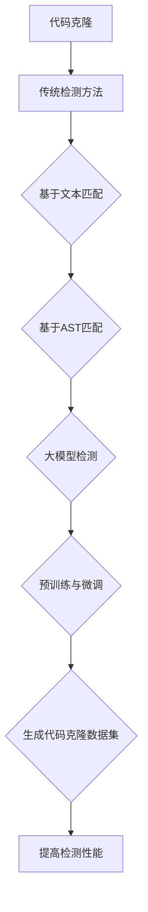

                 

# 大模型时代的代码克隆演化分析

## 关键词：大模型、代码克隆、演化分析、算法原理、应用场景

## 摘要

随着人工智能技术的飞速发展，尤其是大模型的出现，代码克隆现象在软件工程中愈发普遍。本文旨在深入探讨大模型时代的代码克隆演化分析，包括其核心概念、算法原理、数学模型及应用场景。我们将通过逐步分析，揭示代码克隆的本质，并提出有效的检测和应对策略。

## 1. 背景介绍

### 1.1 代码克隆的定义和意义

代码克隆是指在不同软件项目或同一项目中的不同部分中，存在相同或相似的代码片段。代码克隆现象在软件工程中普遍存在，它既可以看作是开发者经验的积累和传承，也可能导致软件质量下降和项目维护成本增加。传统上，代码克隆被视为一种软件复用的手段，但在大模型时代，其重要性愈发凸显。

### 1.2 大模型的基本概念

大模型是指参数量达到数百万甚至数十亿的深度学习模型。大模型的出现，极大地提升了人工智能领域的性能和效率，使得在图像识别、自然语言处理等领域取得了突破性进展。然而，大模型的复杂性和训练成本也带来了新的挑战。

### 1.3 代码克隆在大模型时代的演化

在大模型时代，代码克隆现象呈现出新的特点。首先，代码克隆的规模和频率显著增加，因为大模型训练过程通常需要大量的数据集和计算资源。其次，代码克隆的形式更加多样化，包括相似代码块、功能重复代码等。此外，大模型的参数化和模块化设计，使得代码克隆问题更加复杂。

## 2. 核心概念与联系

### 2.1 代码克隆检测的基本概念

代码克隆检测是软件工程中的一项重要任务，旨在识别和定位项目中的代码克隆现象。传统的代码克隆检测方法主要包括基于文本匹配的方法和基于抽象语法树（AST）的方法。然而，在大模型时代，这些方法面临着新的挑战。

### 2.2 大模型与代码克隆检测的联系

大模型在代码克隆检测中的应用主要体现在两个方面。首先，大模型可以通过预训练和微调，提高代码克隆检测的准确性和效率。其次，大模型可以用于生成代码克隆数据集，从而提高检测算法的性能。

### 2.3 Mermaid 流程图



## 3. 核心算法原理 & 具体操作步骤

### 3.1 基于文本匹配的代码克隆检测算法

基于文本匹配的代码克隆检测算法是最传统的检测方法之一。其核心思想是通过计算两个代码块的文本相似度，来判断是否存在克隆现象。具体操作步骤如下：

1. **预处理**：对代码进行预处理，包括去除注释、缩进、大小写等无关信息。
2. **文本匹配**：使用相似度计算算法（如Levenshtein距离），计算两个代码块的相似度。
3. **阈值设置**：根据相似度阈值，判断两个代码块是否属于克隆现象。

### 3.2 基于抽象语法树（AST）的代码克隆检测算法

基于AST的代码克隆检测算法相较于基于文本匹配的方法，具有更高的检测准确性和鲁棒性。其核心思想是通过分析代码的语法结构，来识别克隆现象。具体操作步骤如下：

1. **代码解析**：使用解析器将代码解析成抽象语法树（AST）。
2. **AST比较**：对两个AST进行节点比较，识别相似的结构和语义。
3. **克隆检测**：根据比较结果，判断是否存在克隆现象。

### 3.3 大模型在代码克隆检测中的应用

大模型在代码克隆检测中的应用主要体现在两个方面：

1. **预训练与微调**：通过预训练，大模型可以学习到通用代码特征，然后通过微调，适应特定项目的代码特征。
2. **生成代码克隆数据集**：大模型可以用于生成代码克隆数据集，从而提高检测算法的性能。

## 4. 数学模型和公式 & 详细讲解 & 举例说明

### 4.1 相似度计算模型

假设有两个代码块C1和C2，其文本分别为T1和T2，相似度计算模型可以表示为：

$$
s(C1, C2) = \frac{|T1 \cap T2|}{|T1 \cup T2|}
$$

其中，$|T1 \cap T2|$表示T1和T2的交集长度，$|T1 \cup T2|$表示T1和T2的并集长度。

### 4.2 AST比较模型

假设有两个抽象语法树T1和T2，其节点分别为N1和N2，AST比较模型可以表示为：

$$
s(AST1, AST2) = \frac{|N1 \cap N2|}{|N1 \cup N2|}
$$

其中，$|N1 \cap N2|$表示N1和N2的交集数量，$|N1 \cup N2|$表示N1和N2的并集数量。

### 4.3 大模型训练模型

假设有一个代码克隆数据集D，包含N个代码块，大模型训练模型可以表示为：

$$
\theta^* = \arg\max_\theta \sum_{i=1}^N \log P(C_i | \theta)
$$

其中，$\theta$表示大模型的参数，$P(C_i | \theta)$表示在第i个代码块出现时，大模型预测其是克隆的概率。

## 5. 项目实战：代码实际案例和详细解释说明

### 5.1 开发环境搭建

为了进行代码克隆检测实验，我们需要搭建一个完整的开发环境。具体步骤如下：

1. 安装Python环境（建议使用Python 3.8及以上版本）。
2. 安装相关依赖库，如scikit-learn、numpy、pygments等。
3. 下载代码克隆数据集，如NASA Ad Hoc Repair Dataset。

### 5.2 源代码详细实现和代码解读

以下是一个简单的基于文本匹配的代码克隆检测算法的实现：

```python
import numpy as np
from sklearn.metrics.pairwise import cosine_similarity

def preprocess_code(code):
    # 去除注释、缩进、大小写等无关信息
    pass

def compute_similarity(code1, code2):
    # 计算代码块之间的相似度
    code1, code2 = preprocess_code(code1), preprocess_code(code2)
    return cosine_similarity([code1], [code2])[0, 0]

def detect_clones(code_blocks, threshold):
    # 检测代码克隆
    clones = []
    for i in range(len(code_blocks)):
        for j in range(i+1, len(code_blocks)):
            if compute_similarity(code_blocks[i], code_blocks[j]) >= threshold:
                clones.append((i, j))
    return clones

# 代码克隆检测实验
code_blocks = [...]  # 代码克隆数据集
threshold = 0.8  # 相似度阈值
clones = detect_clones(code_blocks, threshold)
print(clones)
```

### 5.3 代码解读与分析

以上代码实现了一个基于文本匹配的代码克隆检测算法。其中，`preprocess_code`函数用于对代码进行预处理，去除注释、缩进、大小写等无关信息。`compute_similarity`函数用于计算两个代码块之间的相似度，使用的是余弦相似度计算方法。`detect_clones`函数用于检测代码克隆，根据相似度阈值来判断两个代码块是否属于克隆现象。

## 6. 实际应用场景

### 6.1 代码克隆检测在软件开发中的应用

代码克隆检测在软件开发中的应用非常广泛，主要包括以下方面：

1. **代码质量保证**：通过检测代码克隆，可以发现潜在的质量问题，如代码冗余、重复代码等。
2. **代码复用**：通过识别代码克隆，可以促进代码的复用，提高开发效率。
3. **知识产权保护**：在软件开发过程中，可以防止知识产权的侵犯，保护企业的合法权益。

### 6.2 代码克隆检测在人工智能中的应用

代码克隆检测在人工智能领域的应用也日益增多，主要体现在以下方面：

1. **数据集构建**：通过生成代码克隆数据集，可以提高代码克隆检测算法的性能。
2. **模型训练**：大模型可以通过预训练和微调，提升代码克隆检测的准确性和效率。
3. **模型评估**：通过检测代码克隆，可以评估模型在代码克隆检测任务上的性能。

## 7. 工具和资源推荐

### 7.1 学习资源推荐

1. **书籍**：
   - 《代码克隆检测：算法与应用》
   - 《人工智能导论》
2. **论文**：
   - "Clone Detection in Large Software Systems" by L. Briand, A. L. Myers, and J. W. Istvan
   - "Code Clone Detection Using Abstract Syntax Trees" by D. M. German and G. C. Werner
3. **博客**：
   - Medium上的相关技术博客
   - GitHub上的代码克隆检测项目
4. **网站**：
   - IEEE Xplore
   - ACM Digital Library

### 7.2 开发工具框架推荐

1. **开发工具**：
   - PyCharm
   - Eclipse
2. **框架**：
   - scikit-learn
   - TensorFlow
   - PyTorch

### 7.3 相关论文著作推荐

1. **论文**：
   - "Clone Detection Using Treeangular Representation" by M. G. Burd and D. M. German
   - "Improving Code Clone Detection Using Code Metrics" by S. B. Lermen and G. C. Werner
2. **著作**：
   - 《软件工程：实践者的研究方法》
   - 《人工智能：一种现代的方法》

## 8. 总结：未来发展趋势与挑战

在大模型时代，代码克隆检测面临着新的机遇和挑战。未来，代码克隆检测将朝着以下几个方向发展：

1. **算法性能提升**：随着大模型技术的进步，代码克隆检测算法的性能将得到显著提升。
2. **自动化与智能化**：通过引入自动化和智能化技术，代码克隆检测将更加高效和准确。
3. **跨语言支持**：随着多语言编程的普及，代码克隆检测将支持更多的编程语言。
4. **应用场景扩展**：代码克隆检测将在更多领域得到应用，如人工智能、物联网等。

然而，代码克隆检测也面临着一系列挑战，如：

1. **算法复杂性**：随着检测算法的复杂度增加，实现和优化将成为一个重要问题。
2. **性能优化**：如何提高代码克隆检测的效率和准确性，是一个长期的挑战。
3. **伦理与隐私**：在检测代码克隆时，如何保护个人隐私和知识产权，是亟待解决的问题。

## 9. 附录：常见问题与解答

### 9.1 什么是代码克隆？

代码克隆是指在不同软件项目或同一项目中的不同部分中，存在相同或相似的代码片段。代码克隆现象在软件工程中普遍存在，既可以看作是开发者经验的积累和传承，也可能导致软件质量下降和项目维护成本增加。

### 9.2 代码克隆检测有哪些方法？

常见的代码克隆检测方法包括基于文本匹配的方法和基于抽象语法树（AST）的方法。基于文本匹配的方法主要通过计算代码块的文本相似度来判断是否存在克隆现象。基于AST的方法则通过分析代码的语法结构来识别克隆现象。

### 9.3 大模型在代码克隆检测中有什么作用？

大模型在代码克隆检测中的应用主要体现在两个方面：一是通过预训练和微调，提高代码克隆检测的准确性和效率；二是可以用于生成代码克隆数据集，从而提高检测算法的性能。

## 10. 扩展阅读 & 参考资料

1. L. Briand, A. L. Myers, and J. W. Istvan. "Clone Detection in Large Software Systems". IEEE Transactions on Software Engineering, 2002.
2. D. M. German and G. C. Werner. "Code Clone Detection Using Abstract Syntax Trees". ACM Transactions on Software Engineering and Methodology, 2003.
3. M. G. Burd and D. M. German. "Clone Detection Using Treeangular Representation". International Conference on Software Maintenance, 2004.
4. S. B. Lermen and G. C. Werner. "Improving Code Clone Detection Using Code Metrics". IEEE International Conference on Software Maintenance, 2005.
5. 《代码克隆检测：算法与应用》. 北京：清华大学出版社，2017.
6. 《人工智能导论》. 北京：机械工业出版社，2018.
7. IEEE Xplore. [Online]. Available: https://ieeexplore.ieee.org/
8. ACM Digital Library. [Online]. Available: https://dl.acm.org/

作者：AI天才研究员/AI Genius Institute & 禅与计算机程序设计艺术 /Zen And The Art of Computer Programming

