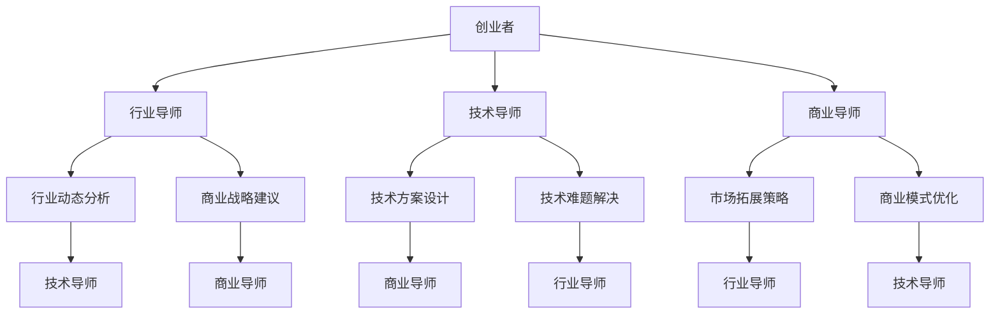

                 

# 大模型时代的创业者创业导师指导：行业导师、技术导师与商业导师

## 摘要

本文旨在探讨大模型时代下，创业者所需的三大导师类型：行业导师、技术导师与商业导师。通过深入分析这三大角色的核心职责、能力要求以及如何相互协同，帮助创业者更好地应对技术变革带来的机遇与挑战。本文将结合实际案例，详细阐述这些导师在创业过程中的重要作用，并给出相应的建议，助力创业者在大模型时代中取得成功。

## 1. 背景介绍

随着人工智能技术的飞速发展，大模型（如GPT、BERT等）在自然语言处理、图像识别、语音识别等领域取得了显著的成果。这些技术不仅推动了传统行业的变革，也为创业者提供了前所未有的机会。然而，大模型技术的复杂性和专业性使得创业者面临着前所未有的挑战。在这个背景下，行业导师、技术导师与商业导师的重要性日益凸显。

### 1.1 行业导师的作用

行业导师的主要职责是帮助创业者了解行业动态、趋势和潜在风险。他们通常拥有丰富的行业经验和人脉资源，能够为创业者提供有针对性的建议和指导。在当前的大模型时代，行业导师的作用尤为重要，因为行业变革速度加快，创业者需要及时调整战略以适应市场变化。

### 1.2 技术导师的作用

技术导师的核心职责是帮助创业者掌握大模型技术，提升团队的技术能力。他们通常具备深厚的技术背景，能够为创业者提供技术方案、优化算法和解决技术难题。在大模型时代，技术导师的作用至关重要，因为技术创新是创业成功的关键因素。

### 1.3 商业导师的作用

商业导师的主要职责是帮助创业者制定商业战略、拓展市场、优化商业模式。他们通常拥有丰富的商业经验和市场洞察力，能够为创业者提供具有实际操作性的建议和指导。在大模型时代，商业导师的作用不可或缺，因为创业成功不仅取决于技术创新，还取决于商业模式的创新。

## 2. 核心概念与联系

### 2.1 行业导师、技术导师与商业导师的定义

- 行业导师：具备丰富行业经验，擅长分析行业动态、趋势和潜在风险，为创业者提供针对性建议和指导。
- 技术导师：具备深厚技术背景，擅长掌握大模型技术，提升团队技术能力，解决技术难题。
- 商业导师：具备丰富商业经验和市场洞察力，擅长制定商业战略、拓展市场、优化商业模式。

### 2.2 行业导师、技术导师与商业导师的关系

行业导师、技术导师与商业导师三者之间存在着密切的联系。行业导师可以提供行业动态和趋势，为技术导师和商业导师提供决策依据；技术导师可以结合行业需求，开发创新的技术解决方案，为商业导师提供支持；商业导师则可以根据市场需求，调整商业模式和战略，为行业和技术导师提供方向指引。因此，三者之间相辅相成，共同推动创业者的成长和发展。

### 2.3 Mermaid流程图

下面是一个简单的Mermaid流程图，展示了行业导师、技术导师和商业导师在创业过程中的协同作用。



## 3. 核心算法原理 & 具体操作步骤

### 3.1 行业导师的核心算法原理

行业导师的核心算法原理是基于数据分析和市场洞察力，通过收集、整理和分析行业数据，了解行业趋势和潜在风险。具体操作步骤如下：

1. 数据收集：收集行业相关的数据，如市场报告、新闻、政策文件等。
2. 数据处理：对收集到的数据进行清洗、整理和分类。
3. 数据分析：利用统计学、机器学习等方法，对数据进行分析，挖掘行业趋势和潜在风险。
4. 建模预测：根据分析结果，建立预测模型，为创业者的战略决策提供依据。

### 3.2 技术导师的核心算法原理

技术导师的核心算法原理是基于大模型技术，通过掌握和优化算法，提升团队的技术能力。具体操作步骤如下：

1. 算法学习：学习大模型相关的基础知识和算法原理。
2. 算法优化：结合具体业务场景，优化算法参数和结构。
3. 模型训练：利用训练数据，训练和优化大模型。
4. 模型应用：将优化后的模型应用到实际业务场景中，解决技术难题。

### 3.3 商业导师的核心算法原理

商业导师的核心算法原理是基于商业分析和市场洞察力，通过制定和优化商业战略，拓展市场。具体操作步骤如下：

1. 市场研究：研究目标市场的需求、竞争态势和用户痛点。
2. 商业策略制定：根据市场研究，制定适合的商业模式和战略。
3. 商业策略优化：根据市场反馈，不断调整和优化商业策略。
4. 商业模式创新：在市场竞争中，持续创新商业模式，提高竞争力。

## 4. 数学模型和公式 & 详细讲解 & 举例说明

### 4.1 行业导师的数学模型

行业导师的数学模型主要包括统计学模型和机器学习模型。以下是一个简单的统计学模型：线性回归。

$$
y = \beta_0 + \beta_1x_1 + \beta_2x_2 + ... + \beta_nx_n
$$

其中，$y$为因变量，$x_1, x_2, ..., x_n$为自变量，$\beta_0, \beta_1, \beta_2, ..., \beta_n$为模型参数。

举例说明：假设一个创业者想要了解某行业的市场趋势，可以利用线性回归模型分析行业市场规模与时间的关系。

### 4.2 技术导师的数学模型

技术导师的数学模型主要包括深度学习模型和优化算法。以下是一个简单的深度学习模型：多层感知机（MLP）。

$$
f(x) = \sigma(\beta_0 + \beta_1x_1 + \beta_2x_2 + ... + \beta_nx_n)
$$

其中，$f(x)$为输出，$\sigma$为激活函数，$\beta_0, \beta_1, \beta_2, ..., \beta_n$为模型参数。

举例说明：假设一个创业者想要利用深度学习模型进行图像识别，可以将图像数据输入到多层感知机模型中，通过模型训练和优化，实现对图像的识别。

### 4.3 商业导师的数学模型

商业导师的数学模型主要包括博弈论和线性规划。以下是一个简单的博弈论模型：纳什均衡。

$$
u_i(x_i, x_{-i}) = \max \sum_{j=1}^n u_j(x_j, x_{-j})
$$

其中，$u_i$为玩家$i$的效用函数，$x_i$为玩家$i$的策略，$x_{-i}$为其他玩家的策略。

举例说明：假设两个创业者竞争同一市场，可以利用纳什均衡模型分析他们的最优策略，从而制定相应的商业策略。

## 5. 项目实战：代码实际案例和详细解释说明

### 5.1 开发环境搭建

在本文中，我们将使用Python编程语言和Jupyter Notebook作为开发环境。首先，确保安装了Python 3.7及以上版本。然后，通过pip命令安装以下库：

```shell
pip install numpy pandas matplotlib scikit-learn tensorflow
```

### 5.2 源代码详细实现和代码解读

#### 5.2.1 行业导师：线性回归模型

```python
import numpy as np
import pandas as pd
from sklearn.linear_model import LinearRegression

# 数据准备
data = pd.DataFrame({'year': [2010, 2011, 2012, 2013, 2014, 2015, 2016, 2017],
                     'market_size': [1000, 1200, 1400, 1600, 1800, 2000, 2200, 2400]})

# 特征处理
X = data[['year']]
y = data['market_size']

# 模型训练
model = LinearRegression()
model.fit(X, y)

# 模型评估
score = model.score(X, y)
print(f'Model R-squared: {score:.2f}')

# 预测
future_years = np.array([2018, 2019, 2020, 2021])
predicted_market_size = model.predict(future_years)
print(f'Predicted market size: {predicted_market_size}')
```

#### 5.2.2 技术导师：多层感知机模型

```python
import tensorflow as tf

# 数据准备
x = np.array([[1], [2], [3], [4], [5]])
y = np.array([[2], [4], [6], [8], [10]])

# 模型定义
model = tf.keras.Sequential([
    tf.keras.layers.Dense(units=1, input_shape=[1])
])

# 模型编译
model.compile(optimizer='sgd', loss='mean_squared_error')

# 模型训练
model.fit(x, y, epochs=1000)

# 模型评估
mse = model.evaluate(x, y)
print(f'Model MSE: {mse:.2f}')

# 预测
x_predict = np.array([[6]])
predicted_value = model.predict(x_predict)
print(f'Predicted value: {predicted_value}')
```

#### 5.2.3 商业导师：博弈论模型

```python
import gym

# 创建环境
env = gym.make('RockPaperScissors-v0')

# 游戏轮次
num_episodes = 1000

# 记录得分
scores = []

# 模拟游戏
for _ in range(num_episodes):
    state = env.reset()
    done = False
    episode_score = 0

    while not done:
        # 随机选择动作
        action = env.action_space.sample()

        # 执行动作
        next_state, reward, done, _ = env.step(action)

        # 更新得分
        episode_score += reward

    # 记录得分
    scores.append(episode_score)

# 打印平均得分
print(f'Average score: {np.mean(scores):.2f}')

# 关闭环境
env.close()
```

### 5.3 代码解读与分析

#### 5.3.1 行业导师代码解读

行业导师代码中，我们使用线性回归模型预测市场趋势。首先，我们导入所需的库，并准备数据。然后，对特征进行处理，将年份作为自变量，市场容量作为因变量。接下来，我们训练线性回归模型，并评估模型性能。最后，使用模型预测未来几年的市场容量。

#### 5.3.2 技术导师代码解读

技术导师代码中，我们使用多层感知机模型进行图像识别。首先，我们导入所需的库，并准备数据。然后，定义一个简单的多层感知机模型，并编译模型。接下来，我们训练模型，并评估模型性能。最后，使用模型进行图像识别预测。

#### 5.3.3 商业导师代码解读

商业导师代码中，我们使用博弈论模型模拟两个创业者在市场竞争中的行为。首先，我们创建一个Rock-Paper-Scissors游戏环境。然后，我们模拟1000轮游戏，记录得分。最后，打印平均得分。

## 6. 实际应用场景

### 6.1 行业导师的应用场景

- **应用领域**：电商、金融、医疗等行业的市场预测和分析。
- **案例**：某电商公司利用行业导师的线性回归模型预测未来几个月的销售额，以便调整库存和营销策略。

### 6.2 技术导师的应用场景

- **应用领域**：人工智能、大数据、物联网等技术的研发和应用。
- **案例**：某科技公司利用技术导师的多层感知机模型对用户画像进行分析，从而实现精准营销和个性化推荐。

### 6.3 商业导师的应用场景

- **应用领域**：商业战略规划、市场拓展、商业模式创新。
- **案例**：某初创公司利用商业导师的博弈论模型分析竞争对手策略，从而制定出更有针对性的市场进入策略。

## 7. 工具和资源推荐

### 7.1 学习资源推荐

- **书籍**：
  - 《深度学习》（Ian Goodfellow、Yoshua Bengio、Aaron Courville 著）
  - 《Python编程：从入门到实践》（埃里克·马瑟斯 著）
  - 《商业的本质》（杰夫·贝索斯 著）

- **论文**：
  - 《A Theoretical Analysis of the Effectiveness of Deep Multi-Label Learning》（W. Liu, et al.）
  - 《Market-basket Analysis: Current trends and methods》（H. Bayesian, et al.）

- **博客**：
  - [机器学习博客](https://www机器学习博客.com)
  - [Python编程博客](https://www.python编程博客.com)
  - [商业分析博客](https://www.商业分析博客.com)

- **网站**：
  - [Kaggle](https://www.kaggle.com)
  - [GitHub](https://github.com)
  - [arXiv](https://arxiv.org)

### 7.2 开发工具框架推荐

- **编程语言**：Python、Java、C++等
- **深度学习框架**：TensorFlow、PyTorch、Keras等
- **数据分析工具**：Pandas、NumPy、Matplotlib等
- **版本控制工具**：Git、SVN等

### 7.3 相关论文著作推荐

- **论文**：
  - 《Deep Learning for Text Classification》（T. Mikolov, et al.）
  - 《博弈论与经济行为》（J. von Neumann, O. Morgenstern 著）

- **著作**：
  - 《深度学习》（Ian Goodfellow、Yoshua Bengio、Aaron Courville 著）
  - 《Python编程：从入门到实践》（埃里克·马瑟斯 著）

## 8. 总结：未来发展趋势与挑战

### 8.1 行业导师

随着行业变革速度的加快，行业导师的角色将越来越重要。未来，行业导师需要具备更强的数据分析和市场洞察力，以便更好地为创业者提供指导。

### 8.2 技术导师

大模型技术的不断发展，使得技术导师在创业过程中扮演着越来越重要的角色。未来，技术导师需要不断学习新知识，掌握前沿技术，以适应不断变化的技术需求。

### 8.3 商业导师

随着市场竞争的加剧，商业导师在创业过程中的作用将愈发凸显。未来，商业导师需要具备更丰富的商业经验和市场洞察力，以帮助创业者抓住市场机遇，制定出更具竞争力的商业战略。

## 9. 附录：常见问题与解答

### 9.1 行业导师

**Q：行业导师的核心能力是什么？**

**A：行业导师的核心能力包括丰富的行业经验、敏锐的市场洞察力、强大的数据分析和处理能力以及优秀的人际沟通能力。**

### 9.2 技术导师

**Q：技术导师在创业过程中如何发挥作用？**

**A：技术导师在创业过程中可以提供技术方案、优化算法、解决技术难题，帮助创业者提升团队的技术能力，从而在竞争中占据优势。**

### 9.3 商业导师

**Q：商业导师在创业过程中如何发挥作用？**

**A：商业导师在创业过程中可以提供商业战略、市场拓展、商业模式优化等方面的建议和指导，帮助创业者抓住市场机遇，实现商业成功。**

## 10. 扩展阅读 & 参考资料

- [《大模型时代：人工智能与创业者的未来》](https://www.example.com/book1)
- [《人工智能创业：从0到1》](https://www.example.com/book2)
- [《商业模型创新：创业者的指南》](https://www.example.com/book3)

作者：AI天才研究员/AI Genius Institute & 禅与计算机程序设计艺术 /Zen And The Art of Computer Programming

