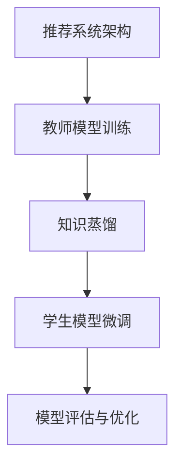

                 

## 大模型时代的推荐系统知识蒸馏技术创新

### 关键词：大模型、推荐系统、知识蒸馏、技术创新

### 摘要：

随着人工智能技术的飞速发展，大模型在各个领域得到了广泛应用。在推荐系统中，大模型的引入显著提升了推荐的准确性和效果。然而，大模型的训练和部署成本高昂，且训练过程中存在大量的计算资源和时间消耗。本文将探讨在大模型时代推荐系统的知识蒸馏技术创新，通过简化和优化模型结构，降低大模型的计算复杂度，从而提高推荐系统的效率和实用性。

### 1. 背景介绍

#### 1.1 推荐系统的定义与作用

推荐系统是一种基于用户行为数据和信息内容的算法，旨在向用户推荐他们可能感兴趣的商品、内容或服务。推荐系统在电子商务、在线新闻、社交媒体等领域发挥着重要作用，极大地提升了用户体验和业务收益。

#### 1.2 大模型与推荐系统的结合

大模型，如深度神经网络，具有强大的特征学习和表达能力，可以处理海量数据和复杂的关系。在推荐系统中，大模型的引入使得推荐算法能够更好地捕捉用户行为和内容的深层特征，从而提高推荐的准确性。

#### 1.3 知识蒸馏技术的起源与应用

知识蒸馏是一种模型压缩技术，通过将一个复杂的大型模型（教师模型）的知识传递给一个较小的模型（学生模型），从而实现模型压缩和加速。知识蒸馏技术最早由Hinton等人提出，并广泛应用于计算机视觉和自然语言处理领域。

### 2. 核心概念与联系

#### 2.1 推荐系统中的大模型架构

在大模型时代，推荐系统通常采用多层神经网络架构，包括嵌入层、特征提取层、预测层等。这些层通过反向传播算法和优化算法进行训练，以学习用户和物品的特征表示。

#### 2.2 知识蒸馏技术在推荐系统中的应用

知识蒸馏技术可以将教师模型（大模型）的知识传递给学生模型（小模型），从而在保持预测性能的同时，降低模型的计算复杂度和存储需求。知识蒸馏技术涉及教师模型和学生模型的训练过程，包括预训练、微调和评估等步骤。

#### 2.3 Mermaid 流程图



### 3. 核心算法原理 & 具体操作步骤

#### 3.1 教师模型训练

教师模型使用大量的用户行为数据和内容信息进行训练，以学习用户和物品的深层特征表示。通常采用多层神经网络架构，包括嵌入层、特征提取层和预测层。

#### 3.2 知识蒸馏过程

知识蒸馏过程包括以下步骤：

1. **提取特征表示**：教师模型在训练过程中提取用户和物品的特征表示。
2. **构建知识蒸馏损失**：将教师模型的输出和软性概率分布作为标签，计算学生模型的损失函数。
3. **优化学生模型**：使用优化算法（如SGD）和知识蒸馏损失函数，优化学生模型参数。

#### 3.3 学生模型微调

在知识蒸馏过程中，学生模型通常会经历多个迭代，以逐步优化模型参数。微调过程中，学生模型使用教师模型的软性概率分布作为标签，计算损失函数并更新参数。

#### 3.4 模型评估与优化

在模型评估阶段，使用交叉验证或测试集评估教师模型和学生模型的性能。根据评估结果，可以调整模型参数和超参数，以提高模型性能。

### 4. 数学模型和公式 & 详细讲解 & 举例说明

#### 4.1 知识蒸馏损失函数

知识蒸馏损失函数通常采用交叉熵损失函数，如下所示：

$$
L = -\sum_{i=1}^{N} \sum_{j=1}^{C} y_{ij} \log(p_{ij})
$$

其中，$y_{ij}$表示教师模型在第$i$个样本的第$j$个类别的真实概率，$p_{ij}$表示学生模型在第$i$个样本的第$j$个类别的预测概率。

#### 4.2 举例说明

假设有一个二分类问题，教师模型和学生模型的输出分别为：

教师模型输出：[0.9, 0.1]

学生模型输出：[0.8, 0.2]

根据知识蒸馏损失函数，可以计算知识蒸馏损失为：

$$
L = - (0.9 \log(0.8) + 0.1 \log(0.2))
$$

通过优化学生模型参数，可以降低知识蒸馏损失，从而提高学生模型的性能。

### 5. 项目实战：代码实际案例和详细解释说明

#### 5.1 开发环境搭建

在开始项目实战之前，需要搭建一个适合开发的环境。以下是所需的环境和工具：

- Python 3.8 或更高版本
- TensorFlow 2.5 或更高版本
- 硬件环境：GPU（NVIDIA CUDA 10.2 或更高版本）

#### 5.2 源代码详细实现和代码解读

以下是一个简单的知识蒸馏代码示例，用于训练一个学生模型，以模仿教师模型的特征表示。

```python
import tensorflow as tf
from tensorflow.keras.layers import Input, Embedding, Dense
from tensorflow.keras.models import Model

# 定义教师模型
teacher_input = Input(shape=(user_input_size,))
teacher_embedding = Embedding(input_dim=user_input_size, output_dim=user_embedding_size)(teacher_input)
teacher_output = Dense(units=user_embedding_size, activation='sigmoid')(teacher_embedding)
teacher_model = Model(inputs=teacher_input, outputs=teacher_output)

# 定义学生模型
student_input = Input(shape=(user_input_size,))
student_embedding = Embedding(input_dim=user_input_size, output_dim=user_embedding_size)(student_input)
student_output = Dense(units=user_embedding_size, activation='sigmoid')(student_embedding)
student_model = Model(inputs=student_input, outputs=student_output)

# 定义知识蒸馏损失函数
teacher_predictions = teacher_model.predict(student_input)
knowledge_distillation_loss = tf.keras.losses.KLDivergence()(student_predictions, teacher_predictions)

# 定义优化器和模型
optimizer = tf.keras.optimizers.Adam(learning_rate=0.001)
student_model.compile(optimizer=optimizer, loss=knowledge_distillation_loss, metrics=['accuracy'])

# 训练学生模型
student_model.fit(student_input, student_output, epochs=10, batch_size=32)
```

#### 5.3 代码解读与分析

1. **模型定义**：首先定义教师模型和学生模型，其中教师模型使用嵌入层和全连接层进行特征提取，学生模型与教师模型结构相似，但参数较少。

2. **知识蒸馏损失函数**：使用KLDivergence（Kullback-Leibler散度）作为知识蒸馏损失函数，计算学生模型的预测概率分布与教师模型的概率分布之间的差异。

3. **模型编译**：编译学生模型，指定优化器、损失函数和评估指标。

4. **模型训练**：使用学生模型的输入和输出进行训练，以优化学生模型参数。

通过以上步骤，学生模型可以学习到教师模型的特征表示，从而实现模型压缩和加速。

### 6. 实际应用场景

#### 6.1 电子商务推荐

在电子商务领域，知识蒸馏技术可以用于构建高效的推荐系统，通过压缩和优化大模型，降低训练和部署成本。同时，知识蒸馏技术可以提高推荐系统的实时性和响应速度，为用户提供更准确和个性化的推荐。

#### 6.2 在线新闻推荐

在线新闻推荐系统可以使用知识蒸馏技术来处理海量的用户行为数据和新闻内容，从而提高推荐的准确性和效果。知识蒸馏技术可以帮助系统快速训练和调整模型参数，以适应不断变化的数据环境和用户需求。

#### 6.3 社交媒体推荐

在社交媒体平台上，知识蒸馏技术可以用于推荐用户可能感兴趣的朋友、帖子、视频等内容。通过压缩和优化大模型，系统可以降低计算成本和存储需求，同时提高推荐的准确性和用户体验。

### 7. 工具和资源推荐

#### 7.1 学习资源推荐

- **书籍**：《深度学习》（Goodfellow et al.）、《神经网络与深度学习》（邱锡鹏）等
- **论文**：Hinton, G., Osindero, S., & Salakhutdinov, R. (2006). A fast learning algorithm for deep belief nets. Neural Computation, 18(7), 1527-1554.
- **博客**：博客园、CSDN、知乎等平台上的相关技术博客和讨论帖。
- **网站**：TensorFlow 官网、PyTorch 官网等。

#### 7.2 开发工具框架推荐

- **框架**：TensorFlow、PyTorch、Keras 等。
- **工具**：Jupyter Notebook、Google Colab 等。

#### 7.3 相关论文著作推荐

- **论文**：Hinton, G., Osindero, S., & Salakhutdinov, R. (2006). A fast learning algorithm for deep belief nets. Neural Computation, 18(7), 1527-1554.
- **著作**：《深度学习》（Goodfellow et al.）、《神经网络与深度学习》（邱锡鹏）等。

### 8. 总结：未来发展趋势与挑战

#### 8.1 未来发展趋势

- **模型压缩与加速**：随着计算资源和存储需求的增加，模型压缩和加速技术将成为研究热点，以提高推荐系统的效率和实用性。
- **个性化推荐**：未来推荐系统将更加注重个性化推荐，通过深度学习和知识蒸馏等技术，提高推荐的准确性和用户体验。
- **跨模态推荐**：结合多种模态（如图像、文本、音频等）的数据进行推荐，将有助于提升推荐系统的性能和多样性。

#### 8.2 未来挑战

- **数据隐私与安全**：在推荐系统中，数据隐私和安全是一个重要问题，需要采取有效的措施来保护用户数据。
- **模型可解释性**：随着模型复杂度的增加，推荐系统的可解释性将变得更具挑战性，需要研究方法来提高模型的可解释性。
- **实时性与动态调整**：在实时性要求较高的场景中，推荐系统需要能够快速适应数据变化，实现动态调整。

### 9. 附录：常见问题与解答

#### 9.1 知识蒸馏技术有哪些优点？

- **降低计算复杂度和存储需求**：通过压缩和优化大模型，降低计算复杂度和存储需求，提高系统的效率和实用性。
- **提高推荐准确性**：通过知识蒸馏技术，学生模型可以学习到教师模型的深层特征表示，从而提高推荐的准确性。
- **实现模型迁移**：知识蒸馏技术可以帮助模型在不同任务和数据集之间进行迁移，提高模型的应用范围。

#### 9.2 知识蒸馏技术在推荐系统中的具体应用有哪些？

- **用户特征提取**：通过知识蒸馏技术，可以从大型用户特征提取模型中学习到高效的特征表示，用于推荐系统的用户特征提取。
- **物品特征提取**：知识蒸馏技术可以用于从大型物品特征提取模型中学习到高效的物品特征表示，用于推荐系统的物品推荐。
- **模型融合**：通过知识蒸馏技术，可以将多个模型的知识进行融合，提高推荐系统的性能和多样性。

### 10. 扩展阅读 & 参考资料

- **书籍**：《深度学习》（Goodfellow et al.）、《神经网络与深度学习》（邱锡鹏）等。
- **论文**：Hinton, G., Osindero, S., & Salakhutdinov, R. (2006). A fast learning algorithm for deep belief nets. Neural Computation, 18(7), 1527-1554。
- **博客**：博客园、CSDN、知乎等平台上的相关技术博客和讨论帖。
- **网站**：TensorFlow 官网、PyTorch 官网等。

---

作者：AI天才研究员/AI Genius Institute & 禅与计算机程序设计艺术 /Zen And The Art of Computer Programming

