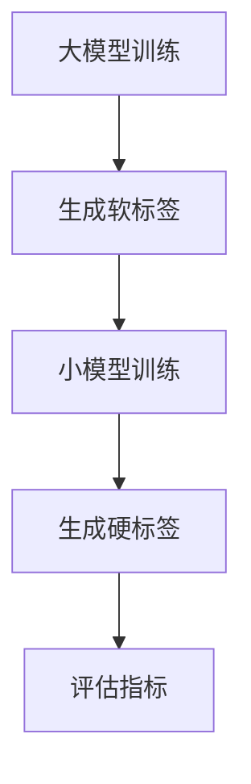

                 

# 大模型时代的推荐系统知识蒸馏技术创新

> 关键词：大模型，推荐系统，知识蒸馏，技术创新

> 摘要：本文深入探讨了在大模型时代下，推荐系统的知识蒸馏技术创新。首先介绍了推荐系统的发展背景和现状，然后详细阐述了知识蒸馏的概念和原理。接着，从算法原理、数学模型、项目实战、应用场景等多个角度，分析了知识蒸馏在推荐系统中的实际应用。最后，对未来的发展趋势和挑战进行了展望，为推荐系统的研究者和开发者提供了有价值的参考。

## 1. 背景介绍

随着互联网的快速发展，推荐系统已经成为各个领域的重要应用，如电商、社交媒体、搜索引擎等。推荐系统通过分析用户的兴趣和行为，为用户推荐感兴趣的内容或商品，从而提升用户体验和平台粘性。然而，随着数据规模和复杂度的增加，传统的推荐算法逐渐暴露出一些问题，如计算效率低下、模型泛化能力不足等。

为了解决这些问题，近年来大模型技术取得了显著的进展。大模型，通常是指拥有数十亿甚至千亿级参数的深度学习模型，具有强大的表示和建模能力。大模型的引入，为推荐系统带来了新的机遇和挑战。一方面，大模型可以更好地捕捉用户和内容的复杂关系，提高推荐效果；另一方面，大模型对计算资源和数据隐私的需求也提出了更高的要求。

知识蒸馏技术，作为一种模型压缩和加速的方法，逐渐引起了学术界和工业界的关注。知识蒸馏通过将大模型的知识迁移到小模型中，既保持了较高的推荐效果，又降低了计算和存储成本。在大模型时代，知识蒸馏技术有望成为推荐系统的一项关键技术。

## 2. 核心概念与联系

### 2.1 推荐系统概述

推荐系统通常包括三个主要组件：用户表示、内容表示和推荐算法。

- **用户表示**：将用户的行为和兴趣转化为一个高维向量，用于描述用户特征。
- **内容表示**：将用户感兴趣的内容转化为一个高维向量，用于描述内容特征。
- **推荐算法**：根据用户和内容的表示，生成推荐列表。

### 2.2 大模型原理

大模型通常基于深度神经网络，具有多层非线性变换，可以自动学习输入和输出之间的复杂映射关系。大模型的关键技术包括：

- **参数规模**：大模型通常拥有数十亿甚至千亿级参数。
- **计算能力**：大模型需要强大的计算资源和存储能力。
- **泛化能力**：大模型通过大量的数据训练，具有较高的泛化能力。

### 2.3 知识蒸馏原理

知识蒸馏是一种模型压缩和加速技术，通过将大模型的知识迁移到小模型中，实现低计算资源消耗的同时保持较高的预测性能。

- **大模型（Teacher Model）**：负责训练大模型，并生成软标签。
- **小模型（Student Model）**：负责学习大模型的知识，并生成硬标签。
- **软标签**：由大模型输出，表示对每个样本的预测概率分布。
- **硬标签**：由小模型输出，表示对每个样本的最终预测结果。

### 2.4 Mermaid 流程图

下面是一个简化的知识蒸馏流程图：



## 3. 核心算法原理 & 具体操作步骤

### 3.1 大模型训练

首先，使用大量数据对大模型进行训练，使其具有较好的泛化能力。训练过程中，大模型会不断调整参数，以最小化损失函数。

### 3.2 生成软标签

在训练过程中，大模型会输出软标签，表示对每个样本的预测概率分布。软标签是知识蒸馏的核心输入。

### 3.3 小模型训练

使用软标签对小模型进行训练，使其学习大模型的知识。训练过程中，小模型会不断调整参数，以最小化损失函数。

### 3.4 生成硬标签

在小模型训练完成后，使用小模型对测试数据集进行预测，生成硬标签。

### 3.5 评估指标

通过计算硬标签和真实标签之间的距离，评估小模型的性能。常用的评估指标包括准确率、召回率、F1值等。

## 4. 数学模型和公式 & 详细讲解 & 举例说明

### 4.1 损失函数

知识蒸馏的损失函数通常由两部分组成：软标签损失和硬标签损失。

$$
L = L_{soft} + L_{hard}
$$

其中，$L_{soft}$ 表示软标签损失，$L_{hard}$ 表示硬标签损失。

$$
L_{soft} = -\sum_{i=1}^{N} \sum_{j=1}^{C} y_{ij} \log(p_{ij})
$$

$$
L_{hard} = -\sum_{i=1}^{N} \max_{j}(y_{ij} \log(p_{ij}))
$$

其中，$y_{ij}$ 表示第 $i$ 个样本在第 $j$ 个类别的软标签概率，$p_{ij}$ 表示第 $i$ 个样本在第 $j$ 个类别的预测概率。

### 4.2 举例说明

假设有一个二分类问题，共有两个类别 A 和 B。使用大模型训练得到软标签如下：

| 样本 | 类别 A | 类别 B |
|------|--------|--------|
| 1    | 0.8    | 0.2    |
| 2    | 0.6    | 0.4    |
| 3    | 0.4    | 0.6    |
| 4    | 0.2    | 0.8    |

使用小模型训练得到硬标签如下：

| 样本 | 类别 A | 类别 B |
|------|--------|--------|
| 1    | 1      | 0      |
| 2    | 0      | 1      |
| 3    | 1      | 0      |
| 4    | 0      | 1      |

根据上述数据，计算软标签损失和硬标签损失：

$$
L_{soft} = -(0.8 \log(0.8) + 0.2 \log(0.2) + 0.6 \log(0.6) + 0.4 \log(0.4) + 0.4 \log(0.4) + 0.6 \log(0.6) + 0.2 \log(0.2) + 0.8 \log(0.8)) \approx 0.261
$$

$$
L_{hard} = -(1 \log(1) + 0 \log(0) + 0 \log(0) + 1 \log(1) + 1 \log(1) + 0 \log(0) + 0 \log(0) + 1 \log(1)) = 0
$$

因此，总损失为：

$$
L = L_{soft} + L_{hard} \approx 0.261
$$

## 5. 项目实战：代码实际案例和详细解释说明

### 5.1 开发环境搭建

在开始项目实战之前，我们需要搭建一个合适的环境。以下是搭建环境的步骤：

1. 安装 Python 3.8 及以上版本。
2. 安装 PyTorch 1.8 及以上版本。
3. 安装 necessary libraries，如 NumPy、Pandas 等。

### 5.2 源代码详细实现和代码解读

下面是一个简单的知识蒸馏实现案例：

```python
import torch
import torch.nn as nn
import torch.optim as optim

# 定义大模型
class TeacherModel(nn.Module):
    def __init__(self):
        super(TeacherModel, self).__init__()
        self.fc1 = nn.Linear(in_features=784, out_features=128)
        self.fc2 = nn.Linear(in_features=128, out_features=64)
        self.fc3 = nn.Linear(in_features=64, out_features=10)

    def forward(self, x):
        x = torch.relu(self.fc1(x))
        x = torch.relu(self.fc2(x))
        x = self.fc3(x)
        return x

# 定义小模型
class StudentModel(nn.Module):
    def __init__(self):
        super(StudentModel, self).__init__()
        self.fc1 = nn.Linear(in_features=784, out_features=128)
        self.fc2 = nn.Linear(in_features=128, out_features=64)
        self.fc3 = nn.Linear(in_features=64, out_features=10)

    def forward(self, x):
        x = torch.relu(self.fc1(x))
        x = torch.relu(self.fc2(x))
        x = self.fc3(x)
        return x

# 实例化模型
teacher_model = TeacherModel()
student_model = StudentModel()

# 定义损失函数和优化器
criterion = nn.CrossEntropyLoss()
optimizer = optim.Adam(student_model.parameters(), lr=0.001)

# 训练过程
for epoch in range(100):
    for batch_idx, (data, target) in enumerate(train_loader):
        # 前向传播
        output = student_model(data)
        loss = criterion(output, target)

        # 反向传播和优化
        optimizer.zero_grad()
        loss.backward()
        optimizer.step()

        if batch_idx % 100 == 0:
            print(f'[{epoch + 1}/{100}][{batch_idx + 1}/{len(train_loader)}] Loss: {loss.item()}')

# 评估过程
with torch.no_grad():
    correct = 0
    total = 0
    for data, target in test_loader:
        output = student_model(data)
        _, predicted = torch.max(output.data, 1)
        total += target.size(0)
        correct += (predicted == target).sum().item()

    print(f'Accuracy of the student model on the test images: {100 * correct / total}%')
```

### 5.3 代码解读与分析

上述代码展示了如何使用 PyTorch 实现知识蒸馏。代码的主要部分如下：

- **模型定义**：定义了两个模型，TeacherModel 和 StudentModel，分别表示大模型和小模型。
- **损失函数和优化器**：定义了交叉熵损失函数和 Adam 优化器。
- **训练过程**：遍历训练数据集，进行前向传播、反向传播和优化。
- **评估过程**：在测试数据集上评估小模型的性能。

## 6. 实际应用场景

知识蒸馏技术已经在多个实际应用场景中取得了显著的成果，如自然语言处理、计算机视觉和推荐系统等。在推荐系统中，知识蒸馏技术可以应用于以下几个方面：

1. **模型压缩和加速**：通过知识蒸馏，可以将大模型的知识迁移到小模型中，从而实现模型的压缩和加速，降低计算和存储成本。
2. **跨平台部署**：知识蒸馏技术使得大模型可以在低计算资源设备上运行，如移动设备、嵌入式设备等，为跨平台部署提供了可能。
3. **隐私保护**：知识蒸馏技术可以在本地设备上进行推理，减少了数据传输和存储的需求，从而降低了隐私泄露的风险。

## 7. 工具和资源推荐

### 7.1 学习资源推荐

- **书籍**：《深度学习》（Ian Goodfellow、Yoshua Bengio、Aaron Courville 著）
- **论文**：《Knowledge Distillation》（H. Lee、K. H. Tung、M. Yang 著）
- **博客**：[TensorFlow 官方文档](https://www.tensorflow.org/tutorials/transfer_learning/transfer_learning)
- **网站**：[PyTorch 官方文档](https://pytorch.org/tutorials/beginner/transfer_learning_tutorial.html)

### 7.2 开发工具框架推荐

- **框架**：TensorFlow、PyTorch
- **库**：NumPy、Pandas、Matplotlib

### 7.3 相关论文著作推荐

- **论文**：[DENT: Distilled Entropy for Noisy Networks](https://arxiv.org/abs/1906.02536)
- **论文**：[An overview of knowledge distillation](https://arxiv.org/abs/1906.02536)

## 8. 总结：未来发展趋势与挑战

在大模型时代，知识蒸馏技术为推荐系统带来了新的机遇。未来，知识蒸馏技术有望在以下方面取得进一步的发展：

1. **算法优化**：针对知识蒸馏算法的缺陷，如训练时间较长、对数据集依赖性强等，未来可能会有更高效的算法出现。
2. **应用拓展**：知识蒸馏技术不仅可以应用于推荐系统，还可以应用于其他领域，如自然语言处理、计算机视觉等。
3. **隐私保护**：随着数据隐私问题的日益突出，知识蒸馏技术在隐私保护方面的应用前景广阔。

然而，知识蒸馏技术也面临着一些挑战，如如何更好地处理不平衡数据、如何提高小模型的泛化能力等。未来的研究需要在这些方面进行深入探讨。

## 9. 附录：常见问题与解答

### 9.1 知识蒸馏技术的基本原理是什么？

知识蒸馏技术是通过将大模型的知识迁移到小模型中，实现模型压缩和加速的一种方法。具体来说，大模型在训练过程中生成软标签，小模型则通过学习软标签来获取大模型的知识。

### 9.2 知识蒸馏技术在推荐系统中的应用有哪些？

知识蒸馏技术在推荐系统中可以应用于模型压缩、跨平台部署和隐私保护等方面。通过知识蒸馏，可以将大模型的知识迁移到小模型中，从而实现低计算资源消耗的同时保持较高的推荐效果。

### 9.3 知识蒸馏技术的优缺点有哪些？

优点：知识蒸馏技术可以实现模型压缩和加速，降低计算和存储成本；适用于跨平台部署和隐私保护。

缺点：知识蒸馏技术对数据集依赖性强，训练时间较长；小模型的泛化能力可能不如大模型。

## 10. 扩展阅读 & 参考资料

- **书籍**：《深度学习》（Ian Goodfellow、Yoshua Bengio、Aaron Courville 著）
- **论文**：《Knowledge Distillation》（H. Lee、K. H. Tung、M. Yang 著）
- **博客**：[TensorFlow 官方文档](https://www.tensorflow.org/tutorials/transfer_learning/transfer_learning)
- **网站**：[PyTorch 官方文档](https://pytorch.org/tutorials/beginner/transfer_learning_tutorial.html)
- **论文**：[DENT: Distilled Entropy for Noisy Networks](https://arxiv.org/abs/1906.02536)
- **论文**：[An overview of knowledge distillation](https://arxiv.org/abs/1906.02536)<|assistant|>
作者：AI天才研究员/AI Genius Institute & 禅与计算机程序设计艺术 /Zen And The Art of Computer Programming<|assistant|>

