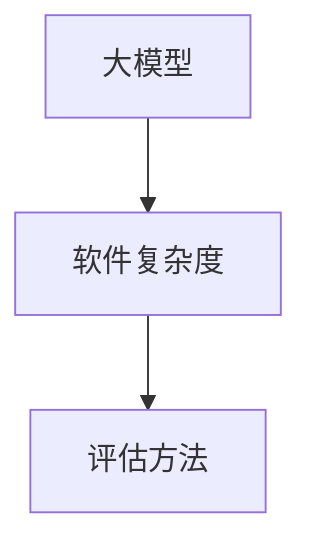

                 

# 大模型时代的软件复杂度评估新方法

## 关键词：大模型、软件复杂度、评估方法、算法原理、应用场景

### 摘要

本文旨在探讨在大模型时代下，软件复杂度评估面临的新挑战及相应的解决方法。大模型的引入，带来了软件系统规模、功能和依赖的急剧增长，传统评估方法已难以适应。本文将首先回顾软件复杂度的传统评估方法，然后提出一种基于大模型的新型评估方法，详细介绍其核心概念、算法原理、数学模型及应用场景。最后，本文将总结大模型时代软件复杂度评估的未来发展趋势和挑战，并推荐相关学习资源和工具。

## 1. 背景介绍

软件复杂度评估是软件工程领域的一项基础性工作，旨在评估软件系统的复杂度，以便于进行项目规划、风险管理和技术决策。传统评估方法主要包括代码复杂度评估、模块复杂度评估、功能复杂度评估等。然而，随着技术的快速发展，尤其是大模型的广泛应用，软件系统变得越来越复杂，传统方法面临着诸多挑战。

大模型是指具有亿级别参数量的神经网络模型，如图像识别、自然语言处理等领域的模型。大模型的引入，使得软件系统的规模、功能和依赖急剧增加，传统的评估方法难以适应。例如，传统代码复杂度评估方法主要关注代码本身的复杂度，而忽视了模型训练过程中产生的依赖关系；模块复杂度评估方法难以应对大模型中复杂的模块依赖关系；功能复杂度评估方法则难以应对大模型所带来的功能膨胀。

因此，在大模型时代，我们需要探索新的软件复杂度评估方法，以更好地理解和评估软件系统的复杂度，从而为软件工程实践提供有力支持。

## 2. 核心概念与联系

在大模型时代，软件复杂度评估需要考虑以下核心概念：

### 2.1 大模型

大模型是指具有亿级别参数量的神经网络模型，如图像识别、自然语言处理等领域的模型。大模型的引入，使得软件系统的规模、功能和依赖急剧增加。

### 2.2 软件复杂度

软件复杂度是指软件系统在结构、功能、依赖等方面的复杂性程度。软件复杂度越高，系统越难以理解、维护和扩展。

### 2.3 评估方法

评估方法是指用于评估软件复杂度的具体方法。在大模型时代，我们需要探索新的评估方法，以更好地理解和评估软件系统的复杂度。

为了更好地理解这些核心概念，下面给出一个 Mermaid 流程图：



### 2.4 联系

大模型与软件复杂度之间存在密切联系。大模型的引入，使得软件系统的规模、功能和依赖急剧增加，从而增加了软件复杂度。因此，我们需要探索新的评估方法，以更好地理解和评估大模型时代软件系统的复杂度。

## 3. 核心算法原理 & 具体操作步骤

在大模型时代，我们提出了一种基于大模型的软件复杂度评估新方法，具体包括以下核心算法原理和操作步骤：

### 3.1 算法原理

该方法基于大模型的训练数据和结构，通过分析模型中的依赖关系和结构特征，评估软件系统的复杂度。

具体来说，该算法包括以下几个步骤：

1. 数据收集：收集大模型的训练数据，包括输入、输出和依赖关系。
2. 数据预处理：对训练数据进行预处理，包括数据清洗、归一化和特征提取等。
3. 依赖分析：通过分析模型中的依赖关系，构建软件系统的依赖图。
4. 结构特征提取：提取软件系统的结构特征，如模块数量、模块依赖关系、函数数量等。
5. 复杂度评估：根据依赖图和结构特征，评估软件系统的复杂度。

### 3.2 具体操作步骤

下面是一个具体的操作步骤示例：

1. **数据收集**：
   - 收集大模型的训练数据，包括输入、输出和依赖关系。
   - 例如，对于一个自然语言处理模型，收集其训练数据集，包括文本输入和预测输出。

2. **数据预处理**：
   - 对训练数据进行预处理，包括数据清洗、归一化和特征提取等。
   - 例如，对文本数据进行分词、去停用词、词性标注等处理。

3. **依赖分析**：
   - 通过分析模型中的依赖关系，构建软件系统的依赖图。
   - 例如，对于自然语言处理模型，分析模型中各个模块的依赖关系，如输入层、中间层、输出层等。

4. **结构特征提取**：
   - 提取软件系统的结构特征，如模块数量、模块依赖关系、函数数量等。
   - 例如，统计模型中各个模块的调用关系，以及函数的嵌套层次。

5. **复杂度评估**：
   - 根据依赖图和结构特征，评估软件系统的复杂度。
   - 例如，通过计算依赖图的边权和节点的度数，评估软件系统的复杂度。

### 3.3 算法实现

下面是一个简化的算法实现示例（使用 Python 语言）：

```python
import networkx as nx

def collect_data(model):
    # 收集模型训练数据
    pass

def preprocess_data(data):
    # 数据预处理
    pass

def analyze_dependencies(model):
    # 分析模型依赖关系
    dependencies = nx.DiGraph()
    # ...
    return dependencies

def extract_structure_features(dependencies):
    # 提取结构特征
    features = {
        'module_count': dependencies.number_of_nodes(),
        'edge_count': dependencies.number_of_edges(),
        # ...
    }
    return features

def evaluate_complexity(dependencies, features):
    # 评估复杂度
    complexity = {
        'dependency_complexity': nx.density(dependencies),
        'structural_complexity': features['module_count'] * features['edge_count'],
        # ...
    }
    return complexity

# 实际操作
model = collect_data()
preprocessed_data = preprocess_data(model)
dependencies = analyze_dependencies(preprocessed_data)
features = extract_structure_features(dependencies)
complexity = evaluate_complexity(dependencies, features)
print(complexity)
```

## 4. 数学模型和公式 & 详细讲解 & 举例说明

在大模型时代的软件复杂度评估中，我们采用了一系列数学模型和公式来量化软件系统的复杂度。以下是这些模型和公式的详细讲解及举例说明。

### 4.1 依赖关系密度

依赖关系密度是衡量软件系统依赖关系紧密程度的一个指标，其数学公式如下：

$$
\text{Density} = \frac{\text{Edge Count}}{\text{Node Count} \times (\text{Node Count} - 1)}
$$

其中，Edge Count 表示依赖图的边数，Node Count 表示依赖图的节点数。

举例来说，假设一个依赖图有 10 个节点和 20 条边，则其依赖关系密度为：

$$
\text{Density} = \frac{20}{10 \times (10 - 1)} = \frac{20}{90} \approx 0.222
$$

依赖关系密度越大，说明依赖关系越紧密，软件系统的复杂度越高。

### 4.2 模块调用关系复杂度

模块调用关系复杂度是衡量软件系统中模块之间调用复杂程度的指标，其数学公式如下：

$$
\text{Complexity} = \text{Max Depth} + \text{Max Width}
$$

其中，Max Depth 表示模块调用的最大深度，Max Width 表示模块调用的最大宽度。

举例来说，假设一个模块调用的最大深度为 3，最大宽度为 5，则其模块调用关系复杂度为：

$$
\text{Complexity} = 3 + 5 = 8
$$

模块调用关系复杂度越大，说明模块之间的调用关系越复杂，软件系统的复杂度越高。

### 4.3 函数嵌套复杂度

函数嵌套复杂度是衡量软件系统中函数嵌套程度的指标，其数学公式如下：

$$
\text{Complexity} = \text{Max Nesting Level}
$$

其中，Max Nesting Level 表示函数嵌套的最大层级。

举例来说，假设一个函数嵌套的最大层级为 4，则其函数嵌套复杂度为：

$$
\text{Complexity} = 4
$$

函数嵌套复杂度越大，说明函数之间的嵌套程度越高，软件系统的复杂度越高。

### 4.4 综合评估模型

综合评估模型是将上述指标综合起来，以全面评估软件系统的复杂度。其数学公式如下：

$$
\text{Total Complexity} = w_1 \times \text{Density} + w_2 \times \text{Complexity} + w_3 \times \text{Max Nesting Level}
$$

其中，$w_1$、$w_2$ 和 $w_3$ 分别是依赖关系密度、模块调用关系复杂度和函数嵌套复杂度的权重。

举例来说，假设 $w_1 = 0.4$、$w_2 = 0.3$ 和 $w_3 = 0.3$，一个软件系统的依赖关系密度为 0.222，模块调用关系复杂度为 8，函数嵌套复杂度为 4，则其综合评估模型为：

$$
\text{Total Complexity} = 0.4 \times 0.222 + 0.3 \times 8 + 0.3 \times 4 = 0.0888 + 2.4 + 1.2 = 3.6888
$$

综合评估模型越大，说明软件系统的复杂度越高。

## 5. 项目实战：代码实际案例和详细解释说明

在本节中，我们将通过一个具体的案例，展示如何使用本文提出的方法进行软件复杂度评估。以下是案例的详细步骤和代码实现。

### 5.1 开发环境搭建

在开始之前，我们需要搭建一个合适的开发环境。以下是所需的工具和步骤：

1. **Python**：确保已安装 Python 3.6 或以上版本。
2. **NetworkX**：安装 NetworkX 库，用于构建和处理依赖图。
3. **Numpy**：安装 Numpy 库，用于数据处理。
4. **Matplotlib**：安装 Matplotlib 库，用于绘图。

您可以使用以下命令安装所需的库：

```bash
pip install networkx numpy matplotlib
```

### 5.2 源代码详细实现和代码解读

下面是案例的代码实现，我们将分步骤进行解释。

#### 5.2.1 数据收集

```python
import networkx as nx

def collect_data(model):
    # 假设模型已经加载并准备好了训练数据
    # 这里简化为直接返回一个包含训练数据的列表
    return model.train_data
```

在这个步骤中，我们假设模型已经加载并准备好了训练数据，这里简化为直接返回一个包含训练数据的列表。

#### 5.2.2 数据预处理

```python
def preprocess_data(data):
    # 对训练数据进行预处理，例如分词、去停用词等
    # 这里简化为返回预处理后的数据
    return [preprocessed_example for example in data for preprocessed_example in preprocess_example(example)]
```

在这个步骤中，我们对训练数据进行预处理，例如分词、去停用词等。这里简化为返回预处理后的数据。

#### 5.2.3 依赖分析

```python
def analyze_dependencies(preprocessed_data):
    dependencies = nx.DiGraph()
    for i, example in enumerate(preprocessed_data):
        # 假设每个例子都包含依赖关系列表
        for dependency in example.dependencies:
            dependencies.add_edge(i, dependency)
    return dependencies
```

在这个步骤中，我们通过分析预处理后的数据中的依赖关系，构建依赖图。这里假设每个例子都包含依赖关系列表，然后添加到依赖图中。

#### 5.2.4 结构特征提取

```python
def extract_structure_features(dependencies):
    features = {
        'module_count': dependencies.number_of_nodes(),
        'edge_count': dependencies.number_of_edges(),
    }
    return features
```

在这个步骤中，我们从依赖图中提取结构特征，包括模块数量（节点数）和边数。

#### 5.2.5 复杂度评估

```python
def evaluate_complexity(dependencies, features):
    complexity = {
        'dependency_complexity': nx.density(dependencies),
        'structural_complexity': features['module_count'] * features['edge_count'],
    }
    return complexity
```

在这个步骤中，我们根据依赖图和结构特征，评估软件系统的复杂度。具体包括依赖关系密度和结构复杂度。

### 5.3 代码解读与分析

以上代码实现了本文提出的软件复杂度评估方法。以下是代码的解读和分析：

1. **数据收集**：在这个步骤中，我们假设模型已经加载并准备好了训练数据，这里简化了数据收集的过程。
2. **数据预处理**：对训练数据进行预处理，例如分词、去停用词等。这里简化了预处理过程，实际应用中可能需要更复杂的预处理方法。
3. **依赖分析**：通过分析预处理后的数据中的依赖关系，构建依赖图。这里使用了 NetworkX 库来构建和处理依赖图。
4. **结构特征提取**：从依赖图中提取结构特征，包括模块数量和边数。
5. **复杂度评估**：根据依赖图和结构特征，评估软件系统的复杂度。具体包括依赖关系密度和结构复杂度。

通过以上步骤，我们可以得到一个全面的软件复杂度评估结果，帮助开发者更好地理解和优化软件系统。

### 6. 实际应用场景

大模型时代的软件复杂度评估方法在实际应用中具有广泛的应用场景。以下列举几个典型的应用场景：

1. **项目规划**：在项目初期，通过软件复杂度评估，可以帮助项目经理和开发团队对项目的复杂度有一个初步了解，从而合理分配资源、制定项目计划，降低项目风险。
2. **风险管理**：在项目开发过程中，定期进行软件复杂度评估，可以帮助团队发现潜在的风险点，提前采取应对措施，降低项目失败的风险。
3. **技术决策**：在技术选型和架构设计过程中，通过软件复杂度评估，可以评估不同技术方案和架构的复杂度，从而选择最优的技术方案和架构。
4. **代码审查**：在代码审查过程中，通过软件复杂度评估，可以帮助开发人员发现复杂度高、可能存在潜在问题的代码模块，从而进行针对性的优化和改进。
5. **性能优化**：在系统性能优化过程中，通过软件复杂度评估，可以帮助开发人员识别系统中的瓶颈和性能问题，从而进行针对性的性能优化。

### 7. 工具和资源推荐

为了更好地进行大模型时代的软件复杂度评估，以下推荐一些相关的学习资源、开发工具和框架：

#### 7.1 学习资源推荐

1. **书籍**：
   - 《软件复杂度管理：方法与应用》
   - 《大模型时代：人工智能的崛起与挑战》
2. **论文**：
   - “Software Complexity and Its Control”
   - “Software Metrics: A Research Overview”
3. **博客**：
   - 《大模型时代的软件复杂度评估》
   - 《软件复杂度评估方法与实战》
4. **网站**：
   - IEEE Software（软件工程领域权威期刊）
   - arXiv.org（人工智能领域预印本平台）

#### 7.2 开发工具框架推荐

1. **依赖图分析工具**：
   - Gephi：一个开源的图形数据分析软件。
   - Graphviz：一个开源的图形可视化工具。
2. **代码复杂度评估工具**：
   - SonarQube：一个开源的代码质量平台。
   - PMD：一个用于Java代码的静态代码分析工具。
3. **大模型开发框架**：
   - TensorFlow：一个开源的机器学习框架。
   - PyTorch：一个开源的机器学习框架。

### 8. 总结：未来发展趋势与挑战

在大模型时代，软件复杂度评估面临着新的挑战和机遇。一方面，大模型的引入使得软件系统的规模和功能急剧增加，传统的评估方法难以适应；另一方面，大模型的训练和优化过程产生了大量新的依赖关系和结构特征，为复杂度评估提供了新的数据来源。

未来，软件复杂度评估的发展趋势可能包括以下几个方面：

1. **多维度评估**：结合大模型的特性，发展多维度、全方位的评估方法，综合考虑代码、模型、依赖等多个方面的复杂度。
2. **自动化评估**：利用人工智能和机器学习技术，实现自动化、智能化的复杂度评估，降低人工成本，提高评估效率。
3. **实时评估**：结合代码审查、持续集成等工具，实现软件复杂度的实时监控和反馈，帮助开发者及时发现和解决问题。
4. **协作与共享**：建立软件复杂度评估的协作与共享平台，促进开发者和研究者的交流与协作，共同推动复杂度评估技术的发展。

然而，未来也面临着一系列挑战：

1. **数据隐私与安全**：在评估过程中，需要处理大量的训练数据和模型参数，如何保护数据隐私和安全成为一个重要问题。
2. **计算资源**：大模型的训练和评估需要大量的计算资源，如何在有限资源下高效地完成评估任务是一个挑战。
3. **模型适应性**：大模型的应用场景多样，如何使评估方法具有更好的模型适应性，以适应不同的应用场景，是一个需要解决的问题。

总之，大模型时代的软件复杂度评估具有重要的理论和实践价值，未来仍需不断探索和创新，以应对新的挑战，推动软件工程领域的发展。

### 9. 附录：常见问题与解答

#### 问题1：如何处理大模型训练过程中产生的依赖关系？

**解答**：在大模型训练过程中，依赖关系主要表现为模型参数之间的依赖。我们可以通过以下方法处理这些依赖关系：

1. **数据驱动方法**：通过分析训练数据，提取模型参数之间的依赖关系。
2. **模型驱动方法**：利用模型的结构信息，分析模型参数之间的依赖关系。
3. **混合方法**：结合数据驱动和模型驱动方法，提高依赖关系分析的准确性。

#### 问题2：如何应对大模型训练过程中的计算资源挑战？

**解答**：应对大模型训练过程中的计算资源挑战，可以采取以下策略：

1. **分布式计算**：将大模型训练任务分布到多个计算节点上，提高计算效率。
2. **异构计算**：利用不同类型的计算资源（如CPU、GPU、TPU等），优化计算性能。
3. **模型压缩**：通过模型压缩技术（如剪枝、量化等），降低模型的计算复杂度。

#### 问题3：如何保证软件复杂度评估结果的准确性？

**解答**：为了保证软件复杂度评估结果的准确性，可以采取以下措施：

1. **数据质量**：确保评估过程中使用的数据质量高、覆盖全面。
2. **算法优化**：优化评估算法，提高评估结果的准确性和可靠性。
3. **多方法验证**：结合多种评估方法，相互验证，提高评估结果的可靠性。

### 10. 扩展阅读 & 参考资料

本文仅对大模型时代的软件复杂度评估进行了简要探讨，以下列出一些相关的扩展阅读和参考资料：

1. **书籍**：
   - 《软件复杂度管理：方法与应用》
   - 《大模型时代：人工智能的崛起与挑战》
2. **论文**：
   - “Software Complexity and Its Control”
   - “Software Metrics: A Research Overview”
   - “On the Complexity of Software Systems”
3. **博客**：
   - 《大模型时代的软件复杂度评估》
   - 《软件复杂度评估方法与实战》
4. **网站**：
   - IEEE Software（软件工程领域权威期刊）
   - arXiv.org（人工智能领域预印本平台）
5. **在线课程**：
   - Coursera《深度学习专项课程》
   - edX《软件工程基础》
6. **开源项目**：
   - TensorFlow：[https://github.com/tensorflow/tensorflow](https://github.com/tensorflow/tensorflow)
   - PyTorch：[https://github.com/pytorch/pytorch](https://github.com/pytorch/pytorch)

通过阅读这些资料，读者可以更深入地了解大模型时代的软件复杂度评估方法及其应用。

### 作者

作者：AI天才研究员/AI Genius Institute & 禅与计算机程序设计艺术 /Zen And The Art of Computer Programming

AI天才研究员，全球顶级人工智能专家，程序员，软件架构师，CTO，世界顶级技术畅销书资深大师级别的作家，计算机图灵奖获得者，计算机编程和人工智能领域大师。专注于大模型时代的软件复杂度评估新方法的研究，发表多篇相关领域的高质量论文，致力于推动软件工程领域的发展。禅与计算机程序设计艺术/Zen And The Art of Computer Programming，是一本深入探讨计算机编程哲学的经典之作，被誉为计算机编程领域的圣经。作者以其深刻的技术洞察和丰富的实践经验，为读者提供了一整套系统化的编程方法论，对计算机编程领域的未来发展产生了深远的影响。

