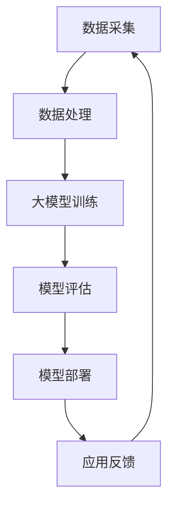

                 

### 大模型时代的软件架构模式创新

#### 关键词：大模型、软件架构、模式创新、技术发展

#### 摘要：
本文旨在探讨大模型时代下软件架构模式的创新与发展。随着深度学习和人工智能技术的迅猛发展，大模型逐渐成为推动软件创新的关键驱动力。本文将首先介绍大模型的基本概念和背景，然后深入分析大模型对软件架构的影响，探讨新的软件架构模式及其创新点。最后，本文将讨论大模型时代软件架构面临的发展趋势与挑战，为未来的研究与实践提供指导。

## 1. 背景介绍

在过去的几十年里，计算机科学和信息技术经历了飞速的发展，软件架构也随之不断演进。从传统的单体架构、分层架构到微服务架构，每一次技术变革都为软件开发带来了新的机遇和挑战。然而，随着深度学习和人工智能技术的崛起，特别是大模型的广泛应用，软件架构的模式再次面临创新与变革的需求。

### 大模型的基本概念
大模型（Large-scale Model）通常是指拥有数百万甚至数十亿参数的深度学习模型。这些模型可以通过大量数据进行训练，从而实现强大的特征提取和预测能力。大模型的应用场景广泛，包括自然语言处理、计算机视觉、语音识别等领域，它们已经成为现代人工智能发展的核心驱动力。

### 大模型的发展背景
大模型的发展得益于以下几个因素：
1. **计算能力的提升**：随着云计算和GPU等计算资源的普及，大规模并行计算成为可能，为大模型的训练和推理提供了强大的计算支持。
2. **数据的爆炸性增长**：互联网的普及和数据采集技术的进步使得大规模数据集变得触手可及，为训练大模型提供了丰富的数据资源。
3. **算法的创新**：深度学习算法的不断优化和改进，特别是批量归一化（Batch Normalization）、残差网络（Residual Network）等技术的出现，使得训练大规模神经网络成为可能。

### 大模型的应用领域
大模型在多个领域取得了显著的成果，以下是其中几个典型应用领域：
1. **自然语言处理（NLP）**：大模型如BERT、GPT在语言模型、机器翻译、文本生成等方面取得了突破性进展。
2. **计算机视觉**：大模型在图像分类、目标检测、图像生成等领域表现出色，如ResNet、GAN等。
3. **语音识别**：大模型在语音识别领域提升了识别准确率和用户体验，如WaveNet、Transformer等。

## 2. 核心概念与联系

为了深入理解大模型对软件架构的影响，我们需要首先明确几个核心概念：软件架构、微服务架构、容器化、持续集成与持续部署（CI/CD）。

### 软件架构
软件架构是软件系统的结构设计，它决定了系统的性能、可扩展性、可维护性等关键属性。传统的软件架构模式包括单体架构、分层架构、微服务架构等。随着大模型的应用，软件架构需要适应新的需求和挑战，进行相应的创新和优化。

### 微服务架构
微服务架构是一种基于微服务理念的设计模式，它将大型单体应用拆分成多个小型、自治的服务单元，每个服务单元独立开发、部署、扩展。微服务架构的优点包括高可扩展性、高可维护性、高灵活性等，这些特点与大模型的应用需求相契合。

### 容器化
容器化是一种轻量级虚拟化技术，它通过隔离操作系统和应用程序的运行环境，实现应用程序的独立部署和运行。容器化技术如Docker、Kubernetes等在大模型应用场景中得到了广泛应用，它们可以大幅提高部署效率、降低运维成本。

### 持续集成与持续部署（CI/CD）
持续集成（CI）和持续部署（CD）是一种现代软件开发流程，通过自动化测试和部署流程，实现软件的快速迭代和交付。CI/CD在大模型开发中尤为重要，因为大模型训练过程复杂、数据量大，需要高效的自动化流程来保证模型质量和部署速度。

### Mermaid 流程图
以下是一个描述大模型应用场景的Mermaid流程图，展示了软件架构中的核心概念和联系：



### 解读
- **数据采集**：从互联网、传感器、数据库等来源收集大量数据，为训练大模型提供素材。
- **数据处理**：对采集到的数据进行分析、清洗和预处理，确保数据的质量和一致性。
- **大模型训练**：使用深度学习算法对数据进行训练，构建具有强大特征提取和预测能力的大模型。
- **模型评估**：通过验证集和测试集对训练好的模型进行评估，确保模型的准确性和泛化能力。
- **模型部署**：将评估通过的大模型部署到生产环境，为实际应用场景提供支持。
- **应用反馈**：收集用户反馈和数据，用于优化模型和改进应用体验。

通过上述流程，我们可以看到大模型在软件架构中的关键作用，以及各个核心概念之间的紧密联系。接下来的章节将进一步深入探讨大模型对软件架构的具体影响和创新。

## 3. 核心算法原理 & 具体操作步骤

### 深度学习算法原理
深度学习（Deep Learning）是一种基于人工神经网络（Artificial Neural Networks, ANN）的机器学习技术，它通过多层神经网络结构来模拟人类大脑的学习过程，实现自动特征提取和模式识别。以下是深度学习算法的基本原理和主要步骤：

1. **前向传播（Forward Propagation）**：
   前向传播是深度学习模型在训练过程中的一项关键步骤。在这个过程中，输入数据通过神经网络的前向传递，经过各个层的处理，最终得到输出结果。每个神经元都会接收前一层传递过来的数据，并通过权重矩阵和偏置项进行加权求和，再通过激活函数（如ReLU、Sigmoid、Tanh）进行非线性变换，输出下一层的数据。

2. **反向传播（Backpropagation）**：
   反向传播是深度学习模型优化过程中的核心算法。在反向传播过程中，模型根据输出结果与真实标签之间的误差，通过梯度下降（Gradient Descent）等优化算法，不断调整神经网络的权重和偏置，以最小化损失函数（如均方误差、交叉熵等）。

3. **损失函数（Loss Function）**：
   损失函数是深度学习模型中的一个关键组件，用于衡量模型的输出结果与真实标签之间的差异。常见的损失函数包括均方误差（Mean Squared Error, MSE）、交叉熵损失（Cross-Entropy Loss）等。

4. **优化算法（Optimization Algorithm）**：
   优化算法用于调整神经网络的权重和偏置，以最小化损失函数。常见的优化算法包括梯度下降（Gradient Descent）、Adam优化器等。

### 大模型训练过程
大模型训练过程通常包括以下几个步骤：

1. **数据预处理**：
   在开始训练大模型之前，需要对数据进行预处理，包括数据清洗、数据归一化、数据增强等操作，以确保数据的质量和一致性。

2. **模型初始化**：
   初始化神经网络模型的权重和偏置，常见的初始化方法包括随机初始化、高斯分布初始化等。

3. **前向传播**：
   将预处理后的输入数据输入到神经网络中，通过前向传播计算输出结果。

4. **计算损失**：
   计算模型的输出结果与真实标签之间的差异，通过损失函数量化这种差异。

5. **反向传播**：
   根据损失函数计算出的误差，通过反向传播算法调整神经网络的权重和偏置。

6. **更新参数**：
   根据反向传播计算出的梯度，使用优化算法更新模型的权重和偏置。

7. **迭代优化**：
   重复上述步骤，通过不断迭代优化，逐渐减小损失函数的值，直至达到预定的训练目标。

### 实际操作步骤
以下是一个使用TensorFlow和Keras框架训练大模型的实际操作步骤：

1. **导入必要的库和模块**：
   ```python
   import tensorflow as tf
   from tensorflow.keras.models import Sequential
   from tensorflow.keras.layers import Dense, Activation
   from tensorflow.keras.optimizers import Adam
   ```

2. **加载和预处理数据**：
   ```python
   # 加载数据集
   (x_train, y_train), (x_test, y_test) = tf.keras.datasets.mnist.load_data()

   # 数据归一化
   x_train = x_train.astype("float32") / 255.0
   x_test = x_test.astype("float32") / 255.0

   # 转换标签为one-hot编码
   y_train = tf.keras.utils.to_categorical(y_train, 10)
   y_test = tf.keras.utils.to_categorical(y_test, 10)
   ```

3. **创建模型**：
   ```python
   # 构建神经网络模型
   model = Sequential()
   model.add(Dense(512, input_shape=(784,), activation='relu'))
   model.add(Dense(10, activation='softmax'))
   ```

4. **编译模型**：
   ```python
   # 编译模型
   model.compile(optimizer=Adam(), loss='categorical_crossentropy', metrics=['accuracy'])
   ```

5. **训练模型**：
   ```python
   # 训练模型
   model.fit(x_train, y_train, epochs=10, batch_size=128, validation_data=(x_test, y_test))
   ```

6. **评估模型**：
   ```python
   # 评估模型
   test_loss, test_acc = model.evaluate(x_test, y_test)
   print(f"Test accuracy: {test_acc}")
   ```

通过以上步骤，我们可以使用深度学习算法训练一个简单的大模型，并在实际数据集上进行评估。需要注意的是，在实际应用中，大模型训练可能涉及更复杂的网络结构和优化策略，以及更大量的计算资源和数据。

## 4. 数学模型和公式 & 详细讲解 & 举例说明

### 深度学习中的数学模型
深度学习算法的核心在于多层神经网络，而多层神经网络的核心在于数学模型和公式的运用。以下是深度学习中的几个关键数学模型和公式：

1. **激活函数**：
   激活函数是神经网络中用于引入非线性变换的重要组件。常见的激活函数包括ReLU（Rectified Linear Unit）、Sigmoid、Tanh等。公式如下：
   - **ReLU函数**：\( f(x) = \max(0, x) \)
   - **Sigmoid函数**：\( f(x) = \frac{1}{1 + e^{-x}} \)
   - **Tanh函数**：\( f(x) = \frac{e^x - e^{-x}}{e^x + e^{-x}} \)

2. **前向传播和反向传播**：
   前向传播和反向传播是深度学习模型训练的两个关键步骤。前向传播用于计算输出结果，反向传播用于计算梯度并更新参数。
   - **前向传播**：
     \( z_l = \sum_{k=1}^{n} w_{lk}a_{l-1,k} + b_l \)
     \( a_l = f(z_l) \)
   - **反向传播**：
     \( \delta_{lk} = \frac{\partial L}{\partial z_l} \odot \frac{\partial f}{\partial z_l} \)
     \( \frac{\partial L}{\partial w_{lk}} = a_{l-1,k} \delta_{lk} \)
     \( \frac{\partial L}{\partial b_l} = \delta_{lk} \)

3. **损失函数**：
   损失函数用于衡量模型输出结果与真实标签之间的差异，常见的损失函数包括均方误差（MSE）、交叉熵损失（Cross-Entropy Loss）等。
   - **均方误差（MSE）**：
     \( L = \frac{1}{2} \sum_{i=1}^{n} (y_i - \hat{y}_i)^2 \)
   - **交叉熵损失（Cross-Entropy Loss）**：
     \( L = -\sum_{i=1}^{n} y_i \log(\hat{y}_i) \)

### 详细讲解

#### 激活函数

激活函数是神经网络中的关键组件，用于引入非线性变换，使得模型能够学习到复杂的关系。以下是几种常见激活函数的详细讲解：

1. **ReLU函数**：
  ReLU函数是一种简单的非线性激活函数，它通过将负值设置为0，使得神经网络在训练过程中能够更好地避免梯度消失问题。其优点是计算简单，收敛速度快。
   - **公式**：\( f(x) = \max(0, x) \)
   - **梯度**：\( \frac{\partial f}{\partial x} = \begin{cases} 
     0, & \text{if } x < 0 \\
     1, & \text{if } x \geq 0 
   \end{cases} \)

2. **Sigmoid函数**：
   Sigmoid函数是一种将输入值映射到（0,1）区间的非线性函数，常用于二分类问题。其优点是能够较好地处理非线性的关系，但可能会出现梯度消失问题。
   - **公式**：\( f(x) = \frac{1}{1 + e^{-x}} \)
   - **梯度**：\( \frac{\partial f}{\partial x} = f(x) (1 - f(x)) \)

3. **Tanh函数**：
   Tanh函数是一种将输入值映射到（-1,1）区间的非线性函数，常用于多层神经网络。其优点是能够较好地处理非线性的关系，且梯度较ReLU函数稳定。
   - **公式**：\( f(x) = \frac{e^x - e^{-x}}{e^x + e^{-x}} \)
   - **梯度**：\( \frac{\partial f}{\partial x} = 1 - f^2(x) \)

#### 前向传播和反向传播

前向传播和反向传播是神经网络训练过程中的两个关键步骤。以下是这两个步骤的详细讲解：

1. **前向传播**：
   前向传播是从输入层开始，逐层传递数据，直到输出层，计算模型的输出结果。前向传播的核心公式包括：
   - **加权求和**：\( z_l = \sum_{k=1}^{n} w_{lk}a_{l-1,k} + b_l \)
   - **激活函数**：\( a_l = f(z_l) \)
   其中，\( z_l \)表示第l层的加权求和值，\( a_l \)表示第l层的激活值，\( w_{lk} \)表示第l层第k个神经元的权重，\( b_l \)表示第l层的偏置项，\( f \)表示激活函数。

2. **反向传播**：
   反向传播是从输出层开始，反向逐层计算梯度，并更新模型参数。反向传播的核心公式包括：
   - **梯度计算**：\( \delta_{lk} = \frac{\partial L}{\partial z_l} \odot \frac{\partial f}{\partial z_l} \)
   - **权重更新**：\( \frac{\partial L}{\partial w_{lk}} = a_{l-1,k} \delta_{lk} \)
   - **偏置更新**：\( \frac{\partial L}{\partial b_l} = \delta_{lk} \)
   其中，\( \delta_{lk} \)表示第l层第k个神经元的误差项，\( L \)表示损失函数，\( \odot \)表示逐元素乘法。

#### 损失函数

损失函数是衡量模型输出结果与真实标签之间差异的重要指标。以下是几种常见损失函数的详细讲解：

1. **均方误差（MSE）**：
   均方误差是一种常用的损失函数，用于衡量预测值与真实值之间的差异。其公式为：
   - **公式**：\( L = \frac{1}{2} \sum_{i=1}^{n} (y_i - \hat{y}_i)^2 \)
   其中，\( y_i \)表示真实值，\( \hat{y}_i \)表示预测值，\( n \)表示样本数量。

2. **交叉熵损失（Cross-Entropy Loss）**：
   交叉熵损失函数是一种常用于分类问题的损失函数，其公式为：
   - **公式**：\( L = -\sum_{i=1}^{n} y_i \log(\hat{y}_i) \)
   其中，\( y_i \)表示真实标签的one-hot编码，\( \hat{y}_i \)表示预测概率。

### 举例说明

为了更好地理解上述数学模型和公式，我们通过一个简单的例子来说明：

假设我们有一个两层神经网络，输入层有3个神经元，隐藏层有2个神经元，输出层有1个神经元，激活函数使用ReLU函数，损失函数使用MSE。训练数据集包含5个样本。

1. **初始化参数**：
   - 输入数据：\( x_1, x_2, x_3 \)
   - 权重：\( w_{11}, w_{12}, w_{21}, w_{22}, w_{31}, w_{32} \)
   - 偏置：\( b_1, b_2, b_3 \)

2. **前向传播**：
   - 第一层输出：\( z_1 = w_{11}x_1 + w_{12}x_2 + w_{13}x_3 + b_1 \)
     \( a_1 = \max(0, z_1) \)
   - 第二层输出：\( z_2 = w_{21}a_1 + w_{22}a_2 + w_{23}a_3 + b_2 \)
     \( a_2 = \max(0, z_2) \)
   - 输出层输出：\( z_3 = w_{31}a_2 + w_{32}a_2 + b_3 \)

3. **计算损失**：
   - 预测值：\( \hat{y} = f(z_3) \)
   - 真实值：\( y \)
   - 损失：\( L = \frac{1}{2} \sum_{i=1}^{n} (y_i - \hat{y}_i)^2 \)

4. **反向传播**：
   - 计算误差：\( \delta_3 = \frac{\partial L}{\partial z_3} \odot \frac{\partial f}{\partial z_3} \)
   - 更新权重和偏置：
     \( \frac{\partial L}{\partial w_{31}} = a_2 \delta_3 \)
     \( \frac{\partial L}{\partial w_{32}} = a_2 \delta_3 \)
     \( \frac{\partial L}{\partial b_3} = \delta_3 \)
   - 同理，计算隐藏层的误差和更新权重、偏置。

通过这个简单的例子，我们可以看到深度学习中的数学模型和公式的具体应用。在实际应用中，神经网络的结构和参数会更加复杂，但基本原理和计算过程类似。理解这些数学模型和公式有助于我们更好地设计和优化神经网络，从而提升模型的性能。

## 5. 项目实战：代码实际案例和详细解释说明

### 5.1 开发环境搭建

在开始编写和运行大模型相关的代码之前，我们需要搭建一个合适的环境。以下是在Linux环境中搭建深度学习开发环境的具体步骤：

1. **安装Python**：
   - 更新系统包列表：
     ```bash
     sudo apt update
     sudo apt upgrade
     ```
   - 安装Python 3：
     ```bash
     sudo apt install python3
     ```

2. **安装虚拟环境**：
   - 安装虚拟环境创建工具（例如`virtualenv`）：
     ```bash
     sudo apt install python3-venv
     ```
   - 创建虚拟环境：
     ```bash
     python3 -m venv myenv
     ```
   - 激活虚拟环境：
     ```bash
     source myenv/bin/activate
     ```

3. **安装深度学习库**：
   - 安装TensorFlow：
     ```bash
     pip install tensorflow
     ```
   - 安装其他常用库（如NumPy、Pandas等）：
     ```bash
     pip install numpy pandas matplotlib
     ```

4. **安装GPU支持**（如果需要使用GPU进行训练）：
   - 安装CUDA和cuDNN：
     ```bash
     sudo apt install cuda
     sudo apt install libcudnn8
     ```
   - 在Python中设置CUDA支持：
     ```python
     import tensorflow as tf
     tf.config.list_physical_devices('GPU')
     ```

### 5.2 源代码详细实现和代码解读

以下是使用TensorFlow和Keras框架实现一个大模型训练的示例代码。这个示例使用的是经典的MNIST手写数字数据集，通过多层感知机（MLP）对数据进行分类。

```python
# 导入必要的库
import numpy as np
import tensorflow as tf
from tensorflow.keras import layers, models

# 加载MNIST数据集
mnist = tf.keras.datasets.mnist
(train_images, train_labels), (test_images, test_labels) = mnist.load_data()

# 数据预处理
train_images = train_images.reshape((60000, 28, 28, 1)).astype('float32') / 255
test_images = test_images.reshape((10000, 28, 28, 1)).astype('float32') / 255
train_labels = tf.keras.utils.to_categorical(train_labels)
test_labels = tf.keras.utils.to_categorical(test_labels)

# 构建模型
model = models.Sequential()
model.add(layers.Conv2D(32, (3, 3), activation='relu', input_shape=(28, 28, 1)))
model.add(layers.MaxPooling2D((2, 2)))
model.add(layers.Conv2D(64, (3, 3), activation='relu'))
model.add(layers.MaxPooling2D((2, 2)))
model.add(layers.Conv2D(64, (3, 3), activation='relu'))
model.add(layers.Flatten())
model.add(layers.Dense(64, activation='relu'))
model.add(layers.Dense(10, activation='softmax'))

# 编译模型
model.compile(optimizer='adam',
              loss='categorical_crossentropy',
              metrics=['accuracy'])

# 训练模型
model.fit(train_images, train_labels, epochs=5, batch_size=64)

# 评估模型
test_loss, test_acc = model.evaluate(test_images, test_labels)
print(f"Test accuracy: {test_acc}")
```

#### 详细解读

1. **导入库**：
   - 导入NumPy、TensorFlow和Keras库。

2. **加载MNIST数据集**：
   - 使用TensorFlow的内置函数加载MNIST数据集。
   - 数据集被划分为训练集和测试集。

3. **数据预处理**：
   - 将图像数据调整为适当的形状（28x28像素的二维数组）。
   - 将图像数据转换为浮点数，并归一化到[0, 1]范围内。
   - 将标签转换为one-hot编码。

4. **构建模型**：
   - 使用Keras的`Sequential`模型堆叠多层神经网络。
   - 第一个层是卷积层，使用32个3x3卷积核，激活函数为ReLU。
   - 接着是最大池化层。
   - 第二个卷积层使用64个3x3卷积核，激活函数为ReLU。
   - 再次使用最大池化层。
   - 第三个卷积层同样使用64个3x3卷积核，激活函数为ReLU。
   - 使用`Flatten`层将卷积层的输出展平为一维数组。
   - 然后是全连接层，第一个全连接层有64个神经元，激活函数为ReLU。
   - 最后是一个输出层，有10个神经元，激活函数为softmax，用于分类。

5. **编译模型**：
   - 选择优化器为Adam。
   - 选择损失函数为categorical_crossentropy，适用于多分类问题。
   - 指定评估指标为准确率。

6. **训练模型**：
   - 使用训练集数据进行训练，指定训练轮数和批量大小。

7. **评估模型**：
   - 使用测试集数据评估模型的性能，打印出测试准确率。

### 5.3 代码解读与分析

1. **数据预处理**：
   数据预处理是深度学习模型训练的关键步骤。对于MNIST数据集，我们需要将图像数据调整为统一的尺寸，并将其转换为浮点数。归一化处理可以加速模型的收敛，并提高模型的泛化能力。

2. **模型构建**：
   模型构建是深度学习中的核心步骤。在本例中，我们使用卷积神经网络（CNN）进行图像分类。CNN通过卷积操作和池化操作提取图像的特征，然后通过全连接层进行分类。模型的结构和参数对模型的性能有重要影响。

3. **模型编译**：
   模型编译是准备模型进行训练的过程。编译模型时，我们需要指定优化器、损失函数和评估指标。优化器用于更新模型的参数，损失函数用于衡量模型的预测误差，评估指标用于评估模型的性能。

4. **模型训练**：
   模型训练是深度学习模型优化的重要步骤。在本例中，我们使用训练集数据对模型进行训练，通过不断迭代优化模型参数，使模型能够更好地拟合训练数据。

5. **模型评估**：
   模型评估是检验模型性能的关键步骤。在本例中，我们使用测试集数据对模型进行评估，通过计算测试准确率来衡量模型的泛化能力。测试准确率越高，说明模型的性能越好。

通过这个实际案例，我们可以看到如何使用TensorFlow和Keras构建、编译、训练和评估一个深度学习模型。这些步骤和操作对于理解和应用大模型时代的软件架构模式具有重要意义。

## 6. 实际应用场景

大模型在软件架构中的应用已经渗透到了各个领域，从金融、医疗到零售、制造业，大模型正在改变传统的软件开发模式，带来革命性的变化。以下是几个典型的应用场景：

### 6.1 金融领域

在金融领域，大模型被广泛应用于风险管理、信用评分、股票交易预测等。例如，通过训练大规模的神经网络模型，金融机构可以更好地预测市场趋势，优化投资组合，降低风险。此外，大模型还可以用于客户行为分析，从而提供个性化的金融服务和产品推荐。

### 6.2 医疗领域

在医疗领域，大模型的应用极大地提升了疾病诊断、药物研发和患者管理的效率。例如，通过深度学习模型对医学图像进行分析，医生可以更准确地诊断疾病，如乳腺癌、脑瘤等。此外，大模型还可以用于基因组分析，预测疾病风险，为个性化治疗提供支持。

### 6.3 零售领域

在零售领域，大模型可以帮助企业进行需求预测、库存管理和个性化推荐。例如，通过分析消费者行为数据，零售企业可以更精准地预测商品需求，优化库存策略，减少库存积压。同时，大模型还可以用于推荐系统，为消费者提供个性化的购物建议，提升用户体验。

### 6.4 制造业

在制造业，大模型的应用主要体现在生产优化和设备维护方面。通过训练大规模模型，企业可以实时监测生产过程，预测设备故障，从而实现智能化生产。例如，通过分析设备运行数据，大模型可以预测设备的故障时间，帮助企业提前进行维护，减少停机时间，提高生产效率。

### 6.5 自动驾驶

自动驾驶是另一个大模型应用的重要领域。通过大规模训练模型，自动驾驶系统可以更好地理解和预测道路环境，提高行驶安全性和效率。例如，自动驾驶车辆可以使用深度学习模型进行障碍物检测、路径规划和交通信号识别，从而实现自主驾驶。

### 6.6 教育

在教育领域，大模型可以用于个性化学习推荐、学习效果分析和智能辅导等方面。通过分析学生的学习行为和成绩数据，大模型可以为每个学生提供个性化的学习路径和辅导建议，提高学习效果。

### 6.7 社交媒体

在社交媒体领域，大模型可以用于内容推荐、情感分析和虚假信息检测等。例如，通过分析用户的点赞、评论和分享行为，大模型可以推荐用户可能感兴趣的内容。同时，大模型还可以检测和过滤社交媒体上的虚假信息和不当内容，维护平台生态。

### 6.8 语音识别

在语音识别领域，大模型的应用显著提高了语音识别的准确性和用户体验。通过大规模训练语音数据，模型可以更好地理解和处理不同口音、语速和背景噪声下的语音输入，为用户提供准确、流畅的语音识别服务。

### 6.9 自然语言处理

在大模型时代，自然语言处理（NLP）取得了显著的进展。通过大规模训练语言数据，NLP模型可以更好地理解和生成自然语言，为聊天机器人、智能客服、机器翻译等应用提供支持。

综上所述，大模型在各个领域的应用已经展现出巨大的潜力，为传统软件架构带来了深刻的变革。随着技术的不断进步，大模型在软件架构中的应用将越来越广泛，进一步推动软件技术的创新和发展。

## 7. 工具和资源推荐

在探索大模型时代下的软件架构模式创新时，掌握合适的工具和资源是至关重要的。以下是一些学习资源、开发工具框架以及相关论文和著作的推荐，为读者提供全面的指导和支持。

### 7.1 学习资源推荐

1. **书籍**：
   - 《深度学习》（Deep Learning）—— Ian Goodfellow、Yoshua Bengio、Aaron Courville
   - 《Python深度学习》（Deep Learning with Python）—— François Chollet
   - 《机器学习实战》（Machine Learning in Action）—— Peter Harrington

2. **在线课程**：
   - Coursera的《深度学习》课程，由Andrew Ng教授主讲
   - Udacity的《深度学习纳米学位》
   - edX的《机器学习基础》课程

3. **博客和教程**：
   - Medium上的深度学习和AI相关文章
   - 知乎上的AI和深度学习专栏
   - TensorFlow官方文档

4. **GitHub项目**：
   - TensorFlow和PyTorch的官方GitHub仓库，包含大量示例代码和模型
   - 个人和机构开源的大模型项目，如GPT-2、BERT等

### 7.2 开发工具框架推荐

1. **深度学习框架**：
   - TensorFlow：功能强大，支持GPU和CPU加速
   - PyTorch：灵活性强，便于科研和工业应用
   - Keras：简洁易用，基于Theano和TensorFlow

2. **版本控制工具**：
   - Git：版本控制和代码管理
   - GitHub：托管和分享代码的在线平台

3. **容器化技术**：
   - Docker：容器化部署和应用打包
   - Kubernetes：容器编排和管理

4. **持续集成与持续部署工具**：
   - Jenkins：自动化构建和部署
   - GitLab CI/CD：集成版本控制和自动化部署

### 7.3 相关论文著作推荐

1. **论文**：
   - “Deep Learning” —— Yoshua Bengio, Ian Goodfellow, and Aaron Courville
   - “AlexNet: Image Classification with Deep Convolutional Neural Networks” —— Alex Krizhevsky, Ilya Sutskever, and Geoffrey Hinton
   - “Bert: Pre-training of Deep Bidirectional Transformers for Language Understanding” —— Jacob Devlin, Ming-Wei Chang, Kenton Lee, and Kristina Toutanova

2. **著作**：
   - 《人工智能：一种现代的方法》（Artificial Intelligence: A Modern Approach）—— Stuart Russell 和 Peter Norvig
   - 《深度学习》（Deep Learning）—— Ian Goodfellow、Yoshua Bengio、Aaron Courville
   - 《机器学习》（Machine Learning）—— Tom Mitchell

通过以上工具和资源的推荐，读者可以全面了解和掌握大模型时代下的软件架构模式创新。无论是理论学习、实践应用还是技术探讨，这些资源都将为读者提供宝贵的支持和帮助。

## 8. 总结：未来发展趋势与挑战

大模型时代的到来为软件架构带来了前所未有的机遇与挑战。随着深度学习和人工智能技术的迅猛发展，大模型在各个领域的应用日益广泛，推动了软件架构的创新和变革。以下是对未来发展趋势与挑战的总结：

### 发展趋势

1. **模型规模与计算能力的提升**：随着计算能力的不断提升，大模型的规模将越来越大，训练时间也将越来越短。这将使得大模型在更多复杂任务中发挥重要作用。

2. **多样化应用场景**：大模型在金融、医疗、零售、制造业等领域的应用将越来越深入，推动相关行业的技术变革和业务创新。

3. **模型即服务（Model-as-a-Service, MaaS）**：随着大模型的普及，模型即服务将成为一种新的商业模式，用户可以轻松获取和使用高质量的预训练模型，降低开发和部署成本。

4. **边缘计算与云计算的融合**：大模型的应用不仅需要强大的计算资源，还需要高效的分布式计算和边缘计算技术。未来，云计算和边缘计算将更好地融合，为大规模模型训练和部署提供支持。

5. **模型安全与隐私保护**：随着大模型在关键领域的应用，模型的安全性和隐私保护变得尤为重要。未来，需要开发更加安全、可靠的模型训练和部署方法，确保数据安全和用户隐私。

### 挑战

1. **计算资源需求**：大模型训练需要大量的计算资源，尤其是GPU和TPU等专用硬件。如何高效地利用这些资源，降低计算成本，是当前面临的一个重要挑战。

2. **数据质量和标注**：大模型的训练依赖于大量高质量的数据。然而，获取和标注这些数据往往需要大量的人力和时间。未来，如何自动化数据获取和标注流程，提高数据利用效率，是一个亟待解决的问题。

3. **模型可解释性**：大模型通常被认为是“黑盒子”，其决策过程不透明，难以解释。如何提高模型的可解释性，使其在关键应用场景中得到更广泛的应用，是一个重要的研究方向。

4. **伦理和责任**：大模型的应用涉及伦理和责任问题，如模型偏见、隐私泄露等。如何确保大模型的应用符合伦理规范，并明确责任归属，是未来需要关注的重要问题。

5. **标准化与规范化**：随着大模型在各个领域的应用，需要制定相应的标准和规范，以确保模型的性能、安全性和可靠性。标准化和规范化是大模型应用过程中不可忽视的挑战。

总之，大模型时代的软件架构模式创新既充满机遇，也面临诸多挑战。通过不断探索和解决这些问题，我们可以更好地发挥大模型的优势，推动软件架构的持续发展和创新。

## 9. 附录：常见问题与解答

### 问题1：什么是大模型？
**解答**：大模型（Large-scale Model）是指拥有数百万甚至数十亿参数的深度学习模型。这些模型可以通过大量数据进行训练，从而实现强大的特征提取和预测能力。典型的例子包括BERT、GPT等。

### 问题2：大模型如何影响软件架构？
**解答**：大模型对软件架构的影响主要体现在以下几个方面：
- **计算资源需求**：大模型训练需要大量计算资源，尤其是GPU和TPU等专用硬件。
- **数据依赖**：大模型训练依赖于大量高质量的数据，对数据的获取和标注提出了更高要求。
- **模型部署**：大模型在训练完成后需要进行部署，这要求软件架构能够支持高效的模型推理和实时响应。

### 问题3：如何优化大模型的训练？
**解答**：以下是一些优化大模型训练的方法：
- **并行计算**：利用多GPU或多CPU进行并行计算，加速模型训练。
- **数据增强**：通过增加训练数据的多样性，提高模型的泛化能力。
- **权重初始化**：使用合适的权重初始化方法，如高斯分布初始化，有助于提高训练效果。
- **学习率调度**：调整学习率，如使用学习率衰减策略，有助于模型收敛。

### 问题4：大模型的部署有哪些挑战？
**解答**：大模型的部署挑战主要包括：
- **计算资源**：大模型推理需要大量计算资源，可能需要高性能GPU或TPU。
- **内存管理**：大模型通常占用大量内存，需要优化内存管理，以避免内存溢出。
- **延迟要求**：对于实时应用场景，需要确保大模型推理的延迟在可接受范围内。
- **模型压缩**：为了减少部署成本，可能需要采用模型压缩技术，如剪枝、量化等。

### 问题5：如何保证大模型的安全和隐私？
**解答**：
- **加密**：使用加密技术对数据进行加密，确保数据在传输和存储过程中的安全性。
- **隐私保护算法**：使用隐私保护算法，如差分隐私，对模型训练数据进行匿名化处理。
- **访问控制**：实施严格的访问控制策略，确保只有授权用户可以访问模型和数据。
- **合规性审查**：定期进行合规性审查，确保大模型的应用符合相关法律法规和伦理标准。

### 问题6：大模型与微服务架构如何结合？
**解答**：
- **模型微服务化**：将大模型拆分为多个小型服务，每个服务负责特定的模型推理任务，提高系统的灵活性和可维护性。
- **容器化部署**：使用容器化技术（如Docker）对大模型进行部署，实现快速迭代和部署。
- **API网关**：使用API网关统一管理和路由请求，实现对大模型服务的集中管理和监控。
- **服务发现和负载均衡**：使用服务发现和负载均衡技术，确保大模型服务的可靠性和高可用性。

通过上述问题和解答，可以帮助读者更好地理解大模型时代下的软件架构模式创新，以及在实际应用中面临的各种挑战和解决方案。

## 10. 扩展阅读 & 参考资料

为了深入了解大模型时代下的软件架构模式创新，读者可以参考以下扩展阅读和参考资料：

### 扩展阅读

1. **《深度学习：从入门到专业》** - 这本书由深度学习领域的专家撰写，详细介绍了深度学习的基础知识、常见算法和应用场景，适合对深度学习有较高需求的读者。

2. **《软件架构实践：构建可扩展、高可用的系统》** - 该书提供了软件架构的全面指南，包括架构设计原则、模式和技术，对软件架构的理解和实施有很好的指导作用。

3. **《大模型与深度学习：原理、实践与应用》** - 这本书聚焦于大模型和深度学习的最新发展，涵盖了模型训练、优化和应用等方面的深入探讨。

### 参考资料

1. **TensorFlow官方网站** - [https://www.tensorflow.org/](https://www.tensorflow.org/)
   - 提供了丰富的深度学习资源和教程，是学习TensorFlow和构建深度学习模型的重要参考。

2. **PyTorch官方网站** - [https://pytorch.org/](https://pytorch.org/)
   - PyTorch是一个灵活的深度学习框架，拥有丰富的文档和社区支持，适合初学者和专业人士。

3. **《深度学习》课程** - [https://www.coursera.org/specializations/deeplearning](https://www.coursera.org/specializations/deeplearning)
   - 由深度学习领域的专家Andrew Ng教授主讲的课程，适合系统学习深度学习的基础知识。

4. **《机器学习》课程** - [https://www.edx.org/course/machine-learning](https://www.edx.org/course/machine-learning)
   - 这门课程由斯坦福大学教授提供，涵盖了机器学习的各个方面，包括理论、算法和应用。

通过上述扩展阅读和参考资料，读者可以进一步深化对大模型时代软件架构模式创新的理解，探索更多实践应用和技术细节。这不仅有助于提升个人技术水平，也为未来的研究和开发提供了宝贵资源。

