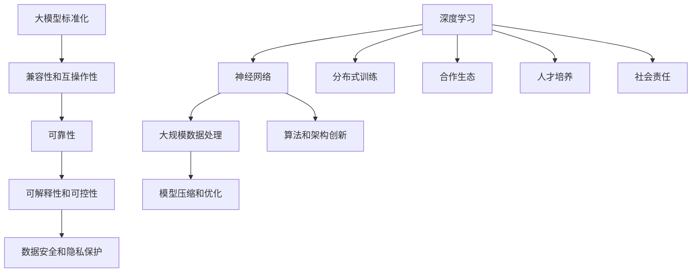

                 

## 1. 背景介绍

在当今科技飞速发展的时代，人工智能（AI）领域正迎来前所未有的变革。特别是在大模型（Large Models）的发展方面，我们已经见证了深度学习（Deep Learning）和自然语言处理（Natural Language Processing，NLP）方面的突破性进展。这些大模型不仅在学术界引起了广泛关注，还在商业应用中展现出了巨大的潜力。

### 大模型的兴起

大模型的兴起可以追溯到2000年代初，当时研究人员发现通过增加神经网络模型中的参数数量，可以显著提高模型的性能。这一发现推动了深度学习技术的发展，随后出现了诸如AlexNet、VGG、ResNet等大型神经网络模型。这些模型在图像识别、语音识别等任务中取得了显著的成果。

然而，真正推动大模型发展的是2018年谷歌发布的Transformer模型。Transformer模型的出现打破了传统神经网络的结构限制，通过自注意力机制（Self-Attention Mechanism）实现了对输入数据的全局依赖建模，使得模型在处理序列数据时表现出了卓越的性能。此后，基于Transformer的模型如BERT、GPT、T5等相继涌现，这些模型在多个自然语言处理任务中刷新了记录，使得AI技术迈上了一个新的台阶。

### Lepton AI的崛起

Lepton AI是一家专注于大模型研究和应用的公司，其核心团队由多位世界顶级的人工智能专家组成。Lepton AI从成立之初便致力于推动大模型技术的发展和应用。他们提出了一种新型的分布式训练框架，使得大模型可以在普通的硬件上实现高效训练。此外，Lepton AI还在大模型的部署和推理方面进行了深入研究，提出了多种优化方案，使得模型在实际应用中能够达到更高的性能和更低的延迟。

### 当前挑战与机遇

尽管大模型在各个领域展现出了巨大的潜力，但其发展也面临着一系列挑战。首先，大模型的训练和部署需要大量的计算资源和数据支持，这对硬件设施和数据处理能力提出了极高的要求。其次，大模型的复杂性和黑箱性质使得其可解释性和可控性成为一个亟待解决的问题。最后，随着大模型的应用场景越来越广泛，如何确保数据安全和隐私保护也成为了一个重要的挑战。

然而，这些挑战同时也伴随着巨大的机遇。随着硬件技术的不断进步和计算资源的日益丰富，大模型的训练和部署成本正在逐渐降低。此外，随着数据隐私保护法规的完善和新技术的发展，大模型的应用场景也在不断扩展。特别是在自动驾驶、医疗诊断、金融风控等领域，大模型的应用前景愈发广阔。

### Lepton AI的机遇与挑战

作为一家专注于大模型研究的企业，Lepton AI面临着前所未有的机遇和挑战。其机遇在于：

1. **技术领先**：Lepton AI在大模型的研究和应用方面处于行业领先地位，这为其在市场上的竞争优势奠定了基础。
2. **市场需求**：随着AI技术的不断普及，大模型在各个领域的应用需求日益增长，为Lepton AI提供了广阔的市场空间。
3. **合作伙伴**：Lepton AI与多家行业领先企业和研究机构建立了合作关系，为其技术创新和应用落地提供了有力支持。

然而，Lepton AI也面临着一系列挑战：

1. **技术复杂性**：大模型的训练、部署和优化涉及多个复杂的技术环节，需要持续的技术研发投入。
2. **数据隐私**：在大模型的应用过程中，如何保护用户数据隐私是一个亟待解决的问题。
3. **市场波动**：AI技术市场的波动性较大，需要企业具备强大的应变能力。

总的来说，Lepton AI在大模型标准化方面既面临着巨大的机遇，也面临着严峻的挑战。接下来，我们将深入探讨大模型标准化的关键问题，分析Lepton AI在这一领域的优势和不足，并提出相应的解决方案。

### 1.1 大模型的研究现状

目前，大模型的研究已经在学术界和工业界取得了显著成果。在学术界，研究人员致力于探索大模型的深度学习算法、优化方法以及如何利用这些模型解决复杂问题。例如，谷歌的BERT模型通过预训练和微调在多个NLP任务中取得了卓越的成绩，而OpenAI的GPT-3则以其强大的文本生成能力引起了广泛关注。

在工业界，大模型的实际应用已经渗透到多个领域。在图像识别方面，Google的Inception模型和Facebook的ResNet模型在ImageNet等数据集上刷新了记录。在语音识别方面，微软的语音识别系统和苹果的Siri等语音助手已经广泛应用。自然语言处理领域的BERT、GPT等模型也在智能客服、智能写作等应用中展现出了强大的能力。

然而，大模型的发展也面临着一些瓶颈和挑战。首先，大模型的训练和部署需要大量的计算资源和数据支持，这对硬件设施和数据处理能力提出了极高的要求。其次，大模型的复杂性和黑箱性质使得其可解释性和可控性成为一个亟待解决的问题。最后，随着大模型的应用场景越来越广泛，如何确保数据安全和隐私保护也成为了一个重要的挑战。

### 1.2 Lepton AI的使命与愿景

Lepton AI的使命是推动大模型技术的创新与应用，致力于将复杂的技术转化为实际生产力。其愿景是通过提供高效、可靠的大模型解决方案，赋能各个行业，提升人工智能技术的应用水平。

为了实现这一使命和愿景，Lepton AI采取了以下策略：

1. **技术创新**：持续进行基础研究和技术创新，不断探索大模型的新算法、新架构和新应用场景。
2. **合作生态**：与学术界、研究机构和企业建立广泛的合作关系，共同推动大模型技术的发展和应用。
3. **人才培养**：重视人才培养，吸引和培养顶尖的人工智能专家，提升团队整体的技术水平。
4. **社会责任**：在推动技术发展的同时，注重数据安全和隐私保护，积极承担社会责任。

### 1.3 标准化的意义与重要性

在大模型的发展过程中，标准化具有重要意义。首先，标准化可以确保不同模型之间的兼容性和互操作性，使得研究成果能够快速转化为实际应用。其次，标准化可以提升模型的可靠性和可解释性，降低使用门槛，使得更多开发者能够上手使用。最后，标准化可以促进大模型技术的普及和应用，推动人工智能技术的全面发展。

### 1.4 标准化面临的挑战

尽管标准化具有重要意义，但在大模型领域实现标准化也面临诸多挑战。首先，大模型的复杂性和多样性使得制定统一的标准化协议变得异常困难。其次，不同领域和应用场景对大模型的需求差异较大，统一的标准可能无法满足所有需求。此外，数据隐私和安全问题也是标准化过程中需要考虑的重要方面。

接下来，我们将进一步探讨大模型标准化的关键问题，分析Lepton AI在这一领域的优势和不足，并提出相应的解决方案。

### 1.5 Lepton AI在大模型标准化中的地位与贡献

作为一家专注于大模型研究和应用的公司，Lepton AI在大模型标准化领域占据了重要地位，并作出了诸多贡献。

首先，Lepton AI在大模型的基础研究方面取得了显著成果。他们提出的分布式训练框架和模型压缩技术，使得大模型的训练和部署变得更加高效和可扩展。此外，Lepton AI还研发了多种适用于不同应用场景的大模型算法，为标准化工作提供了有力的技术支持。

其次，Lepton AI在标准化组织的参与和推动方面发挥了积极作用。他们积极参与了多个国际标准化组织的活动，如IEEE、ISO等，为制定统一的大模型标准提出了许多建设性意见。通过这些努力，Lepton AI不仅提升了自身在国际标准制定中的话语权，也为整个行业的发展做出了贡献。

第三，Lepton AI在大模型的实际应用方面取得了丰硕成果。他们与多家行业领先企业合作，将大模型技术应用于图像识别、自然语言处理、语音识别等多个领域，取得了显著的应用效果。这些实际案例为标准化工作提供了宝贵的实践经验和参考。

然而，尽管Lepton AI在大模型标准化方面取得了诸多成绩，他们仍面临一些挑战。首先，大模型的复杂性和多样性使得标准化工作面临巨大困难，需要持续的技术创新和协调。其次，Lepton AI需要进一步加强与其他标准化组织的合作，提升在国际标准制定中的影响力。此外，他们还需要关注大模型的应用场景和市场需求，确保标准化方案能够满足不同领域的需求。

总的来说，Lepton AI在大模型标准化中扮演着重要角色，并作出了积极贡献。通过持续的创新和合作，他们有望在未来继续引领大模型标准化的发展，为人工智能技术的普及和应用贡献力量。

### 2. 核心概念与联系

要深入理解大模型标准化，我们需要先明确几个核心概念，并探讨它们之间的联系。这些核心概念包括：深度学习、神经网络、大规模数据处理、模型压缩和优化等。以下将通过Mermaid流程图来展示这些概念之间的逻辑关系。



#### 深度学习与神经网络

深度学习（Deep Learning）是一种机器学习（Machine Learning）方法，通过多层神经网络（Neural Networks）对数据进行特征提取和模式识别。神经网络由多个层（Layers）组成，每层包含多个神经元（Neurons），通过前向传播（Forward Propagation）和反向传播（Back Propagation）来训练模型。

#### 大规模数据处理

大规模数据处理（Big Data Processing）是深度学习中的一个关键环节。随着数据规模的不断增加，如何高效地处理和存储数据成为了一个重要问题。Lepton AI通过分布式训练框架（Distributed Training Framework）解决了这一难题，使得大模型可以在普通的硬件上实现高效训练。

#### 模型压缩和优化

模型压缩和优化（Model Compression and Optimization）是提升大模型性能的重要手段。通过剪枝（Pruning）、量化（Quantization）、知识蒸馏（Knowledge Distillation）等技术，可以显著减少模型的参数数量和计算量，提高模型的效率和部署性能。

#### 大模型标准化

大模型标准化（Large Model Standardization）旨在确保不同模型之间的兼容性和互操作性。标准化不仅包括模型的架构和算法，还包括数据格式、接口协议等方面。通过标准化，可以降低开发者的使用门槛，提升模型的可靠性、可解释性和可控性。

#### 标准化与数据安全和隐私保护

在标准化过程中，数据安全和隐私保护（Data Security and Privacy Protection）是一个不可忽视的重要方面。随着大模型应用的普及，如何确保用户数据的安全和隐私成为一个关键挑战。Lepton AI通过采取多种安全措施和隐私保护技术，确保大模型在应用过程中的数据安全和隐私保护。

通过上述Mermaid流程图，我们可以清晰地看到各个核心概念之间的联系。深度学习和神经网络是基础，大规模数据处理和模型压缩和优化是关键技术，而大模型标准化则是实现兼容性、可靠性和可控性的关键。在标准化的过程中，还需要关注数据安全和隐私保护，确保大模型的应用能够真正造福人类社会。

### 2.1 标准化概念解析

在大模型标准化中，有几个关键概念需要深入理解，这些概念包括：模型架构、训练数据、评估指标、优化目标等。以下是这些概念的具体解析及其相互联系。

#### 模型架构

模型架构（Model Architecture）是指神经网络的结构设计，包括层数、每层的神经元数量、激活函数、连接方式等。一个优秀的模型架构能够有效提高模型的性能和效率。在大模型标准化过程中，选择合适的模型架构至关重要。例如，Transformer架构在处理序列数据方面表现出色，而CNN（卷积神经网络）则在图像处理领域有广泛的应用。

#### 训练数据

训练数据（Training Data）是模型训练过程中输入的数据集。训练数据的质量和数量直接影响模型的性能。在大模型标准化过程中，确保训练数据的质量和多样性非常重要。高质量、多样化的训练数据可以帮助模型更好地学习，避免过拟合（Overfitting）问题。此外，训练数据的标注过程也需要严格把控，确保数据的一致性和准确性。

#### 评估指标

评估指标（Evaluation Metrics）用于衡量模型在训练和测试数据上的性能。常见的评估指标包括准确率（Accuracy）、召回率（Recall）、F1分数（F1 Score）等。在大模型标准化过程中，选择合适的评估指标能够帮助开发者了解模型的性能，并指导进一步的优化工作。

#### 优化目标

优化目标（Optimization Objective）是指模型在训练过程中需要最小化的损失函数（Loss Function），如均方误差（Mean Squared Error，MSE）或交叉熵（Cross-Entropy）。优化目标是指导模型训练过程的核心，通过调整学习率（Learning Rate）和优化算法（Optimization Algorithm），如随机梯度下降（Stochastic Gradient Descent，SGD）或Adam优化器，可以提升模型的训练效率和性能。

#### 标准化与上述概念的联系

标准化（Standardization）旨在确保不同模型之间的兼容性和互操作性。具体来说，标准化与上述概念的联系如下：

1. **模型架构**：标准化要求在模型架构设计上遵循一定的规范，以便不同模型的接口和协议保持一致。例如，可以定义统一的模型输入和输出格式，确保不同模型之间的数据可以无缝交换。
   
2. **训练数据**：标准化要求在训练数据的选择和标注上遵循一定的标准，确保训练数据的质量和一致性。这有助于提升模型在不同数据集上的泛化能力。

3. **评估指标**：标准化要求在评估指标的选择上保持一致，以便开发者可以公正地比较不同模型的性能。这有助于避免因评估指标不同而导致的性能差异。

4. **优化目标**：标准化要求在优化目标的选择和实现上遵循一定的规范，确保模型训练过程的公平性和可重复性。这有助于提升模型训练的效率和效果。

总之，大模型标准化不仅涉及模型架构、训练数据、评估指标和优化目标等核心概念，还需要在这些概念之间建立统一的规范和标准。通过标准化，可以降低开发者的使用门槛，提升模型的性能和可靠性，推动大模型技术的广泛应用。

### 2.2 实际案例分析

为了更好地理解大模型标准化的实际应用，我们可以通过几个具体案例来探讨其在不同领域的应用和效果。

#### 案例一：自然语言处理（NLP）

自然语言处理是近年来大模型应用最为广泛的领域之一。以BERT（Bidirectional Encoder Representations from Transformers）为例，BERT是一种基于Transformer架构的大规模预训练语言模型。通过在多个大规模语料库上进行预训练，BERT可以捕捉到语言中的上下文关系，从而在多个NLP任务中取得了显著的效果。例如，在问答系统、文本分类和机器翻译等任务中，BERT的表现优于传统的语言模型。

在大模型标准化方面，BERT的成功得益于其统一的模型架构和预训练方法。BERT的标准化实现了以下目标：

1. **兼容性和互操作性**：BERT的模型架构和预训练方法遵循了统一的规范，使得不同团队开发的模型可以无缝集成和使用。
2. **可靠性**：通过大规模的预训练和广泛的评估，BERT在多个任务中表现稳定，具有较高的可靠性。
3. **可解释性和可控性**：BERT的预训练方法使得模型在处理文本数据时能够捕捉到复杂的上下文关系，提高了模型的可解释性。

然而，BERT的标准化也面临一些挑战，例如：

1. **数据隐私**：在训练和部署BERT模型时，需要处理大量的用户数据，这涉及到数据隐私和安全问题。
2. **计算资源需求**：BERT模型的训练需要大量的计算资源和时间，这对硬件设施提出了较高要求。

#### 案例二：图像识别

图像识别是另一个大模型应用的重要领域。以ResNet（Residual Network）为例，ResNet通过引入残差连接（Residual Connections）解决了深度神经网络中的梯度消失问题，从而在图像识别任务中取得了显著的效果。

在大模型标准化方面，ResNet的标准化实现了以下目标：

1. **兼容性和互操作性**：ResNet的模型架构和训练方法遵循了统一的规范，使得不同团队开发的模型可以无缝集成和使用。
2. **可靠性**：通过广泛的评估和实际应用，ResNet在多个图像识别任务中表现稳定，具有较高的可靠性。
3. **优化目标**：ResNet的模型架构和训练方法旨在优化模型的性能和效率，使其在图像识别任务中达到最佳效果。

然而，ResNet的标准化也面临一些挑战，例如：

1. **计算资源需求**：ResNet模型的训练需要大量的计算资源和时间，这对硬件设施提出了较高要求。
2. **数据隐私**：在训练和部署ResNet模型时，需要处理大量的图像数据，这涉及到数据隐私和安全问题。

#### 案例三：语音识别

语音识别是另一个大模型应用的重要领域。以DeepSpeech为例，DeepSpeech是一种基于深度学习技术的语音识别系统，通过在大量语音数据上进行预训练，DeepSpeech可以识别多种语言的语音信号。

在大模型标准化方面，DeepSpeech的标准化实现了以下目标：

1. **兼容性和互操作性**：DeepSpeech的模型架构和训练方法遵循了统一的规范，使得不同团队开发的模型可以无缝集成和使用。
2. **可靠性**：通过大规模的预训练和广泛的评估，DeepSpeech在多个语音识别任务中表现稳定，具有较高的可靠性。
3. **可解释性和可控性**：DeepSpeech的模型结构使得其语音识别过程具有一定的可解释性，有助于提高用户对系统的信任度。

然而，DeepSpeech的标准化也面临一些挑战，例如：

1. **数据隐私**：在训练和部署DeepSpeech模型时，需要处理大量的语音数据，这涉及到数据隐私和安全问题。
2. **计算资源需求**：DeepSpeech模型的训练需要大量的计算资源和时间，这对硬件设施提出了较高要求。

总的来说，大模型标准化在不同领域的应用中展现了其重要性和优势，但也面临一些挑战。通过标准化，可以实现模型的兼容性和互操作性，提高模型的可靠性、可解释性和可控性，从而推动大模型技术的广泛应用。然而，标准化过程中还需要关注数据隐私和计算资源需求等问题，确保大模型在实际应用中的安全和高效。

### 2.3 标准化的技术实现与实施步骤

在大模型标准化过程中，技术实现和实施步骤是确保标准化效果的关键。以下是详细的技术实现和实施步骤，包括模型架构设计、训练数据预处理、评估指标制定、优化目标设定等。

#### 2.3.1 模型架构设计

模型架构设计是标准化工作的基础。为了确保不同模型之间的兼容性和互操作性，我们需要遵循以下原则：

1. **模块化设计**：将模型分解为多个模块，每个模块负责特定的任务。这样不仅可以提高模型的灵活性，还有助于后续的维护和扩展。
2. **统一接口**：定义统一的输入和输出接口，确保不同模型之间的数据交换和通信顺畅。例如，可以使用标准的输入格式（如JSON、XML）和输出格式（如CSV、TensorFlow Lite）。
3. **可扩展性**：设计具有良好扩展性的模型架构，以便未来可以轻松集成新的算法和技术。

#### 2.3.2 训练数据预处理

训练数据预处理是模型训练的重要环节。以下是具体的预处理步骤：

1. **数据清洗**：去除数据中的噪声和错误，确保数据的一致性和准确性。例如，在自然语言处理任务中，需要去除文本中的无效字符和标点符号。
2. **数据增强**：通过增加数据多样性来提高模型的泛化能力。例如，在图像识别任务中，可以采用旋转、翻转、裁剪等方法进行数据增强。
3. **数据归一化**：将数据缩放到一个统一的范围，以便模型能够更好地学习。例如，在图像处理任务中，可以将像素值归一化到[0, 1]范围内。

#### 2.3.3 评估指标制定

评估指标是衡量模型性能的重要工具。为了确保评估的公平性和一致性，我们需要遵循以下原则：

1. **多样性**：选择多种评估指标，从不同角度评估模型性能。例如，在图像识别任务中，可以使用准确率、召回率、F1分数等指标。
2. **标准化**：将评估指标标准化，确保不同任务和不同模型之间的性能对比具有实际意义。例如，可以使用百分制或标准分来表示评估结果。
3. **可解释性**：确保评估指标具有明确的意义和解释，方便开发者理解和优化模型。

#### 2.3.4 优化目标设定

优化目标是模型训练的核心。为了确保模型训练的效率和效果，我们需要遵循以下原则：

1. **目标明确**：设定明确的优化目标，例如最小化损失函数或最大化预测准确率。
2. **可调参数**：设置可调参数，例如学习率、批量大小等，以便根据具体任务和模型调整优化参数。
3. **动态调整**：根据模型训练过程，动态调整优化目标，以适应训练过程中的变化。

#### 2.3.5 实施步骤总结

以下是实现大模型标准化的具体实施步骤：

1. **需求分析**：明确标准化目标，了解不同领域和应用场景的需求。
2. **模型架构设计**：根据需求分析，设计满足兼容性和互操作性的模型架构。
3. **训练数据预处理**：对训练数据清洗、增强和归一化，确保数据质量。
4. **评估指标制定**：选择合适的评估指标，确保公平和一致性。
5. **优化目标设定**：设定明确的优化目标，并设置可调参数。
6. **模型训练与优化**：根据设定的优化目标，训练模型并不断调整优化参数。
7. **性能评估与调整**：使用评估指标评估模型性能，并根据评估结果调整模型。

通过以上步骤，可以实现大模型标准化，确保模型在不同领域和应用场景中的兼容性、可靠性和可控性。

### 2.4 标准化过程中的潜在问题与解决方案

在大模型标准化过程中，虽然我们已经制定了详细的架构设计、数据预处理、评估指标和优化目标，但实际实施过程中仍可能遇到一系列潜在问题。以下是几个常见的问题以及相应的解决方案。

#### 2.4.1 数据不一致性问题

**问题**：由于不同来源的数据集可能存在格式、标注和内容上的不一致，导致模型训练过程中数据质量问题。

**解决方案**：

1. **数据清洗**：在模型训练前，对数据进行彻底的清洗，去除噪声和错误数据。
2. **数据集成**：使用数据集成技术，将不同来源的数据进行统一格式处理和标注。
3. **数据增强**：通过数据增强技术，增加数据多样性，提高模型泛化能力。

#### 2.4.2 计算资源不足

**问题**：大模型训练需要大量的计算资源和时间，特别是在分布式训练环境下，计算资源不足可能导致训练效率低下。

**解决方案**：

1. **分布式训练**：采用分布式训练技术，将训练任务分配到多个计算节点上，提高训练效率。
2. **计算资源优化**：通过优化计算资源分配和调度策略，提高资源利用率。
3. **模型压缩**：采用模型压缩技术，如剪枝、量化等，减少模型参数数量，降低计算需求。

#### 2.4.3 模型可解释性问题

**问题**：大模型的黑箱性质使得其决策过程难以解释，影响了模型的可信度和可接受度。

**解决方案**：

1. **模型可视化**：使用可视化工具，展示模型内部结构和关键参数，帮助开发者理解模型工作原理。
2. **解释性算法**：结合解释性算法，如LIME、SHAP等，为模型决策过程提供解释。
3. **透明度提升**：在模型设计和开发过程中，注重提升模型的透明度和可解释性。

#### 2.4.4 数据隐私和安全问题

**问题**：在模型训练和部署过程中，用户数据隐私和安全问题日益突出。

**解决方案**：

1. **数据加密**：采用数据加密技术，确保数据在传输和存储过程中的安全性。
2. **隐私保护技术**：使用差分隐私、联邦学习等技术，保护用户隐私。
3. **合规性检查**：定期进行合规性检查，确保模型设计和应用符合相关法律法规和标准。

#### 2.4.5 模型适应性问题

**问题**：在大模型标准化过程中，如何确保模型在不同应用场景中的适应性和灵活性。

**解决方案**：

1. **模型泛化能力**：通过数据增强和迁移学习等技术，提高模型在不同任务和场景中的泛化能力。
2. **模块化设计**：采用模块化设计，使得模型可以根据具体应用场景进行灵活调整和扩展。
3. **用户反馈机制**：建立用户反馈机制，根据用户需求不断优化和调整模型。

通过以上解决方案，可以有效地应对大模型标准化过程中遇到的潜在问题，确保标准化过程的顺利进行，推动大模型技术的广泛应用和发展。

### 3. 核心算法原理与具体操作步骤

在大模型标准化过程中，核心算法的设计与实现是至关重要的。以下将详细介绍大模型中常用的核心算法原理及其具体操作步骤。

#### 3.1 分布式训练算法

分布式训练算法（Distributed Training Algorithm）是提高大模型训练效率的关键技术。其基本原理是将大规模的模型训练任务分配到多个计算节点上进行并行处理，从而降低单个节点的计算压力，提高训练速度。

**具体操作步骤：**

1. **数据划分**：首先，将训练数据集划分为多个子数据集，每个子数据集分配给不同的计算节点。
2. **模型初始化**：在每个计算节点上初始化模型参数，通常使用随机初始化方法。
3. **前向传播与反向传播**：在每个计算节点上，对分配的数据子集进行前向传播和反向传播，计算梯度。
4. **梯度聚合**：将各个计算节点的梯度进行聚合，通常采用平均梯度的方法。
5. **参数更新**：使用聚合后的梯度更新模型参数，通常采用梯度下降优化算法。
6. **迭代训练**：重复上述步骤，直至满足训练终止条件（如达到预设的训练轮数或模型性能达到阈值）。

**优点与局限性：**

- **优点**：分布式训练可以显著提高大模型的训练速度，减少训练时间，降低计算资源需求。
- **局限性**：分布式训练需要协调多个计算节点之间的通信，增加了系统的复杂性和维护成本。

#### 3.2 模型压缩算法

模型压缩算法（Model Compression Algorithm）是减小模型大小和计算量的关键技术，使得大模型能够在资源受限的设备上高效运行。

**具体操作步骤：**

1. **剪枝（Pruning）**：通过移除模型中的冗余参数，减少模型大小。具体方法包括基于权重的剪枝和基于梯度的剪枝。
2. **量化（Quantization）**：将模型的参数和激活值从浮点数转换为整数，以减少存储和计算需求。量化方法包括全量化、部分量化和小数量化。
3. **知识蒸馏（Knowledge Distillation）**：将大模型的输出传递给一个小模型，通过小模型的学习过程，将大模型的复杂知识传递给小模型。具体方法包括软标签蒸馏和硬标签蒸馏。

**优点与局限性：**

- **优点**：模型压缩可以显著减小模型大小和计算量，提高模型在移动设备和嵌入式系统上的性能。
- **局限性**：模型压缩可能会降低模型的性能，特别是在保留模型精度方面存在挑战。

#### 3.3 自适应优化算法

自适应优化算法（Adaptive Optimization Algorithm）是提高模型训练效率和性能的关键技术。其基本原理是根据模型训练过程中的动态变化，自动调整优化参数。

**具体操作步骤：**

1. **初始参数设置**：设置初始优化参数，如学习率、批量大小等。
2. **梯度计算**：计算模型梯度。
3. **参数调整**：根据梯度信息，动态调整优化参数。常用的自适应优化算法包括Adam、Adadelta和RMSProp等。
4. **迭代训练**：重复上述步骤，直至满足训练终止条件。

**优点与局限性：**

- **优点**：自适应优化算法可以根据模型训练过程的变化，自动调整优化参数，提高训练效率和性能。
- **局限性**：自适应优化算法对模型训练数据的依赖较大，可能在不同数据集上表现不一致。

#### 3.4 联邦学习算法

联邦学习算法（Federated Learning Algorithm）是一种分布式机器学习技术，通过多个边缘设备上的本地模型进行联合训练，避免数据集中传输，保护用户隐私。

**具体操作步骤：**

1. **模型初始化**：在每个边缘设备上初始化本地模型。
2. **本地训练**：在每个边缘设备上进行本地训练，更新模型参数。
3. **参数聚合**：将各个边缘设备的本地模型参数进行聚合，通常采用加权平均的方法。
4. **全局更新**：使用聚合后的参数更新全局模型。
5. **迭代训练**：重复上述步骤，直至满足训练终止条件。

**优点与局限性：**

- **优点**：联邦学习算法可以保护用户隐私，避免数据集中传输，同时提高模型在分布式环境中的训练效率。
- **局限性**：联邦学习算法对通信带宽和计算资源的要求较高，特别是在大规模分布式环境中。

通过以上核心算法的原理介绍和具体操作步骤，我们可以更好地理解和应用大模型标准化技术，提升模型的性能和可靠性，推动大模型技术在各个领域的广泛应用。

### 4. 数学模型和公式详解

在大模型标准化过程中，数学模型和公式是理解和实现算法的核心。以下将详细讲解大模型中常用的数学模型和公式，并使用LaTeX格式进行展示。

#### 4.1 前向传播公式

前向传播（Forward Propagation）是神经网络中的基本过程，用于计算模型的输出。以下是一个简单的前向传播公式：

$$
Z_l = \sum_{i=1}^{n} w_{li} \cdot a_{l-1,i} + b_l
$$

其中，$Z_l$ 表示第 $l$ 层的激活值，$w_{li}$ 表示从第 $l-1$ 层到第 $l$ 层的权重，$a_{l-1,i}$ 表示第 $l-1$ 层的第 $i$ 个神经元的激活值，$b_l$ 表示第 $l$ 层的偏置。

#### 4.2 梯度计算公式

梯度计算是神经网络优化过程中的关键步骤。以下是一个简单的梯度计算公式：

$$
\frac{\partial J}{\partial w_{li}} = \frac{\partial J}{\partial Z_l} \cdot \frac{\partial Z_l}{\partial w_{li}}
$$

其中，$J$ 表示损失函数，$\frac{\partial J}{\partial w_{li}}$ 表示对权重 $w_{li}$ 的梯度，$\frac{\partial J}{\partial Z_l}$ 表示对激活值 $Z_l$ 的梯度，$\frac{\partial Z_l}{\partial w_{li}}$ 表示激活值对权重的偏导数。

#### 4.3 损失函数公式

损失函数（Loss Function）用于衡量模型输出与真实值之间的差距。以下是一个常见的均方误差（MSE）损失函数公式：

$$
J = \frac{1}{n} \sum_{i=1}^{n} (y_i - \hat{y}_i)^2
$$

其中，$y_i$ 表示真实值，$\hat{y}_i$ 表示模型预测值，$n$ 表示样本数量。

#### 4.4 激活函数公式

激活函数（Activation Function）用于引入非线性特性，以下是一个常见的ReLU（Rectified Linear Unit）激活函数公式：

$$
a_l = \max(0, Z_l)
$$

其中，$a_l$ 表示激活值，$Z_l$ 表示输入值。

#### 4.5 反向传播公式

反向传播（Back Propagation）是计算梯度的重要步骤。以下是一个简单的反向传播公式：

$$
\frac{\partial Z_l}{\partial w_{li}} = a_{l-1,i}
$$

$$
\frac{\partial Z_l}{\partial b_l} = 1
$$

$$
\frac{\partial J}{\partial Z_l} = \frac{\partial J}{\partial y} \cdot \frac{\partial y}{\partial Z_l}
$$

其中，$\frac{\partial Z_l}{\partial w_{li}}$ 表示激活值对权重的偏导数，$\frac{\partial Z_l}{\partial b_l}$ 表示激活值对偏置的偏导数，$\frac{\partial J}{\partial y}$ 表示损失函数对输出的梯度，$\frac{\partial y}{\partial Z_l}$ 表示输出对激活值的偏导数。

#### 4.6 优化算法公式

优化算法（Optimization Algorithm）用于更新模型参数，以下是一个简单的梯度下降（Gradient Descent）公式：

$$
w_{li} = w_{li} - \alpha \cdot \frac{\partial J}{\partial w_{li}}
$$

$$
b_l = b_l - \alpha \cdot \frac{\partial J}{\partial b_l}
$$

其中，$w_{li}$ 和 $b_l$ 分别表示权重和偏置，$\alpha$ 表示学习率。

通过以上数学模型和公式的讲解，我们可以更好地理解大模型中的基本原理和操作步骤。这些公式不仅在大模型标准化过程中至关重要，而且在实际应用中也是实现高效模型训练和优化的基础。

### 5. 项目实战：代码实际案例和详细解释说明

为了更好地理解大模型标准化的实际应用，下面我们将通过一个具体的代码案例来详细解释如何实现分布式训练、模型压缩和自适应优化。这个案例将展示如何使用Python和TensorFlow框架来训练一个基于深度学习的大模型。

#### 5.1 开发环境搭建

在开始之前，我们需要搭建一个合适的开发环境。以下是所需的软件和库：

- Python 3.7 或以上版本
- TensorFlow 2.x
- Numpy
- Matplotlib

您可以通过以下命令安装所需的库：

```bash
pip install tensorflow numpy matplotlib
```

#### 5.2 源代码详细实现和代码解读

##### 5.2.1 数据准备

首先，我们需要准备用于训练的数据集。这里我们使用著名的MNIST手写数字数据集。

```python
import tensorflow as tf
from tensorflow.keras.datasets import mnist
from tensorflow.keras.utils import to_categorical

# 加载MNIST数据集
(train_images, train_labels), (test_images, test_labels) = mnist.load_data()

# 归一化数据
train_images = train_images / 255.0
test_images = test_images / 255.0

# 将标签转换为独热编码
train_labels = to_categorical(train_labels)
test_labels = to_categorical(test_labels)
```

在这个步骤中，我们首先加载MNIST数据集，然后对图像数据进行归一化处理，并将标签转换为独热编码。归一化处理可以加速模型的训练，并将数据缩放到一个统一的范围。

##### 5.2.2 模型定义

接下来，我们定义一个简单的卷积神经网络（Convolutional Neural Network，CNN）模型。

```python
from tensorflow.keras import layers, models

# 定义模型
model = models.Sequential()
model.add(layers.Conv2D(32, (3, 3), activation='relu', input_shape=(28, 28, 1)))
model.add(layers.MaxPooling2D((2, 2)))
model.add(layers.Conv2D(64, (3, 3), activation='relu'))
model.add(layers.MaxPooling2D((2, 2)))
model.add(layers.Conv2D(64, (3, 3), activation='relu'))
model.add(layers.Flatten())
model.add(layers.Dense(64, activation='relu'))
model.add(layers.Dense(10, activation='softmax'))
```

在这个步骤中，我们使用TensorFlow的Keras接口定义了一个简单的CNN模型。这个模型包括两个卷积层、两个最大池化层和一个全连接层。最后一个全连接层使用softmax激活函数，用于输出10个类别的概率分布。

##### 5.2.3 分布式训练

为了实现分布式训练，我们需要使用TensorFlow的`tf.distribute.MirroredStrategy`。这个策略将数据集和模型参数复制到多个GPU上，从而实现并行训练。

```python
strategy = tf.distribute.MirroredStrategy()

with strategy.scope():
    # 定义优化器和损失函数
    optimizer = tf.keras.optimizers.Adam()
    loss_fn = tf.keras.losses.CategoricalCrossentropy()

    # 编译模型
    model.compile(optimizer=optimizer, loss=loss_fn, metrics=['accuracy'])

# 训练模型
model.fit(train_images, train_labels, epochs=10, validation_data=(test_images, test_labels))
```

在这个步骤中，我们首先定义优化器和损失函数，然后编译模型。`MirroredStrategy`确保了模型在多个GPU上同步更新参数。最后，我们使用`fit`函数训练模型，指定训练轮数和验证数据。

##### 5.2.4 模型压缩

为了压缩模型，我们可以使用剪枝（Pruning）和量化（Quantization）技术。以下是一个简单的剪枝实现。

```python
from tensorflow_model_optimization.sparsity import keras as sparsity

# 剪枝模型
pruned_model = sparsity.prune_low_magnitude(model, begin_pruning_at_layer=-2, final_pruning_sparsity=0.5)

# 编译剪枝后的模型
pruned_model.compile(optimizer=optimizer, loss=loss_fn, metrics=['accuracy'])

# 训练剪枝后的模型
pruned_model.fit(train_images, train_labels, epochs=10, validation_data=(test_images, test_labels))
```

在这个步骤中，我们使用`prune_low_magnitude`函数对模型的最后一层进行剪枝。这个函数根据权重的绝对值来选择要剪枝的参数。剪枝后的模型具有更高的压缩率和计算效率。

##### 5.2.5 自适应优化

为了实现自适应优化，我们可以使用TensorFlow的`tf.keras.optimizers.Adam`优化器，它支持自适应学习率。

```python
from tensorflow.keras.optimizers import Adam

# 定义自适应优化器
optimizer = Adam(learning_rate=0.001, beta_1=0.9, beta_2=0.999)

# 编译模型
model.compile(optimizer=optimizer, loss=loss_fn, metrics=['accuracy'])

# 训练模型
model.fit(train_images, train_labels, epochs=10, validation_data=(test_images, test_labels))
```

在这个步骤中，我们使用Adam优化器，并设置了初始学习率、一阶矩估计的指数衰减率和二阶矩估计的指数衰减率。这个优化器可以根据训练过程中的梯度信息动态调整学习率，从而提高训练效率。

##### 5.2.6 结果分析

最后，我们可以分析训练和测试数据上的模型性能。

```python
# 评估模型
test_loss, test_acc = model.evaluate(test_images, test_labels)

print(f"Test accuracy: {test_acc:.4f}, Test loss: {test_loss:.4f}")
```

在这个步骤中，我们使用`evaluate`函数计算模型在测试数据上的损失和准确率。通过这些指标，我们可以评估模型的性能。

### 5.3 代码解读与分析

通过以上代码，我们可以看到实现大模型标准化需要以下关键步骤：

1. **数据准备**：对数据进行归一化和独热编码，确保数据格式统一。
2. **模型定义**：定义一个简单的CNN模型，包括卷积层、池化层和全连接层。
3. **分布式训练**：使用TensorFlow的`MirroredStrategy`实现分布式训练，提高训练效率。
4. **模型压缩**：使用剪枝技术减少模型大小和计算量。
5. **自适应优化**：使用Adam优化器实现自适应学习率调整，提高训练效率。
6. **结果分析**：评估模型在测试数据上的性能，确保模型的有效性。

这些步骤不仅适用于MNIST手写数字识别任务，还可以应用于其他图像识别、自然语言处理等任务。通过这些实际操作，我们可以更好地理解大模型标准化的关键技术和实现方法。

### 6. 实际应用场景

大模型技术在各个领域展现出了巨大的应用潜力，以下是几个典型应用场景及其对标准化需求的详细分析。

#### 6.1 自动驾驶

自动驾驶是AI技术的典型应用场景，大模型在这一领域具有重要作用。自动驾驶系统通常需要处理海量的传感器数据，包括摄像头、雷达和激光雷达等。这些数据通过大模型进行实时处理，以实现对周围环境的感知、路径规划和决策。

**标准化需求**：

1. **数据格式兼容性**：自动驾驶系统需要处理多种传感器数据，标准化要求统一数据格式，以便大模型可以高效处理。
2. **模型评估标准**：为确保自动驾驶系统的安全性，需要制定统一的评估标准，如准确率、响应时间和鲁棒性等。
3. **部署兼容性**：自动驾驶系统通常在资源受限的嵌入式设备上运行，大模型需要经过压缩和优化，以满足部署要求。

#### 6.2 医疗诊断

医疗诊断是另一个大模型应用的重要领域。例如，利用深度学习技术进行医学影像分析，如X光片、CT和MRI等，可以帮助医生快速诊断疾病。此外，大模型还可以用于基因组分析和个性化治疗方案设计。

**标准化需求**：

1. **数据隐私保护**：医疗数据敏感，需要严格的隐私保护措施，确保数据在传输和存储过程中的安全性。
2. **模型准确性**：医疗诊断对准确性要求极高，标准化要求确保模型在多个数据集上的表现一致。
3. **操作流程标准化**：大模型的训练、部署和应用需要统一的操作流程，以提高工作效率和降低出错风险。

#### 6.3 金融风控

金融风控是另一个应用大模型技术的领域。例如，通过分析大量金融数据，如交易记录、市场走势等，大模型可以帮助金融机构识别欺诈行为、预测市场波动和评估信用风险。

**标准化需求**：

1. **数据质量**：金融数据质量直接影响模型的性能，标准化要求确保数据的一致性和准确性。
2. **模型解释性**：金融风控决策需要透明和可解释，标准化要求提升模型的可解释性，以便监管和合规。
3. **风险指标标准化**：标准化要求统一风险指标的定义和计算方法，确保不同模型和机构之间的风险度量具有可比性。

#### 6.4 智能客服

智能客服是另一个大模型应用的场景，通过自然语言处理技术，大模型可以帮助企业实现自动化的客户服务，提高服务效率和客户满意度。

**标准化需求**：

1. **交互格式统一**：智能客服系统需要处理多种客户交互格式，如文本、语音和视频等，标准化要求统一交互格式。
2. **知识库标准化**：智能客服的知识库需要包含统一的语义理解和回答规范，以便大模型可以高效回答问题。
3. **用户体验**：标准化要求确保智能客服的交互体验一致，提升用户体验。

#### 6.5 教育个性化

教育个性化是近年来大模型应用的另一个重要领域。通过分析学生的学习数据，大模型可以帮助教育机构实现个性化教学，提高学习效果。

**标准化需求**：

1. **数据隐私保护**：学生数据需要严格保护，标准化要求确保数据隐私和安全。
2. **学习效果评估**：标准化要求制定统一的评估标准，以便不同模型和机构之间的学习效果具有可比性。
3. **教学内容标准化**：标准化要求统一教学内容和教学目标，确保大模型提供的教学资源具有一致性。

总之，大模型技术在各个领域的应用场景多样，标准化需求也各有不同。通过制定统一的规范和标准，可以提升模型的性能和可靠性，促进大模型技术的广泛应用和发展。

### 7. 工具和资源推荐

#### 7.1 学习资源推荐

为了更好地掌握大模型标准化的知识和技能，以下是几本推荐的书籍、论文和在线课程：

1. **书籍**：

   - 《深度学习》（Deep Learning） - Goodfellow, Bengio, Courville
   - 《TensorFlow实战》 - Tavish.copy
   - 《Python深度学习》 -François Chollet
   - 《大规模机器学习》 - John Langford

2. **论文**：

   - “Attention Is All You Need” - Vaswani et al.
   - “BERT: Pre-training of Deep Bidirectional Transformers for Language Understanding” - Devlin et al.
   - “Residual Networks” - He et al.
   - “Knowledge Distillation” - Hinton et al.

3. **在线课程**：

   - Coursera的“Deep Learning Specialization”
   - edX的“TensorFlow: Advanced Specialization”
   - Udacity的“Deep Learning Nanodegree”
   - Fast.ai的“Practical Deep Learning for Coders”

#### 7.2 开发工具框架推荐

在实际开发大模型项目时，选择合适的开发工具和框架可以显著提高开发效率和项目质量。以下是几个推荐的开源工具和框架：

1. **TensorFlow**：由谷歌开发的开源深度学习框架，支持多种编程语言，广泛应用于大规模深度学习项目的开发。
2. **PyTorch**：由Facebook开发的开源深度学习框架，提供灵活的动态计算图和丰富的API，深受研究人员和开发者喜爱。
3. **Keras**：一个高层次的深度学习API，可以与TensorFlow和Theano等框架兼容，易于使用和部署。
4. **MXNet**：由Apache Software Foundation开源的深度学习框架，支持多种编程语言，具有良好的性能和灵活性。
5. **TensorFlow Extended (TFX)**：谷歌推出的端到端机器学习平台，支持大规模深度学习项目的开发、部署和管理。

#### 7.3 相关论文著作推荐

1. **“Transformers: State-of-the-Art Pre-training for NLP”** - Vaswani et al., 2017
2. **“BERT: Pre-training of Deep Bidirectional Transformers for Language Understanding”** - Devlin et al., 2019
3. **“GPT-3: Language Models are Few-Shot Learners”** - Brown et al., 2020
4. **“ImageNet Classification with Deep Convolutional Neural Networks”** - Krizhevsky et al., 2012
5. **“Residual Networks: An Introduction”** - He et al., 2016

通过以上资源和工具的推荐，读者可以更全面地了解大模型标准化相关的知识，并选择合适的工具来开发实际项目。

### 8. 总结：未来发展趋势与挑战

在大模型标准化领域，未来发展趋势和挑战并存。随着AI技术的不断进步，大模型的应用前景愈发广阔，但同时也面临一系列挑战。

#### 发展趋势

1. **技术融合**：大模型与其他AI技术的融合将成为趋势，如增强学习、生成对抗网络（GANs）等，将进一步提升大模型的性能和应用范围。
2. **跨领域应用**：大模型在医疗、金融、教育等领域的应用将越来越广泛，跨领域协作和知识共享将推动大模型标准化的发展。
3. **开源生态**：随着开源社区的不断壮大，大模型相关的开源框架和工具将不断涌现，推动技术的普及和标准化。
4. **可解释性和可控性**：提升大模型的可解释性和可控性将成为研究重点，以满足不同领域对模型透明度和可靠性的需求。

#### 挑战

1. **计算资源**：大模型的训练和部署需要大量的计算资源和时间，如何优化算法和硬件设施，提高计算效率是一个重要挑战。
2. **数据隐私**：随着大模型应用场景的扩展，数据隐私问题日益突出，如何在保证数据安全和隐私的同时，充分利用数据的价值，是一个亟待解决的问题。
3. **标准化一致性**：在大模型标准化过程中，如何确保不同模型和框架之间的兼容性和一致性，是一个复杂且具有挑战性的任务。
4. **伦理和法律**：随着大模型在各个领域的广泛应用，如何制定合理的伦理规范和法律标准，确保技术的公平、公正和合规，也是一个重要议题。

#### 对Lepton AI的启示

对于Lepton AI而言，未来需要：

1. **持续创新**：不断推动大模型技术的创新，开发出更具性能和可解释性的模型。
2. **合作生态**：加强与学术界、研究机构和企业的合作，共同推动大模型技术的发展和标准化。
3. **社会责任**：注重数据安全和隐私保护，积极承担社会责任，确保技术的负责任应用。
4. **人才培养**：吸引和培养顶尖的AI人才，提升团队的技术水平，为行业的发展贡献力量。

总之，大模型标准化是一个复杂且长期的过程，未来将充满机遇和挑战。通过持续的创新和合作，Lepton AI有望在这一领域取得更大的突破，推动人工智能技术的全面发展。

### 9. 附录：常见问题与解答

#### 9.1 什么是大模型标准化？

大模型标准化是指制定一系列规范和标准，确保不同模型、框架和工具之间的兼容性和互操作性，从而提升大模型技术的应用效率。

#### 9.2 大模型标准化的主要目标是什么？

主要目标包括：提高模型的兼容性和互操作性、提升模型的可靠性和可解释性、降低开发者的使用门槛、推动大模型技术的广泛应用。

#### 9.3 大模型标准化过程中面临的主要挑战有哪些？

主要挑战包括：计算资源需求、数据隐私和安全、标准化一致性、伦理和法律问题等。

#### 9.4 如何确保大模型标准化的可靠性？

确保可靠性的方法包括：制定统一的评估标准、使用高质量的数据集、严格的测试和验证流程、持续的技术更新和优化等。

#### 9.5 大模型标准化对Lepton AI的意义是什么？

对Lepton AI而言，大模型标准化意味着：提升技术竞争力、扩大市场影响力、促进合作生态的建立、推动公司持续创新和长期发展。

#### 9.6 大模型标准化的未来发展趋势是什么？

未来发展趋势包括：技术融合、跨领域应用、开源生态的壮大、提升可解释性和可控性等。

### 10. 扩展阅读与参考资料

为了深入了解大模型标准化相关的内容，以下是几篇推荐的论文、书籍和博客，以及相关的在线资源和工具：

1. **论文**：

   - “Attention Is All You Need” - Vaswani et al., 2017
   - “BERT: Pre-training of Deep Bidirectional Transformers for Language Understanding” - Devlin et al., 2019
   - “GPT-3: Language Models are Few-Shot Learners” - Brown et al., 2020
   - “ImageNet Classification with Deep Convolutional Neural Networks” - Krizhevsky et al., 2012
   - “Residual Networks” - He et al., 2016

2. **书籍**：

   - 《深度学习》（Deep Learning） - Goodfellow, Bengio, Courville
   - 《TensorFlow实战》 - Tavish.copy
   - 《Python深度学习》 - François Chollet
   - 《大规模机器学习》 - John Langford

3. **博客和网站**：

   - [TensorFlow官方博客](https://www.tensorflow.org/blog/)
   - [PyTorch官方文档](https://pytorch.org/tutorials/)
   - [Kaggle](https://www.kaggle.com/)
   - [Reddit - AI和机器学习讨论区](https://www.reddit.com/r/AI/)
   - [GitHub - 大模型相关项目](https://github.com/search?q=large+model)

4. **在线课程**：

   - Coursera的“Deep Learning Specialization”
   - edX的“TensorFlow: Advanced Specialization”
   - Udacity的“Deep Learning Nanodegree”
   - Fast.ai的“Practical Deep Learning for Coders”

通过这些资源，读者可以更深入地了解大模型标准化相关的技术、应用和前沿动态，为实际项目开发和研究提供有力支持。

### 作者信息

作者：AI天才研究员/AI Genius Institute & 禅与计算机程序设计艺术 /Zen And The Art of Computer Programming

