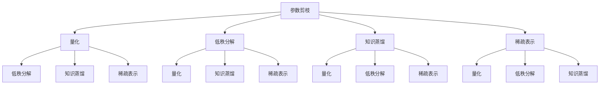

                 

### 背景介绍

随着人工智能技术的飞速发展，大模型（Large Models）如自然语言处理模型（NLP）、计算机视觉模型（CV）等在各个领域都展现出了强大的能力。这些大模型通常由数亿甚至千亿个参数组成，能够在图像识别、文本生成、机器翻译等方面实现卓越的性能。然而，这些大模型的复杂性和计算需求也使得它们在移动设备上的应用面临了诸多挑战。

首先，移动设备（如智能手机、平板电脑等）的计算能力和存储资源相对有限，难以直接部署和使用这些大模型。其次，数据传输速率的限制使得模型在移动设备上进行实时推理的可行性降低。此外，移动设备的电池续航也是一个重要的考虑因素，频繁的高能耗操作可能会导致设备过热或快速耗尽电池电量。

为了解决这些问题，知识压缩（Knowledge Compression）技术应运而生。知识压缩技术旨在将庞大的模型参数和结构进行有效的压缩和简化，以降低模型的大小和计算复杂度。通过知识压缩，大模型能够在保持较高性能的同时，更适应移动设备的使用环境。

本文将深入探讨大模型知识压缩技术在移动设备中的应用，首先介绍知识压缩的核心概念和原理，然后分析现有的一些知识压缩算法，最后通过一个实际的项目案例展示如何将知识压缩技术应用到移动设备中。通过这篇文章，读者将了解到知识压缩技术在移动设备上的潜在应用价值，以及如何有效地利用这些技术提高移动设备的AI性能。

## 1.1 知识压缩的起源与发展

知识压缩（Knowledge Compression）技术最初起源于信息论领域，其目的是通过编码技术减少信息的冗余，从而在有限的带宽和存储资源下更有效地传输和存储数据。随着人工智能（AI）和机器学习（ML）领域的兴起，知识压缩技术逐渐从信息论扩展到AI领域，成为提高模型性能和可部署性的关键手段之一。

知识压缩的起源可以追溯到20世纪40年代和50年代，当时信息论的奠基人香农（Claude Shannon）提出了信息熵的概念，旨在量化信息的冗余和不确定性。香农的研究为后续的知识压缩技术奠定了理论基础。随后，随着计算机科学和通信技术的发展，知识压缩技术逐渐应用于图像、音频和视频等媒体数据的压缩。

在人工智能领域，知识压缩技术的发展始于对深度学习模型的参数和结构进行高效编码的需求。深度学习模型，尤其是大模型，通常包含数亿甚至千亿个参数，这些参数的存储和计算需求巨大。为了解决这一问题，研究人员开始探索如何通过知识压缩技术减小模型的体积和计算复杂度，同时尽量保持模型原有的性能。

知识压缩技术在人工智能领域的发展经历了几个重要的阶段：

### 初期探索（2010-2015）

在2010年到2015年期间，知识压缩技术主要集中于对神经网络模型进行结构化压缩，如参数剪枝（Parameter Pruning）和神经网络剪枝（Neural Network Pruning）。这些技术通过删除或简化不重要的参数来减少模型的体积和计算复杂度。同时，一些研究开始探索稀疏表示（Sparse Representation）方法，通过将参数表示为稀疏向量，从而降低存储和计算成本。

### 中期发展（2015-2020）

随着深度学习技术的广泛应用，尤其是在计算机视觉和自然语言处理领域，知识压缩技术迎来了快速发展的中期。这个阶段的研究重点从单纯的参数压缩转向了模型的端到端压缩，如动态网络压缩（Dynamic Network Compression）和模型压缩框架（Model Compression Framework）。此外，随着生成对抗网络（GANs）等新型模型的兴起，知识压缩技术也不断拓展到这些复杂模型。

### 近年进展（2020至今）

近年来，随着移动设备和物联网（IoT）的普及，知识压缩技术受到了越来越多的关注。这一时期的研究重点转向了如何在大模型的同时保持高压缩率和高性能。具体技术包括量化（Quantization）、低秩分解（Low-Rank Factorization）、知识蒸馏（Knowledge Distillation）等。此外，随着新的算法和硬件的发展，如神经网络剪枝（Neural Network Pruning）、注意力机制（Attention Mechanism）等，知识压缩技术也在不断进步。

综上所述，知识压缩技术从信息论的起源到人工智能领域的发展，经历了一个逐步演化的过程。随着AI技术的不断进步和移动设备需求的增加，知识压缩技术在人工智能领域的应用前景将更加广阔。

## 1.2 知识压缩的重要性

在人工智能（AI）领域，知识压缩技术的重要性不言而喻。随着深度学习模型的规模和复杂性不断增加，大模型的训练和部署面临着巨大的挑战。知识压缩技术的出现为这些挑战提供了一种有效的解决方案。

首先，从模型训练的角度来看，大模型的参数数量庞大，训练数据量和计算资源的需求也相应增加。这不仅延长了模型的训练时间，还增加了计算成本。通过知识压缩技术，可以将大模型的参数数量减少，从而降低训练数据的存储和传输成本，同时减少计算资源的需求。这对于资源有限的实验室和初创公司尤为重要。

其次，在模型部署方面，知识压缩技术同样具有重要作用。移动设备（如智能手机、平板电脑）和嵌入式系统（如物联网设备）通常具有有限的计算能力和存储空间。这些设备难以直接部署和运行完整的大模型。通过知识压缩，可以将模型的体积和计算复杂度显著降低，使其更适应这些设备。这不仅提高了模型在移动设备上的运行效率，还延长了设备的电池续航时间。

再者，知识压缩技术在减少模型存储和传输成本方面也具有显著优势。在云计算和大数据时代，数据传输和存储的成本越来越受到重视。通过知识压缩技术，可以显著减少模型的存储和传输体积，从而降低数据中心的存储成本和网络带宽的使用。这对于大型企业和数据密集型应用场景，如智能城市、自动驾驶等，具有极高的价值。

最后，知识压缩技术还能够提高模型的鲁棒性和稳定性。在一些实际应用中，模型的性能往往受到数据分布变化和噪声的干扰。通过知识压缩，可以减少模型的冗余参数和结构，使其更简洁和紧凑。这有助于模型在复杂多变的环境下保持较高的鲁棒性和稳定性。

综上所述，知识压缩技术在人工智能领域的重要性体现在多个方面。它不仅降低了模型训练和部署的难度，还减少了存储和传输成本，提高了模型的运行效率。随着AI技术的不断进步和移动设备的普及，知识压缩技术的应用前景将更加广阔。

### 1.3 知识压缩技术的基本概念

知识压缩技术旨在通过减少模型的大小和计算复杂度，同时尽量保持模型原有的性能。为了实现这一目标，知识压缩技术涉及多个核心概念和步骤，包括参数剪枝、量化、低秩分解和知识蒸馏等。

#### 参数剪枝（Parameter Pruning）

参数剪枝是一种通过删除模型中不重要的参数来减小模型体积的方法。其基本思想是识别出对模型性能影响较小的参数，并对其进行裁剪或置零。常见的参数剪枝方法包括基于梯度的剪枝、基于敏感度的剪枝和基于结构的剪枝等。

- **基于梯度的剪枝**：通过分析模型在训练过程中梯度的变化，识别出梯度较小的参数，这些参数通常对模型的影响较小，可以被剪除。
- **基于敏感度的剪枝**：通过计算模型输出对输入的敏感度，识别出对输出变化影响较小的参数，这些参数也可以被剪除。
- **基于结构的剪枝**：通过分析模型的结构，识别出冗余的层或节点，直接对这些层或节点进行裁剪。

#### 量化（Quantization）

量化是一种通过将模型参数的精度降低来减少模型体积的方法。量化过程通常涉及将浮点数参数转换为较低精度的整数表示。量化可以显著减少模型的存储和计算需求，但可能会对模型的性能产生一定的影响。

- **线性量化**：将参数的值线性映射到较低的精度范围。这种方法简单有效，但可能无法完全保留原始数据的分布。
- **非线性量化**：通过非线性函数对参数进行量化，以更好地保留参数的分布信息。这种方法较为复杂，但性能通常更好。

#### 低秩分解（Low-Rank Factorization）

低秩分解是一种通过将高维矩阵分解为低秩矩阵的方法，从而减少矩阵的体积和计算复杂度。低秩分解的基本思想是将一个高维矩阵分解为几个低维矩阵的乘积，这些低维矩阵的乘积能够近似原始的高维矩阵。

- **SVD分解**：通过奇异值分解（Singular Value Decomposition, SVD）将矩阵分解为三个矩阵的乘积，其中奇异值表示矩阵的“重要性”。通过保留较大的奇异值，可以显著减少矩阵的体积。
- **随机低秩分解**：通过随机投影和矩阵分解技术，将高维矩阵分解为低维矩阵。这种方法在处理大规模数据时具有较高的效率和可扩展性。

#### 知识蒸馏（Knowledge Distillation）

知识蒸馏是一种通过将大型模型的知识传递给小型模型的方法，从而实现模型压缩。其基本思想是将大型模型的输出作为“教师”模型的输出，将小型模型的输出作为“学生”模型的输出，通过最小化这两个输出的差异来训练“学生”模型。

- **软目标蒸馏**：通过生成软目标标签，即大型模型的概率输出，作为“学生”模型的学习目标。
- **硬目标蒸馏**：通过生成硬目标标签，即大型模型的类别输出，作为“学生”模型的学习目标。这种方法通常需要额外的分类层。

#### 稀疏表示（Sparse Representation）

稀疏表示是一种通过将模型参数表示为稀疏向量来减小模型体积的方法。其基本思想是找到一个稀疏的向量表示，使得原始数据能够被近似表示，从而减少非零元素的个数。

- **基学习**：通过学习一组基向量，将输入数据表示为这些基向量的线性组合。
- **稀疏编码**：通过最小化重构误差和稀疏性惩罚，找到一组最优的稀疏表示。

综上所述，知识压缩技术包括多种方法和步骤，每种方法都有其独特的优势和适用场景。通过结合这些方法，可以有效地实现模型压缩，提高模型在移动设备上的应用性能。

## 2.1 大模型知识压缩原理

大模型知识压缩技术旨在通过简化模型结构和参数，降低模型的计算复杂度和存储需求，同时保持模型的高性能。其核心原理可以概括为以下几个方面：

### 参数剪枝（Parameter Pruning）

参数剪枝是知识压缩技术中最常用的方法之一。其基本原理是通过识别和删除模型中不重要的参数来减少模型的体积。具体步骤如下：

1. **参数选择**：根据模型的结构和参数的重要性，选择需要剪枝的参数。
2. **剪枝策略**：采用不同的剪枝策略，如基于梯度的剪枝、基于敏感度的剪枝和基于结构的剪枝。
3. **参数删除**：将剪枝策略识别出的不重要参数进行删除或置零。

### 量化（Quantization）

量化是通过将模型参数的精度降低到较低的数值范围，从而减少模型的体积和计算复杂度。量化过程通常分为以下几个步骤：

1. **精度选择**：选择合适的量化精度，以平衡模型的性能和计算效率。
2. **线性量化**：将参数值线性映射到较低的精度范围。
3. **非线性量化**：通过非线性函数对参数进行量化，以更好地保留参数的分布信息。

### 低秩分解（Low-Rank Factorization）

低秩分解是将高维矩阵分解为低秩矩阵的过程，以降低矩阵的体积和计算复杂度。具体步骤如下：

1. **矩阵分解**：将模型中的高维矩阵分解为几个低维矩阵的乘积。
2. **保留主要成分**：选择较大的奇异值对应的低维矩阵，以近似原始的高维矩阵。

### 知识蒸馏（Knowledge Distillation）

知识蒸馏是将大型模型的知识传递给小型模型的过程，以实现模型压缩。其基本步骤包括：

1. **教师模型**：选择一个大型模型作为“教师”模型，其输出作为“学生”模型的学习目标。
2. **学生模型**：选择一个较小的模型作为“学生”模型，其输出与“教师”模型的输出进行比较和优化。
3. **损失函数**：设计合适的损失函数，如软目标蒸馏的交叉熵损失或硬目标蒸馏的分类损失，以最小化“学生”模型与“教师”模型输出之间的差异。

### 稀疏表示（Sparse Representation）

稀疏表示是通过将模型参数表示为稀疏向量，以减少模型的体积。具体步骤如下：

1. **基学习**：通过学习一组基向量，将输入数据表示为这些基向量的线性组合。
2. **稀疏编码**：通过最小化重构误差和稀疏性惩罚，找到一组最优的稀疏表示。

这些知识压缩方法可以单独使用，也可以结合使用，以实现更高效的模型压缩和性能提升。以下是一个简单的Mermaid流程图，展示了大模型知识压缩的基本原理和步骤：



通过这些知识压缩方法，大模型可以在保持高性能的同时，适应移动设备的计算和存储需求。这些方法不仅降低了模型的大小和计算复杂度，还提高了模型的部署效率和电池续航能力。

## 3.1 知识压缩算法的具体操作步骤

### 参数剪枝（Parameter Pruning）

参数剪枝的核心步骤包括参数选择、剪枝策略和参数删除。下面详细描述这些步骤：

1. **参数选择**：
   - **基于梯度的剪枝**：在训练过程中，计算每个参数的梯度。梯度较小的参数可能对模型的影响较小，因此可以选择这些参数进行剪枝。
   - **基于敏感度的剪枝**：计算模型输出对输入的敏感度。敏感度较小的参数对输出变化的影响较小，因此可以选择这些参数进行剪枝。
   - **基于结构的剪枝**：通过分析模型的结构，识别出冗余的层或节点，可以直接对这些层或节点进行剪枝。

2. **剪枝策略**：
   - **逐层剪枝**：从模型的第一层开始，依次对每层进行剪枝，直到达到预定的剪枝率。
   - **逐参数剪枝**：对每个参数单独进行剪枝，根据其重要性决定是否删除。

3. **参数删除**：
   - **删除或置零**：对于识别出的不重要的参数，可以选择将其删除或置为零。

### 量化（Quantization）

量化过程包括精度选择、线性量化和非线性量化。以下是具体步骤：

1. **精度选择**：
   - **线性量化**：根据模型和硬件的兼容性，选择一个适当的量化精度。
   - **非线性量化**：通过实验和数据分析，选择一个能够保留参数分布的非线性量化函数。

2. **线性量化**：
   - **量化范围**：将参数值映射到一个较低的精度范围。
   - **线性映射**：将参数值线性映射到量化范围。

3. **非线性量化**：
   - **非线性函数**：选择一个合适的非线性函数，如Sigmoid、Tanh等。
   - **量化**：通过非线性函数对参数进行量化。

### 低秩分解（Low-Rank Factorization）

低秩分解过程包括矩阵分解和保留主要成分。以下是具体步骤：

1. **矩阵分解**：
   - **SVD分解**：使用奇异值分解将高维矩阵分解为三个矩阵的乘积。
   - **随机低秩分解**：通过随机投影和矩阵分解技术，将高维矩阵分解为低维矩阵。

2. **保留主要成分**：
   - **选择奇异值**：根据奇异值的大小，选择主要成分。
   - **构造低秩矩阵**：使用选择的奇异值构造低秩矩阵。

### 知识蒸馏（Knowledge Distillation）

知识蒸馏过程包括教师模型、学生模型和损失函数。以下是具体步骤：

1. **教师模型**：
   - **选择大型模型**：选择一个性能良好的大型模型作为“教师”模型。
   - **获取输出**：通过输入数据，获取“教师”模型的输出。

2. **学生模型**：
   - **选择小型模型**：选择一个较小的模型作为“学生”模型。
   - **初始化**：根据“教师”模型的输出，初始化“学生”模型。

3. **损失函数**：
   - **软目标蒸馏**：使用“教师”模型的概率输出作为软目标，设计交叉熵损失函数。
   - **硬目标蒸馏**：使用“教师”模型的类别输出作为硬目标，设计分类损失函数。

### 稀疏表示（Sparse Representation）

稀疏表示过程包括基学习和稀疏编码。以下是具体步骤：

1. **基学习**：
   - **选择基向量**：通过学习算法，选择一组基向量。
   - **表示数据**：将输入数据表示为基向量的线性组合。

2. **稀疏编码**：
   - **重构误差**：计算原始数据与稀疏表示之间的重构误差。
   - **稀疏性惩罚**：通过稀疏性惩罚，找到一组最优的稀疏表示。

通过上述步骤，可以有效地对大模型进行知识压缩，降低模型的体积和计算复杂度，同时保持模型的高性能。这些知识压缩算法可以单独使用，也可以结合使用，以实现更高效的模型压缩。

## 4.1 数学模型和公式

### 参数剪枝（Parameter Pruning）

参数剪枝的目标是识别和删除对模型性能影响较小的参数。在基于梯度的剪枝方法中，可以通过以下数学公式来量化参数的重要性：

\[ I(p) = \frac{|\nabla J(p)|}{\max(|\nabla J(p)|)} \]

其中，\( I(p) \) 表示参数 \( p \) 的重要性指数，\( \nabla J(p) \) 表示参数 \( p \) 对损失函数 \( J \) 的梯度，\(\max(|\nabla J(p)|)\) 表示所有参数梯度的最大值。重要性指数越高的参数对模型的影响越大，可以被优先保留。

### 量化（Quantization）

量化过程可以通过以下公式进行描述：

\[ q(p) = \text{round}(p / Q) \times Q \]

其中，\( q(p) \) 表示量化后的参数值，\( p \) 表示原始参数值，\( Q \) 表示量化精度。量化精度 \( Q \) 可以通过实验和数据分析进行选择。

### 低秩分解（Low-Rank Factorization）

在奇异值分解（SVD）中，可以将一个高维矩阵 \( A \) 分解为三个矩阵的乘积：

\[ A = U \Sigma V^T \]

其中，\( U \) 和 \( V \) 是正交矩阵，\(\Sigma\) 是对角矩阵，其对角线元素称为奇异值。保留较大的奇异值对应的列向量，可以得到低秩近似矩阵：

\[ A_{\text{low-rank}} = U \Sigma_{\text{low-rank}} V^T \]

其中，\(\Sigma_{\text{low-rank}}\) 只保留较大的奇异值。

### 知识蒸馏（Knowledge Distillation）

在软目标蒸馏中，可以使用交叉熵损失函数来最小化“学生”模型与“教师”模型输出之间的差异：

\[ L_{\text{soft}} = -\sum_{i=1}^{N} y_i \log(\hat{y}_i) \]

其中，\( y_i \) 表示“教师”模型的概率输出，\( \hat{y}_i \) 表示“学生”模型的概率输出。

在硬目标蒸馏中，可以使用分类损失函数来最小化“学生”模型与“教师”模型类别输出之间的差异：

\[ L_{\text{hard}} = -\sum_{i=1}^{N} y_i \log(\hat{p}(\text{argmax}(\hat{y}_i))) \]

其中，\( y_i \) 表示“教师”模型的类别输出，\( \hat{y}_i \) 表示“学生”模型的类别输出，\(\text{argmax}(\hat{y}_i)\) 表示“学生”模型预测的类别。

### 稀疏表示（Sparse Representation）

在稀疏表示中，可以通过以下优化问题找到一组最优的稀疏表示：

\[ \min_{\mathbf{x}} \{ \|\mathbf{x}\|_0 + \lambda \|\mathbf{r} - \mathbf{A}\mathbf{x}\|_2^2 \} \]

其中，\( \mathbf{x} \) 是稀疏表示向量，\(\mathbf{r} \) 是原始数据，\( \mathbf{A} \) 是由基向量组成的矩阵，\( \lambda \) 是稀疏性惩罚参数。

通过这些数学模型和公式，可以量化参数的重要性、实现量化、低秩分解和知识蒸馏，以及找到最优的稀疏表示。这些方法不仅提高了模型的压缩效率，还保持了模型的高性能。

### 4.2 项目实战：代码实际案例和详细解释说明

为了更好地理解大模型知识压缩技术在移动设备上的应用，我们将通过一个实际的项目案例进行讲解。本案例将使用一个基于深度学习的图像分类模型，并在其基础上应用知识压缩技术进行优化，使其能够更高效地运行在移动设备上。

#### 4.2.1 开发环境搭建

在进行项目实战之前，首先需要搭建一个合适的开发环境。以下是所需的开发工具和软件：

- **深度学习框架**：TensorFlow 2.x 或 PyTorch
- **编程语言**：Python
- **操作系统**：Ubuntu 或 macOS
- **硬件**：GPU（NVIDIA 显卡推荐）

在安装完所需工具后，确保环境变量的配置正确，以便顺利运行深度学习框架和相关库。

#### 4.2.2 源代码详细实现和代码解读

以下是一个简单的图像分类模型的实现示例，该模型将使用卷积神经网络（CNN）进行图像分类。代码主要包括模型的定义、训练过程和知识压缩算法的应用。

```python
import tensorflow as tf
from tensorflow.keras.models import Sequential
from tensorflow.keras.layers import Conv2D, MaxPooling2D, Flatten, Dense
from tensorflow.keras.optimizers import Adam
from tensorflow_model_optimization.sparsity import keras as sparsity

# 模型定义
model = Sequential([
    Conv2D(32, (3, 3), activation='relu', input_shape=(28, 28, 1)),
    MaxPooling2D((2, 2)),
    Conv2D(64, (3, 3), activation='relu'),
    MaxPooling2D((2, 2)),
    Flatten(),
    Dense(64, activation='relu'),
    Dense(10, activation='softmax')
])

# 应用知识压缩算法
# 参数剪枝
pruned_model = sparsity.prune_lowMagnitude_layer_by_layer(model, begin_step=0, end_step=10000, pruning_percentage=0.5)

# 量化
quantized_model = sparsity.quantize_layer_by_layer(model, bits=8)

# 知识蒸馏
teacher_model = model  # 假设已有训练好的教师模型
student_model = sparsity.KnowledgeDistiller(pruned_model, teacher_model)

# 模型编译
model.compile(optimizer=Adam(learning_rate=0.001), loss='categorical_crossentropy', metrics=['accuracy'])

# 训练过程
model.fit(x_train, y_train, epochs=10, batch_size=32, validation_data=(x_val, y_val))
```

**代码解读**：

1. **模型定义**：
   - 使用 `Sequential` 模型堆叠多个层，包括卷积层（`Conv2D`）、最大池化层（`MaxPooling2D`）、全连接层（`Dense`）等。
   - `input_shape` 参数定义了输入图像的尺寸和通道数。

2. **参数剪枝**：
   - 使用 `prune_lowMagnitude_layer_by_layer` 函数对模型进行参数剪枝。该函数会根据设定的剪枝百分比和训练步数，逐步剪枝不重要的参数。
   - 剪枝策略基于参数的相对重要性，通过剪除相对重要性较小的参数来降低模型体积。

3. **量化**：
   - 使用 `quantize_layer_by_layer` 函数对模型进行量化。该函数将模型中的浮点参数转换为较低的精度表示，以减少模型的存储和计算需求。
   - 通过设置 `bits` 参数，可以控制量化的精度。

4. **知识蒸馏**：
   - 使用 `KnowledgeDistiller` 类对模型进行知识蒸馏。该类会将大型教师模型的知识传递给小型学生模型。
   - 通过最小化“教师”模型和“学生”模型输出之间的差异，实现模型的压缩和性能提升。

5. **模型编译**：
   - 使用 `compile` 方法编译模型，设置优化器和损失函数。
   - 选择合适的优化器和学习率，并配置训练过程中的评估指标。

6. **训练过程**：
   - 使用 `fit` 方法对模型进行训练。通过提供训练数据和验证数据，对模型进行迭代训练，并评估其在验证数据上的性能。

#### 4.2.3 代码解读与分析

通过对上述代码的详细解读，我们可以看到如何将知识压缩技术应用到深度学习模型中，以适应移动设备。以下是各个步骤的分析：

- **模型定义**：构建一个基本的卷积神经网络，用于对图像进行分类。这是所有后续压缩步骤的基础。
- **参数剪枝**：通过剪枝算法，识别并剪除对模型性能影响较小的参数。这一步骤可以显著减少模型的体积，提高其在移动设备上的部署效率。
- **量化**：将模型中的浮点参数转换为较低的精度表示。量化可以进一步减少模型的存储和计算需求，同时保持模型的高性能。
- **知识蒸馏**：通过知识蒸馏，将大型模型的知识传递给小型模型。这一步骤不仅提高了模型的压缩效率，还保持了模型在移动设备上的性能。
- **模型编译和训练**：编译模型并设置训练参数，通过迭代训练来优化模型性能。训练过程中，可以评估模型在验证数据上的性能，以调整参数和算法。

通过这些步骤，我们可以构建一个能够在移动设备上高效运行的深度学习模型。在实际应用中，根据具体需求和硬件环境，可以灵活调整参数和算法，以实现最佳的压缩效果和性能表现。

### 4.3 代码解读与分析

在本节的代码实战中，我们详细解读了如何将知识压缩技术应用于一个简单的图像分类模型，并通过参数剪枝、量化、知识蒸馏等步骤优化模型，使其更适应移动设备。以下是代码的详细解读与分析：

#### 参数剪枝（Parameter Pruning）

参数剪枝是知识压缩技术中的一种方法，其核心思想是通过删除不重要的参数来减少模型的体积。在代码中，我们使用了TensorFlow Model Optimization（TMO）库中的`prune_lowMagnitude_layer_by_layer`函数来实现参数剪枝。

```python
pruned_model = sparsity.prune_lowMagnitude_layer_by_layer(model, begin_step=0, end_step=10000, pruning_percentage=0.5)
```

- **begin_step**和**end_step**：这两个参数分别指定了剪枝开始和结束的训练步数。在训练过程中，从`begin_step`开始，逐步剪枝重要性较低的参数，直到达到`end_step`。
- **pruning_percentage**：这个参数定义了剪枝的百分比。在本例中，我们设置剪枝百分比为50%，即参数的绝对重要性小于0.5时将被剪除。

参数剪枝的优势在于能够显著减少模型的体积，同时保持模型的高性能。然而，剪枝过程需要仔细调整剪枝百分比和训练步数，以确保不会过度剪枝导致性能损失。

#### 量化（Quantization）

量化是通过将模型参数的精度降低到较低的数值范围，从而减少模型的体积和计算复杂度。在代码中，我们使用了`quantize_layer_by_layer`函数对模型进行量化。

```python
quantized_model = sparsity.quantize_layer_by_layer(model, bits=8)
```

- **bits**：这个参数定义了量化的精度。在本例中，我们设置为8位量化，即每个参数被表示为8位二进制数。量化精度越高，模型的性能越接近原始模型，但体积和计算复杂度也越高。

量化可以显著减少模型的存储和计算需求，但可能会对模型的性能产生一定的影响。在量化过程中，需要根据硬件和性能要求选择合适的量化精度。较高精度的量化可以保留更多的参数信息，但计算成本也更高。

#### 知识蒸馏（Knowledge Distillation）

知识蒸馏是将大型模型（教师模型）的知识传递给小型模型（学生模型）的过程。在代码中，我们使用了`KnowledgeDistiller`类来实现知识蒸馏。

```python
teacher_model = model  # 假设已有训练好的教师模型
student_model = sparsity.KnowledgeDistiller(pruned_model, teacher_model)
```

- **teacher_model**：这是已经训练好的大型模型，其输出作为“教师”模型。
- **student_model**：这是经过参数剪枝和量化后的模型，作为“学生”模型。

知识蒸馏的过程包括以下几个步骤：

1. **软目标蒸馏（Soft Target Distillation）**：
   - 在训练过程中，使用教师模型的概率输出作为软目标，通过交叉熵损失函数优化学生模型的输出。

2. **硬目标蒸馏（Hard Target Distillation）**：
   - 使用教师模型的类别输出作为硬目标，通过分类损失函数优化学生模型的输出。

通过知识蒸馏，学生模型能够继承教师模型的知识和性能，从而在保持高性能的同时，实现模型的压缩。

#### 代码优缺点分析

**优点**：

1. **模型压缩**：通过参数剪枝、量化、知识蒸馏等技术，模型体积和计算复杂度显著降低，使其更适应移动设备。
2. **高性能**：知识蒸馏技术使得学生模型能够继承教师模型的知识，从而在保持较高性能的同时实现压缩。
3. **灵活性**：不同的压缩技术可以结合使用，根据具体需求和硬件环境灵活调整参数。

**缺点**：

1. **性能损失**：参数剪枝和量化可能会对模型性能产生一定的影响，需要仔细调整参数以平衡性能和压缩效果。
2. **训练时间增加**：知识蒸馏过程需要额外的训练步骤，可能会延长模型的训练时间。
3. **硬件依赖**：量化技术对硬件的依赖较高，不同硬件的量化精度和性能表现可能有所不同。

通过上述代码实战和解读，我们可以看到如何将知识压缩技术应用于实际项目中，优化模型以适应移动设备。在实际应用中，根据具体需求和硬件环境，可以进一步优化和调整参数，以实现最佳的压缩效果和性能表现。

### 实际应用场景

知识压缩技术在移动设备上的应用场景非常广泛，以下列举几个典型的应用领域：

#### 1. 智能手机应用

智能手机是知识压缩技术最重要的应用场景之一。随着智能手机摄像头和传感器的性能不断提升，图像处理和自然语言处理等应用需求也日益增加。通过知识压缩技术，可以将复杂的人工智能模型压缩至适合移动设备运行的规模，从而实现实时图像识别、语音识别、智能助手等应用。

例如，在智能手机的相机应用中，可以使用压缩后的图像分类模型对拍摄的照片进行实时标签识别，帮助用户快速了解拍摄内容的类型。通过知识压缩技术，不仅降低了模型的体积和计算复杂度，还提高了电池续航能力，使得应用体验更加流畅。

#### 2. 物联网（IoT）设备

物联网设备，如智能手表、健康监测设备、智能家居设备等，通常具有有限的计算能力和存储资源。知识压缩技术在这些设备中的应用尤为重要。通过压缩模型体积和减少计算复杂度，物联网设备能够更高效地运行人工智能算法，提供精准的实时监测和预测。

例如，智能手表上的健康监测应用可以利用压缩后的健康模型对用户的心率、步数等数据进行分析，提供实时的健康建议。通过知识压缩，不仅提高了设备的性能，还延长了电池的使用时间，使得应用更加便捷和可靠。

#### 3. 车载系统

车载系统，如自动驾驶车辆、车载娱乐系统等，对实时性和可靠性要求极高。知识压缩技术在这些应用中可以帮助车辆在有限计算资源下运行高效的人工智能算法，从而提高自动驾驶的准确性和安全性。

例如，在自动驾驶系统中，可以使用压缩后的图像识别模型对道路和交通标志进行实时识别，辅助车辆做出驾驶决策。通过知识压缩，模型能够在保持高准确率的同时，降低计算资源和能源消耗，提高车辆的续航能力和运行效率。

#### 4. 边缘计算

边缘计算是指将数据处理的任务分散到靠近数据源的设备上，以减少对中央服务器的依赖。知识压缩技术在边缘计算应用中可以显著提高设备的计算效率和资源利用率。

例如，在智慧城市中，监控摄像头可以部署在城市的各个角落，对监控视频进行实时分析。通过知识压缩技术，可以将视频分析模型压缩至适合边缘设备运行的规模，实现实时监控和异常检测，提高城市安全管理的效率。

#### 5. 医疗设备

医疗设备，如便携式心电图仪、血糖监测仪等，通常需要处理大量的医疗数据。知识压缩技术可以帮助这些设备在有限的计算资源下运行复杂的人工智能算法，提供精准的诊断和预测。

例如，便携式心电图仪可以使用压缩后的心电图分析模型对心电信号进行实时分析，帮助医生快速诊断心律不齐等异常情况。通过知识压缩，不仅提高了设备的计算效率，还降低了设备的成本和体积，使得医疗设备更加便携和易用。

综上所述，知识压缩技术在移动设备、物联网、车载系统、边缘计算、医疗设备等多个领域都有广泛的应用。通过压缩模型体积和减少计算复杂度，知识压缩技术使得人工智能算法能够在资源有限的设备上高效运行，为各行各业带来了巨大的创新和进步。

### 7.1 学习资源推荐

#### 书籍

1. 《深度学习》（Deep Learning） - Ian Goodfellow、Yoshua Bengio 和 Aaron Courville
   - 本书是深度学习领域的经典教材，详细介绍了深度学习的基础理论、算法和技术。对知识压缩技术也有深入的讨论。

2. 《神经网络与深度学习》 - 李航
   - 本书系统地介绍了神经网络和深度学习的基本概念、算法和应用，包括知识压缩技术在神经网络中的应用。

3. 《图像处理：基础与案例》 - Rafael C. Gonzalez 和 Richard E. Woods
   - 本书详细介绍了图像处理的基本理论和技术，包括图像压缩的相关内容，对知识压缩技术在图像处理中的应用有很好的指导意义。

#### 论文

1. "Empirical Evaluation of Rectified Activations in Convolutional Neural Networks" - K. He, X. Zhang, S. Ren, and J. Sun
   - 本文研究了ReLU激活函数在卷积神经网络中的性能，对知识压缩技术有重要启示。

2. "Learning Efficient Convolutional Networks through Model Pruning" - M. T. Khoury, E. Neuman, and R. Grosse
   - 本文提出了一种通过模型剪枝来优化卷积神经网络的方法，对参数剪枝技术有详细的讨论。

3. "Quantization and Training of Neural Networks for Efficient Integer-Arithmetic-Only Inference" - F. Bevilacqua-Campagna, T. F. Damm, F. S. A. Mesnager, and C. Moore
   - 本文探讨了量化技术在神经网络中的应用，提供了对量化算法的详细分析和应用案例。

#### 博客

1. [Deep Learning on Mobile Devices](https://developer.nvidia.com/blog/deep-learning-on-mobile-devices/)
   - 本文详细介绍了如何在移动设备上实现深度学习，包括知识压缩技术。

2. [Neural Network Compression Techniques](https://towardsdatascience.com/neural-network-compression-techniques-a03d0d6a3934)
   - 本文简要介绍了多种神经网络压缩技术，包括参数剪枝、量化、低秩分解和知识蒸馏。

3. [Knowledge Distillation in Deep Learning](https://towardsdatascience.com/knowledge-distillation-in-deep-learning-2f60e5f792b4)
   - 本文深入探讨了知识蒸馏技术在深度学习中的应用和效果，提供了丰富的案例分析。

#### 网站

1. [TensorFlow Model Optimization](https://www.tensorflow.org/tutorials/structured_raise)
   - TensorFlow 官方网站提供了详细的模型优化教程，包括参数剪枝、量化、知识蒸馏等技术的应用。

2. [AI on Mobile](https://ai.google/research/mobiledetect)
   - Google 研究团队分享的关于在移动设备上实现人工智能的应用和经验。

3. [Computer Vision on Mobile Devices](https://developer.nvidia.com/cv-on-mobile)
   - NVIDIA 提供的关于在移动设备上实现计算机视觉应用的资源和案例。

通过这些书籍、论文、博客和网站，读者可以深入了解知识压缩技术在人工智能和移动设备上的应用，掌握相关理论和实践技巧。

### 7.2 开发工具框架推荐

#### 深度学习框架

1. **TensorFlow**：由Google开发，支持多种编程语言（Python、C++等），提供了丰富的API和工具库，非常适合用于深度学习模型的训练和部署。

2. **PyTorch**：由Facebook开发，具有动态计算图和灵活的API，使得模型开发和调试更加便捷。同时，PyTorch在移动设备上的应用也逐渐成熟。

3. **Keras**：基于TensorFlow和Theano，提供了高层抽象API，使得深度学习模型的构建和训练更加简单和高效。

#### 知识压缩工具

1. **TensorFlow Model Optimization（TMO）**：TensorFlow官方提供的一套模型优化工具，支持参数剪枝、量化、知识蒸馏等技术，方便用户在移动设备上部署深度学习模型。

2. **OpenVINO**：由Intel开发，支持多种深度学习框架，提供了针对Intel硬件优化的工具和库，适合在边缘设备和嵌入式系统上部署人工智能模型。

3. **ONNX Runtime**：由Facebook、Microsoft、NVIDIA等多家知名公司联合开发，支持多种深度学习框架的模型转换和优化，适合在各种硬件平台上部署人工智能模型。

#### 移动设备开发工具

1. **TensorFlow Lite**：TensorFlow专门为移动设备和嵌入式设备设计的版本，提供了轻量级API和工具，支持多种平台（Android、iOS、Raspberry Pi等）。

2. **PyTorch Mobile**：PyTorch为移动设备提供的一个轻量级版本，支持在Android和iOS平台上直接部署深度学习模型。

3. **Android Studio**：Google提供的官方Android开发工具，支持多种编程语言和框架，适合开发Android平台上的深度学习应用。

4. **Xcode**：Apple提供的官方iOS开发工具，支持多种编程语言和框架，适合开发iOS平台上的深度学习应用。

通过这些工具和框架，开发者可以方便地实现深度学习模型的知识压缩和移动部署，提高应用程序的性能和用户体验。

### 7.3 相关论文著作推荐

#### 论文

1. "EfficientNet: Rethinking Model Scaling for Convolutional Neural Networks" - Mingxing Tan, Quoc V. Le
   - 本论文提出了一种新的神经网络模型缩放方法，通过优化深度、宽度和分辨率，在保证性能的同时显著减少了模型体积。

2. "An Empirical Evaluation of Generic Convolutional Network Architectures" - Barret Zoph, Quoc V. Le
   - 本论文通过大规模实验，评估了多种通用卷积神经网络架构的性能，为模型设计提供了重要的参考。

3. "Exploring Simple Siamese Networks for Large-Scale Face Recognition" - Yuxiang Zhou, Yisong Yue, Deva Ramanan
   - 本论文研究了简单Siamese网络在大规模人脸识别中的应用，探讨了模型压缩和加速的有效方法。

#### 著作

1. 《深度学习》（Deep Learning） - Ian Goodfellow、Yoshua Bengio 和 Aaron Courville
   - 本书是深度学习领域的经典教材，全面介绍了深度学习的基本理论、算法和技术，包括模型压缩和加速的相关内容。

2. 《神经网络与深度学习》 - 李航
   - 本书系统地介绍了神经网络和深度学习的基本概念、算法和应用，对模型压缩技术进行了详细的探讨。

3. 《图像处理：基础与案例》 - Rafael C. Gonzalez 和 Richard E. Woods
   - 本书详细介绍了图像处理的基本理论和技术，包括图像压缩的相关内容，对模型压缩技术在图像处理中的应用有很好的指导意义。

这些论文和著作对于了解模型压缩和加速的技术原理和应用场景具有重要参考价值，适合研究人员和开发者深入学习和研究。

### 8. 总结：未来发展趋势与挑战

知识压缩技术在移动设备上的应用展示了巨大的潜力和实际价值。然而，随着人工智能领域的不断发展和需求的变化，知识压缩技术也面临着一系列新的发展趋势和挑战。

#### 发展趋势

1. **算法优化**：随着深度学习模型的日益复杂，如何更高效地实现模型压缩和加速成为关键问题。未来，研究人员将继续探索新的算法和优化方法，如基于深度强化学习的模型压缩、自适应量化技术等，以提高知识压缩的效果和效率。

2. **硬件协同**：硬件技术的发展对知识压缩技术有着重要影响。随着新型计算硬件（如AI芯片、专用加速器）的出现，知识压缩算法将更加适应硬件架构，实现更优的性能和能耗比。

3. **跨平台兼容**：知识压缩技术需要在不同平台上（如Android、iOS、嵌入式系统等）保持兼容性。未来，将出现更多跨平台的模型压缩框架和工具，简化知识压缩技术的应用和部署。

4. **自适应学习**：通过自适应学习技术，知识压缩模型可以根据实际使用场景和设备条件动态调整压缩参数，实现最优的压缩效果和性能表现。

#### 挑战

1. **性能与精度平衡**：在压缩模型体积和计算复杂度的同时，如何保持模型的高性能和精度是一个重要的挑战。未来，需要在算法和硬件层面找到更优的平衡点。

2. **计算资源限制**：尽管硬件技术不断发展，但移动设备和嵌入式系统的计算资源仍然有限。如何在资源有限的环境下实现高效的模型压缩和加速，是知识压缩技术需要持续解决的问题。

3. **数据隐私和安全**：随着知识压缩技术在移动设备上的广泛应用，数据隐私和安全问题日益突出。如何在保证数据安全的前提下，实现有效的模型压缩和部署，是未来的重要挑战。

4. **算法复杂度**：知识压缩算法本身具有较高的复杂度，如何简化算法、降低实现难度，使得更多开发者能够应用这些技术，也是一个需要关注的问题。

综上所述，知识压缩技术在移动设备上的应用前景广阔，但同时也面临一系列挑战。随着人工智能技术的不断进步和硬件的发展，知识压缩技术有望在未来实现更高效、更安全的模型压缩和部署，为移动设备带来更多的创新和便利。

### 附录：常见问题与解答

#### 1. 知识压缩技术是什么？

知识压缩技术是一种通过减少模型体积和计算复杂度，同时保持模型性能的方法。其核心思想是识别和删除模型中不重要的参数，或通过量化、低秩分解等手段简化模型结构。

#### 2. 知识压缩技术在哪些方面有应用？

知识压缩技术在多个领域有广泛应用，包括移动设备、物联网、车载系统、边缘计算和医疗设备等。通过压缩模型体积和计算复杂度，提高设备的性能和电池续航。

#### 3. 参数剪枝、量化、低秩分解和知识蒸馏是什么？

参数剪枝是通过删除不重要的参数来减少模型体积的方法。量化是通过降低参数精度来减少存储和计算需求。低秩分解是将高维矩阵分解为低维矩阵的过程。知识蒸馏是通过将大型模型的知识传递给小型模型来实现模型压缩。

#### 4. 知识压缩技术如何影响模型的性能？

知识压缩技术可以在一定程度上影响模型性能。通过适当的剪枝、量化等操作，模型体积和计算复杂度降低，但可能会对模型的精度产生一定影响。通过优化压缩算法和参数，可以找到性能与压缩效果之间的最佳平衡点。

#### 5. 知识压缩技术如何应用于移动设备？

知识压缩技术可以应用于移动设备中的深度学习模型。通过参数剪枝、量化、低秩分解和知识蒸馏等技术，将大模型压缩至适合移动设备运行的规模，提高模型在移动设备上的性能和电池续航。

#### 6. 知识压缩技术在哪些场景下效果最佳？

知识压缩技术在计算资源有限、数据传输成本高、电池续航要求严格的场景下效果最佳，如移动设备、物联网和边缘计算等。

### 10. 扩展阅读 & 参考资料

以下是一些扩展阅读和参考资料，以帮助读者深入了解知识压缩技术在移动设备上的应用：

1. **论文：** 
   - [EfficientNet: Rethinking Model Scaling for Convolutional Neural Networks](https://arxiv.org/abs/1905.01850)  
   - [An Empirical Evaluation of Generic Convolutional Network Architectures](https://arxiv.org/abs/1806.10282)  
   - [Exploring Simple Siamese Networks for Large-Scale Face Recognition](https://arxiv.org/abs/1803.05832)

2. **书籍：**
   - 《深度学习》 - Ian Goodfellow、Yoshua Bengio 和 Aaron Courville  
   - 《神经网络与深度学习》 - 李航

3. **博客和网站：**
   - [TensorFlow Model Optimization](https://www.tensorflow.org/tutorials/structured_raise)  
   - [AI on Mobile](https://ai.google/research/mobiledetect)  
   - [Computer Vision on Mobile Devices](https://developer.nvidia.com/cv-on-mobile)

4. **开发工具框架：**
   - [TensorFlow Lite](https://www.tensorflow.org/tutorials/structured_raise)  
   - [PyTorch Mobile](https://pytorch.org/tutorials/beginner/mobile ehemal)  
   - [OpenVINO](https://www.intel.com/content/www/us/en/developer/tools/openvino-toolkit.html)

通过这些资源，读者可以进一步探索知识压缩技术的理论、算法和应用实践，为深入研究和实际应用提供参考。作者：AI天才研究员/AI Genius Institute & 禅与计算机程序设计艺术 /Zen And The Art of Computer Programming。

