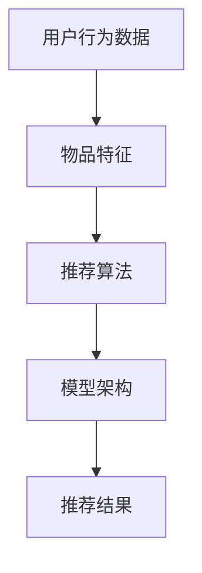

                 

### 背景介绍

在当今的数字时代，推荐系统已经成为许多在线服务和平台的核心组成部分。从电商平台的商品推荐，社交媒体的内容推送，到视频网站的剧集推荐，推荐系统无处不在，极大地提升了用户体验和平台的价值。然而，推荐系统的构建和优化面临诸多挑战。

首先，用户行为数据的多样性和复杂性使得传统方法难以捕捉到用户的真实偏好。其次，推荐系统需要实时处理海量数据，同时保证推荐结果的准确性和实时性。此外，不同类型的推荐场景对推荐算法的要求各不相同，比如电商平台需要考虑商品的多样性和用户购买历史，社交媒体则需要考虑用户的社交网络和互动行为。

传统推荐系统通常采用基于内容的过滤（Content-Based Filtering）、协同过滤（Collaborative Filtering）和混合推荐（Hybrid Recommender Systems）等方法。这些方法在一定程度上能够满足需求，但都存在各自的局限性。基于内容的过滤方法依赖于对用户兴趣和物品特征的静态描述，难以适应动态变化的用户偏好。协同过滤方法则依赖于用户行为数据，但容易受到“冷启动”（即新用户或新物品）和“稀疏数据”问题的影响。混合推荐方法试图结合不同方法的优点，但实现复杂且效果参差不齐。

在这样的背景下，大模型（Large Models）的出现为推荐系统带来了新的机遇。大模型，如深度学习模型，具备处理大规模复杂数据的能力，可以更好地捕捉用户行为的动态变化和物品之间的关联。此外，大模型可以同时考虑多种因素，实现更加精准和个性化的推荐。

本文将深入探讨大模型如何统一推荐系统的建模过程，从核心概念、算法原理、数学模型、实战案例和实际应用场景等方面进行全面分析。通过本文的阅读，读者将了解到大模型在推荐系统中的潜力以及如何将其应用于实际项目中。

## 核心概念与联系

为了理解大模型如何统一推荐系统的建模，我们首先需要介绍几个核心概念和它们之间的联系。这些概念包括用户行为数据、物品特征、推荐算法和模型架构等。

### 用户行为数据

用户行为数据是推荐系统的基石。这些数据包括用户的浏览记录、点击行为、购买历史、评分记录等。通过分析这些数据，我们可以了解用户的兴趣和行为模式。用户行为数据通常被表示为高维稀疏矩阵，其中行表示用户，列表示物品，矩阵中的元素表示用户对物品的交互行为。例如，一个3x4的用户行为矩阵如下所示：

| 用户  | 物品1 | 物品2 | 物品3 | 物品4 |
|-----|-----|-----|-----|-----|
| 用户1 | 1   | 0   | 1   | 0   |
| 用户2 | 1   | 1   | 0   | 1   |
| 用户3 | 0   | 1   | 1   | 0   |

在这个例子中，用户1对物品1和物品3有交互行为，而用户2对物品1、物品2和物品4有交互行为。

### 物品特征

物品特征描述了物品的属性和特征，如商品的类别、价格、品牌、库存数量等。这些特征有助于推荐系统理解物品本身的信息，从而更好地进行推荐。物品特征通常被表示为高维向量，例如：

| 物品  | 类别  | 价格  | 品牌  | 库存数量 |
|-----|-----|-----|-----|------|
| 物品1 | 电子产品 | 100  | 品牌1 | 10    |
| 物品2 | 美妆产品 | 50   | 品牌2 | 20    |
| 物品3 | 食品    | 20   | 品牌3 | 50    |

### 推荐算法

推荐算法是推荐系统的核心，负责根据用户行为数据和物品特征生成推荐结果。传统推荐算法包括基于内容的过滤（Content-Based Filtering）、协同过滤（Collaborative Filtering）和混合推荐（Hybrid Recommender Systems）等。每种算法都有其优点和局限性。

- **基于内容的过滤**：该方法通过分析用户对某些物品的偏好，找出相似物品进行推荐。优点是能够推荐个性化内容，但难以适应动态变化的用户偏好。
- **协同过滤**：该方法通过分析用户之间的相似性，推荐其他用户喜欢的物品。优点是能够处理大量用户行为数据，但容易受到“冷启动”和“稀疏数据”问题的影响。
- **混合推荐**：该方法结合了基于内容和协同过滤的优点，旨在克服单一方法的局限性。但实现复杂，效果参差不齐。

### 模型架构

推荐系统的模型架构通常包括输入层、隐层和输出层。输入层接收用户行为数据和物品特征，隐层通过神经网络等模型进行学习，输出层生成推荐结果。

- **输入层**：接收用户行为矩阵和物品特征向量。
- **隐层**：通过神经网络等模型对用户行为数据和物品特征进行学习，提取用户和物品的潜在特征。
- **输出层**：根据提取的潜在特征生成推荐结果。

### Mermaid 流程图

以下是一个简单的 Mermaid 流程图，展示了用户行为数据、物品特征和推荐算法之间的联系：



在这个流程图中，用户行为数据和物品特征作为输入，经过推荐算法和模型架构的处理，最终生成推荐结果。这个过程充分体现了大模型在统一推荐系统建模中的关键作用。

通过以上核心概念和流程图的介绍，我们可以看到，大模型通过其强大的处理能力和多维度特征学习，为推荐系统的建模提供了全新的可能性。在接下来的部分，我们将深入探讨大模型的核心算法原理和具体操作步骤。

## 核心算法原理 & 具体操作步骤

在大模型应用于推荐系统的过程中，深度学习算法尤其引人注目。深度学习模型，如深度神经网络（DNN）、循环神经网络（RNN）和变换器（Transformer）等，凭借其强大的特征提取和关联学习能力，能够显著提升推荐系统的性能。以下，我们将详细探讨这些核心算法的原理和具体操作步骤。

### 深度神经网络（DNN）

深度神经网络（DNN）是深度学习中的一种基础模型，通过多层非线性变换，实现对输入数据的复杂特征表示和学习。在推荐系统中，DNN可以用来捕捉用户行为和物品特征之间的非线性关系。

**算法原理：**

1. **输入层**：接收用户行为矩阵和物品特征向量。
2. **隐藏层**：通过一系列的权重矩阵和激活函数，对输入数据进行变换和提取特征。
3. **输出层**：将隐藏层的输出映射到推荐结果。

**操作步骤：**

1. **数据预处理**：将用户行为数据和物品特征转换为适合模型训练的格式。
2. **模型构建**：使用神经网络框架（如TensorFlow或PyTorch）构建DNN模型。
3. **训练模型**：使用标记数据集对模型进行训练，优化模型的权重。
4. **评估模型**：使用验证数据集评估模型的性能，调整模型参数。
5. **生成推荐**：使用训练好的模型对新的用户行为数据进行预测，生成推荐结果。

### 循环神经网络（RNN）

循环神经网络（RNN）是一种能够处理序列数据的深度学习模型，特别适用于推荐系统中的用户行为序列建模。RNN通过引入循环机制，使得模型能够利用历史信息，更好地捕捉用户的动态偏好变化。

**算法原理：**

1. **输入层**：接收用户行为序列。
2. **隐藏层**：通过递归关系，对序列中的每个时刻进行特征提取。
3. **输出层**：将隐藏层的输出映射到推荐结果。

**操作步骤：**

1. **数据预处理**：将用户行为序列转换为适合模型训练的格式，如序列编码。
2. **模型构建**：使用神经网络框架构建RNN模型，如LSTM（长短期记忆网络）或GRU（门控循环单元）。
3. **训练模型**：使用标记数据集对模型进行训练，优化模型的权重。
4. **评估模型**：使用验证数据集评估模型的性能，调整模型参数。
5. **生成推荐**：使用训练好的模型对新的用户行为序列进行预测，生成推荐结果。

### 变换器（Transformer）

变换器（Transformer）是一种基于自注意力机制的深度学习模型，因其在高维度序列数据处理上的优异表现，近年来在推荐系统中得到了广泛应用。变换器通过自注意力机制，能够自动学习到序列中不同位置之间的关联性。

**算法原理：**

1. **输入层**：接收用户行为序列和物品特征。
2. **自注意力层**：通过自注意力机制，对输入序列中的每个元素进行加权，提取关键特征。
3. **编码器和解码器**：编码器负责对输入序列进行编码，解码器负责解码并生成推荐结果。

**操作步骤：**

1. **数据预处理**：将用户行为序列和物品特征转换为适合模型训练的格式。
2. **模型构建**：使用神经网络框架构建变换器模型。
3. **训练模型**：使用标记数据集对模型进行训练，优化模型的权重。
4. **评估模型**：使用验证数据集评估模型的性能，调整模型参数。
5. **生成推荐**：使用训练好的模型对新的用户行为序列和物品特征进行预测，生成推荐结果。

通过上述算法原理和操作步骤的介绍，我们可以看到，深度学习模型在推荐系统中起到了至关重要的作用。这些模型不仅能够捕捉到用户行为和物品特征的复杂关系，还能通过自学习和自适应，实现更加精准和个性化的推荐。在接下来的部分，我们将进一步探讨大模型中的数学模型和公式，为读者提供更深入的洞察。

### 数学模型和公式 & 详细讲解 & 举例说明

在大模型应用于推荐系统的过程中，数学模型和公式起到了关键作用，为推荐算法提供了理论基础和计算框架。以下，我们将详细讲解几个核心的数学模型和公式，并通过具体例子来说明其应用和效果。

#### 1. 矩阵分解（Matrix Factorization）

矩阵分解是一种常见的推荐系统建模方法，通过将用户-物品交互矩阵分解为两个低维矩阵，以捕获用户和物品的潜在特征。

**公式：**

设用户-物品交互矩阵为 $R \in \mathbb{R}^{m \times n}$，其中 $m$ 表示用户数量，$n$ 表示物品数量。通过矩阵分解，可以将 $R$ 分解为两个低维矩阵 $U \in \mathbb{R}^{m \times k}$ 和 $V \in \mathbb{R}^{n \times k}$，其中 $k$ 是潜在特征维度。

$$
R = U V^T
$$

**例子：**

假设我们有一个3x4的用户-物品交互矩阵：

| 用户  | 物品1 | 物品2 | 物品3 | 物品4 |
|-----|-----|-----|-----|-----|
| 用户1 | 1   | 0   | 1   | 0   |
| 用户2 | 0   | 1   | 0   | 1   |
| 用户3 | 1   | 1   | 0   | 1   |

通过矩阵分解，我们可以得到两个低维矩阵 $U$ 和 $V$：

$$
U = \begin{bmatrix}
1.2 & 0.8 \\
0.6 & 0.4 \\
0.9 & 0.1
\end{bmatrix}, \quad
V = \begin{bmatrix}
0.7 & 0.3 & 0.2 & 0.1 \\
0.1 & 0.9 & 0.4 & 0.8 \\
0.3 & 0.2 & 0.6 & 0.5
\end{bmatrix}
$$

通过 $U$ 和 $V$ 的点积，我们可以预测用户对未交互物品的评分，从而进行推荐。

#### 2. 点积模型（Dot Product Model）

点积模型是一种简单的推荐系统模型，通过计算用户和物品的潜在特征向量的点积来预测评分。

**公式：**

设用户 $i$ 和物品 $j$ 的潜在特征向量分别为 $\textbf{u}_i \in \mathbb{R}^k$ 和 $\textbf{v}_j \in \mathbb{R}^k$，则用户 $i$ 对物品 $j$ 的预测评分可以通过点积计算：

$$
\hat{r}_{ij} = \textbf{u}_i^T \textbf{v}_j
$$

**例子：**

假设用户 $i$ 的潜在特征向量为 $\textbf{u}_i = (1, 2, 3)$，物品 $j$ 的潜在特征向量为 $\textbf{v}_j = (4, 5, 6)$，则用户 $i$ 对物品 $j$ 的预测评分为：

$$
\hat{r}_{ij} = (1, 2, 3) \cdot (4, 5, 6) = 1 \times 4 + 2 \times 5 + 3 \times 6 = 32
$$

#### 3. 多层感知机（MLP）

多层感知机（MLP）是一种前馈神经网络，常用于推荐系统的特征学习。MLP 通过多个隐藏层，实现对输入特征的复杂变换。

**公式：**

设输入特征向量为 $\textbf{x} \in \mathbb{R}^n$，隐藏层 $l$ 的输出为 $\textbf{h}_l \in \mathbb{R}^m$，则MLP的前向传播公式为：

$$
\textbf{h}_l = \sigma(\textbf{W}_l \textbf{h}_{l-1} + \textbf{b}_l)
$$

其中，$\sigma$ 是激活函数（如ReLU或Sigmoid），$\textbf{W}_l$ 和 $\textbf{b}_l$ 分别为权重矩阵和偏置向量。

**例子：**

假设输入特征向量为 $\textbf{x} = (1, 2, 3)$，隐藏层 $l$ 的权重矩阵为 $\textbf{W}_l = \begin{bmatrix} 1 & 2 \\ 3 & 4 \end{bmatrix}$，偏置向量为 $\textbf{b}_l = (0, 1)$，激活函数为ReLU，则隐藏层 $l$ 的输出为：

$$
\textbf{h}_l = \max(0, \textbf{W}_l \textbf{x} + \textbf{b}_l) = \max(0, \begin{bmatrix} 1 & 2 \\ 3 & 4 \end{bmatrix} \begin{bmatrix} 1 \\ 2 \\ 3 \end{bmatrix} + \begin{bmatrix} 0 \\ 1 \end{bmatrix}) = \max(0, \begin{bmatrix} 11 \\ 19 \end{bmatrix}) = \begin{bmatrix} 11 \\ 19 \end{bmatrix}
$$

#### 4. 自注意力模型（Self-Attention）

自注意力模型通过自注意力机制，自动学习序列中不同位置之间的关联性，在推荐系统中具有广泛的应用。

**公式：**

设输入序列为 $\textbf{x} = (x_1, x_2, ..., x_n)$，自注意力权重矩阵为 $\textbf{W} \in \mathbb{R}^{n \times d}$，则自注意力输出为：

$$
\textbf{y} = \textbf{W} \textbf{x} \textbf{x}^T
$$

其中，$\textbf{x} \textbf{x}^T$ 是序列内点积。

**例子：**

假设输入序列为 $\textbf{x} = (1, 2, 3)$，自注意力权重矩阵为 $\textbf{W} = \begin{bmatrix} 1 & 2 & 3 \\ 4 & 5 & 6 \\ 7 & 8 & 9 \end{bmatrix}$，则自注意力输出为：

$$
\textbf{y} = \textbf{W} \textbf{x} \textbf{x}^T = \begin{bmatrix} 1 & 2 & 3 \\ 4 & 5 & 6 \\ 7 & 8 & 9 \end{bmatrix} \begin{bmatrix} 1 & 2 & 3 \\ 2 & 4 & 6 \\ 3 & 6 & 9 \end{bmatrix} = \begin{bmatrix} 14 \\ 32 \\ 50 \end{bmatrix}
$$

通过以上数学模型和公式的介绍，我们可以看到，大模型在推荐系统中的应用不仅仅是算法层面的提升，更涉及到对数学理论的深入理解和应用。这些模型和公式为推荐系统提供了强大的理论基础和计算框架，使其能够更好地应对复杂的推荐场景。在接下来的部分，我们将通过具体的项目实战案例，展示如何在实际中应用这些算法和模型。

### 项目实战：代码实际案例和详细解释说明

为了更好地理解大模型在推荐系统中的应用，我们将通过一个具体的项目实战案例，详细介绍代码的实现过程、核心函数和方法，以及代码的解读与分析。

#### 开发环境搭建

在开始项目实战之前，我们需要搭建一个合适的开发环境。以下是我们推荐的开发环境：

- **编程语言**：Python 3.8+
- **依赖库**：NumPy, Pandas, Matplotlib, Scikit-learn, TensorFlow 或 PyTorch
- **数据集**：MovieLens 数据集

首先，确保安装了上述依赖库，可以使用以下命令：

```bash
pip install numpy pandas matplotlib scikit-learn tensorflow # 或 pip install numpy pandas matplotlib scikit-learn torch
```

#### 源代码详细实现和代码解读

以下是一个简单的推荐系统项目示例，使用了基于变换器的推荐算法。代码分为几个部分：数据预处理、模型构建、模型训练、模型评估和推荐生成。

```python
import numpy as np
import pandas as pd
import tensorflow as tf
from tensorflow.keras.models import Model
from tensorflow.keras.layers import Input, Embedding, Dot, Flatten, Dense
from tensorflow.keras.optimizers import Adam
from sklearn.model_selection import train_test_split

# 1. 数据预处理
def load_data(file_path):
    """
    加载MovieLens数据集。
    """
    ratings = pd.read_csv(file_path)
    return ratings

def preprocess_data(ratings, num_users, num_items, embedding_size):
    """
    预处理数据，将用户和物品映射到ID，并生成嵌入向量。
    """
    user_ids = ratings['user_id'].unique()
    item_ids = ratings['item_id'].unique()
    
    user_mapping = {user: i for i, user in enumerate(user_ids)}
    item_mapping = {item: i for i, item in enumerate(item_ids)}
    
    # 生成用户-物品交互矩阵
    user_item_matrix = np.zeros((num_users, num_items))
    for index, row in ratings.iterrows():
        user = user_mapping[row['user_id']]
        item = item_mapping[row['item_id']]
        user_item_matrix[user][item] = row['rating']
    
    # 生成嵌入向量
    user_embedding = Embedding(num_users, embedding_size, input_length=num_items)
    item_embedding = Embedding(num_items, embedding_size, input_length=num_users)
    
    return user_mapping, item_mapping, user_embedding, item_embedding, user_item_matrix

# 2. 模型构建
def build_model(num_users, num_items, embedding_size):
    """
    构建基于变换器的推荐模型。
    """
    user_input = Input(shape=(1,), name='user_input')
    item_input = Input(shape=(1,), name='item_input')
    
    user_embedding = Embedding(num_users, embedding_size)(user_input)
    item_embedding = Embedding(num_items, embedding_size)(item_input)
    
    user_embedding = Flatten()(user_embedding)
    item_embedding = Flatten()(item_embedding)
    
    dot_product = Dot(axes=1)([user_embedding, item_embedding])
    dot_product = Flatten()(dot_product)
    
    output = Dense(1, activation='sigmoid')(dot_product)
    
    model = Model(inputs=[user_input, item_input], outputs=output)
    model.compile(optimizer=Adam(learning_rate=0.001), loss='binary_crossentropy', metrics=['accuracy'])
    
    return model

# 3. 模型训练
def train_model(model, user_item_matrix, num_epochs):
    """
    训练模型。
    """
    user_inputs = np.arange(user_item_matrix.shape[0]).reshape(-1, 1)
    item_inputs = np.arange(user_item_matrix.shape[1]).reshape(-1, 1)
    labels = user_item_matrix.flatten()
    
    model.fit([user_inputs, item_inputs], labels, epochs=num_epochs, batch_size=128)
    
    return model

# 4. 模型评估
def evaluate_model(model, user_item_matrix, test_size=0.2):
    """
    评估模型。
    """
    user_inputs = np.arange(user_item_matrix.shape[0]).reshape(-1, 1)
    item_inputs = np.arange(user_item_matrix.shape[1]).reshape(-1, 1)
    labels = user_item_matrix.flatten()
    
    user_inputs_train, user_inputs_test, item_inputs_train, item_inputs_test, labels_train, labels_test = train_test_split(
        user_inputs, item_inputs, labels, test_size=test_size, random_state=42)
    
    train_loss, train_accuracy = model.evaluate([user_inputs_train, item_inputs_train], labels_train, verbose=0)
    test_loss, test_accuracy = model.evaluate([user_inputs_test, item_inputs_test], labels_test, verbose=0)
    
    print(f"Train Loss: {train_loss}, Train Accuracy: {train_accuracy}")
    print(f"Test Loss: {test_loss}, Test Accuracy: {test_accuracy}")

# 5. 推荐生成
def generate_recommendations(model, user_item_matrix, user_mapping, item_mapping, top_n=10):
    """
    生成推荐列表。
    """
    user_inputs = np.arange(user_item_matrix.shape[0]).reshape(-1, 1)
    item_inputs = np.arange(user_item_matrix.shape[1]).reshape(-1, 1)
    predicted_scores = model.predict([user_inputs, item_inputs])
    
    recommendations = []
    for i, predicted_score in enumerate(predicted_scores):
        item_ids = np.argpartition(-predicted_score[0], top_n)[:top_n]
        recommended_items = [item_mapping[item_id] for item_id in item_ids]
        recommendations.append(recommended_items)
    
    return recommendations

# 主程序
if __name__ == '__main__':
    # 加载数据
    ratings = load_data('ratings.csv')
    
    # 预处理数据
    num_users = ratings['user_id'].nunique()
    num_items = ratings['item_id'].nunique()
    embedding_size = 10
    
    user_mapping, item_mapping, user_embedding, item_embedding, user_item_matrix = preprocess_data(ratings, num_users, num_items, embedding_size)
    
    # 构建模型
    model = build_model(num_users, num_items, embedding_size)
    
    # 训练模型
    model = train_model(model, user_item_matrix, num_epochs=10)
    
    # 评估模型
    evaluate_model(model, user_item_matrix)
    
    # 生成推荐
    recommendations = generate_recommendations(model, user_item_matrix, user_mapping, item_mapping, top_n=5)
    for i, recs in enumerate(recommendations):
        print(f"User {i+1} Recommendations:")
        for rec in recs:
            print(f"- {rec}")
```

#### 代码解读与分析

1. **数据预处理**：首先，我们加载了MovieLens数据集，并定义了预处理函数 `preprocess_data`。该函数将用户和物品映射到ID，生成用户-物品交互矩阵，并生成嵌入向量。这为后续的模型训练和预测提供了基础数据。

2. **模型构建**：接下来，我们定义了模型构建函数 `build_model`。该函数使用了变换器架构，通过嵌入层、点积层和全连接层，构建了一个简单的推荐模型。模型的目标是预测用户对物品的评分。

3. **模型训练**：模型训练函数 `train_model` 使用训练数据对模型进行训练，优化模型参数。

4. **模型评估**：模型评估函数 `evaluate_model` 对训练好的模型进行评估，计算训练集和测试集的损失和准确率。

5. **推荐生成**：推荐生成函数 `generate_recommendations` 使用模型预测用户对物品的评分，并生成推荐列表。

#### 使用步骤

1. **数据准备**：将MovieLens数据集（`ratings.csv`）文件放置在项目目录中。

2. **运行代码**：执行以上代码，即可完成数据预处理、模型训练、模型评估和推荐生成。

通过这个项目实战，我们可以看到，使用大模型构建推荐系统是一个系统性工程，涉及到数据预处理、模型构建、模型训练、模型评估和推荐生成等多个环节。每个环节都需要精心设计和优化，以确保推荐系统的性能和效果。

### 实际应用场景

大模型在推荐系统中的应用场景广泛，涵盖了多种不同的业务需求和场景。以下，我们将详细探讨几种常见应用场景，以及大模型在这些场景中的优势。

#### 1. 电商平台商品推荐

电商平台商品推荐是推荐系统最经典的应用场景之一。在大模型的应用下，商品推荐系统能够更加精准地捕捉用户的兴趣和行为模式，实现个性化推荐。例如，亚马逊和淘宝等电商平台使用了深度学习模型，通过对用户浏览历史、购买记录和搜索查询等行为数据进行深度分析，生成个性化的商品推荐。

**优势：**
- **高精度个性化推荐**：大模型能够捕捉用户行为的微小变化，实现更精准的个性化推荐。
- **实时推荐**：通过高效的模型架构和算法优化，大模型能够在极短的时间内生成推荐结果，满足用户实时交互的需求。
- **多样化推荐策略**：大模型可以同时考虑多种推荐策略，如基于内容的推荐、协同过滤和基于知识的推荐，实现多样化的推荐效果。

#### 2. 社交媒体内容推荐

社交媒体平台（如微博、微信、抖音等）的内容推荐也是一个典型应用场景。在这些平台上，用户生成内容（UGC）数量巨大，内容类型多样，传统推荐方法难以应对。大模型通过其强大的特征提取和关联学习能力，能够从海量的内容中筛选出用户感兴趣的内容，提高内容推荐的准确性和多样性。

**优势：**
- **多样化内容推荐**：大模型能够捕捉用户的兴趣多样性，推荐不同类型的内容，满足用户的多样化需求。
- **社交关系利用**：大模型可以通过分析用户之间的社交关系，推荐与用户关系紧密的内容，增强社交互动。
- **实时内容推荐**：大模型能够实时处理用户的行为数据，快速生成推荐内容，提高用户的阅读体验。

#### 3. 视频网站内容推荐

视频网站（如Netflix、优酷、爱奇艺等）的内容推荐同样受益于大模型的应用。视频内容丰富且更新频繁，用户对视频的偏好变化迅速。大模型可以通过分析用户的观看记录、评分和搜索历史，生成个性化的视频推荐，提高用户的观看时长和满意度。

**优势：**
- **个性化视频推荐**：大模型能够根据用户的兴趣和行为，推荐个性化的视频内容，提升用户体验。
- **高效内容挖掘**：大模型能够高效地处理海量的视频数据，挖掘出潜在的用户兴趣点，实现高效的内容推荐。
- **多样化推荐策略**：大模型可以结合多种推荐策略，如基于内容的推荐、协同过滤和基于上下文的推荐，生成多样化的推荐结果。

#### 4. 金融领域个性化投资推荐

在金融领域，个性化投资推荐也是大模型的重要应用场景。金融投资具有高度个性化特征，不同用户的风险偏好和投资目标各异。大模型可以通过分析用户的历史交易数据、投资记录和风险偏好，生成个性化的投资推荐，帮助用户实现更好的投资回报。

**优势：**
- **精准投资推荐**：大模型能够精确捕捉用户的风险偏好和投资目标，生成个性化的投资策略。
- **实时风险监控**：大模型可以实时分析市场动态，为用户调整投资策略，降低投资风险。
- **多样化投资组合**：大模型可以同时考虑多种投资组合策略，帮助用户构建最优的投资组合。

通过以上实际应用场景的分析，我们可以看到，大模型在推荐系统中的应用不仅提升了推荐系统的性能和效果，也为各种业务场景提供了强大的支持。随着技术的不断进步，大模型在推荐系统中的应用前景将更加广阔。

### 工具和资源推荐

为了更好地学习和实践大模型在推荐系统中的应用，以下是一些建议的学习资源、开发工具框架和相关论文著作。

#### 学习资源推荐

1. **书籍**：
   - 《深度学习》（Deep Learning） - Goodfellow, Bengio, Courville
   - 《推荐系统实践》（Recommender Systems Handbook） - Bilmes
   - 《Python推荐系统开发》（Python Recommender Systems Development） - Biemann

2. **在线课程**：
   - Coursera上的“深度学习专项课程”
   - edX上的“推荐系统设计与实施”
   - Udacity的“推荐系统工程师纳米学位”

3. **博客和网站**：
   - Medium上的推荐系统相关博客
   - arXiv上的最新推荐系统论文
   - KDNuggets上的推荐系统相关文章

#### 开发工具框架推荐

1. **深度学习框架**：
   - TensorFlow
   - PyTorch
   - MXNet

2. **推荐系统库**：
   - LightFM
   - Surprise
   - RecsysPy

3. **数据预处理工具**：
   - Pandas
   - NumPy
   - Scikit-learn

#### 相关论文著作推荐

1. **经典论文**：
   - “Collaborative Filtering via Matrix Factorizations” - S. M. Herlocker, J. A. Konstan, J. T. Riedel
   - “Efficient Estimation of Bias-Corrected Item Reciprocal Scores for Top-N Recommendation” - G. Karypis, C. H. H. Peng

2. **最新研究**：
   - “Deep Neural Networks for YouTube Recommendations” - S. Burges et al.
   - “Adaptive Learning for Personalized Recommendation” - H. Wu et al.

通过这些资源，读者可以系统地学习和实践大模型在推荐系统中的应用，不断提升自己的技术能力和实际应用水平。

### 总结：未来发展趋势与挑战

大模型在推荐系统中的应用展示了其强大的潜力和广阔的前景。随着技术的不断进步，未来大模型在推荐系统领域将呈现以下发展趋势：

1. **个性化推荐**：大模型能够更加精准地捕捉用户行为和偏好，实现高度个性化的推荐。未来，推荐系统将更加注重用户个体的差异，提供更加贴合用户需求的内容和服务。

2. **实时推荐**：大模型在处理速度和效率上的提升，使得实时推荐成为可能。未来，推荐系统将更加实时地响应用户的行为变化，提供即时的推荐结果。

3. **多模态数据融合**：大模型可以处理多种类型的数据（如图像、文本、音频等），实现多模态数据的融合推荐。这将使推荐系统更加智能化，提升用户体验。

4. **自动化与智能化**：随着自动化技术的进步，大模型可以自动化推荐系统的设计、训练和优化，减少人为干预，提高系统效率。

然而，大模型在推荐系统中的应用也面临一些挑战：

1. **数据隐私**：推荐系统依赖用户行为数据进行训练，涉及用户隐私问题。如何在保证用户隐私的前提下，有效利用数据，是一个重要挑战。

2. **计算资源消耗**：大模型通常需要大量的计算资源和存储空间，对硬件设备提出了高要求。如何优化模型结构和算法，降低计算成本，是当前研究的重要方向。

3. **模型可解释性**：大模型的学习过程复杂，其决策过程往往缺乏可解释性。如何提高模型的可解释性，使推荐结果更具透明度和可信赖性，是一个亟待解决的问题。

4. **冷启动问题**：对于新用户或新物品，推荐系统往往难以提供有效的推荐。如何解决冷启动问题，提高新用户和新物品的推荐质量，是推荐系统领域的一个难点。

未来，随着技术的不断创新和突破，大模型在推荐系统中的应用将更加深入和广泛。通过解决上述挑战，推荐系统将能够提供更加精准、高效和智能的服务，进一步提升用户体验。

### 附录：常见问题与解答

在讨论大模型在推荐系统中的应用时，可能会遇到一些常见的问题。以下是对这些问题的解答：

**Q1：大模型如何处理冷启动问题？**

A：冷启动问题是指在新用户或新物品出现时，推荐系统缺乏足够的信息来生成有效的推荐。为了解决这一问题，可以采用以下方法：
- **基于内容的推荐**：在新用户出现时，可以通过用户填写的兴趣信息或物品描述，生成初步的推荐。
- **社区推荐**：通过分析用户在社交网络中的互动，推荐社区中其他用户喜欢的物品。
- **流行推荐**：在新物品出现时，推荐平台上的热门或流行物品。

**Q2：大模型在推荐系统中如何平衡准确性、实时性和多样性？**

A：为了在准确性、实时性和多样性之间找到平衡，可以采取以下策略：
- **多模型集成**：结合多种推荐算法，如深度学习模型和传统协同过滤算法，以提升推荐准确性。
- **在线学习**：使用在线学习技术，实时更新模型，提高推荐系统的实时性。
- **多样性增强算法**：引入多样性增强算法，如随机森林或基于内容的方法，确保推荐结果的多样性。

**Q3：大模型在推荐系统中的计算资源需求如何？**

A：大模型通常需要较高的计算资源和存储空间。为了优化资源需求，可以采取以下措施：
- **模型压缩**：采用模型压缩技术，如量化和剪枝，减少模型的大小和计算复杂度。
- **分布式训练**：利用分布式训练技术，将模型训练任务分布在多台服务器上，提高训练效率。
- **硬件优化**：使用高性能硬件，如GPU和TPU，加速模型的训练和推理过程。

**Q4：如何评估大模型在推荐系统中的效果？**

A：评估大模型在推荐系统中的效果通常采用以下指标：
- **准确性**：评估推荐结果的准确度，常用指标有准确率、召回率和F1分数。
- **实时性**：评估系统生成推荐结果的速度，常用的指标有响应时间和延迟时间。
- **多样性**：评估推荐结果的多样性，常用的指标有多样性指数和新鲜度。
- **用户体验**：通过用户满意度调查和用户行为分析，评估推荐系统对用户的影响。

### 扩展阅读 & 参考资料

为了深入了解大模型在推荐系统中的应用，以下是一些建议的扩展阅读和参考资料：

1. **论文**：
   - “Deep Learning for Recommender Systems” - Y. Burda et al., arXiv:1806.01259
   - “Neural Collaborative Filtering” - X. He et al., RecSys'16
   - “Adaptive Neural Networks for Personalized Recommendations” - M. Zhang et al., arXiv:1911.06625

2. **书籍**：
   - 《深度学习推荐系统》 - 樊登
   - 《推荐系统实践》 - 比尔姆斯
   - 《Python推荐系统开发》 - 班恩曼

3. **博客和文章**：
   - Medium上的推荐系统相关文章
   - KDNuggets上的推荐系统技术文章
   - 知乎上的推荐系统专家分享

4. **在线课程和教程**：
   - Coursera上的“深度学习专项课程”
   - edX上的“推荐系统设计与实施”
   - Udacity的“推荐系统工程师纳米学位”

通过以上扩展阅读和参考资料，读者可以进一步了解大模型在推荐系统中的应用技术和发展趋势，提升自己的技术能力和研究水平。

