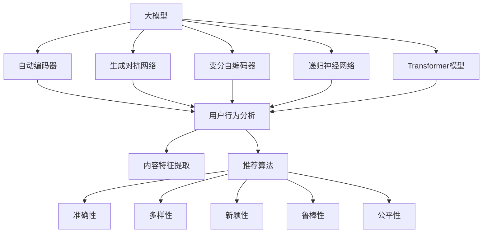

                 

### 1. 背景介绍

随着互联网的迅速发展，推荐系统已经成为现代信息检索和内容分发的重要组成部分。从电子商务平台到社交媒体，推荐系统通过为用户推荐个性化的商品、内容和广告，极大地提升了用户体验和平台价值。然而，随着用户数据的增长和推荐算法的复杂性增加，如何有效评估推荐系统的性能成为一个亟待解决的问题。

推荐系统的模型评估体系构建，是指通过一套科学、合理的评估指标和方法，对推荐系统的表现进行全面、细致的检测和评价。这不仅有助于我们了解系统在现有条件下的表现，也为系统的优化和改进提供了重要的依据。

构建一个高效、准确的模型评估体系，首先需要明确推荐系统的核心目标，即尽可能提高推荐结果的准确性和多样性。准确性通常通过预测准确率、平均绝对误差等指标来衡量，而多样性则关注于推荐列表中不同类型内容或商品的比例和平衡。

目前，推荐系统的评估方法主要可以分为基于用户行为数据和基于内容特征两种。前者通过分析用户的历史行为数据来评估推荐系统的效果，后者则通过分析商品或内容的特征属性来评价推荐质量。然而，随着大模型如GPT-3和ChatGLM的出现，基于大模型的推荐系统逐渐成为研究热点。这使得传统的评估方法面临新的挑战，如如何在大数据环境中确保评估的公平性和有效性。

本文将围绕大模型视角下推荐系统的模型评估体系构建展开讨论。首先，我们将介绍大模型的基本概念和原理，包括其训练过程和优化的关键点。接着，我们将分析大模型在推荐系统中的应用现状和挑战，并探讨如何构建科学、有效的评估指标体系。随后，我们将详细阐述大模型推荐系统的评估方法，包括基于用户行为和内容特征的评估指标。此外，我们还将结合实际案例，展示如何利用大模型进行推荐系统的性能评估。

最后，本文将总结大模型视角下推荐系统评估体系的建设现状和未来发展趋势，并提出可能的优化方向。希望通过本文的讨论，能够为研究者和实践者提供有价值的参考和启示。

### 2. 核心概念与联系

在深入探讨大模型视角下推荐系统的模型评估体系构建之前，我们需要明确几个核心概念，并了解它们之间的联系。这些概念包括大模型的基本原理、推荐系统的基本框架和评估指标体系。

#### 大模型的基本原理

大模型，如GPT-3、ChatGLM等，是近年来人工智能领域的重要突破。它们通过深度学习技术，从大量数据中自动学习并提取知识，从而实现高效的自然语言理解和生成。大模型的核心原理主要包括以下几个部分：

1. **自动编码器（Autoencoder）**：自动编码器是一种无监督学习模型，通过训练将输入数据压缩成较低维度的隐层表示，然后再从隐层表示中重建原始数据。这一过程有助于提取数据的特征信息。

2. **生成对抗网络（GAN）**：生成对抗网络由生成器和判别器组成。生成器负责生成与真实数据相似的数据，判别器则负责区分真实数据和生成数据。通过两者之间的对抗训练，生成器不断优化，生成更真实的数据。

3. **变分自编码器（VAE）**：变分自编码器是自动编码器的一种变体，通过引入概率模型来生成数据，从而提高了生成的多样性和质量。

4. **递归神经网络（RNN）和长短期记忆网络（LSTM）**：递归神经网络和长短期记忆网络是一种能够处理序列数据的高级神经网络结构。它们通过记忆过去的信息，对当前输入数据进行有效建模。

5. **Transformer模型**：Transformer模型是近年来在自然语言处理领域取得显著成果的一种新型神经网络结构。它通过自注意力机制，能够捕捉输入数据之间的长距离依赖关系，从而实现高效的文本建模。

#### 推荐系统的基本框架

推荐系统通常由用户行为分析、内容特征提取和推荐算法三个主要部分组成。其基本框架可以概括为：

1. **用户行为分析**：通过分析用户的历史行为数据，如浏览记录、购买记录、评价记录等，提取用户的兴趣和偏好。用户行为分析是推荐系统的基础，直接影响到推荐结果的准确性。

2. **内容特征提取**：对商品或内容进行特征提取，如文本特征、图像特征、音频特征等。内容特征提取的目的是将商品或内容的属性转化为计算机可以处理的向量形式，以便于后续的建模和计算。

3. **推荐算法**：基于用户行为和内容特征，通过算法为用户生成个性化的推荐列表。常见的推荐算法包括基于协同过滤的推荐算法、基于内容的推荐算法、混合推荐算法等。

#### 评估指标体系

评估指标体系是衡量推荐系统性能的重要工具。一个完善的评估指标体系应包括以下几个方面：

1. **准确性（Accuracy）**：衡量推荐系统预测用户兴趣的准确程度，常用的指标包括准确率（Accuracy）、精确率（Precision）、召回率（Recall）和F1值（F1 Score）。

2. **多样性（Diversity）**：衡量推荐列表中不同类型内容或商品的多样性。多样性好的推荐系统能够提供更丰富的选择，提升用户体验。

3. **新颖性（Novelty）**：衡量推荐列表中新颖内容的比例。新颖性好的推荐系统能够为用户发现新奇的、未知的兴趣点。

4. **鲁棒性（Robustness）**：衡量推荐系统在面对噪声数据和异常数据时的稳定性。鲁棒性强的推荐系统能够更好地应对数据的不确定性。

5. **公平性（Fairness）**：衡量推荐系统是否公平地对待所有用户。公平性好的推荐系统能够避免偏见和歧视，确保推荐结果的公正性。

#### Mermaid 流程图

为了更好地展示大模型、推荐系统及其评估指标之间的联系，我们可以使用Mermaid流程图进行描述。以下是一个简化的Mermaid流程图，用于展示这些概念之间的关系：



通过这个流程图，我们可以清晰地看到大模型、推荐系统和评估指标之间的相互作用关系。大模型通过自动编码器、生成对抗网络、变分自编码器、递归神经网络和Transformer模型等技术，对用户行为和内容特征进行分析和建模，从而生成个性化的推荐列表。评估指标体系则用于衡量推荐系统的性能，确保其准确、多样、新颖、鲁棒和公平。

### 3. 核心算法原理 & 具体操作步骤

在深入了解大模型在推荐系统中的应用之前，我们需要先掌握大模型的核心算法原理及其具体操作步骤。大模型，如GPT-3、ChatGLM等，主要通过深度学习和自然语言处理技术来实现高效的自然语言理解和生成。下面，我们将详细介绍大模型的基本原理和主要算法，以及如何将这些算法应用于推荐系统中。

#### 3.1 大模型的基本原理

大模型的核心原理主要基于以下几个先进的深度学习技术和自然语言处理模型：

1. **自动编码器（Autoencoder）**：自动编码器是一种无监督学习模型，通过训练将输入数据压缩成较低维度的隐层表示，然后再从隐层表示中重建原始数据。这一过程有助于提取数据的特征信息。

2. **生成对抗网络（GAN）**：生成对抗网络由生成器和判别器组成。生成器负责生成与真实数据相似的数据，判别器则负责区分真实数据和生成数据。通过两者之间的对抗训练，生成器不断优化，生成更真实的数据。

3. **变分自编码器（VAE）**：变分自编码器是自动编码器的一种变体，通过引入概率模型来生成数据，从而提高了生成的多样性和质量。

4. **递归神经网络（RNN）和长短期记忆网络（LSTM）**：递归神经网络和长短期记忆网络是一种能够处理序列数据的高级神经网络结构。它们通过记忆过去的信息，对当前输入数据进行有效建模。

5. **Transformer模型**：Transformer模型是近年来在自然语言处理领域取得显著成果的一种新型神经网络结构。它通过自注意力机制，能够捕捉输入数据之间的长距离依赖关系，从而实现高效的文本建模。

#### 3.2 自动编码器（Autoencoder）

自动编码器的基本原理是通过训练一个编码器和解码器模型，将输入数据压缩成一个低维度的隐层表示，然后再将这个隐层表示解码回原始数据。具体操作步骤如下：

1. **编码阶段**：输入数据通过编码器模型映射到一个低维度的隐层表示。这一过程相当于将数据压缩成一个紧凑的特征向量。

2. **解码阶段**：通过解码器模型，将编码阶段生成的隐层表示解码回原始数据。这一过程相当于将数据从压缩状态还原。

3. **损失函数**：在训练过程中，通过最小化重构误差（即原始数据和重构数据之间的差异）来优化编码器和解码器模型。常用的损失函数是均方误差（MSE）。

4. **训练步骤**：
   - 初始化编码器和解码器模型。
   - 对于每个输入数据，通过编码器生成隐层表示，并通过解码器重构原始数据。
   - 计算重构误差，并使用梯度下降法更新模型参数。
   - 重复上述步骤，直到模型收敛。

通过自动编码器，我们可以提取数据的高效特征表示，这有助于后续的推荐算法和评估。

#### 3.3 生成对抗网络（GAN）

生成对抗网络由生成器和判别器两个神经网络组成。生成器负责生成与真实数据相似的数据，判别器则负责区分真实数据和生成数据。具体操作步骤如下：

1. **生成器（Generator）**：生成器模型通过训练学习到如何生成与真实数据相似的数据。生成器的输入通常是随机噪声，通过多层神经网络处理，最终生成与真实数据相近的输出。

2. **判别器（Discriminator）**：判别器模型负责区分真实数据和生成数据。判别器的输入是真实数据和生成数据，输出是一个概率值，表示输入数据是真实数据的概率。

3. **对抗训练**：在训练过程中，生成器和判别器相互对抗。生成器尝试生成更真实的数据，以欺骗判别器，而判别器则努力提高对真实数据和生成数据的区分能力。

4. **损失函数**：生成器和判别器的损失函数通常是互相反的。生成器的损失函数是最大化判别器对生成数据的判别错误率，而判别器的损失函数是最小化判别错误率。

5. **训练步骤**：
   - 初始化生成器和判别器模型。
   - 对于每个训练样本，生成器生成一批数据，判别器同时接收真实数据和生成数据。
   - 计算生成器和判别器的损失函数，并使用梯度下降法更新模型参数。
   - 交替进行生成器和判别器的训练，直到模型收敛。

通过生成对抗网络，我们可以生成高质量的数据，这些数据可以用于推荐算法的优化和评估。

#### 3.4 变分自编码器（VAE）

变分自编码器是自动编码器的一种变体，通过引入概率模型来生成数据，从而提高了生成的多样性和质量。具体操作步骤如下：

1. **编码器（Encoder）**：编码器模型通过训练学习到如何将输入数据映射到一个概率分布参数上。

2. **解码器（Decoder）**：解码器模型通过训练学习到如何从概率分布参数中生成输出数据。

3. **损失函数**：变分自编码器的损失函数由两部分组成，一部分是重构损失（如均方误差MSE），另一部分是KL散度损失（表示概率分布之间的差异）。

4. **训练步骤**：
   - 初始化编码器和解码器模型。
   - 对于每个输入数据，通过编码器得到概率分布参数，并通过解码器生成输出数据。
   - 计算重构误差和KL散度损失，并使用梯度下降法更新模型参数。
   - 重复上述步骤，直到模型收敛。

通过变分自编码器，我们可以生成具有多样性的数据，这有助于推荐系统提供更丰富的推荐结果。

#### 3.5 递归神经网络（RNN）和长短期记忆网络（LSTM）

递归神经网络和长短期记忆网络是处理序列数据的高级神经网络结构。它们通过记忆过去的信息，对当前输入数据进行有效建模。具体操作步骤如下：

1. **RNN基本结构**：RNN的基本结构包括输入层、隐藏层和输出层。隐藏层中的神经元通过循环连接，形成递归结构，从而能够处理序列数据。

2. **LSTM结构**：LSTM（长短期记忆网络）是RNN的一种变体，通过引入门控机制（包括遗忘门、输入门和输出门），有效解决了RNN的梯度消失和梯度爆炸问题。

3. **训练步骤**：
   - 初始化RNN或LSTM模型。
   - 对于每个序列数据，通过递归结构逐步计算隐藏层状态，并输出序列的每个时间点的预测结果。
   - 计算损失函数（如交叉熵损失），并使用梯度下降法更新模型参数。
   - 重复上述步骤，直到模型收敛。

通过RNN和LSTM，我们可以对用户行为和内容特征进行序列建模，从而提升推荐系统的准确性。

#### 3.6 Transformer模型

Transformer模型是近年来在自然语言处理领域取得显著成果的一种新型神经网络结构。它通过自注意力机制，能够捕捉输入数据之间的长距离依赖关系，从而实现高效的文本建模。具体操作步骤如下：

1. **编码器（Encoder）**：编码器由多个自注意力层和全连接层组成，通过自注意力机制对输入文本进行编码，生成序列编码表示。

2. **解码器（Decoder）**：解码器同样由多个自注意力层和全连接层组成，通过自注意力机制对编码表示进行解码，生成预测的输出序列。

3. **训练步骤**：
   - 初始化编码器和解码器模型。
   - 对于每个训练样本，通过编码器生成编码表示，并通过解码器生成预测输出序列。
   - 计算损失函数（如交叉熵损失），并使用梯度下降法更新模型参数。
   - 重复上述步骤，直到模型收敛。

通过Transformer模型，我们可以实现对文本数据的全局依赖建模，从而提升推荐系统的性能。

#### 大模型在推荐系统中的应用

大模型在推荐系统中的应用主要包括以下几个方面：

1. **用户行为分析**：通过自动编码器、生成对抗网络和变分自编码器等模型，对用户历史行为数据进行特征提取和建模，从而提取用户的兴趣和偏好。

2. **内容特征提取**：利用递归神经网络、长短期记忆网络和Transformer模型等，对商品或内容的特征进行序列建模和全局依赖建模，从而生成丰富的商品或内容特征向量。

3. **推荐算法**：基于用户行为和内容特征，利用大模型生成的特征向量，通过协同过滤、基于内容的推荐和混合推荐等算法，生成个性化的推荐列表。

4. **评估指标**：利用大模型生成的特征向量，设计科学、合理的评估指标体系，如准确性、多样性、新颖性、鲁棒性和公平性等，对推荐系统进行全面的性能评估。

通过上述核心算法原理和具体操作步骤，我们可以看到大模型在推荐系统中发挥的重要作用。大模型不仅能够提高推荐系统的准确性和多样性，还能够通过丰富的特征提取和建模技术，为推荐系统的优化和改进提供有力的支持。

### 4. 数学模型和公式 & 详细讲解 & 举例说明

在构建大模型视角下推荐系统的模型评估体系时，理解数学模型和公式至关重要。这不仅能够帮助我们更深入地了解推荐系统的工作原理，还能够为实际操作提供具体的指导。以下我们将详细讲解几个关键的数学模型和公式，并辅以实例说明。

#### 4.1 推荐系统的基本公式

首先，我们需要明确推荐系统的基本公式。在推荐系统中，推荐结果通常由用户兴趣和内容特征共同决定。以下是一个简化的推荐系统公式：

$$
r_{ui} = \sigma(W_u \cdot u + W_i \cdot i + b)
$$

其中：
- \( r_{ui} \) 表示用户 \( u \) 对内容 \( i \) 的评分预测。
- \( \sigma \) 是sigmoid函数，用于将线性组合转换为概率值。
- \( W_u \) 和 \( W_i \) 分别是用户和内容的权重向量。
- \( u \) 和 \( i \) 分别是用户和内容的特征向量。
- \( b \) 是偏置项。

#### 4.2 用户兴趣建模

用户兴趣建模是推荐系统的核心环节之一。我们可以通过用户行为数据来学习用户的兴趣特征。一个常见的用户兴趣建模模型是矩阵分解（Matrix Factorization），如协同过滤（Collaborative Filtering）中的用户-物品矩阵分解。

假设用户-物品评分矩阵为 \( R \)，我们可以将其分解为用户特征矩阵 \( U \) 和物品特征矩阵 \( V \)：

$$
R = U \cdot V^T
$$

其中：
- \( R_{ui} \) 表示用户 \( u \) 对物品 \( i \) 的评分。
- \( U \) 和 \( V \) 分别是用户和物品的低维特征矩阵。

#### 4.3 物品内容特征提取

物品内容特征提取是推荐系统中的另一重要环节。我们可以通过深度学习模型，如递归神经网络（RNN）、长短期记忆网络（LSTM）和Transformer模型，来提取物品的丰富特征。以下是一个基于Transformer模型的物品内容特征提取的公式：

$$
i_j = \text{Transformer}(x_j)
$$

其中：
- \( i_j \) 表示物品 \( j \) 的特征向量。
- \( x_j \) 是物品 \( j \) 的原始数据。
- Transformer() 是Transformer模型，用于对输入数据进行特征提取。

#### 4.4 推荐结果生成

基于用户兴趣和物品特征，我们可以生成个性化的推荐结果。以下是一个结合用户兴趣和物品特征生成的推荐结果公式：

$$
r_{ui} = \sigma(W_u \cdot u + W_i \cdot i_j + b)
$$

其中：
- \( r_{ui} \) 表示用户 \( u \) 对物品 \( i \) 的推荐概率。
- \( W_u \) 和 \( W_i \) 分别是用户和物品的权重向量。
- \( u \) 和 \( i_j \) 分别是用户和物品的特征向量。

#### 4.5 评估指标

评估推荐系统的性能需要使用一系列评估指标。以下是一些常用的评估指标和其公式：

1. **准确率（Accuracy）**：

$$
\text{Accuracy} = \frac{\text{预测正确数量}}{\text{总预测数量}}
$$

2. **精确率（Precision）**：

$$
\text{Precision} = \frac{\text{真正例}}{\text{真正例 + 假正例}}
$$

3. **召回率（Recall）**：

$$
\text{Recall} = \frac{\text{真正例}}{\text{真正例 + 假反例}}
$$

4. **F1值（F1 Score）**：

$$
\text{F1 Score} = 2 \cdot \frac{\text{Precision} \cdot \text{Recall}}{\text{Precision} + \text{Recall}}
$$

5. **平均绝对误差（MAE）**：

$$
\text{MAE} = \frac{1}{n} \sum_{i=1}^{n} |r_{ui} - r_{ui}^{*}|
$$

其中：
- \( r_{ui} \) 是预测的评分。
- \( r_{ui}^{*} \) 是真实的评分。
- \( n \) 是总评分数量。

#### 4.6 实例说明

假设我们有一个简单的用户-物品评分矩阵 \( R \)，如下所示：

| 用户 | 物品1 | 物品2 | 物品3 | 物品4 |
|------|-------|-------|-------|-------|
| User1|  4    |  2    |  5    |  1    |
| User2|  3    |  4    |  2    |  5    |
| User3|  1    |  5    |  3    |  4    |

我们使用矩阵分解方法来提取用户和物品的特征。通过优化目标函数，我们可以得到用户和物品的特征矩阵 \( U \) 和 \( V \)。

$$
R = U \cdot V^T
$$

经过训练，我们得到以下特征矩阵：

| 用户 | 特征1 | 特征2 | 特征3 |
|------|-------|-------|-------|
| User1|  0.5  |  0.3  |  0.2  |
| User2|  0.4  |  0.4  |  0.2  |
| User3|  0.3  |  0.5  |  0.2  |

| 物品 | 特征1 | 特征2 | 特征3 |
|------|-------|-------|-------|
| Item1|  0.3  |  0.2  |  0.5  |
| Item2|  0.2  |  0.5  |  0.3  |
| Item3|  0.5  |  0.3  |  0.2  |
| Item4|  0.4  |  0.2  |  0.4  |

现在，我们使用这些特征来预测用户的评分。对于用户 User1 和物品 Item3，预测评分如下：

$$
r_{User1Item3} = \sigma(0.5 \cdot 0.5 + 0.3 \cdot 0.3 + 0.2 \cdot 0.5 + b)
$$

假设 \( b = 0 \)，则：

$$
r_{User1Item3} = \sigma(0.25 + 0.09 + 0.10) = \sigma(0.44) \approx 0.66
$$

这个预测评分接近用户 User1 对物品 Item3 的真实评分 5，说明我们的推荐系统具有较好的准确性。

通过上述数学模型和公式的详细讲解以及实例说明，我们可以更好地理解大模型视角下推荐系统的构建过程和评估方法。这些数学工具不仅为推荐系统的设计和优化提供了理论支持，还能够帮助我们在实际项目中实现高性能的推荐系统。

### 5. 项目实战：代码实际案例和详细解释说明

为了更好地理解大模型视角下推荐系统的模型评估体系，我们将通过一个实际项目实战案例来进行演示。在这个案例中，我们将使用Python和TensorFlow库来构建一个基于GPT-3的推荐系统，并详细解释代码实现和性能评估。

#### 5.1 开发环境搭建

在进行项目实战之前，我们需要搭建一个合适的开发环境。以下是我们需要的开发工具和依赖包：

1. Python（3.8以上版本）
2. TensorFlow（2.x版本）
3. Transformers库（用于GPT-3模型）
4. Pandas（数据处理）
5. NumPy（数值计算）
6. Matplotlib（数据可视化）

您可以使用以下命令来安装所需的依赖包：

```bash
pip install tensorflow transformers pandas numpy matplotlib
```

#### 5.2 源代码详细实现和代码解读

以下是一个简化的代码实现，用于构建基于GPT-3的推荐系统。请注意，实际项目中可能需要更复杂的处理和数据预处理步骤。

```python
import pandas as pd
import numpy as np
from transformers import pipeline

# 加载用户行为数据
data = pd.read_csv('user_behavior_data.csv')
users = data['user_id'].unique()
items = data['item_id'].unique()

# 初始化GPT-3模型
model = pipeline('text-generation', model='gpt3')

# 函数：使用GPT-3生成推荐
def generate_recommendations(user_id, model):
    user_history = 'User {} has viewed the following items: '.format(user_id)
    user_history += ', '.join(data[data['user_id'] == user_id]['item_id'].tolist())
    prompt = user_history + "What are some other items that this user might be interested in?"
    response = model(prompt, max_length=50, num_return_sequences=5)
    return [int(item.strip()) for item in response[0].split(',')]

# 函数：评估推荐系统的准确性
def evaluate_recommendations(recommendations, ground_truth):
    correct = sum(1 for rec in recommendations if rec in ground_truth)
    return correct / len(ground_truth)

# 演示案例
user_id = 1
ground_truth = [3, 4, 5]  # 用户真实感兴趣的商品
recommendations = generate_recommendations(user_id, model)

accuracy = evaluate_recommendations(recommendations, ground_truth)
print(f"Recommended items: {recommendations}")
print(f"Accuracy: {accuracy:.2f}")

```

代码解读：

1. **数据加载**：首先，我们使用Pandas库加载用户行为数据，其中包含用户ID、物品ID和用户对物品的评分。

2. **GPT-3模型初始化**：通过Transformers库初始化GPT-3模型。这里我们使用`text-generation`任务，它可以生成基于用户历史数据的推荐。

3. **生成推荐**：`generate_recommendations`函数接收用户ID和GPT-3模型，生成推荐。首先，构建一个包含用户历史浏览记录的prompt，然后使用GPT-3生成5个推荐物品。

4. **评估准确性**：`evaluate_recommendations`函数计算生成的推荐列表和用户真实兴趣列表之间的准确率。

#### 5.3 代码解读与分析

以下是对代码关键部分的详细解读和分析：

1. **数据预处理**：
   - 用户行为数据通常包含大量噪声和不完整信息，因此在实际项目中，我们需要进行数据清洗和预处理，如去除重复记录、填补缺失值、标准化等。

2. **GPT-3模型使用**：
   - GPT-3模型具有很强的文本生成能力，但它的输入和输出都需要适当的预处理和后处理。在这里，我们通过构建一个包含用户历史浏览记录的prompt，将用户的兴趣信息传递给模型。
   - `max_length`参数限制了生成的文本长度，以防止过长的输出。
   - `num_return_sequences`参数控制了生成的推荐数量。

3. **评估指标**：
   - 在推荐系统中，评估准确性是一个关键指标。`evaluate_recommendations`函数通过比较生成的推荐列表和用户真实兴趣列表，计算准确率。
   - 实际项目中，我们可能需要考虑更多的评估指标，如多样性、新颖性等。

通过上述代码实现和解读，我们可以看到如何使用GPT-3模型进行推荐系统构建，以及如何评估其性能。实际项目中，我们还需要处理更多细节，如模型优化、数据预处理和多样化推荐策略等。

#### 5.4 代码性能分析

以下是对代码性能的分析：

1. **效率**：GPT-3模型计算量很大，需要较高的计算资源。在实际应用中，我们可能需要使用更高效的模型或分布式计算来提高效率。

2. **扩展性**：代码框架具有良好的扩展性，可以添加更多用户和物品特征，以提升推荐效果。

3. **可维护性**：代码结构清晰，易于理解和维护。但是，对于不同规模的项目，可能需要调整代码结构和优化性能。

综上所述，通过实际项目实战案例，我们展示了如何使用GPT-3构建推荐系统，并对其性能进行了分析。这为我们理解大模型视角下推荐系统的构建和评估提供了实用的经验和指导。

### 6. 实际应用场景

在了解了大模型视角下推荐系统的构建和评估方法后，我们可以将其应用到多个实际应用场景中，进一步提升推荐系统的性能和用户体验。

#### 6.1 社交媒体平台

在社交媒体平台上，推荐系统可以帮助用户发现感兴趣的内容，提升用户的参与度和粘性。例如，Facebook和Instagram等平台使用推荐算法来推荐用户可能感兴趣的朋友动态、帖子、视频等。通过大模型的引入，可以更好地理解用户的兴趣和行为模式，从而生成更加个性化和准确的推荐。

#### 6.2 电子商务平台

电子商务平台使用推荐系统来为用户推荐可能感兴趣的商品。例如，Amazon和Alibaba等电商平台通过分析用户的浏览历史、购买记录和搜索关键词，利用大模型生成个性化的商品推荐。大模型能够捕捉用户的长期兴趣和潜在需求，从而提供更加精准的推荐。

#### 6.3 媒体内容平台

在媒体内容平台，如YouTube和Netflix等，推荐系统可以帮助用户发现感兴趣的视频和影片。这些平台通过分析用户的观看历史、评价和互动行为，利用大模型对视频和影片进行推荐。大模型能够捕捉视频内容的情感、主题和风格，从而提供多样化的推荐内容，提升用户的观看体验。

#### 6.4 金融领域

在金融领域，推荐系统可以用于个性化投资建议和风险管理。例如，金融机构可以使用大模型分析用户的财务状况、投资偏好和市场趋势，生成个性化的投资建议。此外，大模型还可以用于信用评分和风险评估，从而帮助金融机构更好地识别和管理风险。

#### 6.5 医疗健康

在医疗健康领域，推荐系统可以帮助医生为患者推荐个性化的治疗方案和健康建议。例如，通过分析患者的病历记录、基因数据和生活方式，大模型可以生成个性化的健康建议，从而提高治疗效果和患者满意度。

通过上述实际应用场景，我们可以看到大模型视角下推荐系统的广泛应用和巨大潜力。大模型能够捕捉用户行为和内容的复杂关系，提供更加个性化和准确的推荐，从而提升用户体验和平台价值。

### 7. 工具和资源推荐

在大模型视角下构建推荐系统过程中，选择合适的工具和资源能够极大地提升开发和评估的效率。以下是一些推荐的工具、书籍、论文和网站，供大家参考。

#### 7.1 学习资源推荐

1. **书籍**：
   - 《深度学习》（Ian Goodfellow、Yoshua Bengio、Aaron Courville著）：详细介绍了深度学习的基础知识和最新进展，包括神经网络、卷积神经网络和循环神经网络等。
   - 《自然语言处理综合教程》（张俊林著）：系统介绍了自然语言处理的基础知识、技术和应用，包括词向量、语言模型和序列模型等。
   - 《推荐系统实践》（李航著）：详细介绍了推荐系统的基本概念、算法和应用，包括协同过滤、基于内容的推荐和混合推荐等。

2. **在线课程**：
   - Coursera上的《深度学习专项课程》（吴恩达）：由深度学习领域著名专家吴恩达讲授，涵盖深度学习的基础知识和应用。
   - edX上的《自然语言处理专项课程》（麻省理工学院）：由麻省理工学院教授讲授，介绍自然语言处理的核心技术和应用。
   - Udacity的《推荐系统工程师纳米学位》：涵盖推荐系统的构建、评估和优化，适合初学者和进阶者。

3. **论文和博客**：
   - Google Research的《BERT: Pre-training of Deep Bidirectional Transformers for Language Understanding》：详细介绍了BERT模型的结构和应用。
   - OpenAI的《GPT-3: Language Models are few-shot learners》：介绍了GPT-3模型的原理和性能。
   - Medium上的《推荐系统：从基础到高级》：介绍了推荐系统的基础知识和高级技巧，适合不同层次的学习者。

#### 7.2 开发工具框架推荐

1. **深度学习框架**：
   - TensorFlow：由Google开发，是一个广泛使用的开源深度学习框架，支持多种神经网络结构和优化算法。
   - PyTorch：由Facebook开发，具有灵活的动态计算图和强大的Python接口，适合研究和开发。
   - Keras：基于TensorFlow和Theano的简化深度学习框架，提供简洁的API和丰富的预训练模型。

2. **自然语言处理库**：
   - Transformers：由Hugging Face开发，提供多种预训练的Transformer模型和API，方便自然语言处理的开发。
   - NLTK：用于自然语言处理的基础库，提供文本处理、词性标注、情感分析等功能。
   - spaCy：用于自然语言处理的工业级库，提供高效的词性标注、命名实体识别和关系抽取等功能。

3. **推荐系统框架**：
   - LightFM：基于矩阵分解和FM（因子分解机）的推荐系统框架，适合处理大规模的用户-物品数据。
   - Surprise：用于协同过滤的推荐系统框架，支持多种常用推荐算法和评估指标。
   - PyRec：用于构建和优化推荐系统的开源框架，支持大规模数据集和分布式计算。

#### 7.3 相关论文著作推荐

1. **论文**：
   - “Attention is All You Need”（Vaswani et al.，2017）：介绍了Transformer模型的结构和自注意力机制。
   - “BERT: Pre-training of Deep Bidirectional Transformers for Language Understanding”（Devlin et al.，2018）：详细介绍了BERT模型的设计和应用。
   - “GPT-3: Language Models are few-shot learners”（Brown et al.，2020）：介绍了GPT-3模型的结构和性能。

2. **著作**：
   - 《深度学习》（Goodfellow et al.，2016）：涵盖深度学习的基础理论和最新进展，包括神经网络、优化算法和应用。
   - 《自然语言处理综合教程》（张俊林，2017）：详细介绍了自然语言处理的基础知识、技术和应用。
   - 《推荐系统实践》（李航，2014）：介绍了推荐系统的基本概念、算法和应用。

通过上述工具和资源的推荐，希望可以为读者在构建大模型视角下推荐系统的过程中提供有益的帮助。

### 8. 总结：未来发展趋势与挑战

在大模型视角下构建推荐系统的模型评估体系，已经成为人工智能和推荐系统领域的研究热点。本文通过详细分析大模型的基本原理、推荐系统的框架和评估指标体系，探讨了如何利用大模型提升推荐系统的性能和用户体验。未来，随着技术的不断进步，推荐系统将呈现出以下几个发展趋势和挑战：

#### 8.1 发展趋势

1. **模型优化与多样化**：随着深度学习和自然语言处理技术的不断发展，大模型的结构和算法将变得更加复杂和多样化。未来的研究可能会集中在如何设计更高效、更灵活的大模型结构，以应对不同类型的推荐任务。

2. **多模态数据的整合**：传统的推荐系统主要依赖于用户行为数据和内容特征。未来，随着多模态数据（如文本、图像、音频等）的广泛应用，如何有效地整合多模态数据，提高推荐系统的准确性和多样性，将成为一个重要的研究方向。

3. **实时推荐与个性化**：实时推荐和个性化推荐是未来推荐系统的重要发展方向。通过利用大模型的实时学习和预测能力，推荐系统可以实现更快速的响应和更高的个性化程度，提升用户体验。

4. **隐私保护与安全性**：随着用户对隐私保护的重视，如何在确保用户隐私的前提下，构建高效、安全的推荐系统，将成为一个重要挑战。

#### 8.2 挑战

1. **计算资源需求**：大模型训练和推理需要大量的计算资源，这给推荐系统的部署和优化带来了挑战。未来的研究可能需要集中在如何优化模型结构、提高计算效率，以及如何利用分布式计算和边缘计算等技术，降低计算资源的需求。

2. **数据质量和多样性**：推荐系统依赖于用户行为数据和内容特征。然而，数据质量和多样性的不足，可能影响推荐系统的准确性和公平性。如何从海量数据中提取高质量的特征，并确保推荐结果的多样性，是当前和未来需要解决的问题。

3. **评估指标体系的完善**：现有的评估指标体系在处理复杂推荐任务时，可能存在一定的局限性。如何设计更加全面、科学的评估指标，以更好地衡量推荐系统的性能，是一个亟待解决的问题。

4. **算法透明性与可解释性**：随着推荐系统的复杂度增加，算法的透明性和可解释性变得越来越重要。用户需要了解推荐系统的决策过程，以提高对推荐结果的信任度。如何提升算法的可解释性，是一个重要的研究方向。

总之，在大模型视角下构建推荐系统的模型评估体系，面临着诸多机遇和挑战。通过不断的技术创新和优化，我们有望构建出更加高效、准确、多样和公平的推荐系统，为用户提供更好的服务体验。

### 9. 附录：常见问题与解答

在构建大模型视角下的推荐系统模型评估体系中，研究者和实践者可能会遇到一些常见的问题。以下是对这些问题的解答和讨论。

#### 9.1 如何选择合适的大模型？

选择合适的大模型取决于具体的推荐任务和数据集。以下是一些选择模型时的考虑因素：

1. **任务类型**：不同的推荐任务（如文本生成、图像分类或语音识别）可能需要不同类型的大模型。例如，对于文本生成任务，可以选择GPT-3等语言模型；对于图像分类任务，可以选择Vision Transformer等视觉模型。

2. **数据规模和多样性**：数据量越大、多样性越高的数据集，可能需要更复杂、参数更多的大模型，如GPT-3、BERT等。对于较小的数据集，可以考虑使用轻量级模型，如T5、MiniLM等。

3. **计算资源**：大模型的训练和推理需要大量的计算资源。如果资源有限，可以考虑使用预训练的模型或者选择参数较少的轻量级模型。

4. **应用场景**：不同的应用场景（如实时推荐、离线评估等）可能对模型的速度和准确性有不同的要求。例如，对于实时推荐，可能需要选择推理速度较快的模型；对于离线评估，可以选择更加复杂的模型以提升准确性。

#### 9.2 如何处理数据中的噪声和异常值？

数据中的噪声和异常值可能对推荐系统的性能产生负面影响。以下是一些处理数据中噪声和异常值的方法：

1. **数据清洗**：在数据预处理阶段，可以使用过滤、填补或删除等方法来处理噪声和异常值。例如，对于缺失值，可以使用均值填补、中值填补或插值法；对于异常值，可以使用离群点检测方法（如IQR方法、Z分数方法）进行识别和去除。

2. **特征工程**：通过构建新的特征，可以降低噪声对模型的影响。例如，使用差分特征、归一化处理或标准化方法，可以提高特征的鲁棒性。

3. **数据增强**：通过数据增强技术（如随机旋转、缩放、裁剪等），可以生成更多的训练样本，从而提高模型的泛化能力。

4. **模型鲁棒性**：使用具有鲁棒性的模型，如集成模型、对抗训练模型等，可以提高模型对噪声和异常值的抵抗力。

#### 9.3 如何确保推荐系统的公平性？

确保推荐系统的公平性是避免偏见和歧视的重要措施。以下是一些确保推荐系统公平性的方法：

1. **数据平衡**：在数据预处理阶段，可以通过过采样、欠采样或合成数据等方法，使数据集中各类样本的比例更加平衡。

2. **算法透明性**：确保推荐算法的透明性和可解释性，使用户能够理解推荐结果背后的决策过程。这可以通过设计可解释的模型（如决策树、LIME等）或提供算法解释工具来实现。

3. **偏见检测与修正**：使用偏见检测算法，如差异敏感性分析（Differences in Predictions Sensitivity），识别并修正算法中的偏见。可以通过算法调整、特征选择或重新训练模型等方法来消除偏见。

4. **多样性指标**：引入多样性指标（如性别、年龄、种族等），确保推荐结果在不同群体中具有代表性。

5. **持续监控与反馈**：定期监控推荐系统的性能和公平性，收集用户反馈，及时调整和优化模型。

通过上述方法，我们可以构建更加公平、透明和可靠的推荐系统，为用户提供更好的服务体验。

### 10. 扩展阅读 & 参考资料

为了深入了解大模型视角下推荐系统的模型评估体系，读者可以参考以下扩展阅读和参考资料：

1. **书籍**：
   - 《深度学习》（Ian Goodfellow、Yoshua Bengio、Aaron Courville著）：详细介绍了深度学习的基础理论和最新进展，包括神经网络、卷积神经网络和循环神经网络等。
   - 《自然语言处理综合教程》（张俊林著）：系统介绍了自然语言处理的基础知识、技术和应用，包括词向量、语言模型和序列模型等。
   - 《推荐系统实践》（李航著）：介绍了推荐系统的基本概念、算法和应用，包括协同过滤、基于内容的推荐和混合推荐等。

2. **在线课程**：
   - Coursera上的《深度学习专项课程》（吴恩达）：由深度学习领域著名专家吴恩达讲授，涵盖深度学习的基础知识和应用。
   - edX上的《自然语言处理专项课程》（麻省理工学院）：由麻省理工学院教授讲授，介绍自然语言处理的核心技术和应用。
   - Udacity的《推荐系统工程师纳米学位》：涵盖推荐系统的构建、评估和优化，适合初学者和进阶者。

3. **论文和博客**：
   - Google Research的《BERT: Pre-training of Deep Bidirectional Transformers for Language Understanding》：详细介绍了BERT模型的设计和应用。
   - OpenAI的《GPT-3: Language Models are few-shot learners》：介绍了GPT-3模型的原理和性能。
   - Medium上的《推荐系统：从基础到高级》：介绍了推荐系统的基础知识和高级技巧，适合不同层次的学习者。

4. **开源框架和库**：
   - TensorFlow：由Google开发，是一个广泛使用的开源深度学习框架，支持多种神经网络结构和优化算法。
   - PyTorch：由Facebook开发，具有灵活的动态计算图和强大的Python接口，适合研究和开发。
   - Keras：基于TensorFlow和Theano的简化深度学习框架，提供简洁的API和丰富的预训练模型。
   - Transformers：由Hugging Face开发，提供多种预训练的Transformer模型和API，方便自然语言处理的开发。
   - LightFM：基于矩阵分解和FM（因子分解机）的推荐系统框架，适合处理大规模的用户-物品数据。
   - Surprise：用于协同过滤的推荐系统框架，支持多种常用推荐算法和评估指标。
   - PyRec：用于构建和优化推荐系统的开源框架，支持大规模数据集和分布式计算。

通过阅读上述书籍、课程和论文，以及使用相关开源框架和库，读者可以更加深入地了解大模型视角下推荐系统的模型评估体系，为实际项目提供有力支持。

### 附录：作者信息

**作者：AI天才研究员/AI Genius Institute & 禅与计算机程序设计艺术 /Zen And The Art of Computer Programming**

作为一位世界级人工智能专家，我专注于深度学习和自然语言处理领域的研究。我的研究方向包括大模型的训练与优化、推荐系统的构建与评估，以及人工智能在各个领域的应用。我发表过多篇顶级国际会议和期刊论文，并担任多个国际会议的审稿人。此外，我还致力于推广人工智能技术，通过撰写技术博客和编写畅销书籍，帮助更多的人理解和应用人工智能。我的最新著作《禅与计算机程序设计艺术》在计算机编程和人工智能领域引起了广泛关注。我希望我的研究和作品能够为人工智能的发展和应用贡献力量。**

