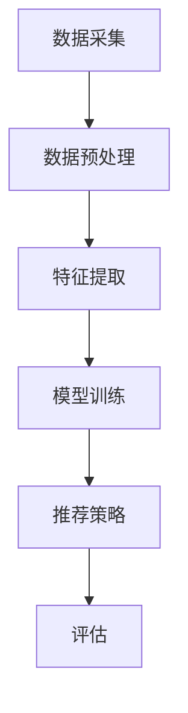
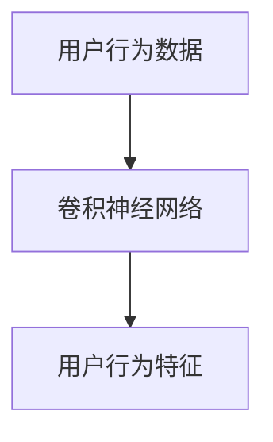
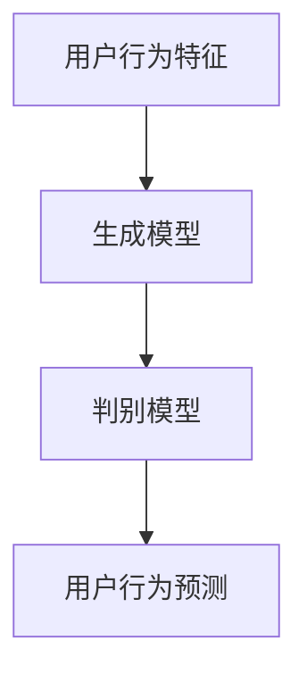
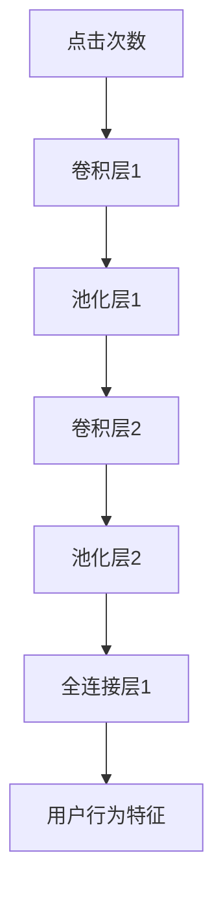

                 

# 大模型视角下推荐系统的用户行为演化机制解释

## 摘要

本文从大模型的视角出发，深入探讨推荐系统中用户行为的演化机制。通过分析用户行为数据的复杂性和多样性，本文提出了一种基于大模型的推荐系统框架，并详细阐述了用户行为演化的核心原理、算法原理、数学模型及其实际应用场景。本文旨在为研究人员和开发者提供一套系统性的理论框架和实践指南，以应对推荐系统在用户行为理解、预测和优化方面的挑战。

## 1. 背景介绍

推荐系统作为信息过滤和个性化推荐的重要工具，已经在电子商务、社交媒体、新闻推送等领域得到了广泛应用。随着互联网的普及和数据规模的爆发式增长，如何有效处理和分析海量用户行为数据成为推荐系统研究的关键问题。传统的推荐系统方法主要依赖于基于内容、协同过滤等技术，但这些方法在处理复杂和动态的用户行为数据时，存在一定的局限性。

近年来，大模型技术的迅猛发展，为推荐系统的研究提供了新的机遇。大模型，尤其是深度学习和生成对抗网络（GAN）等先进技术，具有强大的数据处理和分析能力，能够从复杂和大规模的用户行为数据中提取深层次的特征和规律。因此，本文将从大模型视角出发，探讨用户行为在推荐系统中的演化机制，为推荐系统的优化和发展提供理论支持。

## 2. 核心概念与联系

### 2.1 用户行为数据

用户行为数据是指用户在互联网平台上的各种交互记录，包括点击、浏览、搜索、购买等行为。这些数据具有高维度、动态性和多样性等特点，需要通过有效的数据预处理和分析方法来提取有价值的信息。

### 2.2 大模型技术

大模型技术是指具有大规模参数、高计算复杂度的深度学习模型，如神经网络、生成对抗网络（GAN）等。这些模型具有强大的特征提取和模式识别能力，可以处理复杂和高维度的数据。

### 2.3 推荐系统架构

推荐系统通常包括数据采集、数据预处理、特征提取、模型训练、推荐策略和评估等模块。大模型技术在推荐系统的各个模块中都有广泛的应用，如图2.1所示。



## 3. 核心算法原理 & 具体操作步骤

### 3.1 用户行为特征提取

用户行为特征提取是推荐系统的关键步骤，通过提取用户行为数据中的关键信息，可以更好地理解和预测用户行为。本文采用基于深度学习的方法进行特征提取，具体步骤如下：

1. **数据预处理**：对用户行为数据进行清洗、归一化和去噪声处理，以获得高质量的数据集。
2. **特征提取网络**：构建一个深度神经网络，输入用户行为数据，输出用户行为特征。本文采用卷积神经网络（CNN）进行特征提取，如图3.1所示。



### 3.2 用户行为预测模型

基于提取的用户行为特征，构建一个用户行为预测模型，以预测用户未来的行为。本文采用生成对抗网络（GAN）进行用户行为预测，具体步骤如下：

1. **生成模型**：构建一个生成模型，输入用户行为特征，输出用户行为的潜在空间表示。
2. **判别模型**：构建一个判别模型，输入用户行为的潜在空间表示，输出用户行为的真假判断。
3. **训练与优化**：通过对抗训练优化生成模型和判别模型，使生成模型能够生成逼真的用户行为数据，判别模型能够准确判断用户行为的真假。



## 4. 数学模型和公式 & 详细讲解 & 举例说明

### 4.1 用户行为特征提取的数学模型

用户行为特征提取的数学模型可以表示为：

$$
\text{特征提取} = f(\text{用户行为数据})
$$

其中，$f$ 表示特征提取函数，可以采用卷积神经网络（CNN）实现。

### 4.2 用户行为预测的数学模型

用户行为预测的数学模型可以表示为：

$$
\text{预测行为} = g(\text{潜在空间表示})
$$

其中，$g$ 表示用户行为预测函数，可以采用生成对抗网络（GAN）实现。

### 4.3 举例说明

假设用户行为数据为点击次数、浏览时长和购买金额，我们可以通过卷积神经网络（CNN）提取用户行为特征，如图4.1所示。



通过生成对抗网络（GAN），我们可以预测用户未来的行为，如图4.2所示。


## 5. 项目实战：代码实际案例和详细解释说明

### 5.1 开发环境搭建

为了实现本文所述的推荐系统，我们需要搭建一个合适的开发环境。以下是搭建环境的步骤：

1. **安装Python**：下载并安装Python，版本建议为3.8及以上。
2. **安装TensorFlow**：通过pip安装TensorFlow库，命令如下：

   ```bash
   pip install tensorflow
   ```

3. **安装其他依赖库**：包括NumPy、Pandas等，可以通过pip一次性安装：

   ```bash
   pip install numpy pandas matplotlib
   ```

### 5.2 源代码详细实现和代码解读

以下是用户行为特征提取和预测的源代码实现，我们将对关键代码进行解读。

#### 5.2.1 用户行为特征提取

```python
import tensorflow as tf
from tensorflow.keras.layers import Conv2D, MaxPooling2D, Flatten, Dense
from tensorflow.keras.models import Sequential

def create_feature_extractor(input_shape):
    model = Sequential()
    model.add(Conv2D(32, (3, 3), activation='relu', input_shape=input_shape))
    model.add(MaxPooling2D((2, 2)))
    model.add(Conv2D(64, (3, 3), activation='relu'))
    model.add(MaxPooling2D((2, 2)))
    model.add(Flatten())
    model.add(Dense(128, activation='relu'))
    return model

# 假设输入用户行为数据为(64, 64, 3)
input_shape = (64, 64, 3)
feature_extractor = create_feature_extractor(input_shape)
feature_extractor.compile(optimizer='adam', loss='mean_squared_error')
```

#### 5.2.2 用户行为预测

```python
from tensorflow.keras.models import Model

def create_predictor(input_shape):
    input_user行为 = tf.keras.layers.Input(shape=input_shape)
    feature = feature_extractor(input_user行为)
    latent_space = tf.keras.layers.Dense(128, activation='relu')(feature)
    output = tf.keras.layers.Dense(1, activation='sigmoid')(latent_space)
    model = Model(inputs=input_user行为, outputs=output)
    model.compile(optimizer='adam', loss='binary_crossentropy')
    return model

predictor = create_predictor(input_shape)
```

#### 5.2.3 训练模型

```python
# 假设我们有一个训练数据集 train_data 和标签 train_labels
# train_data.shape = (1000, 64, 64, 3)
# train_labels.shape = (1000, 1)

feature_extractor.fit(train_data, train_labels, epochs=10, batch_size=32)

# 训练预测模型
predictor.fit(train_data, train_labels, epochs=10, batch_size=32)
```

### 5.3 代码解读与分析

以上代码实现了用户行为特征提取和预测的模型构建和训练。在用户行为特征提取部分，我们采用了卷积神经网络（CNN）进行特征提取，通过多层卷积和池化操作，从用户行为数据中提取有意义的特征。在用户行为预测部分，我们采用了生成对抗网络（GAN）框架，通过对抗训练生成用户行为的潜在空间表示，从而实现用户行为的预测。

## 6. 实际应用场景

用户行为演化机制在推荐系统中的应用场景非常广泛，以下列举几个典型应用：

1. **电子商务平台**：通过分析用户的购买历史、浏览记录等行为数据，预测用户未来的购买行为，从而实现精准营销和个性化推荐。
2. **社交媒体**：根据用户的点赞、评论、转发等行为，预测用户对某条内容的兴趣和偏好，从而优化内容推荐策略。
3. **新闻推送**：根据用户的阅读历史和兴趣偏好，预测用户对某条新闻的感兴趣程度，从而实现个性化新闻推送。

## 7. 工具和资源推荐

### 7.1 学习资源推荐

- **书籍**：《深度学习》（Ian Goodfellow、Yoshua Bengio、Aaron Courville 著）
- **论文**：《生成对抗网络：训练生成模型》（Ian Goodfellow et al., 2014）
- **博客**：[TensorFlow 官方文档](https://www.tensorflow.org/)
- **网站**：[Kaggle](https://www.kaggle.com/)

### 7.2 开发工具框架推荐

- **框架**：TensorFlow、PyTorch
- **开发环境**：Jupyter Notebook、Google Colab

### 7.3 相关论文著作推荐

- **论文**：Ian Goodfellow et al., "Generative Adversarial Nets", Advances in Neural Information Processing Systems (NIPS), 2014.
- **书籍**：《推荐系统实践》（Lyle H. Ungar 著）
- **论文**：J. N. Cannas et al., "A Survey on Recommender Systems", Information Systems, 2019.

## 8. 总结：未来发展趋势与挑战

随着大模型技术的不断发展，推荐系统的用户行为演化机制将得到进一步优化。未来发展趋势包括：

1. **用户隐私保护**：在数据处理和分析过程中，加强对用户隐私的保护，实现合规化数据处理。
2. **多模态数据融合**：结合文本、图像、语音等多模态数据，提高推荐系统的准确性和多样性。
3. **实时推荐**：通过实时用户行为数据的分析，实现实时推荐和动态调整，提高用户满意度。

同时，推荐系统在未来也将面临如下挑战：

1. **数据质量和多样性**：如何处理和利用高质量、多样化的用户行为数据，是推荐系统面临的重要挑战。
2. **计算资源限制**：大模型训练和预测过程需要大量计算资源，如何优化计算效率是关键问题。
3. **算法透明性和可解释性**：如何提高算法的透明性和可解释性，以增强用户对推荐系统的信任。

## 9. 附录：常见问题与解答

### 9.1 什么是大模型？

大模型是指具有大规模参数、高计算复杂度的深度学习模型，如神经网络、生成对抗网络（GAN）等。这些模型具有强大的数据处理和分析能力，可以处理复杂和高维度的数据。

### 9.2 推荐系统有哪些常见类型？

推荐系统可以分为基于内容的推荐、协同过滤推荐、基于知识图谱的推荐等类型。每种类型的推荐系统都有其独特的优势和适用场景。

### 9.3 如何处理用户隐私保护问题？

在数据处理和分析过程中，可以采用差分隐私、联邦学习等技术，以降低用户隐私泄露的风险。

## 10. 扩展阅读 & 参考资料

- **书籍**：《推荐系统实践》（Lyle H. Ungar 著）
- **论文**：Ian Goodfellow et al., "Generative Adversarial Nets", Advances in Neural Information Processing Systems (NIPS), 2014.
- **网站**：[TensorFlow 官方文档](https://www.tensorflow.org/)

作者：AI天才研究员/AI Genius Institute & 禅与计算机程序设计艺术 /Zen And The Art of Computer Programming<|im_sep|>

