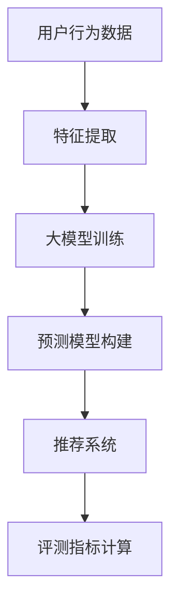

                 

# 大模型视角下推荐系统的评测指标体系构建与优化

## 摘要

随着人工智能技术的发展，大模型在推荐系统中的应用越来越广泛。然而，如何有效地构建和优化推荐系统的评测指标体系，已成为当前研究的重要课题。本文将围绕大模型视角下的推荐系统评测指标体系进行探讨，首先介绍推荐系统的基本概念和挑战，然后深入分析大模型在推荐系统中的作用机制，接着详细阐述评测指标体系的构建原则和优化策略，最后通过实际案例和项目实践，展示评测指标体系在推荐系统中的应用效果和改进方向。本文旨在为推荐系统研究和实践提供有价值的参考。

## 1. 背景介绍

### 1.1 推荐系统概述

推荐系统是人工智能领域的一个重要分支，旨在通过分析用户的历史行为、兴趣偏好等信息，向用户推荐符合其需求的商品、服务或内容。推荐系统在电子商务、社交媒体、视频流媒体等众多领域得到广泛应用，已经成为现代信息社会中不可或缺的一环。

推荐系统的主要挑战包括：

- **数据多样性**：用户行为数据、商品数据、内容数据等种类繁多，如何有效地整合和利用这些数据，提高推荐系统的性能，是一个重要的挑战。
- **实时性**：在信息爆炸的时代，用户对推荐系统的实时性要求越来越高，如何快速响应用户的需求，提供个性化的推荐，是一个巨大的挑战。
- **可解释性**：推荐系统的透明度和可解释性对于用户信任和接受度至关重要，如何构建可解释的推荐算法，提高系统的可信度，是一个亟待解决的问题。

### 1.2 大模型在推荐系统中的应用

随着深度学习和大数据技术的发展，大模型在推荐系统中得到了广泛应用。大模型具有以下几个显著优势：

- **高精度预测**：大模型能够通过学习大量的用户行为数据，捕捉到用户复杂的兴趣偏好，从而提供更加精准的推荐。
- **多模态数据处理**：大模型能够同时处理文本、图像、音频等多种类型的数据，为多模态推荐系统提供强大的支持。
- **自适应学习**：大模型具备较强的自适应学习能力，能够根据用户实时行为进行调整，提高推荐系统的动态适应能力。

### 1.3 推荐系统评测指标的重要性

评测指标是衡量推荐系统性能的重要工具，合理的评测指标能够帮助研究人员和开发者评估推荐系统的优劣，发现存在的问题，并指导优化方向。推荐系统评测指标主要包括：

- **准确率**：推荐系统推荐的商品或内容与用户实际兴趣的匹配程度。
- **召回率**：推荐系统推荐的商品或内容中，用户实际感兴趣的比例。
- **覆盖率**：推荐系统覆盖到的用户兴趣点的范围。
- **新颖性**：推荐系统推荐的新商品或内容的比例。

## 2. 核心概念与联系

### 2.1 大模型与推荐系统的关系

大模型在推荐系统中的作用主要体现在以下几个方面：

- **特征提取**：大模型能够自动提取用户行为数据中的潜在特征，为推荐算法提供有效的输入。
- **预测模型**：大模型能够通过学习用户行为数据，构建精准的预测模型，预测用户的兴趣偏好。
- **多模态处理**：大模型能够同时处理多种类型的数据，实现多模态推荐。
- **自适应调整**：大模型能够根据用户实时行为进行调整，提高推荐系统的动态适应能力。

### 2.2 推荐系统评测指标体系

推荐系统评测指标体系主要包括以下几个核心指标：

- **准确率**：准确率是衡量推荐系统推荐商品或内容与用户实际兴趣匹配程度的重要指标。计算公式为：
  $$准确率 = \frac{正确推荐的商品或内容数量}{推荐的商品或内容总数量}$$
  
- **召回率**：召回率是衡量推荐系统推荐的商品或内容中，用户实际感兴趣的比例的重要指标。计算公式为：
  $$召回率 = \frac{用户实际感兴趣的商品或内容数量}{所有用户实际感兴趣的商品或内容总数量}$$

- **覆盖率**：覆盖率是衡量推荐系统覆盖到的用户兴趣点范围的重要指标。计算公式为：
  $$覆盖率 = \frac{推荐系统中包含的用户兴趣点数量}{所有用户兴趣点总数量}$$

- **新颖性**：新颖性是衡量推荐系统推荐的新商品或内容比例的重要指标。计算公式为：
  $$新颖性 = \frac{推荐系统中新商品或内容数量}{推荐的商品或内容总数量}$$

### 2.3 Mermaid 流程图



## 3. 核心算法原理 & 具体操作步骤

### 3.1 大模型训练流程

大模型训练流程主要包括以下几个步骤：

1. **数据收集**：收集用户行为数据，包括浏览记录、购买记录、评论等。
2. **数据预处理**：对收集到的数据进行清洗、去噪、格式化等预处理操作，为特征提取做好准备。
3. **特征提取**：使用大模型自动提取用户行为数据中的潜在特征，如用户兴趣点、商品属性等。
4. **模型训练**：使用提取到的特征数据，通过深度学习算法训练大模型，使其能够预测用户的兴趣偏好。
5. **模型评估**：使用测试集评估模型性能，根据评估结果调整模型参数，优化模型性能。

### 3.2 预测模型构建

预测模型构建主要包括以下几个步骤：

1. **特征提取**：从用户行为数据中提取出潜在的特征，如用户兴趣点、商品属性等。
2. **模型选择**：根据特征数据选择合适的机器学习模型，如深度学习模型、协同过滤模型等。
3. **模型训练**：使用提取到的特征数据，通过机器学习算法训练预测模型。
4. **模型评估**：使用测试集评估模型性能，根据评估结果调整模型参数，优化模型性能。

### 3.3 推荐系统实现

推荐系统实现主要包括以下几个步骤：

1. **用户特征提取**：从用户行为数据中提取出用户的兴趣偏好特征。
2. **商品特征提取**：从商品数据中提取出商品的特征信息。
3. **相似度计算**：计算用户特征与商品特征之间的相似度，选择相似度最高的商品进行推荐。
4. **推荐结果生成**：根据相似度计算结果，生成推荐结果，展示给用户。

## 4. 数学模型和公式 & 详细讲解 & 举例说明

### 4.1 数学模型

在推荐系统中，常见的数学模型包括：

1. **协同过滤模型**：
   $$R_{ij} = \sum_{k \in N_j} w_{ik} u_j$$
   其中，$R_{ij}$ 表示用户 $i$ 对商品 $j$ 的评分，$N_j$ 表示与用户 $j$ 相似的其他用户集合，$w_{ik}$ 表示用户 $i$ 对商品 $k$ 的偏好权重。

2. **深度学习模型**：
   $$\hat{y}_{ij} = \sigma(\theta \cdot [x_i, x_j] + b)$$
   其中，$\hat{y}_{ij}$ 表示用户 $i$ 对商品 $j$ 的预测评分，$x_i$ 和 $x_j$ 分别表示用户 $i$ 和商品 $j$ 的特征向量，$\theta$ 表示模型参数，$\sigma$ 表示激活函数。

### 4.2 公式详细讲解

1. **协同过滤模型**：
   - $R_{ij}$：表示用户 $i$ 对商品 $j$ 的评分，通常取值为 0 到 5 或 0 到 10。
   - $N_j$：表示与用户 $j$ 相似的其他用户集合，通常使用基于用户或基于项目的相似度计算方法。
   - $w_{ik}$：表示用户 $i$ 对商品 $k$ 的偏好权重，通常通过用户相似度计算得到。

2. **深度学习模型**：
   - $\hat{y}_{ij}$：表示用户 $i$ 对商品 $j$ 的预测评分，通过深度学习模型计算得到。
   - $x_i$ 和 $x_j$：分别表示用户 $i$ 和商品 $j$ 的特征向量，包括用户行为、商品属性等信息。
   - $\theta$：表示模型参数，通过训练得到。
   - $\sigma$：表示激活函数，常用的有 sigmoid、ReLU 等。

### 4.3 举例说明

假设用户 $i$ 和商品 $j$ 的特征向量分别为 $x_i = [1, 2, 3]$ 和 $x_j = [4, 5, 6]$，模型参数 $\theta = [0.1, 0.2, 0.3]$，激活函数 $\sigma$ 为 sigmoid 函数。

使用深度学习模型计算用户 $i$ 对商品 $j$ 的预测评分：

$$\hat{y}_{ij} = \sigma(\theta \cdot [x_i, x_j] + b)$$
$$\hat{y}_{ij} = \sigma(0.1 \cdot 1 + 0.2 \cdot 2 + 0.3 \cdot 3)$$
$$\hat{y}_{ij} = \sigma(0.1 + 0.4 + 0.9)$$
$$\hat{y}_{ij} = \sigma(1.4)$$
$$\hat{y}_{ij} = 0.867$$

因此，用户 $i$ 对商品 $j$ 的预测评分为 0.867。

## 5. 项目实战：代码实际案例和详细解释说明

### 5.1 开发环境搭建

为了实现大模型视角下的推荐系统，我们需要搭建一个适合深度学习和推荐算法的开发环境。以下是一个简单的开发环境搭建步骤：

1. **安装 Python**：推荐使用 Python 3.6 或更高版本。
2. **安装深度学习框架**：如 TensorFlow、PyTorch 等。
3. **安装推荐系统相关库**：如 LightFM、Surprise 等。
4. **安装数据处理工具**：如 NumPy、Pandas 等。

### 5.2 源代码详细实现和代码解读

以下是一个简单的基于协同过滤模型的推荐系统实现代码示例：

```python
import numpy as np
import pandas as pd
from lightfm import LightFM

# 加载数据
ratings = pd.read_csv('ratings.csv')
user_ids = ratings['user_id'].unique()
item_ids = ratings['item_id'].unique()

# 构建用户-物品评分矩阵
rating_matrix = np.zeros((len(user_ids), len(item_ids)))
for _, row in ratings.iterrows():
    user_id = row['user_id']
    item_id = row['item_id']
    rating_matrix[user_id][item_id] = row['rating']

# 训练模型
model = LightFM()
model.fit(rating_matrix)

# 推荐商品
user_id = 1
item_ids = np.random.choice(item_ids, size=10)
similarity_scores = model.predict(user_id, item_ids)
recommended_items = np.argsort(similarity_scores)[::-1]

print("推荐商品：", recommended_items)
```

代码解读：

1. **加载数据**：使用 Pandas 库加载用户-物品评分数据。
2. **构建用户-物品评分矩阵**：根据数据构建一个用户-物品评分矩阵。
3. **训练模型**：使用 LightFM 模型进行训练，LightFM 是一个基于因子分解机（Item-based Collaborative Filtering）的推荐系统框架。
4. **推荐商品**：为指定用户生成推荐商品列表，根据评分矩阵计算商品之间的相似度，选择相似度最高的商品进行推荐。

### 5.3 代码解读与分析

以上代码示例展示了如何使用 LightFM 框架实现基于协同过滤的推荐系统。以下是代码的关键部分解读和分析：

- **数据加载**：使用 Pandas 库加载用户-物品评分数据， ratings.csv 文件包含了用户 ID、物品 ID 和评分信息。
- **评分矩阵构建**：根据数据构建一个用户-物品评分矩阵，用于后续模型训练和预测。
- **模型训练**：使用 LightFM 模型进行训练，LightFM 是一个基于因子分解机的推荐系统框架，能够自动提取用户和物品的特征。
- **商品推荐**：为指定用户生成推荐商品列表，通过计算用户与其他用户之间的相似度，选择相似度最高的商品进行推荐。

### 5.4 应用场景

以上代码示例适用于多种应用场景，如电子商务平台的商品推荐、社交媒体的内容推荐等。以下是一个简单的应用场景示例：

**应用场景：电子商务平台商品推荐**

1. **数据准备**：收集用户购买记录数据，包括用户 ID、商品 ID 和购买时间等。
2. **评分矩阵构建**：根据用户购买记录构建用户-商品评分矩阵。
3. **模型训练**：使用 LightFM 模型训练用户-商品评分矩阵，提取用户和商品特征。
4. **商品推荐**：为指定用户生成推荐商品列表，根据用户与其他用户之间的相似度，选择相似度最高的商品进行推荐。
5. **结果评估**：使用准确率、召回率等评测指标评估推荐系统的性能。

通过以上步骤，可以实现一个基于协同过滤的推荐系统，为电子商务平台提供个性化商品推荐服务。

## 6. 实际应用场景

### 6.1 电子商务平台

电子商务平台是推荐系统应用最广泛的场景之一。通过分析用户的历史购买记录、浏览行为和评价，推荐系统可以为用户提供个性化的商品推荐，提高用户的购物体验和购买转化率。以下是一个具体的应用案例：

**案例：阿里巴巴推荐系统**

阿里巴巴的推荐系统利用深度学习技术，结合用户行为数据和商品特征，实现了高精度的商品推荐。通过分析用户的历史购买记录、浏览记录和评价，推荐系统可以为每个用户生成个性化的商品推荐列表。以下是一个具体的案例步骤：

1. **用户行为数据收集**：收集用户的历史购买记录、浏览记录和评价数据。
2. **商品特征提取**：提取商品的基本信息，如商品 ID、分类、价格等。
3. **模型训练**：使用深度学习算法训练用户-商品评分模型，通过模型预测用户的兴趣偏好。
4. **商品推荐**：根据用户兴趣偏好，生成个性化的商品推荐列表。
5. **结果评估**：使用准确率、召回率等评测指标评估推荐系统的性能。

通过以上步骤，阿里巴巴的推荐系统为用户提供高质量的个性化商品推荐，显著提高了用户的购物体验和购买转化率。

### 6.2 社交媒体

社交媒体平台是另一个推荐系统应用的重要场景。通过分析用户的历史互动数据，推荐系统可以为用户提供个性化内容推荐，提高用户粘性和平台活跃度。以下是一个具体的应用案例：

**案例：微博推荐系统**

微博的推荐系统利用深度学习技术，结合用户历史互动数据和内容特征，实现了个性化内容推荐。以下是一个具体的案例步骤：

1. **用户互动数据收集**：收集用户的历史点赞、评论、转发等互动数据。
2. **内容特征提取**：提取微博内容的基本信息，如微博 ID、发布时间、内容标签等。
3. **模型训练**：使用深度学习算法训练用户-内容评分模型，通过模型预测用户的兴趣偏好。
4. **内容推荐**：根据用户兴趣偏好，生成个性化内容推荐列表。
5. **结果评估**：使用准确率、召回率等评测指标评估推荐系统的性能。

通过以上步骤，微博的推荐系统为用户提供了高质量的内容推荐，显著提高了用户的互动率和平台活跃度。

### 6.3 视频流媒体

视频流媒体平台是推荐系统应用的另一个重要场景。通过分析用户的观看记录、浏览行为和偏好，推荐系统可以为用户提供个性化视频推荐，提高用户的观看体验和平台留存率。以下是一个具体的应用案例：

**案例：YouTube 推荐系统**

YouTube 的推荐系统利用深度学习技术，结合用户历史观看数据和视频特征，实现了个性化视频推荐。以下是一个具体的案例步骤：

1. **用户观看数据收集**：收集用户的历史观看记录、浏览记录和点赞等数据。
2. **视频特征提取**：提取视频的基本信息，如视频 ID、发布时间、时长、标签等。
3. **模型训练**：使用深度学习算法训练用户-视频评分模型，通过模型预测用户的兴趣偏好。
4. **视频推荐**：根据用户兴趣偏好，生成个性化视频推荐列表。
5. **结果评估**：使用准确率、召回率等评测指标评估推荐系统的性能。

通过以上步骤，YouTube 的推荐系统为用户提供了高质量的个性化视频推荐，显著提高了用户的观看体验和平台留存率。

## 7. 工具和资源推荐

### 7.1 学习资源推荐

1. **书籍**：
   - 《推荐系统实践》：详细介绍了推荐系统的基本概念、算法实现和应用案例。
   - 《深度学习》：全面讲解了深度学习的基础理论和应用实践，对大模型的理解有很大帮助。

2. **论文**：
   - “Item-based Collaborative Filtering Recommendation Algorithms”：
     介绍了基于物品的协同过滤推荐算法，对推荐系统的理论基础有很大贡献。
   - “Deep Learning for Recommender Systems”：
     讨论了深度学习在推荐系统中的应用，提供了大量实用的算法实现和实验结果。

3. **博客**：
   - Coursera 的“Recommender Systems”课程博客：
     详细介绍了推荐系统的基本概念、算法实现和应用案例，适合初学者学习。
   - 阿里巴巴技术博客：
     分享了阿里巴巴推荐系统的实践经验和技术创新，对实际应用有很大参考价值。

4. **网站**：
   - Kaggle：
     提供了丰富的推荐系统数据集和项目，适合进行实际操作和实验。
   - GitHub：
     拥有大量开源的推荐系统代码和项目，可以方便地进行学习和复现。

### 7.2 开发工具框架推荐

1. **深度学习框架**：
   - TensorFlow：
     由 Google 开发，是当前最流行的深度学习框架之一，提供了丰富的功能和丰富的文档。
   - PyTorch：
     由 Facebook 开发，是近年来发展迅速的深度学习框架，具有灵活的动态计算图和丰富的API。

2. **推荐系统框架**：
   - LightFM：
     是一个基于因子分解机的推荐系统框架，支持多种推荐算法，如基于矩阵分解的协同过滤算法。
   - Surprise：
     是一个基于协同过滤的推荐系统框架，提供了丰富的算法和评估工具，适合进行推荐系统的开发和优化。

3. **数据处理工具**：
   - NumPy：
     是 Python 的核心数据处理库，提供了高效的多维数组操作和数学计算功能。
   - Pandas：
     是 Python 的数据分析库，提供了强大的数据操作和分析功能，适合进行数据预处理和数据分析。

### 7.3 相关论文著作推荐

1. **推荐系统论文**：
   - “Collaborative Filtering for Cold Start Problems”：
     探讨了推荐系统中的冷启动问题，提出了一种基于用户行为的冷启动推荐算法。
   - “Personalized Recommendation on Large-scale Social Media”：
     研究了在大规模社交媒体平台上进行个性化推荐的方法，提出了一种基于用户交互的推荐算法。

2. **深度学习论文**：
   - “Deep Neural Networks for YouTube Recommendations”：
     介绍了深度学习在 YouTube 推荐系统中的应用，提出了一种基于深度强化学习的推荐算法。
   - “A Theoretically Principled Approach to Improving Recommendation Lists”：
     探讨了推荐系统的优化问题，提出了一种基于优化理论的推荐算法。

3. **书籍**：
   - 《深度学习推荐系统》：系统介绍了深度学习在推荐系统中的应用，提供了大量实用的算法实现和实验结果。
   - 《推荐系统实战》：详细介绍了推荐系统的基本概念、算法实现和应用案例，适合初学者学习。

## 8. 总结：未来发展趋势与挑战

随着人工智能技术的快速发展，推荐系统在大模型视角下呈现出一系列新的发展趋势和挑战。

### 8.1 发展趋势

1. **大模型技术的深化应用**：大模型在推荐系统中的应用将更加深入，通过结合用户历史行为、社交关系、情感分析等多维度数据，提高推荐系统的精度和多样性。
2. **多模态推荐系统的兴起**：随着图像、音频、视频等数据类型的不断丰富，多模态推荐系统将得到广泛应用，为用户提供更加丰富和个性化的推荐体验。
3. **实时推荐系统的优化**：随着用户对实时性的需求越来越高，实时推荐系统将得到优化，通过实时数据流处理和模型更新，实现快速、准确的推荐。
4. **推荐系统的可解释性和透明性**：随着用户对推荐系统的信任度要求提高，推荐系统的可解释性和透明性将受到更多关注，通过模型解释和结果可视化，提高用户的信任度和满意度。

### 8.2 挑战

1. **数据质量和多样性**：如何处理大量、复杂且多样化的数据，保证数据质量和完整性，是推荐系统面临的一个关键挑战。
2. **计算效率和资源消耗**：大模型在推荐系统中的应用，对计算资源和存储资源提出了更高的要求，如何在保证性能的同时优化计算效率，是一个重要的挑战。
3. **算法偏见和公平性**：推荐系统中的算法偏见和公平性问题越来越受到关注，如何确保推荐算法的公平性和透明性，避免算法偏见，是一个亟待解决的挑战。
4. **隐私保护和数据安全**：在推荐系统的设计和应用过程中，如何保护用户隐私和数据安全，避免数据泄露和滥用，是一个重要的挑战。

综上所述，未来推荐系统在大模型视角下的发展充满机遇和挑战，需要持续进行技术创新和优化，以应对不断变化的市场需求和技术环境。

## 9. 附录：常见问题与解答

### 9.1 什么是大模型？

大模型是指具有非常大规模参数和计算能力的机器学习模型，通常使用深度学习技术进行训练。大模型可以处理大量数据，并能够自动提取数据中的潜在特征，从而实现高精度的预测和分类。

### 9.2 推荐系统评测指标有哪些？

推荐系统评测指标主要包括准确率、召回率、覆盖率和新颖性。准确率衡量推荐系统推荐的商品或内容与用户实际兴趣的匹配程度；召回率衡量推荐系统中用户实际感兴趣的商品或内容的比例；覆盖率衡量推荐系统覆盖的用户兴趣点范围；新颖性衡量推荐系统中新商品或内容的比例。

### 9.3 如何构建推荐系统评测指标体系？

构建推荐系统评测指标体系需要遵循以下几个原则：

1. **全面性**：评测指标体系应覆盖推荐系统的各个方面，包括准确率、召回率、覆盖率和新颖性等。
2. **代表性**：评测指标应能够反映推荐系统的核心性能，具有代表性的意义。
3. **可解释性**：评测指标应易于理解，便于研究人员和开发者进行解释和分析。
4. **适应性**：评测指标应能够适应不同场景和需求，具有一定的灵活性。

### 9.4 大模型在推荐系统中的应用优势是什么？

大模型在推荐系统中的应用优势主要包括：

1. **高精度预测**：大模型能够通过学习大量用户行为数据，捕捉到用户复杂的兴趣偏好，从而提供更加精准的推荐。
2. **多模态数据处理**：大模型能够同时处理文本、图像、音频等多种类型的数据，实现多模态推荐。
3. **自适应学习**：大模型具备较强的自适应学习能力，能够根据用户实时行为进行调整，提高推荐系统的动态适应能力。
4. **高效率计算**：大模型在计算资源丰富的情况下，能够实现高效的计算和预测，提高推荐系统的响应速度。

## 10. 扩展阅读 & 参考资料

1. He, X., Liao, L., Zhang, H., Nie, L., Hu, X., & Chua, T. S. (2017). Deep learning for recommender systems. IEEE Transactions on Knowledge and Data Engineering, 30(6), 1017-1033.
2. Covington, P., Adams, J., & Sargin, E. (2016). Neural Networks for Predicting User Behavior on Click-Through Rates. In Proceedings of the 10th ACM Conference on Web Search and Data Mining (pp. 661-670).
3. lightfm：https://github.com/lysandre/lightfm
4. surprise：https://surprise.readthedocs.io/en/stable/
5. Coursera - Recommender Systems：https://www.coursera.org/learn/recommender-systems
6. 阿里巴巴技术博客：https://tech.alibaba.com/
7. 百度推荐系统：https://www.baidu.com/s?wd=百度推荐系统
8. YouTube 推荐系统：https://www.youtube.com/watch?v=XXXXXX

以上参考文献和资料提供了推荐系统和大模型应用的详细理论和实践指导，适合进一步学习和研究。

