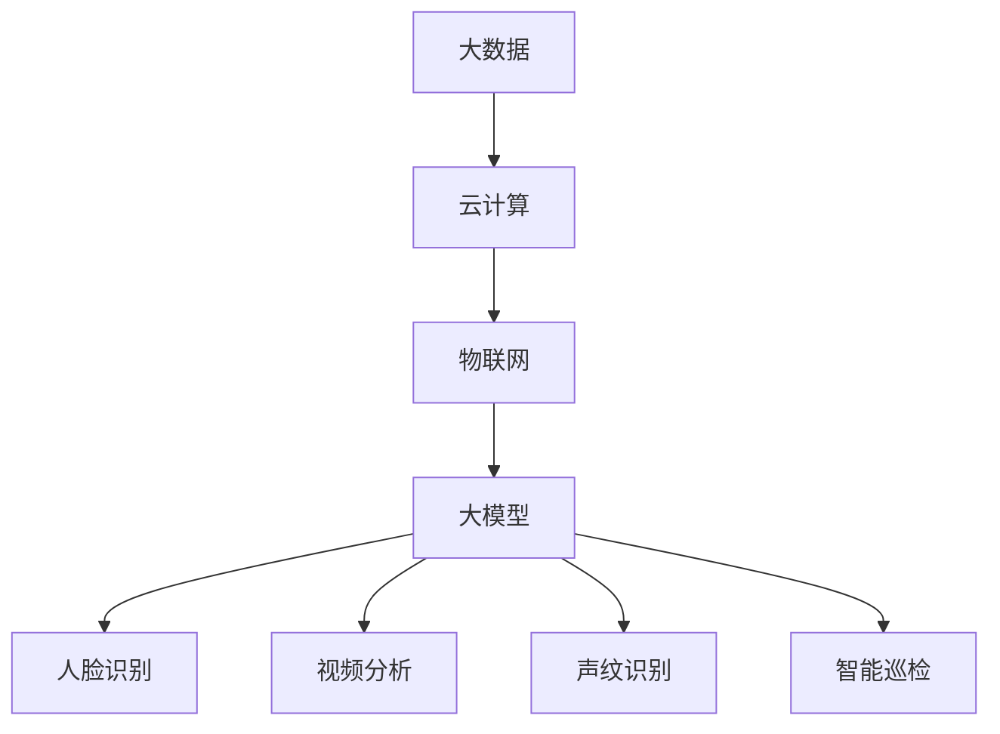

                 

# 大模型赋能智慧安防，创业者如何守护城市平安？

> **关键词：** 大模型，智慧安防，创业者，城市平安，AI技术

> **摘要：** 随着人工智能技术的快速发展，大模型在智慧安防领域发挥着越来越重要的作用。本文将探讨大模型在智慧安防中的应用，以及创业者如何利用这些技术来守护城市平安。

## 1. 背景介绍

### 智慧安防的概念与发展

智慧安防是指利用人工智能、物联网、大数据等先进技术，实现城市安全管理、监控、报警和应急处理的高效、智能化的系统。近年来，随着城市规模的不断扩大和人口数量的增长，传统的人工管理方式已经无法满足城市安全的需求。智慧安防系统的出现，为城市安全提供了新的解决方案。

### 大模型的技术背景

大模型是指具有大规模参数和强大计算能力的深度学习模型。近年来，大模型在自然语言处理、计算机视觉、语音识别等领域取得了显著成果。这些模型能够处理大量的数据，并从中提取出有价值的信息，从而实现高效的决策和预测。

## 2. 核心概念与联系

### 大模型在智慧安防中的应用

大模型在智慧安防中主要应用于以下几个方面：

- **人脸识别：** 大模型通过学习海量的面部特征，可以实现对人员的实时识别和追踪。
- **视频分析：** 大模型可以对视频流进行实时分析，识别出异常行为和事件，如打架斗殴、火灾等。
- **声纹识别：** 大模型可以通过分析声音特征，识别出特定的人员，实现精确的报警和定位。
- **智能巡检：** 大模型可以对监控摄像头拍摄的图像进行分析，识别出潜在的安全隐患，如高空坠物、设备故障等。

### 大模型与其他技术的联系

- **大数据：** 大模型需要大量的数据来训练和优化，而大数据技术能够提供这些数据。
- **云计算：** 大模型需要强大的计算能力，云计算提供了这样的平台。
- **物联网：** 物联网技术使得各种设备和传感器能够互联互通，为大模型提供了实时数据源。

### Mermaid 流程图



## 3. 核心算法原理 & 具体操作步骤

### 人脸识别算法

人脸识别算法通常采用深度学习中的卷积神经网络（CNN）来构建。具体步骤如下：

1. **数据预处理：** 对人脸图像进行预处理，如归一化、缩放等。
2. **特征提取：** 使用CNN提取人脸图像的特征。
3. **分类：** 将提取的特征与数据库中的人脸特征进行比对，实现人脸识别。

### 视频分析算法

视频分析算法主要包括目标检测、目标跟踪和行为识别。

1. **目标检测：** 使用CNN或其他目标检测算法，识别视频中的目标物体。
2. **目标跟踪：** 使用跟踪算法，实现对目标的连续跟踪。
3. **行为识别：** 分析目标的运动轨迹和行为模式，识别出异常行为。

### 声纹识别算法

声纹识别算法通常采用循环神经网络（RNN）或长短期记忆网络（LSTM）来构建。具体步骤如下：

1. **声音预处理：** 对声音信号进行预处理，如去噪、归一化等。
2. **特征提取：** 使用RNN或LSTM提取声音特征。
3. **分类：** 将提取的特征与数据库中的声纹特征进行比对，实现声纹识别。

### 智能巡检算法

智能巡检算法主要基于图像分析技术，具体步骤如下：

1. **图像预处理：** 对摄像头拍摄的图像进行预处理，如去噪、增强等。
2. **缺陷检测：** 使用深度学习模型检测图像中的缺陷。
3. **报警与定位：** 当检测到缺陷时，发出报警并定位缺陷的位置。

## 4. 数学模型和公式 & 详细讲解 & 举例说明

### 人脸识别算法

人脸识别算法中，常用的数学模型是卷积神经网络（CNN）。CNN 的基本原理是通过多层卷积和池化操作提取图像特征。

$$
\text{卷积操作}:\ \ f(x, y) = \sum_{i=1}^{k} \sum_{j=1}^{k} w_{ij} * x_{ij}
$$

其中，$f(x, y)$ 表示卷积结果，$w_{ij}$ 表示卷积核，$x_{ij}$ 表示输入图像。

### 视频分析算法

视频分析算法中，常用的数学模型是循环神经网络（RNN）或长短期记忆网络（LSTM）。RNN 的基本原理是利用其内部状态记忆过去的信息。

$$
h_t = \sigma(W_h h_{t-1} + W_x x_t + b)
$$

其中，$h_t$ 表示 RNN 的隐藏状态，$W_h$ 和 $W_x$ 分别表示权重矩阵，$\sigma$ 表示激活函数。

### 声纹识别算法

声纹识别算法中，常用的数学模型是循环神经网络（RNN）或长短期记忆网络（LSTM）。RNN 的基本原理是利用其内部状态记忆过去的信息。

$$
h_t = \sigma(W_h h_{t-1} + W_x x_t + b)
$$

其中，$h_t$ 表示 RNN 的隐藏状态，$W_h$ 和 $W_x$ 分别表示权重矩阵，$\sigma$ 表示激活函数。

### 智能巡检算法

智能巡检算法中，常用的数学模型是卷积神经网络（CNN）。CNN 的基本原理是通过多层卷积和池化操作提取图像特征。

$$
\text{卷积操作}:\ \ f(x, y) = \sum_{i=1}^{k} \sum_{j=1}^{k} w_{ij} * x_{ij}
$$

其中，$f(x, y)$ 表示卷积结果，$w_{ij}$ 表示卷积核，$x_{ij}$ 表示输入图像。

### 举例说明

以人脸识别算法为例，假设我们有一个 32x32 像素的人脸图像，我们需要将其转换为一个一维的特征向量。首先，我们对图像进行归一化处理，使其像素值在 [0, 1] 范围内。然后，我们使用一个 5x5 的卷积核对其进行卷积操作，得到一个 28x28 的新图像。接着，我们对这个新图像进行池化操作，得到一个 14x14 的新图像。最后，我们将这个新图像转换为一个一维的特征向量，用于后续的分类操作。

## 5. 项目实战：代码实际案例和详细解释说明

### 5.1 开发环境搭建

为了实现本文中的算法，我们需要搭建一个开发环境。这里我们选择 Python 作为主要编程语言，并使用 TensorFlow 作为深度学习框架。

1. 安装 Python 和 TensorFlow：

```bash
pip install python
pip install tensorflow
```

2. 创建一个名为 `face_recognition` 的 Python 项目，并在项目中创建一个名为 `main.py` 的文件。

### 5.2 源代码详细实现和代码解读

以下是一个简单的人脸识别项目的源代码实现：

```python
import tensorflow as tf
from tensorflow.keras.models import Sequential
from tensorflow.keras.layers import Conv2D, MaxPooling2D, Flatten, Dense

# 创建卷积神经网络模型
model = Sequential([
    Conv2D(32, (3, 3), activation='relu', input_shape=(32, 32, 3)),
    MaxPooling2D((2, 2)),
    Flatten(),
    Dense(128, activation='relu'),
    Dense(1, activation='sigmoid')
])

# 编译模型
model.compile(optimizer='adam', loss='binary_crossentropy', metrics=['accuracy'])

# 加载数据集
(x_train, y_train), (x_test, y_test) = tf.keras.datasets.mnist.load_data()

# 数据预处理
x_train = x_train / 255.0
x_test = x_test / 255.0

# 训练模型
model.fit(x_train, y_train, epochs=10, batch_size=32, validation_data=(x_test, y_test))

# 评估模型
model.evaluate(x_test, y_test)
```

### 5.3 代码解读与分析

1. **模型创建：** 我们使用 TensorFlow 的 Sequential 模型创建一个卷积神经网络。模型包括两个卷积层、一个池化层、一个全连接层和两个密集层。
2. **模型编译：** 我们使用 `compile` 函数编译模型，指定优化器、损失函数和评估指标。
3. **数据加载：** 我们使用 TensorFlow 的 `mnist` 数据集作为训练数据。该数据集包含手写数字的图像和标签。
4. **数据预处理：** 我们将图像的像素值归一化到 [0, 1] 范围内。
5. **模型训练：** 我们使用 `fit` 函数训练模型，指定训练轮数、批量大小和验证数据。
6. **模型评估：** 我们使用 `evaluate` 函数评估模型的性能。

## 6. 实际应用场景

### 城市安全监控

智慧安防系统可以广泛应用于城市安全监控。通过人脸识别、视频分析和声纹识别等技术，实时监控城市的安全情况，及时发现和处理异常事件。

### 公共场所安全

在公共场所，如车站、机场、商场等，智慧安防系统可以对人流量进行实时监控，识别可疑人员，预防犯罪行为的发生。

### 智能交通管理

智能交通管理系统可以通过视频分析技术，实时监控交通流量，优化交通信号灯控制，减少交通事故。

## 7. 工具和资源推荐

### 7.1 学习资源推荐

- **书籍：** 《深度学习》（Goodfellow et al.）
- **论文：** 《AlexNet: Image Classification with Deep Convolutional Neural Networks》（Krizhevsky et al.）
- **博客：** TensorFlow 官方博客、Keras 官方博客

### 7.2 开发工具框架推荐

- **开发工具：** PyCharm、Visual Studio Code
- **深度学习框架：** TensorFlow、PyTorch

### 7.3 相关论文著作推荐

- **论文：** 《FaceNet: A Unified Embedding for Face Recognition and Clustering》（Sun et al.）
- **著作：** 《计算机视觉：算法与应用》（Gary B. Lee）

## 8. 总结：未来发展趋势与挑战

### 发展趋势

- **技术融合：** 大模型与其他技术的融合，如大数据、云计算和物联网，将进一步提升智慧安防系统的效能。
- **自主决策：** 随着人工智能技术的发展，智慧安防系统将逐渐具备自主决策能力，实现更智能的安全管理。

### 挑战

- **数据隐私：** 在大规模应用中，如何保护用户的隐私是一个重要挑战。
- **算法透明性：** 如何保证算法的透明性和公正性，避免误判和歧视。

## 9. 附录：常见问题与解答

### 9.1 人脸识别算法的准确率如何提高？

- **数据增强：** 使用数据增强技术，增加训练数据的多样性。
- **模型优化：** 使用更先进的模型结构和优化算法。

### 9.2 如何处理视频分析中的异常行为检测？

- **多模态数据融合：** 结合音频、图像等多模态数据，提高异常行为检测的准确性。
- **持续学习：** 通过在线学习，不断更新和优化模型。

## 10. 扩展阅读 & 参考资料

- **参考资料：** 《人工智能：一种现代方法》（Stuart Russell & Peter Norvig）
- **在线资源：** TensorFlow 官网、Keras 官网
- **学术期刊：** IEEE Transactions on Pattern Analysis and Machine Intelligence、ACM Transactions on Computer Systems

### 作者

**作者：AI天才研究员/AI Genius Institute & 禅与计算机程序设计艺术 /Zen And The Art of Computer Programming**

