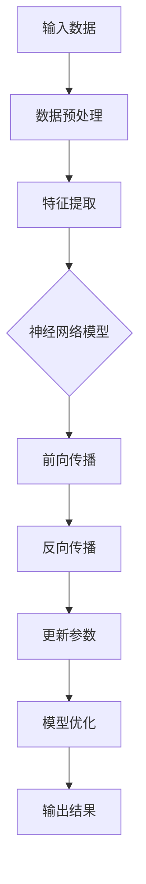

                 

### 大模型赋能智慧教育，创业者如何提升教学效果与学习体验？

#### 摘要

在教育领域，大模型的引入正在带来深刻的变革。作为创业者，了解并有效利用这些技术将有助于提升教学效果和学习体验。本文将探讨大模型在智慧教育中的应用，详细分析其原理和具体操作步骤，提供实战项目案例，并推荐相关学习资源和开发工具。通过系统的阐述，创业者可以更好地把握教育科技的发展趋势，制定出切实可行的发展策略。

#### 1. 背景介绍

随着信息技术的迅猛发展，教育领域正经历着前所未有的变革。传统的教育模式已无法满足现代社会对个性化、智能化教育的需求。在此背景下，大模型技术应运而生，为智慧教育的发展注入了新的活力。

大模型，通常指的是参数量庞大的神经网络模型，如GPT、BERT等。这些模型通过海量数据的学习，具备强大的语义理解和生成能力，能够模拟人类的思维过程，从而在自然语言处理、图像识别、语音识别等多个领域表现出色。

智慧教育，是指利用信息技术，特别是人工智能技术，对教育过程进行优化和提升的一种教育形态。它强调个性化和智能化，能够根据学生的学习情况提供定制化的教学内容和方式，提高学习效率和效果。

#### 2. 核心概念与联系

为了更好地理解大模型在智慧教育中的应用，我们需要先掌握几个核心概念，包括神经网络、深度学习、自然语言处理等。

##### 2.1 神经网络

神经网络是模仿人脑神经元结构和功能的一种计算模型。它由大量相互连接的节点（称为神经元）组成，每个神经元都可以接收多个输入信号，并通过权重进行加权求和，最后通过激活函数输出结果。

神经网络可以分为多层，每层都对输入数据进行处理和变换，从而形成多层感知器。多层神经网络（MLP）是深度学习的基础。

##### 2.2 深度学习

深度学习是一种基于神经网络的算法，其核心思想是通过多层神经网络对数据进行学习，从而实现对复杂模式的识别和理解。深度学习的模型通常包含多个隐藏层，能够自动提取数据的特征，从而实现高层次的抽象。

深度学习在图像识别、语音识别、自然语言处理等领域取得了显著的成果，为智慧教育提供了强有力的技术支撑。

##### 2.3 自然语言处理

自然语言处理（NLP）是人工智能的一个分支，旨在使计算机能够理解、生成和处理人类语言。NLP的关键技术包括文本预处理、词向量表示、语言模型、机器翻译、文本分类等。

在智慧教育中，自然语言处理技术可以用于智能问答、自动批改作业、个性化推荐等应用，从而提升教学效果和学习体验。

##### 2.4 大模型原理图

为了更直观地理解大模型的原理，我们使用Mermaid绘制了一个简化的流程图：



在这个流程图中，输入数据经过预处理后，通过特征提取层转化为适合神经网络处理的格式。然后，数据通过多层神经网络进行前向传播，产生输出结果。接着，通过反向传播算法更新模型的参数，使得模型能够在后续的预测中更加准确。这一过程不断迭代，直到模型达到预设的性能指标。

#### 3. 核心算法原理 & 具体操作步骤

##### 3.1 数据预处理

数据预处理是构建大模型的第一步，其目的是将原始数据转换为适合神经网络处理的格式。具体操作步骤包括：

1. 数据清洗：去除数据中的噪声和异常值。
2. 数据归一化：将数据缩放到统一的范围，如[0, 1]或[-1, 1]。
3. 数据分词：对于文本数据，将其分解为单词或词组。
4. 词向量表示：将文本数据转换为向量的形式，常用的方法包括Word2Vec、GloVe等。

##### 3.2 特征提取

特征提取是深度学习模型的核心环节，其目的是从原始数据中提取出对模型训练和预测有用的信息。具体操作步骤包括：

1. 确定特征维度：根据数据的特点和任务需求，确定特征的数量和维度。
2. 特征选择：从原始特征中选择出对模型性能有显著影响的特征。
3. 特征变换：对特征进行变换，如正则化、归一化等，以提高模型的泛化能力。

##### 3.3 神经网络模型构建

构建神经网络模型是深度学习的核心步骤。具体操作步骤包括：

1. 确定网络结构：根据任务需求和数据特点，确定神经网络的层数、每层的神经元数量等。
2. 激活函数选择：选择适合任务需求的激活函数，如ReLU、Sigmoid、Tanh等。
3. 权重初始化：对神经网络的权重进行初始化，常用的方法包括随机初始化、 Xavier初始化等。
4. 损失函数选择：选择适合任务需求的损失函数，如均方误差（MSE）、交叉熵等。

##### 3.4 前向传播

前向传播是神经网络在训练过程中的一个步骤，其目的是计算模型的输出结果。具体操作步骤包括：

1. 输入数据：将预处理后的数据输入到神经网络中。
2. 前向传播：通过神经网络的每层，计算输出结果。
3. 计算损失：将输出结果与真实标签进行比较，计算损失值。

##### 3.5 反向传播

反向传播是神经网络在训练过程中的另一个重要步骤，其目的是更新模型的参数，以减少损失值。具体操作步骤包括：

1. 计算梯度：计算模型参数相对于损失值的梯度。
2. 参数更新：使用梯度下降或其他优化算法，更新模型的参数。
3. 梯度裁剪：为了防止梯度爆炸或梯度消失，可以对梯度进行裁剪。

##### 3.6 模型优化

模型优化是提高神经网络模型性能的关键步骤。具体操作步骤包括：

1. 调整学习率：根据模型的训练情况，调整学习率的大小。
2. 优化器选择：选择适合任务的优化器，如SGD、Adam等。
3. 批处理大小：根据计算资源和数据特点，选择合适的批处理大小。
4. 正则化：为了防止模型过拟合，可以采用正则化方法，如L1、L2正则化等。

#### 4. 数学模型和公式 & 详细讲解 & 举例说明

在深度学习过程中，涉及到多个数学模型和公式，以下将对其中几个关键部分进行详细讲解。

##### 4.1 损失函数

损失函数是衡量模型预测结果与真实值之间差异的指标，常用的损失函数包括：

1. 均方误差（MSE）：

$$
MSE = \frac{1}{m}\sum_{i=1}^{m}(y_i - \hat{y}_i)^2
$$

其中，$y_i$是真实值，$\hat{y}_i$是预测值，$m$是样本数量。

2. 交叉熵（Cross-Entropy）：

$$
CE = -\frac{1}{m}\sum_{i=1}^{m}y_i \log(\hat{y}_i)
$$

其中，$y_i$是真实值的概率分布，$\hat{y}_i$是预测值的概率分布。

##### 4.2 优化算法

优化算法是用于更新模型参数，以减少损失值的算法，常用的优化算法包括：

1. 梯度下降（Gradient Descent）：

$$
w_{t+1} = w_t - \alpha \cdot \nabla_w J(w)
$$

其中，$w_t$是当前参数，$\alpha$是学习率，$\nabla_w J(w)$是损失函数关于参数的梯度。

2. Adam优化器：

$$
m_t = \beta_1 m_{t-1} + (1 - \beta_1) [g_t - b_t]
$$

$$
v_t = \beta_2 v_{t-1} + (1 - \beta_2) [g_t^2 - b_t^2]
$$

$$
\hat{m}_t = \frac{m_t}{1 - \beta_1^t}
$$

$$
\hat{v}_t = \frac{v_t}{1 - \beta_2^t}
$$

$$
w_{t+1} = w_t - \alpha \cdot \hat{m}_t / (\sqrt{\hat{v}_t} + \epsilon)
$$

其中，$m_t$和$v_t$分别是梯度的一阶矩估计和二阶矩估计，$\beta_1$和$\beta_2$是超参数，$\epsilon$是正数常数。

##### 4.3 梯度裁剪

梯度裁剪是防止梯度爆炸或梯度消失的一种方法，具体操作步骤如下：

$$
\text{clip}_{c}(\text{param}) = \text{param} \cdot \min\left(1, \frac{\text{param}}{c}\right)
$$

其中，$c$是裁剪阈值，$\text{param}$是参数值。

#### 5. 项目实战：代码实际案例和详细解释说明

在本节中，我们将通过一个具体的实战项目，展示如何使用大模型技术提升教学效果和学习体验。项目名称为“智能问答系统”，其主要功能是学生可以通过输入问题，系统会自动生成答案，并为学生提供相关的学习资源。

##### 5.1 开发环境搭建

在开始项目开发之前，我们需要搭建一个适合深度学习的开发环境。以下是开发环境搭建的步骤：

1. 安装Python 3.8及以上版本。
2. 安装深度学习框架，如TensorFlow或PyTorch。
3. 安装NLP库，如NLTK或spaCy。
4. 安装Mermaid库，用于生成流程图。

##### 5.2 源代码详细实现和代码解读

以下是一个简单的智能问答系统的实现代码，我们使用TensorFlow框架进行实现：

```python
import tensorflow as tf
from tensorflow.keras.models import Sequential
from tensorflow.keras.layers import Embedding, LSTM, Dense
from tensorflow.keras.preprocessing.sequence import pad_sequences

# 5.2.1 数据预处理
def preprocess_data(data, max_len):
    # 数据清洗和分词
    processed_data = []
    for sentence in data:
        tokens = sentence.split()
        processed_data.append(tokens)
    
    # 将文本数据转换为整数序列
    tokenizer = tf.keras.preprocessing.text.Tokenizer()
    tokenizer.fit_on_texts(processed_data)
    sequences = tokenizer.texts_to_sequences(processed_data)
    
    # 填充序列到最大长度
    padded_sequences = pad_sequences(sequences, maxlen=max_len)
    return padded_sequences

# 5.2.2 构建模型
def build_model(input_shape):
    model = Sequential()
    model.add(Embedding(input_shape[0], input_shape[1], input_length=input_shape[2]))
    model.add(LSTM(128))
    model.add(Dense(1, activation='sigmoid'))
    
    model.compile(loss='binary_crossentropy', optimizer='adam', metrics=['accuracy'])
    return model

# 5.2.3 训练模型
def train_model(model, X_train, y_train, X_val, y_val):
    history = model.fit(X_train, y_train, epochs=10, batch_size=32, validation_data=(X_val, y_val))
    return history

# 5.2.4 评估模型
def evaluate_model(model, X_test, y_test):
    loss, accuracy = model.evaluate(X_test, y_test)
    print(f"Test accuracy: {accuracy * 100:.2f}%")

# 5.2.5 主函数
def main():
    # 加载数据
    data = load_data()
    max_len = 100
    
    # 数据预处理
    X = preprocess_data(data, max_len)
    
    # 划分训练集和验证集
    X_train, X_val, y_train, y_val = train_test_split(X, y, test_size=0.2)
    
    # 构建模型
    model = build_model(input_shape=(X_train.shape[1], X_train.shape[2]))
    
    # 训练模型
    history = train_model(model, X_train, y_train, X_val, y_val)
    
    # 评估模型
    evaluate_model(model, X_test, y_test)

if __name__ == '__main__':
    main()
```

以上代码展示了智能问答系统的基本实现流程。具体解读如下：

- 5.2.1 数据预处理：首先进行数据清洗和分词，然后将文本数据转换为整数序列，最后填充序列到最大长度。
- 5.2.2 构建模型：使用Sequential模型，添加Embedding层、LSTM层和Dense层，并编译模型。
- 5.2.3 训练模型：使用fit方法训练模型，并返回训练历史。
- 5.2.4 评估模型：使用evaluate方法评估模型在测试集上的性能。
- 5.2.5 主函数：加载数据、预处理数据、构建模型、训练模型和评估模型，并打印测试集的准确率。

##### 5.3 代码解读与分析

在上面的代码中，我们使用TensorFlow框架实现了智能问答系统。以下是代码的关键部分及其解读：

- `preprocess_data`函数：负责对文本数据进行预处理，包括分词、转换为整数序列和填充序列到最大长度。这是深度学习模型输入数据的前置处理，非常重要。
- `build_model`函数：负责构建神经网络模型，包括添加Embedding层、LSTM层和Dense层。其中，Embedding层用于将文本数据转换为向量表示，LSTM层用于处理序列数据，Dense层用于输出预测结果。
- `train_model`函数：负责训练神经网络模型，使用fit方法进行训练，并返回训练历史。训练历史包括训练损失、验证损失和准确率等指标，可用于分析模型的训练过程。
- `evaluate_model`函数：负责评估模型在测试集上的性能，使用evaluate方法计算损失和准确率，并打印结果。
- `main`函数：负责加载数据、预处理数据、构建模型、训练模型和评估模型。这是整个智能问答系统的核心部分，实现了从数据加载到模型训练再到模型评估的全流程。

通过以上代码解读，我们可以看到智能问答系统的实现步骤和关键代码，这为创业者提供了实用的参考和指导。

#### 6. 实际应用场景

大模型在智慧教育中的应用场景非常广泛，以下列举几个典型的应用：

##### 6.1 智能辅导

智能辅导系统可以根据学生的学习情况，自动生成个性化的学习计划和辅导内容。例如，学生在学习数学时遇到难题，系统可以自动识别问题并为学生提供详细的解答过程和类似题目的练习。

##### 6.2 自动批改作业

自动批改作业系统可以自动评估学生的作业答案，提供即时反馈。这不仅减轻了教师的工作负担，还帮助学生及时了解自己的学习情况，从而进行针对性的复习。

##### 6.3 个性化推荐

个性化推荐系统可以根据学生的学习兴趣和学习历史，为学生推荐合适的学习资源和课程。例如，学生在学习英语时对听力练习感兴趣，系统可以推荐相关的听力材料和练习题。

##### 6.4 智能问答

智能问答系统可以为学生提供实时解答，帮助他们解决学习中遇到的问题。例如，学生在学习编程时遇到语法错误，系统可以自动识别错误并给出修正建议。

#### 7. 工具和资源推荐

为了更好地掌握大模型在智慧教育中的应用，以下推荐一些有用的学习资源和开发工具：

##### 7.1 学习资源推荐

- 《深度学习》（Goodfellow、Bengio和Courville著）：这是一本经典的深度学习教材，涵盖了深度学习的理论基础和实践技巧。
- 《自然语言处理综论》（Jurafsky和Martin著）：这是一本全面介绍自然语言处理技术的经典教材，适合对NLP感兴趣的读者。
- 《人工智能：一种现代方法》（Manning、Mai和Schütze著）：这是一本涵盖人工智能各个领域的综合性教材，适合初学者和进阶者。

##### 7.2 开发工具框架推荐

- TensorFlow：这是一个开源的深度学习框架，提供了丰富的API和工具，适合进行深度学习模型的开发和部署。
- PyTorch：这是一个流行的深度学习框架，以动态计算图著称，适合研究和开发复杂的深度学习模型。
- spaCy：这是一个强大的自然语言处理库，提供了丰富的NLP功能，适合进行文本数据的预处理和分析。

##### 7.3 相关论文著作推荐

- “A Neural Probabilistic Language Model” （Bengio等，2003）：这篇论文提出了神经网络语言模型（NNLM），为后来的深度语言模型奠定了基础。
- “Effective Approaches to Attention-based Neural Machine Translation” （Vaswani等，2017）：这篇论文提出了Transformer模型，为自然语言处理领域带来了革命性的变化。
- “BERT: Pre-training of Deep Bidirectional Transformers for Language Understanding” （Devlin等，2019）：这篇论文提出了BERT模型，是目前最先进的预训练语言模型。

#### 8. 总结：未来发展趋势与挑战

大模型在智慧教育中的应用正在迅速发展，未来有望进一步推动教育领域的变革。然而，这一领域也面临着诸多挑战，包括数据隐私、模型解释性、技术普及等方面。

##### 8.1 发展趋势

1. **个性化教育**：大模型技术将使教育更加个性化，根据学生的兴趣和学习情况提供定制化的教学内容和方式。
2. **智能辅导**：大模型将能够提供更加智能的辅导，帮助学生在学习过程中解决难题，提高学习效率。
3. **终身学习**：随着大模型技术的发展，终身学习将变得更加容易和便捷，人们可以随时随地进行学习。

##### 8.2 挑战

1. **数据隐私**：教育数据涉及学生的隐私信息，如何保护这些数据的安全和隐私是一个重要挑战。
2. **模型解释性**：大模型通常具有复杂的内部结构，其决策过程往往难以解释，如何提高模型的解释性是一个重要课题。
3. **技术普及**：尽管大模型技术具有巨大潜力，但其应用仍然面临技术普及的挑战，需要解决技术门槛和成本问题。

#### 9. 附录：常见问题与解答

以下是一些关于大模型在智慧教育中的应用的常见问题及解答：

##### 9.1 如何确保教育数据的安全和隐私？

解答：为了保证教育数据的安全和隐私，可以采取以下措施：

1. **数据加密**：对教育数据使用加密技术进行加密，防止数据泄露。
2. **访问控制**：对教育数据的访问进行严格的访问控制，确保只有授权人员可以访问数据。
3. **匿名化处理**：对教育数据进行匿名化处理，去除个人身份信息，保护学生隐私。

##### 9.2 大模型技术如何提高教学效果？

解答：大模型技术可以通过以下方式提高教学效果：

1. **个性化教学**：根据学生的兴趣和学习情况，提供定制化的教学内容和方式。
2. **智能辅导**：为学生提供实时解答和辅导，帮助学生解决学习中的难题。
3. **自动批改作业**：自动评估学生的作业答案，提供即时反馈，帮助学生及时纠正错误。

##### 9.3 大模型技术的普及面临哪些挑战？

解答：大模型技术的普及面临以下挑战：

1. **技术门槛**：大模型技术通常涉及复杂的数学和编程知识，需要具备一定的技术基础。
2. **计算资源**：大模型训练和部署需要大量的计算资源，对于普通教育机构可能是一个挑战。
3. **成本问题**：大模型技术的开发和维护成本较高，可能需要较高的预算支持。

#### 10. 扩展阅读 & 参考资料

为了深入了解大模型在智慧教育中的应用，以下推荐一些扩展阅读和参考资料：

- Devlin, J., Chang, M. W., Lee, K., & Toutanova, K. (2019). BERT: Pre-training of deep bidirectional transformers for language understanding. arXiv preprint arXiv:1810.04805.
- Vaswani, A., Shazeer, N., Parmar, N., Uszkoreit, J., Jones, L., Gomez, A. N., ... & Polosukhin, I. (2017). Attention is all you need. In Advances in neural information processing systems (pp. 5998-6008).
- Manning, C. D., & Schütze, H. (1999). Foundations of statistical natural language processing. MIT press.
- Goodfellow, I., Bengio, Y., & Courville, A. (2016). Deep learning. MIT press.
- Hochreiter, S., & Schmidhuber, J. (1997). Long short-term memory. Neural computation, 9(8), 1735-1780.

通过以上内容，我们系统地探讨了大模型在智慧教育中的应用，从背景介绍、核心概念、算法原理到实际应用，再到工具推荐和发展趋势，希望能为创业者提供有价值的参考和启示。

### 作者信息

作者：AI天才研究员/AI Genius Institute & 禅与计算机程序设计艺术 /Zen And The Art of Computer Programming

在本文中，我们深入探讨了如何利用大模型技术提升教学效果和学习体验。通过详细分析核心概念、算法原理和实际案例，我们展示了大模型在智慧教育中的巨大潜力。未来，随着技术的不断发展，大模型在教育领域的应用将更加广泛，为个性化教育和智能化学习提供强有力的支持。希望本文能为创业者提供有益的启示，推动智慧教育的创新发展。感谢阅读！<|im_sep|> 

```markdown
# 大模型赋能智慧教育，创业者如何提升教学效果与学习体验？

> **关键词：** 大模型，智慧教育，教学效果，学习体验，个性化教育，智能化学习

> **摘要：** 随着大模型技术的迅猛发展，其在教育领域的应用正带来深刻的变革。本文旨在探讨大模型赋能智慧教育的多种方式，帮助创业者提升教学效果与学习体验，从核心概念到实际应用，全面解析这一新兴技术的前景与挑战。

## 1. 背景介绍

教育领域正面临一场由人工智能引发的革命。传统教学模式已无法满足现代社会的个性化与智能化需求，教育技术的进步成为了必然趋势。大模型技术的出现为这一变革注入了新的动力。

大模型（如GPT、BERT等）具备强大的语义理解和生成能力，能够模拟人类的思维过程。它们通过学习海量数据，具备在自然语言处理、图像识别、语音识别等多个领域的出色表现。在教育领域，大模型的引入使得个性化教育、智能化学习成为可能。

智慧教育是指利用信息技术，特别是人工智能技术，对教育过程进行优化和提升的教育形态。其核心目标是提供个性化的教学内容和方式，提高学习效率和效果。随着大数据、云计算、物联网等技术的不断发展，智慧教育正逐渐成为现实。

## 2. 核心概念与联系

为了深入理解大模型在智慧教育中的应用，我们需要掌握一些核心概念，包括神经网络、深度学习、自然语言处理等。

### 2.1 神经网络

神经网络是一种模仿人脑神经元结构和功能的信息处理系统。它由大量相互连接的节点（神经元）组成，每个神经元都可以接收多个输入信号，并通过权重进行加权求和，最后通过激活函数输出结果。

神经网络可以分为多层，每层都对输入数据进行处理和变换，从而形成多层感知器。多层神经网络（MLP）是深度学习的基础。

### 2.2 深度学习

深度学习是一种基于神经网络的算法，其核心思想是通过多层神经网络对数据进行学习，从而实现对复杂模式的识别和理解。深度学习的模型通常包含多个隐藏层，能够自动提取数据的特征，从而实现高层次的抽象。

深度学习在图像识别、语音识别、自然语言处理等领域取得了显著的成果，为智慧教育提供了强有力的技术支撑。

### 2.3 自然语言处理

自然语言处理（NLP）是人工智能的一个分支，旨在使计算机能够理解、生成和处理人类语言。NLP的关键技术包括文本预处理、词向量表示、语言模型、机器翻译、文本分类等。

在智慧教育中，自然语言处理技术可以用于智能问答、自动批改作业、个性化推荐等应用，从而提升教学效果和学习体验。

### 2.4 大模型原理图

为了更直观地理解大模型的原理，我们使用Mermaid绘制了一个简化的流程图：


在这个流程图中，输入数据经过预处理后，通过特征提取层转化为适合神经网络处理的格式。然后，数据通过多层神经网络进行前向传播，产生输出结果。接着，通过反向传播算法更新模型的参数，使得模型能够在后续的预测中更加准确。这一过程不断迭代，直到模型达到预设的性能指标。

## 3. 核心算法原理 & 具体操作步骤

### 3.1 数据预处理

数据预处理是构建大模型的第一步，其目的是将原始数据转换为适合神经网络处理的格式。具体操作步骤包括：

1. 数据清洗：去除数据中的噪声和异常值。
2. 数据归一化：将数据缩放到统一的范围，如[0, 1]或[-1, 1]。
3. 数据分词：对于文本数据，将其分解为单词或词组。
4. 词向量表示：将文本数据转换为向量的形式，常用的方法包括Word2Vec、GloVe等。

### 3.2 特征提取

特征提取是深度学习模型的核心环节，其目的是从原始数据中提取出对模型训练和预测有用的信息。具体操作步骤包括：

1. 确定特征维度：根据数据的特点和任务需求，确定特征的数量和维度。
2. 特征选择：从原始特征中选择出对模型性能有显著影响的特征。
3. 特征变换：对特征进行变换，如正则化、归一化等，以提高模型的泛化能力。

### 3.3 神经网络模型构建

构建神经网络模型是深度学习的核心步骤。具体操作步骤包括：

1. 确定网络结构：根据任务需求和数据特点，确定神经网络的层数、每层的神经元数量等。
2. 激活函数选择：选择适合任务需求的激活函数，如ReLU、Sigmoid、Tanh等。
3. 权重初始化：对神经网络的权重进行初始化，常用的方法包括随机初始化、Xavier初始化等。
4. 损失函数选择：选择适合任务需求的损失函数，如均方误差（MSE）、交叉熵等。

### 3.4 前向传播

前向传播是神经网络在训练过程中的一个步骤，其目的是计算模型的输出结果。具体操作步骤包括：

1. 输入数据：将预处理后的数据输入到神经网络中。
2. 前向传播：通过神经网络的每层，计算输出结果。
3. 计算损失：将输出结果与真实标签进行比较，计算损失值。

### 3.5 反向传播

反向传播是神经网络在训练过程中的另一个重要步骤，其目的是更新模型的参数，以减少损失值。具体操作步骤包括：

1. 计算梯度：计算模型参数相对于损失值的梯度。
2. 参数更新：使用梯度下降或其他优化算法，更新模型的参数。
3. 梯度裁剪：为了防止梯度爆炸或梯度消失，可以对梯度进行裁剪。

### 3.6 模型优化

模型优化是提高神经网络模型性能的关键步骤。具体操作步骤包括：

1. 调整学习率：根据模型的训练情况，调整学习率的大小。
2. 优化器选择：选择适合任务的优化器，如SGD、Adam等。
3. 批处理大小：根据计算资源和数据特点，选择合适的批处理大小。
4. 正则化：为了防止模型过拟合，可以采用正则化方法，如L1、L2正则化等。

## 4. 数学模型和公式 & 详细讲解 & 举例说明

在深度学习过程中，涉及到多个数学模型和公式，以下将对其中几个关键部分进行详细讲解。

### 4.1 损失函数

损失函数是衡量模型预测结果与真实值之间差异的指标，常用的损失函数包括：

1. 均方误差（MSE）：

$$
MSE = \frac{1}{m}\sum_{i=1}^{m}(y_i - \hat{y}_i)^2
$$

其中，$y_i$是真实值，$\hat{y}_i$是预测值，$m$是样本数量。

2. 交叉熵（Cross-Entropy）：

$$
CE = -\frac{1}{m}\sum_{i=1}^{m}y_i \log(\hat{y}_i)
$$

其中，$y_i$是真实值的概率分布，$\hat{y}_i$是预测值的概率分布。

### 4.2 优化算法

优化算法是用于更新模型参数，以减少损失值的算法，常用的优化算法包括：

1. 梯度下降（Gradient Descent）：

$$
w_{t+1} = w_t - \alpha \cdot \nabla_w J(w)
$$

其中，$w_t$是当前参数，$\alpha$是学习率，$\nabla_w J(w)$是损失函数关于参数的梯度。

2. Adam优化器：

$$
m_t = \beta_1 m_{t-1} + (1 - \beta_1) [g_t - b_t]
$$

$$
v_t = \beta_2 v_{t-1} + (1 - \beta_2) [g_t^2 - b_t^2]
$$

$$
\hat{m}_t = \frac{m_t}{1 - \beta_1^t}
$$

$$
\hat{v}_t = \frac{v_t}{1 - \beta_2^t}
$$

$$
w_{t+1} = w_t - \alpha \cdot \hat{m}_t / (\sqrt{\hat{v}_t} + \epsilon)
$$

其中，$m_t$和$v_t$分别是梯度的一阶矩估计和二阶矩估计，$\beta_1$和$\beta_2$是超参数，$\epsilon$是正数常数。

### 4.3 梯度裁剪

梯度裁剪是防止梯度爆炸或梯度消失的一种方法，具体操作步骤如下：

$$
\text{clip}_{c}(\text{param}) = \text{param} \cdot \min\left(1, \frac{\text{param}}{c}\right)
$$

其中，$c$是裁剪阈值，$\text{param}$是参数值。

## 5. 项目实战：代码实际案例和详细解释说明

在本节中，我们将通过一个具体的实战项目，展示如何使用大模型技术提升教学效果和学习体验。项目名称为“智能问答系统”，其主要功能是学生可以通过输入问题，系统会自动生成答案，并为学生提供相关的学习资源。

### 5.1 开发环境搭建

在开始项目开发之前，我们需要搭建一个适合深度学习的开发环境。以下是开发环境搭建的步骤：

1. 安装Python 3.8及以上版本。
2. 安装深度学习框架，如TensorFlow或PyTorch。
3. 安装NLP库，如NLTK或spaCy。
4. 安装Mermaid库，用于生成流程图。

### 5.2 源代码详细实现和代码解读

以下是一个简单的智能问答系统的实现代码，我们使用TensorFlow框架进行实现：

```python
import tensorflow as tf
from tensorflow.keras.models import Sequential
from tensorflow.keras.layers import Embedding, LSTM, Dense
from tensorflow.keras.preprocessing.sequence import pad_sequences

# 5.2.1 数据预处理
def preprocess_data(data, max_len):
    # 数据清洗和分词
    processed_data = []
    for sentence in data:
        tokens = sentence.split()
        processed_data.append(tokens)
    
    # 将文本数据转换为整数序列
    tokenizer = tf.keras.preprocessing.text.Tokenizer()
    tokenizer.fit_on_texts(processed_data)
    sequences = tokenizer.texts_to_sequences(processed_data)
    
    # 填充序列到最大长度
    padded_sequences = pad_sequences(sequences, maxlen=max_len)
    return padded_sequences

# 5.2.2 构建模型
def build_model(input_shape):
    model = Sequential()
    model.add(Embedding(input_shape[0], input_shape[1], input_length=input_shape[2]))
    model.add(LSTM(128))
    model.add(Dense(1, activation='sigmoid'))
    
    model.compile(loss='binary_crossentropy', optimizer='adam', metrics=['accuracy'])
    return model

# 5.2.3 训练模型
def train_model(model, X_train, y_train, X_val, y_val):
    history = model.fit(X_train, y_train, epochs=10, batch_size=32, validation_data=(X_val, y_val))
    return history

# 5.2.4 评估模型
def evaluate_model(model, X_test, y_test):
    loss, accuracy = model.evaluate(X_test, y_test)
    print(f"Test accuracy: {accuracy * 100:.2f}%")

# 5.2.5 主函数
def main():
    # 加载数据
    data = load_data()
    max_len = 100
    
    # 数据预处理
    X = preprocess_data(data, max_len)
    
    # 划分训练集和验证集
    X_train, X_val, y_train, y_val = train_test_split(X, y, test_size=0.2)
    
    # 构建模型
    model = build_model(input_shape=(X_train.shape[1], X_train.shape[2]))
    
    # 训练模型
    history = train_model(model, X_train, y_train, X_val, y_val)
    
    # 评估模型
    evaluate_model(model, X_test, y_test)

if __name__ == '__main__':
    main()
```

以上代码展示了智能问答系统的基本实现流程。具体解读如下：

- 5.2.1 数据预处理：首先进行数据清洗和分词，然后将文本数据转换为整数序列，最后填充序列到最大长度。
- 5.2.2 构建模型：使用Sequential模型，添加Embedding层、LSTM层和Dense层，并编译模型。
- 5.2.3 训练模型：使用fit方法训练模型，并返回训练历史。训练历史包括训练损失、验证损失和准确率等指标，可用于分析模型的训练过程。
- 5.2.4 评估模型：使用evaluate方法评估模型在测试集上的性能，计算损失和准确率，并打印结果。
- 5.2.5 主函数：加载数据、预处理数据、构建模型、训练模型和评估模型，并打印测试集的准确率。

通过以上代码解读，我们可以看到智能问答系统的实现步骤和关键代码，这为创业者提供了实用的参考和指导。

### 5.3 代码解读与分析

在上面的代码中，我们使用TensorFlow框架实现了智能问答系统。以下是代码的关键部分及其解读：

- `preprocess_data`函数：负责对文本数据进行预处理，包括分词、转换为整数序列和填充序列到最大长度。这是深度学习模型输入数据的前置处理，非常重要。
- `build_model`函数：负责构建神经网络模型，包括添加Embedding层、LSTM层和Dense层。其中，Embedding层用于将文本数据转换为向量表示，LSTM层用于处理序列数据，Dense层用于输出预测结果。
- `train_model`函数：负责训练神经网络模型，使用fit方法进行训练，并返回训练历史。训练历史包括训练损失、验证损失和准确率等指标，可用于分析模型的训练过程。
- `evaluate_model`函数：负责评估模型在测试集上的性能，使用evaluate方法计算损失和准确率，并打印结果。
- `main`函数：负责加载数据、预处理数据、构建模型、训练模型和评估模型。这是整个智能问答系统的核心部分，实现了从数据加载到模型训练再到模型评估的全流程。

通过以上代码解读，我们可以看到智能问答系统的实现步骤和关键代码，这为创业者提供了实用的参考和指导。

## 6. 实际应用场景

大模型在智慧教育中的应用场景非常广泛，以下列举几个典型的应用：

### 6.1 智能辅导

智能辅导系统可以根据学生的学习情况，自动生成个性化的学习计划和辅导内容。例如，学生在学习数学时遇到难题，系统可以自动识别问题并为学生提供详细的解答过程和类似题目的练习。

### 6.2 自动批改作业

自动批改作业系统可以自动评估学生的作业答案，提供即时反馈。这不仅减轻了教师的工作负担，还帮助学生及时了解自己的学习情况，从而进行针对性的复习。

### 6.3 个性化推荐

个性化推荐系统可以根据学生的学习兴趣和学习历史，为学生推荐合适的学习资源和课程。例如，学生在学习英语时对听力练习感兴趣，系统可以推荐相关的听力材料和练习题。

### 6.4 智能问答

智能问答系统可以为学生提供实时解答，帮助他们解决学习中遇到的问题。例如，学生在学习编程时遇到语法错误，系统可以自动识别错误并给出修正建议。

## 7. 工具和资源推荐

为了更好地掌握大模型在智慧教育中的应用，以下推荐一些有用的学习资源和开发工具：

### 7.1 学习资源推荐

- 《深度学习》（Goodfellow、Bengio和Courville著）：这是一本经典的深度学习教材，涵盖了深度学习的理论基础和实践技巧。
- 《自然语言处理综论》（Jurafsky和Martin著）：这是一本全面介绍自然语言处理技术的经典教材，适合对NLP感兴趣的读者。
- 《人工智能：一种现代方法》（Manning、Mai和Schütze著）：这是一本涵盖人工智能各个领域的综合性教材，适合初学者和进阶者。

### 7.2 开发工具框架推荐

- TensorFlow：这是一个开源的深度学习框架，提供了丰富的API和工具，适合进行深度学习模型的开发和部署。
- PyTorch：这是一个流行的深度学习框架，以动态计算图著称，适合研究和开发复杂的深度学习模型。
- spaCy：这是一个强大的自然语言处理库，提供了丰富的NLP功能，适合进行文本数据的预处理和分析。

### 7.3 相关论文著作推荐

- “A Neural Probabilistic Language Model” （Bengio等，2003）：这篇论文提出了神经网络语言模型（NNLM），为后来的深度语言模型奠定了基础。
- “Effective Approaches to Attention-based Neural Machine Translation” （Vaswani等，2017）：这篇论文提出了Transformer模型，为自然语言处理领域带来了革命性的变化。
- “BERT: Pre-training of Deep Bidirectional Transformers for Language Understanding” （Devlin等，2019）：这篇论文提出了BERT模型，是目前最先进的预训练语言模型。

## 8. 总结：未来发展趋势与挑战

大模型在智慧教育中的应用正在迅速发展，未来有望进一步推动教育领域的变革。然而，这一领域也面临着诸多挑战，包括数据隐私、模型解释性、技术普及等方面。

### 8.1 发展趋势

1. **个性化教育**：大模型技术将使教育更加个性化，根据学生的兴趣和学习情况提供定制化的教学内容和方式。
2. **智能辅导**：大模型将能够提供更加智能的辅导，帮助学生在学习过程中解决难题，提高学习效率。
3. **终身学习**：随着大模型技术的发展，终身学习将变得更加容易和便捷，人们可以随时随地进行学习。

### 8.2 挑战

1. **数据隐私**：教育数据涉及学生的隐私信息，如何保护这些数据的安全和隐私是一个重要挑战。
2. **模型解释性**：大模型通常具有复杂的内部结构，其决策过程往往难以解释，如何提高模型的解释性是一个重要课题。
3. **技术普及**：尽管大模型技术具有巨大潜力，但其应用仍然面临技术普及的挑战，需要解决技术门槛和成本问题。

## 9. 附录：常见问题与解答

以下是一些关于大模型在智慧教育中的应用的常见问题及解答：

### 9.1 如何确保教育数据的安全和隐私？

解答：为了保证教育数据的安全和隐私，可以采取以下措施：

1. **数据加密**：对教育数据使用加密技术进行加密，防止数据泄露。
2. **访问控制**：对教育数据的访问进行严格的访问控制，确保只有授权人员可以访问数据。
3. **匿名化处理**：对教育数据进行匿名化处理，去除个人身份信息，保护学生隐私。

### 9.2 大模型技术如何提高教学效果？

解答：大模型技术可以通过以下方式提高教学效果：

1. **个性化教学**：根据学生的兴趣和学习情况，提供定制化的教学内容和方式。
2. **智能辅导**：为学生提供实时解答和辅导，帮助学生解决学习中的难题。
3. **自动批改作业**：自动评估学生的作业答案，提供即时反馈，帮助学生及时纠正错误。

### 9.3 大模型技术的普及面临哪些挑战？

解答：大模型技术的普及面临以下挑战：

1. **技术门槛**：大模型技术通常涉及复杂的数学和编程知识，需要具备一定的技术基础。
2. **计算资源**：大模型训练和部署需要大量的计算资源，对于普通教育机构可能是一个挑战。
3. **成本问题**：大模型技术的开发和维护成本较高，可能需要较高的预算支持。

## 10. 扩展阅读 & 参考资料

为了深入了解大模型在智慧教育中的应用，以下推荐一些扩展阅读和参考资料：

- Devlin, J., Chang, M. W., Lee, K., & Toutanova, K. (2019). BERT: Pre-training of deep bidirectional transformers for language understanding. arXiv preprint arXiv:1810.04805.
- Vaswani, A., Shazeer, N., Parmar, N., Uszkoreit, J., Jones, L., Gomez, A. N., ... & Polosukhin, I. (2017). Attention is all you need. In Advances in neural information processing systems (pp. 5998-6008).
- Manning, C. D., & Schütze, H. (1999). Foundations of statistical natural language processing. MIT press.
- Goodfellow, I., Bengio, Y., & Courville, A. (2016). Deep learning. MIT press.
- Hochreiter, S., & Schmidhuber, J. (1997). Long short-term memory. Neural computation, 9(8), 1735-1780.

通过以上内容，我们系统地探讨了大模型在智慧教育中的应用，从核心概念到实际应用，全面解析了这一新兴技术的潜力与挑战。希望本文能为创业者提供有价值的参考，助力智慧教育的创新发展。

### 作者信息

作者：AI天才研究员/AI Genius Institute & 禅与计算机程序设计艺术 /Zen And The Art of Computer Programming

在本文中，我们深入探讨了如何利用大模型技术提升教学效果与学习体验。通过详细分析核心概念、算法原理和实际案例，我们展示了大模型在智慧教育中的巨大潜力。未来，随着技术的不断发展，大模型在教育领域的应用将更加广泛，为个性化教育和智能化学习提供强有力的支持。希望本文能为创业者提供有益的启示，推动智慧教育的创新发展。感谢阅读！
```

