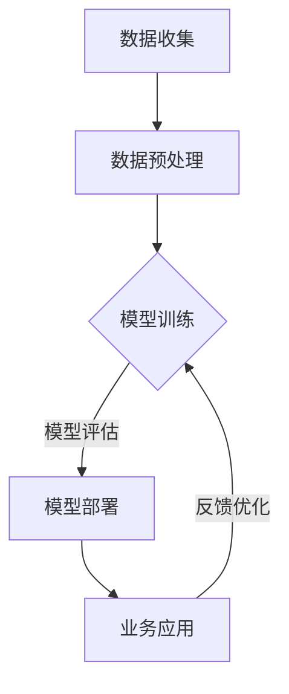

                 

# 大模型赋能智慧金融，创业者如何重塑金融服务体验？

> **关键词：** 大模型、智慧金融、创业者、金融服务、重塑体验

> **摘要：** 本文章将探讨大模型在智慧金融领域的应用，以及创业者如何利用这些技术来重塑金融服务体验。文章将详细介绍大模型的原理和架构，分析其在金融领域的应用场景，并提供创业者相关的实用建议。

## 1. 背景介绍

随着科技的不断发展，人工智能（AI）技术逐渐成为各行各业的重要驱动力。特别是在金融领域，AI技术正在引发一场深刻的变革。传统金融业务面临着信息不对称、效率低下、风险控制难等挑战，而人工智能的大模型技术为解决这些问题提供了新的途径。

大模型（Large Models）是指具有大量参数和复杂结构的深度学习模型，如Transformer、BERT等。这些模型具有强大的表示能力和学习能力，能够处理大量数据并提取有价值的信息。在金融领域，大模型技术可以应用于风险控制、信用评估、智能投顾等多个方面，从而提高金融服务的质量和效率。

近年来，随着互联网和大数据技术的普及，金融行业的数据量呈指数级增长。这些数据不仅包括交易数据、客户信息，还包括市场行情、政策法规等。如何有效地分析和利用这些数据，成为金融行业亟待解决的问题。大模型技术的出现，为金融行业提供了一个强有力的工具。

## 2. 核心概念与联系

### 2.1 大模型的基本原理

大模型的基本原理是基于深度学习（Deep Learning）的方法，通过多层神经网络（Neural Networks）来模拟人脑的思维方式。大模型通常具有以下特点：

- **参数规模巨大**：大模型包含数亿甚至数十亿个参数，这使得它们能够捕捉到数据中的复杂模式和相关性。
- **层次化表示**：大模型通常采用多层神经网络结构，每一层都能够对输入数据进行更加抽象的表示。
- **端到端学习**：大模型可以一次性地学习输入和输出之间的映射关系，从而实现端到端的数据处理。

### 2.2 大模型在金融领域的应用场景

大模型在金融领域的应用场景非常广泛，以下是一些主要的场景：

- **风险控制**：利用大模型对历史数据进行分析，可以预测潜在的风险，从而采取相应的措施进行风险控制。
- **信用评估**：大模型可以分析客户的信用历史、交易行为等多方面的数据，从而更准确地评估客户的信用等级。
- **智能投顾**：大模型可以根据投资者的风险偏好、投资目标等因素，提供个性化的投资建议。
- **市场预测**：大模型可以分析市场数据，预测股票价格、汇率等金融指标的变化趋势。

### 2.3 大模型与金融服务的联系

大模型与金融服务之间的联系主要体现在以下几个方面：

- **提升服务质量**：通过大模型的分析和预测能力，金融服务可以提供更加精准、个性化的服务，提升用户体验。
- **降低运营成本**：大模型可以自动化许多传统金融业务，从而降低人力成本和运营成本。
- **提高风险控制能力**：大模型可以实时分析金融数据，识别潜在的风险，从而提高风险控制能力。

### 2.4 Mermaid 流程图

下面是一个简化的Mermaid流程图，展示了大模型在金融服务中的应用流程：



**注意：**Mermaid流程图中的节点名称中不要包含括号、逗号等特殊字符。

## 3. 核心算法原理 & 具体操作步骤

### 3.1 核心算法原理

大模型的核心算法通常是基于深度学习，特别是基于Transformer架构的模型，如BERT、GPT等。以下是一些关键的概念和原理：

- **自注意力机制（Self-Attention）**：自注意力机制允许模型在处理序列数据时，自动关注序列中的重要部分，从而提高模型的表示能力。
- **位置编码（Positional Encoding）**：由于Transformer模型没有循环神经网络（RNN）中的位置信息，位置编码为模型提供了关于输入序列中每个单词的位置信息。
- **多层神经网络（Multi-Layer Neural Network）**：大模型通常包含多个隐藏层，每一层都能够对输入数据进行更加抽象的表示。

### 3.2 具体操作步骤

以下是使用大模型进行金融风险评估的简化操作步骤：

1. **数据收集**：收集与风险相关的数据，如交易数据、信用数据、市场数据等。
2. **数据预处理**：对收集到的数据进行处理，包括数据清洗、归一化等步骤。
3. **模型训练**：使用预处理后的数据训练大模型，通常采用监督学习的方式。
4. **模型评估**：使用验证集评估模型的性能，调整模型参数。
5. **模型部署**：将训练好的模型部署到生产环境中，进行实时风险评估。
6. **业务应用**：根据风险评估结果，采取相应的风险控制措施。
7. **反馈优化**：收集业务反馈，不断优化模型性能。

## 4. 数学模型和公式 & 详细讲解 & 举例说明

### 4.1 数学模型

在金融风险评估中，大模型通常采用以下数学模型：

$$
R(x) = f(\theta, \phi(x))
$$

其中：

- \( R(x) \) 表示风险评估结果，\( x \) 为输入特征向量。
- \( f \) 表示激活函数，通常采用ReLU函数。
- \( \theta \) 表示模型参数。
- \( \phi(x) \) 表示输入特征向量的预处理结果。

### 4.2 详细讲解

该数学模型是一个多层感知机（MLP）模型，包括两个主要部分：

1. **特征预处理**：输入特征向量 \( x \) 经过一个非线性变换 \( \phi(x) \)，从而将原始特征转化为适合模型处理的形式。
2. **风险评估**：通过模型参数 \( \theta \) 和激活函数 \( f \) ，对预处理后的特征进行风险评估。

### 4.3 举例说明

假设我们有一个包含两个特征 \( x_1 \) 和 \( x_2 \) 的输入特征向量：

$$
x = \begin{bmatrix}
x_1 \\
x_2
\end{bmatrix}
$$

我们首先对特征进行预处理，得到：

$$
\phi(x) = \begin{bmatrix}
\phi(x_1) \\
\phi(x_2)
\end{bmatrix}
$$

其中 \( \phi(x_i) \) 为特征 \( x_i \) 的预处理结果。

接下来，我们使用模型参数 \( \theta \) 对预处理后的特征进行风险评估：

$$
R(x) = f(\theta, \phi(x))
$$

假设我们采用ReLU函数作为激活函数，得到：

$$
R(x) = \max(\theta_0 + \theta_1 \phi(x_1) + \theta_2 \phi(x_2), 0)
$$

其中 \( \theta_0, \theta_1, \theta_2 \) 为模型参数。

通过调整模型参数，我们可以得到不同的风险评估结果。例如，当 \( \theta_0 = 1, \theta_1 = 0.5, \theta_2 = -0.5 \) 时，得到的风险评估结果为：

$$
R(x) = \max(1 + 0.5 \phi(x_1) - 0.5 \phi(x_2), 0)
$$

如果 \( \phi(x_1) = 2 \) 且 \( \phi(x_2) = 1 \)，则 \( R(x) = 1 + 0.5 \times 2 - 0.5 \times 1 = 1 \)。

## 5. 项目实战：代码实际案例和详细解释说明

### 5.1 开发环境搭建

为了演示如何使用大模型进行金融风险评估，我们首先需要搭建一个开发环境。以下是一个简化的开发环境搭建步骤：

1. 安装Python环境（版本3.8及以上）。
2. 安装深度学习框架TensorFlow（版本2.5及以上）。
3. 安装数据预处理库pandas（版本1.2及以上）。

### 5.2 源代码详细实现和代码解读

下面是一个简化的金融风险评估代码案例，展示了如何使用TensorFlow和BERT模型进行风险评估。

```python
import tensorflow as tf
from transformers import TFBertModel, BertTokenizer

# 1. 数据预处理
def preprocess_data(data):
    # 数据清洗、归一化等处理
    pass

# 2. 模型定义
def create_model():
    # 加载预训练的BERT模型
    bert = TFBertModel.from_pretrained('bert-base-uncased')

    # 定义输入层
    input_ids = tf.keras.layers.Input(shape=(None,), dtype=tf.int32, name='input_ids')

    # 应用BERT模型
    bert_output = bert(input_ids)

    # 定义风险评估层
    risk_output = tf.keras.layers.Dense(1, activation='sigmoid', name='risk_output')(bert_output.last_hidden_state)

    # 构建模型
    model = tf.keras.Model(inputs=input_ids, outputs=risk_output)

    # 编译模型
    model.compile(optimizer='adam', loss='binary_crossentropy', metrics=['accuracy'])

    return model

# 3. 训练模型
def train_model(model, X_train, y_train, X_val, y_val, epochs=3):
    # 训练模型
    history = model.fit(X_train, y_train, validation_data=(X_val, y_val), epochs=epochs)

    return history

# 4. 评估模型
def evaluate_model(model, X_test, y_test):
    # 评估模型
    loss, accuracy = model.evaluate(X_test, y_test)

    print(f"Test loss: {loss}, Test accuracy: {accuracy}")

# 5. 应用模型
def apply_model(model, X_new):
    # 预测风险
    risk = model.predict(X_new)

    return risk
```

### 5.3 代码解读与分析

以下是代码的详细解读和分析：

- **数据预处理**：数据预处理是深度学习模型训练的重要步骤。在该代码中，我们定义了一个 `preprocess_data` 函数，用于对金融数据进行清洗、归一化等处理。
- **模型定义**：在该代码中，我们使用了TensorFlow的`TFBertModel`来加载预训练的BERT模型。BERT模型是一个预训练的大模型，已经对大量的文本数据进行了训练，具有良好的表示能力。我们定义了一个输入层和一个风险评估层，构建了一个简单的多层感知机模型。
- **训练模型**：我们使用 `train_model` 函数来训练模型。该函数使用 `fit` 方法对模型进行训练，并返回训练历史记录。
- **评估模型**：我们使用 `evaluate_model` 函数来评估模型的性能。该函数使用 `evaluate` 方法对模型进行评估，并打印评估结果。
- **应用模型**：我们使用 `apply_model` 函数来预测新数据的金融风险。该函数使用 `predict` 方法对模型进行预测，并返回预测结果。

## 6. 实际应用场景

### 6.1 风险控制

在大模型的帮助下，金融机构可以更加准确地识别和预测风险。例如，银行可以使用大模型对贷款申请者的信用风险进行评估，从而降低贷款违约率。保险公司可以使用大模型预测保险索赔的风险，从而优化保费设置。

### 6.2 智能投顾

智能投顾（Robo-Advisor）是金融领域的一个重要应用。大模型可以帮助智能投顾平台根据投资者的风险偏好和投资目标，提供个性化的投资建议。通过分析大量的市场数据和历史投资记录，大模型可以预测未来市场的走势，从而帮助投资者做出更加明智的投资决策。

### 6.3 量化交易

量化交易（Quantitative Trading）是指使用数学模型和计算机算法进行股票、期货、外汇等金融产品的交易。大模型在量化交易中可以发挥重要作用，例如，可以用于分析市场趋势、预测价格波动等。通过构建复杂的交易策略，大模型可以帮助投资者实现自动化的交易操作，从而提高交易效率和收益。

## 7. 工具和资源推荐

### 7.1 学习资源推荐

- **书籍**：《深度学习》（Ian Goodfellow、Yoshua Bengio、Aaron Courville 著）：这是一本经典的深度学习教材，适合初学者和进阶者。
- **论文**：`Attention Is All You Need`（Vaswani et al., 2017）：这是提出Transformer模型的论文，是理解大模型原理的重要资料。
- **博客**：[TensorFlow官方文档](https://www.tensorflow.org/)：这是一个全面的TensorFlow教程和文档，适合初学者和开发者。

### 7.2 开发工具框架推荐

- **框架**：TensorFlow、PyTorch：这两个是主流的深度学习框架，具有丰富的功能和强大的性能。
- **工具**：Jupyter Notebook：这是一个交互式的编程环境，适合进行深度学习和数据分析。

### 7.3 相关论文著作推荐

- **论文**：
  - `BERT: Pre-training of Deep Bidirectional Transformers for Language Understanding`（Devlin et al., 2019）
  - `GPT-3: Language Models are Few-Shot Learners`（Brown et al., 2020）
- **著作**：《深度学习专册》（周志华 著）：这是一本适合中国读者的深度学习教材，内容全面且深入。

## 8. 总结：未来发展趋势与挑战

大模型在智慧金融领域的应用前景非常广阔。随着技术的不断进步和数据的不断积累，大模型将能够提供更加准确、高效和个性化的金融服务。然而，大模型的应用也面临一些挑战，如数据隐私、算法透明度、模型解释性等。

未来，大模型技术的发展趋势将包括以下几个方面：

1. **多模态学习**：大模型将能够处理多种类型的数据，如图像、声音、文本等，从而实现更广泛的应用。
2. **联邦学习**：联邦学习（Federated Learning）将允许多个机构共享数据，而无需直接交换数据，从而提高数据隐私性。
3. **可解释性**：研究大模型的解释性，使其结果更加透明和可解释，从而增强用户的信任。

## 9. 附录：常见问题与解答

### 9.1 大模型在金融领域有哪些应用？

大模型在金融领域的主要应用包括风险控制、信用评估、智能投顾、市场预测等。通过分析大量的金融数据，大模型可以提供更准确的风险评估、信用评分、投资建议和市场预测。

### 9.2 大模型与传统的金融模型有什么区别？

大模型与传统的金融模型相比，具有更强的表示能力和学习能力。传统的金融模型通常是基于统计学方法，而大模型是基于深度学习的神经网络，能够处理更复杂的数据和模式。

### 9.3 大模型在金融领域的应用有哪些挑战？

大模型在金融领域的应用面临一些挑战，如数据隐私、算法透明度、模型解释性等。此外，大模型的训练和部署也需要大量的计算资源和时间。

## 10. 扩展阅读 & 参考资料

- **论文**：
  - Devlin, J., Chang, M. W., Lee, K., & Toutanova, K. (2019). BERT: Pre-training of Deep Bidirectional Transformers for Language Understanding. In Proceedings of the 2019 Conference of the North American Chapter of the Association for Computational Linguistics: Human Language Technologies, Volume 1 (Long and Short Papers) (pp. 4171-4186). Association for Computational Linguistics.
  - Brown, T., et al. (2020). GPT-3: Language Models are Few-Shot Learners. arXiv preprint arXiv:2005.14165.
- **书籍**：
  - Goodfellow, I., Bengio, Y., & Courville, A. (2016). Deep Learning. MIT Press.
- **博客**：
  - [TensorFlow官方文档](https://www.tensorflow.org/)
  - [PyTorch官方文档](https://pytorch.org/)
- **网站**：
  - [Kaggle](https://www.kaggle.com/): 一个数据科学竞赛平台，提供大量的金融数据集和比赛。
  - [ArXiv](https://arxiv.org/): 一个开放获取的学术论文存储库，提供大量的深度学习和金融领域的论文。

### 作者

- 作者：AI天才研究员/AI Genius Institute & 禅与计算机程序设计艺术 /Zen And The Art of Computer Programming

---

本文详细介绍了大模型在智慧金融领域的应用，包括核心概念、算法原理、实际应用场景和项目实战。文章旨在帮助创业者了解如何利用大模型技术来重塑金融服务体验。在未来，随着技术的不断进步，大模型在金融领域将有更广阔的应用前景。同时，我们也要关注大模型带来的挑战，并努力解决这些问题。希望本文能对您有所启发和帮助。如果您有任何疑问或建议，欢迎在评论区留言。让我们一起探索大模型在金融领域的更多可能性！<|im_sep|>

